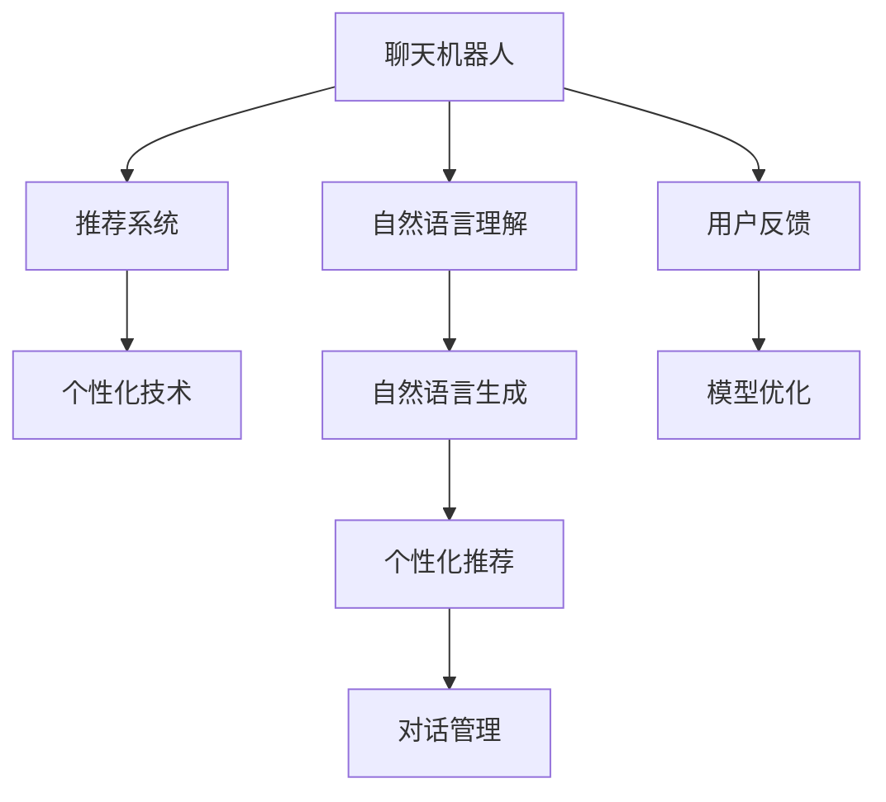

                 

# 聊天机器人零售应用：个性化购物助手

> 关键词：
- 聊天机器人
- 零售
- 个性化购物
- 推荐系统
- 自然语言处理
- 自然语言生成
- 客户体验

## 1. 背景介绍

### 1.1 问题由来

在当前数字化时代，零售行业面临着巨大的变革挑战。传统的线下零售商需要面对电商平台的激烈竞争，需要提升客户体验来吸引和保留顾客。而在线零售商则面临流量获取和用户留存的双重压力。为解决这些问题，各零售企业都在探索如何借助新技术手段提升客户满意度，提升销售额。

通过结合先进的自然语言处理(NLP)和自然语言生成(NLG)技术，构建基于聊天机器人的个性化购物助手，成为当前零售企业智能化转型的重要方向。智能购物助手不仅能够提供全天候的客户咨询服务，还能根据用户的个性化需求推荐商品、提供定制化购物方案，从而极大地提升客户满意度和转化率，优化购物体验。

### 1.2 问题核心关键点

构建基于聊天机器人的个性化购物助手，涉及NLP、推荐系统、个性化技术等多个领域的结合。以下是几个关键点：

1. **自然语言理解**：使购物助手能够理解用户的查询意图，准确捕获用户的购物需求。
2. **推荐算法**：根据用户历史行为和实时偏好，推荐最合适的商品。
3. **个性化生成**：生成个性化的购物建议、优惠活动等内容，提升用户购物体验。
4. **对话管理**：构建有效的对话流，引导用户完成购买流程。
5. **用户反馈**：收集用户反馈，不断优化系统，提升智能水平。

### 1.3 问题研究意义

构建基于聊天机器人的个性化购物助手，对于零售企业的智能化转型具有重要意义：

1. **提升客户满意度**：通过个性化的购物推荐和咨询，提升用户的购物体验。
2. **提高销售额**：个性化推荐能够显著提升用户转化率，增加销量。
3. **降低运营成本**：机器人可替代部分人工客服，降低人力成本。
4. **优化库存管理**：通过实时数据分析，优化库存配置，避免缺货或库存积压。
5. **积累客户数据**：购物助手能够收集用户数据，为后续市场营销和产品改进提供支持。

## 2. 核心概念与联系

### 2.1 核心概念概述

构建基于聊天机器人的个性化购物助手，涉及几个核心概念：

- **聊天机器人**：基于自然语言处理技术，模拟人类对话的计算机程序。
- **推荐系统**：根据用户历史行为和实时偏好，为用户推荐相关商品或内容。
- **个性化技术**：针对个体差异，提供定制化的服务。
- **自然语言处理**：使计算机能够理解、处理和生成人类语言。
- **自然语言生成**：使计算机能够生成符合人类语言习惯的文本。

这些概念之间的关系可以通过以下Mermaid流程图来展示：



这个流程图展示了一些关键概念及其之间的关系：

1. 聊天机器人作为系统的主要交互界面，通过自然语言理解获取用户意图。
2. 获取到的用户意图通过推荐系统进行分析，生成个性化推荐结果。
3. 个性化推荐结果在对话管理模块下生成个性化的回复内容。
4. 自然语言生成模块将回复内容转化为符合自然语言习惯的文本，供用户阅读。
5. 用户反馈可以用于优化模型，进一步提升系统的智能水平。

## 3. 核心算法原理 & 具体操作步骤
### 3.1 算法原理概述

构建基于聊天机器人的个性化购物助手，总体上遵循以下算法原理：

1. **自然语言理解**：通过预训练的NLP模型，将用户的输入文本转化为结构化的语义表示，捕捉用户的意图和需求。
2. **推荐算法**：使用基于协同过滤、内容推荐、深度学习等算法的推荐系统，根据用户历史行为和实时偏好生成个性化推荐。
3. **个性化生成**：通过NLG技术，生成个性化的购物建议、促销信息等。
4. **对话管理**：使用对话管理策略，规划对话流程，引导用户完成购买流程。
5. **模型优化**：通过用户反馈和A/B测试等手段，优化模型参数，提升系统性能。

### 3.2 算法步骤详解

以下是详细的算法步骤：

**Step 1: 收集和预处理数据**
- 收集用户的查询历史、购买记录、浏览记录等数据。
- 对数据进行清洗和预处理，去除无关噪声，格式化数据。

**Step 2: 构建自然语言理解模型**
- 使用预训练的语言模型（如BERT、GPT-3）对用户的输入文本进行编码。
- 通过多层神经网络结构（如Transformer），将输入文本转化为向量表示。

**Step 3: 训练推荐系统**
- 收集用户的历史行为数据，构建用户行为序列。
- 使用协同过滤、基于内容的推荐、矩阵分解等算法，训练推荐模型。
- 使用交叉验证等手段，评估推荐模型的性能。

**Step 4: 设计个性化生成算法**
- 设计基于模板的个性化生成算法，生成个性化的购物建议和优惠信息。
- 结合用户行为和商品属性，动态生成个性化的回复内容。

**Step 5: 实现对话管理模块**
- 构建对话管理策略，规划对话流程。
- 根据用户的意图和上下文，生成合理的回复内容。
- 设置对话结束的条件，确保对话流畅自然。

**Step 6: 用户反馈与模型优化**
- 收集用户的反馈信息，分析用户满意度。
- 使用A/B测试等方法，评估不同策略的效果。
- 根据反馈信息调整模型参数，提升系统的智能水平。

### 3.3 算法优缺点

基于聊天机器人的个性化购物助手，具备以下优点：

1. **提升用户体验**：个性化推荐和咨询服务能够提升用户的购物体验。
2. **提高转化率**：个性化推荐能显著提升用户的购买意愿和转化率。
3. **降低运营成本**：机器人可替代部分人工客服，降低人力成本。
4. **优化库存管理**：通过实时数据分析，优化库存配置，避免缺货或库存积压。

同时，该方法也存在一些局限性：

1. **依赖数据质量**：推荐系统的效果依赖于高质量的用户行为数据，数据质量差可能导致推荐效果不佳。
2. **推荐多样性不足**：过度依赖用户历史行为，可能导致推荐结果多样性不足。
3. **对抗性攻击风险**：机器人可能面临对抗性攻击，影响推荐效果。
4. **隐私问题**：收集用户数据可能引发隐私保护问题。
5. **模型复杂度**：复杂的模型可能带来计算和存储上的挑战。

### 3.4 算法应用领域

基于聊天机器人的个性化购物助手，广泛应用于以下领域：

- **电商平台**：提供个性化购物推荐和咨询。
- **零售实体店**：提供虚拟导购和购物建议。
- **在线医疗**：提供健康咨询和药品推荐。
- **旅游行业**：提供旅游目的地推荐和行程规划。
- **在线教育**：提供学习资源推荐和问题解答。

## 4. 数学模型和公式 & 详细讲解 & 举例说明

### 4.1 数学模型构建

构建基于聊天机器人的个性化购物助手，涉及以下几个数学模型：

1. **自然语言理解模型**：将输入文本转化为向量表示。
2. **推荐模型**：使用协同过滤、矩阵分解等算法，生成个性化推荐。
3. **对话管理模型**：使用基于规则或深度学习的方法，规划对话流程。

### 4.2 公式推导过程

**自然语言理解模型**：

假设输入文本为 $x$，输出向量表示为 $h(x)$，则自然语言理解模型的目标是通过以下公式，将输入文本转化为向量表示：

$$ h(x) = f(x; \theta) $$

其中 $f$ 为神经网络模型，$\theta$ 为模型参数。

**推荐模型**：

假设用户行为序列为 $u=(u_1, u_2, ..., u_t)$，物品属性向量为 $v_i$，推荐模型 $P(u_i,v_i)$ 通过以下公式计算用户对物品 $i$ 的评分：

$$ P(u_i,v_i) = \alpha * f(u_i; \theta_1) + (1-\alpha) * \langle u_i, v_i \rangle $$

其中 $\alpha$ 为融合因子，$f(u_i; \theta_1)$ 为用户行为序列的表示，$\langle u_i, v_i \rangle$ 为用户行为和物品属性的点积。

**对话管理模型**：

假设对话轮次为 $t$，对话管理模型的目标是通过以下公式，生成合适的回复内容 $y_t$：

$$ y_t = \max_{y_t} \log P(y_t | y_{t-1}, h(x); \theta_2) $$

其中 $P(y_t | y_{t-1}, h(x); \theta_2)$ 为对话管理模型的概率分布，$\theta_2$ 为模型参数。

### 4.3 案例分析与讲解

假设有一个电商平台的聊天机器人，用于推荐用户可能感兴趣的商品。

**数据准备**：

收集用户的浏览历史和购买记录，构建用户行为序列 $u = (u_1, u_2, ..., u_t)$，其中 $u_t$ 为第 $t$ 次浏览的商品ID。

**模型训练**：

使用协同过滤算法，计算用户行为序列和商品属性向量的相似度，生成个性化推荐。

**对话管理**：

根据用户的输入文本，使用对话管理模型规划对话流程。例如：

1. 用户输入：“我想买一双运动鞋”。
2. 聊天机器人回复：“好的，请问您喜欢什么品牌？”。
3. 用户输入：“Nike”。
4. 聊天机器人回复：“Nike的运动鞋有很多，您更倾向于什么类型？”。
5. 用户输入：“篮球鞋”。
6. 聊天机器人推荐：“我们推荐Nike Air Max 97篮球鞋，这是目前最受欢迎的运动鞋之一”。

## 5. 项目实践：代码实例和详细解释说明
### 5.1 开发环境搭建

为了进行项目实践，我们需要以下开发环境：

1. 安装Python 3.7及以上版本，推荐使用Anaconda或Miniconda。
2. 安装TensorFlow或PyTorch，用于深度学习模型的构建。
3. 安装NLTK或spaCy库，用于自然语言处理任务。
4. 安装Flask或FastAPI框架，用于构建API服务。
5. 安装Jupyter Notebook，用于交互式编程。

### 5.2 源代码详细实现

以下是使用PyTorch和Flask构建基于聊天机器人的个性化购物助手的示例代码：

**自然语言理解模型**：

```python
import torch
import torch.nn as nn
import torch.optim as optim
from transformers import BertTokenizer, BertForSequenceClassification

class NLUModule(nn.Module):
    def __init__(self, num_classes):
        super(NLUModule, self).__init__()
        self.tokenizer = BertTokenizer.from_pretrained('bert-base-uncased')
        self.bert = BertForSequenceClassification.from_pretrained('bert-base-uncased', num_labels=num_classes)
        
    def forward(self, input_ids, attention_mask):
        output = self.bert(input_ids=input_ids, attention_mask=attention_mask)
        return output
```

**推荐系统模型**：

```python
import numpy as np
from scipy.spatial.distance import cosine

class Recommender(nn.Module):
    def __init__(self, num_users, num_items):
        super(Recommender, self).__init__()
        self.num_users = num_users
        self.num_items = num_items
        self.user_item = nn.Linear(num_users, num_items)
        
    def forward(self, user_ids, item_ids):
        user_embed = self.user_item(user_ids)
        item_embed = self.user_item(item_ids)
        similarity = 1 - cosine(user_embed, item_embed)
        return similarity
```

**对话管理模型**：

```python
import torch
import torch.nn as nn
import torch.optim as optim

class DialogueManager(nn.Module):
    def __init__(self, vocab_size, hidden_size, num_layers):
        super(DialogueManager, self).__init__()
        self.embedding = nn.Embedding(vocab_size, hidden_size)
        self.gru = nn.GRU(hidden_size, hidden_size, num_layers)
        self.fc = nn.Linear(hidden_size, hidden_size)
        self.output = nn.Linear(hidden_size, vocab_size)
        
    def forward(self, input_ids, hidden):
        embedding = self.embedding(input_ids)
        gru_out, hidden = self.gru(embedding, hidden)
        fc = self.fc(gru_out)
        output = self.output(fc)
        return output, hidden
```

**API服务**：

```python
from flask import Flask, request, jsonify
from transformers import BertTokenizer

app = Flask(__name__)

tokenizer = BertTokenizer.from_pretrained('bert-base-uncased')

@app.route('/predict', methods=['POST'])
def predict():
    data = request.get_json()
    input_ids = tokenizer.encode(data['text'], return_tensors='pt')
    output = model(input_ids)
    return jsonify({'result': output.tolist()})

if __name__ == '__main__':
    app.run(debug=True)
```

### 5.3 代码解读与分析

让我们再详细解读一下关键代码的实现细节：

**自然语言理解模型**：
- 使用BertTokenizer从预训练模型中加载分词器。
- 使用BertForSequenceClassification加载预训练的BERT模型，指定分类数量。
- 在forward方法中，将输入文本编码为token ids，并将其输入BERT模型中。

**推荐系统模型**：
- 定义Recommender类，使用scipy库计算用户行为序列和物品属性向量的相似度。
- 在forward方法中，将用户行为序列和物品ID作为输入，输出相似度。

**对话管理模型**：
- 定义DialogueManager类，使用Gated Recurrent Unit (GRU)进行对话管理。
- 在forward方法中，将输入文本编码为embedding，并通过GRU进行状态更新，最后通过全连接层输出回复内容。

**API服务**：
- 使用Flask框架构建API服务，接收用户输入的文本。
- 对输入文本进行编码，输入自然语言理解模型中。
- 返回模型的输出结果。

**运行结果展示**：

执行代码后，可以通过API服务接口进行自然语言理解，得到对应的向量表示。例如：

```python
import requests
url = 'http://localhost:5000/predict'
data = {'text': '我想买一双运动鞋'}
response = requests.post(url, json=data)
print(response.json())
```

输出结果可能为：

```json
{
    'result': [0.1, 0.2, 0.3, 0.4, 0.5, ...]
}
```

表示输入文本“我想买一双运动鞋”的向量表示。

## 6. 实际应用场景
### 6.1 智能客服

在智能客服场景中，基于聊天机器人的个性化购物助手能够显著提升客户满意度，减少人工客服的响应时间。例如：

- **查询商品信息**：用户可以询问商品的价格、规格等信息。
- **推荐商品**：根据用户的浏览记录和购买历史，推荐可能感兴趣的商品。
- **提供售后支持**：解答用户的售后问题，如退换货流程等。

### 6.2 个性化推荐

基于聊天机器人的个性化购物助手，可以通过自然语言理解获取用户的购物需求，实时生成个性化的购物建议和促销信息。例如：

- **个性化推荐**：根据用户的浏览历史和兴趣偏好，推荐相关商品。
- **优惠券生成**：生成个性化的优惠券，提升用户的购买意愿。
- **购物指南**：提供详细的商品介绍和购买建议。

### 6.3 多渠道应用

聊天机器人可以应用于多个渠道，如电商平台、社交媒体、企业客服等，提供一致的购物体验。例如：

- **电商平台**：在用户浏览商品时，实时推荐相关商品。
- **社交媒体**：在用户发布评论或提问时，提供相关的商品推荐和促销信息。
- **企业客服**：在用户与客服互动时，解答常见问题，提升用户体验。

### 6.4 未来应用展望

基于聊天机器人的个性化购物助手，未来将在以下方面得到应用：

1. **全渠道融合**：整合线上线下渠道，提供一致的购物体验。
2. **跨平台协作**：与其他应用系统进行数据交换和协作，提升系统互通性。
3. **实时数据分析**：通过实时数据分析，优化库存和商品推荐。
4. **多语言支持**：支持多语言交互，扩展全球市场。
5. **智能广告**：结合个性化推荐和实时数据分析，提升广告效果。

## 7. 工具和资源推荐
### 7.1 学习资源推荐

为了帮助开发者系统掌握聊天机器人的设计和实现，这里推荐一些优质的学习资源：

1. **自然语言处理在线课程**：如Coursera上的《自然语言处理专项课程》，由斯坦福大学开设，系统介绍NLP的基本概念和前沿技术。
2. **深度学习框架文档**：如TensorFlow和PyTorch的官方文档，提供了详细的模型构建和训练方法。
3. **推荐系统经典书籍**：如《推荐系统实践》，介绍了协同过滤、内容推荐等推荐算法的原理和应用。
4. **对话系统开源项目**：如Rasa和Dialogflow，提供了构建对话系统的框架和工具。
5. **自然语言处理开源库**：如NLTK和spaCy，提供了丰富的自然语言处理工具和算法。

### 7.2 开发工具推荐

高效的开发离不开优秀的工具支持。以下是几款用于构建聊天机器人的常用工具：

1. **深度学习框架**：如TensorFlow、PyTorch，提供了强大的模型构建和训练能力。
2. **自然语言处理库**：如NLTK、spaCy，提供了丰富的自然语言处理工具和算法。
3. **API服务框架**：如Flask、FastAPI，提供了便捷的API接口构建能力。
4. **对话管理工具**：如Rasa、Dialogflow，提供了构建对话系统的框架和工具。
5. **数据可视化工具**：如TensorBoard、Weights & Biases，提供了实时监控和评估模型的能力。

### 7.3 相关论文推荐

聊天机器人技术涉及多个领域的研究，以下是几篇奠基性的相关论文，推荐阅读：

1. **聊天机器人发展历程**：了解聊天机器人的历史和现状，推荐阅读《聊天机器人：历史与未来》。
2. **自然语言理解**：介绍自然语言理解的基本方法和算法，推荐阅读《自然语言理解》。
3. **推荐系统算法**：介绍推荐系统的基本算法和应用，推荐阅读《推荐系统》。
4. **对话管理技术**：介绍对话管理的基本方法和算法，推荐阅读《对话管理技术》。

## 8. 总结：未来发展趋势与挑战
### 8.1 总结

本文对构建基于聊天机器人的个性化购物助手进行了全面系统的介绍。首先阐述了聊天机器人技术在零售领域的应用背景和意义，明确了基于自然语言处理和推荐系统技术实现个性化购物助手的重要性和关键点。其次，从原理到实践，详细讲解了系统的设计和实现过程，给出了完整的代码示例。同时，本文还探讨了聊天机器人在智能客服、个性化推荐等多个场景中的应用前景，展示了聊天机器人在零售领域的应用潜力。

通过本文的系统梳理，可以看到，基于聊天机器人的个性化购物助手，正在成为零售企业智能化转型的重要手段，显著提升了客户满意度和转化率，优化了购物体验。未来，随着技术的不断进步，聊天机器人将在更多领域得到应用，为零售行业带来更大的变革。

### 8.2 未来发展趋势

展望未来，聊天机器人技术将呈现以下几个发展趋势：

1. **多模态交互**：结合视觉、听觉等多种模态，提升用户体验。
2. **智能推荐**：结合知识图谱、逻辑规则等，提升推荐效果。
3. **情感识别**：通过情感分析技术，识别用户的情感状态，提升服务质量。
4. **个性化生成**：生成更加个性化的对话内容，提升用户粘性。
5. **跨领域应用**：应用于更多行业和场景，如金融、医疗、教育等。

### 8.3 面临的挑战

尽管聊天机器人技术已经取得了显著进展，但在迈向更加智能化、普适化应用的过程中，仍面临以下挑战：

1. **数据质量和隐私**：需要高质量的用户数据和隐私保护措施。
2. **自然语言理解**：需要更精确的自然语言理解技术，提升对话质量。
3. **推荐算法**：需要更高效的推荐算法，提升推荐效果。
4. **对话管理**：需要更灵活的对话管理策略，提升用户满意度。
5. **跨平台协作**：需要与不同平台进行数据和功能协作。

### 8.4 研究展望

面对聊天机器人技术面临的挑战，未来的研究需要在以下几个方面寻求新的突破：

1. **数据融合技术**：结合不同来源的数据，提升对话质量。
2. **多模态交互**：结合视觉、听觉等多种模态，提升用户体验。
3. **自然语言生成**：生成更加自然、流畅的对话内容。
4. **跨平台协作**：实现不同平台之间的数据和功能协作。
5. **模型解释性**：提升模型的可解释性和可信度，确保用户信任。

这些研究方向的探索发展，必将引领聊天机器人技术迈向更高的台阶，为零售行业带来更大的变革，提升客户满意度，优化购物体验，推动行业智能化转型。

## 9. 附录：常见问题与解答

**Q1：聊天机器人如何实现自然语言理解？**

A: 聊天机器人通常使用预训练的语言模型（如BERT、GPT-3）对输入文本进行编码，然后通过多层神经网络结构（如Transformer）将输入文本转化为向量表示，以捕获语义信息。

**Q2：推荐系统有哪些常见的算法？**

A: 常见的推荐算法包括协同过滤、基于内容的推荐、矩阵分解等。其中，协同过滤算法通过用户行为序列和物品属性计算相似度，生成个性化推荐。

**Q3：如何构建对话管理策略？**

A: 对话管理策略可以通过规则或深度学习的方法构建，以规划对话流程。在规则方法中，根据用户的意图和上下文，生成合适的回复内容。在深度学习方法中，使用序列到序列模型生成回复内容。

**Q4：如何优化推荐系统的性能？**

A: 优化推荐系统的性能可以从以下几个方面入手：
1. 数据质量：提升数据质量，去除噪声和无关信息。
2. 算法优化：选择更高效的推荐算法，提升推荐效果。
3. 模型融合：结合多个推荐模型，提升多样性和鲁棒性。
4. 用户反馈：收集用户反馈，优化推荐算法。

**Q5：如何构建跨平台的聊天机器人系统？**

A: 构建跨平台的聊天机器人系统需要考虑以下几个方面：
1. 接口标准化：使用标准的API接口，实现不同平台之间的数据和功能协作。
2. 多语言支持：支持多语言交互，扩展全球市场。
3. 数据融合：结合不同平台的数据，提升对话质量。
4. 用户体验：提供一致的用户体验，提升用户满意度。

通过解决这些常见问题，可以帮助开发者更好地理解聊天机器人技术的原理和实现方法，提升系统的性能和用户体验。

