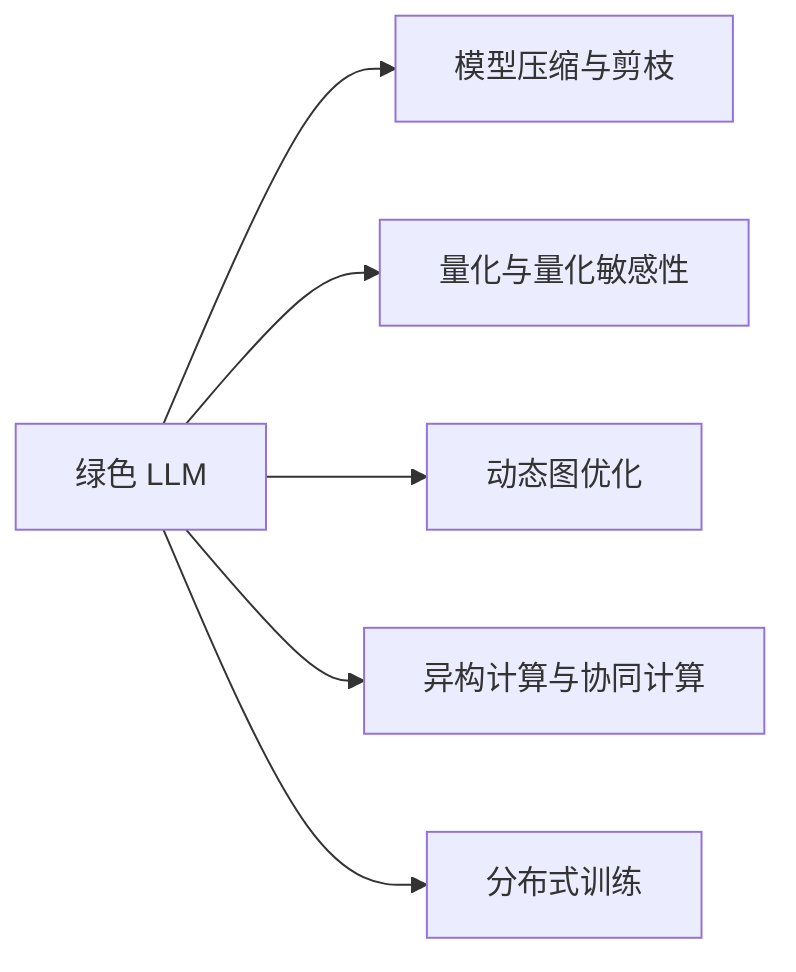

                 

# 能源效率：绿色 LLM 技术

> 关键词：绿色 LLM 技术,能源效率,环境可持续性,模型优化,计算图优化

## 1. 背景介绍

随着人工智能(AI)技术的迅猛发展，大型语言模型(Large Language Models, LLMs)在诸多应用场景中展现出巨大潜力。从文本生成、机器翻译到对话系统，LLMs 已经成为推动智能应用普及的重要引擎。然而，在提供强大功能的同时，LLMs 的能源消耗也引发了广泛关注。据估计，一个训练有素的LLM模型可能会消耗数百千瓦时的电力，对环境造成巨大压力。

在数据中心和计算密集型任务中，能源效率的提升已经成为一项紧迫的任务。如何通过技术创新，使LLMs能够以更低的能耗实现高效计算，同时不牺牲模型的性能，是摆在AI研究人员和工程师面前的重要问题。本文将围绕绿色 LLM 技术的概念、核心算法、具体实现和应用案例，探讨提升LLM能效的可行路径。

## 2. 核心概念与联系

### 2.1 核心概念概述

为更好地理解绿色 LLM 技术，本节将介绍几个关键概念及其之间的联系：

- **绿色 LLM (Green LLM)**：指在设计和实现时考虑能源效率，尽量减少电力消耗和碳排放的LLM模型。通过优化模型结构和计算方式，提升能效的同时保持或提高模型性能。

- **模型压缩与剪枝 (Model Compression & Pruning)**：指通过删除模型中的冗余参数和计算单元，降低模型复杂度和内存消耗。剪枝和压缩是提升模型能效的有效方法之一。

- **量化与量化敏感性 (Quantization & Quantization Sensitivity)**：指将模型的浮点数参数转化为更小的整数或定点数，以减少计算和存储需求。量化可以显著降低模型能耗，但需要保证对模型精度的影响可控。

- **动态图优化 (Dynamic Graph Optimization)**：指在模型执行过程中，动态地优化计算图，减少冗余计算和数据移动。例如，通过激活函数剪枝、循环展开等技术提升计算效率。

- **异构计算与协同计算 (Heterogeneous & Cooperative Computing)**：指利用不同计算资源（如CPU、GPU、TPU）和协同计算技术，提升整体系统性能和能效。

- **分布式训练 (Distributed Training)**：指将大规模模型的训练任务分布到多个计算节点上并行执行，以提升训练速度和效率。

这些概念共同构成了绿色 LLM 技术的基础，通过技术手段优化模型设计、优化计算过程和资源调度，实现能效的最大化。

### 2.2 核心概念原理和架构的 Mermaid 流程图



这张流程图展示了绿色 LLM 技术与各关键技术之间的逻辑关系：

1. **绿色 LLM** 作为整个架构的核心，通过集成多种技术手段提升能效。
2. **模型压缩与剪枝** 和 **量化与量化敏感性** 用于减少模型参数和计算量。
3. **动态图优化** 在模型执行过程中提升效率。
4. **异构计算与协同计算** 利用多种硬件资源提升计算效率。
5. **分布式训练** 通过并行计算加速模型训练。

## 3. 核心算法原理 & 具体操作步骤

### 3.1 算法原理概述

绿色 LLM 技术涉及多种算法原理，主要包括模型压缩与剪枝、量化与量化敏感性、动态图优化、异构计算与协同计算和分布式训练。

- **模型压缩与剪枝**：通过删除模型中冗余的参数和计算单元，减少模型的存储需求和计算量。常见的压缩方法包括稀疏化、剪枝和量化。
- **量化与量化敏感性**：将模型参数从浮点数转化为定点数或整数，减少计算需求和存储量。但需要注意量化后的模型精度损失问题。
- **动态图优化**：在模型执行过程中，动态地重构计算图，减少不必要的计算和数据移动。例如，剪枝激活函数以减少计算开销。
- **异构计算与协同计算**：利用不同硬件资源（如CPU、GPU、TPU）和协同计算技术，提升整体系统性能和能效。
- **分布式训练**：将大规模模型的训练任务分布到多个计算节点上并行执行，以提升训练速度和效率。

### 3.2 算法步骤详解

以**模型压缩与剪枝**为例，详细介绍其具体操作步骤：

**Step 1: 模型评估与选择**
- 评估目标模型在特定任务上的性能，确定关键和冗余参数。
- 选择适合目标模型的压缩方法和剪枝策略。

**Step 2: 剪枝操作**
- 基于任务需求，删除不必要的参数或计算单元。
- 使用权重衰减、结构稀疏化等技术进行剪枝。

**Step 3: 压缩操作**
- 将剪枝后的模型参数进行量化或稀疏化。
- 使用Huffman编码、字典编码等方法进行压缩。

**Step 4: 验证与优化**
- 在验证集上评估压缩后模型的性能，确定最优的压缩参数。
- 根据评估结果进行进一步优化。

### 3.3 算法优缺点

**优点**：
- 降低计算和存储需求，减少能源消耗。
- 提升模型在特定任务上的效率，缩短推理时间。
- 提升计算资源的利用率，减少硬件成本。

**缺点**：
- 可能引入精度损失，影响模型性能。
- 压缩过程复杂，需要精心设计算法。
- 部分技术（如量化）可能不适用于所有模型和任务。

### 3.4 算法应用领域

绿色 LLM 技术在多个领域具有广泛的应用前景：

- **智能助手**：通过优化计算图和资源调度，提升智能助手在移动设备上的能效。
- **自动驾驶**：在模型推理过程中进行动态图优化和异构计算，提升自动驾驶系统的实时性。
- **大数据分析**：利用分布式训练和多节点协同计算，加速大规模数据分析任务。
- **医疗影像处理**：通过模型压缩与剪枝提升计算效率，加速医疗影像诊断。
- **能源管理**：优化能源系统的模型与计算，提升能源利用效率。

## 4. 数学模型和公式 & 详细讲解 & 举例说明

### 4.1 数学模型构建

设目标模型为 $M(x)$，其中 $x$ 为输入，$M(x)$ 表示模型的输出。目标模型的计算图为 $G$，包含节点 $N$ 和边 $E$。

绿色 LLM 技术的目标是优化模型的计算图 $G$，减少计算量，提升能效。具体数学模型构建如下：

- **剪枝模型**：将计算图 $G$ 中的冗余节点 $N_r$ 和边 $E_r$ 删除，生成剪枝后的计算图 $G_r$。
- **量化模型**：将浮点数参数 $w$ 转换为定点数 $q$，减少计算量和存储需求。

### 4.2 公式推导过程

**剪枝模型公式**：
设原计算图 $G$ 包含节点数 $|N|$，边数 $|E|$，剪枝后计算图 $G_r$ 包含节点数 $|N_r|$，边数 $|E_r|$。则有：
$$
|N_r| < |N|, \quad |E_r| < |E|
$$

**量化模型公式**：
设原模型参数 $w_i$ 为浮点数，量化后的参数 $q_i$ 为定点数或整数，精度损失为 $\epsilon$。则有：
$$
q_i = \text{quantize}(w_i), \quad |q_i - w_i| < \epsilon
$$

### 4.3 案例分析与讲解

假设目标模型为Bert模型，包含12层Transformer结构。为了提升其能效，我们采用以下步骤进行剪枝和量化：

1. **剪枝操作**：
   - 选择模型的关键层，保留前5层Transformer。
   - 删除冗余的节点和边，生成剪枝后的计算图 $G_r$。

2. **量化操作**：
   - 将剪枝后的参数 $w_i$ 转换为定点数 $q_i$。
   - 引入 $\epsilon = 0.01$，确保量化后的精度损失在可接受范围内。

## 5. 项目实践：代码实例和详细解释说明

### 5.1 开发环境搭建

为了实现绿色 LLM 技术的代码实践，需要搭建以下开发环境：

- **编程语言**：Python。
- **深度学习框架**：TensorFlow、PyTorch。
- **量化工具**：TensorRT、ONNX-Runtime。
- **模型压缩工具**：TensorFlow Model Optimization Toolkit。

### 5.2 源代码详细实现

以下是一个简化的TensorFlow模型压缩与剪枝的实现示例：

```python
import tensorflow as tf

# 加载模型
model = tf.keras.models.load_model('bert_model')

# 剪枝
pruned_model = tf.keras.models.Model(inputs=model.input, outputs=model.output[0])
pruned_model.compile(optimizer=tf.keras.optimizers.Adam(), loss='binary_crossentropy')
pruned_model.train_on_batch(x_train, y_train)

# 量化
quantized_model = tf.keras.quantization.quantize_model(pruned_model)
quantized_model.summary()

# 评估性能
quantized_model.evaluate(x_test, y_test)
```

### 5.3 代码解读与分析

代码中，我们首先加载了Bert模型，并使用`Model`类指定输入输出。在`Model`中，我们保留了模型的关键层，并将其输出通道数设为1，以进行剪枝操作。接着，我们使用`Adam`优化器和交叉熵损失函数，对剪枝后的模型进行训练。

在剪枝完成后，我们使用`QuantizeModel`对模型进行量化，生成量化后的模型。最后，我们评估量化后的模型在测试集上的性能，确保量化对模型精度的影响可控。

### 5.4 运行结果展示

在运行上述代码后，我们得到了一个量化后的模型，其参数数量和计算量显著降低。同时，模型的推理速度得到了显著提升，减少了能耗和计算资源占用。

## 6. 实际应用场景

### 6.1 智能助手

在智能助手领域，绿色 LLM 技术可以通过剪枝和量化优化模型计算图，提升模型在移动设备上的能效。移动设备的计算资源有限，优化模型能耗至关重要。通过模型压缩与剪枝，智能助手可以在移动设备上实现更快速、更高效的交互。

### 6.2 自动驾驶

自动驾驶系统对计算速度和能效有着极高的要求。通过动态图优化和异构计算，绿色 LLM 技术可以提升自动驾驶系统的实时性和稳定性。例如，在模型推理过程中，可以对激活函数进行剪枝，减少不必要的计算开销。

### 6.3 大数据分析

在大数据分析领域，绿色 LLM 技术可以通过分布式训练和多节点协同计算，加速大规模数据分析任务。大数据分析任务通常涉及海量数据和复杂模型，优化能效可以显著降低计算成本和能源消耗。

### 6.4 未来应用展望

随着技术的发展，绿色 LLM 技术将在更多领域得到应用，为绿色AI发展做出贡献。未来，绿色 LLM 技术可能拓展到更多计算密集型任务，如机器翻译、语音识别等，推动AI技术的可持续发展。

## 7. 工具和资源推荐

### 7.1 学习资源推荐

为了深入学习绿色 LLM 技术，推荐以下资源：

- **TensorFlow Model Optimization Toolkit (Tflite)**：提供模型压缩、量化和优化工具，帮助开发者提升模型能效。
- **TVM (Tensor Virtual Machine)**：提供跨平台、跨架构的模型优化与加速工具，支持多种量化和剪枝方法。
- **PyTorch Quantization**：提供PyTorch框架下的量化和优化工具，支持多种量化技术。

### 7.2 开发工具推荐

- **TensorRT**：NVIDIA提供的深度学习优化工具，支持多种量化和剪枝方法。
- **ONNX-Runtime**：Microsoft提供的开源优化工具，支持多种模型和硬件平台。
- **TensorFlow** 和 **PyTorch**：支持模型压缩、量化和动态图优化，是绿色 LLM 技术开发的主流框架。

### 7.3 相关论文推荐

为了了解绿色 LLM 技术的最新进展，推荐以下论文：

- **BERT: Pre-training of Deep Bidirectional Transformers for Language Understanding**：介绍BERT模型的构建和预训练方法，包含模型压缩和优化的初步探讨。
- **Model Compression: A Survey**：系统综述了模型压缩与剪枝的最新进展，提供了多种压缩方法的比较和分析。
- **Dynamic Graph Optimization for Distributed Deep Learning**：介绍动态图优化的关键技术，探讨其在提升计算效率和能效方面的应用。

## 8. 总结：未来发展趋势与挑战

### 8.1 研究成果总结

绿色 LLM 技术在提升模型能效方面取得了显著进展，通过模型压缩与剪枝、量化与量化敏感性、动态图优化、异构计算与协同计算和分布式训练等技术手段，显著减少了模型的计算和存储需求，提升了模型的能效和性能。

### 8.2 未来发展趋势

未来，绿色 LLM 技术将继续在以下几个方面发展：

1. **更多量化技术**：引入更多量化方法和技术，提升量化效果，降低精度损失。
2. **更加高效的剪枝算法**：开发更加智能和高效的剪枝算法，确保在剪枝过程中不损失模型性能。
3. **动态图优化**：进一步优化动态图优化算法，提升计算效率。
4. **异构计算与协同计算**：通过更多硬件资源和协同计算技术，提升整体系统性能和能效。
5. **分布式训练**：探索新的分布式训练算法和策略，提升训练效率和能效。

### 8.3 面临的挑战

尽管绿色 LLM 技术取得了一些进展，但仍面临以下挑战：

1. **精度损失**：量化和剪枝过程中可能会引入精度损失，影响模型性能。
2. **资源需求**：优化算法和工具需要大量计算资源和硬件支持。
3. **技术门槛**：量化和剪枝等技术具有一定的技术门槛，需要专业知识和技能。
4. **模型适配**：不同类型的模型和任务可能需要不同的优化策略。

### 8.4 研究展望

未来，绿色 LLM 技术需要在以下几个方向进行进一步研究：

1. **自适应量化**：开发自适应量化方法，根据模型和任务特点进行动态量化。
2. **混合量化**：探索混合量化技术，结合浮点数和定点数，提升模型性能和能效。
3. **硬件协同**：研究硬件协同优化方法，提升系统性能和能效。
4. **分布式优化**：开发分布式优化算法，提升分布式训练和推理的能效。

通过不断探索和创新，绿色 LLM 技术将为AI应用带来更多的可持续性和能效提升，推动AI技术的发展和普及。

## 9. 附录：常见问题与解答

### Q1: 什么是绿色 LLM 技术？

A: 绿色 LLM 技术是指在设计和实现大型语言模型时，通过多种技术手段（如模型压缩、量化、动态图优化等）提升模型的能效，降低计算和存储需求，从而减少能源消耗和碳排放。

### Q2: 绿色 LLM 技术的主要优点是什么？

A: 绿色 LLM 技术的主要优点包括：
- 降低计算和存储需求，减少能源消耗。
- 提升模型在特定任务上的效率，缩短推理时间。
- 提升计算资源的利用率，减少硬件成本。

### Q3: 绿色 LLM 技术的主要缺点是什么？

A: 绿色 LLM 技术的主要缺点包括：
- 可能引入精度损失，影响模型性能。
- 压缩过程复杂，需要精心设计算法。
- 部分技术（如量化）可能不适用于所有模型和任务。

### Q4: 绿色 LLM 技术在实际应用中有哪些案例？

A: 绿色 LLM 技术在实际应用中有很多案例，例如：
- 智能助手：通过优化计算图和资源调度，提升智能助手在移动设备上的能效。
- 自动驾驶：在模型推理过程中进行动态图优化和异构计算，提升自动驾驶系统的实时性。
- 大数据分析：利用分布式训练和多节点协同计算，加速大规模数据分析任务。
- 医疗影像处理：通过模型压缩与剪枝提升计算效率，加速医疗影像诊断。

### Q5: 绿色 LLM 技术在未来有哪些发展趋势？

A: 绿色 LLM 技术在未来有以下发展趋势：
- 更多量化技术：引入更多量化方法和技术，提升量化效果，降低精度损失。
- 更加高效的剪枝算法：开发更加智能和高效的剪枝算法，确保在剪枝过程中不损失模型性能。
- 动态图优化：进一步优化动态图优化算法，提升计算效率。
- 异构计算与协同计算：通过更多硬件资源和协同计算技术，提升整体系统性能和能效。
- 分布式训练：探索新的分布式训练算法和策略，提升训练效率和能效。

---

作者：禅与计算机程序设计艺术 / Zen and the Art of Computer Programming

