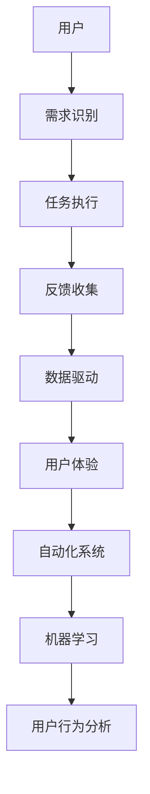
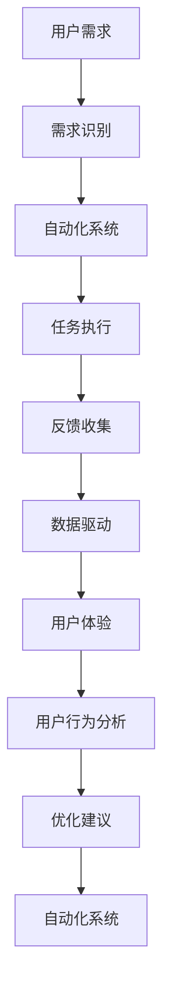

                 

# 自动化创业中的用户旅程优化

> 关键词：用户旅程,自动化创业,用户体验,机器学习,数据驱动,用户行为分析

## 1. 背景介绍

### 1.1 问题由来

在当今快速发展的商业环境中，企业的竞争不仅取决于产品和服务，还依赖于用户体验。随着自动化和数字化转型的深入，越来越多的企业开始通过自动化技术提升运营效率和客户满意度。然而，自动化系统如何与用户体验相结合，如何优化用户旅程，却是一个重要的挑战。传统的手工用户研究方法成本高、耗时长，无法实时响应不断变化的用户需求。因此，借助数据驱动和机器学习技术，对自动化创业项目中的用户旅程进行深入分析和优化，变得越来越重要。

### 1.2 问题核心关键点

本节将介绍自动化创业中用户旅程优化的关键点，以及这些关键点之间的内在联系。

- **用户旅程**：指用户与自动化系统互动的整个过程，包括需求识别、任务执行、反馈收集等环节。
- **自动化系统**：通过算法和数据驱动的自动化工具，自动完成某些任务，提升运营效率。
- **用户体验**：用户在使用自动化系统过程中的感知、情感和行为反应。
- **数据驱动**：通过收集、分析和利用用户数据，持续优化用户旅程和用户体验。
- **机器学习**：利用算法和模型，对用户行为和反馈进行预测和优化，提升自动化系统性能。
- **用户行为分析**：对用户交互和操作数据进行分析，以揭示用户需求和行为模式。

这些关键点通过一个简单的Mermaid流程图来展示：



## 2. 核心概念与联系

### 2.1 核心概念概述

在自动化创业中，优化用户旅程是一个多层次、多维度的系统工程。以下将对核心概念进行概述：

- **用户旅程**：包括多个阶段，如需求识别、任务执行、反馈收集等。每个阶段都涉及用户与系统的交互，影响用户的整体体验。
- **自动化系统**：通过算法和数据驱动，自动完成特定任务，提升效率和准确性。
- **用户体验**：用户在使用自动化系统的过程中所感受到的满意度和愉悦感，直接影响其对产品的接受度和忠诚度。
- **数据驱动**：通过收集和分析用户数据，提供实时的反馈和优化建议，以不断提升用户体验。
- **机器学习**：利用算法和模型，对用户行为和反馈进行预测和优化，提升自动化系统性能。
- **用户行为分析**：通过分析用户交互和操作数据，揭示用户需求和行为模式，指导系统优化。

### 2.2 核心概念原理和架构的 Mermaid 流程图



## 3. 核心算法原理 & 具体操作步骤

### 3.1 算法原理概述

用户旅程优化算法通过机器学习和数据驱动技术，对用户行为和反馈进行分析，并基于这些分析结果，不断调整自动化系统的参数和功能，以提升用户体验和系统性能。核心算法原理包括以下几个步骤：

1. **数据收集**：通过日志、用户界面交互数据等手段，收集用户行为和反馈信息。
2. **数据分析**：利用统计和机器学习技术，对收集到的数据进行分析和建模。
3. **模型训练**：通过有监督或无监督学习，训练模型预测用户行为和偏好。
4. **策略调整**：根据模型预测结果，动态调整自动化系统的功能和参数。
5. **效果评估**：通过A/B测试等手段，评估策略调整的效果，不断迭代优化。

### 3.2 算法步骤详解

以下是详细的算法步骤：

**Step 1: 数据收集**

- **日志记录**：使用日志记录工具（如ELK Stack、Prometheus等）记录用户行为和操作数据。
- **用户界面交互数据**：通过网页分析工具（如Google Analytics）和事件追踪工具（如Mixpanel）收集用户与系统互动数据。
- **反馈数据**：通过调查问卷、用户反馈工具（如Hotjar、SurveyMonkey）收集用户对系统性能和功能的反馈。

**Step 2: 数据分析**

- **数据清洗和预处理**：去除噪音和异常值，处理缺失数据，将数据转换为模型可用的格式。
- **特征提取**：从原始数据中提取有意义特征，如用户行为时间、频率、路径等。
- **统计分析**：使用统计方法（如均值、方差、卡方检验等）分析用户行为和反馈数据。
- **机器学习建模**：使用机器学习算法（如决策树、随机森林、神经网络等）训练模型，预测用户行为和偏好。

**Step 3: 模型训练**

- **有监督学习**：利用标注数据训练模型，预测用户行为和反馈。
- **无监督学习**：使用未标注数据训练模型，发现用户行为和偏好模式。
- **强化学习**：通过用户行为和反馈数据，动态调整系统参数，优化用户体验。

**Step 4: 策略调整**

- **参数调整**：根据模型预测结果，动态调整自动化系统的参数，如用户界面设计、交互逻辑等。
- **功能优化**：根据用户反馈，优化系统功能，增加用户满意度。
- **自动化流程优化**：优化任务执行流程，提升自动化系统的效率和准确性。

**Step 5: 效果评估**

- **A/B测试**：对比不同策略对用户行为和反馈的影响，评估策略的效果。
- **用户满意度调查**：通过调查问卷和用户反馈，直接收集用户对系统的满意度。
- **性能指标**：通过系统性能指标（如响应时间、任务完成率等）评估系统效果。

### 3.3 算法优缺点

**优点**：
- **实时优化**：通过数据驱动和机器学习，实时分析用户行为和反馈，快速调整优化策略。
- **个性化**：基于用户行为数据，提供个性化用户体验，提升用户满意度和忠诚度。
- **自动化**：利用算法和数据驱动，自动完成优化过程，减少人工干预，提升效率。

**缺点**：
- **数据依赖**：优化效果依赖于数据质量和数据量，数据收集和处理过程复杂。
- **模型偏差**：模型可能存在偏差，无法准确预测所有用户行为和偏好。
- **隐私风险**：数据收集和使用过程中，可能涉及用户隐私保护问题。

### 3.4 算法应用领域

用户旅程优化算法已经在多个领域得到广泛应用，包括但不限于：

- **金融科技**：优化用户界面设计，提升在线交易体验。
- **电商零售**：通过数据分析，优化推荐系统和购物体验。
- **医疗健康**：优化患者界面，提升诊疗体验和满意度。
- **智能制造**：优化生产流程和设备操作，提高生产效率。
- **智能家居**：优化智能设备的用户交互，提升生活便利性。

## 4. 数学模型和公式 & 详细讲解 & 举例说明

### 4.1 数学模型构建

用户旅程优化的数学模型可以抽象为以下形式：

$$
\maximize_{\theta} \sum_{i=1}^n u_i(x_i,\theta)
$$

其中 $u_i(x_i,\theta)$ 表示用户 $i$ 在使用自动化系统时的效用函数，$x_i$ 表示用户 $i$ 的行为数据，$\theta$ 表示系统的参数。

### 4.2 公式推导过程

根据用户旅程的各个阶段，可以进一步细化效用函数 $u_i(x_i,\theta)$ 的构成：

- **需求识别阶段**：$u_{\text{需求识别}}(x_{\text{需求}},\theta_{\text{需求}})$，其中 $x_{\text{需求}}$ 表示用户对需求的理解和描述，$\theta_{\text{需求}}$ 表示需求识别系统的参数。
- **任务执行阶段**：$u_{\text{任务执行}}(x_{\text{任务}},\theta_{\text{任务}})$，其中 $x_{\text{任务}}$ 表示用户执行任务的行为数据，$\theta_{\text{任务}}$ 表示任务执行系统的参数。
- **反馈收集阶段**：$u_{\text{反馈}}(x_{\text{反馈}},\theta_{\text{反馈}})$，其中 $x_{\text{反馈}}$ 表示用户对系统功能的反馈，$\theta_{\text{反馈}}$ 表示反馈收集系统的参数。

将效用函数细化后，整体优化目标可以表示为：

$$
\maximize_{\theta} \sum_{i=1}^n [u_{\text{需求识别}}(x_{\text{需求}},\theta_{\text{需求}}) + u_{\text{任务执行}}(x_{\text{任务}},\theta_{\text{任务}}) + u_{\text{反馈}}(x_{\text{反馈}},\theta_{\text{反馈}})]
$$

### 4.3 案例分析与讲解

以电商平台的推荐系统为例，可以使用以下数学模型来优化用户旅程：

假设电商平台推荐系统的参数为 $\theta$，用户 $i$ 的行为数据为 $x_i$。用户在需求识别阶段，输入关键词搜索商品；在任务执行阶段，浏览商品详情并进行购买；在反馈收集阶段，对推荐结果进行评分。推荐系统的效用函数可以表示为：

$$
u_i(x_i,\theta) = u_{\text{搜索}}(x_{\text{搜索}},\theta_{\text{搜索}}) + u_{\text{浏览}}(x_{\text{浏览}},\theta_{\text{浏览}}) + u_{\text{购买}}(x_{\text{购买}},\theta_{\text{购买}}) + u_{\text{评分}}(x_{\text{评分}},\theta_{\text{评分}})
$$

其中 $u_{\text{搜索}}$、$u_{\text{浏览}}$、$u_{\text{购买}}$、$u_{\text{评分}}$ 分别表示搜索、浏览、购买和评分阶段的效用函数。优化目标为：

$$
\maximize_{\theta} \sum_{i=1}^n [u_{\text{搜索}}(x_{\text{搜索}},\theta_{\text{搜索}}) + u_{\text{浏览}}(x_{\text{浏览}},\theta_{\text{浏览}}) + u_{\text{购买}}(x_{\text{购买}},\theta_{\text{购买}}) + u_{\text{评分}}(x_{\text{评分}},\theta_{\text{评分}})]
$$

通过求解上述优化问题，可以动态调整推荐系统的参数，提升用户满意度。

## 5. 项目实践：代码实例和详细解释说明

### 5.1 开发环境搭建

在进行用户旅程优化项目实践前，我们需要准备好开发环境。以下是使用Python进行PyTorch开发的环境配置流程：

1. 安装Anaconda：从官网下载并安装Anaconda，用于创建独立的Python环境。

2. 创建并激活虚拟环境：
```bash
conda create -n pytorch-env python=3.8 
conda activate pytorch-env
```

3. 安装PyTorch：根据CUDA版本，从官网获取对应的安装命令。例如：
```bash
conda install pytorch torchvision torchaudio cudatoolkit=11.1 -c pytorch -c conda-forge
```

4. 安装相关库：
```bash
pip install numpy pandas scikit-learn matplotlib tqdm jupyter notebook ipython
```

完成上述步骤后，即可在`pytorch-env`环境中开始用户旅程优化项目实践。

### 5.2 源代码详细实现

下面以电商平台的推荐系统为例，给出使用PyTorch进行用户旅程优化的代码实现。

```python
import torch
import torch.nn as nn
import torch.optim as optim
from sklearn.model_selection import train_test_split
from sklearn.metrics import mean_squared_error

# 定义效用函数
class UtilityFunction(nn.Module):
    def __init__(self):
        super(UtilityFunction, self).__init__()
        self.fc1 = nn.Linear(10, 64)
        self.fc2 = nn.Linear(64, 1)
    
    def forward(self, x):
        x = torch.relu(self.fc1(x))
        x = self.fc2(x)
        return x

# 定义推荐系统的优化目标
class RecommendationSystem:
    def __init__(self, dataset, features, labels):
        self.dataset = dataset
        self.features = features
        self.labels = labels
        self.model = None
    
    def train(self, learning_rate=0.01, epochs=10):
        self.model = nn.Sequential(
            nn.Linear(len(self.features), 64),
            nn.ReLU(),
            nn.Linear(64, 1)
        )
        criterion = nn.MSELoss()
        optimizer = optim.SGD(self.model.parameters(), lr=learning_rate)
        
        for epoch in range(epochs):
            for i in range(len(self.dataset)):
                inputs, targets = self.dataset[i]
                optimizer.zero_grad()
                outputs = self.model(inputs)
                loss = criterion(outputs, targets)
                loss.backward()
                optimizer.step()
        
        return self.model

# 加载数据集
data = load_data('recommendation.csv')
X = data['features']
y = data['labels']

# 划分训练集和测试集
train_X, test_X, train_y, test_y = train_test_split(X, y, test_size=0.2)

# 训练模型
model = RecommendationSystem(train_X, train_y)
model.train(learning_rate=0.01, epochs=10)

# 评估模型
test_X, test_y = load_data('recommendation_test.csv')
test_X = torch.tensor(test_X)
test_y = torch.tensor(test_y)
test_outputs = model.model(test_X)
test_mse = mean_squared_error(test_y, test_outputs)
print(f"Test MSE: {test_mse:.4f}")
```

### 5.3 代码解读与分析

让我们再详细解读一下关键代码的实现细节：

**UtilityFunction类**：
- 定义了效用函数，通过两个全连接层实现。
- 使用PyTorch的`nn.Module`类进行继承，方便构建和维护。

**RecommendationSystem类**：
- 定义了推荐系统的优化目标，包括数据集、特征、标签等参数。
- 实现了模型的训练过程，包括定义模型结构、损失函数、优化器等。

**train方法**：
- 创建模型，并使用MSE作为损失函数。
- 在每个epoch内，对数据集进行遍历，前向传播计算输出，反向传播计算损失和梯度，并更新模型参数。

**测试过程**：
- 使用测试集对训练好的模型进行评估，计算测试集上的均方误差（MSE）。
- 通过均方误差评估模型在测试集上的性能。

以上代码实现了基于PyTorch的用户旅程优化，可以用于电商平台的推荐系统优化。通过收集和分析用户行为数据，动态调整推荐系统的参数，提升用户满意度。

## 6. 实际应用场景

### 6.1 金融科技

在金融科技领域，用户旅程优化可以通过以下方式进行：

- **需求识别**：通过用户输入的搜索关键词和交易记录，识别用户的金融需求。
- **任务执行**：根据用户需求，推荐相应的金融产品或服务。
- **反馈收集**：通过用户对推荐结果的评分和反馈，优化推荐系统。

### 6.2 医疗健康

在医疗健康领域，用户旅程优化可以通过以下方式进行：

- **需求识别**：通过用户在线咨询的病史和症状描述，识别患者的健康需求。
- **任务执行**：根据需求，推荐相应的诊疗方案或药品。
- **反馈收集**：通过用户对诊疗结果的反馈，优化诊疗系统。

### 6.3 智能制造

在智能制造领域，用户旅程优化可以通过以下方式进行：

- **需求识别**：通过传感器数据，识别生产设备的需求。
- **任务执行**：根据需求，自动调整生产设备的参数和操作。
- **反馈收集**：通过设备运行状态和生产结果，优化生产流程。

### 6.4 未来应用展望

随着技术的不断发展，用户旅程优化在各个领域的运用将更加广泛。以下是对未来应用的展望：

1. **全流程自动化**：通过数据分析和优化，实现从需求识别到任务执行的全流程自动化。
2. **个性化服务**：根据用户行为和偏好，提供个性化的产品和服务。
3. **智能决策**：通过机器学习算法，自动优化决策流程，提升运营效率。
4. **实时反馈**：通过实时数据监测和分析，快速调整优化策略，提升用户体验。

## 7. 工具和资源推荐

### 7.1 学习资源推荐

为了帮助开发者系统掌握用户旅程优化的理论基础和实践技巧，这里推荐一些优质的学习资源：

1. 《数据驱动的产品设计》系列博文：由知名产品设计师撰写，深入浅出地介绍了数据驱动在产品设计中的应用，包括用户旅程优化等。
2. 《用户体验设计》课程：由国际知名设计师开设的在线课程，涵盖用户体验设计的理论基础和实际应用。
3. 《机器学习基础》书籍：介绍机器学习的基本概念和算法，适合初学者入门。
4. 《用户行为分析》书籍：详细介绍了用户行为分析的方法和技术，帮助理解用户旅程优化。

通过这些资源的学习实践，相信你一定能够快速掌握用户旅程优化的精髓，并用于解决实际的商业问题。

### 7.2 开发工具推荐

高效的开发离不开优秀的工具支持。以下是几款用于用户旅程优化开发的常用工具：

1. Python：强大的编程语言，生态丰富，适合数据分析和机器学习任务。
2. PyTorch：基于Python的开源深度学习框架，灵活动态的计算图，适合快速迭代研究。
3. Scikit-learn：流行的机器学习库，提供了丰富的模型和算法，适合快速原型开发。
4. TensorBoard：TensorFlow配套的可视化工具，可实时监测模型训练状态，提供丰富的图表呈现方式。
5. ELK Stack：流行的日志记录和分析工具，支持多数据源的聚合和分析。

合理利用这些工具，可以显著提升用户旅程优化的开发效率，加快创新迭代的步伐。

### 7.3 相关论文推荐

用户旅程优化技术的发展源于学界的持续研究。以下是几篇奠基性的相关论文，推荐阅读：

1. HIP: A Multi-Objective Optimization Framework for Human-In-the-Loop (HIP) User Interface Engineering：介绍了一个多目标优化框架，用于用户界面设计。
2. Personalization: An Introduction to the Generalization of the A/B Test：介绍了个性化设计的理论基础和实际应用。
3. User-Centric Design in the Age of Human-AI Collaboration：探讨了人机协同时代下的用户体验设计方法。
4. A Survey on Data-Driven Product Development：综述了数据驱动在产品设计中的应用，包括用户旅程优化等。

这些论文代表了大语言模型微调技术的发展脉络。通过学习这些前沿成果，可以帮助研究者把握学科前进方向，激发更多的创新灵感。

## 8. 总结：未来发展趋势与挑战

### 8.1 研究成果总结

本文对基于数据驱动和机器学习技术，优化自动化创业项目中用户旅程的方法进行了全面系统的介绍。通过介绍用户旅程优化的核心概念、关键技术和实际应用，展示了数据驱动技术在提升用户体验和系统性能方面的强大潜力。

### 8.2 未来发展趋势

展望未来，用户旅程优化技术将呈现以下几个发展趋势：

1. **数据驱动**：随着数据收集和处理技术的进步，用户旅程优化将更加依赖于数据的深度分析和挖掘。
2. **自动化**：自动化和智能化将成为用户旅程优化中的重要工具，提升优化效率和效果。
3. **多模态融合**：结合语音、视觉等模态数据，提升用户旅程优化的全面性和准确性。
4. **持续优化**：通过持续的数据监测和分析，不断调整优化策略，提升用户体验和系统性能。
5. **人机协同**：利用人机协同技术，实现用户旅程的实时优化和智能决策。

### 8.3 面临的挑战

尽管用户旅程优化技术已经取得了瞩目成就，但在迈向更加智能化、普适化应用的过程中，它仍面临着诸多挑战：

1. **数据隐私**：数据收集和使用过程中，可能涉及用户隐私保护问题。
2. **模型偏差**：模型可能存在偏差，无法准确预测所有用户行为和偏好。
3. **实时响应**：数据实时收集和处理能力不足，难以满足用户即时需求。
4. **多模态融合**：不同模态数据的整合和协同建模，仍面临技术和实现上的挑战。
5. **个性化优化**：个性化优化的复杂度较高，需要结合领域知识和专家经验。

### 8.4 研究展望

未来，用户旅程优化的研究需要在以下几个方面寻求新的突破：

1. **数据隐私保护**：开发更高效、更安全的隐私保护技术，保障用户数据安全。
2. **模型泛化能力**：研究更强大的模型，提升预测能力和泛化能力。
3. **实时数据处理**：研究高效的数据处理和分析技术，提升实时响应能力。
4. **多模态融合**：探索更先进的融合方法，提升多模态数据的利用效率。
5. **个性化优化**：研究更高效的个性化优化方法，提升用户体验。

这些研究方向的探索，必将引领用户旅程优化技术迈向更高的台阶，为构建安全、可靠、可解释、可控的智能系统铺平道路。面向未来，用户旅程优化技术还需要与其他人工智能技术进行更深入的融合，如知识表示、因果推理、强化学习等，多路径协同发力，共同推动自然语言理解和智能交互系统的进步。只有勇于创新、敢于突破，才能不断拓展用户旅程优化的边界，让智能技术更好地造福人类社会。

## 9. 附录：常见问题与解答

**Q1：用户旅程优化需要多少标注数据？**

A: 用户旅程优化依赖于大量的用户行为数据，标注数据的多少取决于优化任务的具体需求。通常情况下，标注数据越多，优化效果越好，但标注数据收集过程复杂，成本较高。

**Q2：如何评估用户旅程优化的效果？**

A: 用户旅程优化的效果评估通常通过以下指标进行：
- **用户满意度**：通过调查问卷或用户反馈收集用户的满意度，衡量优化效果。
- **任务完成率**：通过任务执行的完成率，评估任务执行效果。
- **转化率**：通过用户从需求识别到任务执行的转化率，衡量需求识别效果。
- **系统性能指标**：如响应时间、任务执行时间等，评估系统性能。

**Q3：用户旅程优化需要哪些技术支持？**

A: 用户旅程优化需要以下技术支持：
- **数据收集和处理**：通过日志记录、用户界面交互数据等手段，收集用户行为和反馈信息。
- **数据分析和建模**：使用统计和机器学习技术，对收集到的数据进行分析和建模。
- **算法优化**：利用机器学习算法，优化系统参数和功能。
- **实时监测和调整**：通过实时数据监测和分析，动态调整优化策略。

**Q4：用户旅程优化是否适用于所有行业？**

A: 用户旅程优化适用于绝大多数行业，包括金融、电商、医疗、智能制造等。但不同行业的用户旅程优化侧重点有所不同，需要结合行业特点进行优化。

**Q5：如何应对用户旅程优化中的数据隐私问题？**

A: 应对数据隐私问题，需要采取以下措施：
- **匿名化处理**：对用户数据进行匿名化处理，保护用户隐私。
- **数据加密**：对数据进行加密存储和传输，防止数据泄露。
- **用户授权**：在数据收集和使用过程中，明确告知用户并获得用户授权。
- **隐私保护技术**：采用隐私保护技术，如差分隐私、联邦学习等，保护用户隐私。

这些措施能够帮助用户在保护用户隐私的同时，实现用户旅程优化。

