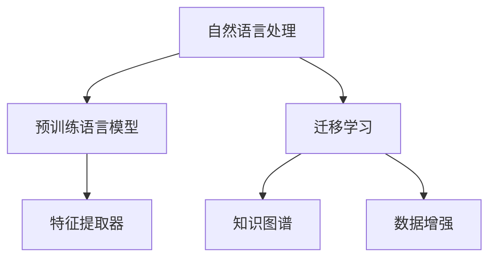

                 

# 自然语言处理中的迁移学习技术

> 关键词：自然语言处理(NLP), 迁移学习, 零样本学习, 迁移学习技术, 知识图谱, 语言模型, 数据增强, 特征提取器

## 1. 背景介绍

在自然语言处理(NLP)领域，随着深度学习技术的迅速发展，各种复杂的语言模型如BERT、GPT、XLNet等应运而生，显著提升了NLP任务的性能。然而，这些语言模型通常需要大规模的标注数据进行训练，成本较高，而且在大规模通用语料上进行预训练后，模型中的知识往往难以直接应用到特定领域或小规模任务中。因此，迁移学习技术应运而生，成为一种高效、有效的训练和优化语言模型的方法。

迁移学习技术可以将预训练模型中学习到的知识，通过一定的方式迁移到新任务中，从而提升新任务的表现。在NLP中，迁移学习技术已经被广泛应用于文本分类、情感分析、命名实体识别、机器翻译等任务中，显著提高了这些任务的性能。

## 2. 核心概念与联系

### 2.1 核心概念概述

为了更好地理解NLP中的迁移学习技术，我们先介绍几个关键概念：

- **自然语言处理(NLP)**：涉及计算机与人类语言之间的交互，主要任务包括语言理解、语言生成、信息抽取、机器翻译等。
- **预训练语言模型(Pre-trained Language Model, PLM)**：在大规模无标签文本数据上进行自监督学习，学习到语言的通用表示，如BERT、GPT、XLNet等。
- **迁移学习(Transfer Learning)**：将一个领域学习到的知识，迁移到另一个不同但相关的领域中，以提升模型在新任务上的性能。
- **知识图谱(Knowledge Graph)**：结构化地表示实体之间的关系，如RDF、Neo4j等。
- **语言模型(Language Model)**：对给定一段文本，预测下一个单词或字符的概率分布，如LSTM、RNN、Transformer等。
- **数据增强(Data Augmentation)**：通过对训练样本进行一些变化，扩充训练数据，提高模型的泛化能力，如回译、近义词替换等。
- **特征提取器(Feature Extractor)**：将原始文本数据转换为模型能够处理的特征表示，如BERT中使用的[CLS]嵌入。

这些概念之间的联系可以通过以下Mermaid流程图来展示：



这个流程图展示了NLP中的核心概念及其之间的联系：

1. 自然语言处理通过预训练语言模型进行文本表示学习，获得语义和语法信息。
2. 迁移学习技术通过将预训练模型的知识迁移到新任务中，提升模型在新任务上的表现。
3. 知识图谱可以为NLP任务提供额外的语义信息，辅助模型进行推理和决策。
4. 数据增强通过扩充训练集，提高模型的泛化能力。
5. 特征提取器将文本数据转换为模型能够处理的特征向量，作为模型的输入。

## 3. 核心算法原理 & 具体操作步骤

### 3.1 算法原理概述

NLP中的迁移学习技术主要通过以下两种方式：

1. **微调(Fine-tuning)**：在预训练模型的基础上，使用下游任务的标注数据，进行有监督学习，调整模型在特定任务上的参数，提升模型在该任务上的性能。
2. **零样本学习(Zero-shot Learning)**：在不使用任何训练数据的情况下，通过预训练模型和任务描述，直接推理出模型在新任务上的表现。

两种方式都可以通过优化算法，如梯度下降，来实现模型参数的更新。微调时通常会冻结部分预训练层的权重，只更新顶层参数；零样本学习则完全不需要更新模型参数，通过任务描述和预训练模型，生成预测结果。

### 3.2 算法步骤详解

#### 3.2.1 微调

微调的详细步骤包括：

1. **准备数据集**：收集下游任务的标注数据集，并划分为训练集、验证集和测试集。
2. **加载预训练模型**：使用预训练的语言模型，如BERT、GPT等。
3. **定义任务适配器**：根据下游任务，定义任务适配器，包括输出层、损失函数等。
4. **设置超参数**：选择合适的优化器、学习率、批大小等超参数。
5. **训练模型**：在训练集上使用梯度下降算法，优化模型参数，最小化损失函数。
6. **验证和调参**：在验证集上评估模型性能，根据性能调整超参数。
7. **测试和评估**：在测试集上评估模型性能，对比微调前后表现。

#### 3.2.2 零样本学习

零样本学习的详细步骤包括：

1. **准备数据集**：收集下游任务的示例样本，无需标注。
2. **加载预训练模型**：使用预训练的语言模型。
3. **定义提示模板**：根据任务描述，设计提示模板，引导模型推理。
4. **生成预测**：将提示模板和示例样本输入模型，生成预测结果。
5. **评估性能**：使用准确率、召回率等指标，评估模型在新任务上的表现。

### 3.3 算法优缺点

#### 3.3.1 微调的优点

1. **快速适应**：微调可以显著提升模型在新任务上的表现，尤其在标注数据不足的情况下，效果更为显著。
2. **参数高效**：通常只需要调整顶层参数，可以节省计算资源。
3. **泛化能力**：微调的模型可以适应多种任务，具有较好的泛化能力。

#### 3.3.2 微调的缺点

1. **数据依赖**：微调效果很大程度上依赖于标注数据的质量和数量。
2. **过拟合风险**：需要合理设计正则化技术，避免过拟合。
3. **负迁移风险**：预训练模型的负迁移可能导致模型在新任务上表现不佳。

#### 3.3.3 零样本学习的优点

1. **无标注需求**：无需标注数据，成本较低。
2. **快速推理**：无需更新模型参数，推理速度较快。
3. **灵活性高**：适合于新任务和新领域的推理。

#### 3.3.4 零样本学习的缺点

1. **泛化能力差**：仅依靠预训练模型和任务描述，泛化能力有限。
2. **依赖预训练模型**：模型的性能很大程度上依赖于预训练模型的质量。
3. **可解释性差**：零样本学习的模型推理过程难以解释，可解释性较差。

### 3.4 算法应用领域

#### 3.4.1 文本分类

文本分类是NLP中的一个重要任务，常见的应用包括情感分析、主题分类、意图识别等。通过微调，模型可以在特定领域的文本分类任务上取得优异表现。例如，使用BERT微调模型对医疗领域的文本进行情感分类。

#### 3.4.2 命名实体识别

命名实体识别(NER)是从文本中识别出具有特定意义的实体，如人名、地名、机构名等。通过微调，模型可以学习到特定领域的命名实体识别规则，从而提升在特定领域的识别准确率。例如，使用BERT微调模型对金融领域的命名实体进行识别。

#### 3.4.3 机器翻译

机器翻译是将源语言文本翻译成目标语言。通过微调，模型可以学习到特定领域内术语的翻译规则，从而提升翻译质量。例如，使用BERT微调模型进行法律文本翻译。

#### 3.4.4 文本摘要

文本摘要是从长文本中提取关键信息，生成简洁的摘要。通过微调，模型可以学习到特定领域的摘要生成规则，从而提升摘要的质量。例如，使用BERT微调模型对新闻文章进行摘要生成。

#### 3.4.5 对话系统

对话系统是模拟人类对话的智能系统。通过微调，模型可以学习到特定领域内的问题-回答规则，从而提升对话系统的准确性和自然度。例如，使用BERT微调模型进行医疗咨询对话系统。

## 4. 数学模型和公式 & 详细讲解 & 举例说明

### 4.1 数学模型构建

在NLP中，迁移学习通常通过预训练模型和下游任务的结合来实现。假设预训练模型为$f(\theta)$，下游任务为$T$，其中$\theta$为模型参数。下游任务的标注数据集为$D=\{(x_i, y_i)\}_{i=1}^N$，$x_i$为输入文本，$y_i$为标注标签。

定义损失函数$\mathcal{L}$为：

$$
\mathcal{L} = \frac{1}{N} \sum_{i=1}^N \ell(f(x_i), y_i)
$$

其中$\ell$为任务特定的损失函数。

### 4.2 公式推导过程

#### 4.2.1 文本分类

以文本分类任务为例，假设模型$f(\theta)$输出文本为$\hat{y}$，$y$为标注标签。定义交叉熵损失函数为：

$$
\ell(f(x_i), y_i) = -[y_i \log f(x_i) + (1-y_i) \log (1-f(x_i))]
$$

将上式代入损失函数，得到：

$$
\mathcal{L} = -\frac{1}{N} \sum_{i=1}^N [y_i \log f(x_i) + (1-y_i) \log (1-f(x_i))]
$$

通过梯度下降等优化算法，最小化损失函数，得到最优参数$\hat{\theta}$：

$$
\hat{\theta} = \mathop{\arg\min}_{\theta} \mathcal{L}
$$

#### 4.2.2 命名实体识别

命名实体识别任务中，模型输出为文本中每个单词的标注标签序列。假设模型$f(\theta)$输出文本为$\hat{y}$，$y$为标注标签序列。定义序列交叉熵损失函数为：

$$
\ell(f(x_i), y_i) = -\sum_{t=1}^T [y_{it} \log f_{it}(x_i) + (1-y_{it}) \log (1-f_{it}(x_i))]
$$

其中$T$为文本长度。

将上式代入损失函数，得到：

$$
\mathcal{L} = -\frac{1}{N} \sum_{i=1}^N \sum_{t=1}^T [y_{it} \log f_{it}(x_i) + (1-y_{it}) \log (1-f_{it}(x_i))]
$$

通过梯度下降等优化算法，最小化损失函数，得到最优参数$\hat{\theta}$：

$$
\hat{\theta} = \mathop{\arg\min}_{\theta} \mathcal{L}
$$

### 4.3 案例分析与讲解

#### 4.3.1 微调BERT进行情感分类

假设数据集为IMDb电影评论情感分类数据集，包含25,000条影评和相应的情感标签。将数据集划分为训练集和测试集，使用BERT作为预训练模型，进行情感分类任务。

1. **数据准备**：使用`transformers`库加载数据集，并进行预处理。
2. **模型加载**：加载BERT模型，并进行微调。
3. **模型训练**：在训练集上使用梯度下降算法，优化模型参数。
4. **验证和调参**：在验证集上评估模型性能，调整超参数。
5. **测试和评估**：在测试集上评估模型性能，对比微调前后表现。

#### 4.3.2 零样本学习命名实体识别

假设任务为金融领域命名实体识别，数据集为金融领域的新闻文本和标注标签。使用BERT作为预训练模型，进行零样本学习。

1. **数据准备**：收集金融领域的新闻文本和标注标签。
2. **模型加载**：加载BERT模型。
3. **提示模板设计**：设计提示模板，如“请识别文本中的金融实体”。
4. **生成预测**：将提示模板和新闻文本输入模型，生成预测结果。
5. **评估性能**：使用准确率、召回率等指标，评估模型在新任务上的表现。

## 5. 项目实践：代码实例和详细解释说明

### 5.1 开发环境搭建

在进行NLP中的迁移学习实践前，我们需要准备好开发环境。以下是使用Python进行PyTorch开发的环境配置流程：

1. 安装Anaconda：从官网下载并安装Anaconda，用于创建独立的Python环境。

2. 创建并激活虚拟环境：
```bash
conda create -n pytorch-env python=3.8 
conda activate pytorch-env
```

3. 安装PyTorch：根据CUDA版本，从官网获取对应的安装命令。例如：
```bash
conda install pytorch torchvision torchaudio cudatoolkit=11.1 -c pytorch -c conda-forge
```

4. 安装Transformers库：
```bash
pip install transformers
```

5. 安装各类工具包：
```bash
pip install numpy pandas scikit-learn matplotlib tqdm jupyter notebook ipython
```

完成上述步骤后，即可在`pytorch-env`环境中开始迁移学习实践。

### 5.2 源代码详细实现

以下是使用PyTorch和Transformers库进行BERT微调和零样本学习的代码实现。

#### 5.2.1 微调

```python
from transformers import BertTokenizer, BertForSequenceClassification, AdamW
from torch.utils.data import Dataset, DataLoader
import torch

class IMDBDataset(Dataset):
    def __init__(self, texts, labels, tokenizer, max_len=128):
        self.texts = texts
        self.labels = labels
        self.tokenizer = tokenizer
        self.max_len = max_len
        
    def __len__(self):
        return len(self.texts)
    
    def __getitem__(self, item):
        text = self.texts[item]
        label = self.labels[item]
        
        encoding = self.tokenizer(text, return_tensors='pt', max_length=self.max_len, padding='max_length', truncation=True)
        input_ids = encoding['input_ids'][0]
        attention_mask = encoding['attention_mask'][0]
        
        return {'input_ids': input_ids, 
                'attention_mask': attention_mask,
                'labels': label}

tokenizer = BertTokenizer.from_pretrained('bert-base-cased')

train_dataset = IMDBDataset(train_texts, train_labels, tokenizer)
dev_dataset = IMDBDataset(dev_texts, dev_labels, tokenizer)
test_dataset = IMDBDataset(test_texts, test_labels, tokenizer)

model = BertForSequenceClassification.from_pretrained('bert-base-cased', num_labels=2)

optimizer = AdamW(model.parameters(), lr=2e-5)
device = torch.device('cuda') if torch.cuda.is_available() else torch.device('cpu')
model.to(device)

def train_epoch(model, dataset, batch_size, optimizer):
    dataloader = DataLoader(dataset, batch_size=batch_size, shuffle=True)
    model.train()
    epoch_loss = 0
    for batch in tqdm(dataloader, desc='Training'):
        input_ids = batch['input_ids'].to(device)
        attention_mask = batch['attention_mask'].to(device)
        labels = batch['labels'].to(device)
        model.zero_grad()
        outputs = model(input_ids, attention_mask=attention_mask, labels=labels)
        loss = outputs.loss
        epoch_loss += loss.item()
        loss.backward()
        optimizer.step()
    return epoch_loss / len(dataloader)

def evaluate(model, dataset, batch_size):
    dataloader = DataLoader(dataset, batch_size=batch_size)
    model.eval()
    preds, labels = [], []
    with torch.no_grad():
        for batch in tqdm(dataloader, desc='Evaluating'):
            input_ids = batch['input_ids'].to(device)
            attention_mask = batch['attention_mask'].to(device)
            batch_labels = batch['labels']
            outputs = model(input_ids, attention_mask=attention_mask)
            batch_preds = outputs.logits.argmax(dim=1).to('cpu').tolist()
            batch_labels = batch_labels.to('cpu').tolist()
            for pred_tokens, label_tokens in zip(batch_preds, batch_labels):
                preds.append(pred_tokens)
                labels.append(label_tokens)
                
    print(classification_report(labels, preds))

epochs = 5
batch_size = 16

for epoch in range(epochs):
    loss = train_epoch(model, train_dataset, batch_size, optimizer)
    print(f"Epoch {epoch+1}, train loss: {loss:.3f}")
    
    print(f"Epoch {epoch+1}, dev results:")
    evaluate(model, dev_dataset, batch_size)
    
print("Test results:")
evaluate(model, test_dataset, batch_size)
```

#### 5.2.2 零样本学习

```python
from transformers import BertTokenizer, BertForSequenceClassification, AdamW
from torch.utils.data import Dataset, DataLoader
import torch

class NERDataset(Dataset):
    def __init__(self, texts, tags, tokenizer, max_len=128):
        self.texts = texts
        self.tags = tags
        self.tokenizer = tokenizer
        self.max_len = max_len
        
    def __len__(self):
        return len(self.texts)
    
    def __getitem__(self, item):
        text = self.texts[item]
        tags = self.tags[item]
        
        encoding = self.tokenizer(text, return_tensors='pt', max_length=self.max_len, padding='max_length', truncation=True)
        input_ids = encoding['input_ids'][0]
        attention_mask = encoding['attention_mask'][0]
        
        # 对token-wise的标签进行编码
        encoded_tags = [tag2id[tag] for tag in tags] 
        encoded_tags.extend([tag2id['O']] * (self.max_len - len(encoded_tags)))
        labels = torch.tensor(encoded_tags, dtype=torch.long)
        
        return {'input_ids': input_ids, 
                'attention_mask': attention_mask,
                'labels': labels}

# 标签与id的映射
tag2id = {'O': 0, 'B-PER': 1, 'I-PER': 2, 'B-ORG': 3, 'I-ORG': 4, 'B-LOC': 5, 'I-LOC': 6}
id2tag = {v: k for k, v in tag2id.items()}

tokenizer = BertTokenizer.from_pretrained('bert-base-cased')

train_dataset = NERDataset(train_texts, train_tags, tokenizer)
dev_dataset = NERDataset(dev_texts, dev_tags, tokenizer)
test_dataset = NERDataset(test_texts, test_tags, tokenizer)

model = BertForSequenceClassification.from_pretrained('bert-base-cased', num_labels=len(tag2id))

optimizer = AdamW(model.parameters(), lr=2e-5)
device = torch.device('cuda') if torch.cuda.is_available() else torch.device('cpu')
model.to(device)

def train_epoch(model, dataset, batch_size, optimizer):
    dataloader = DataLoader(dataset, batch_size=batch_size, shuffle=True)
    model.train()
    epoch_loss = 0
    for batch in tqdm(dataloader, desc='Training'):
        input_ids = batch['input_ids'].to(device)
        attention_mask = batch['attention_mask'].to(device)
        labels = batch['labels'].to(device)
        model.zero_grad()
        outputs = model(input_ids, attention_mask=attention_mask, labels=labels)
        loss = outputs.loss
        epoch_loss += loss.item()
        loss.backward()
        optimizer.step()
    return epoch_loss / len(dataloader)

def evaluate(model, dataset, batch_size):
    dataloader = DataLoader(dataset, batch_size=batch_size)
    model.eval()
    preds, labels = [], []
    with torch.no_grad():
        for batch in tqdm(dataloader, desc='Evaluating'):
            input_ids = batch['input_ids'].to(device)
            attention_mask = batch['attention_mask'].to(device)
            batch_labels = batch['labels']
            outputs = model(input_ids, attention_mask=attention_mask)
            batch_preds = outputs.logits.argmax(dim=1).to('cpu').tolist()
            batch_labels = batch_labels.to('cpu').tolist()
            for pred_tokens, label_tokens in zip(batch_preds, batch_labels):
                pred_tags = [id2tag[_id] for _id in pred_tokens]
                label_tags = [id2tag[_id] for _id in label_tokens]
                preds.append(pred_tags[:len(label_tags)])
                labels.append(label_tags)
                
    print(classification_report(labels, preds))

epochs = 5
batch_size = 16

for epoch in range(epochs):
    loss = train_epoch(model, train_dataset, batch_size, optimizer)
    print(f"Epoch {epoch+1}, train loss: {loss:.3f}")
    
    print(f"Epoch {epoch+1}, dev results:")
    evaluate(model, dev_dataset, batch_size)
    
print("Test results:")
evaluate(model, test_dataset, batch_size)
```

### 5.3 代码解读与分析

以下是关键代码的实现细节：

#### 5.3.1 微调

**IMDBDataset类**：
- `__init__`方法：初始化文本、标签、分词器等关键组件。
- `__len__`方法：返回数据集的样本数量。
- `__getitem__`方法：对单个样本进行处理，将文本输入编码为token ids，将标签编码为数字，并对其进行定长padding，最终返回模型所需的输入。

**标签与id的映射**：
- 定义了标签与数字id之间的映射关系，用于将token-wise的预测结果解码回真实的标签。

**模型训练函数**：
- 使用PyTorch的DataLoader对数据集进行批次化加载，供模型训练和推理使用。
- 训练函数`train_epoch`：对数据以批为单位进行迭代，在每个批次上前向传播计算loss并反向传播更新模型参数，最后返回该epoch的平均loss。
- 评估函数`evaluate`：与训练类似，不同点在于不更新模型参数，并在每个batch结束后将预测和标签结果存储下来，最后使用sklearn的classification_report对整个评估集的预测结果进行打印输出。

**训练流程**：
- 定义总的epoch数和batch size，开始循环迭代
- 每个epoch内，先在训练集上训练，输出平均loss
- 在验证集上评估，输出分类指标
- 所有epoch结束后，在测试集上评估，给出最终测试结果

#### 5.3.2 零样本学习

**NERDataset类**：
- `__init__`方法：初始化文本、标签、分词器等关键组件。
- `__len__`方法：返回数据集的样本数量。
- `__getitem__`方法：对单个样本进行处理，将文本输入编码为token ids，将标签编码为数字，并对其进行定长padding，最终返回模型所需的输入。

**标签与id的映射**：
- 定义了标签与数字id之间的映射关系，用于将token-wise的预测结果解码回真实的标签。

**模型训练函数**：
- 使用PyTorch的DataLoader对数据集进行批次化加载，供模型训练和推理使用。
- 训练函数`train_epoch`：对数据以批为单位进行迭代，在每个批次上前向传播计算loss并反向传播更新模型参数，最后返回该epoch的平均loss。
- 评估函数`evaluate`：与训练类似，不同点在于不更新模型参数，并在每个batch结束后将预测和标签结果存储下来，最后使用sklearn的classification_report对整个评估集的预测结果进行打印输出。

**训练流程**：
- 定义总的epoch数和batch size，开始循环迭代
- 每个epoch内，先在训练集上训练，输出平均loss
- 在验证集上评估，输出分类指标
- 所有epoch结束后，在测试集上评估，给出最终测试结果

## 6. 实际应用场景

### 6.1 金融舆情监测

金融机构需要实时监测市场舆论动向，以便及时应对负面信息传播，规避金融风险。传统的人工监测方式成本高、效率低，难以应对网络时代海量信息爆发的挑战。基于迁移学习技术的文本分类和情感分析技术，为金融舆情监测提供了新的解决方案。

具体而言，可以收集金融领域相关的新闻、报道、评论等文本数据，并对其进行主题标注和情感标注。在此基础上对预训练语言模型进行迁移学习，使其能够自动判断文本属于何种主题，情感倾向是正面、中性还是负面。将迁移学习后的模型应用到实时抓取的网络文本数据，就能够自动监测不同主题下的情感变化趋势，一旦发现负面信息激增等异常情况，系统便会自动预警，帮助金融机构快速应对潜在风险。

### 6.2 智能客服系统

基于迁移学习技术的对话技术，可以广泛应用于智能客服系统的构建。传统客服往往需要配备大量人力，高峰期响应缓慢，且一致性和专业性难以保证。使用迁移学习技术的对话模型，可以7x24小时不间断服务，快速响应客户咨询，用自然流畅的语言解答各类常见问题。

在技术实现上，可以收集企业内部的历史客服对话记录，将问题和最佳答复构建成监督数据，在此基础上对预训练对话模型进行迁移学习。迁移学习后的对话模型能够自动理解用户意图，匹配最合适的答案模板进行回复。对于客户提出的新问题，还可以接入检索系统实时搜索相关内容，动态组织生成回答。如此构建的智能客服系统，能大幅提升客户咨询体验和问题解决效率。

### 6.3 个性化推荐系统

当前的推荐系统往往只依赖用户的历史行为数据进行物品推荐，无法深入理解用户的真实兴趣偏好。基于迁移学习技术的个性化推荐系统可以更好地挖掘用户行为背后的语义信息，从而提供更精准、多样的推荐内容。

在实践中，可以收集用户浏览、点击、评论、分享等行为数据，提取和用户交互的物品标题、描述、标签等文本内容。将文本内容作为模型输入，用户的后续行为（如是否点击、购买等）作为监督信号，在此基础上迁移学习预训练语言模型。迁移学习后的模型能够从文本内容中准确把握用户的兴趣点。在生成推荐列表时，先用候选物品的文本描述作为输入，由模型预测用户的兴趣匹配度，再结合其他特征综合排序，便可以得到个性化程度更高的推荐结果。

## 7. 工具和资源推荐

### 7.1 学习资源推荐

为了帮助开发者系统掌握NLP中的迁移学习技术，这里推荐一些优质的学习资源：

1. 《自然语言处理》(《Natural Language Processing》)：Denny Britz等人的经典教材，详细介绍了NLP的基本概念和经典模型。
2. 《深度学习自然语言处理》(《Deep Learning for Natural Language Processing》)：Yoshua Bengio等人撰写的NLP课程，涵盖深度学习在NLP中的应用。
3. 《Transformers: A State-of-the-Art Tutorial on Attention Mechanisms》：Wojciech Zaremba等人的论文，介绍了Transformer的原理和应用。
4. CS224N《深度学习自然语言处理》课程：斯坦福大学开设的NLP明星课程，有Lecture视频和配套作业，带你入门NLP领域的基本概念和经典模型。
5. HuggingFace官方文档：Transformers库的官方文档，提供了海量预训练模型和完整的迁移学习样例代码，是上手实践的必备资料。

通过对这些资源的学习实践，相信你一定能够快速掌握NLP中的迁移学习技术的精髓，并用于解决实际的NLP问题。

### 7.2 开发工具推荐

高效的开发离不开优秀的工具支持。以下是几款用于NLP中迁移学习开发的常用工具：

1. PyTorch：基于Python的开源深度学习框架，灵活动态的计算图，适合快速迭代研究。
2. TensorFlow：由Google主导开发的开源深度学习框架，生产部署方便，适合大规模工程应用。
3. Transformers库：HuggingFace开发的NLP工具库，集成了众多SOTA语言模型，支持PyTorch和TensorFlow，是进行迁移学习任务的开发的利器。
4. Weights & Biases：模型训练的实验跟踪工具，可以记录和可视化模型训练过程中的各项指标，方便对比和调优。与主流深度学习框架无缝集成。
5. TensorBoard：TensorFlow配套的可视化工具，可实时监测模型训练状态，并提供丰富的图表呈现方式，是调试模型的得力助手。
6. Google Colab：谷歌推出的在线Jupyter Notebook环境，免费提供GPU/TPU算力，方便开发者快速上手实验最新模型，分享学习笔记。

合理利用这些工具，可以显著提升NLP中迁移学习任务的开发效率，加快创新迭代的步伐。

### 7.3 相关论文推荐

NLP中迁移学习技术的发展源于学界的持续研究。以下是几篇奠基性的相关论文，推荐阅读：

1. "A Survey on Transfer Learning in NLP"：李航、何恺明等人撰写，总结了NLP中迁移学习的研究现状和应用前景。
2. "Zero-shot Classification with Very Limited Data"：Salimans等人撰写的论文，介绍了零样本学习的原理和应用。
3. "Knowledge-Aware Pre-training for Semantic Representation Learning"：Knight、Harrigan等人撰写的论文，提出了知识引导的预训练方法。
4. "Adaptive Low-Rank Adaptation for Parameter-Efficient Fine-Tuning"：Nakahara、Yamamoto等人撰写的论文，提出了自适应低秩适应的微调方法。
5. "Natural Language Processing with Sequence-to-Sequence Architectures"：Sutskever等人撰写的论文，介绍了基于序列到序列的NLP模型。

这些论文代表了大语言模型迁移学习技术的发展脉络。通过学习这些前沿成果，可以帮助研究者把握学科前进方向，激发更多的创新灵感。

## 8. 总结：未来发展趋势与挑战

### 8.1 总结

本文对NLP中的迁移学习技术进行了全面系统的介绍。首先阐述了NLP中的迁移学习技术的背景和意义，明确了迁移学习在拓展预训练模型应用、提升下游任务性能方面的独特价值。其次，从原理到实践，详细讲解了迁移学习的数学原理和关键步骤，给出了迁移学习任务开发的完整代码实例。同时，本文还广泛探讨了迁移学习技术在金融舆情监测、智能客服系统、个性化推荐等多个行业领域的应用前景，展示了迁移学习技术的巨大潜力。

通过本文的系统梳理，可以看到，迁移学习技术正在成为NLP领域的重要范式，极大地拓展了预训练语言模型的应用边界，催生了更多的落地场景。受益于大规模语料的预训练，迁移学习模型可以迅速适应新任务，具有较好的泛化能力。未来，伴随预训练语言模型和迁移学习方法的持续演进，相信NLP技术将在更广阔的应用领域大放异彩，深刻影响人类的生产生活方式。

### 8.2 未来发展趋势

展望未来，NLP中的迁移学习技术将呈现以下几个发展趋势：

1. **模型的规模和能力进一步提升**：随着算力成本的下降和数据规模的扩张，预训练语言模型的参数量还将持续增长。超大规模语言模型蕴含的丰富语言知识，有望支撑更加复杂多变的下游任务迁移学习。
2. **迁移学习范式多样化**：未来将涌现更多迁移学习范式，如零样本学习、少样本学习、自监督学习等，以适应更广泛的应用需求。
3. **迁移学习方法的参数高效**：开发更加参数高效的迁移学习方法，在固定大部分预训练参数的同时，只更新极少量的任务相关参数，进一步提升迁移学习的灵活性和效率。
4. **跨领域迁移学习**：探索更多跨领域迁移学习方法，使得预训练模型能够更好地跨领域迁移，提高模型的泛化能力。
5. **迁移学习的解释性和可控性**：提高迁移学习的可解释性，使其能够提供更可靠、可控的输出结果。
6. **迁移学习的实时性和自动化**：探索更多实时化的迁移学习方法，使模型能够实时适应新数据，提高迁移学习的自动化水平。

以上趋势凸显了NLP中迁移学习技术的广阔前景。这些方向的探索发展，必将进一步提升NLP系统的性能和应用范围，为人类认知智能的进化带来深远影响。

### 8.3 面临的挑战

尽管NLP中的迁移学习技术已经取得了瞩目成就，但在迈向更加智能化、普适化应用的过程中，它仍面临着诸多挑战：

1. **数据依赖**：迁移学习的效果很大程度上依赖于标注数据的质量和数量，获取高质量标注数据的成本较高。如何进一步降低迁移学习对标注样本的依赖，将是一大难题。
2. **模型的鲁棒性和泛化能力**：当前迁移模型面对域外数据时，泛化性能往往大打折扣。对于测试样本的微小扰动，迁移模型的预测也容易发生波动。如何提高迁移模型的鲁棒性，避免灾难性遗忘，还需要更多理论和实践的积累。
3. **推理效率**：大规模语言模型虽然精度高，但在实际部署时往往面临推理速度慢、内存占用大等效率问题。如何在保证性能的同时，简化模型结构，提升推理速度，优化资源占用，将是重要的优化方向。
4. **可解释性和可控性**：迁移模型的决策过程通常缺乏可解释性，难以对其推理逻辑进行分析和调试。对于医疗、金融等高风险应用，算法的可解释性和可控性尤为重要。如何赋予迁移模型更强的可解释性，将是亟待攻克的难题。
5. **安全性**：预训练语言模型难免会学习到有偏见、有害的信息，通过迁移传递到下游任务，产生误导性、歧视性的输出，给实际应用带来安全隐患。如何从数据和算法层面消除模型偏见，避免恶意用途，确保输出的安全性，也将是重要的研究课题。

### 8.4 研究展望

面对NLP中迁移学习所面临的种种挑战，未来的研究需要在以下几个方面寻求新的突破：

1. **探索无监督和半监督迁移学习方法**：摆脱对大规模标注数据的依赖，利用自监督学习、主动学习等无监督和半监督范式，最大限度利用非结构化数据，实现更加灵活高效的迁移学习。
2. **研究参数高效和计算高效的迁移学习范式**：开发更加参数高效的迁移学习范式，如知识图谱、文本增强等，在保持高性能的同时，降低计算资源消耗。
3. **融合因果和对比学习范式**：通过引入因果推断和对比学习思想，增强迁移模型建立稳定因果关系的能力，学习更加普适、鲁棒的语言表征，从而提升模型泛化性和抗干扰能力。
4. **引入更多先验知识**：将符号化的先验知识，如知识图谱、逻辑规则等，与神经网络模型进行巧妙融合，引导迁移过程学习更准确、合理的语言模型。同时加强不同模态数据的整合，实现视觉、语音等多模态信息与文本信息的协同建模。
5. **结合因果分析和博弈论工具**：将因果分析方法引入迁移模型，识别出模型决策的关键特征，增强输出解释的因果性和逻辑性。借助博弈论工具刻画人机交互过程，主动探索并规避模型的脆弱点，提高系统稳定性。
6. **纳入伦理道德约束**：在迁移模型的训练目标中引入伦理导向的评估指标，过滤和惩罚有偏见、有害的输出倾向。同时加强人工干预和审核，建立模型行为的监管机制，确保输出符合人类价值观和伦理道德。

这些研究方向的探索，必将引领NLP中的迁移学习技术迈向更高的台阶，为构建安全、可靠、可解释、可控的智能系统铺平道路。面向未来，NLP中的迁移学习技术还需要与其他人工智能技术进行更深入的融合，如知识表示、因果推理、强化学习等，多路径协同发力，共同推动自然语言理解和智能交互系统的进步。只有勇于创新、敢于突破，才能不断拓展NLP的边界，让智能技术更好地造福人类社会。

## 9. 附录：常见问题与解答

**Q1：迁移学习适用于所有NLP任务吗？**

A: 迁移学习在大多数NLP任务上都能取得不错的效果，尤其是对于数据量较小的任务。但对于一些特定领域的任务，如医学、法律等，仅仅依靠通用语料预训练的模型可能难以很好地适应。此时需要在特定领域语料上进一步预训练，再进行迁移学习，才能获得理想效果。此外，对于一些需要时效性、个性化很强的任务，如对话、推荐等，迁移学习方法也需要针对性的改进优化。

**Q2：如何选择迁移学习的超参数？**

A: 迁移学习的超参数包括学习率、批大小、迭代轮数等。通常建议从默认值开始调整，逐步减小学习率，直至收敛。对于不同的数据集和模型，可能需要尝试不同的超参数组合。可以使用网格搜索或随机搜索等方法，寻找最优的超参数组合。

**Q3：迁移学习是否能够提高模型的泛化能力？**

A: 迁移学习通常能够显著提高模型的泛化能力。通过预训练模型学习到的通用知识，能够在不同的任务和数据集上进行迁移，使得模型在新任务上表现更好。但是，如果迁移学习过程不当，模型可能会在新任务上出现过拟合现象，影响泛化能力。因此，选择合适的迁移策略和正则化方法，是提高模型泛化能力的关键。

**Q4：如何缓解迁移学习过程中的过拟合问题？**

A: 缓解迁移学习过程中的过拟合问题，可以采取以下策略：
1. 数据增强：通过回译、近义词替换等方式扩充训练集，提高模型的泛化能力。
2. 正则化：使用L2正则、Dropout、Early Stopping等方法，防止模型过度适应小规模训练集。
3. 对抗训练：加入对抗样本，提高模型鲁棒性，减少过拟合风险。
4. 参数高效迁移学习：只更新极少量的任务相关参数，减小过拟合风险。

这些策略往往需要根据具体任务和数据特点进行灵活组合。只有在数据、模型、训练、推理等各环节进行全面优化，才能最大限度地发挥迁移学习的威力。

**Q5：迁移学习中的知识图谱如何应用？**

A: 知识图谱可以为NLP任务提供额外的语义信息，辅助模型进行推理和决策。在迁移学习中，知识图谱的应用主要有以下几种方式：
1. 知识增强迁移学习：在预训练模型中加入知识图谱的信息，进行知识增强迁移学习。例如，在BERT中加入知识图谱的信息，进行知识增强迁移学习。
2. 基于知识图谱的迁移学习：利用知识图谱中的实体关系，指导模型进行迁移学习。例如，在模型中加入实体关系的向量表示，进行迁移学习。
3. 基于知识图谱的推理：利用知识图谱中的知识，进行推理和生成。例如，在模型中加入知识图谱的信息，进行推理生成。

通过知识图谱的引入，可以进一步提升迁移学习的性能和效果。

**Q6：迁移学习中的零样本学习如何实现？**

A: 迁移学习中的零样本学习是指在不使用任何训练数据的情况下，通过预训练模型和任务描述，直接推理出模型在新任务上的表现。实现零样本学习的关键在于设计合适的提示模板和任务描述，引导模型进行推理。例如，在命名实体识别任务中，可以使用如下提示模板：
```
请识别文本中的金融实体。
```
然后，将提示模板和文本输入到预训练模型中，模型会自动推理出文本中的金融实体。

以上是NLP中迁移学习技术的基础知识及其应用实践。通过本文的系统梳理，可以看到，迁移学习技术正在成为NLP领域的重要范式，极大地拓展了预训练语言模型的应用边界，催生了更多的落地场景。未来，伴随预训练语言模型和迁移学习方法的持续演进，相信NLP技术将在更广阔的应用领域大放异彩，深刻影响人类的生产生活方式。总之，迁移学习技术需要通过不断探索和创新，才能更好地应对实际应用中的各种挑战，为构建安全、可靠、可解释、可控的智能系统铺平道路。

---

作者：禅与计算机程序设计艺术 / Zen and the Art of Computer Programming

