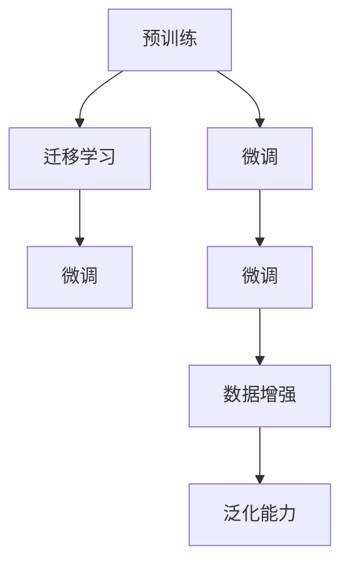

                 

# 自然语言处理中的迁移学习技术

> 关键词：迁移学习,自然语言处理,预训练模型,微调,数据增强,泛化能力,语言模型,实例

## 1. 背景介绍

### 1.1 问题由来
随着人工智能技术的快速发展，自然语言处理(Natural Language Processing, NLP)在各行各业中得到了广泛应用。然而，在实际应用中，由于数据和计算资源的限制，从头训练一个高质量的NLP模型成本高昂且耗时。为了解决这个问题，迁移学习(Meta-Learning)这一高效、可扩展的学习范式应运而生。

迁移学习旨在将已有知识应用到新的相关领域或任务中，从而加快学习过程并提高模型性能。在大规模预训练语言模型的基础上，通过微调(Fine-tuning)等技术手段，可以将通用语言知识迁移到特定的下游任务中，从而大幅提高NLP模型的泛化能力和性能。

### 1.2 问题核心关键点
当前，迁移学习在NLP领域中已经得到了广泛应用，特别是在大规模预训练语言模型的微调上。大语言模型通过在大量的无标签文本数据上进行自监督学习，学习到了丰富的语言知识和语言表征，能够自动捕捉语言的隐含规律和模式。这些大语言模型包括GPT、BERT、T5等，其效果显著优于从头训练的模型。

在大规模预训练后，大语言模型通常会在特定任务上进行微调，以适应具体的应用需求。微调的目标是调整模型中的部分或全部参数，使得模型在特定任务上表现更好。这一过程包括以下几个关键点：
1. 选择合适的预训练语言模型。
2. 获取下游任务的标注数据集。
3. 设计任务适配层，如分类器、解码器等。
4. 设置微调超参数，如学习率、批大小、迭代轮数等。
5. 执行梯度训练，进行微调过程。
6. 在测试集上评估微调后的模型。

### 1.3 问题研究意义
研究迁移学习在大语言模型微调中的应用，对于拓展NLP技术的应用范围，提升特定任务上的性能，加速NLP技术的产业化进程，具有重要意义：

1. 降低应用开发成本。基于已有的大语言模型进行微调，可以减少从头开发所需的成本和资源。
2. 提升模型效果。微调使得通用大模型更好地适应特定任务，在实际应用中取得更优表现。
3. 加速开发进度。站在巨人的肩膀上，微调使得开发者能够更快地完成任务适配，缩短开发周期。
4. 带来技术创新。微调范式促进了对预训练-微调的深入研究，催生了提示学习、少样本学习等新的研究方向。
5. 赋能产业升级。微调使得NLP技术更容易被各行各业所采用，为传统行业数字化转型升级提供新的技术路径。

## 2. 核心概念与联系

### 2.1 核心概念概述

为更好地理解迁移学习在大语言模型微调中的应用，本节将介绍几个密切相关的核心概念：

- 预训练(Pre-training)：指在大规模无标签文本语料上，通过自监督学习任务训练通用语言模型的过程。常见的预训练任务包括言语建模、掩码语言模型等。
- 迁移学习(Meta-Learning)：指将一个领域学习到的知识，迁移应用到另一个不同但相关的领域的学习范式。
- 微调(Fine-tuning)：指在预训练模型的基础上，使用下游任务的少量标注数据，通过有监督学习优化模型在该任务上的性能。
- 数据增强(Data Augmentation)：通过对训练样本进行随机变换、回译等方式，丰富训练集多样性，防止模型过拟合。
- 泛化能力(Generalization)：指模型在新数据上的表现能力，即模型是否能将学到的知识应用于未知数据。

这些核心概念之间的逻辑关系可以通过以下Mermaid流程图来展示：



这个流程图展示了大语言模型的核心概念及其之间的关系：

1. 预训练获得基础能力。
2. 迁移学习将预训练知识迁移到下游任务。
3. 微调对预训练模型进行任务特定的优化，使其在新任务上表现更好。
4. 数据增强丰富训练集，增强模型的泛化能力。
5. 泛化能力确保模型在新数据上的表现。

## 3. 核心算法原理 & 具体操作步骤
### 3.1 算法原理概述

迁移学习在大语言模型微调中，主要通过以下两个步骤实现：

**步骤一：预训练模型初始化**

预训练模型的初始化通常是在大规模无标签文本数据上进行的。在预训练阶段，模型通过自监督学习任务（如掩码语言模型、Next Sentence Prediction等）学习语言的隐含规律和模式。

**步骤二：微调任务适配**

在预训练模型获得基础的泛化能力后，将其应用于特定的下游任务进行微调。微调的目标是通过有监督学习优化模型在特定任务上的性能。

### 3.2 算法步骤详解

以下是基于迁移学习的大语言模型微调的一般步骤：

**Step 1: 准备预训练模型和数据集**

- 选择合适的预训练语言模型，如BERT、GPT等。
- 准备下游任务的数据集，包括训练集、验证集和测试集。训练集应尽可能覆盖所有可能出现的任务实例。

**Step 2: 添加任务适配层**

- 根据任务类型，在预训练模型顶层设计合适的输出层和损失函数。例如，分类任务通常使用线性分类器和交叉熵损失函数。
- 生成器任务通常使用语言模型的解码器输出概率分布，并以负对数似然为损失函数。

**Step 3: 设置微调超参数**

- 选择合适的优化算法及其参数，如Adam、SGD等。
- 设置学习率、批大小、迭代轮数等超参数。

**Step 4: 执行梯度训练**

- 将训练集数据分批次输入模型，前向传播计算损失函数。
- 反向传播计算参数梯度，根据设定的优化算法和学习率更新模型参数。
- 周期性在验证集上评估模型性能，根据性能指标决定是否触发Early Stopping。
- 重复上述步骤直至满足预设的迭代轮数或Early Stopping条件。

**Step 5: 测试和部署**

- 在测试集上评估微调后模型，对比微调前后的精度提升。
- 使用微调后的模型对新样本进行推理预测，集成到实际的应用系统中。
- 持续收集新的数据，定期重新微调模型，以适应数据分布的变化。

### 3.3 算法优缺点

迁移学习在大语言模型微调中具有以下优点：

1. 简单高效。只需要少量标注数据，即可对预训练模型进行快速适配。
2. 泛化能力强。预训练模型已经在大规模数据上学习到了丰富的知识，微调过程中可以利用这些知识，提高模型的泛化能力。
3. 开发周期短。利用预训练模型，可以减少从头训练所需的时间和资源投入。

同时，迁移学习也存在一定的局限性：

1. 对标注数据依赖高。微调的效果很大程度上取决于标注数据的质量和数量，获取高质量标注数据的成本较高。
2. 数据分布假设风险。预训练模型的泛化能力在特定任务上可能会有所下降。
3. 模型的公平性问题。如果预训练模型存在偏见，微调后的模型也可能继承这些偏见，影响模型的公平性。

尽管存在这些局限性，迁移学习仍是NLP领域中不可或缺的技术范式。未来，相关的研究将集中在如何降低微调对标注数据的依赖，提高模型的少样本学习和跨领域迁移能力，同时兼顾可解释性和伦理安全性等因素。

### 3.4 算法应用领域

迁移学习在大语言模型微调中的应用已经非常广泛，覆盖了NLP领域的各个任务。以下是几个典型的应用场景：

- 文本分类：如情感分析、主题分类、意图识别等。通过微调使模型学习文本-标签映射。
- 命名实体识别：识别文本中的人名、地名、机构名等特定实体。通过微调使模型掌握实体边界和类型。
- 关系抽取：从文本中抽取实体之间的语义关系。通过微调使模型学习实体-关系三元组。
- 问答系统：对自然语言问题给出答案。将问题-答案对作为微调数据，训练模型学习匹配答案。
- 机器翻译：将源语言文本翻译成目标语言。通过微调使模型学习语言-语言映射。
- 文本摘要：将长文本压缩成简短摘要。将文章-摘要对作为微调数据，使模型学习抓取要点。
- 对话系统：使机器能够与人自然对话。将多轮对话历史作为上下文，微调模型进行回复生成。

除了上述这些经典任务外，迁移学习还被创新性地应用到更多场景中，如可控文本生成、常识推理、代码生成、数据增强等，为NLP技术带来了全新的突破。随着预训练模型和迁移方法的不断进步，相信NLP技术将在更广阔的应用领域大放异彩。

## 4. 数学模型和公式 & 详细讲解
### 4.1 数学模型构建

假设预训练语言模型为 $M_{\theta}$，其中 $\theta$ 为预训练得到的模型参数。给定下游任务 $T$ 的标注数据集 $D=\{(x_i,y_i)\}_{i=1}^N$，其中 $x_i$ 为输入文本，$y_i$ 为标签。

定义模型 $M_{\theta}$ 在输入 $x_i$ 上的损失函数为 $\ell(M_{\theta}(x_i),y_i)$，则在数据集 $D$ 上的经验风险为：

$$
\mathcal{L}(\theta) = \frac{1}{N} \sum_{i=1}^N \ell(M_{\theta}(x_i),y_i)
$$

微调的优化目标是最小化经验风险，即找到最优参数：

$$
\theta^* = \mathop{\arg\min}_{\theta} \mathcal{L}(\theta)
$$

在实践中，我们通常使用基于梯度的优化算法（如SGD、Adam等）来近似求解上述最优化问题。设 $\eta$ 为学习率，$\lambda$ 为正则化系数，则参数的更新公式为：

$$
\theta \leftarrow \theta - \eta \nabla_{\theta}\mathcal{L}(\theta) - \eta\lambda\theta
$$

其中 $\nabla_{\theta}\mathcal{L}(\theta)$ 为损失函数对参数 $\theta$ 的梯度，可通过反向传播算法高效计算。

### 4.2 公式推导过程

以下我们以二分类任务为例，推导交叉熵损失函数及其梯度的计算公式。

假设模型 $M_{\theta}$ 在输入 $x_i$ 上的输出为 $\hat{y}=M_{\theta}(x_i) \in [0,1]$，表示样本属于正类的概率。真实标签 $y \in \{0,1\}$。则二分类交叉熵损失函数定义为：

$$
\ell(M_{\theta}(x_i),y) = -[y\log \hat{y} + (1-y)\log (1-\hat{y})]
$$

将其代入经验风险公式，得：

$$
\mathcal{L}(\theta) = -\frac{1}{N}\sum_{i=1}^N [y_i\log M_{\theta}(x_i)+(1-y_i)\log(1-M_{\theta}(x_i))]
$$

根据链式法则，损失函数对参数 $\theta_k$ 的梯度为：

$$
\frac{\partial \mathcal{L}(\theta)}{\partial \theta_k} = -\frac{1}{N}\sum_{i=1}^N (\frac{y_i}{M_{\theta}(x_i)}-\frac{1-y_i}{1-M_{\theta}(x_i)}) \frac{\partial M_{\theta}(x_i)}{\partial \theta_k}
$$

其中 $\frac{\partial M_{\theta}(x_i)}{\partial \theta_k}$ 可进一步递归展开，利用自动微分技术完成计算。

在得到损失函数的梯度后，即可带入参数更新公式，完成模型的迭代优化。重复上述过程直至收敛，最终得到适应下游任务的最优模型参数 $\theta^*$。

## 5. 项目实践：代码实例和详细解释说明
### 5.1 开发环境搭建

在进行迁移学习实践前，我们需要准备好开发环境。以下是使用Python进行PyTorch开发的环境配置流程：

1. 安装Anaconda：从官网下载并安装Anaconda，用于创建独立的Python环境。

2. 创建并激活虚拟环境：
```bash
conda create -n pytorch-env python=3.8 
conda activate pytorch-env
```

3. 安装PyTorch：根据CUDA版本，从官网获取对应的安装命令。例如：
```bash
conda install pytorch torchvision torchaudio cudatoolkit=11.1 -c pytorch -c conda-forge
```

4. 安装Transformers库：
```bash
pip install transformers
```

5. 安装各类工具包：
```bash
pip install numpy pandas scikit-learn matplotlib tqdm jupyter notebook ipython
```

完成上述步骤后，即可在`pytorch-env`环境中开始迁移学习实践。

### 5.2 源代码详细实现

这里我们以命名实体识别(NER)任务为例，给出使用Transformers库对BERT模型进行迁移学习的PyTorch代码实现。

首先，定义NER任务的数据处理函数：

```python
from transformers import BertTokenizer
from torch.utils.data import Dataset
import torch

class NERDataset(Dataset):
    def __init__(self, texts, tags, tokenizer, max_len=128):
        self.texts = texts
        self.tags = tags
        self.tokenizer = tokenizer
        self.max_len = max_len
        
    def __len__(self):
        return len(self.texts)
    
    def __getitem__(self, item):
        text = self.texts[item]
        tags = self.tags[item]
        
        encoding = self.tokenizer(text, return_tensors='pt', max_length=self.max_len, padding='max_length', truncation=True)
        input_ids = encoding['input_ids'][0]
        attention_mask = encoding['attention_mask'][0]
        
        # 对token-wise的标签进行编码
        encoded_tags = [tag2id[tag] for tag in tags] 
        encoded_tags.extend([tag2id['O']] * (self.max_len - len(encoded_tags)))
        labels = torch.tensor(encoded_tags, dtype=torch.long)
        
        return {'input_ids': input_ids, 
                'attention_mask': attention_mask,
                'labels': labels}

# 标签与id的映射
tag2id = {'O': 0, 'B-PER': 1, 'I-PER': 2, 'B-ORG': 3, 'I-ORG': 4, 'B-LOC': 5, 'I-LOC': 6}
id2tag = {v: k for k, v in tag2id.items()}

# 创建dataset
tokenizer = BertTokenizer.from_pretrained('bert-base-cased')

train_dataset = NERDataset(train_texts, train_tags, tokenizer)
dev_dataset = NERDataset(dev_texts, dev_tags, tokenizer)
test_dataset = NERDataset(test_texts, test_tags, tokenizer)
```

然后，定义模型和优化器：

```python
from transformers import BertForTokenClassification, AdamW

model = BertForTokenClassification.from_pretrained('bert-base-cased', num_labels=len(tag2id))

optimizer = AdamW(model.parameters(), lr=2e-5)
```

接着，定义训练和评估函数：

```python
from torch.utils.data import DataLoader
from tqdm import tqdm
from sklearn.metrics import classification_report

device = torch.device('cuda') if torch.cuda.is_available() else torch.device('cpu')
model.to(device)

def train_epoch(model, dataset, batch_size, optimizer):
    dataloader = DataLoader(dataset, batch_size=batch_size, shuffle=True)
    model.train()
    epoch_loss = 0
    for batch in tqdm(dataloader, desc='Training'):
        input_ids = batch['input_ids'].to(device)
        attention_mask = batch['attention_mask'].to(device)
        labels = batch['labels'].to(device)
        model.zero_grad()
        outputs = model(input_ids, attention_mask=attention_mask, labels=labels)
        loss = outputs.loss
        epoch_loss += loss.item()
        loss.backward()
        optimizer.step()
    return epoch_loss / len(dataloader)

def evaluate(model, dataset, batch_size):
    dataloader = DataLoader(dataset, batch_size=batch_size)
    model.eval()
    preds, labels = [], []
    with torch.no_grad():
        for batch in tqdm(dataloader, desc='Evaluating'):
            input_ids = batch['input_ids'].to(device)
            attention_mask = batch['attention_mask'].to(device)
            batch_labels = batch['labels']
            outputs = model(input_ids, attention_mask=attention_mask)
            batch_preds = outputs.logits.argmax(dim=2).to('cpu').tolist()
            batch_labels = batch_labels.to('cpu').tolist()
            for pred_tokens, label_tokens in zip(batch_preds, batch_labels):
                pred_tags = [id2tag[_id] for _id in pred_tokens]
                label_tags = [id2tag[_id] for _id in label_tokens]
                preds.append(pred_tags[:len(label_tags)])
                labels.append(label_tags)
                
    print(classification_report(labels, preds))
```

最后，启动迁移学习流程并在测试集上评估：

```python
epochs = 5
batch_size = 16

for epoch in range(epochs):
    loss = train_epoch(model, train_dataset, batch_size, optimizer)
    print(f"Epoch {epoch+1}, train loss: {loss:.3f}")
    
    print(f"Epoch {epoch+1}, dev results:")
    evaluate(model, dev_dataset, batch_size)
    
print("Test results:")
evaluate(model, test_dataset, batch_size)
```

以上就是使用PyTorch对BERT进行命名实体识别任务迁移学习的完整代码实现。可以看到，得益于Transformers库的强大封装，我们可以用相对简洁的代码完成BERT模型的迁移学习。

### 5.3 代码解读与分析

让我们再详细解读一下关键代码的实现细节：

**NERDataset类**：
- `__init__`方法：初始化文本、标签、分词器等关键组件。
- `__len__`方法：返回数据集的样本数量。
- `__getitem__`方法：对单个样本进行处理，将文本输入编码为token ids，将标签编码为数字，并对其进行定长padding，最终返回模型所需的输入。

**tag2id和id2tag字典**：
- 定义了标签与数字id之间的映射关系，用于将token-wise的预测结果解码回真实的标签。

**训练和评估函数**：
- 使用PyTorch的DataLoader对数据集进行批次化加载，供模型训练和推理使用。
- 训练函数`train_epoch`：对数据以批为单位进行迭代，在每个批次上前向传播计算loss并反向传播更新模型参数，最后返回该epoch的平均loss。
- 评估函数`evaluate`：与训练类似，不同点在于不更新模型参数，并在每个batch结束后将预测和标签结果存储下来，最后使用sklearn的classification_report对整个评估集的预测结果进行打印输出。

**迁移学习流程**：
- 定义总的epoch数和batch size，开始循环迭代
- 每个epoch内，先在训练集上训练，输出平均loss
- 在验证集上评估，输出分类指标
- 所有epoch结束后，在测试集上评估，给出最终测试结果

可以看到，PyTorch配合Transformers库使得BERT迁移学习的代码实现变得简洁高效。开发者可以将更多精力放在数据处理、模型改进等高层逻辑上，而不必过多关注底层的实现细节。

当然，工业级的系统实现还需考虑更多因素，如模型的保存和部署、超参数的自动搜索、更灵活的任务适配层等。但核心的迁移学习范式基本与此类似。

## 6. 实际应用场景
### 6.1 智能客服系统

基于迁移学习的大语言模型对话技术，可以广泛应用于智能客服系统的构建。传统客服往往需要配备大量人力，高峰期响应缓慢，且一致性和专业性难以保证。而使用迁移学习的大语言模型，可以7x24小时不间断服务，快速响应客户咨询，用自然流畅的语言解答各类常见问题。

在技术实现上，可以收集企业内部的历史客服对话记录，将问题和最佳答复构建成监督数据，在此基础上对预训练对话模型进行迁移学习。迁移学习后的对话模型能够自动理解用户意图，匹配最合适的答案模板进行回复。对于客户提出的新问题，还可以接入检索系统实时搜索相关内容，动态组织生成回答。如此构建的智能客服系统，能大幅提升客户咨询体验和问题解决效率。

### 6.2 金融舆情监测

金融机构需要实时监测市场舆论动向，以便及时应对负面信息传播，规避金融风险。传统的人工监测方式成本高、效率低，难以应对网络时代海量信息爆发的挑战。基于迁移学习的大语言模型文本分类和情感分析技术，为金融舆情监测提供了新的解决方案。

具体而言，可以收集金融领域相关的新闻、报道、评论等文本数据，并对其进行主题标注和情感标注。在此基础上对预训练语言模型进行迁移学习，使其能够自动判断文本属于何种主题，情感倾向是正面、中性还是负面。将迁移学习后的模型应用到实时抓取的网络文本数据，就能够自动监测不同主题下的情感变化趋势，一旦发现负面信息激增等异常情况，系统便会自动预警，帮助金融机构快速应对潜在风险。

### 6.3 个性化推荐系统

当前的推荐系统往往只依赖用户的历史行为数据进行物品推荐，无法深入理解用户的真实兴趣偏好。基于迁移学习的大语言模型个性化推荐系统可以更好地挖掘用户行为背后的语义信息，从而提供更精准、多样的推荐内容。

在实践中，可以收集用户浏览、点击、评论、分享等行为数据，提取和用户交互的物品标题、描述、标签等文本内容。将文本内容作为模型输入，用户的后续行为（如是否点击、购买等）作为监督信号，在此基础上迁移学习预训练语言模型。迁移学习后的模型能够从文本内容中准确把握用户的兴趣点。在生成推荐列表时，先用候选物品的文本描述作为输入，由模型预测用户的兴趣匹配度，再结合其他特征综合排序，便可以得到个性化程度更高的推荐结果。

### 6.4 未来应用展望

随着迁移学习方法的不断演进，其在NLP领域的应用将更加广泛。

在智慧医疗领域，基于迁移学习的大语言模型在医疗问答、病历分析、药物研发等应用上，将提升医疗服务的智能化水平，辅助医生诊疗，加速新药开发进程。

在智能教育领域，迁移学习技术可应用于作业批改、学情分析、知识推荐等方面，因材施教，促进教育公平，提高教学质量。

在智慧城市治理中，迁移学习模型可应用于城市事件监测、舆情分析、应急指挥等环节，提高城市管理的自动化和智能化水平，构建更安全、高效的未来城市。

此外，在企业生产、社会治理、文娱传媒等众多领域，基于迁移学习的大语言模型也将不断涌现，为传统行业数字化转型升级提供新的技术路径。相信随着技术的日益成熟，迁移学习范式将成为NLP技术落地应用的重要手段，推动人工智能技术在更广阔的领域取得突破。

## 7. 工具和资源推荐
### 7.1 学习资源推荐

为了帮助开发者系统掌握迁移学习在大语言模型中的应用，这里推荐一些优质的学习资源：

1. 《Transformer from Scratch》系列博文：由大模型技术专家撰写，深入浅出地介绍了Transformer原理、迁移学习、微调技术等前沿话题。

2. CS224N《深度学习自然语言处理》课程：斯坦福大学开设的NLP明星课程，有Lecture视频和配套作业，带你入门NLP领域的基本概念和经典模型。

3. 《Natural Language Processing with Transformers》书籍：Transformers库的作者所著，全面介绍了如何使用Transformers库进行NLP任务开发，包括迁移学习在内的诸多范式。

4. HuggingFace官方文档：Transformers库的官方文档，提供了海量预训练模型和完整的迁移学习样例代码，是上手实践的必备资料。

5. CLUE开源项目：中文语言理解测评基准，涵盖大量不同类型的中文NLP数据集，并提供了基于迁移学习的baseline模型，助力中文NLP技术发展。

通过对这些资源的学习实践，相信你一定能够快速掌握迁移学习在大语言模型微调中的精髓，并用于解决实际的NLP问题。
###  7.2 开发工具推荐

高效的开发离不开优秀的工具支持。以下是几款用于大语言模型迁移学习的常用工具：

1. PyTorch：基于Python的开源深度学习框架，灵活动态的计算图，适合快速迭代研究。大部分预训练语言模型都有PyTorch版本的实现。

2. TensorFlow：由Google主导开发的开源深度学习框架，生产部署方便，适合大规模工程应用。同样有丰富的预训练语言模型资源。

3. Transformers库：HuggingFace开发的NLP工具库，集成了众多SOTA语言模型，支持PyTorch和TensorFlow，是进行迁移学习任务开发的利器。

4. Weights & Biases：模型训练的实验跟踪工具，可以记录和可视化模型训练过程中的各项指标，方便对比和调优。与主流深度学习框架无缝集成。

5. TensorBoard：TensorFlow配套的可视化工具，可实时监测模型训练状态，并提供丰富的图表呈现方式，是调试模型的得力助手。

6. Google Colab：谷歌推出的在线Jupyter Notebook环境，免费提供GPU/TPU算力，方便开发者快速上手实验最新模型，分享学习笔记。

合理利用这些工具，可以显著提升大语言模型迁移学习的开发效率，加快创新迭代的步伐。

### 7.3 相关论文推荐

大语言模型和迁移学习的发展源于学界的持续研究。以下是几篇奠基性的相关论文，推荐阅读：

1. Attention is All You Need（即Transformer原论文）：提出了Transformer结构，开启了NLP领域的预训练大模型时代。

2. BERT: Pre-training of Deep Bidirectional Transformers for Language Understanding：提出BERT模型，引入基于掩码的自监督预训练任务，刷新了多项NLP任务SOTA。

3. Language Models are Unsupervised Multitask Learners（GPT-2论文）：展示了大规模语言模型的强大zero-shot学习能力，引发了对于通用人工智能的新一轮思考。

4. Parameter-Efficient Transfer Learning for NLP：提出Adapter等参数高效微调方法，在不增加模型参数量的情况下，也能取得不错的迁移学习效果。

5. AdaLoRA: Adaptive Low-Rank Adaptation for Parameter-Efficient Fine-Tuning：使用自适应低秩适应的迁移学习方法，在参数效率和精度之间取得了新的平衡。

6. Seq2Seq with Attention: Bridging the Gap between Neural Machine Translation and Statistical Machine Translation：提出了序列到序列模型，为基于迁移学习的NLP任务提供了新思路。

这些论文代表了大语言模型迁移学习的发展脉络。通过学习这些前沿成果，可以帮助研究者把握学科前进方向，激发更多的创新灵感。

## 8. 总结：未来发展趋势与挑战
### 8.1 总结

本文对基于迁移学习的大语言模型微调方法进行了全面系统的介绍。首先阐述了迁移学习在大语言模型微调中的研究背景和意义，明确了迁移学习在拓展预训练模型应用、提升特定任务性能方面的独特价值。其次，从原理到实践，详细讲解了迁移学习的数学原理和关键步骤，给出了迁移学习任务开发的完整代码实例。同时，本文还广泛探讨了迁移学习在大规模预训练语言模型的微调应用场景，展示了迁移学习范式的巨大潜力。最后，本文精选了迁移学习技术的各类学习资源，力求为读者提供全方位的技术指引。

通过本文的系统梳理，可以看到，基于迁移学习的大语言模型微调方法正在成为NLP领域的重要范式，极大地拓展了预训练语言模型的应用边界，催生了更多的落地场景。得益于大规模语料的预训练，迁移学习模型以更低的时间和标注成本，在小样本条件下也能取得不俗的效果，有力推动了NLP技术的产业化进程。未来，伴随预训练语言模型和迁移方法的不断进步，相信NLP技术将在更广阔的应用领域大放异彩，深刻影响人类的生产生活方式。

### 8.2 未来发展趋势

展望未来，大语言模型迁移学习技术将呈现以下几个发展趋势：

1. 模型规模持续增大。随着算力成本的下降和数据规模的扩张，预训练语言模型的参数量还将持续增长。超大规模语言模型蕴含的丰富语言知识，有望支撑更加复杂多变的下游任务迁移学习。

2. 迁移方法日趋多样。除了传统的迁移学习外，未来会涌现更多参数高效的迁移方法，如Adapter、Prompt-based Learning等，在节省计算资源的同时也能保证迁移学习精度。

3. 数据自适应学习能力增强。未来的迁移学习模型将更加注重对数据分布变化的适应性，通过动态调整模型参数，提高模型在新数据上的泛化能力。

4. 多模态迁移学习崛起。当前的迁移学习主要聚焦于纯文本数据，未来会进一步拓展到图像、视频、语音等多模态数据迁移学习。多模态信息的融合，将显著提升语言模型对现实世界的理解和建模能力。

5. 模型的通用性增强。经过海量数据的预训练和多领域任务的迁移学习，未来的语言模型将具备更强大的常识推理和跨领域迁移能力，逐步迈向通用人工智能(AGI)的目标。

以上趋势凸显了大语言模型迁移学习技术的广阔前景。这些方向的探索发展，必将进一步提升NLP系统的性能和应用范围，为人类认知智能的进化带来深远影响。

### 8.3 面临的挑战

尽管大语言模型迁移学习技术已经取得了瞩目成就，但在迈向更加智能化、普适化应用的过程中，它仍面临着诸多挑战：

1. 标注成本瓶颈。虽然迁移学习减少了标注数据的需求，但对于长尾应用场景，难以获得充足的高质量标注数据，成为制约迁移学习性能的瓶颈。如何进一步降低迁移学习对标注数据的依赖，将是一大难题。

2. 模型鲁棒性不足。迁移学习模型面对域外数据时，泛化性能往往大打折扣。对于测试样本的微小扰动，迁移学习模型的预测也容易发生波动。如何提高迁移学习模型的鲁棒性，避免灾难性遗忘，还需要更多理论和实践的积累。

3. 推理效率有待提高。大规模语言模型虽然精度高，但在实际部署时往往面临推理速度慢、内存占用大等效率问题。如何在保证性能的同时，简化模型结构，提升推理速度，优化资源占用，将是重要的优化方向。

4. 可解释性亟需加强。当前迁移学习模型更像是"黑盒"系统，难以解释其内部工作机制和决策逻辑。对于医疗、金融等高风险应用，算法的可解释性和可审计性尤为重要。如何赋予迁移学习模型更强的可解释性，将是亟待攻克的难题。

5. 安全性有待保障。迁移学习模型可能会学习到有偏见、有害的信息，通过迁移学习传递到下游任务，产生误导性、歧视性的输出，给实际应用带来安全隐患。如何从数据和算法层面消除模型偏见，避免恶意用途，确保输出的安全性，也将是重要的研究课题。

6. 知识整合能力不足。现有的迁移学习模型往往局限于任务内数据，难以灵活吸收和运用更广泛的先验知识。如何让迁移学习过程更好地与外部知识库、规则库等专家知识结合，形成更加全面、准确的信息整合能力，还有很大的想象空间。

正视迁移学习面临的这些挑战，积极应对并寻求突破，将是大语言模型迁移学习走向成熟的必由之路。相信随着学界和产业界的共同努力，这些挑战终将一一被克服，大语言模型迁移学习必将在构建人机协同的智能时代中扮演越来越重要的角色。

### 8.4 未来突破

面对大语言模型迁移学习所面临的种种挑战，未来的研究需要在以下几个方面寻求新的突破：

1. 探索无监督和半监督迁移学习方法。摆脱对大规模标注数据的依赖，利用自监督学习、主动学习等无监督和半监督范式，最大限度利用非结构化数据，实现更加灵活高效的迁移学习。

2. 研究参数高效和计算高效的迁移范式。开发更加参数高效的迁移方法，在固定大部分预训练参数的同时，只更新极少量的任务相关参数。同时优化迁移模型的计算图，减少前向传播和反向传播的资源消耗，实现更加轻量级、实时性的部署。

3. 融合因果和对比学习范式。通过引入因果推断和对比学习思想，增强迁移学习模型建立稳定因果关系的能力，学习更加普适、鲁棒的语言表征，从而提升模型泛化性和抗干扰能力。

4. 引入更多先验知识。将符号化的先验知识，如知识图谱、逻辑规则等，与神经网络模型进行巧妙融合，引导迁移学习过程学习更准确、合理的语言模型。同时加强不同模态数据的整合，实现视觉、语音等多模态信息与文本信息的协同建模。

5. 结合因果分析和博弈论工具。将因果分析方法引入迁移学习模型，识别出模型决策的关键特征，增强输出解释的因果性和逻辑性。借助博弈论工具刻画人机交互过程，主动探索并规避模型的脆弱点，提高系统稳定性。

6. 纳入伦理道德约束。在迁移学习目标中引入伦理导向的评估指标，过滤和惩罚有偏见、有害的输出倾向。同时加强人工干预和审核，建立模型行为的监管机制，确保输出符合人类价值观和伦理道德。

这些研究方向的探索，必将引领大语言模型迁移学习技术迈向更高的台阶，为构建安全、可靠、可解释、可控的智能系统铺平道路。面向未来，大语言模型迁移学习技术还需要与其他人工智能技术进行更深入的融合，如知识表示、因果推理、强化学习等，多路径协同发力，共同推动自然语言理解和智能交互系统的进步。只有勇于创新、敢于突破，才能不断拓展语言模型的边界，让智能技术更好地造福人类社会。

## 9. 附录：常见问题与解答

**Q1：迁移学习是否适用于所有NLP任务？**

A: 迁移学习在大多数NLP任务上都能取得不错的效果，特别是对于数据量较小的任务。但对于一些特定领域的任务，如医学、法律等，仅仅依靠通用语料预训练的模型可能难以很好地适应。此时需要在特定领域语料上进一步预训练，再进行迁移学习，才能获得理想效果。此外，对于一些需要时效性、个性化很强的任务，如对话、推荐等，迁移学习方法也需要针对性的改进优化。

**Q2：如何选择合适的迁移学习模型？**

A: 选择合适的迁移学习模型需要考虑以下几个因素：
1. 任务类型：不同的任务类型可能需要不同的模型结构。例如，文本分类任务可以选择Transformer，序列标注任务可以选择CRF等。
2. 数据量：数据量大的任务通常可以选择更复杂的模型，如BERT、GPT等；数据量小的任务可以选择参数较少的模型，如ELMo、RNN等。
3. 预训练模型性能：预训练模型的性能越强，迁移学习的效果越好。可以选择在大规模语料上预训练的模型，如BERT、GPT等。
4. 迁移学习目标：需要根据具体的迁移学习目标选择合适的模型。例如，提升模型在特定任务上的泛化能力，可以选择微调后的BERT模型；提升模型在特定领域的应用能力，可以选择在特定领域数据上预训练的模型。

**Q3：迁移学习过程中需要注意哪些问题？**

A: 迁移学习过程中需要注意以下几个问题：
1. 标注数据质量：迁移学习的效果很大程度上取决于标注数据的质量和数量，标注数据的偏差和噪声会影响模型的泛化能力。
2. 超参数设置：迁移学习需要设置一些超参数，如学习率、批大小、迭代轮数等。超参数的合理设置对模型性能有重要影响。
3. 模型过拟合：迁移学习过程中需要避免模型过拟合。可以使用数据增强、正则化等技术手段，防止模型过拟合。
4. 模型泛化能力：迁移学习模型在新数据上的泛化能力很重要。可以通过验证集评估模型的泛化能力，及时调整模型和超参数。
5. 模型公平性：迁移学习模型可能会学习到数据中的偏见和歧视，影响模型的公平性。需要在模型训练中注意数据的多样性，避免模型偏见。

这些问题的解决需要结合具体任务和数据特点，灵活调整模型和算法，才能实现理想的迁移学习效果。

**Q4：迁移学习与微调有何不同？**

A: 迁移学习与微调是两种不同的学习范式，主要区别在于：
1. 数据量：微调通常需要大量的标注数据，而迁移学习可以在少量标注数据上进行学习。
2. 目标：微调的目标是提升模型在特定任务上的性能，而迁移学习的目标是提升模型在新数据上的泛化能力。
3. 参数更新：微调通常更新模型的全部参数，而迁移学习通常只更新部分参数，保持预训练模型的基础能力。
4. 学习过程：微调通常是在预训练模型基础上进行有监督学习，而迁移学习可以在未预训练的模型上直接进行学习。

迁移学习和微调可以结合使用，即先进行迁移学习，再进行微调，提升模型的性能和泛化能力。

**Q5：迁移学习与零样本学习有何不同？**

A: 迁移学习和零样本学习是两种不同的学习范式，主要区别在于：
1. 数据量：迁移学习需要一些标注数据，而零样本学习不需要任何标注数据。
2. 学习过程：迁移学习是在已有知识的基础上进行学习，而零样本学习是从零开始学习。
3. 学习方式：迁移学习通常需要进行有监督学习，而零样本学习通常需要进行无监督学习。
4. 应用场景：迁移学习通常用于有少量标注数据的场景，而零样本学习通常用于没有标注数据的场景。

迁移学习与零样本学习可以结合使用，即先进行迁移学习，再进行零样本学习，提升模型的泛化能力和学习能力。

**Q6：如何评估迁移学习模型的性能？**

A: 评估迁移学习模型的性能通常需要以下指标：
1. 准确率(Accuracy)：模型正确预测的样本数占总样本数的比例。
2. 精确率(Precision)：模型预测为正类的样本中，真正为正类的样本数占预测为正类的样本数的比例。
3. 召回率(Recall)：真正为正类的样本中，被模型预测为正类的样本数占真正为正类的样本数的比例。
4. F1-Score：精确率和召回率的调和平均数，综合评估模型的性能。
5. ROC曲线：绘制真阳性率与假阳性率的关系曲线，评估模型的分类性能。

可以使用这些指标在验证集和测试集上评估迁移学习模型的性能，及时调整模型和超参数，确保模型的泛化能力和性能。

