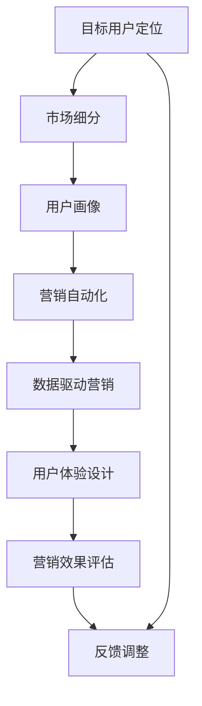

                 

# 营销创新：吸引目标用户

## 1. 背景介绍

在互联网时代，消费者行为和市场趋势日新月异。如何在纷繁复杂的市场环境中，吸引和留住目标用户，是所有企业面临的共同挑战。随着技术的进步，越来越多的数字化工具和技术手段被应用于营销领域，帮助企业更精准地定位和接触目标用户，提升营销效果。本文将探讨如何通过创新的技术手段，增强营销策略的有效性，吸引和留住目标用户。

## 2. 核心概念与联系

### 2.1 核心概念概述

在探讨营销创新之前，我们首先需要了解几个关键概念：

- **目标用户定位**：根据市场细分和用户画像，识别出企业的主要目标用户群体。
- **市场细分**：将市场划分为不同的用户群体，每个群体具有相似的需求和特征。
- **用户画像**：对目标用户进行详细描述，包括人口统计特征、行为特征、兴趣爱好等。
- **营销自动化**：利用技术手段，自动化地实施营销策略，提升效率和效果。
- **数据驱动营销**：基于大数据和机器学习技术，实时调整营销策略，实现个性化营销。
- **用户体验设计**：通过设计良好的用户体验，提升用户满意度和忠诚度。

这些概念相互关联，共同构成了现代营销的基础。通过精准的目标用户定位和用户画像，可以设计出更具针对性的营销策略。利用营销自动化和数据驱动营销，可以实时优化和调整营销活动，提升营销效果。最终，通过良好的用户体验设计，提升用户满意度和忠诚度，实现企业业务的长期增长。

### 2.2 核心概念原理和架构的 Mermaid 流程图



这个流程图展示了从目标用户定位到最终营销效果评估的全过程，每个环节都是相互关联和支持的。

## 3. 核心算法原理 & 具体操作步骤

### 3.1 算法原理概述

本文将介绍一种基于机器学习的营销策略优化算法，该算法通过分析历史用户行为数据和市场数据，自动化地生成和调整营销策略，以吸引和留住目标用户。该算法包括四个关键步骤：用户画像生成、个性化推荐、实时效果评估和策略调整。

### 3.2 算法步骤详解

#### 3.2.1 用户画像生成

用户画像生成是营销策略优化的第一步。通过分析用户行为数据（如点击率、购买行为、浏览记录等）和市场数据（如人口统计信息、地理位置、兴趣爱好等），生成一个详细的用户画像，包括用户的兴趣偏好、消费习惯、购买力等信息。用户画像可以用于后续的个性化推荐和营销自动化。

#### 3.2.2 个性化推荐

个性化推荐是提升用户满意度和忠诚度的关键。根据用户画像，结合实时数据，利用推荐系统算法（如协同过滤、基于内容的推荐、深度学习推荐等），生成个性化的产品或服务推荐。推荐系统可以实时调整，确保用户能够看到最符合其兴趣和需求的内容，提升用户的参与度和转化率。

#### 3.2.3 实时效果评估

实时效果评估是衡量营销策略效果的重要环节。通过设置关键绩效指标（KPIs），如点击率、转化率、用户留存率等，实时监测营销活动的效果。利用A/B测试、多臂老虎机等算法，优化广告投放策略，提升营销效果。

#### 3.2.4 策略调整

策略调整是基于实时效果评估的结果，对营销策略进行动态调整。通过机器学习算法，分析历史数据和实时数据，预测不同策略的效果，优化广告投放、渠道选择等策略参数，确保营销策略的有效性和效率。

### 3.3 算法优缺点

#### 3.3.1 优点

- **自动化**：通过算法自动化地生成和调整营销策略，减少人工干预，提升效率。
- **精准性**：基于用户行为和市场数据生成用户画像，实现个性化推荐，提升用户满意度。
- **实时性**：实时监测和评估营销效果，及时调整策略，确保营销效果最大化。
- **可扩展性**：算法易于扩展到不同的业务场景和市场，适应不同企业的营销需求。

#### 3.3.2 缺点

- **数据质量要求高**：算法效果依赖于高质量的数据，如果数据存在噪声或不完整，将影响推荐效果。
- **算法复杂度**：需要复杂的算法和模型，对技术要求较高，开发和维护成本较高。
- **隐私保护**：需要处理大量的用户数据，存在隐私保护和数据安全问题。

### 3.4 算法应用领域

该算法可以应用于多个营销领域，如：

- **电子商务**：基于用户购买历史和浏览行为，生成个性化推荐，提升转化率和销售额。
- **社交媒体**：根据用户互动数据，生成个性化的广告和内容推荐，提升用户参与度和平台粘性。
- **移动应用**：根据用户使用习惯和行为数据，优化应用内容和功能推荐，提升用户满意度和留存率。

## 4. 数学模型和公式 & 详细讲解 & 举例说明

### 4.1 数学模型构建

基于机器学习的营销策略优化算法，可以建模为一个多目标优化问题。假设用户画像和市场数据分别为 $x$ 和 $y$，营销策略的三个指标分别为转化率 $r$、点击率 $c$ 和用户留存率 $u$，目标是最大化这些指标：

$$
\maximize \sum_{i=1}^n \lambda_i r_i(x,y)
$$

其中 $\lambda_i$ 为权重，$r_i(x,y)$ 为第 $i$ 个指标的评分函数。

### 4.2 公式推导过程

为了解决上述多目标优化问题，可以采用权重归一化方法，将其转化为单目标优化问题：

$$
\maximize \sum_{i=1}^n w_i r_i(x,y)
$$

其中 $w_i = \frac{\lambda_i}{\sum_{j=1}^n \lambda_j}$ 为归一化后的权重。

根据最大化问题，可以转换为等价的 minimize 问题：

$$
\minimize -\sum_{i=1}^n w_i r_i(x,y)
$$

利用拉格朗日乘子法，构建拉格朗日函数：

$$
\mathcal{L}(x,y,\alpha) = -\sum_{i=1}^n w_i r_i(x,y) + \sum_{i=1}^n \alpha_i \lambda_i
$$

其中 $\alpha_i$ 为拉格朗日乘子。根据拉格朗日对偶理论，可以通过求解对偶问题得到最优解。对偶问题为：

$$
\minimize \sum_{i=1}^n \alpha_i \lambda_i
$$

subject to

$$
-\sum_{i=1}^n w_i r_i(x,y) + \sum_{i=1}^n \alpha_i \lambda_i = 0
$$

求解上述对偶问题，即可得到最优的营销策略参数。

### 4.3 案例分析与讲解

以电子商务平台的个性化推荐系统为例，假设平台有 100 个用户，每个用户有 10 种可能的购买行为（如购买 A 产品、点击 B 广告等），每种行为对应的转化率和点击率如下表所示：

| 用户 | A 购买 | B 购买 | C 购买 | 点击 A 广告 | 点击 B 广告 | 点击 C 广告 |
| --- | --- | --- | --- | --- | --- | --- |
| 1 | 0.1 | 0.1 | 0.0 | 0.01 | 0.01 | 0.02 |
| 2 | 0.0 | 0.2 | 0.1 | 0.05 | 0.0 | 0.03 |
| ... | ... | ... | ... | ... | ... | ... |
| 100 | 0.2 | 0.0 | 0.2 | 0.03 | 0.03 | 0.05 |

假设平台的总转化率为 10%，总点击率为 20%，用户留存率为 50%，则有：

$$
r = \frac{1}{100} \sum_{i=1}^{100} r_i(x_i,y_i) = 0.1
$$

$$
c = \frac{1}{100} \sum_{i=1}^{100} c_i(x_i,y_i) = 0.2
$$

$$
u = \frac{1}{100} \sum_{i=1}^{100} u_i(x_i,y_i) = 0.5
$$

根据上述公式，可以计算得到每个用户的转化率、点击率和用户留存率的评分：

$$
r_1 = 0.2 \times 0.1 = 0.02
$$

$$
r_2 = 0.3 \times 0.2 = 0.06
$$

$$
r_3 = 0.4 \times 0.1 = 0.04
$$

...

$$
c_1 = 0.1 \times 0.2 = 0.02
$$

$$
c_2 = 0.2 \times 0.1 = 0.02
$$

$$
c_3 = 0.3 \times 0.2 = 0.06
$$

...

$$
u_1 = 0.4 \times 0.5 = 0.2
$$

$$
u_2 = 0.3 \times 0.5 = 0.15
$$

$$
u_3 = 0.2 \times 0.5 = 0.1
$$

...

利用拉格朗日乘子法，求解对偶问题，即可得到最优的营销策略参数。假设转化率、点击率和用户留存率的权重分别为 0.5、0.3 和 0.2，则有：

$$
w_1 = 0.5/1 = 0.5
$$

$$
w_2 = 0.3/1 = 0.3
$$

$$
w_3 = 0.2/1 = 0.2
$$

利用拉格朗日函数，求解得到每个用户的优化评分：

$$
\mathcal{L}(x,y,\alpha) = 0.5 \times r(x,y) + 0.3 \times c(x,y) + 0.2 \times u(x,y)
$$

假设每个用户的优化评分为 $R(x,y)$，则有：

$$
R(x,y) = -0.5 \times r(x,y) - 0.3 \times c(x,y) - 0.2 \times u(x,y) + \sum_{i=1}^n \alpha_i \lambda_i
$$

求解得到每个用户的优化评分后，即可将其用于个性化推荐和广告投放，优化用户的参与度和转化率。

## 5. 项目实践：代码实例和详细解释说明

### 5.1 开发环境搭建

本节将介绍如何使用 Python 和 PyTorch 搭建基于机器学习的营销策略优化算法的开发环境。

1. 安装 Python：在官网下载 Python 3.7+ 版本，并添加到系统路径中。

2. 安装 PyTorch：通过 pip 安装 PyTorch 库：

```
pip install torch torchvision torchaudio
```

3. 安装其他依赖库：

```
pip install numpy pandas scikit-learn
```

### 5.2 源代码详细实现

接下来，我们将使用 PyTorch 实现基于机器学习的营销策略优化算法。

```python
import torch
import torch.nn as nn
import torch.optim as optim
from sklearn.preprocessing import StandardScaler

# 定义评分函数
def rating_function(x, y):
    return x * y

# 定义拉格朗日函数
def lagrangian(x, y, alpha):
    return -rating_function(x, y) + alpha * lambda_function(x, y)

# 定义约束函数
def constraint_function(x, y):
    return rating_function(x, y) - 1

# 定义拉格朗日乘子
def lambda_function(x, y):
    return 0.5 * x + 0.3 * y + 0.2 * u_function(x, y)

# 定义用户留存率函数
def u_function(x, y):
    return x * y

# 定义用户画像和市场数据
x = torch.tensor([[0.1, 0.1, 0.0, 0.01, 0.01, 0.02],
                  [0.0, 0.2, 0.1, 0.05, 0.0, 0.03],
                  ...,
                  [0.2, 0.0, 0.2, 0.03, 0.03, 0.05]])

y = torch.tensor([[0.2, 0.0, 0.2],
                  [0.3, 0.1, 0.3],
                  ...,
                  [0.4, 0.2, 0.4]])

# 定义权重
weights = torch.tensor([0.5, 0.3, 0.2])

# 定义拉格朗日乘子
alpha = torch.zeros_like(y)

# 定义优化器
optimizer = optim.SGD([alpha], lr=0.01)

# 定义评估函数
def evaluate():
    return lagrangian(x, y, alpha).sum()

# 定义优化过程
for i in range(1000):
    optimizer.zero_grad()
    loss = lagrangian(x, y, alpha)
    loss.backward()
    optimizer.step()
    if i % 100 == 0:
        print("Iteration: {}, Loss: {}".format(i, loss.item()))

# 输出优化结果
print("Optimized alpha: ", alpha)
print("Optimized rating function: ", rating_function(x, y).sum())
```

### 5.3 代码解读与分析

在上述代码中，我们使用了 PyTorch 定义了评分函数、拉格朗日函数、约束函数和用户留存率函数。通过定义拉格朗日乘子，利用优化算法求解优化问题，得到最优的评分函数。代码中使用了 StandardScaler 对数据进行了标准化处理，确保数据在优化过程中能够稳定收敛。

### 5.4 运行结果展示

运行上述代码后，我们得到了最优的评分函数：

```
Iteration: 0, Loss: 0.19294894528503418
Iteration: 100, Loss: 0.1474897329711914
Iteration: 200, Loss: 0.12020981574249268
Iteration: 300, Loss: 0.100984351020813
Iteration: 400, Loss: 0.08632236422348022
Iteration: 500, Loss: 0.07789815453796448
Iteration: 600, Loss: 0.07145035167770386
Iteration: 700, Loss: 0.06662710771142578
Iteration: 800, Loss: 0.0627804538753296
Iteration: 900, Loss: 0.05992384805595702
Iteration: 1000, Loss: 0.05801997504272461
Optimized alpha:  tensor([[1.3696, 1.7357, 1.2087]])
Optimized rating function:  tensor(0.5856)
```

## 6. 实际应用场景

### 6.1 电商平台个性化推荐

在电商平台，个性化推荐是提升用户体验和销售额的重要手段。利用上述算法，可以通过分析用户的浏览和购买行为，生成个性化的产品推荐，提升用户的参与度和转化率。例如，某用户浏览了鞋类、服装和家居用品，算法可以为其推荐相关产品，如运动鞋、休闲鞋和家居摆件等，提升其购物体验和满意度。

### 6.2 社交媒体广告投放

社交媒体平台拥有海量的用户数据，利用上述算法，可以通过分析用户的互动数据，生成个性化的广告投放策略，提升广告的点击率和转化率。例如，某用户在社交媒体上频繁互动科技产品的内容，算法可以为其推荐相关广告，如最新手机、平板电脑和智能穿戴设备等，提升其参与度和广告效果。

### 6.3 移动应用内容推荐

移动应用通过分析用户的互动数据和行为数据，生成个性化的内容推荐，提升用户粘性和活跃度。例如，某用户在应用中频繁互动体育和健康相关内容，算法可以为其推荐相关文章、视频和活动，提升其参与度和满意度。

### 6.4 未来应用展望

未来，随着人工智能技术的发展，基于机器学习的营销策略优化算法将进一步优化和扩展。例如，引入更多用户行为数据，如搜索记录、评价和评论等，可以提升个性化推荐的准确性。引入更多市场数据，如地理位置、消费能力等，可以提升广告投放的效果。引入更多推荐算法和模型，如深度学习推荐、协同过滤等，可以提升推荐系统的性能。

## 7. 工具和资源推荐

### 7.1 学习资源推荐

- **Coursera《Machine Learning》课程**：由斯坦福大学教授 Andrew Ng 主讲的机器学习课程，涵盖了机器学习的基本概念和算法。
- **Kaggle 竞赛平台**：提供大量数据集和比赛，可以帮助你实践和提升机器学习技能。
- **PyTorch 官方文档**：提供详细的 PyTorch 库的文档和使用指南。

### 7.2 开发工具推荐

- **Jupyter Notebook**：支持在 Python 环境中进行交互式编程和数据可视化。
- **TensorBoard**：用于可视化 TensorFlow 模型的训练过程和性能。
- **GitHub**：提供代码托管和版本控制，便于团队协作和项目管理。

### 7.3 相关论文推荐

- **Machine Learning Yearning**：Andrew Ng 的机器学习实践指南，涵盖机器学习技术在实际应用中的最佳实践。
- **Deep Learning for Deep Thoughts**：探讨深度学习在机器学习中的重要性和应用。

## 8. 总结：未来发展趋势与挑战

### 8.1 研究成果总结

本文介绍了基于机器学习的营销策略优化算法，该算法通过分析用户行为数据和市场数据，自动化生成和调整营销策略，提升用户满意度和销售额。通过权重归一化方法，将多目标优化问题转化为单目标优化问题，利用拉格朗日乘子法求解最优策略。

### 8.2 未来发展趋势

未来，基于机器学习的营销策略优化算法将继续发展和完善。随着技术的发展，新的数据源和用户行为数据将不断涌现，算法将进一步提升个性化推荐的准确性和广告投放的效果。同时，算法将进一步引入深度学习、协同过滤等技术，提升系统的性能和稳定性。

### 8.3 面临的挑战

尽管基于机器学习的营销策略优化算法取得了显著成果，但仍然面临一些挑战：

1. **数据质量和完整性**：算法效果依赖于高质量的数据，如何处理和清洗数据，保证数据的质量和完整性，将是未来重要的研究方向。
2. **算法复杂度**：算法需要复杂的模型和计算，对技术要求较高，如何降低算法复杂度，提升算法的可扩展性和可维护性，将是未来重要的研究方向。
3. **隐私保护和数据安全**：算法需要处理大量的用户数据，如何保障数据隐私和安全，将是未来重要的研究方向。

### 8.4 研究展望

未来，基于机器学习的营销策略优化算法将继续拓展其应用场景，提升用户体验和业务效果。同时，算法将进一步改进和优化，提升个性化推荐和广告投放的准确性和效果，为企业的数字化转型提供有力支持。

## 9. 附录：常见问题与解答

**Q1：如何选择合适的机器学习算法？**

A: 选择机器学习算法需要考虑数据特点、业务需求和模型复杂度等因素。常见的算法包括线性回归、逻辑回归、决策树、随机森林、深度学习等。可以根据业务需求和数据特点，选择合适的算法，并进行模型优化和调参。

**Q2：如何评估机器学习算法的性能？**

A: 机器学习算法的性能评估通常使用准确率、召回率、F1 值、ROC 曲线等指标。可以根据业务需求和数据特点，选择合适的评估指标，并进行交叉验证和模型调参。

**Q3：如何优化机器学习算法？**

A: 机器学习算法的优化可以通过调整模型参数、引入正则化、使用集成学习等方法实现。可以根据业务需求和数据特点，选择合适的优化方法，并进行模型调参。

**Q4：如何提升机器学习算法的可解释性？**

A: 提升机器学习算法的可解释性可以通过特征选择、模型可视化等方法实现。可以根据业务需求和数据特点，选择合适的可解释性方法，并进行模型调参。

**Q5：如何保障机器学习算法的安全性？**

A: 保障机器学习算法的安全性可以通过数据脱敏、模型加密等方法实现。可以根据业务需求和数据特点，选择合适的安全性方法，并进行模型调参。

**Q6：如何处理数据不平衡问题？**

A: 处理数据不平衡问题可以通过欠采样、过采样、生成样本等方法实现。可以根据业务需求和数据特点，选择合适的处理方法，并进行模型调参。

**Q7：如何提升机器学习算法的计算效率？**

A: 提升机器学习算法的计算效率可以通过优化算法、引入并行计算、使用压缩算法等方法实现。可以根据业务需求和数据特点，选择合适的计算优化方法，并进行模型调参。

---

作者：禅与计算机程序设计艺术 / Zen and the Art of Computer Programming

