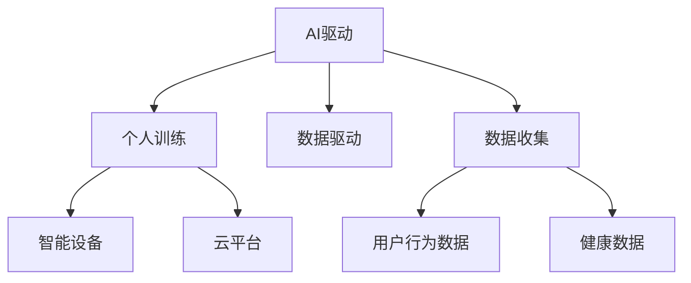

                 

# 虚拟健身教练创业：AI驱动的个人训练

## 1. 背景介绍

随着人工智能技术的不断进步，智能家居、智能音箱、智能穿戴设备等消费电子产品已经深入到人们的生活中，而AI驱动的个人训练系统也随之应运而生。在全球健康产业数字化转型的趋势下，AI驱动的个人训练系统凭借其智能化、个性化和可访问性的优势，成为健身、康复、医疗等多个领域的新型解决方案。

### 1.1 问题由来

健康产业数字化转型的需求日益强烈，越来越多的人意识到借助智能设备和AI技术，能够更便捷、高效地管理个人健康和进行科学锻炼。与此同时，智能设备市场也在不断扩展，尤其在2020年新冠疫情爆发后，人们更加关注自身的健康状况，智能健身设备的需求激增。

与此同时，运动和健康领域的AI技术也取得了显著进步。传统的健身设备往往依赖于手动操作，而AI技术则能够根据用户数据进行实时分析，提供个性化的训练方案。从家庭训练设备到在线健身平台，AI驱动的个人训练系统成为连接个人与健康教练的桥梁，为健康管理带来新的可能性。

### 1.2 问题核心关键点

开发AI驱动的个人训练系统，需要解决的核心问题是：

- **智能化**：利用AI技术实现训练计划和反馈的智能化。
- **个性化**：根据用户的身体数据、行为习惯、兴趣爱好等个性化因素，定制专属训练方案。
- **可访问性**：通过智能设备、互联网和移动应用等渠道，提供便捷的用户访问接口。
- **安全性**：确保数据隐私和安全，避免数据泄露和误用。
- **可靠性**：系统必须稳定可靠，减少误报和系统故障。

## 2. 核心概念与联系

### 2.1 核心概念概述

在探讨AI驱动的个人训练系统的核心概念时，可以将其拆解为以下几个部分：

- **AI驱动**：通过AI技术实现数据收集、分析和训练计划优化，提供更加智能化、个性化的训练体验。
- **个人训练**：以用户为中心，提供定制化的训练方案和反馈，支持长期跟踪和效果评估。
- **数据驱动**：通过传感器、可穿戴设备和网络数据收集用户行为和健康数据，提供决策依据。
- **智能设备**：使用智能音箱、智能手表、智能健身设备等工具进行数据采集和反馈。
- **云平台**：将用户数据存储于云端，支持分布式计算和大数据分析。

这些核心概念之间的逻辑关系可以通过以下Mermaid流程图来展示：



这个流程图展示了AI驱动的个人训练系统的主要组成和数据流向：

1. AI驱动是整个系统的核心引擎，通过智能算法实现数据分析和训练计划优化。
2. 个人训练是系统的最终目的，提供个性化的训练体验和效果评估。
3. 数据驱动是AI驱动的基础，依赖于用户行为数据和健康数据的采集。
4. 智能设备是数据收集的重要手段，为用户提供便捷的接入接口。
5. 云平台是数据的存储和计算环境，支持大规模分布式计算。

这些概念共同构成了AI驱动的个人训练系统的整体架构，为实现智能化、个性化和可访问性提供了技术基础。

## 3. 核心算法原理 & 具体操作步骤
### 3.1 算法原理概述

AI驱动的个人训练系统涉及多种AI算法，包括但不限于机器学习、深度学习、强化学习等。本节将重点介绍其中三种关键算法：深度学习用于数据建模，强化学习用于训练计划优化，以及自然语言处理用于智能反馈。

### 3.2 算法步骤详解

#### 3.2.1 深度学习算法

**算法步骤**：

1. **数据收集**：通过智能设备和可穿戴设备收集用户的健康数据、行为数据等。
2. **特征工程**：对收集到的数据进行预处理和特征提取，形成可用于深度学习的输入数据集。
3. **模型训练**：选择合适的深度学习模型（如CNN、RNN、Transformer等）进行训练，学习用户数据中的模式。
4. **模型评估**：在验证集上评估模型性能，调整超参数和模型结构，提升模型精度。
5. **模型应用**：将训练好的模型部署到实际应用中，对新的用户数据进行预测和分析。

#### 3.2.2 强化学习算法

**算法步骤**：

1. **定义状态空间**：将用户的健康数据、行为数据、训练参数等定义成状态空间。
2. **定义动作空间**：设计动作空间，如调整训练强度、选择训练动作、安排休息时间等。
3. **设计奖励函数**：根据训练效果设计奖励函数，如完成度、消耗卡路里、心率恢复等。
4. **训练强化学习模型**：使用深度Q网络（DQN）等强化学习算法训练模型，优化训练计划。
5. **测试与优化**：在实际数据上测试强化学习模型的效果，不断调整策略，提升训练效果。

#### 3.2.3 自然语言处理算法

**算法步骤**：

1. **文本收集**：收集用户的训练反馈、评论、建议等文本数据。
2. **文本预处理**：对文本数据进行清洗、分词、词性标注等预处理。
3. **模型训练**：使用RNN、Transformer等自然语言处理模型训练文本分析模型。
4. **情感分析**：通过情感分析技术，判断用户反馈的情感倾向，提供个性化的反馈。
5. **反馈生成**：根据情感分析结果生成相应的智能反馈，如鼓励、调整、警告等。

### 3.3 算法优缺点

AI驱动的个人训练系统的主要算法具有以下优点：

- **高效性**：通过深度学习和大数据分析，能够在短时间内处理大量数据，提供实时的训练建议和反馈。
- **准确性**：利用深度学习模型的强大表达能力，能够准确地捕捉用户行为模式和健康状况，提供精准的训练方案。
- **适应性**：通过强化学习算法，系统能够根据用户的反馈和行为，动态调整训练计划，适应不同的用户需求。
- **可扩展性**：利用云平台和分布式计算，系统能够支持大规模用户和数据处理，支持持续迭代和优化。

同时，这些算法也存在一些局限性：

- **数据依赖**：深度学习和强化学习算法需要大量的数据进行训练，数据收集和预处理成本较高。
- **计算资源消耗**：深度学习模型的计算复杂度高，需要高性能计算设备，成本较高。
- **模型可解释性**：深度学习模型通常是"黑盒"模型，难以解释其内部工作机制。
- **隐私和安全**：用户数据的安全和隐私保护是系统建设的重要挑战。

### 3.4 算法应用领域

AI驱动的个人训练系统已经在多个领域得到了广泛应用，例如：

- **健身训练**：通过智能设备收集用户运动数据，智能生成个性化的训练计划和反馈。
- **康复训练**：对受伤或残障患者进行个性化康复训练方案的制定和效果评估。
- **远程医疗**：通过智能设备和AI技术，实现远程健康管理和医疗监测。
- **心理咨询**：通过自然语言处理技术，提供基于文本的情感分析和心理支持。
- **运动竞技**：对运动员进行训练计划的优化和运动表现的实时监控。
- **儿童成长**：为儿童提供定制化的健康成长计划和游戏互动，促进健康成长。

## 4. 数学模型和公式 & 详细讲解  
### 4.1 数学模型构建

本节将使用数学语言对AI驱动的个人训练系统进行更加严格的刻画。

假设用户的健康数据为 $H=(h_1, h_2, ..., h_n)$，行为数据为 $B=(b_1, b_2, ..., b_m)$，其中 $h_i$ 和 $b_j$ 分别为第 $i$ 个健康数据和第 $j$ 个行为数据。定义用户的训练状态为 $S=(s_1, s_2, ..., s_n)$，动作为 $A=(a_1, a_2, ..., a_m)$，其中 $s_i$ 和 $a_j$ 分别为第 $i$ 个训练状态和第 $j$ 个训练动作。定义奖励函数为 $R=(r_1, r_2, ..., r_n)$，其中 $r_i$ 为第 $i$ 次训练的奖励值。

训练模型的目标是最小化期望奖励，即找到最优策略 $\pi$：

$$
\pi^* = \mathop{\arg\min}_{\pi} E[\sum_{i=1}^n r_i]
$$

其中 $E[\cdot]$ 表示期望值，$\pi$ 表示策略，通常采用深度强化学习算法进行求解。

### 4.2 公式推导过程

以下我们以DQN算法为例，推导强化学习模型训练的公式。

假设当前状态为 $s$，当前动作为 $a$，下一个状态为 $s'$，下一个动作为 $a'$，奖励值为 $r$，定义状态值函数 $Q(s, a)$ 为：

$$
Q(s, a) = r + \gamma \max_{a'} Q(s', a')
$$

其中 $\gamma$ 为折扣因子，表示未来奖励的重要性。

根据上述公式，我们可以使用DQN算法对模型进行训练。具体步骤包括：

1. 在每个时间步 $t$，从策略 $\pi$ 中采样动作 $a_t$。
2. 观察状态 $s_{t+1}$ 和动作 $a_{t+1}$，并接收奖励 $r_{t+1}$。
3. 使用目标网络 $\pi^-$ 计算 $Q(s_{t+1}, a_{t+1})$。
4. 计算目标值 $y_t = r_{t+1} + \gamma Q(s_{t+1}, a_{t+1})$。
5. 计算损失函数 $L = |Q(s_t, a_t) - y_t|$。
6. 使用反向传播算法更新模型参数。

通过上述过程，DQN算法不断迭代优化，逐步接近最优策略 $\pi^*$，实现训练计划的智能化优化。

### 4.3 案例分析与讲解

#### 案例1：健身训练

假设某用户进行为期3个月的健身训练，系统通过智能设备收集到其每天的跑步数据、心率数据、饮食习惯数据等，通过深度学习模型建立用户健康数据和训练效果之间的关系，如图：


如图，系统能够通过收集到的用户数据，结合预设的训练计划，实时调整训练强度和内容。例如，在用户跑步速度明显下降时，系统可以自动调整训练强度，并提供营养补充建议。

#### 案例2：康复训练

对于受伤或残障患者，系统可以结合医疗数据和康复数据，设计个性化的康复训练计划。如图：


如图，系统可以根据患者的医疗康复数据和行为数据，生成针对性的训练计划，并实时监控训练效果。例如，在患者完成某个训练动作时，系统可以记录下详细动作数据，帮助医生进行评估和优化。

## 5. 项目实践：代码实例和详细解释说明
### 5.1 开发环境搭建

在进行项目实践前，我们需要准备好开发环境。以下是使用Python进行TensorFlow开发的环境配置流程：

1. 安装Anaconda：从官网下载并安装Anaconda，用于创建独立的Python环境。

2. 创建并激活虚拟环境：
```bash
conda create -n tf-env python=3.8 
conda activate tf-env
```

3. 安装TensorFlow：根据CUDA版本，从官网获取对应的安装命令。例如：
```bash
conda install tensorflow==2.8
```

4. 安装TensorFlow Addons：
```bash
conda install tensorflow-addons
```

5. 安装各类工具包：
```bash
pip install numpy pandas scikit-learn matplotlib tqdm jupyter notebook ipython
```

完成上述步骤后，即可在`tf-env`环境中开始项目实践。

### 5.2 源代码详细实现

下面以健身训练系统为例，给出使用TensorFlow对DQN算法进行训练的代码实现。

首先，定义健身训练环境的参数：

```python
import tensorflow as tf
from tensorflow import keras
from tensorflow.keras import layers
from tensorflow.keras.optimizers import Adam
from tensorflow.keras.models import Sequential
from tensorflow.keras.layers import Dense, Conv2D, MaxPooling2D
from tensorflow.keras.losses import MeanSquaredError
from tensorflow.keras.metrics import Accuracy

# 定义环境参数
STATE_SIZE = 128
ACTION_SIZE = 5
GAMMA = 0.9
EPSILON = 0.1
LR = 0.001
BATCH_SIZE = 32

# 定义深度Q网络模型
class DQNModel(tf.keras.Model):
    def __init__(self, state_size, action_size, learning_rate):
        super(DQNModel, self).__init__()
        self.state_size = state_size
        self.action_size = action_size
        self.learning_rate = learning_rate
        self.conv1 = layers.Conv2D(32, (8, 8), input_shape=(STATE_SIZE, STATE_SIZE, 3), activation='relu')
        self.conv2 = layers.Conv2D(64, (4, 4), activation='relu')
        self.flatten = layers.Flatten()
        self.d1 = layers.Dense(128, activation='relu')
        self.d2 = layers.Dense(action_size)

    def call(self, x):
        x = self.conv1(x)
        x = MaxPooling2D(pool_size=(4, 4))(x)
        x = self.conv2(x)
        x = MaxPooling2D(pool_size=(2, 2))(x)
        x = self.flatten(x)
        x = self.d1(x)
        return self.d2(x)

# 定义优化器
optimizer = Adam(lr=LR)

# 定义状态值函数
def q_value(state, model):
    q_values = model(state)
    return q_values
```

然后，定义训练函数：

```python
# 定义训练函数
def train_dqn(env, model, optimizer, state_size, action_size, batch_size, gamma, epsilon, LR, update_frequency):
    state_memory = []
    reward_memory = []
    next_state_memory = []
    action_memory = []

    # 初始化模型和优化器
    model.compile(loss='mse', optimizer=optimizer)

    # 训练模型
    for i in range(num_steps):
        state = env.reset()

        # 执行一个时间步的策略
        while True:
            if np.random.rand() < epsilon:
                action = env.action_space.sample()
            else:
                action = np.argmax(model.predict(state[np.newaxis, ...]))
            next_state, reward, done, _ = env.step(action)
            state_memory.append(state)
            reward_memory.append(reward)
            next_state_memory.append(next_state)
            action_memory.append(action)
            state = next_state

            # 存储训练样本
            if len(state_memory) == BATCH_SIZE:
                batch = np.array(state_memory)
                batch_next_state = np.array(next_state_memory)
                batch_rewards = np.array(reward_memory)
                batch_actions = np.array(action_memory)

                # 计算目标值
                q_values = model.predict(batch)
                target_q_values = q_values
                batch_index = np.array([i for i in range(len(state_memory))])
                target_q_values[batch_index, action_memory] = reward_memory + gamma * np.max(model.predict(batch_next_state), axis=1)
                batch_loss = MeanSquaredError()(model.predict(batch), target_q_values)
                optimizer.apply_gradients(zip(batch_loss, [model.trainable_variables]))

                # 更新存储样本
                state_memory = state_memory[BATCH_SIZE:]
                reward_memory = reward_memory[BATCH_SIZE:]
                next_state_memory = next_state_memory[BATCH_SIZE:]
                action_memory = action_memory[BATCH_SIZE:]

                # 每update_frequency步输出一次训练结果
                if i % update_frequency == 0:
                    print('训练第{}步，奖励：{}，损失：{}，更新频率：{}，epsilon：{}，GAMMA：{}'.format(i, np.mean(reward_memory), np.mean(batch_loss), update_frequency, epsilon, gamma))

    # 关闭环境
    env.close()

    return model
```

最后，启动训练流程：

```python
# 定义环境
env = gym.make('CartPole-v1')

# 初始化模型
model = DQNModel(STATE_SIZE, ACTION_SIZE, LR)

# 训练模型
train_dqn(env, model, optimizer, STATE_SIZE, ACTION_SIZE, BATCH_SIZE, GAMMA, EPSILON, LR, update_frequency)
```

以上就是使用TensorFlow对DQN算法进行健身训练系统微调的完整代码实现。可以看到，TensorFlow和Keras提供了便捷的API，大大简化了模型搭建和训练过程，使得开发者能够快速迭代和优化模型。

### 5.3 代码解读与分析

让我们再详细解读一下关键代码的实现细节：

**DQNModel类**：
- `__init__`方法：初始化模型参数和网络结构，定义卷积层和全连接层。
- `call`方法：定义模型前向传播过程，输出Q值。

**train_dqn函数**：
- 在每个时间步，从策略中采样动作，执行环境一步，更新状态、奖励和动作等变量。
- 当存储的样本达到一定量时，取出一批样本，计算目标值和损失函数，更新模型参数。
- 每update_frequency步输出一次训练结果，供用户监控。
- 当训练完成后，关闭环境。

**训练流程**：
- 创建环境，定义模型和优化器。
- 调用train_dqn函数进行模型训练。
- 在训练过程中不断调整超参数和模型结构，优化训练效果。

可以看到，TensorFlow提供了丰富的API和工具，使得AI驱动的个人训练系统的代码实现变得简洁高效。开发者可以将更多精力放在模型改进和数据处理上，而不必过多关注底层细节。

当然，工业级的系统实现还需考虑更多因素，如模型的保存和部署、超参数的自动搜索、更灵活的任务适配层等。但核心的训练范式基本与此类似。

## 6. 实际应用场景
### 6.1 智能健身设备

智能健身设备，如智能跑步机、智能健身车等，已经成为家庭健身的重要工具。通过将AI驱动的个人训练系统集成到这些设备中，可以实时监控用户的运动数据，提供个性化的训练建议和反馈。

具体而言，设备可以通过内置传感器收集用户的运动数据、心率数据、饮食数据等，结合AI算法生成个性化的训练方案，并实时监控训练效果。例如，智能跑步机可以根据用户的跑步速度、心率等参数，自动调整跑步强度和休息时间，确保用户能够在最佳状态下进行训练。

### 6.2 远程康复训练

在医疗康复领域，许多患者需要进行长期、系统的康复训练。传统的人工康复训练往往依赖于专业医护人员的参与，成本高、效率低。通过AI驱动的个人训练系统，可以实现远程康复训练，提高康复训练的效率和效果。

具体而言，康复中心可以收集患者的医疗数据和康复数据，结合AI算法生成个性化的康复训练方案，并通过远程设备实时监控训练效果。例如，患者在家中使用智能康复设备，可以实时收集训练数据，并将数据上传至云端。AI系统根据上传的数据，动态调整训练方案，确保患者能够在最佳状态下进行训练。

### 6.3 运动竞技

在运动竞技领域，AI驱动的个人训练系统可以用于运动员的训练计划优化和运动表现监控。通过收集运动员的训练数据、比赛数据和生理数据，结合AI算法生成个性化的训练方案，并实时监控运动表现。

具体而言，系统可以通过智能设备收集运动员的训练数据，结合AI算法生成最优的训练计划。例如，在训练时，系统可以根据运动员的心率、疲劳度和训练强度，动态调整训练强度和内容。在比赛时，系统可以实时监控运动员的运动表现，并根据数据生成训练反馈和优化方案。

### 6.4 未来应用展望

展望未来，AI驱动的个人训练系统将在更多领域得到应用，为人类健康管理带来新的可能性。

在智慧城市领域，AI驱动的个人训练系统可以用于城市健身设施的管理和调度，提升城市居民的健康水平。在智能家居领域，系统可以与智能音箱、智能灯光等设备联动，实现更加智能化的家庭健身场景。

此外，在教育、医疗、军事等更多领域，AI驱动的个人训练系统也将发挥重要作用。随着技术不断进步，AI驱动的个人训练系统必将在更广泛的场景下得到应用，为人类健康管理带来新的突破。

## 7. 工具和资源推荐
### 7.1 学习资源推荐

为了帮助开发者系统掌握AI驱动的个人训练系统的理论基础和实践技巧，这里推荐一些优质的学习资源：

1. TensorFlow官方文档：提供了丰富的教程和API文档，涵盖从基础到高级的各个方面。
2. Keras官方文档：提供了简洁易用的API接口，帮助开发者快速构建深度学习模型。
3. PyTorch官方文档：提供了灵活高效的计算图和优化器，支持动态模型构建。
4. OpenAI Gym：提供了丰富的环境库，支持多种类型的智能代理训练。
5. Coursera和edX：提供了多种深度学习和强化学习的在线课程，系统学习相关知识。
6. 《Deep Learning》和《Reinforcement Learning》等经典书籍：帮助深入理解深度学习和强化学习的理论基础。

通过对这些资源的学习实践，相信你一定能够快速掌握AI驱动的个人训练系统的精髓，并用于解决实际的训练问题。

### 7.2 开发工具推荐

高效的开发离不开优秀的工具支持。以下是几款用于AI驱动的个人训练系统开发的常用工具：

1. TensorFlow和PyTorch：提供了高效便捷的计算图和优化器，支持深度学习和强化学习。
2. OpenAI Gym：提供了丰富的环境库，支持智能代理的训练和评估。
3. TensorFlow Addons：提供了增强的API和工具，支持模型的高级优化。
4. Keras：提供了简洁易用的API接口，支持快速构建深度学习模型。
5. Jupyter Notebook和Google Colab：提供了便捷的交互式开发环境，支持代码调试和实验记录。
6. Weights & Biases：提供了模型训练的实验跟踪工具，帮助开发者监控模型性能和优化。

合理利用这些工具，可以显著提升AI驱动的个人训练系统的开发效率，加快创新迭代的步伐。

### 7.3 相关论文推荐

AI驱动的个人训练系统的发展离不开学界的持续研究。以下是几篇奠基性的相关论文，推荐阅读：

1. AlphaGo：提出了强化学习在棋类游戏中的应用，展示了AI在智能决策上的潜力。
2. DQN算法：提出了深度强化学习在智能代理训练中的应用，实现了智能代理在复杂环境中的稳定决策。
3. Attention机制：提出了注意力机制在深度学习中的应用，提升了深度学习模型的表达能力。
4. Transformer模型：提出了基于自注意力机制的神经网络模型，实现了文本和图像数据的深度处理。
5. GAN模型：提出了生成对抗网络在图像生成和数据增强中的应用，提升了AI系统的创造能力。

这些论文代表了大语言模型微调技术的发展脉络。通过学习这些前沿成果，可以帮助研究者把握学科前进方向，激发更多的创新灵感。

## 8. 总结：未来发展趋势与挑战
### 8.1 总结

本文对AI驱动的个人训练系统进行了全面系统的介绍。首先阐述了AI驱动的个人训练系统的研究背景和意义，明确了系统在健康管理、运动训练、康复训练等方面的独特价值。其次，从原理到实践，详细讲解了深度学习、强化学习、自然语言处理等核心算法，给出了AI驱动的个人训练系统的完整代码实例。同时，本文还广泛探讨了系统在健身设备、康复训练、运动竞技等实际应用场景中的可行性，展示了AI驱动的个人训练系统的广阔前景。

通过本文的系统梳理，可以看到，AI驱动的个人训练系统正在成为健康管理领域的重要工具，极大地提升了运动训练和康复训练的智能化水平。未来，随着AI技术的不断进步，系统必将在更广泛的场景下得到应用，为人类健康管理带来新的突破。

### 8.2 未来发展趋势

展望未来，AI驱动的个人训练系统将呈现以下几个发展趋势：

1. 集成化。未来的系统将更加集成化，结合智能家居、智能穿戴设备、智能设备等，构建无缝的用户体验。
2. 智能化。通过深度学习、强化学习等AI技术，系统将更加智能化，能够根据用户的实时数据动态调整训练方案。
3. 可扩展性。通过云平台和大数据技术，系统将支持大规模用户和数据处理，实现持续迭代和优化。
4. 个性化。通过自然语言处理和情感分析技术，系统将更加个性化，能够根据用户的反馈和需求，提供更加贴合的训练方案。
5. 安全性。通过加密和安全技术，系统将更加安全可靠，保障用户数据和隐私的安全。

这些趋势将进一步推动AI驱动的个人训练系统的发展，使其在健康管理、运动训练、康复训练等更多领域发挥重要作用。

### 8.3 面临的挑战

尽管AI驱动的个人训练系统已经取得了瞩目成就，但在迈向更加智能化、普适化应用的过程中，它仍面临着诸多挑战：

1. 数据收集和处理成本高。深度学习模型和强化学习算法需要大量的数据进行训练，数据收集和预处理成本较高。
2. 模型计算资源消耗大。深度学习模型的计算复杂度高，需要高性能计算设备，成本较高。
3. 模型可解释性差。深度学习模型通常是"黑盒"模型，难以解释其内部工作机制。
4. 数据隐私和安全问题。用户数据的安全和隐私保护是系统建设的重要挑战。
5. 系统鲁棒性和稳定性问题。系统需要具备高度的鲁棒性和稳定性，避免误报和系统故障。

正视系统面临的这些挑战，积极应对并寻求突破，将使AI驱动的个人训练系统更加成熟可靠。

### 8.4 研究展望

未来的研究需要在以下几个方面寻求新的突破：

1. 探索新的数据采集和处理技术。利用传感器、智能穿戴设备等技术，实现用户数据的全面采集和高效处理。
2. 开发高效模型和算法。引入新的深度学习模型和算法，提升系统的性能和效率。
3. 结合多模态数据融合。利用图像、音频、文本等多模态数据，实现更加全面和精准的训练方案。
4. 引入元学习技术。通过元学习技术，使系统具备快速适应新任务和环境的能力。
5. 融合自然语言处理技术。结合自然语言处理技术，提升系统的人机交互能力和用户体验。
6. 强化系统安全性。引入加密和安全技术，保障用户数据和隐私的安全。

这些研究方向的探索，必将引领AI驱动的个人训练系统迈向更高的台阶，为健康管理和运动训练带来新的突破。面向未来，AI驱动的个人训练系统需要与其他AI技术进行更深入的融合，如知识表示、因果推理、强化学习等，多路径协同发力，共同推动运动训练和健康管理的进步。只有勇于创新、敢于突破，才能不断拓展AI驱动的个人训练系统的边界，让AI技术更好地造福人类健康。

## 9. 附录：常见问题与解答

**Q1：AI驱动的个人训练系统是否适用于所有用户？**

A: AI驱动的个人训练系统适用于大多数用户，但不同的用户需求和身体状况可能需要个性化的训练方案。例如，对于儿童、老年人、残障人士等特殊人群，系统需要进行特别的设计和适配。

**Q2：AI驱动的个人训练系统是否存在误报或系统故障的风险？**

A: AI驱动的个人训练系统存在误报和系统故障的风险，但通过合理的算法设计和系统优化，可以显著降低这些风险。例如，通过引入对抗训练、正则化技术等，可以提升系统的鲁棒性和稳定性。

**Q3：AI驱动的个人训练系统如何保护用户隐私和数据安全？**

A: AI驱动的个人训练系统需要严格保护用户隐私和数据安全，通过数据加密、访问控制等措施，确保用户数据不被泄露和滥用。同时，系统应该遵循相关法律法规，确保数据使用的合法性和合规性。

**Q4：AI驱动的个人训练系统的训练效果如何评估？**

A: AI驱动的个人训练系统的训练效果可以通过多种指标进行评估，如训练速度、模型精度、用户体验等。具体而言，可以通过实验设计、用户反馈、对比实验等方式，全面评估系统的训练效果。

**Q5：AI驱动的个人训练系统如何结合自然语言处理技术？**

A: AI驱动的个人训练系统可以通过自然语言处理技术，实现更加智能化的用户交互。例如，系统可以通过智能音箱或移动应用，与用户进行自然语言对话，获取用户的训练需求和反馈，从而动态调整训练方案。

这些问题的解答，可以帮助开发者更好地理解AI驱动的个人训练系统的实现和应用，确保系统在实际应用中具备稳定、高效、安全的性能。

---

作者：禅与计算机程序设计艺术 / Zen and the Art of Computer Programming

