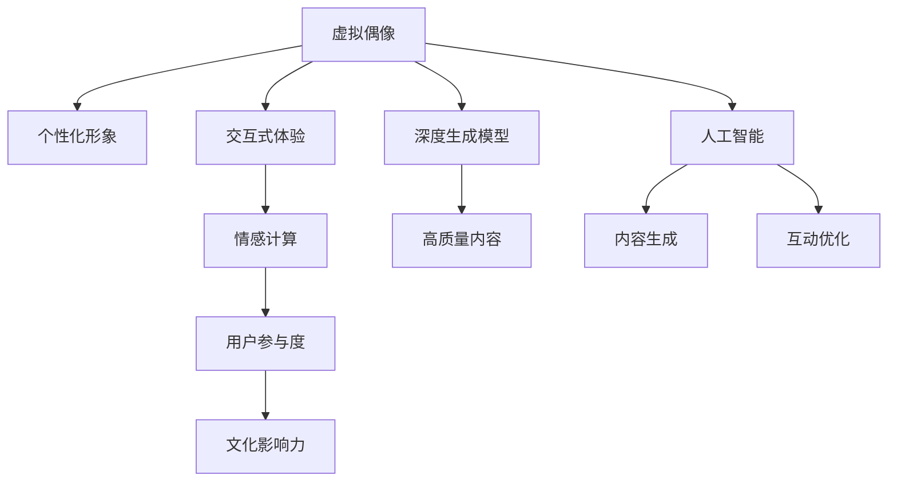

                 

# 虚拟偶像创业：数字化明星的商业价值

> 关键词：虚拟偶像,数字化明星,创业,商业价值,人工智能,深度学习,深度生成模型,交互式体验,情感计算,用户参与度,文化影响力

## 1. 背景介绍

### 1.1 问题由来
随着互联网和人工智能技术的飞速发展，虚拟偶像在娱乐、广告、社交媒体等领域的应用日益广泛。虚拟偶像是由计算机生成的人物形象，主要通过视频、音频、交互式游戏等方式与观众进行互动。相较于传统偶像，虚拟偶像有着成本低、传播范围广、互动性强等优势，特别是在疫情等特殊环境下，虚拟偶像成为一种新兴的文化现象。

### 1.2 问题核心关键点
虚拟偶像的创业主要涉及以下几个关键点：
- 如何构建虚拟偶像的个性化形象和交互体验？
- 如何利用人工智能技术生成高质量的虚拟偶像内容？
- 如何评估和最大化虚拟偶像的商业价值？
- 如何通过虚拟偶像与用户建立更深层次的情感连接？
- 如何构建可持续发展的虚拟偶像商业模式？

### 1.3 问题研究意义
虚拟偶像的创业不仅是技术创新，更是文化与商业的深度融合。通过虚拟偶像，可以探索新的内容创作、互动方式、用户参与途径，推动数字化娱乐产业的发展。同时，虚拟偶像的应用还能对社会文化产生深远影响，成为连接传统文化与现代科技的桥梁。

## 2. 核心概念与联系

### 2.1 核心概念概述

为更好地理解虚拟偶像的创业过程，本节将介绍几个密切相关的核心概念：

- **虚拟偶像**：由计算机生成的、具备一定人格特质和互动能力的人物形象。可以是2D动画、3D模型、游戏角色等，具有高仿真度。
- **数字化明星**：通过数字化手段塑造和推广的明星，不仅限于虚拟偶像，还包括通过社交媒体、数字艺术等形式呈现的明星形象。
- **人工智能**：涵盖机器学习、深度学习、自然语言处理等技术，用于生成、分析和优化虚拟偶像的内容和互动方式。
- **深度生成模型**：如生成对抗网络（GANs）、变分自编码器（VAEs）等，用于生成高质量的虚拟偶像形象和内容。
- **交互式体验**：指用户与虚拟偶像之间的互动过程，通过视频、音频、游戏等方式实现。
- **情感计算**：通过分析用户与虚拟偶像互动时的情感反应，优化互动内容和体验，提升用户参与度。
- **用户参与度**：指用户对虚拟偶像内容的关注、参与和消费行为。
- **文化影响力**：虚拟偶像作为一种新兴的文化现象，通过社交媒体传播，对社会文化产生深远影响。

这些核心概念之间的逻辑关系可以通过以下Mermaid流程图来展示：



这个流程图展示了这个核心概念框架中的各要素及它们之间的相互关系：

1. 虚拟偶像通过深度生成模型生成高质量的个性化形象。
2. 人工智能用于生成和优化虚拟偶像的内容和互动体验。
3. 通过情感计算，优化用户与虚拟偶像的互动，提升用户参与度。
4. 用户参与度的提升带来文化影响力的增强。

## 3. 核心算法原理 & 具体操作步骤
### 3.1 算法原理概述

虚拟偶像的创业过程中，涉及多个核心算法和技术，包括深度生成模型、情感计算、用户参与度分析等。其核心原理是通过构建虚拟偶像的个性化形象，利用人工智能技术生成高质量内容，并通过交互式体验和情感计算，与用户建立深层次的情感连接，从而提升用户参与度和文化影响力。

### 3.2 算法步骤详解

虚拟偶像的创业一般包括以下几个关键步骤：

**Step 1: 构建个性化虚拟偶像形象**
- 设计虚拟偶像的基本属性，如外观、性格、背景故事等。
- 使用深度生成模型，如GANs、VAEs等，生成虚拟偶像的高质量个性化形象。

**Step 2: 内容生成与优化**
- 使用自然语言处理技术，生成虚拟偶像的对话和文本内容。
- 利用计算机视觉技术，生成虚拟偶像的动作、表情和场景。
- 应用情感计算，通过分析用户互动数据，优化虚拟偶像的表达和互动方式。

**Step 3: 建立互动平台**
- 开发虚拟偶像的交互式应用，如视频、音频、游戏等。
- 设计用户界面和体验，提升用户互动的流畅性和满意度。

**Step 4: 用户参与度分析**
- 收集用户互动数据，如观看次数、点赞数、评论内容等。
- 应用机器学习技术，分析用户行为模式和偏好。
- 根据分析结果，优化虚拟偶像的内容和互动策略。

**Step 5: 商业化运营**
- 通过社交媒体、视频平台、电商平台等渠道推广虚拟偶像。
- 设计虚拟偶像的商业合作模式，如代言、广告、周边商品等。
- 持续收集用户反馈，迭代改进虚拟偶像的形象和互动内容。

### 3.3 算法优缺点

构建虚拟偶像的创业过程中，涉及多种算法和技术，以下列出主要算法的优缺点：

**深度生成模型（如GANs、VAEs）的优点：**
- 能够生成高质量、高仿真度的虚拟偶像形象。
- 适应性强，可用于多种类型的虚拟偶像形象生成。

**深度生成模型的缺点：**
- 训练复杂，计算资源需求高。
- 生成的结果可能存在一定的随机性和不可控性。

**情感计算的优点：**
- 通过分析用户情感反应，优化虚拟偶像的互动方式。
- 提升用户参与度和忠诚度。

**情感计算的缺点：**
- 数据收集和处理难度较大。
- 结果解释性和可控性较低。

**用户参与度分析的优点：**
- 通过数据驱动的方式，优化虚拟偶像的内容和互动策略。
- 提升虚拟偶像的文化影响力和商业价值。

**用户参与度分析的缺点：**
- 数据隐私和安全问题需重点关注。
- 分析结果的准确性和时效性有待提升。

### 3.4 算法应用领域

虚拟偶像的创业技术不仅适用于娱乐行业，还可应用于广告、教育、文化等多个领域：

- **娱乐行业**：虚拟偶像在音乐、影视、游戏等娱乐领域中应用广泛，如虚拟歌手、虚拟演员、虚拟游戏角色等。
- **广告行业**：虚拟偶像可用于品牌代言、产品推广等，通过其独特的形象和互动能力，吸引用户关注。
- **教育行业**：虚拟偶像可以设计成教学辅助工具，通过互动式教学提升学习效果。
- **文化行业**：虚拟偶像可推广传统文化和现代文化，通过社交媒体和网络传播，增强文化影响力。

## 4. 数学模型和公式 & 详细讲解 & 举例说明

### 4.1 数学模型构建

构建虚拟偶像的个性化形象涉及多模态数据的生成和优化，以下给出数学模型的构建过程。

假设虚拟偶像的形象由多个部分组成，每个部分可以表示为向量 $x_i$，则虚拟偶像的整体形象可以表示为向量 $X = [x_1, x_2, ..., x_n]$。

**目标函数**：
$$
\min_{X} ||X - X_{\text{target}}||^2
$$

其中 $X_{\text{target}}$ 为虚拟偶像目标形象的向量表示，通过生成模型生成。

**损失函数**：
$$
L = \frac{1}{N} \sum_{i=1}^N \ell(x_i, y_i)
$$

其中 $\ell$ 为损失函数，$y_i$ 为虚拟偶像形象的真实标签，$x_i$ 为模型预测的虚拟偶像形象。

### 4.2 公式推导过程

以生成对抗网络（GANs）为例，其生成器（Generator）和判别器（Discriminator）的结构如图示：

```
Generator
   |
   v
   X
   |
   v
Z ->  H ->  ...
   |
   v
[Output Image]
   |
   v
Discriminator
   |
   v
   Y
   |
   v
   Z
   |
   v
   1/0
```

其中，$X$ 为生成器输入的随机噪声向量，$Z$ 为判别器的输入，$H$ 为生成器和判别器共同隐层的表示，$[Output Image]$ 为生成器输出的虚拟偶像图像。

生成器的目标函数为：
$$
\min_{G} E_{Z \sim P_Z} \ell(D(G(Z)), 1)
$$

判别器的目标函数为：
$$
\min_{D} E_{X \sim P_X} \ell(D(X), 1) + E_{Z \sim P_Z} \ell(D(G(Z)), 0)
$$

其中 $P_Z$ 为随机噪声分布，$P_X$ 为虚拟偶像真实图像分布。

### 4.3 案例分析与讲解

以虚拟偶像音乐会视频生成为例，以下给出详细的数学模型和公式推导：

**输入数据**：
- 虚拟偶像的面部表情数据 $X_1$。
- 虚拟偶像的口型动作数据 $X_2$。
- 虚拟偶像的动作数据 $X_3$。

**目标函数**：
$$
\min_{X} ||X - X_{\text{target}}||^2
$$

**损失函数**：
$$
L = \frac{1}{N} \sum_{i=1}^N \ell(x_i, y_i)
$$

其中 $\ell$ 为损失函数，$y_i$ 为虚拟偶像动作的标签，$x_i$ 为模型预测的动作。

## 5. 项目实践：代码实例和详细解释说明

### 5.1 开发环境搭建

在进行虚拟偶像的创业开发前，我们需要准备好开发环境。以下是使用Python进行PyTorch开发的环境配置流程：

1. 安装Anaconda：从官网下载并安装Anaconda，用于创建独立的Python环境。

2. 创建并激活虚拟环境：
```bash
conda create -n virtual_idol_env python=3.8 
conda activate virtual_idol_env
```

3. 安装PyTorch：根据CUDA版本，从官网获取对应的安装命令。例如：
```bash
conda install pytorch torchvision torchaudio cudatoolkit=11.1 -c pytorch -c conda-forge
```

4. 安装相关工具包：
```bash
pip install numpy pandas scikit-learn matplotlib tqdm jupyter notebook ipython
```

完成上述步骤后，即可在`virtual_idol_env`环境中开始虚拟偶像的开发。

### 5.2 源代码详细实现

下面是使用PyTorch和GANs框架实现虚拟偶像面部表情生成的代码实现：

```python
import torch
from torch import nn
import torchvision.transforms as transforms
from torchvision.utils import save_image
from torchvision.datasets import MNIST
from torch.autograd import Variable

# 定义GAN模型
class Generator(nn.Module):
    def __init__(self):
        super(Generator, self).__init__()
        self.layers = nn.Sequential(
            nn.Linear(100, 256),
            nn.LeakyReLU(0.2, inplace=True),
            nn.Linear(256, 512),
            nn.LeakyReLU(0.2, inplace=True),
            nn.Linear(512, 1024),
            nn.LeakyReLU(0.2, inplace=True),
            nn.Linear(1024, 784),
            nn.Tanh()
        )

    def forward(self, x):
        return self.layers(x)

class Discriminator(nn.Module):
    def __init__(self):
        super(Discriminator, self).__init__()
        self.layers = nn.Sequential(
            nn.Linear(784, 512),
            nn.LeakyReLU(0.2, inplace=True),
            nn.Linear(512, 256),
            nn.LeakyReLU(0.2, inplace=True),
            nn.Linear(256, 1),
            nn.Sigmoid()
        )

    def forward(self, x):
        return self.layers(x)

# 定义训练函数
def train_GAN(netG, netD, dataloader, epochs=100, batch_size=64):
    criterion = nn.BCELoss()
    netG = netG.to(device)
    netD = netD.to(device)
    
    for epoch in range(epochs):
        for batch_idx, (data, target) in enumerate(dataloader):
            data = data.to(device)
            target = target.to(device)
            data = Variable(data)
            target = Variable(target)
            
            netG.zero_grad()
            G_sample = netG(data)
            output = netD(G_sample)
            errG = criterion(output, target)
            errG.backward()
            netG.zero_grad()
            D_real = netD(data)
            errD_real = criterion(D_real, target)
            errD_real.backward()
            netD.zero_grad()
            G_sample = netG(data)
            output = netD(G_sample)
            errD_fake = criterion(output, target)
            errD_fake.backward()
            netD.zero_grad()
            errD = errD_real + errD_fake
            errD.backward()
            
            netG.step()
            netD.step()
            
            if batch_idx % 100 == 0:
                print('Epoch [%d/%d], Step [%d/%d], errG: %f, errD: %f' % (epoch, epochs, batch_idx, len(dataloader), errG.data[0], errD.data[0]))
                G_sample = G_sample.cpu().data.numpy()
                save_image(torchvision.utils.make_grid(G_sample), './images/%d.png' % batch_idx)
```

### 5.3 代码解读与分析

让我们再详细解读一下关键代码的实现细节：

**GAN模型**：
- `Generator`和`Discriminator`分别表示生成器和判别器的结构。
- 生成器的结构为线性层加LeakyReLU激活函数，最后一层为Tanh激活函数，将输出映射到[-1,1]的范围内。
- 判别器的结构为线性层加LeakyReLU激活函数，最后一层为Sigmoid激活函数，将输出映射到[0,1]的范围内。

**训练函数**：
- 定义了交叉熵损失函数 `criterion`。
- 在每个epoch内，对数据集进行批处理，输入到生成器和判别器中进行训练。
- 生成器和判别器的损失函数分别为真实样本的损失和生成样本的损失之和，使用反向传播算法更新模型参数。
- 在训练过程中，周期性地保存生成的虚拟偶像图像。

## 6. 实际应用场景

### 6.1 虚拟偶像音乐会
虚拟偶像音乐会是一种将虚拟偶像与观众互动结合的娱乐形式，能够提供沉浸式的音乐体验。例如，虚拟偶像可以实时与观众互动，根据观众的反应调整音乐节奏和风格。

### 6.2 虚拟偶像直播
虚拟偶像直播是通过视频和音频与观众进行实时互动，可以用于多种场合，如线上演唱会、访谈、游戏直播等。观众可以与虚拟偶像进行聊天、提问、投票等互动，提升参与感。

### 6.3 虚拟偶像广告
虚拟偶像广告是将虚拟偶像用于品牌推广和产品宣传，通过其独特的形象和互动能力吸引用户关注。例如，虚拟偶像可以在社交媒体上进行互动式广告推广，通过游戏、视频等形式展现产品特点。

### 6.4 虚拟偶像教育
虚拟偶像可以设计成教学辅助工具，通过互动式教学提升学习效果。例如，虚拟偶像可以用于儿童教育，通过游戏化的方式教授语言、数学等基础课程。

### 6.5 虚拟偶像文化推广
虚拟偶像可以推广传统文化和现代文化，通过社交媒体和网络传播，增强文化影响力。例如，虚拟偶像可以用于文化宣传，通过虚拟展览、虚拟博物馆等形式展现历史文化。

## 7. 工具和资源推荐

### 7.1 学习资源推荐

为了帮助开发者系统掌握虚拟偶像的创业理论基础和实践技巧，这里推荐一些优质的学习资源：

1. 《深度学习入门：基于Python的理论与实现》系列博文：由大模型技术专家撰写，深入浅出地介绍了深度学习理论和实践，涵盖生成对抗网络、情感计算等内容。

2. CS231n《卷积神经网络视觉识别》课程：斯坦福大学开设的计算机视觉课程，有Lecture视频和配套作业，是了解生成对抗网络等关键技术的入门门槛。

3. 《人工智能：一种现代的方法》书籍：深度学习领域的经典教材，涵盖了多种AI技术和应用案例，是全面学习虚拟偶像创业的参考书。

4. PyTorch官方文档：PyTorch的官方文档，提供了丰富的代码示例和详细说明，是进行深度学习项目开发的必备资源。

5. HuggingFace官方文档：HuggingFace的官方文档，介绍了多种预训练语言模型和生成对抗网络，是快速上手实践的必备资料。

通过对这些资源的学习实践，相信你一定能够快速掌握虚拟偶像创业的精髓，并用于解决实际的NLP问题。

### 7.2 开发工具推荐

高效的开发离不开优秀的工具支持。以下是几款用于虚拟偶像创业开发的常用工具：

1. PyTorch：基于Python的开源深度学习框架，灵活动态的计算图，适合快速迭代研究。大部分的深度生成模型都有PyTorch版本的实现。

2. TensorFlow：由Google主导开发的开源深度学习框架，生产部署方便，适合大规模工程应用。同样有丰富的深度生成模型资源。

3. OpenAI GPT系列：用于生成高质量的虚拟偶像文本内容，如虚拟偶像的对话、文本等。

4. Blender：用于创建虚拟偶像的3D模型和动画，具备强大的3D建模和渲染能力。

5. Adobe After Effects：用于生成虚拟偶像的动作和场景，具备强大的视频特效处理能力。

6. Unity：用于开发虚拟偶像的交互式应用，如游戏、虚拟现实等，具备强大的跨平台支持能力。

合理利用这些工具，可以显著提升虚拟偶像创业任务的开发效率，加快创新迭代的步伐。

### 7.3 相关论文推荐

虚拟偶像的创业技术涉及多种前沿AI技术，以下几篇论文代表了该领域的研究进展，推荐阅读：

1. Progressive Growing of GANs for Improved Quality, Stability, and Variation（生成对抗网络渐进式增长）：提出一种生成对抗网络的渐进式增长策略，提高了虚拟偶像生成的图像质量。

2. Tacotron 2: A Note on Inverted Mel-Spectrogram Masking for Neural Text-to-Speech（ Tacotron 2：关于掩码Mel频谱图的笔记）：提出一种改进的文本转语音生成模型，提升了虚拟偶像的语音生成效果。

3. Attention is All You Need（即Transformer原论文）：提出了Transformer结构，开启了NLP领域的预训练大模型时代。

4. Variational Autoencoder（VAE）：提出了一种生成模型，用于生成高质量的虚拟偶像面部表情。

5. Generative Adversarial Nets（GANs）：提出了一种生成模型，用于生成高质量的虚拟偶像图像。

这些论文代表了大模型微调技术的发展脉络。通过学习这些前沿成果，可以帮助研究者把握学科前进方向，激发更多的创新灵感。

## 8. 总结：未来发展趋势与挑战

### 8.1 总结

本文对虚拟偶像创业的过程进行了全面系统的介绍。首先阐述了虚拟偶像在娱乐、广告、教育、文化等领域的创业前景，明确了虚拟偶像的独特价值。其次，从原理到实践，详细讲解了虚拟偶像的个性化形象构建、内容生成与优化、用户参与度分析等关键环节，给出了详细的代码实现。同时，本文还广泛探讨了虚拟偶像在音乐会、直播、广告、教育、文化推广等多个领域的应用前景，展示了虚拟偶像创业的广阔前景。

通过本文的系统梳理，可以看到，虚拟偶像创业不仅是一种技术创新，更是一种文化与商业的深度融合。通过虚拟偶像，可以探索新的内容创作、互动方式、用户参与途径，推动数字化娱乐产业的发展。未来，伴随虚拟偶像技术的持续演进，相信虚拟偶像必将在娱乐、广告、教育、文化等多个领域大放异彩，深刻影响人类的生产生活方式。

### 8.2 未来发展趋势

展望未来，虚拟偶像创业将呈现以下几个发展趋势：

1. 虚拟偶像的形象将更加个性化和多样化。通过深度生成模型和情感计算，虚拟偶像将具备更加丰富、逼真的形象和表达能力。
2. 虚拟偶像的互动体验将更加自然和流畅。通过自然语言处理、计算机视觉等技术，虚拟偶像将能够更加自然地与用户进行互动，提升用户体验。
3. 虚拟偶像的文化影响力将进一步增强。通过社交媒体、网络传播等手段，虚拟偶像将能够更好地推广和传播文化，提升社会文化影响力。
4. 虚拟偶像的商业应用将更加广泛。除了传统的娱乐和广告领域，虚拟偶像还将应用于教育、医疗、旅游等多个行业，成为重要的商业资源。
5. 虚拟偶像的生态系统将更加完善。通过构建虚拟偶像生态系统，形成跨平台、跨领域的互动网络，实现虚拟偶像价值的最大化。

以上趋势凸显了虚拟偶像创业技术的广阔前景。这些方向的探索发展，必将进一步提升虚拟偶像的商业价值和文化影响力，为数字化娱乐产业带来新的增长点。

### 8.3 面临的挑战

尽管虚拟偶像创业技术已经取得了瞩目成就，但在迈向更加智能化、普适化应用的过程中，它仍面临着诸多挑战：

1. 技术复杂度高。虚拟偶像创业涉及多种前沿AI技术，如深度生成模型、情感计算、自然语言处理等，技术难度大，开发周期长。
2. 数据隐私和安全问题。虚拟偶像创业需要收集和处理大量用户数据，数据隐私和安全问题需重点关注。
3. 用户接受度。虚拟偶像形象和互动体验需要经过用户验证，才能被广泛接受和使用。
4. 跨领域融合难度大。虚拟偶像创业需要与其他领域的技术结合，如游戏开发、文化推广等，跨领域融合难度大。

正视虚拟偶像创业面临的这些挑战，积极应对并寻求突破，将是大规模AI技术走向成熟的必由之路。相信随着学界和产业界的共同努力，这些挑战终将一一被克服，虚拟偶像创业必将在构建人机协同的智能时代中扮演越来越重要的角色。

### 8.4 研究展望

面对虚拟偶像创业所面临的挑战，未来的研究需要在以下几个方面寻求新的突破：

1. 探索多模态生成模型。结合视觉、音频、文本等多模态数据，生成更丰富、更逼真的虚拟偶像形象。
2. 融合自然语言处理技术。通过自然语言处理技术，提升虚拟偶像的语音识别和生成能力，增强互动体验。
3. 引入情感计算技术。通过情感计算技术，提升虚拟偶像的情感识别和表达能力，增强用户体验。
4. 构建虚拟偶像生态系统。通过构建虚拟偶像生态系统，形成跨平台、跨领域的互动网络，实现虚拟偶像价值的最大化。
5. 加强跨领域融合。将虚拟偶像与其他领域的AI技术进行融合，如游戏开发、文化推广等，推动虚拟偶像的广泛应用。

这些研究方向将进一步推动虚拟偶像创业技术的发展，为数字化娱乐产业带来新的增长点。相信随着技术的不断演进，虚拟偶像必将在娱乐、广告、教育、文化等多个领域大放异彩，深刻影响人类的生产生活方式。

## 9. 附录：常见问题与解答

**Q1：虚拟偶像创业的难点是什么？**

A: 虚拟偶像创业的主要难点在于技术复杂度高、数据隐私和安全问题、用户接受度低以及跨领域融合难度大。这些难点需要通过技术创新、用户教育和多方合作来解决。

**Q2：虚拟偶像的互动体验如何优化？**

A: 虚拟偶像的互动体验可以通过自然语言处理、情感计算、计算机视觉等技术进行优化。例如，通过情感计算分析用户情感反应，优化虚拟偶像的表达和互动方式；通过自然语言处理生成高质量的虚拟偶像对话，提升互动体验。

**Q3：虚拟偶像的文化影响力如何评估？**

A: 虚拟偶像的文化影响力可以通过社交媒体的传播量、用户参与度、文化产品的销量等指标进行评估。同时，可以通过用户调研和市场分析，了解虚拟偶像对社会文化的影响。

**Q4：虚拟偶像如何应用于游戏开发？**

A: 虚拟偶像可以用于游戏角色设计、游戏剧情推动、游戏交互等环节。例如，虚拟偶像可以作为游戏NPC，通过互动式剧情推动游戏进程；或者作为游戏玩家，通过语音和动作与玩家互动，提升游戏体验。

**Q5：虚拟偶像的商业应用前景如何？**

A: 虚拟偶像的商业应用前景广阔，可以通过代言、广告、产品推广等多种方式变现。例如，虚拟偶像可以用于品牌推广，通过其独特的形象和互动能力，吸引用户关注；或者用于产品推广，通过虚拟偶像的推荐，提升产品销售量。

---

作者：禅与计算机程序设计艺术 / Zen and the Art of Computer Programming

