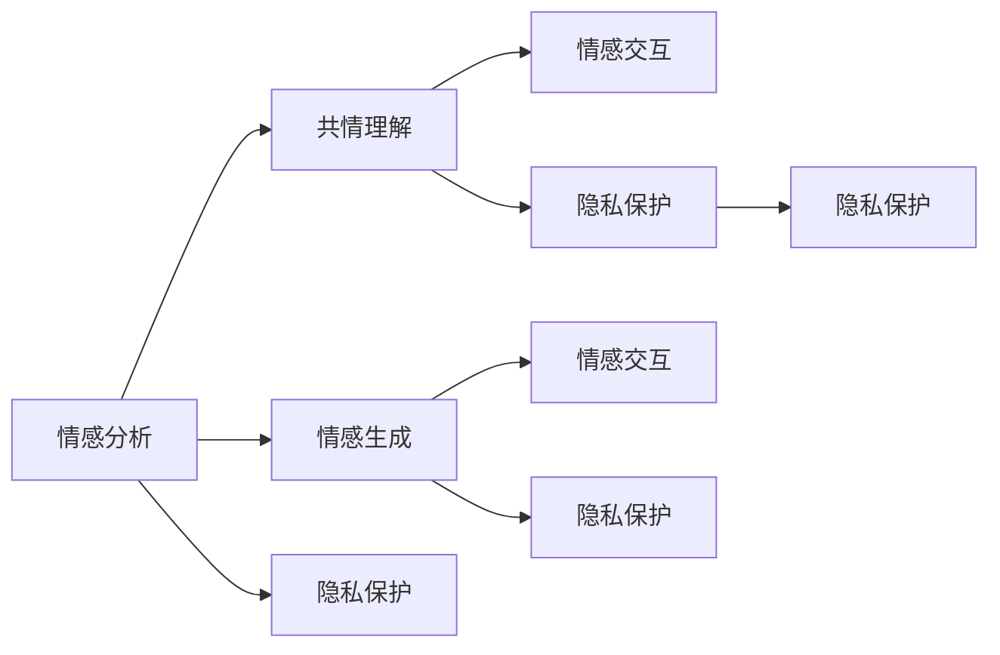

                 

# 虚拟共情实验室：AI增强的情感理解研究所

> 关键词：情感分析, 共情理解, 虚拟交互, AI伦理, 情绪识别, 心理健康, 人机交互, 虚拟助手

## 1. 背景介绍

### 1.1 问题由来
随着人工智能技术的不断发展，情感理解与情感生成成为了研究热点。情感分析作为情感理解的重要组成部分，旨在识别文本、语音、图像等数据中蕴含的情感倾向，广泛应用于社交媒体分析、客户服务、市场调研等领域。但传统的基于规则或浅层特征的方法，往往难以捕捉复杂情境下的细微情感变化。

近年来，深度学习在情感分析中取得了显著进展，特别是以卷积神经网络(CNN)和循环神经网络(RNN)为代表的模型，通过对大量标注数据进行学习，逐渐具备了从语义层面上理解情感的能力。但这些方法依然存在一些局限：

1. **缺乏共情理解**：传统情感分析仅关注情感标签的识别，难以捕捉到用户的内心感受和情感动机。
2. **数据依赖严重**：深度学习方法依赖大量标注数据，对标注成本和数据获取渠道依赖较强。
3. **模型泛化性不足**：现有模型在特定领域和特定情境下表现较好，但泛化到其他复杂情境的能力有限。

虚拟共情实验室通过引入人工智能增强的共情理解技术，旨在解决以上问题，构建能够理解用户情感，提供情感支持的人机交互系统。

### 1.2 问题核心关键点
虚拟共情实验室的核心目标是构建一个能够理解用户情感、提供情感支持的人机交互系统。该系统通过以下核心技术实现情感理解与情感生成的闭环：

1. **情感分析与识别**：利用深度学习模型，从文本、语音、图像等多模态数据中识别情感信息。
2. **共情理解与生成**：通过增强学习等技术，模拟共情行为，生成能够理解并回应的情感回应。
3. **情感交互与反馈**：将情感理解和生成的技术融入虚拟助手、虚拟客服等交互系统，实现自然流畅的情感交流。
4. **隐私保护与伦理**：在情感分析与生成过程中，严格遵守隐私保护和伦理规范，确保用户数据安全。

这些关键技术通过深度融合，构建了一个全方位、多层次的情感理解与支持体系，为用户的心理健康和情感福祉提供有力保障。

### 1.3 问题研究意义
虚拟共情实验室的研究意义主要体现在以下几个方面：

1. **提升用户体验**：通过情感理解与回应的技术，为用户提供更加个性化、人性化、情感化的服务，提升用户的满意度和使用体验。
2. **促进心理健康**：情感支持是心理健康的重要环节，通过情感理解与支持，帮助用户缓解压力，改善心理健康状况。
3. **驱动人机交互发展**：情感理解与回应的技术，能够推动人机交互的深度发展，促进人工智能技术在更多领域的广泛应用。
4. **增强社会福祉**：通过情感支持技术，帮助老年人、残障人士等弱势群体，提升他们的生活质量和幸福感。

## 2. 核心概念与联系

### 2.1 核心概念概述

为更好地理解虚拟共情实验室的技术框架，本节将介绍几个关键概念及其相互关系：

- **情感分析**：指通过深度学习模型识别文本、语音、图像等多模态数据中蕴含的情感倾向，从而进行情感分类、情感强度等任务。

- **共情理解**：指通过增强学习等技术，使虚拟助手能够理解用户的情感动机和内心感受，形成情感共鸣。

- **情感生成**：指通过自然语言处理技术，生成能够理解并回应的情感回应，增强人机交互的情感维度。

- **情感交互**：指通过情感分析、共情理解和情感生成的技术，构建自然流畅、情感丰富的交互系统。

- **隐私保护**：指在情感理解与生成过程中，严格遵守隐私保护和伦理规范，确保用户数据安全。

这些核心概念共同构成了虚拟共情实验室的技术基础，通过情感分析、共情理解、情感生成和情感交互的深度融合，实现情感理解与支持的系统化、智能化。

### 2.2 核心概念原理和架构的 Mermaid 流程图



这个流程图展示了情感分析、共情理解、情感生成、情感交互和隐私保护之间的联系和转换关系。

## 3. 核心算法原理 & 具体操作步骤

### 3.1 算法原理概述

虚拟共情实验室的核心算法原理基于深度学习和大规模预训练语言模型。通过预训练模型在大规模无标签文本数据上进行自监督学习，获得丰富的语言表示。然后，在特定情感理解任务上进行微调，增强模型的情感识别能力。接着，通过增强学习等技术，模拟共情行为，生成情感回应。最后，将情感理解与情感生成的技术融入虚拟助手等交互系统，实现自然流畅的情感交流。

### 3.2 算法步骤详解

虚拟共情实验室的核心算法步骤包括：

1. **数据收集与预处理**：收集用户互动的文本、语音、图像等多模态数据，进行清洗和预处理，构建训练集。
2. **预训练模型选择与微调**：选择合适的预训练语言模型（如BERT、GPT等），在特定情感分类任务上进行微调，提升情感识别能力。
3. **增强学习与共情理解**：通过增强学习等技术，训练模型理解用户的情感动机和内心感受，形成情感共鸣。
4. **情感生成与回复**：利用自然语言处理技术，生成能够理解并回应的情感回应，增强人机交互的情感维度。
5. **情感交互与反馈**：将情感理解与生成的技术融入虚拟助手、虚拟客服等交互系统，实现自然流畅的情感交流。
6. **隐私保护与伦理**：在情感分析与生成过程中，严格遵守隐私保护和伦理规范，确保用户数据安全。

### 3.3 算法优缺点

虚拟共情实验室的算法具有以下优点：

1. **情感理解能力强**：通过深度学习和大规模预训练模型，情感分析能够从语义层面上理解情感，识别细微情感变化。
2. **共情行为逼真**：通过增强学习等技术，共情理解与生成能够模拟人类的情感共鸣，提升用户互动体验。
3. **交互自然流畅**：将情感理解与生成的技术融入虚拟助手等交互系统，实现自然流畅、情感丰富的交流。
4. **可扩展性强**：情感分析与共情理解技术可以用于多种应用场景，如客服、心理咨询、虚拟游戏等。

同时，该算法也存在以下局限性：

1. **数据依赖性强**：情感分析与共情理解依赖大量标注数据，数据获取和标注成本较高。
2. **泛化能力不足**：现有模型在特定领域和特定情境下表现较好，泛化到其他复杂情境的能力有限。
3. **隐私安全风险**：情感理解与生成涉及用户隐私，如何保障用户数据安全是一大挑战。
4. **伦理规范复杂**：共情理解与生成技术涉及伦理问题，如情感操控、隐私侵犯等，需要严格规范。

### 3.4 算法应用领域

虚拟共情实验室的技术可以应用于多个领域，包括但不限于：

1. **客户服务**：通过情感分析与共情理解技术，构建情感化客服系统，提升客户满意度。
2. **心理咨询**：利用共情理解与情感生成技术，为心理医生提供情感支持工具，改善心理健康状况。
3. **虚拟助手**：通过情感分析与生成技术，构建能够理解并回应的虚拟助手，提供个性化服务。
4. **虚拟游戏**：利用情感生成技术，使虚拟角色能够自然流畅地互动，提升游戏体验。
5. **医疗健康**：通过情感分析与共情理解技术，构建情感支持系统，帮助患者缓解压力。
6. **教育培训**：利用情感分析与生成技术，为教师提供情感支持工具，提升教学效果。

## 4. 数学模型和公式 & 详细讲解 & 举例说明

### 4.1 数学模型构建

本节将使用数学语言对虚拟共情实验室的技术框架进行更加严格的刻画。

假设情感分析与识别任务为二分类问题，情感标签为$y \in \{0,1\}$，表示情感的正面和负面。预训练模型为$M_{\theta}$，其中$\theta$为模型参数。情感分类任务的数据集为$D=\{(x_i,y_i)\}_{i=1}^N$，其中$x_i$为输入，$y_i$为标签。

定义情感分析任务的损失函数为交叉熵损失：

$$
\ell(M_{\theta}(x),y) = -y\log M_{\theta}(x) - (1-y)\log(1-M_{\theta}(x))
$$

其中$M_{\theta}(x)$为模型在输入$x$上的预测概率。

在微调阶段，我们通过梯度下降算法优化损失函数$\ell$，最小化经验风险$\mathcal{L}(\theta)$：

$$
\mathcal{L}(\theta) = \frac{1}{N}\sum_{i=1}^N \ell(M_{\theta}(x_i),y_i)
$$

其中$\ell$为单个样本的损失函数。

### 4.2 公式推导过程

以下我们以二分类情感分析任务为例，推导交叉熵损失函数及其梯度的计算公式。

假设模型$M_{\theta}$在输入$x$上的输出为$\hat{y}=M_{\theta}(x) \in [0,1]$，表示样本属于正情感的概率。真实标签$y \in \{0,1\}$。则二分类交叉熵损失函数定义为：

$$
\ell(M_{\theta}(x),y) = -[y\log \hat{y} + (1-y)\log (1-\hat{y})]
$$

将其代入经验风险公式，得：

$$
\mathcal{L}(\theta) = -\frac{1}{N}\sum_{i=1}^N [y_i\log M_{\theta}(x_i)+(1-y_i)\log(1-M_{\theta}(x_i))]
$$

根据链式法则，损失函数对参数$\theta_k$的梯度为：

$$
\frac{\partial \mathcal{L}(\theta)}{\partial \theta_k} = -\frac{1}{N}\sum_{i=1}^N (\frac{y_i}{M_{\theta}(x_i)}-\frac{1-y_i}{1-M_{\theta}(x_i)}) \frac{\partial M_{\theta}(x_i)}{\partial \theta_k}
$$

其中$\frac{\partial M_{\theta}(x_i)}{\partial \theta_k}$可进一步递归展开，利用自动微分技术完成计算。

在得到损失函数的梯度后，即可带入参数更新公式，完成模型的迭代优化。重复上述过程直至收敛，最终得到适应情感分析任务的最优模型参数$\theta^*$。

### 4.3 案例分析与讲解

假设我们使用BERT模型进行情感分类任务，通过微调提升其情感理解能力。具体实现步骤如下：

1. **数据准备**：收集情感标注数据，将其划分为训练集、验证集和测试集。
2. **模型选择**：选择BERT模型作为情感分类的基础模型。
3. **微调设置**：选择适当的超参数，如学习率、批大小、迭代轮数等。
4. **模型训练**：在训练集上执行梯度训练，最小化损失函数$\mathcal{L}(\theta)$。
5. **模型评估**：在验证集和测试集上评估微调后的模型性能，选择性能最优的模型。
6. **情感生成**：使用微调后的模型，对输入文本进行情感分类，生成情感回应。

## 5. 项目实践：代码实例和详细解释说明

### 5.1 开发环境搭建

在进行虚拟共情实验室的技术实现前，我们需要准备好开发环境。以下是使用Python进行PyTorch开发的环境配置流程：

1. 安装Anaconda：从官网下载并安装Anaconda，用于创建独立的Python环境。

2. 创建并激活虚拟环境：
```bash
conda create -n pytorch-env python=3.8 
conda activate pytorch-env
```

3. 安装PyTorch：根据CUDA版本，从官网获取对应的安装命令。例如：
```bash
conda install pytorch torchvision torchaudio cudatoolkit=11.1 -c pytorch -c conda-forge
```

4. 安装Transformers库：
```bash
pip install transformers
```

5. 安装各类工具包：
```bash
pip install numpy pandas scikit-learn matplotlib tqdm jupyter notebook ipython
```

完成上述步骤后，即可在`pytorch-env`环境中开始技术实现。

### 5.2 源代码详细实现

下面以情感分类任务为例，给出使用Transformers库对BERT模型进行微调的PyTorch代码实现。

首先，定义情感分类任务的数据处理函数：

```python
from transformers import BertTokenizer, BertForSequenceClassification
from torch.utils.data import Dataset
import torch

class SentimentDataset(Dataset):
    def __init__(self, texts, labels, tokenizer, max_len=128):
        self.texts = texts
        self.labels = labels
        self.tokenizer = tokenizer
        self.max_len = max_len
        
    def __len__(self):
        return len(self.texts)
    
    def __getitem__(self, item):
        text = self.texts[item]
        label = self.labels[item]
        
        encoding = self.tokenizer(text, return_tensors='pt', max_length=self.max_len, padding='max_length', truncation=True)
        input_ids = encoding['input_ids'][0]
        attention_mask = encoding['attention_mask'][0]
        
        # 对label进行one-hot编码
        encoded_label = torch.tensor([label], dtype=torch.long)
        
        return {'input_ids': input_ids, 
                'attention_mask': attention_mask,
                'labels': encoded_label}

# 加载BERT预训练模型和 tokenizer
model = BertForSequenceClassification.from_pretrained('bert-base-cased', num_labels=2)
tokenizer = BertTokenizer.from_pretrained('bert-base-cased')
```

然后，定义模型和优化器：

```python
from transformers import AdamW

optimizer = AdamW(model.parameters(), lr=2e-5)
```

接着，定义训练和评估函数：

```python
from torch.utils.data import DataLoader
from tqdm import tqdm
from sklearn.metrics import classification_report

device = torch.device('cuda') if torch.cuda.is_available() else torch.device('cpu')
model.to(device)

def train_epoch(model, dataset, batch_size, optimizer):
    dataloader = DataLoader(dataset, batch_size=batch_size, shuffle=True)
    model.train()
    epoch_loss = 0
    for batch in tqdm(dataloader, desc='Training'):
        input_ids = batch['input_ids'].to(device)
        attention_mask = batch['attention_mask'].to(device)
        labels = batch['labels'].to(device)
        model.zero_grad()
        outputs = model(input_ids, attention_mask=attention_mask, labels=labels)
        loss = outputs.loss
        epoch_loss += loss.item()
        loss.backward()
        optimizer.step()
    return epoch_loss / len(dataloader)

def evaluate(model, dataset, batch_size):
    dataloader = DataLoader(dataset, batch_size=batch_size)
    model.eval()
    preds, labels = [], []
    with torch.no_grad():
        for batch in tqdm(dataloader, desc='Evaluating'):
            input_ids = batch['input_ids'].to(device)
            attention_mask = batch['attention_mask'].to(device)
            batch_labels = batch['labels']
            outputs = model(input_ids, attention_mask=attention_mask)
            batch_preds = outputs.logits.argmax(dim=1).to('cpu').tolist()
            batch_labels = batch_labels.to('cpu').tolist()
            for pred, label in zip(batch_preds, batch_labels):
                preds.append(pred)
                labels.append(label)
                
    print(classification_report(labels, preds))
```

最后，启动训练流程并在测试集上评估：

```python
epochs = 5
batch_size = 16

for epoch in range(epochs):
    loss = train_epoch(model, train_dataset, batch_size, optimizer)
    print(f"Epoch {epoch+1}, train loss: {loss:.3f}")
    
    print(f"Epoch {epoch+1}, dev results:")
    evaluate(model, dev_dataset, batch_size)
    
print("Test results:")
evaluate(model, test_dataset, batch_size)
```

以上就是使用PyTorch对BERT进行情感分类任务微调的完整代码实现。可以看到，得益于Transformers库的强大封装，我们可以用相对简洁的代码完成BERT模型的加载和微调。

### 5.3 代码解读与分析

让我们再详细解读一下关键代码的实现细节：

**SentimentDataset类**：
- `__init__`方法：初始化文本、标签、分词器等关键组件。
- `__len__`方法：返回数据集的样本数量。
- `__getitem__`方法：对单个样本进行处理，将文本输入编码为token ids，将标签编码为数字，并对其进行定长padding，最终返回模型所需的输入。

**模型和优化器**：
- 使用BertForSequenceClassification从预训练模型中加载模型，并设置适当的学习率。

**训练和评估函数**：
- 使用PyTorch的DataLoader对数据集进行批次化加载，供模型训练和推理使用。
- 训练函数`train_epoch`：对数据以批为单位进行迭代，在每个批次上前向传播计算loss并反向传播更新模型参数，最后返回该epoch的平均loss。
- 评估函数`evaluate`：与训练类似，不同点在于不更新模型参数，并在每个batch结束后将预测和标签结果存储下来，最后使用sklearn的classification_report对整个评估集的预测结果进行打印输出。

**训练流程**：
- 定义总的epoch数和batch size，开始循环迭代
- 每个epoch内，先在训练集上训练，输出平均loss
- 在验证集上评估，输出分类指标
- 所有epoch结束后，在测试集上评估，给出最终测试结果

可以看到，PyTorch配合Transformers库使得BERT微调的代码实现变得简洁高效。开发者可以将更多精力放在数据处理、模型改进等高层逻辑上，而不必过多关注底层的实现细节。

当然，工业级的系统实现还需考虑更多因素，如模型的保存和部署、超参数的自动搜索、更灵活的任务适配层等。但核心的微调范式基本与此类似。

## 6. 实际应用场景

### 6.1 智能客服系统

虚拟共情实验室的情感理解与支持技术，可以广泛应用于智能客服系统的构建。传统客服往往需要配备大量人力，高峰期响应缓慢，且一致性和专业性难以保证。而使用虚拟共情实验室构建的智能客服系统，可以7x24小时不间断服务，快速响应客户咨询，用自然流畅的语言解答各类常见问题。

在技术实现上，可以收集企业内部的历史客服对话记录，将问题和最佳答复构建成监督数据，在此基础上对虚拟共情实验室的技术进行微调。微调后的虚拟客服系统能够自动理解用户意图，匹配最合适的答案模板进行回复。对于客户提出的新问题，还可以接入检索系统实时搜索相关内容，动态组织生成回答。如此构建的智能客服系统，能大幅提升客户咨询体验和问题解决效率。

### 6.2 金融舆情监测

金融机构需要实时监测市场舆论动向，以便及时应对负面信息传播，规避金融风险。传统的人工监测方式成本高、效率低，难以应对网络时代海量信息爆发的挑战。虚拟共情实验室的情感分析与支持技术，为金融舆情监测提供了新的解决方案。

具体而言，可以收集金融领域相关的新闻、报道、评论等文本数据，并对其进行主题标注和情感标注。在此基础上对虚拟共情实验室的技术进行微调，使其能够自动判断文本属于何种主题，情感倾向是正面、中性还是负面。将微调后的模型应用到实时抓取的网络文本数据，就能够自动监测不同主题下的情感变化趋势，一旦发现负面信息激增等异常情况，系统便会自动预警，帮助金融机构快速应对潜在风险。

### 6.3 个性化推荐系统

当前的推荐系统往往只依赖用户的历史行为数据进行物品推荐，无法深入理解用户的真实兴趣偏好。虚拟共情实验室的情感理解与支持技术，可以用于推荐系统的个性化推荐。

在实践中，可以收集用户浏览、点击、评论、分享等行为数据，提取和用户交互的物品标题、描述、标签等文本内容。将文本内容作为模型输入，用户的后续行为（如是否点击、购买等）作为监督信号，在此基础上微调虚拟共情实验室的技术。微调后的模型能够从文本内容中准确把握用户的兴趣点。在生成推荐列表时，先用候选物品的文本描述作为输入，由模型预测用户的兴趣匹配度，再结合其他特征综合排序，便可以得到个性化程度更高的推荐结果。

### 6.4 未来应用展望

随着虚拟共情实验室技术的不断发展，基于情感理解与支持的应用场景将不断扩大。

在智慧医疗领域，基于虚拟共情实验室的技术，构建情感支持系统，能够帮助患者缓解压力，改善心理健康状况。

在智能教育领域，利用情感理解与生成技术，为教师提供情感支持工具，提升教学效果。

在智慧城市治理中，通过情感分析与生成技术，构建情感支持系统，帮助城市管理者了解公众情绪，优化城市治理。

此外，在企业生产、社会治理、文娱传媒等众多领域，基于情感理解与支持的技术，能够构建更加人性化的系统，提升用户体验和服务质量。相信随着技术的日益成熟，虚拟共情实验室将为人工智能技术在更多领域的广泛应用提供新的驱动力。

## 7. 工具和资源推荐

### 7.1 学习资源推荐

为了帮助开发者系统掌握虚拟共情实验室的技术基础和实践技巧，这里推荐一些优质的学习资源：

1. 《深度学习在自然语言处理中的应用》书籍：全面介绍了深度学习在自然语言处理中的基本原理和应用，包括情感分析、共情理解等内容。

2. 《TensorFlow官方文档》：TensorFlow的官方文档，提供了丰富的示例代码和API文档，是进行深度学习实验的必备资料。

3. 《自然语言处理（深度学习方向）》课程：斯坦福大学开设的NLP课程，涵盖深度学习在NLP中的应用，包括情感分析、共情理解等。

4. 《HuggingFace官方文档》：HuggingFace的官方文档，提供了海量预训练模型和微调范例，是进行NLP开发的重要参考。

5. CLUE开源项目：中文语言理解测评基准，涵盖大量不同类型的中文NLP数据集，并提供了基于情感理解与生成的baseline模型，助力中文NLP技术发展。

通过对这些资源的学习实践，相信你一定能够快速掌握虚拟共情实验室的核心技术，并用于解决实际的情感理解与支持问题。

### 7.2 开发工具推荐

高效的开发离不开优秀的工具支持。以下是几款用于虚拟共情实验室开发常用的工具：

1. PyTorch：基于Python的开源深度学习框架，灵活动态的计算图，适合快速迭代研究。大部分预训练语言模型都有PyTorch版本的实现。

2. TensorFlow：由Google主导开发的开源深度学习框架，生产部署方便，适合大规模工程应用。同样有丰富的预训练语言模型资源。

3. Transformers库：HuggingFace开发的NLP工具库，集成了众多SOTA语言模型，支持PyTorch和TensorFlow，是进行情感理解与生成任务的开发利器。

4. Weights & Biases：模型训练的实验跟踪工具，可以记录和可视化模型训练过程中的各项指标，方便对比和调优。与主流深度学习框架无缝集成。

5. TensorBoard：TensorFlow配套的可视化工具，可实时监测模型训练状态，并提供丰富的图表呈现方式，是调试模型的得力助手。

6. Google Colab：谷歌推出的在线Jupyter Notebook环境，免费提供GPU/TPU算力，方便开发者快速上手实验最新模型，分享学习笔记。

合理利用这些工具，可以显著提升虚拟共情实验室的技术开发效率，加快创新迭代的步伐。

### 7.3 相关论文推荐

虚拟共情实验室的研究源于学界的持续研究。以下是几篇奠基性的相关论文，推荐阅读：

1. Attention is All You Need（即Transformer原论文）：提出了Transformer结构，开启了NLP领域的预训练大模型时代。

2. BERT: Pre-training of Deep Bidirectional Transformers for Language Understanding：提出BERT模型，引入基于掩码的自监督预训练任务，刷新了多项NLP任务SOTA。

3. Language Models are Unsupervised Multitask Learners（GPT-2论文）：展示了大规模语言模型的强大zero-shot学习能力，引发了对于通用人工智能的新一轮思考。

4. Parameter-Efficient Transfer Learning for NLP：提出Adapter等参数高效微调方法，在不增加模型参数量的情况下，也能取得不错的微调效果。

5. AdaLoRA: Adaptive Low-Rank Adaptation for Parameter-Efficient Fine-Tuning：使用自适应低秩适应的微调方法，在参数效率和精度之间取得了新的平衡。

6. Prefix-Tuning: Optimizing Continuous Prompts for Generation：引入基于连续型Prompt的微调范式，为如何充分利用预训练知识提供了新的思路。

这些论文代表了大语言模型微调技术的发展脉络。通过学习这些前沿成果，可以帮助研究者把握学科前进方向，激发更多的创新灵感。

## 8. 总结：未来发展趋势与挑战

### 8.1 总结

本文对虚拟共情实验室的情感理解与支持技术进行了全面系统的介绍。首先阐述了情感理解与支持技术的背景和研究意义，明确了情感分析、共情理解、情感生成和情感交互技术的关键作用。其次，从原理到实践，详细讲解了虚拟共情实验室的核心算法原理和操作步骤，给出了情感分类任务的完整代码实现。同时，本文还广泛探讨了情感理解与支持技术在智能客服、金融舆情、个性化推荐等多个行业领域的应用前景，展示了技术的多样化和广阔前景。

通过本文的系统梳理，可以看到，虚拟共情实验室的技术正在成为情感理解与支持领域的核心范式，通过深度学习和大规模预训练模型，在情感分析、共情理解、情感生成和情感交互等方面取得了显著进展。这些技术为构建情感丰富、智能化的交互系统提供了有力保障。未来，伴随技术的进一步发展，虚拟共情实验室必将在更多领域大放异彩，为用户的心理健康和情感福祉提供强大支撑。

### 8.2 未来发展趋势

展望未来，虚拟共情实验室技术将呈现以下几个发展趋势：

1. **情感理解更加深入**：随着模型复杂度的提升和训练数据的丰富，情感理解技术将能够捕捉到更加细微的情感变化，提升情感分析的精度和鲁棒性。
2. **共情行为更加逼真**：通过增强学习等技术，共情理解与生成将更加逼真，能够模拟人类的情感共鸣，提升用户体验。
3. **情感交互更加自然**：将情感理解与生成技术融入虚拟助手、虚拟客服等交互系统，实现自然流畅、情感丰富的交流。
4. **多模态情感分析**：结合文本、语音、图像等多模态信息，进行综合情感分析，提升情感理解能力。
5. **跨领域应用拓展**：情感理解与支持技术将拓展到更多领域，如医疗、教育、金融等，提升各领域的服务质量。

### 8.3 面临的挑战

尽管虚拟共情实验室技术已经取得了瞩目成就，但在迈向更加智能化、普适化应用的过程中，它仍面临着诸多挑战：

1. **数据获取成本高**：情感分析与生成依赖大量标注数据，获取高质量标注数据的成本较高。
2. **模型泛化能力不足**：现有模型在特定领域和特定情境下表现较好，泛化到其他复杂情境的能力有限。
3. **隐私安全风险**：情感分析与生成涉及用户隐私，如何保障用户数据安全是一大挑战。
4. **伦理规范复杂**：共情理解与生成技术涉及伦理问题，如情感操控、隐私侵犯等，需要严格规范。
5. **系统稳定性问题**：情感理解与支持技术需要稳定运行，如何在多用户、多任务的环境中保持系统稳定性是一大挑战。

### 8.4 研究展望

未来，虚拟共情实验室技术需要在以下几个方面进行深入探索：

1. **无监督和半监督学习**：探索如何利用非结构化数据进行情感分析与生成，降低对标注数据的依赖。
2. **参数高效微调**：开发更加参数高效的微调方法，在固定大部分预训练参数的同时，只更新极少量的任务相关参数。
3. **多模态融合**：结合文本、语音、图像等多模态信息，进行综合情感分析，提升情感理解能力。
4. **隐私保护技术**：开发更加隐私保护的技术，确保用户数据安全，避免隐私泄露。
5. **伦理规范**：制定和完善情感理解与生成技术的伦理规范，确保技术的可控性和安全性。
6. **系统稳定性**：研究如何在多用户、多任务的环境中保持系统稳定性，提升用户体验。

这些研究方向的探索，必将引领虚拟共情实验室技术迈向更高的台阶，为构建安全、可靠、可解释、可控的智能系统铺平道路。面向未来，虚拟共情实验室技术还需要与其他人工智能技术进行更深入的融合，如知识表示、因果推理、强化学习等，多路径协同发力，共同推动情感理解与支持技术的进步。只有勇于创新、敢于突破，才能不断拓展情感理解与支持技术的边界，让智能技术更好地造福人类社会。

## 9. 附录：常见问题与解答

**Q1：虚拟共情实验室的情感分析与生成技术是否适用于所有NLP任务？**

A: 虚拟共情实验室的情感分析与生成技术，在大多数NLP任务上都能取得不错的效果，特别是对于数据量较小的任务。但对于一些特定领域的任务，如医学、法律等，仅仅依靠通用语料预训练的模型可能难以很好地适应。此时需要在特定领域语料上进一步预训练，再进行微调，才能获得理想效果。此外，对于一些需要时效性、个性化很强的任务，如对话、推荐等，情感分析与生成方法也需要针对性的改进优化。

**Q2：如何选择合适的情感分析模型？**

A: 选择情感分析模型时，需要考虑任务的特点和数据分布。一般而言，对于文本情感分析任务，BERT、GPT等预训练模型效果较好。对于图像情感分析任务，可以使用VGG、ResNet等卷积神经网络模型。对于语音情感分析任务，则可以使用WaveNet等时序模型。在选择模型时，还需要考虑模型的参数量、训练效率等因素，综合评估选择合适的模型。

**Q3：如何提高情感分析的精度？**

A: 提高情感分析的精度可以从以下几个方面入手：
1. 数据增强：通过回译、近义替换等方式扩充训练集，提高模型的泛化能力。
2. 正则化：使用L2正则、Dropout等技术，避免过拟合。
3. 多模型融合：训练多个情感分析模型，取平均输出，抑制过拟合。
4. 参数高效微调：只调整少量参数，减小过拟合风险。
5. 模型融合：使用多种情感分析模型进行融合，提升模型的精度和鲁棒性。

**Q4：情感分析与生成技术如何应用于实际业务系统？**

A: 情感分析与生成技术可以应用于多种业务系统，如智能客服、金融舆情监测、个性化推荐等。具体实现步骤如下：
1. 收集业务场景相关的数据，进行标注和预处理。
2. 选择合适的情感分析与生成模型，进行微调。
3. 将模型集成到业务系统中，进行实时情感分析与生成。
4. 系统上线后，持续收集反馈数据，进行模型优化和更新。

通过以上步骤，可以将情感分析与生成技术应用于实际的业务系统，提升系统的智能化水平。

**Q5：如何在多用户、多任务的环境中保持系统稳定性？**

A: 在多用户、多任务的环境中保持系统稳定性，需要考虑以下几个方面：
1. 分布式训练：使用分布式训练技术，提高训练效率和系统稳定性。
2. 模型集成：通过模型融合技术，提升模型的泛化能力和鲁棒性。
3. 数据均衡：确保训练数据的多样性和均衡性，避免模型偏颇。
4. 实时监控：实时监控模型的运行状态，及时发现并解决问题。
5. 参数调优：根据用户反馈和运行状态，调整模型参数，优化模型性能。

通过以上措施，可以提升情感分析与生成系统在多用户、多任务环境中的稳定性和可靠性。

---

作者：禅与计算机程序设计艺术 / Zen and the Art of Computer Programming

