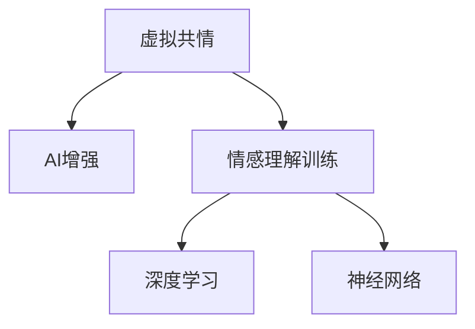

                 

# 虚拟共情能力培养：AI增强的情感理解训练

> 关键词：虚拟共情, AI增强, 情感理解训练, 深度学习, 神经网络

## 1. 背景介绍

### 1.1 问题由来
在当今社会，人工智能（AI）技术正在逐渐渗透到各个领域，从医疗到教育，从娱乐到工作，AI无处不在。然而，AI的发展过程中，也暴露出一些问题。其中，情感理解能力的缺失是其中一个重要方面。人类在交流时，情感的理解和表达是其核心组成部分，而AI在这一方面的不足，往往导致其与人类交流的“冷冰冰”感。

### 1.2 问题核心关键点
情感理解能力的缺失主要体现在两个方面：一是AI对人类情感的感知能力不足，二是AI对情感的理解和表达不够自然。这些问题严重限制了AI在情感智能方面的应用，特别是在人机交互领域。为了解决这个问题，研究人员提出了基于深度学习的情感理解训练方法，即利用神经网络对情感数据进行建模，从而提升AI的情感理解能力。

### 1.3 问题研究意义
提升AI的情感理解能力，不仅可以改善人机交互体验，还能在医疗、教育、娱乐等多个领域产生深远的影响。例如，在医疗领域，能够帮助医生更好地理解患者的情感状态，提供更人性化的医疗服务；在教育领域，能够提供个性化的教学建议，提升学生的学习效果；在娱乐领域，能够提供更加自然、生动的用户互动体验。

## 2. 核心概念与联系

### 2.1 核心概念概述

为更好地理解基于深度学习的情感理解训练方法，本节将介绍几个密切相关的核心概念：

- 虚拟共情（Virtual Empathy）：指AI在情感智能方面的能力，能够在人机交互中感知、理解和表达人类情感。
- AI增强（AI-Enhanced）：利用AI技术提升人类在情感理解方面的能力，如利用深度学习模型对情感数据进行建模和分析。
- 情感理解训练（Emotion Understanding Training）：通过深度学习模型对情感数据进行训练，使得AI能够理解人类情感的能力。
- 深度学习（Deep Learning）：一种利用多层神经网络进行数据建模的机器学习方法，广泛应用于图像识别、自然语言处理等领域。
- 神经网络（Neural Network）：深度学习的核心组成部分，通过模拟人脑神经元的工作方式，进行数据处理和建模。

这些核心概念之间的逻辑关系可以通过以下Mermaid流程图来展示：



这个流程图展示了大语言模型的核心概念及其之间的关系：

1. 虚拟共情指AI在情感智能方面的能力，是最终目标。
2. AI增强利用AI技术提升人类的情感理解能力，包括利用深度学习模型进行情感理解训练。
3. 情感理解训练是实现虚拟共情的重要步骤，通过深度学习模型对情感数据进行建模和分析。
4. 深度学习是实现情感理解训练的核心方法，通过多层神经网络进行数据建模。
5. 神经网络是深度学习的基础，通过模拟人脑神经元的工作方式，进行数据处理和建模。

这些概念共同构成了虚拟共情能力培养的基础框架，使得AI能够更好地理解和表达人类情感。

## 3. 核心算法原理 & 具体操作步骤
### 3.1 算法原理概述

基于深度学习的情感理解训练，本质上是一个利用神经网络对情感数据进行建模的过程。其核心思想是：将情感数据输入神经网络，通过反向传播算法不断调整网络参数，最小化模型输出与真实标签之间的差异，最终得到能够理解情感的模型。

形式化地，假设情感数据集为 $D=\{(x_i,y_i)\}_{i=1}^N$，其中 $x_i$ 为情感文本，$y_i$ 为对应的情感标签，情感标签通常为二分类问题，如积极或消极。定义情感理解模型的输出为 $\hat{y}=M(x)$，其中 $M$ 为深度学习模型，$\theta$ 为模型参数。

情感理解训练的目标是最小化模型输出与真实标签之间的差异，即：

$$
\hat{\theta}=\mathop{\arg\min}_{\theta} \mathcal{L}(M_{\theta},D)
$$

其中 $\mathcal{L}$ 为情感分类损失函数，通常使用交叉熵损失函数，用于衡量模型预测输出与真实标签之间的差异。

### 3.2 算法步骤详解

基于深度学习的情感理解训练一般包括以下几个关键步骤：

**Step 1: 数据准备**
- 收集情感数据集，如电影评论、社交媒体帖子等，并进行标注，构建情感标签。
- 对情感文本进行预处理，包括分词、去除停用词、词干提取等。

**Step 2: 数据增强**
- 通过数据增强技术，如回译、同义词替换等，扩充情感数据集的规模，提高模型的泛化能力。
- 引入对抗样本，增强模型的鲁棒性。

**Step 3: 模型选择与设计**
- 选择合适的深度学习模型，如卷积神经网络（CNN）、循环神经网络（RNN）或Transformer等。
- 设计情感理解模型的架构，包括输入层、隐藏层、输出层等。

**Step 4: 模型训练**
- 将情感数据集输入模型，使用交叉熵损失函数作为目标函数。
- 使用反向传播算法，通过梯度下降等优化算法不断调整模型参数，最小化损失函数。
- 定期在验证集上评估模型性能，防止过拟合。

**Step 5: 模型评估与部署**
- 在测试集上评估模型性能，对比训练前后的精度提升。
- 使用训练好的模型进行情感理解任务，如情感分类、情感极性分析等。
- 将模型部署到实际应用系统中，持续优化模型效果。

以上是基于深度学习的情感理解训练的一般流程。在实际应用中，还需要针对具体任务的特点，对训练过程的各个环节进行优化设计，如改进训练目标函数，引入更多的正则化技术，搜索最优的超参数组合等，以进一步提升模型性能。

### 3.3 算法优缺点

基于深度学习的情感理解训练方法具有以下优点：
1. 模型性能高。利用深度学习模型，可以更好地捕捉数据中的复杂模式，提升模型对情感数据的理解能力。
2. 应用广泛。情感理解训练在多个领域有广泛的应用，如情感分析、情绪识别、用户行为分析等。
3. 可解释性强。深度学习模型的决策过程透明，能够解释模型输出背后的逻辑。
4. 适应性强。通过引入数据增强技术，可以适应各种情感数据分布，提高模型的泛化能力。

同时，该方法也存在一定的局限性：
1. 数据标注成本高。情感数据的标注通常需要人工进行，成本较高。
2. 模型复杂度高。深度学习模型往往需要较多的训练数据和计算资源。
3. 解释性不足。深度学习模型常常被视为“黑盒”，难以解释其内部的决策逻辑。
4. 鲁棒性差。面对不同情感数据分布的变化，模型的泛化能力可能不足。

尽管存在这些局限性，但就目前而言，基于深度学习的情感理解训练方法仍是情感智能领域的重要范式。未来相关研究的重点在于如何进一步降低情感数据标注的难度，提高模型的泛化能力，同时兼顾可解释性和鲁棒性等因素。

### 3.4 算法应用领域

基于深度学习的情感理解训练方法，在多个领域已经得到了广泛的应用，例如：

- 社交媒体情感分析：对社交媒体上的帖子进行情感分类，判断其情感极性，如正面、负面或中性。
- 电影评论情感分析：对电影评论进行情感分类，帮助电影公司了解观众对电影的情感反应。
- 情感智能客服：通过情感理解训练，提升客服系统的情感识别能力，提供更加人性化的服务。
- 医疗情感分析：对患者的情感状态进行分析和理解，帮助医生更好地理解患者的情感需求，提升医疗服务质量。
- 教育情感分析：分析学生的情感状态，提供个性化的学习建议，提升学生的学习效果。

除了上述这些经典应用外，情感理解训练还被创新性地应用到更多场景中，如金融舆情分析、用户行为分析、情感驱动内容推荐等，为情感智能技术带来了全新的突破。随着深度学习模型和情感理解训练方法的不断进步，相信情感智能技术将在更广阔的应用领域大放异彩。

## 4. 数学模型和公式 & 详细讲解  
### 4.1 数学模型构建

本节将使用数学语言对基于深度学习的情感理解训练过程进行更加严格的刻画。

假设情感理解模型为 $M_{\theta}:\mathcal{X} \rightarrow \mathcal{Y}$，其中 $\mathcal{X}$ 为情感文本输入空间，$\mathcal{Y}$ 为情感标签输出空间，$\theta$ 为模型参数。定义模型 $M_{\theta}$ 在数据样本 $(x,y)$ 上的损失函数为 $\ell(M_{\theta}(x),y)$，则在数据集 $D$ 上的经验风险为：

$$
\mathcal{L}(\theta) = \frac{1}{N} \sum_{i=1}^N \ell(M_{\theta}(x_i),y_i)
$$

其中 $\ell(M_{\theta}(x),y)$ 为情感分类损失函数，如交叉熵损失函数，定义为：

$$
\ell(M_{\theta}(x),y) = -y\log M_{\theta}(x) - (1-y)\log(1-M_{\theta}(x))
$$

情感理解训练的目标是最小化经验风险，即找到最优参数：

$$
\theta^* = \mathop{\arg\min}_{\theta} \mathcal{L}(\theta)
$$

在实践中，我们通常使用基于梯度的优化算法（如Adam、SGD等）来近似求解上述最优化问题。设 $\eta$ 为学习率，$\lambda$ 为正则化系数，则参数的更新公式为：

$$
\theta \leftarrow \theta - \eta \nabla_{\theta}\mathcal{L}(\theta) - \eta\lambda\theta
$$

其中 $\nabla_{\theta}\mathcal{L}(\theta)$ 为损失函数对参数 $\theta$ 的梯度，可通过反向传播算法高效计算。

### 4.2 公式推导过程

以下我们以情感分类任务为例，推导交叉熵损失函数及其梯度的计算公式。

假设模型 $M_{\theta}$ 在情感文本 $x$ 上的输出为 $\hat{y}=M_{\theta}(x) \in [0,1]$，表示情感文本属于积极情感的概率。真实标签 $y \in \{0,1\}$。则情感分类交叉熵损失函数定义为：

$$
\ell(M_{\theta}(x),y) = -y\log \hat{y} - (1-y)\log(1-\hat{y})
$$

将其代入经验风险公式，得：

$$
\mathcal{L}(\theta) = -\frac{1}{N}\sum_{i=1}^N [y_i\log M_{\theta}(x_i)+(1-y_i)\log(1-M_{\theta}(x_i))]
$$

根据链式法则，损失函数对参数 $\theta_k$ 的梯度为：

$$
\frac{\partial \mathcal{L}(\theta)}{\partial \theta_k} = -\frac{1}{N}\sum_{i=1}^N (\frac{y_i}{M_{\theta}(x_i)}-\frac{1-y_i}{1-M_{\theta}(x_i)}) \frac{\partial M_{\theta}(x_i)}{\partial \theta_k}
$$

其中 $\frac{\partial M_{\theta}(x_i)}{\partial \theta_k}$ 可进一步递归展开，利用自动微分技术完成计算。

在得到损失函数的梯度后，即可带入参数更新公式，完成模型的迭代优化。重复上述过程直至收敛，最终得到适应情感数据的最优模型参数 $\theta^*$。

## 5. 项目实践：代码实例和详细解释说明
### 5.1 开发环境搭建

在进行情感理解训练实践前，我们需要准备好开发环境。以下是使用Python进行TensorFlow开发的环境配置流程：

1. 安装Anaconda：从官网下载并安装Anaconda，用于创建独立的Python环境。

2. 创建并激活虚拟环境：
```bash
conda create -n tf-env python=3.8 
conda activate tf-env
```

3. 安装TensorFlow：根据CUDA版本，从官网获取对应的安装命令。例如：
```bash
conda install tensorflow -c tf
```

4. 安装各类工具包：
```bash
pip install numpy pandas scikit-learn matplotlib tqdm jupyter notebook ipython
```

完成上述步骤后，即可在`tf-env`环境中开始情感理解训练实践。

### 5.2 源代码详细实现

下面我们以情感分类任务为例，给出使用TensorFlow对情感理解模型进行训练的Python代码实现。

首先，定义情感数据集的预处理函数：

```python
import tensorflow as tf
from tensorflow.keras.preprocessing.text import Tokenizer
from tensorflow.keras.preprocessing.sequence import pad_sequences

def preprocess_data(data):
    tokenizer = Tokenizer()
    tokenizer.fit_on_texts(data['text'])
    sequences = tokenizer.texts_to_sequences(data['text'])
    padded_sequences = pad_sequences(sequences, maxlen=200, padding='post', truncating='post')
    labels = data['label']
    return padded_sequences, labels
```

然后，定义情感理解模型的架构：

```python
from tensorflow.keras.models import Sequential
from tensorflow.keras.layers import Embedding, LSTM, Dense

model = Sequential([
    Embedding(input_dim=tokenizer.vocab_size, output_dim=128, input_length=200),
    LSTM(128, return_sequences=True),
    LSTM(128),
    Dense(1, activation='sigmoid')
])
```

接着，定义训练和评估函数：

```python
from tensorflow.keras.callbacks import EarlyStopping

def train_model(model, train_data, test_data, batch_size, epochs, learning_rate):
    model.compile(optimizer=tf.keras.optimizers.Adam(learning_rate=learning_rate),
                  loss='binary_crossentropy',
                  metrics=['accuracy'])
    early_stopping = EarlyStopping(monitor='val_loss', patience=3)
    model.fit(train_data['input'], train_data['target'], 
              validation_data=(test_data['input'], test_data['target']),
              batch_size=batch_size,
              epochs=epochs,
              callbacks=[early_stopping])
    
def evaluate_model(model, test_data):
    test_loss, test_acc = model.evaluate(test_data['input'], test_data['target'])
    print(f'Test accuracy: {test_acc}')
```

最后，启动训练流程并在测试集上评估：

```python
epochs = 10
batch_size = 32

# 加载数据
train_dataset = preprocess_data(train_data)
test_dataset = preprocess_data(test_data)

# 模型训练
train_model(model, train_dataset, test_dataset, batch_size, epochs, learning_rate=0.001)

# 模型评估
evaluate_model(model, test_dataset)
```

以上就是使用TensorFlow对情感理解模型进行情感分类任务训练的完整代码实现。可以看到，TensorFlow提供了丰富的Keras API，可以方便地定义和训练深度学习模型。

### 5.3 代码解读与分析

让我们再详细解读一下关键代码的实现细节：

**preprocess_data函数**：
- 定义了情感数据集的预处理函数，将文本转换为数字序列，并进行填充，以便于神经网络处理。

**model架构**：
- 定义了一个简单的情感理解模型，包括输入层、两个LSTM隐藏层和一个输出层。
- 使用Embedding层将输入的文本转换为向量表示。
- 通过两个LSTM层捕捉情感文本中的长序列信息。
- 输出层使用sigmoid激活函数，进行二分类任务。

**train_model函数**：
- 使用Adam优化器进行模型训练，损失函数为二分类交叉熵。
- 使用EarlyStopping回调，防止模型过拟合。
- 在训练过程中，不断调整模型参数，最小化损失函数。

**evaluate_model函数**：
- 使用测试集对训练好的模型进行评估，输出模型在测试集上的准确率。

可以看到，TensorFlow的Keras API使得深度学习模型的构建和训练变得非常简便。开发者可以将更多精力放在模型设计和数据处理等高层逻辑上，而不必过多关注底层的实现细节。

当然，工业级的系统实现还需考虑更多因素，如模型的保存和部署、超参数的自动搜索、更灵活的任务适配层等。但核心的情感理解训练范式基本与此类似。

## 6. 实际应用场景
### 6.1 社交媒体情感分析

在社交媒体上，情感分析具有广泛的应用，可以帮助品牌了解用户对其产品的情感反应，及时调整营销策略。利用情感理解训练模型，可以实时监测社交媒体上的情感数据，对用户的评论进行情感分类，判断其情感极性。

在技术实现上，可以将社交媒体上的文本数据作为输入，通过情感理解模型进行分类，输出情感极性。对于不同情感的评论，可以采用不同的应对策略，如对于负面情绪，可以及时联系用户，解决问题；对于正面评论，可以进一步分析用户需求，提升产品满意度。

### 6.2 医疗情感分析

在医疗领域，情感分析也有广泛的应用。患者在医疗过程中的情感状态，往往对其治疗效果和康复速度有重要影响。利用情感理解训练模型，可以分析患者对医生的反馈，了解其情感状态，及时调整诊疗策略，提升治疗效果。

在技术实现上，可以将患者的反馈数据作为输入，通过情感理解模型进行分类，输出情感极性。对于负面情绪的患者，可以及时采取措施，改进诊疗过程；对于正面反馈的患者，可以进一步分析其满意度，提升医疗服务质量。

### 6.3 情感智能客服

情感智能客服是情感理解训练的重要应用场景之一。传统客服系统往往缺乏对用户情感的理解，容易在交互过程中出现误解和矛盾。利用情感理解训练模型，可以提升客服系统的情感识别能力，提供更加人性化的服务。

在技术实现上，可以将用户的语音或文本数据作为输入，通过情感理解模型进行分类，输出情感极性。对于负面情绪的用户，可以及时联系人工客服，提供更加贴心的服务；对于正面反馈的用户，可以进一步分析其需求，提供更加个性化的服务。

### 6.4 未来应用展望

随着情感理解训练方法的发展，其在更多领域的应用前景也将逐渐显现。例如，在金融舆情分析中，可以实时监测市场舆情，判断市场的情感极性，帮助投资者做出更明智的决策。在教育领域，可以通过情感理解分析学生的情感状态，提供个性化的学习建议，提升学生的学习效果。

此外，在虚拟现实（VR）和增强现实（AR）领域，情感理解训练也具有重要的应用前景。通过情感理解训练，可以提升虚拟角色的情感智能，使其能够更好地与人类进行互动，提升用户体验。

## 7. 工具和资源推荐
### 7.1 学习资源推荐

为了帮助开发者系统掌握情感理解训练的理论基础和实践技巧，这里推荐一些优质的学习资源：

1. 《深度学习》系列书籍：由吴恩达、Ian Goodfellow等深度学习专家撰写，全面介绍了深度学习的基本概念和前沿技术。
2. CS231n《深度神经网络与自然语言处理》课程：斯坦福大学开设的深度学习课程，涵盖深度学习的基本概念和NLP任务的实践。
3. 《自然语言处理综述》书籍：斯坦福大学的自然语言处理课程，介绍了NLP领域的经典算法和应用案例。
4. HuggingFace官方文档：Transformers库的官方文档，提供了海量预训练模型和完整的情感理解训练样例代码。
5. Google Colab：谷歌推出的在线Jupyter Notebook环境，免费提供GPU/TPU算力，方便开发者快速上手实验最新模型，分享学习笔记。

通过对这些资源的学习实践，相信你一定能够快速掌握情感理解训练的精髓，并用于解决实际的NLP问题。

### 7.2 开发工具推荐

高效的开发离不开优秀的工具支持。以下是几款用于情感理解训练开发的常用工具：

1. TensorFlow：由Google主导开发的开源深度学习框架，生产部署方便，适合大规模工程应用。提供了丰富的Keras API，方便开发者构建和训练深度学习模型。
2. PyTorch：基于Python的开源深度学习框架，灵活性高，适合快速迭代研究。提供了丰富的动态计算图，方便开发者进行模型构建和训练。
3. HuggingFace Transformers库：HuggingFace开发的NLP工具库，集成了众多SOTA语言模型，支持多种深度学习框架，方便开发者进行情感理解训练。
4. Weights & Biases：模型训练的实验跟踪工具，可以记录和可视化模型训练过程中的各项指标，方便对比和调优。与主流深度学习框架无缝集成。
5. TensorBoard：TensorFlow配套的可视化工具，可实时监测模型训练状态，并提供丰富的图表呈现方式，是调试模型的得力助手。

合理利用这些工具，可以显著提升情感理解训练的开发效率，加快创新迭代的步伐。

### 7.3 相关论文推荐

情感理解训练的发展源于学界的持续研究。以下是几篇奠基性的相关论文，推荐阅读：

1. Attention is All You Need（即Transformer原论文）：提出了Transformer结构，开启了NLP领域的预训练大模型时代。
2. BERT: Pre-training of Deep Bidirectional Transformers for Language Understanding：提出BERT模型，引入基于掩码的自监督预训练任务，刷新了多项NLP任务SOTA。
3. Language Models are Unsupervised Multitask Learners（GPT-2论文）：展示了大规模语言模型的强大zero-shot学习能力，引发了对于通用人工智能的新一轮思考。
4. Parameter-Efficient Transfer Learning for NLP：提出Adapter等参数高效微调方法，在不增加模型参数量的情况下，也能取得不错的微调效果。
5. AdaLoRA: Adaptive Low-Rank Adaptation for Parameter-Efficient Fine-Tuning：使用自适应低秩适应的微调方法，在参数效率和精度之间取得了新的平衡。

这些论文代表了大语言模型微调技术的发展脉络。通过学习这些前沿成果，可以帮助研究者把握学科前进方向，激发更多的创新灵感。

## 8. 总结：未来发展趋势与挑战
### 8.1 总结

本文对基于深度学习的情感理解训练方法进行了全面系统的介绍。首先阐述了情感理解训练的研究背景和意义，明确了情感理解在AI发展中的重要地位。其次，从原理到实践，详细讲解了情感理解训练的数学原理和关键步骤，给出了情感理解训练任务开发的完整代码实例。同时，本文还广泛探讨了情感理解训练方法在社交媒体情感分析、医疗情感分析、情感智能客服等多个领域的应用前景，展示了情感理解训练范式的巨大潜力。

通过本文的系统梳理，可以看到，基于深度学习的情感理解训练方法在AI情感智能领域具有广阔的应用前景，其成功应用将大大提升人机交互的智能化水平。未来，伴随深度学习模型和情感理解训练方法的持续演进，相信情感智能技术将在更广阔的应用领域大放异彩，为人类认知智能的进化带来深远影响。

### 8.2 未来发展趋势

展望未来，情感理解训练技术将呈现以下几个发展趋势：

1. 模型规模持续增大。随着算力成本的下降和数据规模的扩张，情感理解模型的参数量还将持续增长。超大规模情感理解模型蕴含的丰富情感知识，有望支撑更加复杂多变的情感理解任务。

2. 训练方法更加多样化。除了传统的基于监督学习的情感理解训练方法外，未来会涌现更多训练方法，如无监督学习、半监督学习、对抗训练等，最大限度利用情感数据，提高情感理解模型的泛化能力。

3. 模型结构更加高效。深度学习模型往往需要较多的训练数据和计算资源，因此未来将开发更加高效的模型结构，如LSTM、GRU、Transformer等，以减小模型规模和计算量。

4. 跨模态情感理解。情感理解模型不仅限于文本数据，还将拓展到图像、视频、语音等多模态数据，实现视觉、听觉、文本等多种感官信息的融合，提升情感智能系统的感知能力。

5. 可解释性和鲁棒性增强。未来情感理解模型将更加注重可解释性和鲁棒性，通过引入可解释性技术，如注意力机制、知识图谱等，提高情感理解模型的决策透明度。同时，通过引入对抗样本和数据增强技术，提高情感理解模型的鲁棒性，防止模型过拟合。

6. 伦理道德的考量。情感理解模型需要考虑伦理道德问题，如隐私保护、公平性、偏见消除等，避免模型输出对人类情感造成不良影响。

以上趋势凸显了情感理解训练技术的广阔前景。这些方向的探索发展，必将进一步提升情感理解模型的性能和应用范围，为构建更加智能、公正、安全的情感智能系统铺平道路。

### 8.3 面临的挑战

尽管情感理解训练技术已经取得了显著进展，但在迈向更加智能化、普适化应用的过程中，它仍面临诸多挑战：

1. 数据标注成本高。情感数据的标注通常需要人工进行，成本较高。如何降低情感数据标注的成本，提高情感理解模型的泛化能力，仍是一个重要的研究方向。

2. 模型复杂度高。情感理解模型往往需要较多的训练数据和计算资源，如何在保证模型性能的前提下，减小模型规模和计算量，是一个重要的优化方向。

3. 解释性不足。深度学习模型常常被视为“黑盒”，难以解释其内部的决策逻辑。如何赋予情感理解模型更强的可解释性，是未来研究的一个重要方向。

4. 鲁棒性差。情感理解模型面对不同情感数据分布的变化，其泛化能力可能不足。如何提高情感理解模型的鲁棒性，避免模型过拟合，是一个重要的研究方向。

5. 安全性有待保障。情感理解模型需要考虑伦理道德问题，如隐私保护、公平性、偏见消除等，避免模型输出对人类情感造成不良影响。

6. 知识整合能力不足。现有的情感理解模型往往局限于任务内数据，难以灵活吸收和运用更广泛的先验知识。如何让情感理解模型更好地与外部知识库、规则库等专家知识结合，形成更加全面、准确的信息整合能力，还有很大的想象空间。

正视情感理解训练面临的这些挑战，积极应对并寻求突破，将是大语言模型微调走向成熟的必由之路。相信随着学界和产业界的共同努力，这些挑战终将一一被克服，情感理解训练技术必将在构建安全、可靠、可解释、可控的智能系统铺平道路。

### 8.4 研究展望

面对情感理解训练所面临的种种挑战，未来的研究需要在以下几个方面寻求新的突破：

1. 探索无监督和半监督情感理解训练方法。摆脱对大规模标注数据的依赖，利用自监督学习、主动学习等无监督和半监督范式，最大限度利用非结构化数据，实现更加灵活高效的情感理解训练。

2. 研究参数高效和计算高效的情感理解训练方法。开发更加参数高效的情感理解模型，在固定大部分预训练参数的同时，只更新极少量的任务相关参数。同时优化情感理解模型的计算图，减少前向传播和反向传播的资源消耗，实现更加轻量级、实时性的部署。

3. 引入因果和对比学习范式。通过引入因果推断和对比学习思想，增强情感理解模型建立稳定因果关系的能力，学习更加普适、鲁棒的语言表征，从而提升模型泛化性和抗干扰能力。

4. 引入更多先验知识。将符号化的先验知识，如知识图谱、逻辑规则等，与神经网络模型进行巧妙融合，引导情感理解训练过程学习更准确、合理的情感表征。

5. 结合因果分析和博弈论工具。将因果分析方法引入情感理解模型，识别出模型决策的关键特征，增强输出解释的因果性和逻辑性。借助博弈论工具刻画人机交互过程，主动探索并规避模型的脆弱点，提高系统稳定性。

6. 纳入伦理道德约束。在情感理解训练目标中引入伦理导向的评估指标，过滤和惩罚有偏见、有害的输出倾向。同时加强人工干预和审核，建立模型行为的监管机制，确保输出符合人类价值观和伦理道德。

这些研究方向的探索，必将引领情感理解训练技术迈向更高的台阶，为构建安全、可靠、可解释、可控的情感智能系统铺平道路。面向未来，情感理解训练技术还需要与其他人工智能技术进行更深入的融合，如知识表示、因果推理、强化学习等，多路径协同发力，共同推动情感智能技术的发展。

## 9. 附录：常见问题与解答

**Q1：情感理解训练是否适用于所有情感数据？**

A: 情感理解训练在大多数情感数据上都能取得不错的效果，特别是对于数据量较大的任务。但对于一些特定领域的情感数据，如情感视频、情感语音等，仅仅依靠通用语料预训练的模型可能难以很好地适应。此时需要在特定领域语料上进一步预训练，再进行情感理解训练，才能获得理想效果。

**Q2：情感理解训练过程中如何选择合适的损失函数？**

A: 情感理解训练过程中，通常使用交叉熵损失函数进行情感分类任务。如果任务需要预测情感极性，可以使用二分类交叉熵损失函数；如果需要预测情感强度，可以使用多分类交叉熵损失函数。选择合适的损失函数需要根据具体任务的特点进行调整。

**Q3：情感理解训练模型在落地部署时需要注意哪些问题？**

A: 将情感理解训练模型转化为实际应用，还需要考虑以下因素：
1. 模型裁剪：去除不必要的层和参数，减小模型尺寸，加快推理速度
2. 量化加速：将浮点模型转为定点模型，压缩存储空间，提高计算效率
3. 服务化封装：将模型封装为标准化服务接口，便于集成调用
4. 弹性伸缩：根据请求流量动态调整资源配置，平衡服务质量和成本
5. 监控告警：实时采集系统指标，设置异常告警阈值，确保服务稳定性
6. 安全防护：采用访问鉴权、数据脱敏等措施，保障数据和模型安全

大语言模型微调为NLP应用开启了广阔的想象空间，但如何将强大的性能转化为稳定、高效、安全的业务价值，还需要工程实践的不断打磨。唯有从数据、算法、工程、业务等多个维度协同发力，才能真正实现人工智能技术在垂直行业的规模化落地。总之，情感理解训练需要开发者根据具体任务，不断迭代和优化模型、数据和算法，方能得到理想的效果。

---

作者：禅与计算机程序设计艺术 / Zen and the Art of Computer Programming

