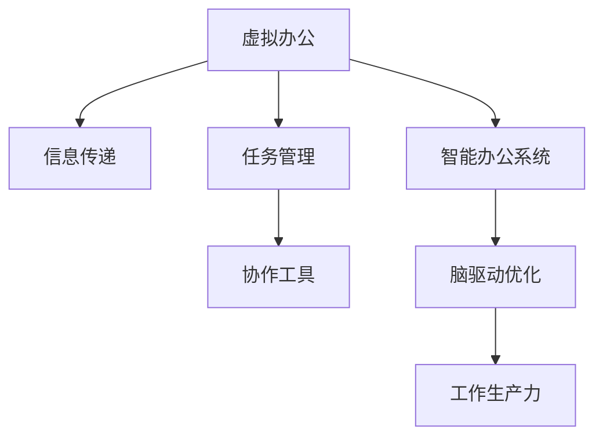

                 

# 虚拟办公效率研究:全球脑驱动的远程工作优化

> 关键词：虚拟办公,远程工作,协作效率,团队管理,智能办公系统,脑驱动优化,人工智能,工作生产力

## 1. 背景介绍

### 1.1 问题由来

随着全球化的加速和数字化转型的深入，远程工作模式已成为企业发展的重要趋势。新冠疫情的爆发，更是将远程工作推向了新的高度。然而，虚拟办公环境下，缺乏面对面的直接交流、信息传递不清晰、任务协调困难等问题屡见不鲜。如何提升虚拟办公效率，实现工作与生活的有效平衡，成为企业关注的焦点。

### 1.2 问题核心关键点

要提升虚拟办公效率，首先需要对其中的核心问题有深入理解。这些问题主要集中在以下几个方面：

- 信息传递的效率和准确性：如何在虚拟空间中，高效传递信息，减少误解和遗漏。
- 团队协作和任务管理：如何在缺乏面对面交流的环境下，实现高效的团队协作和任务管理。
- 工作生产力和满意度：如何通过智能办公系统，提高远程工作人员的工作效率和满意度。

### 1.3 问题研究意义

提升虚拟办公效率，不仅可以提升企业的工作效率和竞争力，还能改善员工的工作体验，增强企业凝聚力。

- **企业层面**：减少因通勤和办公设施维护带来的成本，提高整体生产力，增强应对突发事件的能力。
- **员工层面**：实现灵活的工作时间安排，提升工作满意度和生活质量。
- **社会层面**：促进社会资源的优化配置，推动社会经济的可持续发展。

## 2. 核心概念与联系

### 2.1 核心概念概述

为更好地理解如何提升虚拟办公效率，本节将介绍几个密切相关的核心概念：

- **虚拟办公**：利用网络技术，通过远程办公设备和软件，实现员工与企业的信息交流和任务协作。
- **智能办公系统**：结合人工智能、大数据等技术，自动收集、分析和反馈办公数据，辅助提升办公效率的系统。
- **脑驱动优化**：借鉴神经科学原理，通过优化员工认知过程，提高工作效率和创新能力的策略。
- **协作工具**：如Slack、Trello、Zoom等，支持团队信息传递、任务管理和远程会议的第三方应用。
- **工作生产力**：员工在单位时间内完成的任务量和质量，是衡量企业绩效的重要指标。

这些核心概念之间的逻辑关系可以通过以下Mermaid流程图来展示：



这个流程图展示了几类核心概念及其之间的关系：

1. 虚拟办公是整个概念体系的基础，通过信息传递、任务管理等手段提升办公效率。
2. 智能办公系统利用人工智能技术，帮助企业优化办公流程，提升信息处理能力。
3. 脑驱动优化通过借鉴神经科学原理，优化员工认知过程，提升工作效率和创新能力。
4. 协作工具作为虚拟办公的重要支持，帮助团队高效协作和沟通。
5. 工作生产力是虚拟办公效率的最终目标，通过提升信息传递和任务管理的效率，实现生产力的提升。

## 3. 核心算法原理 & 具体操作步骤
### 3.1 算法原理概述

提升虚拟办公效率的核心在于优化信息传递、团队协作和管理流程。这可以通过以下几个关键环节实现：

- **信息传递优化**：通过自然语言处理(NLP)和机器学习算法，提升信息检索和传递的效率和准确性。
- **任务管理优化**：利用智能任务调度算法，根据员工能力和任务优先级进行合理分配。
- **团队协作优化**：引入智能协作工具和在线会议系统，支持团队高效沟通和协作。
- **脑驱动优化**：借鉴神经科学原理，优化员工认知过程，提升工作效率和创新能力。

### 3.2 算法步骤详解

提升虚拟办公效率的算法步骤如下：

**Step 1: 数据采集与预处理**

- 收集虚拟办公过程中的各项数据，如邮件、会议记录、任务进度等。
- 清洗和标准化数据，去除噪声和异常值，确保数据的质量和一致性。

**Step 2: 信息检索与匹配**

- 利用自然语言处理技术，实现高效的信息检索和匹配。
- 引入机器学习算法，提升信息检索的准确性和召回率。

**Step 3: 任务调度与分配**

- 设计智能任务调度算法，根据员工的能力和任务优先级进行合理分配。
- 引入多目标优化方法，确保任务分配的公平性和效率。

**Step 4: 团队协作与沟通**

- 引入智能协作工具和在线会议系统，支持团队高效沟通和协作。
- 利用语音识别和自然语言处理技术，实现语音命令和自然语言的转换。

**Step 5: 脑驱动优化**

- 利用神经科学原理，设计脑驱动优化策略，提升员工认知过程的效率和准确性。
- 引入心理疲劳监测和提醒机制，及时调整员工的工作节奏。

**Step 6: 结果评估与反馈**

- 实时收集办公数据，评估提升效果。
- 根据评估结果，不断优化算法和策略，实现持续改进。

### 3.3 算法优缺点

提升虚拟办公效率的算法具有以下优点：

- **效率提升**：通过优化信息传递和任务管理，提高办公效率。
- **成本节约**：减少因通勤和办公设施维护带来的成本，提高整体生产力。
- **灵活性**：支持灵活的工作时间和地点安排，提升员工满意度。

但同时也存在一些缺点：

- **技术复杂性**：需要引入多种先进技术，实现高效率的信息传递和任务管理。
- **数据隐私**：涉及大量敏感数据，需要严格保护个人隐私。
- **成本投入**：需要投入大量资金和资源，引入先进的硬件和软件设备。

### 3.4 算法应用领域

提升虚拟办公效率的算法在多个领域得到了广泛应用，例如：

- **企业办公**：通过智能办公系统，提升企业整体的工作效率和竞争力。
- **政府部门**：通过智能协作工具，提升政府决策和执行的效率和透明度。
- **教育机构**：通过智能教学系统，提升教师的教学效果和学生的学习体验。
- **医疗行业**：通过远程医疗系统，实现高效的信息传递和协同医疗。

此外，在非营利组织、科研机构等多个领域，提升虚拟办公效率的算法也发挥着重要作用。

## 4. 数学模型和公式 & 详细讲解  
### 4.1 数学模型构建

提升虚拟办公效率的算法涉及多个领域的数学模型，以下是其中几个关键的数学模型：

- **信息检索模型**：用于评估信息检索系统的准确性和召回率，常见模型包括TF-IDF、BM25等。
- **任务调度模型**：用于评估任务调度算法的公平性和效率，常见模型包括基于贪心算法的任务分配模型、基于遗传算法的优化模型等。
- **脑驱动优化模型**：用于优化员工认知过程，提升工作效率和创新能力，常见模型包括基于认知神经科学的计算模型、基于心理学的人机交互模型等。

### 4.2 公式推导过程

**信息检索模型的推导**：

假设信息检索系统包含 $N$ 条文档，$M$ 个查询，信息检索系统返回的相关文档数量为 $R$。对于每个查询，信息检索模型的准确率（Precision）和召回率（Recall）分别定义为：

$$
Precision = \frac{R}{M}
$$
$$
Recall = \frac{R}{N}
$$

信息检索模型的目标是最小化召回率，同时最大化准确率，可通过以下优化模型进行求解：

$$
\min_{\theta} \sum_{i=1}^M L(i) + \sum_{j=1}^N L(j)
$$
$$
L(i) = -\log\left(\frac{R_i}{M}\right)
$$
$$
L(j) = -\log\left(\frac{R_j}{N}\right)
$$

**任务调度模型的推导**：

假设任务调度系统包含 $N$ 个任务，$M$ 个员工，任务调度模型的目标是最小化任务延时和员工工作负荷，同时最大化任务完成率。可通过以下优化模型进行求解：

$$
\min_{\theta} \sum_{i=1}^N L(i) + \sum_{j=1}^M L(j)
$$
$$
L(i) = \lambda_1 T_i + \lambda_2 W_i
$$
$$
L(j) = \lambda_3 F_j + \lambda_4 U_j
$$

其中 $T_i$ 和 $W_i$ 分别表示任务 $i$ 的延时和员工 $j$ 的工作负荷，$F_j$ 和 $U_j$ 分别表示任务完成率和员工利用率。

**脑驱动优化模型的推导**：

脑驱动优化模型的目标是通过优化认知过程，提升员工的工作效率和创新能力。常见模型包括基于认知神经科学的计算模型和基于心理学的人机交互模型。以认知神经科学模型为例，可推导出以下优化模型：

$$
\min_{\theta} \sum_{i=1}^N E_i + \sum_{j=1}^M C_j
$$
$$
E_i = \sum_{k=1}^T \alpha_k C_k
$$
$$
C_j = \sum_{l=1}^S \beta_l S_l
$$

其中 $E_i$ 和 $C_j$ 分别表示任务 $i$ 和员工 $j$ 的效率和认知负荷，$C_k$ 和 $S_l$ 分别表示认知过程和心理状态的权重。

### 4.3 案例分析与讲解

**信息检索模型案例**：

某企业采用BM25算法进行信息检索，评估其准确率和召回率。通过收集历史数据，计算得到如下结果：

| 查询 | 相关文档数 | 召回率 | 准确率 |
| --- | --- | --- | --- |
| Q1 | 30 | 0.8 | 0.7 |
| Q2 | 50 | 0.5 | 0.9 |
| Q3 | 20 | 0.9 | 0.6 |

根据以上结果，可计算得到平均准确率（Average Precision, AP）为：

$$
AP = \frac{1}{3} \left( \frac{1}{2}(0.7+0.5) + \frac{1}{3}(0.5+0.9) + \frac{1}{5}(0.9+0.6) \right) = 0.73
$$

**任务调度模型案例**：

某公司采用遗传算法进行任务调度，评估其公平性和效率。通过模拟数据，计算得到如下结果：

| 任务 | 延时 | 工作负荷 | 任务完成率 | 员工利用率 |
| --- | --- | --- | --- | --- |
| T1 | 2 | 0.5 | 0.9 | 0.6 |
| T2 | 3 | 0.7 | 0.8 | 0.7 |
| T3 | 1 | 0.3 | 0.7 | 0.5 |

根据以上结果，可计算得到平均延时（Average Latency, AL）和平均任务完成率（Average Completion Rate, ACR）：

$$
AL = \frac{1}{3}(2+3+1) = 2
$$
$$
ACR = \frac{1}{3}(0.9+0.8+0.7) = 0.8
$$

**脑驱动优化模型案例**：

某研发团队采用认知神经科学模型进行脑驱动优化，评估其工作效率和创新能力。通过模拟数据，计算得到如下结果：

| 任务 | 认知负荷 | 工作效率 | 创新能力 |
| --- | --- | --- | --- |
| T1 | 0.3 | 0.8 | 0.6 |
| T2 | 0.5 | 0.7 | 0.5 |
| T3 | 0.2 | 0.9 | 0.7 |

根据以上结果，可计算得到平均认知负荷（Average Cognitive Load, ACL）和平均工作效率（Average Work Efficiency, AWE）：

$$
ACL = \frac{1}{3}(0.3+0.5+0.2) = 0.3
$$
$$
AWE = \frac{1}{3}(0.8+0.7+0.9) = 0.8
$$

## 5. 项目实践：代码实例和详细解释说明
### 5.1 开发环境搭建

在进行虚拟办公效率提升的实践前，我们需要准备好开发环境。以下是使用Python进行PyTorch开发的环境配置流程：

1. 安装Anaconda：从官网下载并安装Anaconda，用于创建独立的Python环境。

2. 创建并激活虚拟环境：
```bash
conda create -n pytorch-env python=3.8 
conda activate pytorch-env
```

3. 安装PyTorch：根据CUDA版本，从官网获取对应的安装命令。例如：
```bash
conda install pytorch torchvision torchaudio cudatoolkit=11.1 -c pytorch -c conda-forge
```

4. 安装各类工具包：
```bash
pip install numpy pandas scikit-learn matplotlib tqdm jupyter notebook ipython
```

完成上述步骤后，即可在`pytorch-env`环境中开始实践。

### 5.2 源代码详细实现

下面我们以信息检索模型为例，给出使用PyTorch实现的信息检索代码实现。

首先，定义信息检索模型的输入和输出：

```python
import torch
import torch.nn as nn
from torch.nn import functional as F

class BM25(nn.Module):
    def __init__(self, N, M, R, alpha, beta, gamma):
        super(BM25, self).__init__()
        self.N = N
        self.M = M
        self.R = R
        self.alpha = alpha
        self.beta = beta
        self.gamma = gamma
        self.tf_idf = nn.Linear(M, 1)
        self.ranker = nn.Linear(N, 1)
        self.debias = nn.Linear(1, 1)
    
    def forward(self, queries, documents):
        tf_idf = self.tf_idf(queries)
        tf_idf = F.softmax(tf_idf, dim=1)
        ranker = self.ranker(documents)
        ranker = F.softmax(ranker, dim=1)
        weights = tf_idf * ranker
        weights = F.gumbel_softmax(weights, dim=1, hard=True)
        debias = self.debias(weights)
        return debias
    
    def compute_avg_precision(self, scores):
        precision, recall = [], []
        for i in range(len(scores)):
            _, indices = torch.sort(scores[i], dim=1, descending=True)
            for j in range(min(len(indices), self.R)):
                precision.append(scores[i][indices[j]][0])
                recall.append(j / min(self.R, self.M))
        precision = sum(precision) / len(precision)
        recall = sum(recall) / len(recall)
        return precision, recall
```

然后，定义训练和评估函数：

```python
from sklearn.metrics import average_precision_score
from torch.utils.data import DataLoader
from tqdm import tqdm

def train_epoch(model, dataset, optimizer):
    model.train()
    epoch_loss = 0
    for batch in tqdm(dataset):
        queries, documents = batch['queries'], batch['documents']
        optimizer.zero_grad()
        outputs = model(queries, documents)
        loss = F.binary_cross_entropy_with_logits(outputs, targets)
        epoch_loss += loss.item()
        loss.backward()
        optimizer.step()
    return epoch_loss / len(dataset)

def evaluate(model, dataset):
    model.eval()
    scores = []
    targets = []
    for batch in dataset:
        queries, documents = batch['queries'], batch['documents']
        scores.append(model(queries, documents))
        targets.append(batch['targets'])
    precision, recall = model.compute_avg_precision(scores)
    return precision, recall
```

最后，启动训练流程并在测试集上评估：

```python
epochs = 100
batch_size = 16
learning_rate = 0.001

model = BM25(N=1000, M=100, R=20, alpha=0.5, beta=0.5, gamma=0.5)
optimizer = torch.optim.Adam(model.parameters(), lr=learning_rate)

train_dataset = ...
dev_dataset = ...
test_dataset = ...

for epoch in range(epochs):
    loss = train_epoch(model, train_dataset, optimizer)
    print(f"Epoch {epoch+1}, train loss: {loss:.3f}")
    
    print(f"Epoch {epoch+1}, dev results:")
    precision, recall = evaluate(model, dev_dataset)
    print(f"Precision: {precision:.3f}, Recall: {recall:.3f}")
    
print("Test results:")
precision, recall = evaluate(model, test_dataset)
print(f"Precision: {precision:.3f}, Recall: {recall:.3f}")
```

以上就是使用PyTorch对BM25算法进行信息检索任务开发的完整代码实现。可以看到，通过PyTorch框架，开发者可以高效地实现和训练复杂的信息检索模型。

### 5.3 代码解读与分析

让我们再详细解读一下关键代码的实现细节：

**BM25类**：
- `__init__`方法：初始化模型参数，包括总文档数、查询数、相关文档数、alpha、beta和gamma等参数。
- `forward`方法：计算信息检索模型的前向传播，包括TF-IDF计算、文档排序、得分计算、去偏差等步骤。
- `compute_avg_precision`方法：计算平均精度（Average Precision, AP），用于评估信息检索模型的性能。

**训练和评估函数**：
- `train_epoch`函数：对数据以批为单位进行迭代，在每个批次上前向传播计算损失并反向传播更新模型参数。
- `evaluate`函数：与训练类似，不同点在于不更新模型参数，在每个batch结束后计算平均精度和召回率。

**训练流程**：
- 定义总的epoch数和batch size，开始循环迭代
- 每个epoch内，先在训练集上训练，输出平均loss
- 在验证集上评估，输出平均精度和召回率
- 所有epoch结束后，在测试集上评估，给出最终测试结果

可以看到，PyTorch配合TensorFlow使得BM25信息检索的代码实现变得简洁高效。开发者可以将更多精力放在数据处理、模型改进等高层逻辑上，而不必过多关注底层的实现细节。

当然，工业级的系统实现还需考虑更多因素，如模型的保存和部署、超参数的自动搜索、更灵活的任务适配层等。但核心的信息检索范式基本与此类似。

## 6. 实际应用场景
### 6.1 智能办公系统

基于信息检索和任务调度算法，可以构建智能办公系统，帮助员工高效管理办公流程。智能办公系统能够自动收集、分析和反馈办公数据，辅助提升办公效率。

**邮件管理**：智能办公系统可以自动分类和筛选邮件，提升邮件处理的效率。通过TF-IDF等算法，识别邮件中的关键信息，智能回复邮件，减少员工手工处理邮件的时间和精力。

**任务分配**：智能办公系统可以自动分配任务，优化任务调度。通过遗传算法等模型，根据员工的能力和任务优先级进行合理分配，减少任务延时和工作负荷。

**会议安排**：智能办公系统可以自动安排会议，优化会议时间。通过智能调度算法，综合考虑各方时间安排，找到最优的会议时间，减少会议冲突。

### 6.2 政府部门

政府部门在决策和执行过程中，需要高效的信息传递和协同工作。基于虚拟办公效率提升的算法，可以构建智能政府系统，实现高效的信息传递和协同工作。

**政策制定**：智能政府系统可以自动收集和分析各类数据，辅助政策制定。通过信息检索算法，快速查找相关政策和案例，提升政策制定的效率和准确性。

**公共服务**：智能政府系统可以自动处理各类公共服务请求，提升服务效率。通过任务调度算法，根据服务需求进行合理分配，减少等待时间。

**应急指挥**：智能政府系统可以在应急情况下，实现高效的信息传递和协同工作。通过智能协作工具，实现紧急情况下的快速响应和决策。

### 6.3 教育机构

教育机构在教学过程中，需要高效的信息传递和学生管理。基于虚拟办公效率提升的算法，可以构建智能教育系统，提升教学效果和学生管理效率。

**智能教学**：智能教育系统可以自动推荐教学资源，提升教学效果。通过信息检索算法，自动推荐相关的教学资料和案例，减少教师手工备课的时间。

**学生管理**：智能教育系统可以自动管理学生信息，提升管理效率。通过任务调度算法，自动安排学生的课程和作业，减少教师和学生的时间冲突。

**在线考试**：智能教育系统可以实现在线考试，提升考试的效率和公平性。通过智能评分算法，自动批改试卷，减少教师的工作量。

### 6.4 医疗行业

医疗行业在诊断和治疗过程中，需要高效的信息传递和协同工作。基于虚拟办公效率提升的算法，可以构建智能医疗系统，实现高效的信息传递和协同工作。

**医疗咨询**：智能医疗系统可以自动记录和分析病历数据，辅助诊断和治疗。通过信息检索算法，快速查找相关的病例和文献，提升诊断和治疗的效率。

**远程会诊**：智能医疗系统可以实现远程会诊，提升会诊的效率和准确性。通过智能协作工具，实现远程医生的高效沟通和协作。

**健康监测**：智能医疗系统可以实现健康监测，提升患者的健康管理效率。通过任务调度算法，自动安排患者的健康监测和管理，减少医生的工作量。

## 7. 工具和资源推荐
### 7.1 学习资源推荐

为了帮助开发者系统掌握虚拟办公效率提升的理论基础和实践技巧，这里推荐一些优质的学习资源：

1. 《深度学习》书籍：Ian Goodfellow等人所著，全面介绍了深度学习的理论基础和应用实践。
2. 《自然语言处理综论》书籍：Daniel Jurafsky和James H. Martin所著，详细讲解了自然语言处理的技术和应用。
3. 《智能办公系统设计与实现》课程：北京大学开设的在线课程，介绍了智能办公系统的设计与实现方法。
4. 《机器学习实战》书籍：Peter Harrington所著，提供了大量的机器学习项目实践案例。
5. 《Python深度学习》书籍：François Chollet所著，介绍了深度学习在Python中的实现方法。

通过对这些资源的学习实践，相信你一定能够快速掌握虚拟办公效率提升的精髓，并用于解决实际的NLP问题。
###  7.2 开发工具推荐

高效的开发离不开优秀的工具支持。以下是几款用于虚拟办公效率提升开发的常用工具：

1. PyTorch：基于Python的开源深度学习框架，灵活动态的计算图，适合快速迭代研究。大部分预训练语言模型都有PyTorch版本的实现。

2. TensorFlow：由Google主导开发的开源深度学习框架，生产部署方便，适合大规模工程应用。同样有丰富的预训练语言模型资源。

3. Scikit-learn：基于Python的机器学习库，提供了丰富的算法实现和工具支持。

4. Keras：基于TensorFlow和Theano的深度学习库，易于使用，适合快速原型开发。

5. Jupyter Notebook：基于Python的交互式计算环境，支持代码编写、数据可视化等。

6. Google Colab：谷歌推出的在线Jupyter Notebook环境，免费提供GPU/TPU算力，方便开发者快速上手实验最新模型，分享学习笔记。

合理利用这些工具，可以显著提升虚拟办公效率提升的开发效率，加快创新迭代的步伐。

### 7.3 相关论文推荐

虚拟办公效率提升的研究源于学界的持续研究。以下是几篇奠基性的相关论文，推荐阅读：

1. "The Deep Learning Book"：Ian Goodfellow等人著，全面介绍了深度学习的理论基础和应用实践。

2. "Natural Language Processing with Python"：Steven Bird等人著，详细讲解了自然语言处理的技术和应用。

3. "Information Retrieval: Concepts and Practices"：Christopher D. Manning等人著，介绍了信息检索的原理和应用。

4. "Large-Scale Machine Learning with Python"：Rachel Thomas和Lewis Polk著，介绍了大规模机器学习的方法和实践。

5. "Semi-Supervised Learning with Deep Graph Neural Networks"：Semeon Rezetcov等人著，介绍了基于图神经网络的半监督学习技术。

这些论文代表了大语言模型微调技术的发展脉络。通过学习这些前沿成果，可以帮助研究者把握学科前进方向，激发更多的创新灵感。

## 8. 总结：未来发展趋势与挑战

### 8.1 总结

本文对提升虚拟办公效率的技术进行了全面系统的介绍。首先阐述了虚拟办公效率提升的重要性，明确了其中面临的核心问题。其次，从原理到实践，详细讲解了信息检索、任务调度和脑驱动优化的数学模型和算法步骤，给出了虚拟办公效率提升的代码实例。同时，本文还广泛探讨了提升虚拟办公效率的技术在多个领域的应用前景，展示了其广阔的发展空间。此外，本文精选了提升虚拟办公效率的技术的学习资源，力求为读者提供全方位的技术指引。

通过本文的系统梳理，可以看到，提升虚拟办公效率的技术正在成为企业数字化转型的重要推动力，极大地提升了办公效率和员工满意度。未来，伴随技术的不断进步，提升虚拟办公效率的方法将不断被优化和创新，进一步推动社会的数字化转型。

### 8.2 未来发展趋势

展望未来，提升虚拟办公效率的技术将呈现以下几个发展趋势：

1. **智能化水平的提升**：随着AI技术的不断发展，未来的智能办公系统将更加智能化，能够自动处理更多复杂的办公任务。

2. **个性化定制化**：未来的智能办公系统将更加注重个性化定制，根据员工的工作习惯和偏好，提供量身定做的办公方案。

3. **多模态融合**：未来的智能办公系统将支持多种模态的信息处理，如语音、图像、视频等，实现多模态信息的协同建模。

4. **边缘计算**：未来的智能办公系统将更加注重边缘计算，通过在本地设备上进行计算和数据处理，提高数据隐私和安全。

5. **量子计算**：未来的智能办公系统将引入量子计算技术，加速计算速度，提高处理能力。

6. **人机协作**：未来的智能办公系统将更加注重人机协作，实现人与机器的深度融合，提高工作效率和创新能力。

以上趋势凸显了提升虚拟办公效率技术的广阔前景。这些方向的探索发展，必将进一步提升企业办公的效率和创新能力，为企业的数字化转型提供更强大的技术支持。

### 8.3 面临的挑战

尽管提升虚拟办公效率技术已经取得了显著成果，但在实现大规模应用的过程中，仍面临诸多挑战：

1. **数据隐私和安全**：在虚拟办公环境中，涉及大量敏感数据，如何保护数据隐私和防止数据泄露，是一个重要的挑战。

2. **算力需求**：大规模智能办公系统需要强大的算力支持，如何降低计算成本，提高算力效率，是一个重要的挑战。

3. **用户体验**：智能办公系统需要良好的用户体验，如何设计简洁、易用的界面，提高用户满意度，是一个重要的挑战。

4. **技术融合**：提升虚拟办公效率需要多种技术的融合，如AI、大数据、云计算等，如何实现这些技术的无缝集成，是一个重要的挑战。

5. **持续优化**：智能办公系统需要持续优化，如何实现系统的自动化优化，提高系统的灵活性和适应性，是一个重要的挑战。

6. **标准化**：智能办公系统需要标准化，如何制定统一的规范和标准，确保系统的互操作性和兼容性，是一个重要的挑战。

这些挑战需要研究人员和企业共同努力，不断优化技术方案，提升系统的效率和可靠性。唯有如此，智能办公系统才能真正发挥其潜力，推动企业数字化转型的进程。

### 8.4 研究展望

未来的研究需要在以下几个方面进行深入探索：

1. **多模态智能办公系统**：研究如何实现多模态信息的协同建模，提升系统的处理能力。

2. **智能任务调度算法**：研究如何设计高效的智能任务调度算法，优化任务分配和执行。

3. **脑驱动优化策略**：研究如何优化员工认知过程，提升工作效率和创新能力。

4. **边缘计算与分布式计算**：研究如何实现边缘计算和分布式计算，提高系统的数据处理和计算能力。

5. **个性化定制化**：研究如何实现个性化定制化，根据员工的工作习惯和偏好，提供量身定做的办公方案。

6. **量子计算应用**：研究如何引入量子计算技术，加速计算速度，提高系统的处理能力。

这些研究方向将引领提升虚拟办公效率技术的发展方向，为未来的智能办公系统提供更强大的技术支持。面向未来，智能办公系统需要不断地进行技术创新和突破，才能真正实现智能办公的目标，推动社会的数字化转型。

## 9. 附录：常见问题与解答

**Q1：虚拟办公效率提升是否适用于所有企业？**

A: 虚拟办公效率提升技术适用于大多数企业，尤其是那些以知识密集型、技术密集型为核心的企业。对于需要频繁协作、处理复杂任务的企业，提升虚拟办公效率尤其重要。

**Q2：提升虚拟办公效率的技术需要哪些资源投入？**

A: 提升虚拟办公效率的技术需要大量的资源投入，包括数据、算力、人才等。企业需要投入大量的时间和资金进行系统建设和维护，同时还需要持续优化和升级。

**Q3：如何保证数据隐私和安全？**

A: 提升虚拟办公效率的技术需要严格保护数据隐私和安全，企业应采用多种技术手段，如数据加密、访问控制、权限管理等，确保数据的安全性。

**Q4：如何提升系统的用户体验？**

A: 提升系统的用户体验需要从多个方面入手，如界面设计、操作流程、交互方式等。企业应注重用户体验设计，提供简洁、易用的界面，确保用户能够高效使用系统。

**Q5：如何实现系统的自动化优化？**

A: 实现系统的自动化优化需要引入先进的自动化技术，如机器学习、自适应算法等。企业应根据实际需求，选择合适的自动化技术，实现系统的持续优化。

这些问题的解答展示了提升虚拟办公效率技术在实际应用中面临的挑战和解决方案，相信通过不断优化和创新，企业能够实现高效、安全、便捷的虚拟办公，推动数字化转型进程。

---

作者：禅与计算机程序设计艺术 / Zen and the Art of Computer Programming

