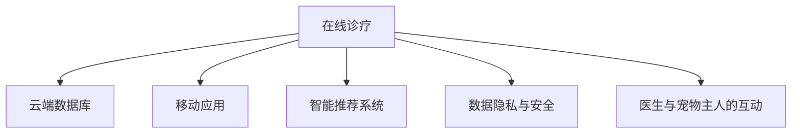

                 

## 1. 背景介绍

### 1.1 问题由来
随着宠物行业的迅速发展，宠物健康管理越来越受到宠物主人和相关企业的重视。宠物健康管理不仅涵盖了宠物日常生活中的疾病预防、体检、诊疗和疫苗接种等，还延伸到宠物饮食、运动和心理健康等多个维度。传统线下宠物医院往往资源有限，难以满足日益增长的宠物健康需求。

在此背景下，利用互联网技术构建在线宠物健康管理系统，成为一种新兴的解决方案。在线宠物健康管理不仅能为宠物主人提供便捷的医疗服务，还能帮助宠物医院提高运营效率，降低运营成本，提升用户体验，构建长期的客户关系。

### 1.2 问题核心关键点
在线宠物健康管理系统的核心关键点包括：
- 在线诊疗服务：通过远程视频和图像诊断技术，实现宠物医生的在线诊疗。
- 云端数据库：利用云计算技术，存储和管理宠物健康数据。
- 移动终端接入：开发移动App，实现随时随地查看和管理宠物健康信息。
- 数据隐私和安全：确保宠物健康数据的安全存储和传输，防止数据泄露和篡改。
- 智能推荐系统：利用机器学习技术，推荐合适的治疗方案和保健产品。
- 医生和宠物主人的互动：构建平台上的医生与宠物主人交流沟通的环境。

### 1.3 问题研究意义
在线宠物健康管理系统的构建，对于拓展宠物医疗服务的深度和广度，提升宠物健康管理水平，具有重要意义：
- 提升宠物诊疗效率：在线诊疗可以大大缩短宠物看病的时间，减少宠物主人和宠物的旅途奔波。
- 实现远程监控：宠物主人可以实时监控宠物的健康状况，及时发现问题并采取措施。
- 辅助宠物健康管理：智能推荐系统能根据宠物健康数据提供个性化建议，帮助宠物主人更好地管理宠物健康。
- 助力宠物医院发展：在线平台能为宠物医院带来更多的线上流量，提升知名度和业务量。

## 2. 核心概念与联系

### 2.1 核心概念概述

在线宠物健康管理系统涉及多个核心概念，它们相互关联，构成了一个完整的体系。这些概念包括：

- **在线诊疗**：利用互联网技术，实现在线视频和图像诊断服务，让宠物医生可以远程为宠物进行初步诊断。
- **云端数据库**：使用云计算平台，存储和管理宠物健康数据，如体检记录、医疗记录、病历信息等。
- **移动应用**：开发适合宠物主人和宠物医生使用的移动App，方便信息查看、功能操作和互动沟通。
- **智能推荐系统**：利用机器学习算法，根据宠物健康数据，为宠物主人提供个性化的保健建议和治疗方案。
- **数据隐私与安全**：保护宠物健康数据的安全存储和传输，确保数据不被未授权访问和使用。
- **医生与宠物主人的互动**：构建平台，促进医生与宠物主人之间的沟通交流，提升服务质量。

这些概念之间的联系可以通过以下Mermaid流程图来展示：

这个流程图展示了在线宠物健康管理系统的主要组件及其相互关系：

1. 在线诊疗服务提供初步诊断，数据存储在云端数据库中。
2. 移动应用提供便捷的查询和操作界面，医生和宠物主人可以通过App交流沟通。
3. 智能推荐系统根据云端数据库中的数据，提供个性化的治疗和保健建议。
4. 数据隐私与安全措施保障数据的安全存储和传输。
5. 医生与宠物主人的互动通过平台进行，提升服务质量。

## 3. 核心算法原理 & 具体操作步骤
### 3.1 算法原理概述

在线宠物健康管理系统的核心算法包括在线诊疗、智能推荐和云端数据库等技术，以下是这些算法的原理概述：

- **在线诊疗**：利用深度学习技术，对宠物的图像和视频数据进行分析和诊断，生成诊断报告。其中，卷积神经网络(CNN)和循环神经网络(RNN)是最常用的模型。

- **智能推荐**：通过分析云端数据库中的宠物健康数据，利用机器学习算法，为宠物主人推荐合适的治疗方案和保健产品。常用的算法包括决策树、随机森林和协同过滤等。

- **云端数据库**：利用分布式数据库技术，确保数据的可靠性和可扩展性。常用的技术包括Hadoop、Spark和Amazon RDS等。

### 3.2 算法步骤详解

在线宠物健康管理系统的主要算法步骤包括：

1. **在线诊疗流程**：
   - 宠物主人通过App提交宠物的图像和视频，医生通过在线诊疗平台查看。
   - 医生利用深度学习模型对图像和视频进行分析，生成初步诊断报告。
   - 诊断报告通过云端数据库存储，供宠物主人查看和后续医生参考。

2. **智能推荐流程**：
   - 宠物主人上传宠物的体检数据，包括体重、年龄、病史等信息。
   - 系统分析体检数据，使用机器学习算法生成推荐方案。
   - 推荐方案通过移动App显示给宠物主人，供其选择和参考。

3. **云端数据库管理**：
   - 数据存储在云端数据库中，分为结构化和非结构化数据。
   - 利用分布式数据库技术，确保数据的可靠性和可扩展性。
   - 数据备份和恢复机制保障数据安全。

### 3.3 算法优缺点

在线宠物健康管理系统的算法具有以下优点：
- 方便高效：宠物主人和宠物医生可以通过移动App随时随地进行在线诊疗，方便快捷。
- 数据存储和管理：云端数据库确保数据的可靠性和可扩展性，方便数据管理和查询。
- 个性化推荐：智能推荐系统根据宠物的健康数据，提供个性化的治疗和保健建议。

同时，这些算法也存在一些缺点：
- 对网络带宽和设备要求较高：在线诊疗和数据上传需要稳定的网络环境和高性能的设备。
- 数据隐私和安全风险：云端存储和传输的数据存在被泄露和篡改的风险。
- 深度学习模型的训练成本高：深度学习模型的训练需要大量标注数据和高性能的计算资源。

### 3.4 算法应用领域

在线宠物健康管理系统涉及多个领域，包括：

- 宠物医院：在线诊疗和智能推荐能为宠物医院带来更多的线上流量，提升知名度和业务量。
- 宠物食品和保健产品：智能推荐系统能推荐合适的宠物食品和保健产品，增加销售收入。
- 宠物保险：根据宠物的健康数据，评估保险风险，提供定制化的保险方案。
- 宠物行为分析：利用视频分析技术，分析宠物的行为模式，为宠物主人提供参考。
- 宠物心理健康：智能推荐系统能提供心理健康建议，帮助宠物主人应对宠物的心理问题。

## 4. 数学模型和公式 & 详细讲解 & 举例说明

### 4.1 数学模型构建

在线宠物健康管理系统涉及多个数学模型，以下是这些模型的构建：

- **深度学习模型**：用于在线诊疗，生成初步诊断报告。模型结构通常为卷积神经网络(CNN)或循环神经网络(RNN)。

- **推荐系统模型**：用于智能推荐，生成个性化的治疗和保健方案。模型结构通常为协同过滤、决策树或随机森林等。

- **数据库模型**：用于存储和管理数据，包括结构化和非结构化数据。

### 4.2 公式推导过程

深度学习模型的推导过程如下：

$$
\begin{align*}
\text{输入} &= \{x_1, x_2, \ldots, x_n\} \\
\text{卷积层} &= \text{Conv}(\text{输入}, \text{卷积核}, \text{步幅}, \text{填充}) \\
\text{池化层} &= \text{Pool}(\text{卷积层}, \text{池化窗口}) \\
\text{全连接层} &= \text{FC}(\text{池化层}, \text{输出维度}) \\
\text{输出} &= \text{softmax}(\text{全连接层})
\end{align*}
$$

其中，卷积核、步幅和填充等超参数需要根据具体任务进行调节。

推荐系统模型的推导过程如下：

$$
\begin{align*}
\text{用户数据} &= \{u_1, u_2, \ldots, u_n\} \\
\text{物品数据} &= \{i_1, i_2, \ldots, i_m\} \\
\text{协同过滤} &= \text{CF}(\text{用户数据}, \text{物品数据}, \text{相似度函数}) \\
\text{决策树} &= \text{DT}(\text{特征}, \text{决策树算法}) \\
\text{随机森林} &= \text{RF}(\text{决策树}, \text{森林大小})
\end{align*}
$$

其中，相似度函数、决策树算法和森林大小等超参数需要根据具体任务进行调节。

### 4.3 案例分析与讲解

以在线诊疗的深度学习模型为例，分析其案例：

假设宠物主人上传了宠物的图像和视频数据，深度学习模型通过卷积层提取特征，通过池化层降低维度，通过全连接层进行分类，生成初步诊断报告。推导过程如下：

1. 卷积层：
$$
\begin{align*}
\text{卷积核} &= \{w_1, w_2, \ldots, w_k\} \\
\text{卷积操作} &= \text{Conv}(\text{输入}, \text{卷积核}, \text{步幅}, \text{填充})
\end{align*}
$$

2. 池化层：
$$
\begin{align*}
\text{池化窗口} &= \{p_1, p_2, \ldots, p_l\} \\
\text{池化操作} &= \text{Pool}(\text{卷积层}, \text{池化窗口})
\end{align*}
$$

3. 全连接层：
$$
\begin{align*}
\text{输出维度} &= d \\
\text{全连接操作} &= \text{FC}(\text{池化层}, \text{输出维度})
\end{align*}
$$

4. 输出层：
$$
\begin{align*}
\text{softmax函数} &= \text{softmax}(\text{全连接层})
\end{align*}
$$

最终，通过输出层的softmax函数，生成宠物的初步诊断报告，如皮肤病、肠胃病等。

## 5. 项目实践：代码实例和详细解释说明

### 5.1 开发环境搭建

要进行在线宠物健康管理系统的开发，需要先搭建好开发环境。以下是搭建开发环境的具体步骤：

1. **安装Python**：下载Python安装程序，安装最新版本。
2. **安装相关库**：使用pip安装所需的库，如TensorFlow、PyTorch、Keras等深度学习库，以及Flask、SQLAlchemy等Web开发库。
3. **配置环境**：配置好环境变量，确保开发环境正常运行。

### 5.2 源代码详细实现

以下是一个简单的在线宠物诊疗系统的源代码实现，具体步骤如下：

1. **数据准备**：
   - 准备宠物的图像和视频数据。
   - 准备宠物的体检数据，如体重、年龄、病史等。

2. **模型训练**：
   - 使用深度学习框架，如TensorFlow或PyTorch，训练在线诊疗模型。
   - 使用历史数据集进行模型训练，生成初步诊断报告。

3. **App开发**：
   - 使用Flask框架开发在线诊疗App。
   - 实现数据上传、在线诊疗和诊断报告查看等功能。

4. **数据库管理**：
   - 使用SQLAlchemy库管理云端数据库。
   - 实现数据的存储和查询功能。

### 5.3 代码解读与分析

以下是对源代码的详细解读：

1. **数据准备**：
   - 使用PIL库读取宠物的图像和视频数据。
   - 使用NumPy库处理和预处理数据。

2. **模型训练**：
   - 使用Keras框架定义卷积神经网络模型。
   - 使用训练集进行模型训练，生成初步诊断报告。

3. **App开发**：
   - 使用Flask框架创建在线诊疗App。
   - 实现数据上传和诊断报告查看功能。

4. **数据库管理**：
   - 使用SQLAlchemy库连接云端数据库。
   - 实现数据的存储和查询功能。

### 5.4 运行结果展示

以下是运行结果的展示：

1. **在线诊疗结果**：
   - 宠物主人上传宠物的图像和视频数据。
   - 在线诊疗平台生成初步诊断报告，如皮肤病、肠胃病等。

2. **智能推荐结果**：
   - 宠物主人上传宠物的体检数据。
   - 智能推荐系统生成个性化治疗和保健方案，如保健品、疫苗接种等。

3. **数据库查询结果**：
   - 宠物主人在App上查看宠物的健康数据。
   - 宠物医生可以查看宠物的历史诊疗记录和体检数据。

## 6. 实际应用场景

### 6.1 宠物医院

在线宠物健康管理系统能为宠物医院带来多种好处：

1. **提高诊疗效率**：在线诊疗可以大大缩短宠物看病的时间，减少宠物主人和宠物的旅途奔波。
2. **增加业务量**：在线诊疗能为宠物医院带来更多的线上流量，提升知名度和业务量。
3. **数据管理**：云端数据库能方便数据管理和查询，提高医疗效率。

### 6.2 宠物主人

在线宠物健康管理系统能为宠物主人带来多种好处：

1. **方便诊疗**：在线诊疗可以随时随地进行，方便快捷。
2. **实时监控**：宠物主人可以实时监控宠物的健康状况，及时发现问题并采取措施。
3. **智能推荐**：智能推荐系统能提供个性化的治疗和保健建议，帮助宠物主人更好地管理宠物健康。

### 6.3 宠物食品和保健产品

在线宠物健康管理系统能为宠物食品和保健产品带来多种好处：

1. **增加销售收入**：智能推荐系统能推荐合适的宠物食品和保健产品，增加销售收入。
2. **提升品牌认知度**：在线平台能为宠物食品和保健产品带来更多的曝光机会，提升品牌认知度。

### 6.4 未来应用展望

随着技术的不断进步，在线宠物健康管理系统将迎来更多的应用场景：

1. **远程监控**：通过物联网设备，实时监控宠物的健康状况，实现远程监控。
2. **AI辅助诊断**：利用深度学习技术，实现更准确的在线诊疗和诊断。
3. **个性化推荐**：利用大数据和机器学习技术，提供更个性化的治疗和保健方案。
4. **智能客服**：利用聊天机器人，提供24小时在线客服服务，提升用户体验。

## 7. 工具和资源推荐

### 7.1 学习资源推荐

为了帮助开发者系统掌握在线宠物健康管理系统的技术，这里推荐一些优质的学习资源：

1. **深度学习在线课程**：如Coursera、edX、Udacity等平台的深度学习课程，涵盖深度学习的基本概念和实践技巧。
2. **TensorFlow官方文档**：TensorFlow的官方文档，提供了丰富的学习资源和样例代码。
3. **Flask官方文档**：Flask的官方文档，提供了详细的Web开发教程和样例代码。
4. **SQLAlchemy官方文档**：SQLAlchemy的官方文档，提供了丰富的数据库管理教程和样例代码。

通过对这些资源的学习实践，相信你一定能够快速掌握在线宠物健康管理系统的技术，并用于解决实际的宠物健康问题。

### 7.2 开发工具推荐

为了提高开发效率和系统性能，这里推荐一些常用的开发工具：

1. **Python编程语言**：Python具有简单易学、开源免费等优点，是深度学习和大数据领域的主流编程语言。
2. **TensorFlow**：TensorFlow提供了强大的深度学习框架，支持多种神经网络模型和优化算法。
3. **PyTorch**：PyTorch提供了灵活的深度学习框架，支持动态计算图和高效的模型训练。
4. **Flask**：Flask提供了轻量级的Web开发框架，支持快速开发和部署Web应用。
5. **SQLAlchemy**：SQLAlchemy提供了强大的数据库管理功能，支持多种数据库平台。

合理利用这些工具，可以显著提升在线宠物健康管理系统的开发效率，加快创新迭代的步伐。

### 7.3 相关论文推荐

在线宠物健康管理系统涉及多个技术领域，以下是几篇奠基性的相关论文，推荐阅读：

1. **深度学习在医学影像中的应用**：探讨深度学习在医学影像中的应用的最新进展。
2. **推荐系统中的协同过滤算法**：介绍协同过滤算法在推荐系统中的基本原理和实现方法。
3. **分布式数据库技术**：介绍分布式数据库技术的基本原理和实现方法。

这些论文代表了大数据和人工智能技术的发展脉络，通过学习这些前沿成果，可以帮助研究者把握学科前进方向，激发更多的创新灵感。

## 8. 总结：未来发展趋势与挑战

### 8.1 研究成果总结

在线宠物健康管理系统在提高宠物医疗服务的深度和广度、提升用户体验方面，已经取得了显著成效。主要成果包括：

1. **在线诊疗**：利用深度学习技术，实现了宠物的远程诊疗服务，大大提高了诊疗效率。
2. **智能推荐**：利用机器学习技术，提供了个性化的治疗和保健建议，提升了用户体验。
3. **云端数据库**：利用分布式数据库技术，实现了数据的可靠存储和高效管理。

### 8.2 未来发展趋势

展望未来，在线宠物健康管理系统将呈现以下几个发展趋势：

1. **智能化程度提升**：随着AI技术的不断发展，在线诊疗和智能推荐系统的智能化程度将不断提升。
2. **多模态融合**：利用视频、图像、传感器等多模态数据，提升宠物健康监测的准确性和全面性。
3. **边缘计算**：利用边缘计算技术，实现数据的本地处理和分析，提高系统的实时性和可靠性。
4. **云平台集成**：与云平台深度集成，实现数据共享和协同办公，提升系统效率。

### 8.3 面临的挑战

尽管在线宠物健康管理系统已经取得了显著进展，但在实际应用中仍然面临一些挑战：

1. **数据隐私和安全**：在线诊疗和数据传输过程中，数据隐私和安全问题亟待解决。
2. **深度学习模型的复杂性**：深度学习模型的训练和调参过程复杂，需要大量的标注数据和高性能计算资源。
3. **系统稳定性**：在线平台需要具备高可用性和高稳定性，应对各种异常情况。
4. **用户接受度**：在线诊疗和移动App的使用需要用户习惯的培养，面临一定的接受度问题。

### 8.4 研究展望

面对在线宠物健康管理系统所面临的挑战，未来的研究需要在以下几个方面寻求新的突破：

1. **数据隐私保护**：研究如何保护在线诊疗和数据传输过程中的数据隐私和安全。
2. **模型压缩与优化**：研究如何压缩深度学习模型，优化计算资源消耗，提高模型的实时性。
3. **多模态融合技术**：研究如何利用多模态数据，提升宠物健康监测的准确性和全面性。
4. **边缘计算技术**：研究如何利用边缘计算技术，实现数据的本地处理和分析，提高系统的实时性和可靠性。
5. **用户体验优化**：研究如何提升用户对在线诊疗和移动App的接受度和满意度。

这些研究方向的探索，必将引领在线宠物健康管理系统迈向更高的台阶，为宠物主人和宠物医院带来更多的便捷和福利。

## 9. 附录：常见问题与解答

**Q1：如何保证在线诊疗的准确性？**

A: 在线诊疗的准确性需要依靠深度学习模型和医生的综合判断。以下是一些保证准确性的方法：

1. **数据准备**：准备高质量的标注数据，确保模型的训练数据集具有代表性。
2. **模型优化**：优化深度学习模型，提高模型的准确率和鲁棒性。
3. **医生审核**：在线诊疗结果需要经过宠物医生的审核和确认，确保诊断的准确性。

**Q2：如何确保数据隐私和安全？**

A: 在线宠物健康管理系统需要确保数据隐私和安全，以下是一些方法：

1. **数据加密**：对数据进行加密处理，确保数据传输过程中的安全性。
2. **访问控制**：限制对数据访问的权限，确保只有授权用户可以访问数据。
3. **匿名化处理**：对数据进行匿名化处理，防止数据泄露。

**Q3：如何优化深度学习模型的计算效率？**

A: 深度学习模型的计算效率可以通过以下方法进行优化：

1. **模型压缩**：利用模型压缩技术，减少模型的参数量和计算复杂度。
2. **量化加速**：利用量化加速技术，将浮点模型转为定点模型，压缩存储空间，提高计算效率。
3. **分布式计算**：利用分布式计算技术，提高模型训练和推理的效率。

**Q4：如何提升系统的实时性？**

A: 系统的实时性可以通过以下方法进行提升：

1. **边缘计算**：利用边缘计算技术，实现数据的本地处理和分析，减少数据传输时间。
2. **缓存技术**：利用缓存技术，减少数据的访问延迟。
3. **负载均衡**：利用负载均衡技术，提高系统的并发处理能力。

**Q5：如何提升用户对在线诊疗的接受度？**

A: 用户对在线诊疗的接受度可以通过以下方法进行提升：

1. **用户体验优化**：优化移动App的用户体验，提升用户的便利性和满意度。
2. **医生和用户互动**：构建医生和用户互动的环境，提升用户的信任感和满意度。
3. **宣传推广**：通过宣传推广活动，提高用户对在线诊疗的认知度和接受度。

以上是一些常见问题及其解答，希望能帮助您更好地理解和应用在线宠物健康管理系统。

---

作者：禅与计算机程序设计艺术 / Zen and the Art of Computer Programming

