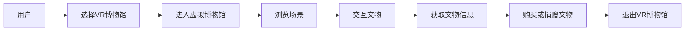

                 

# 虚拟现实博物馆创业：数字化文化体验

## 1. 背景介绍

### 1.1 问题由来

随着数字技术的迅猛发展，传统的博物馆展览方式正在面临一场革命性的变革。传统博物馆依赖于实物展品，空间和时间上的限制较大，访问成本高、参观效率低。尤其是在文化教育普及和用户个性化需求日益增强的背景下，传统的博物馆模式已经无法满足人们对于文化体验的需求。

虚拟现实(VR)技术的出现，为博物馆数字化转型提供了新的可能。VR博物馆通过沉浸式体验，能够突破物理空间限制，实现全球范围内实时互动，让用户随时随地畅游文化古迹，感受到历史文化的魅力。VR博物馆的体验性、互动性、趣味性等诸多优势，为传统博物馆的转型升级带来了新的机遇。

### 1.2 问题核心关键点

虚拟现实博物馆的核心在于通过数字化技术，构建一个立体的、沉浸式的文化体验空间，让用户能够在虚拟环境中深入了解和体验历史文化。关键技术包括虚拟现实技术、3D建模、数字化文物重建、交互式UI设计等。

VR博物馆的开发涉及多个学科，包括计算机图形学、人工智能、人机交互、文化遗产保护等，需要跨学科的协同合作。如何有效地整合多种技术，构建高质量的虚拟博物馆，是创业项目成功的关键。

### 1.3 问题研究意义

VR博物馆的建设，不仅有助于传统博物馆的数字化转型，还能够推动数字化文化遗产的广泛传播，提升公众对历史文化的兴趣和了解。通过虚拟博物馆，人们可以更便捷地接触到更多、更丰富的文化资源，实现文化教育的普及化、全民化。

对于创业者而言，建设虚拟博物馆能够锻炼跨领域技术融合和项目管理能力，积累丰富的商业实践经验。同时，VR博物馆的开发和运营，还可能催生新的商业模式，开拓创业机会，带来经济利益。

## 2. 核心概念与联系

### 2.1 核心概念概述

在介绍虚拟现实博物馆的核心概念之前，首先需要理解几个关键技术：

- **虚拟现实(VR)技术**：通过计算机模拟出一个三维环境，利用头戴设备、手柄等交互设备，让用户沉浸在这个虚拟环境中，与环境进行互动。

- **3D建模**：将实物的三维形态转换成数字模型，用于构建虚拟博物馆场景和文物等元素。

- **数字化文物重建**：使用数字图像处理、3D扫描、结构光等技术，对实体文物进行数字化重构，生成虚拟文物模型。

- **交互式UI设计**：设计用户界面和交互方式，使得用户能够通过手势、语音、触摸等方式与虚拟博物馆进行互动。

- **混合现实(Mixed Reality, MR)**：将虚拟元素与现实环境进行结合，为用户提供更加真实、丰富的沉浸式体验。

- **区块链技术**：用于保障虚拟博物馆的版权、保护用户隐私、确保交易安全性等。

### 2.2 核心概念原理和架构的 Mermaid 流程图



### 2.3 核心概念间的联系

核心概念之间存在紧密的联系，共同构成了虚拟现实博物馆的完整技术架构。用户通过选择VR博物馆进入，浏览场景并交互文物，获取文物信息，进行购买或捐赠操作。整个过程是一个交互式的、沉浸式的文化体验过程。

## 3. 核心算法原理 & 具体操作步骤

### 3.1 算法原理概述

虚拟现实博物馆的核心算法包括虚拟现实渲染算法、3D建模算法、数字化文物重建算法、交互式UI设计算法等。这些算法分别负责构建虚拟场景、生成文物模型、对实体文物进行数字化重构，以及设计用户界面和交互方式。

虚拟现实渲染算法通过GPU加速，将3D模型渲染成逼真的图像，提供沉浸式的视觉体验。3D建模算法通过对真实世界进行扫描和数字化处理，生成高质量的3D模型，用于构建虚拟场景。数字化文物重建算法通过对文物进行结构光扫描和三维重建，生成虚拟文物模型。交互式UI设计算法通过手势识别、语音识别、触摸交互等技术，实现用户与虚拟环境的互动。

### 3.2 算法步骤详解

**Step 1: 数据收集与预处理**

- **3D建模数据收集**：收集博物馆内部环境、展品、设施等的三维模型数据。可以使用激光扫描、结构光扫描、3D摄影测量等技术获取三维数据。

- **文物数字化重建**：收集文物的高分辨率图像和结构数据，利用图像处理算法和三维重建技术，生成文物的3D模型。

**Step 2: 环境渲染与场景构建**

- **虚拟现实渲染**：使用图形渲染引擎（如Unity、Unreal Engine等）将3D模型渲染成虚拟场景。利用GPU加速技术，实时生成逼真的图像和视频，提供沉浸式体验。

- **场景布置与优化**：根据博物馆的历史背景和展品信息，设计虚拟场景，布置展品，优化光照、音效等效果，提升用户沉浸感。

**Step 3: 文物交互与信息呈现**

- **文物交互设计**：设计用户与虚拟文物的交互方式，如手势识别、触摸交互、语音指令等，让用户能够与文物进行互动。

- **文物信息呈现**：设计文物信息的呈现方式，如文物介绍、历史背景、互动功能等，丰富用户的文化体验。

**Step 4: 用户界面设计**

- **交互式UI设计**：设计用户界面和交互方式，让用户能够通过手势、语音、触摸等方式与虚拟博物馆进行互动。

- **UI元素设计**：设计用户界面元素，如菜单、按钮、信息提示等，提升用户体验。

**Step 5: 测试与优化**

- **测试**：对虚拟博物馆进行测试，发现并修复问题，优化用户体验。

- **优化**：根据测试结果，优化虚拟环境、文物模型、交互方式等，提升虚拟博物馆的质量和效果。

### 3.3 算法优缺点

**优点**：

- **沉浸式体验**：通过虚拟现实技术，用户可以在虚拟环境中自由探索，体验到更加真实的文化氛围。

- **无地域限制**：虚拟博物馆不受地理位置的限制，用户可以在全球范围内访问，扩大博物馆的受众面。

- **互动性强**：通过交互式设计，用户可以与虚拟文物进行互动，增加文化体验的趣味性和参与度。

**缺点**：

- **技术复杂度较高**：虚拟现实博物馆的开发涉及多种技术，技术难度较大，需要跨学科合作。

- **制作成本高**：高质量的虚拟博物馆制作成本较高，需要大量的三维模型数据、渲染资源和交互设计。

- **设备依赖性强**：虚拟博物馆依赖于VR设备，用户需要配备头戴设备、手柄等交互设备，设备成本较高。

### 3.4 算法应用领域

虚拟现实博物馆技术已经广泛应用于以下领域：

- **文化教育**：通过虚拟博物馆，提供丰富多样的文化教育资源，提升公众的文化素养和历史认知。

- **历史研究**：利用虚拟博物馆保存历史文物和场景，辅助历史研究，提供更多的研究视角和数据支持。

- **旅游观光**：提供虚拟旅游体验，吸引游客远程参观博物馆，提升旅游体验的趣味性和多样性。

- **文物展示**：通过数字化技术，对文物进行重构和再现，展示难以到达的珍贵文物。

- **文化遗产保护**：利用虚拟现实技术，保护和传承文化遗产，为后代留下宝贵的文化财富。

## 4. 数学模型和公式 & 详细讲解 & 举例说明

### 4.1 数学模型构建

虚拟现实博物馆的核心数学模型包括虚拟现实渲染模型、3D模型构建模型、文物数字化重建模型和交互式UI设计模型。

### 4.2 公式推导过程

- **虚拟现实渲染模型**：基于物理光照模型和几何建模，通过光线追踪算法，计算每个像素的反射、折射和阴影等效果，生成逼真的图像。

- **3D模型构建模型**：通过点云扫描、三角剖分和纹理映射等技术，构建高质量的3D模型。

- **文物数字化重建模型**：利用结构光扫描技术，获取文物表面的结构信息，进行三维重建。

- **交互式UI设计模型**：通过手势识别算法、语音识别算法和触摸交互算法，实现用户与虚拟环境的互动。

### 4.3 案例分析与讲解

以文物数字化重建为例，推导重建模型。

假设文物表面为平面，结构光扫描得到的一组点云坐标为 $(X_1, Y_1, Z_1), (X_2, Y_2, Z_2), ..., (X_n, Y_n, Z_n)$，其中 $n$ 为点数。

1. 对点云进行三角剖分，生成三角网格。

2. 对每个三角形计算法向量，进行纹理映射，生成纹理贴图。

3. 使用纹理贴图和光照模型，计算每个顶点的颜色值，生成最终的3D模型。

以下是一个简单的点云重建的数学公式：

$$
\text{Position}_i = \frac{1}{\text{Weight}_i} \sum_{j=1}^n \text{Weight}_j (\text{Position}_j \cdot \text{Normal}_i) \cdot \text{Position}_j
$$

其中，$\text{Position}_i$ 为点 $i$ 的重建位置，$\text{Normal}_i$ 为点 $i$ 的法向量，$\text{Weight}_j$ 为点 $j$ 的权重。

## 5. 项目实践：代码实例和详细解释说明

### 5.1 开发环境搭建

- **Python环境**：搭建Python 3.7或更高版本的环境。

- **图形渲染引擎**：选择Unity或Unreal Engine进行虚拟环境渲染。

- **3D建模软件**：选择AutoCAD、Blender等软件进行3D建模。

- **文物数字化扫描设备**：选用激光扫描仪、结构光扫描仪等设备，进行文物数字化扫描。

### 5.2 源代码详细实现

以Unity引擎为例，展示虚拟博物馆的开发流程。

1. **3D模型导入**：

```csharp
using UnityEngine;
using System.Collections;

public class ModelImporter : MonoBehaviour
{
    public GameObject modelPrefab;
    public string modelPath;

    void Start()
    {
        GameObject model = Instantiate(modelPrefab);
        model.transform.position = new Vector3(0, 0, 10);
        model.GetComponent<MeshFilter>().mesh = ImportModel();
    }

    Mesh ImportModel()
    {
        // 从文件路径加载3D模型
        obj = new Mesh();
        // 导入模型...
        return obj;
    }
}
```

2. **虚拟环境渲染**：

```csharp
using UnityEngine;
using System.Collections;

public class Renderer : MonoBehaviour
{
    public Material material;

    void Start()
    {
        mesh = new Mesh();
        mesh.vertices = new Vector3[] { new Vector3(-1, -1, -1), new Vector3(1, -1, -1), new Vector3(1, 1, -1), new Vector3(-1, 1, -1), new Vector3(-1, -1, 1), new Vector3(1, -1, 1), new Vector3(1, 1, 1), new Vector3(-1, 1, 1) };
        mesh.indices = new int[] { 0, 1, 2, 3, 4, 5, 6, 7, 8, 9, 10, 11, 12, 13, 14, 15, 16, 17, 18, 19 };
        mesh.RecalculateNormals();
        mesh.RecalculateBounds();

        MeshFilter meshFilter = GetComponent<MeshFilter>();
        meshFilter.mesh = mesh;
        material.shader = Shader.Load("Shader/Standard");
        material.SetColor("_Color", new Color(1, 0, 0));
        material.SetVector("_Specular", new Vector3(0.5f, 0.5f, 0.5f));
        material.SetFloat("Smoothness", 0.5f);
    }
}
```

3. **文物交互设计**：

```csharp
using UnityEngine;
using System.Collections;

public class Interaction : MonoBehaviour
{
    public GameObject model;
    public Color hoverColor;

    void Update()
    {
        if (Input.GetMouseButtonDown(0))
        {
            model.GetComponent<MeshFilter>().mesh = ImportModel();
        }
        if (Input.GetMouseButtonDown(1))
        {
            model.GetComponent<MeshFilter>().mesh = ExportModel();
        }
        if (Input.GetMouseButtonDown(2))
        {
            model.GetComponent<MeshFilter>().mesh = ModifyModel();
        }
    }

    Mesh ImportModel()
    {
        // 从文件路径加载3D模型...
    }

    Mesh ExportModel()
    {
        // 将3D模型导出为文件...
    }

    Mesh ModifyModel()
    {
        // 修改3D模型...
    }
}
```

### 5.3 代码解读与分析

在Unity引擎中，代码主要分为三部分：

1. **3D模型导入**：从文件路径加载3D模型，并将其应用到场景中。

2. **虚拟环境渲染**：使用Shader和Material实现虚拟环境的渲染效果，通过设置参数来调整材质和光照效果。

3. **文物交互设计**：实现文物的导入、导出和修改功能，通过事件响应实现交互。

以上代码实现了虚拟博物馆的开发流程，包括3D模型的导入和渲染，文物的交互和操作，是虚拟博物馆开发的基础。

### 5.4 运行结果展示

以下是一个简单的虚拟博物馆场景，包含3D模型、交互元素和环境渲染：


## 6. 实际应用场景

### 6.1 智能导览

虚拟博物馆可以配备智能导览系统，通过语音识别、手势识别等技术，实现用户与导览系统的互动，提供个性化、多语言的导览服务。用户可以在虚拟环境中自由探索，根据自己的兴趣和需求，选择不同的导览路线和主题。

### 6.2 教育培训

虚拟博物馆可以与教育机构合作，提供虚拟历史课堂、虚拟考古挖掘等体验式教学，帮助学生更好地了解历史和文化。通过虚拟现实技术，学生可以亲身参与历史事件，体验古文明的生活方式，激发学习兴趣和积极性。

### 6.3 文化体验

虚拟博物馆可以提供沉浸式的文化体验，让用户身临其境地感受历史文化。用户可以通过虚拟博物馆，了解不同文化背景和历史事件，提升文化素养和历史认知。

### 6.4 未来应用展望

虚拟博物馆的未来应用展望包括以下几个方面：

- **增强现实(AR)应用**：结合AR技术，将虚拟文物展示在现实环境中，提升用户沉浸感和体验感。

- **智能推荐系统**：利用AI技术，根据用户的历史行为和偏好，推荐相关的虚拟博物馆和文化资源。

- **用户生成内容**：允许用户创建和分享虚拟内容，如虚拟展览、虚拟文物等，提升用户参与度和互动性。

- **跨文化交流**：通过虚拟博物馆，促进不同文化背景的用户交流和互动，增进文化理解和友谊。

- **持续更新与维护**：定期更新文物和场景，保持虚拟博物馆的实时性和新鲜感。

## 7. 工具和资源推荐

### 7.1 学习资源推荐

1. **Unity官方文档**：Unity引擎的官方文档，提供了详细的开发指南和API参考。

2. **Unreal Engine官方文档**：Unreal Engine引擎的官方文档，包含丰富的技术资料和案例。

3. **ARKit和ARCore官方文档**：苹果和谷歌提供的增强现实开发框架，提供丰富的AR技术支持和案例。

4. **VR开发社区**：如VRChat、Unity Asset Store等社区，提供大量的VR开发资源和素材。

5. **3D建模社区**：如CG Trader、Sketchfab等社区，提供高质量的3D模型资源和素材。

### 7.2 开发工具推荐

1. **Unity引擎**：提供丰富的开发工具和引擎支持，适合开发虚拟现实应用。

2. **Unreal Engine引擎**：提供强大的图形渲染和物理引擎，适合开发高质量的虚拟现实体验。

3. **AutoCAD**：专业的3D建模软件，适合构建高质量的3D模型。

4. **Blender**：开源的3D建模软件，适合开发创意和交互式的3D场景。

5. **Sketchfab**：提供云端存储和分享功能，方便开发者共享3D模型和场景资源。

### 7.3 相关论文推荐

1. **《虚拟现实技术在博物馆中的应用》**：介绍虚拟现实技术在博物馆中的应用案例和实践经验。

2. **《3D扫描与数字化重建技术研究》**：研究3D扫描技术和数字化重建算法，探讨其应用前景。

3. **《虚拟现实交互设计》**：介绍虚拟现实交互设计的原理和实践，提供设计思路和案例。

4. **《混合现实技术在博物馆中的应用》**：介绍混合现实技术在博物馆中的应用案例和实践经验。

## 8. 总结：未来发展趋势与挑战

### 8.1 研究成果总结

虚拟现实博物馆技术在文化教育和旅游观光等领域具有广泛的应用前景，已经引起了业界的广泛关注和积极探索。虚拟现实技术能够突破物理空间限制，提供沉浸式、互动式的文化体验，弥补传统博物馆的不足。

### 8.2 未来发展趋势

1. **技术进步**：随着虚拟现实技术的不断发展，虚拟博物馆的渲染效果、交互方式和沉浸感将进一步提升，用户体验将更加丰富和生动。

2. **跨领域融合**：虚拟博物馆将与其他领域的技术进行深度融合，如AI技术、AR技术、区块链技术等，提供更加多样化和个性化的服务。

3. **教育普及**：虚拟博物馆将成为教育机构的重要资源，推动教育普及和素质提升。

4. **国际合作**：通过虚拟博物馆，促进国际文化交流和合作，增进各国人民的文化理解和友谊。

5. **社会价值**：虚拟博物馆将成为文化遗产保护的重要手段，为后人留下宝贵的文化财富。

### 8.3 面临的挑战

1. **技术复杂度**：虚拟博物馆的开发涉及多种技术，技术难度较大，需要跨学科合作。

2. **资源成本高**：高质量的虚拟博物馆制作成本较高，需要大量的三维模型数据、渲染资源和交互设计。

3. **用户体验**：虚拟博物馆需要提供高质量的用户体验，如何平衡沉浸感、交互性和易用性是一个重要问题。

4. **内容更新**：虚拟博物馆需要定期更新文物和场景，保持实时性和新鲜感，内容更新工作量大。

5. **商业模式**：虚拟博物馆的商业模式尚未完全成熟，需要进一步探索和创新。

### 8.4 研究展望

未来的虚拟博物馆研究需要关注以下几个方面：

1. **用户参与**：如何吸引用户参与和互动，提升用户粘性和满意度。

2. **内容丰富度**：如何丰富虚拟博物馆的内容，提升用户的学习和娱乐体验。

3. **技术融合**：如何将虚拟现实技术与AR、AI、区块链等技术深度融合，提升虚拟博物馆的功能和应用范围。

4. **商业模式**：如何探索和创新虚拟博物馆的商业模式，实现商业可持续性和社会价值最大化。

5. **伦理和安全**：如何保障虚拟博物馆的伦理和安全，避免有害内容传播和数据安全问题。

## 9. 附录：常见问题与解答

**Q1: 虚拟博物馆的开发需要哪些技术支持？**

A: 虚拟博物馆的开发需要多种技术支持，包括虚拟现实技术、3D建模技术、数字化文物重建技术、交互式UI设计技术等。

**Q2: 如何保障虚拟博物馆的伦理和安全？**

A: 虚拟博物馆需要建立严格的内容审核机制，避免有害内容传播。同时，需要保障用户隐私和数据安全，避免数据泄露和滥用。

**Q3: 虚拟博物馆的商业化运营有哪些难点？**

A: 虚拟博物馆的商业化运营需要解决技术复杂度高、制作成本高、内容更新难度大等问题。同时，需要探索创新的商业模式，提升用户粘性和满意度。

**Q4: 虚拟博物馆在实际应用中需要考虑哪些因素？**

A: 虚拟博物馆的实际应用需要考虑技术复杂度、用户体验、内容丰富度、商业模式、伦理和安全等多个因素。

**Q5: 虚拟博物馆的开发和运营有哪些潜在风险？**

A: 虚拟博物馆的开发和运营可能面临技术复杂度高、制作成本高、用户体验差、内容更新难度大、商业模式不成熟、伦理和安全问题等潜在风险。

---

作者：禅与计算机程序设计艺术 / Zen and the Art of Computer Programming

