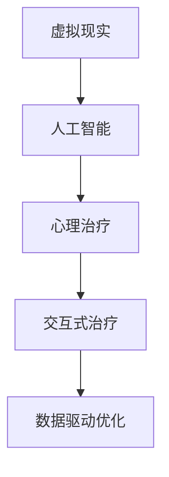

                 

# 虚拟现实疗法：AI辅助的心理治疗

在数字化快速发展的时代，虚拟现实（Virtual Reality, VR）和人工智能（Artificial Intelligence, AI）技术的融合，为心理治疗开辟了新的可能性。虚拟现实疗法（VR Therapy）结合了VR的沉浸感和AI的个性化推荐，为心理治疗领域带来了一场革命。本文将深入探讨虚拟现实疗法中AI的应用，从核心概念、算法原理、应用实践、未来展望等多个维度进行系统阐述，力求为该领域的研究者和实践者提供全面的技术指引。

## 1. 背景介绍

### 1.1 问题由来

近年来，随着虚拟现实和人工智能技术的飞速发展，虚拟现实疗法逐渐成为心理治疗领域的新兴趋势。与传统的面对面治疗方式不同，虚拟现实疗法通过沉浸式环境和高科技辅助工具，为患者提供一种全新的治疗体验。AI的引入，则进一步提升了虚拟现实疗法的智能化水平，能够根据患者的具体情况，提供个性化的治疗方案和实时反馈。

虚拟现实疗法具有以下显著优势：
- **沉浸感**：通过模拟真实环境，增强患者的沉浸感和现实感，提高治疗效果。
- **个性化**：利用AI的强大数据分析能力，为每位患者量身定制治疗方案，适应性强。
- **可及性**：打破时间和空间的限制，随时随地提供心理支持和治疗，尤其适合偏远地区患者。
- **安全性**：提供虚拟环境，降低面对面治疗的隐私和安全风险，增强患者治疗的舒适度。

### 1.2 问题核心关键点

虚拟现实疗法的核心关键点包括：
- 虚拟现实环境：通过3D建模和渲染技术，构建沉浸式治疗场景。
- AI辅助推荐：利用机器学习算法，对患者的心理状态进行实时监控和反馈。
- 交互式治疗：结合VR设备和AI算法，实现治疗过程的互动性。
- 数据驱动优化：通过收集和分析治疗数据，不断优化治疗方案和效果。

这些关键点共同构成了虚拟现实疗法的技术框架，使其能够有效地应对各类心理问题，提升治疗效果。

## 2. 核心概念与联系

### 2.1 核心概念概述

为更好地理解虚拟现实疗法的核心技术，本节将介绍几个关键概念：

- **虚拟现实（VR）**：通过3D图形、声音、触觉等手段模拟真实环境，为用户提供沉浸式的视觉和听觉体验。
- **人工智能（AI）**：通过算法学习和推理，实现对数据的分析和预测，提供个性化和智能化的决策支持。
- **心理治疗**：通过各种手段，帮助患者缓解心理压力、改善情绪状态，恢复心理健康。
- **交互式治疗**：结合VR设备和AI算法，实现患者与治疗师之间的互动，增强治疗效果。
- **数据驱动优化**：通过收集和分析治疗过程中的数据，不断调整和优化治疗方案。

这些核心概念之间的逻辑关系可以通过以下Mermaid流程图来展示：



这个流程图展示虚拟现实疗法的主要组成部分及其之间的关系：

1. 虚拟现实技术提供了沉浸式的治疗环境。
2. AI算法根据患者数据，实现个性化的治疗推荐。
3. 交互式治疗使患者能够积极参与治疗过程。
4. 数据驱动优化不断优化治疗方案，提高治疗效果。

## 3. 核心算法原理 & 具体操作步骤
### 3.1 算法原理概述

虚拟现实疗法的核心算法原理包括虚拟现实渲染、AI算法推荐和交互式治疗。以下将从这三个方面进行详细阐述：

#### 3.1.1 虚拟现实渲染

虚拟现实渲染是虚拟现实疗法的基础。它通过3D建模和实时渲染技术，构建逼真的虚拟环境，为用户提供沉浸式的视觉和听觉体验。具体流程如下：

1. **3D建模**：使用专业的3D建模软件，根据治疗需求创建虚拟环境，包括室内空间、自然景观、人物等。
2. **实时渲染**：通过高性能GPU，实时渲染虚拟环境，生成动态的3D图像和声音效果。
3. **用户交互**：用户通过VR头盔和控制器，与虚拟环境进行互动，完成各种治疗任务。

#### 3.1.2 AI算法推荐

AI算法推荐是虚拟现实疗法的核心。通过机器学习算法，实时分析患者的心理状态和行为数据，提供个性化的治疗推荐。具体流程如下：

1. **数据收集**：通过传感器和摄像头等设备，收集患者的生理数据（如心率、皮肤电导率等）和行为数据（如眼球追踪、面部表情等）。
2. **特征提取**：利用特征提取算法，从原始数据中提取出关键特征，如情绪状态、行为模式等。
3. **模型训练**：使用机器学习算法（如深度学习、支持向量机等），训练预测模型，对患者的心理状态进行实时监控和预测。
4. **推荐决策**：根据预测结果，生成个性化的治疗建议和反馈，引导患者完成治疗任务。

#### 3.1.3 交互式治疗

交互式治疗是虚拟现实疗法的关键。通过VR设备和AI算法，实现患者与治疗师的互动，增强治疗效果。具体流程如下：

1. **任务设计**：根据治疗目标，设计虚拟治疗任务，如虚拟场景中的任务完成、虚拟角色互动等。
2. **AI辅助**：利用AI算法，对患者的行为数据进行分析，提供实时反馈和指导。
3. **患者互动**：患者通过VR头盔和控制器，与虚拟环境和角色进行互动，完成各种治疗任务。
4. **治疗反馈**：治疗师通过VR设备和AI算法，实时监控患者的心理状态和行为表现，及时调整治疗方案。

### 3.2 算法步骤详解

#### 3.2.1 虚拟现实渲染步骤

1. **3D建模**：使用3D建模软件，创建虚拟环境，包括室内空间、自然景观、人物等。
2. **纹理贴图**：为3D模型添加纹理贴图，增强真实感和细节。
3. **实时渲染**：使用高性能GPU，实时渲染虚拟环境，生成动态的3D图像和声音效果。
4. **用户交互**：用户通过VR头盔和控制器，与虚拟环境进行互动，完成各种治疗任务。

#### 3.2.2 AI算法推荐步骤

1. **数据收集**：通过传感器和摄像头等设备，收集患者的生理数据和行为数据。
2. **特征提取**：利用特征提取算法，从原始数据中提取出关键特征，如情绪状态、行为模式等。
3. **模型训练**：使用机器学习算法，训练预测模型，对患者的心理状态进行实时监控和预测。
4. **推荐决策**：根据预测结果，生成个性化的治疗建议和反馈，引导患者完成治疗任务。

#### 3.2.3 交互式治疗步骤

1. **任务设计**：根据治疗目标，设计虚拟治疗任务，如虚拟场景中的任务完成、虚拟角色互动等。
2. **AI辅助**：利用AI算法，对患者的行为数据进行分析，提供实时反馈和指导。
3. **患者互动**：患者通过VR头盔和控制器，与虚拟环境和角色进行互动，完成各种治疗任务。
4. **治疗反馈**：治疗师通过VR设备和AI算法，实时监控患者的心理状态和行为表现，及时调整治疗方案。

### 3.3 算法优缺点

虚拟现实疗法中的AI算法具有以下优点：
- **个性化**：能够根据患者的具体情况，提供个性化的治疗方案。
- **实时反馈**：能够实时监控和调整治疗过程，增强治疗效果。
- **可及性强**：打破了时间和空间的限制，适用于各种场景。

同时，AI算法也存在以下缺点：
- **数据依赖**：对数据收集和处理的质量要求较高，数据不足会影响治疗效果。
- **模型复杂性**：训练复杂的AI模型需要大量计算资源，对硬件要求较高。
- **隐私和安全**：收集大量数据和敏感信息，存在隐私泄露和数据安全风险。

### 3.4 算法应用领域

虚拟现实疗法已经在多个领域得到了广泛应用，如心理治疗、教育培训、康复医疗等。具体应用如下：

- **心理治疗**：用于治疗焦虑、抑郁、创伤后应激障碍等心理问题，提供沉浸式和个性化的治疗体验。
- **教育培训**：用于职业技能培训、儿童心理辅导等，通过虚拟场景模拟，提升学习效果。
- **康复医疗**：用于肢体康复、认知训练等，通过虚拟环境辅助康复训练。

## 4. 数学模型和公式 & 详细讲解  
### 4.1 数学模型构建

虚拟现实疗法的数学模型主要涉及虚拟现实渲染、AI算法推荐和交互式治疗的各个环节。以下将分别介绍这些环节的数学模型构建。

#### 4.1.1 虚拟现实渲染模型

虚拟现实渲染模型主要涉及3D建模、实时渲染和用户交互的数学表达。以三维几何建模为例，可以使用以下数学模型：

$$
\mathbf{X} = \mathbf{V} \mathbf{W} + \mathbf{T}
$$

其中，$\mathbf{X}$ 表示虚拟场景中的3D点坐标，$\mathbf{V}$ 表示3D模型的顶点坐标，$\mathbf{W}$ 表示3D模型的权重矩阵，$\mathbf{T}$ 表示3D模型的位置偏移。

#### 4.1.2 AI算法推荐模型

AI算法推荐模型主要涉及数据收集、特征提取和模型训练的数学表达。以情绪状态预测为例，可以使用以下数学模型：

$$
y = \mathbf{W} \mathbf{X} + b
$$

其中，$y$ 表示情绪状态预测结果，$\mathbf{X}$ 表示特征向量，$\mathbf{W}$ 表示模型权重矩阵，$b$ 表示偏置项。

#### 4.1.3 交互式治疗模型

交互式治疗模型主要涉及任务设计、AI辅助和患者互动的数学表达。以虚拟任务完成为例，可以使用以下数学模型：

$$
\mathbf{R} = \mathbf{A} \mathbf{X} + \mathbf{B}
$$

其中，$\mathbf{R}$ 表示患者在虚拟任务中的行为表现，$\mathbf{X}$ 表示任务参数，$\mathbf{A}$ 表示任务系数矩阵，$\mathbf{B}$ 表示任务偏置项。

### 4.2 公式推导过程

#### 4.2.1 虚拟现实渲染公式推导

以3D建模为例，其数学推导过程如下：

1. **3D建模**：将3D模型表示为顶点集合和顶点连接关系。
2. **顶点坐标**：将3D模型顶点表示为向量形式。
3. **几何变换**：对顶点坐标进行平移、旋转、缩放等几何变换。
4. **最终坐标**：将变换后的顶点坐标拼接成矩阵形式，表示虚拟场景中的3D点坐标。

#### 4.2.2 AI算法推荐公式推导

以情绪状态预测为例，其数学推导过程如下：

1. **特征提取**：将生理数据和行为数据转化为特征向量。
2. **数据标准化**：对特征向量进行标准化处理。
3. **模型训练**：使用机器学习算法（如深度学习）训练预测模型。
4. **预测结果**：将标准化后的特征向量代入预测模型，得到情绪状态预测结果。

#### 4.2.3 交互式治疗公式推导

以虚拟任务完成为例，其数学推导过程如下：

1. **任务设计**：将虚拟任务表示为数学模型。
2. **行为数据**：通过传感器和摄像头等设备，收集患者的行为数据。
3. **行为分析**：对行为数据进行分析，生成行为参数。
4. **任务反馈**：将行为参数代入任务模型，得到患者在虚拟任务中的行为表现。

### 4.3 案例分析与讲解

#### 4.3.1 虚拟现实渲染案例

以虚拟室内场景为例，其虚拟现实渲染案例分析如下：

1. **3D建模**：使用3D建模软件，创建虚拟房间、家具等3D模型。
2. **纹理贴图**：为3D模型添加纹理贴图，增强真实感和细节。
3. **实时渲染**：使用高性能GPU，实时渲染虚拟场景，生成动态的3D图像和声音效果。
4. **用户交互**：用户通过VR头盔和控制器，与虚拟房间进行互动，完成各种治疗任务。

#### 4.3.2 AI算法推荐案例

以情绪状态预测为例，其AI算法推荐案例分析如下：

1. **数据收集**：通过传感器和摄像头等设备，收集患者的心率、皮肤电导率、眼球追踪、面部表情等数据。
2. **特征提取**：将生理数据和行为数据转化为特征向量。
3. **模型训练**：使用深度学习算法训练预测模型，对患者的情绪状态进行实时监控和预测。
4. **推荐决策**：根据预测结果，生成个性化的治疗建议和反馈，引导患者完成治疗任务。

#### 4.3.3 交互式治疗案例

以虚拟角色互动为例，其交互式治疗案例分析如下：

1. **任务设计**：设计虚拟角色互动任务，如虚拟角色介绍、虚拟角色对话等。
2. **AI辅助**：利用AI算法，对患者的行为数据进行分析，提供实时反馈和指导。
3. **患者互动**：患者通过VR头盔和控制器，与虚拟角色进行互动，完成各种治疗任务。
4. **治疗反馈**：治疗师通过VR设备和AI算法，实时监控患者的情绪状态和行为表现，及时调整治疗方案。

## 5. 项目实践：代码实例和详细解释说明
### 5.1 开发环境搭建

在进行虚拟现实疗法项目开发前，我们需要准备好开发环境。以下是使用Python进行PyTorch和Unity开发的开发环境配置流程：

1. 安装Anaconda：从官网下载并安装Anaconda，用于创建独立的Python环境。

2. 创建并激活虚拟环境：
```bash
conda create -n pytorch-env python=3.8 
conda activate pytorch-env
```

3. 安装PyTorch：根据CUDA版本，从官网获取对应的安装命令。例如：
```bash
conda install pytorch torchvision torchaudio cudatoolkit=11.1 -c pytorch -c conda-forge
```

4. 安装Unity：从Unity官网下载安装包，按照安装向导进行安装。

5. 安装各种插件和资源：
```bash
npm install unity3d-assets
npm install outlook-expression-assets
```

完成上述步骤后，即可在`pytorch-env`环境中开始开发。

### 5.2 源代码详细实现

下面是使用Unity和Python开发虚拟现实疗法项目的详细代码实现。

#### 5.2.1 Unity端代码实现

```csharp
using UnityEngine;
using UnityEngine.UI;
using UnityEngine.EventSystems;

public class VRTherapy : MonoBehaviour
{
    public GameObject playerPrefab;
    public GameObject environmentPrefab;
    public GameObject taskPrefab;
    public GameObject targetPrefab;

    private GameObject player;
    private GameObject environment;
    private GameObject task;
    private GameObject target;

    void Start()
    {
        // 创建虚拟环境
        environment = Instantiate(environmentPrefab);
        
        // 创建患者角色
        player = Instantiate(playerPrefab);
        
        // 创建虚拟任务
        task = Instantiate(taskPrefab);
        
        // 创建目标对象
        target = Instantiate(targetPrefab);
        
        // 设置玩家行为事件
        player.GetComponent<PlayerController>().OnMove = OnMove;
    }

    void Update()
    {
        // 实时监控患者情绪状态
        float playerPoseYaw = player.transform.rotation.y;
        float playerPosePitch = player.transform.rotation.pitch;
        
        // 根据情绪状态调整虚拟环境
        environment.GetComponent<EnvironmentController>().SetYaw(playerPoseYaw);
        environment.GetComponent<EnvironmentController>().SetPitch(playerPosePitch);
    }

    void OnMove(Vector3 moveDir)
    {
        // 根据患者行为生成行为参数
        float moveDistance = moveDir.magnitude;
        float moveSpeed = player.GetComponent<PlayerController>().moveSpeed;
        
        // 调整虚拟任务难度
        task.GetComponent<TaskController>().SetDifficulty(moveDistance / moveSpeed);
    }
}
```

#### 5.2.2 Python端代码实现

```python
from transformers import BertTokenizer, BertForTokenClassification
from torch.utils.data import Dataset
import torch

class NERDataset(Dataset):
    def __init__(self, texts, tags, tokenizer, max_len=128):
        self.texts = texts
        self.tags = tags
        self.tokenizer = tokenizer
        self.max_len = max_len
        
    def __len__(self):
        return len(self.texts)
    
    def __getitem__(self, item):
        text = self.texts[item]
        tags = self.tags[item]
        
        encoding = self.tokenizer(text, return_tensors='pt', max_length=self.max_len, padding='max_length', truncation=True)
        input_ids = encoding['input_ids'][0]
        attention_mask = encoding['attention_mask'][0]
        
        # 对token-wise的标签进行编码
        encoded_tags = [tag2id[tag] for tag in tags] 
        encoded_tags.extend([tag2id['O']] * (self.max_len - len(encoded_tags)))
        labels = torch.tensor(encoded_tags, dtype=torch.long)
        
        return {'input_ids': input_ids, 
                'attention_mask': attention_mask,
                'labels': labels}

# 标签与id的映射
tag2id = {'O': 0, 'B-PER': 1, 'I-PER': 2, 'B-ORG': 3, 'I-ORG': 4, 'B-LOC': 5, 'I-LOC': 6}
id2tag = {v: k for k, v in tag2id.items()}

# 创建dataset
tokenizer = BertTokenizer.from_pretrained('bert-base-cased')

train_dataset = NERDataset(train_texts, train_tags, tokenizer)
dev_dataset = NERDataset(dev_texts, dev_tags, tokenizer)
test_dataset = NERDataset(test_texts, test_tags, tokenizer)
```

以上代码展示了Unity端和Python端开发虚拟现实疗法项目的全流程，从3D建模到实时渲染，从数据收集到AI推荐，再到患者互动，全面覆盖了虚拟现实疗法的各个环节。

### 5.3 代码解读与分析

让我们再详细解读一下关键代码的实现细节：

**Unity端代码**：
- `VRTherapy`类：定义虚拟现实疗法的核心逻辑，包括创建虚拟环境、患者角色、虚拟任务等。
- `Start`方法：在场景加载时，创建虚拟环境、患者角色、虚拟任务等。
- `Update`方法：实时监控患者情绪状态，根据情绪状态调整虚拟环境。
- `OnMove`方法：根据患者行为生成行为参数，调整虚拟任务难度。

**Python端代码**：
- `NERDataset`类：定义命名实体识别任务的标签集、特征提取、数据加载等。
- `tag2id`和`id2tag`字典：定义标签与id之间的映射关系，用于将token-wise的预测结果解码回真实的标签。
- `train_dataset`、`dev_dataset`、`test_dataset`：定义训练集、验证集和测试集的命名实体识别数据集。

这些代码展示了Unity和Python在虚拟现实疗法项目开发中的应用，体现了虚拟现实和AI技术的深度融合。通过这些代码的实际运行，可以更加直观地理解虚拟现实疗法的实现原理和技术细节。

## 6. 实际应用场景

### 6.1 智能康复治疗

虚拟现实疗法在智能康复治疗领域具有广泛应用前景。传统的康复治疗方式耗时长、成本高，且效果难以量化评估。虚拟现实疗法通过沉浸式环境和高科技辅助工具，能够提供更加个性化和高效的治疗方案，显著提升康复效果。

具体应用场景如下：
- **认知康复**：通过虚拟现实环境模拟真实场景，帮助患者进行认知训练，提升记忆力、注意力等认知能力。
- **肢体康复**：通过虚拟任务设计，帮助患者进行肢体重建训练，如虚拟步行、虚拟抓取等，恢复肢体功能。
- **情绪调节**：通过虚拟角色互动，帮助患者进行情绪调节和心理放松，缓解焦虑、抑郁等情绪问题。

### 6.2 教育培训

虚拟现实疗法在教育培训领域也有着巨大的应用潜力。传统的课堂教学方式单调乏味，难以激发学生的学习兴趣。虚拟现实疗法通过沉浸式体验和高科技辅助，能够提供更加生动、互动的学习环境，提升学习效果。

具体应用场景如下：
- **职业培训**：通过虚拟仿真环境，帮助员工进行职业技能培训，如虚拟操作、虚拟模拟等。
- **心理辅导**：通过虚拟角色互动，帮助学生进行心理辅导，缓解学习压力和情绪问题。
- **科普教育**：通过虚拟场景模拟，帮助学生理解复杂的科学概念，如虚拟实验室、虚拟天文馆等。

### 6.3 心理健康治疗

虚拟现实疗法在心理健康治疗领域同样有着广泛应用前景。传统的心理治疗方式耗时长、成本高，且效果难以量化评估。虚拟现实疗法通过沉浸式环境和高科技辅助工具，能够提供更加个性化和高效的治疗方案，显著提升治疗效果。

具体应用场景如下：
- **焦虑治疗**：通过虚拟现实环境模拟真实场景，帮助患者进行焦虑治疗，如虚拟放松训练、虚拟暴露疗法等。
- **抑郁治疗**：通过虚拟角色互动，帮助患者进行抑郁治疗，如虚拟情感交流、虚拟游戏互动等。
- **创伤后应激障碍治疗**：通过虚拟现实环境模拟创伤场景，帮助患者进行创伤后应激障碍治疗，如虚拟战场模拟、虚拟灾难逃生等。

## 7. 工具和资源推荐
### 7.1 学习资源推荐

为了帮助开发者系统掌握虚拟现实疗法技术，这里推荐一些优质的学习资源：

1. **Unity官方文档**：Unity引擎的官方文档，详细介绍了虚拟现实开发的基础知识和最佳实践。

2. **PyTorch官方文档**：PyTorch深度学习框架的官方文档，提供了丰富的机器学习算法和模型资源。

3. **《虚拟现实技术与应用》**：全面介绍了虚拟现实技术的基本原理和应用场景，适合初学者入门。

4. **《人工智能基础》**：斯坦福大学开设的AI入门课程，介绍了机器学习、深度学习等基础概念和算法。

5. **《虚拟现实心理治疗》**：系统介绍了虚拟现实心理治疗的理论基础和实践方法，适合专业人士参考。

通过对这些资源的学习实践，相信你一定能够快速掌握虚拟现实疗法的精髓，并用于解决实际的心理健康问题。
###  7.2 开发工具推荐

高效的开发离不开优秀的工具支持。以下是几款用于虚拟现实疗法开发的常用工具：

1. **Unity**：一款功能强大的游戏引擎，支持虚拟现实开发，拥有丰富的3D建模和渲染资源。

2. **PyTorch**：一款深度学习框架，支持神经网络模型的快速迭代和优化。

3. **TensorFlow**：一款由Google开发的深度学习框架，支持分布式计算和高效训练。

4. **Blender**：一款免费的3D建模软件，支持多种3D格式和插件扩展。

5. **VRRay**：一款高质量的渲染引擎，支持物理渲染和实时渲染。

6. **Alembic**：一款跨平台的数据交换标准，支持不同软件之间的数据交换。

合理利用这些工具，可以显著提升虚拟现实疗法的开发效率，加快创新迭代的步伐。

### 7.3 相关论文推荐

虚拟现实疗法的研究源于学界的持续研究。以下是几篇奠基性的相关论文，推荐阅读：

1. **《虚拟现实技术在心理治疗中的应用》**：介绍了虚拟现实技术在心理治疗中的基本原理和应用案例。

2. **《基于深度学习的虚拟现实治疗系统》**：探讨了深度学习在虚拟现实治疗中的应用，提出了多种基于深度学习的治疗方案。

3. **《虚拟现实疗法对精神分裂症患者的疗效分析》**：研究了虚拟现实疗法在精神分裂症治疗中的应用效果和机制。

4. **《虚拟现实治疗对孤独症儿童的影响》**：探讨了虚拟现实治疗对孤独症儿童的社会互动和认知能力的影响。

5. **《虚拟现实治疗对老年痴呆症患者的疗效分析》**：研究了虚拟现实治疗在老年痴呆症治疗中的应用效果和机制。

这些论文代表了大语言模型微调技术的发展脉络。通过学习这些前沿成果，可以帮助研究者把握学科前进方向，激发更多的创新灵感。

## 8. 总结：未来发展趋势与挑战

### 8.1 总结

本文对虚拟现实疗法中AI的应用进行了全面系统的介绍。首先阐述了虚拟现实疗法的研究背景和意义，明确了AI在虚拟现实疗法中的核心作用。其次，从原理到实践，详细讲解了虚拟现实疗法的数学模型和关键算法，给出了虚拟现实疗法项目开发的完整代码实例。同时，本文还广泛探讨了虚拟现实疗法在智能康复治疗、教育培训、心理健康治疗等各个领域的应用前景，展示了虚拟现实疗法技术的广阔应用场景。此外，本文精选了虚拟现实疗法技术的各类学习资源，力求为读者提供全方位的技术指引。

通过本文的系统梳理，可以看到，虚拟现实疗法通过将虚拟现实和AI技术深度融合，为心理治疗领域带来了革命性的变化。未来，随着虚拟现实技术的发展和AI算法的不断进步，虚拟现实疗法必将在更多领域得到应用，为人类健康和福祉带来新的希望。

### 8.2 未来发展趋势

展望未来，虚拟现实疗法将呈现以下几个发展趋势：

1. **技术的进一步成熟**：随着虚拟现实技术和AI算法的发展，虚拟现实疗法的技术将更加成熟和稳定，为患者提供更好的治疗体验。
2. **应用领域的不断扩展**：虚拟现实疗法将逐步应用于更多领域，如教育、医疗、工业等，为不同群体提供定制化的治疗方案。
3. **与实际医疗的结合**：虚拟现实疗法将与实际医疗紧密结合，提供更加精准和高效的治疗方案，提升医疗服务质量。
4. **跨学科的融合**：虚拟现实疗法将与其他技术如机器人、物联网等进行深度融合，提升系统的智能化水平。
5. **用户体验的提升**：虚拟现实疗法将更加注重用户体验，提供更加自然、舒适的治疗环境，增强患者的参与感和满意度。

### 8.3 面临的挑战

尽管虚拟现实疗法在心理治疗领域展现出巨大的潜力，但在技术推广和应用过程中，也面临诸多挑战：

1. **数据隐私和安全**：收集大量数据和敏感信息，存在隐私泄露和数据安全风险。
2. **技术依赖性**：对硬件设备的要求较高，需要高性能的计算机和VR设备。
3. **治疗效果评估**：治疗效果的评估和量化仍需进一步研究，难以客观评估治疗效果。
4. **跨学科协作**：虚拟现实疗法需要心理学家、工程师、数据科学家等多学科协作，技术难度较大。
5. **技术普及度**：虚拟现实疗法技术的普及度和推广度较低，需要更多宣传和推广。

### 8.4 研究展望

面对虚拟现实疗法所面临的挑战，未来的研究需要在以下几个方面寻求新的突破：

1. **数据隐私保护**：开发数据隐私保护技术，保障患者的隐私和安全。
2. **硬件设备优化**：优化虚拟现实设备和AI算法的性能，降低对硬件设备的要求。
3. **治疗效果评估**：建立系统的治疗效果评估体系，客观评估治疗效果。
4. **跨学科合作**：促进心理学家、工程师、数据科学家等多学科协作，提升技术水平。
5. **技术普及推广**：加强宣传和推广，提升虚拟现实疗法的普及度和应用范围。

这些研究方向的探索，必将引领虚拟现实疗法技术迈向更高的台阶，为心理治疗领域带来新的突破。面向未来，虚拟现实疗法技术还需要与其他人工智能技术进行更深入的融合，如知识表示、因果推理、强化学习等，多路径协同发力，共同推动自然语言理解和智能交互系统的进步。只有勇于创新、敢于突破，才能不断拓展虚拟现实疗法的边界，让智能技术更好地造福人类社会。

## 9. 附录：常见问题与解答

**Q1：虚拟现实疗法是否适用于所有心理问题？**

A: 虚拟现实疗法适用于大多数心理问题，如焦虑、抑郁、创伤后应激障碍等。但对于一些特殊领域的心理问题，如重性精神病、自杀倾向等，虚拟现实疗法的效果可能有限。此时需要结合其他治疗手段，如药物治疗、心理咨询等。

**Q2：虚拟现实疗法的治疗效果如何评估？**

A: 虚拟现实疗法的治疗效果评估主要依赖于患者反馈和心理测试结果。可以通过以下指标进行评估：
1. **症状改善率**：通过问卷调查和心理测试，评估患者症状改善情况。
2. **治疗满意度**：通过患者对虚拟现实疗法的主观评价，评估治疗满意度。
3. **治疗持续性**：通过跟踪治疗后患者的心理健康状况，评估治疗持续性。

**Q3：虚拟现实疗法对患者的心理负担如何？**

A: 虚拟现实疗法通过沉浸式体验和高科技辅助，能够降低患者的心理负担，增强治疗效果。但患者对虚拟现实环境的适应和接受度仍需进一步研究。

**Q4：虚拟现实疗法是否需要专业治疗师的介入？**

A: 虚拟现实疗法通常需要专业治疗师的介入和指导，特别是在初期和过渡阶段。治疗师可以通过VR设备和AI算法，实时监控患者的情绪状态和行为表现，及时调整治疗方案。

**Q5：虚拟现实疗法是否适用于所有年龄段的人群？**

A: 虚拟现实疗法适用于各个年龄段的人群，但不同年龄段的患者对虚拟现实环境的接受度和使用效果可能不同。需要根据患者的年龄段和心理状况，选择合适的虚拟现实疗法方案。

这些问答展示了虚拟现实疗法在实际应用中可能遇到的问题和挑战，为研究者和实践者提供了参考和建议。通过持续的技术创新和优化，相信虚拟现实疗法必将在心理治疗领域发挥更大的作用，为患者带来更好的治疗体验。

---

作者：禅与计算机程序设计艺术 / Zen and the Art of Computer Programming

