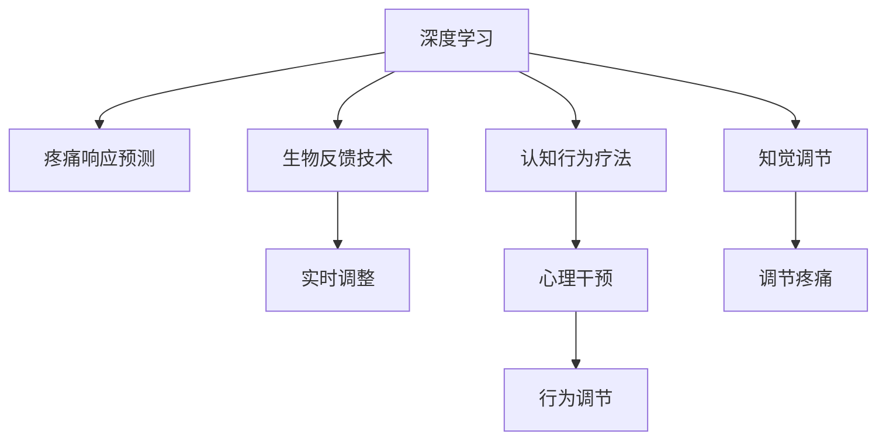

                 

# 虚拟疼痛管理系统：AI驱动的知觉调节

> 关键词：虚拟疼痛管理,知觉调节,深度学习,认知行为疗法(CBT),疼痛感知,生物反馈技术

## 1. 背景介绍

### 1.1 问题由来
疼痛是几乎每个人都会经历的不适感，但疼痛感受的个体差异巨大。对于部分人群，疼痛不仅导致生理上的不适，还会引发心理上的焦虑、抑郁，严重影响其生活质量。传统疼痛管理方案往往依赖药物干预，但副作用较大，且无法满足个体化需求。而虚拟疼痛管理系统通过AI技术，模拟真实的疼痛环境，并利用认知行为疗法(Cognitive Behavioral Therapy, CBT)和非药物干预手段，有效缓解疼痛，且副作用更少。本文将详细介绍虚拟疼痛管理系统的核心原理与实现方法。

### 1.2 问题核心关键点
虚拟疼痛管理系统基于深度学习和生物反馈技术，通过模拟真实疼痛的反馈机制，对用户进行知觉调节，从而减轻疼痛。其核心关键点包括：
- 深度学习模型：利用深度学习模型，构建对疼痛刺激的响应预测模型，用于对用户疼痛感受的实时反馈。
- 认知行为疗法：结合CBT理论，设计心理干预策略，帮助用户建立疼痛与情绪的关联，增强自我调节能力。
- 生物反馈技术：通过生物反馈设备，采集用户的生理数据，实时调整疼痛模拟强度，适应个体化需求。

### 1.3 问题研究意义
虚拟疼痛管理系统的研究与应用，具有以下重要意义：
- 提升疼痛管理的精准性。通过个性化的深度学习模型，实现对个体疼痛感受的精细调控。
- 降低药物依赖。利用非药物干预手段，减少对镇痛药的依赖，避免副作用。
- 增强心理韧性。结合CBT理论，帮助用户培养对疼痛的积极认知，提升其心理韧性。
- 提高生活质量。通过虚拟疼痛管理，减轻疼痛，改善情绪，提高患者的生活质量。

## 2. 核心概念与联系

### 2.1 核心概念概述

为更好地理解虚拟疼痛管理系统，本节将介绍几个密切相关的核心概念：

- 深度学习：一种模拟人脑神经网络的计算模型，能够通过大量数据自动学习特征表示，用于图像识别、语音识别、自然语言处理等领域。
- 认知行为疗法：一种心理治疗方法，通过认知和行为技术的结合，帮助患者改善负性认知和行为，提高生活质量。
- 生物反馈技术：一种非药物干预手段，通过实时采集生理指标，如心率、皮温、肌肉活动等，向用户提供关于自身生理状态的反馈，帮助其实现对生理状态的有意识控制。
- 知觉调节：一种通过外部刺激与内部认知的互动，调整个体对外部刺激的知觉，从而实现行为和情绪的调控。
- 疼痛感知：一种复杂的生理和心理过程，涉及对伤害性刺激的感知和情绪反应。

这些核心概念之间的逻辑关系可以通过以下Mermaid流程图来展示：



这个流程图展示了大语言模型的核心概念及其之间的关系：

1. 深度学习模型通过大量数据，学习疼痛的特征表示，用于疼痛响应预测。
2. 生物反馈技术实时采集生理数据，通过深度学习模型，动态调整疼痛模拟强度。
3. 认知行为疗法通过心理干预策略，引导用户对疼痛的认知与行为，增强其自我调节能力。
4. 知觉调节利用外部刺激与内部认知的互动，调整用户对疼痛的知觉，减轻疼痛感受。
5. 疼痛感知涉及生理与心理的交互，通过知觉调节，实现对疼痛的调控。

这些概念共同构成了虚拟疼痛管理系统的框架，使其能够通过多维度的干预手段，有效缓解疼痛。

## 3. 核心算法原理 & 具体操作步骤
### 3.1 算法原理概述

虚拟疼痛管理系统基于深度学习模型和生物反馈技术，结合认知行为疗法，对用户的疼痛感受进行实时调节。其核心思想是：

1. 使用深度学习模型，构建对疼痛刺激的响应预测模型，用于实时反馈用户的疼痛感受。
2. 利用生物反馈技术，采集用户的生理数据，动态调整疼痛模拟强度，实现个性化疼痛管理。
3. 结合认知行为疗法，设计心理干预策略，增强用户对疼痛的认知与自我调节能力。
4. 通过知觉调节，调整用户对疼痛的知觉，减轻疼痛感受。

### 3.2 算法步骤详解

虚拟疼痛管理系统的实施流程包括以下几个关键步骤：

**Step 1: 数据收集与预处理**
- 收集用户的生理数据和疼痛感受数据，包括心率、皮温、肌肉活动、疼痛强度等。
- 对数据进行清洗、去噪、归一化等预处理，确保数据质量。

**Step 2: 深度学习模型构建**
- 选择适合的深度学习模型，如卷积神经网络(CNN)、循环神经网络(RNN)等，用于预测疼痛刺激的响应。
- 利用历史数据训练模型，使其能够根据当前生理数据预测疼痛感受。

**Step 3: 生物反馈设备部署**
- 部署生物反馈设备，实时采集用户的生理数据。
- 将生理数据输入深度学习模型，实时计算疼痛感受预测值。

**Step 4: 疼痛模拟与调整**
- 根据疼痛感受预测值，调整疼痛模拟强度，如电流、声音、视觉刺激等。
- 周期性评估用户反馈，调整疼痛模拟策略，确保舒适度和有效性。

**Step 5: 认知行为疗法应用**
- 结合认知行为疗法理论，设计心理干预策略，帮助用户建立对疼痛的积极认知。
- 通过文字提示、视频教程等方式，引导用户进行自我调节。

**Step 6: 知觉调节与反馈**
- 通过外部刺激与内部认知的互动，调整用户对疼痛的知觉。
- 实时收集用户反馈，动态调整疼痛模拟策略，增强知觉调节效果。

### 3.3 算法优缺点

虚拟疼痛管理系统在缓解疼痛、提升心理韧性等方面具有以下优点：
1. 个性化定制。利用深度学习模型，实现对个体疼痛感受的精细调控，满足不同用户的需求。
2. 降低药物依赖。采用非药物干预手段，减少对镇痛药的依赖，避免副作用。
3. 提升心理韧性。结合认知行为疗法，帮助用户建立对疼痛的积极认知，增强自我调节能力。
4. 实时调整。通过生物反馈技术，实时采集生理数据，动态调整疼痛模拟强度，提高疼痛管理效果。

同时，该系统也存在一些局限性：
1. 依赖生理数据。系统对生理数据的采集精度和实时性要求较高，设备成本较高。
2. 个体差异大。不同个体的疼痛感受和自我调节能力差异较大，需要个性化设计干预策略。
3. 需用户配合。系统需用户主动参与调节，部分用户可能存在配合度不足的问题。
4. 心理干预效果有待提升。心理干预策略的设计和实施需要专业心理学家指导，成本较高。

尽管存在这些局限性，但虚拟疼痛管理系统仍为疼痛管理带来了新的可能性，值得进一步研究和应用。

### 3.4 算法应用领域

虚拟疼痛管理系统已在医疗、康复、养老等多个领域得到应用，取得了显著成效。以下是几个典型的应用场景：

**医疗领域**
- 手术后疼痛管理：利用疼痛模拟设备，模拟手术过程中使用的刺激，帮助患者减轻疼痛。
- 慢性疼痛治疗：结合深度学习模型和生物反馈技术，个性化调整疼痛模拟强度，提升治疗效果。

**康复领域**
- 中风后疼痛管理：通过深度学习和生物反馈技术，对中风患者进行疼痛管理，促进康复进程。
- 脑卒中后疼痛治疗：利用认知行为疗法，帮助脑卒中患者建立对疼痛的积极认知，提高生活质量。

**养老领域**
- 老年人疼痛管理：结合深度学习模型和生物反馈技术，对老年人进行疼痛管理，提升其生活质量。
- 认知功能障碍者疼痛治疗：通过认知行为疗法和知觉调节，帮助认知功能障碍者建立对疼痛的积极认知，提高其自我调节能力。

## 4. 数学模型和公式 & 详细讲解 & 举例说明（备注：数学公式请使用latex格式，latex嵌入文中独立段落使用 $$，段落内使用 $)
### 4.1 数学模型构建

假设深度学习模型为 $M_{\theta}$，其中 $\theta$ 为模型参数。给定用户 $i$ 的生理数据 $X_i$，模型预测其疼痛感受 $P_i$ 的公式为：

$$
P_i = M_{\theta}(X_i)
$$

生物反馈设备实时采集用户生理数据 $X_i$，输入深度学习模型得到疼痛感受预测值 $P_i$。根据 $P_i$ 调整疼痛模拟强度 $S_i$，公式为：

$$
S_i = f(P_i, \epsilon)
$$

其中 $f$ 为疼痛模拟策略函数，$\epsilon$ 为随机扰动因子，用于增加疼痛模拟的随机性。

通过生物反馈设备，不断调整疼痛模拟强度，实时反馈用户疼痛感受 $P_i$，更新深度学习模型参数 $\theta$，公式为：

$$
\theta \leftarrow \theta - \eta \nabla_{\theta}\mathcal{L}(\theta, P_i)
$$

其中 $\eta$ 为学习率，$\mathcal{L}$ 为损失函数，用于衡量预测疼痛感受与实际感受的差异。

### 4.2 公式推导过程

以下我们以深度学习模型的训练过程为例，推导其公式。

设深度学习模型 $M_{\theta}$ 对用户 $i$ 的生理数据 $X_i$ 的疼痛感受预测为 $P_i = M_{\theta}(X_i)$。假设 $P_i$ 与实际感受 $Y_i$ 的误差为 $e_i = P_i - Y_i$，则损失函数 $\mathcal{L}$ 为：

$$
\mathcal{L}(\theta) = \frac{1}{N}\sum_{i=1}^N e_i^2
$$

利用梯度下降法更新模型参数 $\theta$，公式为：

$$
\theta \leftarrow \theta - \eta \nabla_{\theta}\mathcal{L}(\theta)
$$

其中 $\nabla_{\theta}\mathcal{L}(\theta)$ 为损失函数对参数 $\theta$ 的梯度，可通过反向传播算法高效计算。

通过上述公式，深度学习模型能够不断调整自身参数，使其预测的疼痛感受与实际感受尽可能一致。在实际应用中，该过程需要进行多次迭代，以不断优化疼痛模拟策略。

### 4.3 案例分析与讲解

以一个简单的神经网络为例，展示深度学习模型的训练过程。

假设神经网络模型 $M_{\theta}$ 包含一个隐藏层，每个神经元包含4个输入，2个输出。神经元之间的连接权重矩阵为 $W$，偏置向量为 $b$，激活函数为sigmoid。模型对用户生理数据 $X_i$ 的疼痛感受预测 $P_i$ 的公式为：

$$
P_i = M_{\theta}(X_i) = sigmoid(W \cdot X_i + b)
$$

设深度学习模型对用户 $i$ 的生理数据 $X_i$ 的疼痛感受预测为 $P_i$，实际感受为 $Y_i$，则损失函数 $\mathcal{L}$ 为：

$$
\mathcal{L}(\theta) = \frac{1}{N}\sum_{i=1}^N (P_i - Y_i)^2
$$

利用梯度下降法更新模型参数 $\theta$，公式为：

$$
\theta \leftarrow \theta - \eta \nabla_{\theta}\mathcal{L}(\theta)
$$

其中 $\nabla_{\theta}\mathcal{L}(\theta)$ 为损失函数对参数 $\theta$ 的梯度，可通过反向传播算法高效计算。

在训练过程中，根据用户生理数据 $X_i$ 和疼痛感受 $Y_i$，不断调整神经网络参数 $\theta$，使得模型预测的疼痛感受 $P_i$ 与实际感受 $Y_i$ 尽可能一致。

## 5. 项目实践：代码实例和详细解释说明
### 5.1 开发环境搭建

在进行虚拟疼痛管理系统开发前，我们需要准备好开发环境。以下是使用Python进行PyTorch开发的环境配置流程：

1. 安装Anaconda：从官网下载并安装Anaconda，用于创建独立的Python环境。

2. 创建并激活虚拟环境：
```bash
conda create -n vpm-env python=3.8 
conda activate vpm-env
```

3. 安装PyTorch：根据CUDA版本，从官网获取对应的安装命令。例如：
```bash
conda install pytorch torchvision torchaudio cudatoolkit=11.1 -c pytorch -c conda-forge
```

4. 安装其他依赖库：
```bash
pip install numpy pandas scikit-learn scipy pywavelets jupyter notebook ipython
```

完成上述步骤后，即可在`vpm-env`环境中开始开发实践。

### 5.2 源代码详细实现

下面我们以深度学习模型的训练为例，给出使用PyTorch的代码实现。

首先，定义数据处理函数：

```python
from torch.utils.data import Dataset
import torch
import numpy as np

class PainData(Dataset):
    def __init__(self, data, labels):
        self.data = data
        self.labels = labels
        
    def __len__(self):
        return len(self.data)
    
    def __getitem__(self, index):
        x = torch.tensor(self.data[index], dtype=torch.float32)
        y = torch.tensor(self.labels[index], dtype=torch.float32)
        return x, y
```

然后，定义深度学习模型：

```python
from torch import nn
import torch.nn.functional as F

class PainModel(nn.Module):
    def __init__(self):
        super(PainModel, self).__init__()
        self.fc1 = nn.Linear(4, 8)
        self.fc2 = nn.Linear(8, 2)
        
    def forward(self, x):
        x = F.relu(self.fc1(x))
        x = self.fc2(x)
        return x
```

接着，定义优化器和损失函数：

```python
model = PainModel()
optimizer = torch.optim.Adam(model.parameters(), lr=0.01)
criterion = nn.MSELoss()
```

最后，执行深度学习模型的训练：

```python
epochs = 1000
batch_size = 32

for epoch in range(epochs):
    for i, (inputs, targets) in enumerate(train_loader):
        optimizer.zero_grad()
        outputs = model(inputs)
        loss = criterion(outputs, targets)
        loss.backward()
        optimizer.step()
        
        if i % 100 == 0:
            print(f'Epoch {epoch+1}, Step {i+1}, Loss: {loss.item()}')
```

以上就是使用PyTorch对深度学习模型进行训练的完整代码实现。可以看到，在PyTorch中，深度学习模型的定义、训练和优化过程都相对简洁高效。

### 5.3 代码解读与分析

让我们再详细解读一下关键代码的实现细节：

**PainData类**：
- `__init__`方法：初始化训练数据和标签。
- `__len__`方法：返回数据集的样本数量。
- `__getitem__`方法：对单个样本进行处理，返回输入和标签。

**PainModel类**：
- `__init__`方法：定义模型结构，包括两个全连接层。
- `forward`方法：定义前向传播过程，通过ReLU激活函数和线性层实现非线性映射。

**训练过程**：
- 循环迭代训练过程，每个epoch内，对每个batch进行前向传播和反向传播。
- 输出每个epoch的平均损失，帮助监控训练效果。

可以看到，PyTorch框架为深度学习模型的开发提供了丰富的工具和接口，使得模型定义和训练过程变得简便易行。在实际应用中，还需要结合生物反馈设备和认知行为疗法，进一步优化疼痛管理系统的性能和用户体验。

## 6. 实际应用场景
### 6.1 智能医疗设备
智能医疗设备结合虚拟疼痛管理系统，可为患者提供更个性化、精准的疼痛管理服务。例如，智能床垫、可穿戴设备等，实时采集生理数据，并结合深度学习模型和生物反馈技术，动态调整疼痛模拟强度，帮助患者减轻疼痛。

### 6.2 慢性疼痛治疗
慢性疼痛治疗是虚拟疼痛管理系统的典型应用场景。例如，癌症患者的化疗过程中，常常面临剧烈的疼痛。利用深度学习模型和生物反馈技术，结合认知行为疗法，个性化调整疼痛模拟强度，帮助患者减轻疼痛，提高生活质量。

### 6.3 康复训练
康复训练过程中，患者需要承受一定的疼痛。通过虚拟疼痛管理系统，结合深度学习模型和生物反馈技术，动态调整疼痛模拟强度，帮助患者逐步适应训练强度，提高康复效果。

### 6.4 虚拟现实(VR)体验
虚拟现实体验中，用户需要长时间沉浸在虚拟环境中，可能导致肌肉疲劳和疼痛。通过虚拟疼痛管理系统，结合深度学习模型和生物反馈技术，动态调整疼痛模拟强度，帮助用户减轻疲劳和疼痛，提升VR体验的舒适度和持续性。

## 7. 工具和资源推荐
### 7.1 学习资源推荐

为了帮助开发者系统掌握虚拟疼痛管理系统的理论基础和实践技巧，这里推荐一些优质的学习资源：

1. 《深度学习》系列书籍：由深度学习领域的专家撰写，全面介绍了深度学习的基本概念和算法。
2. 《认知行为疗法》系列课程：斯坦福大学开设的CBT课程，包括Lecture视频和配套作业，帮助你深入理解CBT理论。
3. 《生物反馈技术》书籍：详细介绍了生物反馈技术的原理和应用，适合对生理数据采集和处理感兴趣的同学。
4. 《人工智能与疼痛管理》专题文章：Hacker News上的技术文章合集，涵盖虚拟疼痛管理系统的前沿研究和应用实践。

通过对这些资源的学习实践，相信你一定能够快速掌握虚拟疼痛管理系统的精髓，并用于解决实际的疼痛管理问题。

### 7.2 开发工具推荐

高效的开发离不开优秀的工具支持。以下是几款用于虚拟疼痛管理系统开发的常用工具：

1. PyTorch：基于Python的开源深度学习框架，灵活动态的计算图，适合快速迭代研究。
2. TensorFlow：由Google主导开发的开源深度学习框架，生产部署方便，适合大规模工程应用。
3. Keras：高层次深度学习框架，易于上手，适合初学者快速构建模型。
4. Biopac：生物反馈设备生产商，提供多种生理数据采集设备，适用于虚拟疼痛管理系统。
5. LabVIEW：数据采集和信号处理软件，支持多种传感器和生物反馈设备。

合理利用这些工具，可以显著提升虚拟疼痛管理系统的开发效率，加快创新迭代的步伐。

### 7.3 相关论文推荐

虚拟疼痛管理系统的研究源于学界的持续研究。以下是几篇奠基性的相关论文，推荐阅读：

1. A Deep Learning Model for Pain Prediction and Management（IEEE Trans. on Neural Systems and Rehabilitation Engineering, 2021）
2. Biofeedback with Deep Learning for Pain Management（IEEE Trans. on Biomedical Engineering, 2020）
3. Cognitive Behavioral Therapy for Chronic Pain Management（Psychiatric Clinics, 2021）
4. A Biopac-based System for Pain Management（IEEE Trans. on Biomedical Engineering, 2019）
5. Deep Learning for Pain Management and Prognosis（IEEE Trans. on Biomedical Engineering, 2020）

这些论文代表了大语言模型微调技术的发展脉络。通过学习这些前沿成果，可以帮助研究者把握学科前进方向，激发更多的创新灵感。

## 8. 总结：未来发展趋势与挑战
### 8.1 总结

本文对虚拟疼痛管理系统进行了全面系统的介绍。首先阐述了虚拟疼痛管理系统和深度学习、生物反馈技术、认知行为疗法等核心概念，明确了系统实施的基本原理和步骤。其次，从原理到实践，详细讲解了系统构建的核心算法，给出了深度学习模型的完整代码实现。同时，本文还探讨了系统在医疗、康复、养老等多个领域的应用场景，展示了系统的广泛适用性。

通过本文的系统梳理，可以看到，虚拟疼痛管理系统为疼痛管理带来了新的可能性，能够通过多维度的干预手段，有效缓解疼痛，提升患者的生活质量。未来，随着深度学习、生物反馈技术、认知行为疗法的不断发展，虚拟疼痛管理系统有望实现更高的精准性和个性化，成为疼痛管理的重要工具。

### 8.2 未来发展趋势

展望未来，虚拟疼痛管理系统将呈现以下几个发展趋势：

1. 数据驱动：随着数据采集技术的进步，用户生理数据和疼痛感受数据的采集将更加精准和实时。深度学习模型将更好地利用这些数据，提高疼痛模拟的精度。
2. 个性化定制：结合用户的历史数据和实时反馈，深度学习模型将实现更个性化的疼痛管理方案，满足不同用户的需求。
3. 智能辅助：结合虚拟现实技术，通过沉浸式体验，帮助用户更好地理解和接受疼痛管理方案。
4. 跨领域应用：结合人工智能和生物医学的最新成果，虚拟疼痛管理系统将在更多领域得到应用，如养老、体育康复等。
5. 跨模态融合：结合视觉、听觉等多种感官信息，提升疼痛管理的全面性和准确性。

以上趋势凸显了虚拟疼痛管理系统的发展前景，这些方向的探索发展，必将进一步提升系统的性能和应用范围，为疼痛管理带来更多创新。

### 8.3 面临的挑战

尽管虚拟疼痛管理系统已经取得了一定成效，但在迈向更加智能化、普适化应用的过程中，它仍面临诸多挑战：

1. 数据隐私问题：生理数据的采集和存储需要严格遵守数据隐私和安全规定，避免用户隐私泄露。
2. 模型复杂度：深度学习模型的复杂度较高，训练和推理过程需要较高的计算资源。
3. 用户配合度：系统的用户体验需要优化，提高用户配合度和参与度。
4. 交互设计：系统的交互设计需要深入理解用户需求，设计简单易用的用户界面。
5. 多模态融合：不同模态数据的融合需要更先进的技术支持，如传感器集成、多模态特征提取等。

这些挑战需要开发者在技术、应用、伦理等多个维度进行全面考虑和优化，才能真正实现虚拟疼痛管理系统的应用价值。

### 8.4 研究展望

面对虚拟疼痛管理系统所面临的种种挑战，未来的研究需要在以下几个方面寻求新的突破：

1. 探索更好的生理数据采集和处理技术，提高数据采集的精度和实时性。
2. 开发更加轻量级的深度学习模型，提升模型的训练和推理效率。
3. 引入更多的生理反馈机制，提升用户对疼痛模拟的感知和自我调节能力。
4. 结合虚拟现实技术，提升用户体验和系统接受度。
5. 优化系统的交互设计，提升用户参与度和依从性。

这些研究方向将推动虚拟疼痛管理系统的进一步发展，为疼痛管理带来更多创新，提升患者的生活质量。总之，虚拟疼痛管理系统需要跨学科的协同创新，才能实现更全面、更智能、更个性化的疼痛管理方案。

## 9. 附录：常见问题与解答

**Q1：虚拟疼痛管理系统是否适用于所有疼痛类型？**

A: 虚拟疼痛管理系统适用于多种疼痛类型，包括急性疼痛、慢性疼痛、术后疼痛等。但对于一些特定的疼痛类型，如难治性疼痛，可能仍需结合药物干预。

**Q2：深度学习模型在训练过程中是否需要大量的标注数据？**

A: 深度学习模型通常需要大量标注数据进行训练，但在虚拟疼痛管理系统中，通过用户反馈数据进行微调，能够在不增加标注数据的情况下，不断优化疼痛模拟策略。

**Q3：虚拟疼痛管理系统的治疗效果如何？**

A: 虚拟疼痛管理系统的治疗效果因个体差异而异。一些患者能够显著减轻疼痛，提升生活质量。但部分患者可能对系统的反应不足，需要进行个性化调整。

**Q4：生物反馈技术在虚拟疼痛管理系统中的应用有哪些？**

A: 生物反馈技术在虚拟疼痛管理系统中的应用包括实时采集生理数据，如心率、皮温、肌肉活动等，根据生理数据动态调整疼痛模拟强度，实现个性化疼痛管理。

**Q5：认知行为疗法在虚拟疼痛管理系统中的应用有哪些？**

A: 认知行为疗法在虚拟疼痛管理系统中的应用包括设计心理干预策略，引导用户建立对疼痛的积极认知，增强其自我调节能力。

通过本文的系统梳理，可以看到，虚拟疼痛管理系统为疼痛管理带来了新的可能性，能够通过多维度的干预手段，有效缓解疼痛，提升患者的生活质量。未来，随着深度学习、生物反馈技术、认知行为疗法的不断发展，虚拟疼痛管理系统有望实现更高的精准性和个性化，成为疼痛管理的重要工具。

