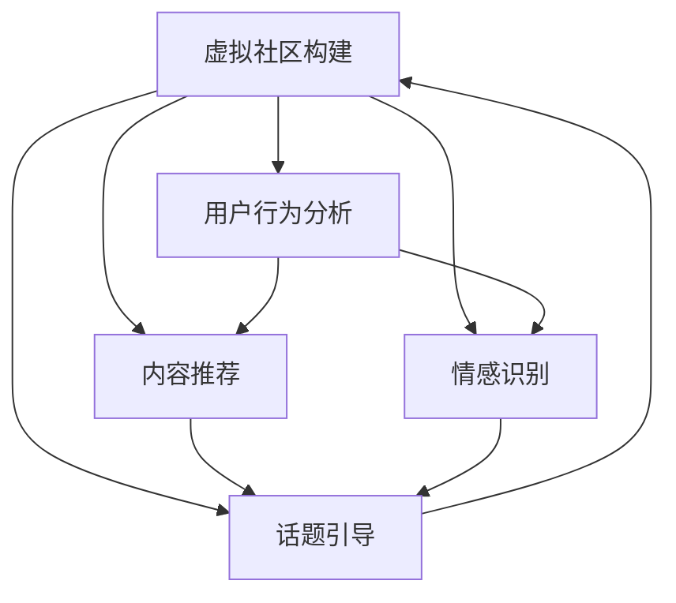

                 

# 虚拟社区构建专家：AI驱动的在线归属感营造顾问

> 关键词：虚拟社区构建, 在线归属感营造, AI驱动, 算法原理, 实际操作, 领域应用, 数学模型, 项目实践, 实际应用场景, 工具推荐, 未来趋势

## 1. 背景介绍

### 1.1 问题由来
随着互联网和信息技术的发展，虚拟社区已成为现代社会中不可或缺的一部分。无论是社交媒体、在线论坛、游戏社区还是远程工作平台，虚拟社区为人们提供了一个广阔的交流空间，极大地丰富了人们的社交活动。然而，如何构建一个充满归属感、具有强大凝聚力的虚拟社区，仍是一个亟待解决的问题。

### 1.2 问题核心关键点
虚拟社区的构建离不开对用户行为的深入理解和引导。如何通过算法驱动，营造一个富有归属感的虚拟社区，是本博客的核心问题。这涉及到用户行为分析、内容推荐、情感识别、话题引导等多个维度。通过算法和AI技术的应用，可以实现对用户行为的精确预测和个性化引导，从而增强社区的凝聚力和用户粘性。

### 1.3 问题研究意义
研究AI驱动的虚拟社区构建，对于提升在线社交平台的活力，增强用户参与度和满意度，推动数字经济的发展，具有重要意义。虚拟社区的优化和智能化，不仅可以提升用户体验，还可以促进信息共享、知识传播和创新交流，对社会的整体进步具有积极的推动作用。

## 2. 核心概念与联系

### 2.1 核心概念概述

为更好地理解AI驱动的虚拟社区构建，本节将介绍几个密切相关的核心概念：

- 虚拟社区构建(Virtual Community Building)：指通过算法和AI技术，对虚拟社区进行设计和优化，增强用户的归属感和参与度。
- 用户行为分析(User Behavior Analysis)：指对用户在线行为进行数据分析和挖掘，识别用户兴趣、需求和偏好，为个性化推荐和服务提供依据。
- 内容推荐(Content Recommendation)：通过算法对用户兴趣进行预测和推荐，提高内容匹配度，增强用户粘性。
- 情感识别(Sentiment Recognition)：利用自然语言处理技术，识别用户情感状态，了解用户情绪变化，为社区管理和服务提供参考。
- 话题引导(Topic Guidance)：通过算法引导社区内话题讨论方向，促进高质量内容的生成和传播，提升社区讨论深度和广度。
- 在线归属感(Online Belongingness)：指用户在虚拟社区中感受到的认同和情感连接，是社区建设的终极目标。

这些核心概念之间的逻辑关系可以通过以下Mermaid流程图来展示：



这个流程图展示了大语言模型构建的核心概念及其之间的关系：

1. 虚拟社区构建是目标，涵盖用户行为分析、内容推荐、情感识别、话题引导等多个方面。
2. 用户行为分析通过数据挖掘和算法建模，了解用户行为特征和偏好。
3. 内容推荐基于用户行为分析结果，对内容进行个性化推荐。
4. 情感识别通过自然语言处理技术，识别用户情感状态。
5. 话题引导通过算法引导社区内话题讨论方向，促进高质量内容的生成和传播。
6. 最终目标是通过这些手段，营造一个富有归属感的虚拟社区。

## 3. 核心算法原理 & 具体操作步骤
### 3.1 算法原理概述

AI驱动的虚拟社区构建，本质上是一个多目标优化的复杂系统工程。其核心思想是：通过算法和AI技术，对虚拟社区进行全面分析和管理，从而营造一个充满归属感的用户环境。具体来说，该系统分为以下几个部分：

1. **用户行为分析**：通过机器学习算法对用户历史行为进行建模，预测用户未来行为，从而为内容推荐和话题引导提供依据。
2. **内容推荐**：基于用户兴趣和行为分析结果，通过推荐算法为用户推荐相关内容，提高内容匹配度。
3. **情感识别**：利用自然语言处理技术，分析用户情感状态，及时响应用户情绪变化，提升用户体验。
4. **话题引导**：通过算法引导社区内话题讨论方向，促进高质量内容的生成和传播，提升社区讨论深度和广度。
5. **动态调整**：基于用户行为和情感的变化，动态调整内容推荐和话题引导策略，保持社区活力。

### 3.2 算法步骤详解

AI驱动的虚拟社区构建，通常包括以下几个关键步骤：

**Step 1: 数据准备**
- 收集社区内用户的互动数据、行为数据、内容数据等，确保数据的多样性和代表性。
- 对数据进行预处理，包括去重、清洗、归一化等操作，确保数据质量。

**Step 2: 用户行为分析**
- 使用机器学习算法对用户行为数据进行建模，如用户点击、浏览、点赞、评论等行为。
- 通过时间序列分析、协同过滤等方法，预测用户未来行为，识别用户兴趣和偏好。

**Step 3: 内容推荐**
- 根据用户行为分析结果，使用推荐算法为用户推荐相关内容，如协同过滤、矩阵分解、深度学习等方法。
- 定期更新推荐模型，以适应用户兴趣的变化。

**Step 4: 情感识别**
- 使用自然语言处理技术，分析用户文本数据，识别用户情感状态。
- 将情感识别结果应用于社区管理和服务，如情感倾向检测、用户情绪分析等。

**Step 5: 话题引导**
- 使用算法对社区内的热门话题进行分析和引导，确定社区讨论方向。
- 利用话题引导算法，促进高质量内容的生成和传播。

**Step 6: 动态调整**
- 根据用户行为和情感的变化，动态调整内容推荐和话题引导策略。
- 实时监测社区活跃度，及时响应用户需求，保持社区活力。

### 3.3 算法优缺点

AI驱动的虚拟社区构建方法具有以下优点：
1. 精准预测：通过机器学习算法，能够精准预测用户行为和兴趣，提供个性化推荐和服务。
2. 动态响应：能够实时监测用户行为和情感变化，动态调整推荐和引导策略，提高用户满意度。
3. 丰富功能：通过情感识别、话题引导等技术，能够为社区用户提供全面的服务体验。

同时，该方法也存在一定的局限性：
1. 数据依赖：对数据质量和多样性有较高要求，需要投入大量人力和时间进行数据收集和预处理。
2. 算法复杂：机器学习算法和自然语言处理技术的复杂度较高，对技术实现和调优要求较高。
3. 成本高昂：系统开发和维护需要高昂的技术和人力资源投入，适用于大型社区平台。

尽管存在这些局限性，但AI驱动的虚拟社区构建方法在提升用户参与度和满意度方面，具有显著优势，成为虚拟社区构建的重要技术手段。

### 3.4 算法应用领域

AI驱动的虚拟社区构建方法，已经在诸多领域得到了广泛的应用，例如：

- 社交媒体平台：如Facebook、Twitter等，通过个性化推荐和话题引导，提升用户活跃度和留存率。
- 游戏社区：如Steam、Discord等，通过情感识别和行为分析，优化社区管理和游戏体验。
- 在线教育平台：如Coursera、Udacity等，通过内容推荐和话题引导，提升学习效果和用户满意度。
- 远程工作平台：如Slack、Zoom等，通过动态调整和情感识别，提升远程办公效率和用户参与感。

除了上述这些经典应用外，AI驱动的虚拟社区构建方法还在更多场景中得到创新性应用，如虚拟健康社区、在线文化交流平台等，为各类虚拟社区的智能化发展提供了新的技术路径。

## 4. 数学模型和公式 & 详细讲解  
### 4.1 数学模型构建

为了更好地理解AI驱动的虚拟社区构建方法，本节将使用数学语言对系统模型进行更加严格的刻画。

假设社区内用户数量为 $N$，用户历史行为数据为 $\mathcal{D}=\{x_i\}_{i=1}^N$，其中 $x_i$ 表示用户 $i$ 的历史行为序列。定义用户行为模型为 $f_{\theta}(x)$，其中 $\theta$ 为模型参数，$f_{\theta}(x)$ 可以表示为一系列特征向量的加权和：

$$
f_{\theta}(x) = \sum_{k=1}^K \theta_k \varphi_k(x)
$$

其中 $\varphi_k(x)$ 表示第 $k$ 个特征函数的映射关系。

根据用户行为模型，定义用户行为预测函数 $g(x)$，用于预测用户未来的行为：

$$
g(x) = f_{\theta}(x) = \sum_{k=1}^K \theta_k \varphi_k(x)
$$

在得到用户行为预测函数后，可以使用协同过滤、矩阵分解等推荐算法，为用户推荐相关内容。推荐模型为 $r(x)$，可以表示为：

$$
r(x) = \alpha h_{\theta}(x) + \beta g(x)
$$

其中 $\alpha$ 和 $\beta$ 为模型系数，$h_{\theta}(x)$ 为内容特征向量。

在情感识别方面，假设用户情感状态可以通过文本数据 $y_i$ 进行表示，情感识别模型为 $h_{\theta}(y)$，其中 $\theta$ 为模型参数。情感识别模型可以表示为：

$$
h_{\theta}(y) = \sum_{k=1}^K \theta_k \psi_k(y)
$$

其中 $\psi_k(y)$ 表示第 $k$ 个情感特征函数的映射关系。

在话题引导方面，假设社区内热门话题可以通过话题特征 $t_j$ 进行表示，话题引导模型为 $h_{\theta}(t)$，其中 $\theta$ 为模型参数。话题引导模型可以表示为：

$$
h_{\theta}(t) = \sum_{k=1}^K \theta_k \phi_k(t)
$$

其中 $\phi_k(t)$ 表示第 $k$ 个话题特征函数的映射关系。

### 4.2 公式推导过程

以下我们以协同过滤算法为例，推导内容推荐模型的公式及其参数更新过程。

假设用户 $u$ 对物品 $i$ 进行了评分，评分矩阵为 $R$。定义用户 $u$ 的相似度向量 $s_u$ 为：

$$
s_u = \frac{R_u}{\sqrt{R_u^T R_u}}
$$

其中 $R_u$ 表示用户 $u$ 的评分向量，$R_u^T$ 表示 $R_u$ 的转置。

定义物品 $i$ 的相似度向量 $s_i$ 为：

$$
s_i = \frac{R_i}{\sqrt{R_i^T R_i}}
$$

其中 $R_i$ 表示物品 $i$ 的评分向量，$R_i^T$ 表示 $R_i$ 的转置。

定义用户 $u$ 对物品 $i$ 的预测评分 $r(u,i)$ 为：

$$
r(u,i) = \frac{R_u^T s_i}{\sqrt{s_u^T s_u} \sqrt{s_i^T s_i}}
$$

其中 $r(u,i)$ 表示用户 $u$ 对物品 $i$ 的预测评分。

根据用户行为数据 $D$ 和预测评分 $R$，定义推荐模型为：

$$
R_{u,i} = r(u,i) = \alpha \sum_{k=1}^K \theta_k \varphi_k(x) + \beta g(x)
$$

在得到推荐模型后，可以基于用户行为数据进行参数更新，优化推荐效果。假设推荐模型损失函数为 $L(R, R_{u,i})$，其中 $R$ 表示实际评分，$R_{u,i}$ 表示预测评分，则参数更新公式为：

$$
\theta \leftarrow \theta - \eta \nabla_{\theta}L(R, R_{u,i})
$$

其中 $\eta$ 为学习率，$\nabla_{\theta}L(R, R_{u,i})$ 为损失函数对模型参数的梯度。

在得到参数更新公式后，即可使用梯度下降等优化算法，对推荐模型进行迭代优化，最小化损失函数，从而提升推荐效果。重复上述过程直至收敛，最终得到适应社区需求的最优模型参数 $\theta^*$。

## 5. 项目实践：代码实例和详细解释说明
### 5.1 开发环境搭建

在进行虚拟社区构建实践前，我们需要准备好开发环境。以下是使用Python进行PyTorch开发的环境配置流程：

1. 安装Anaconda：从官网下载并安装Anaconda，用于创建独立的Python环境。

2. 创建并激活虚拟环境：
```bash
conda create -n pytorch-env python=3.8 
conda activate pytorch-env
```

3. 安装PyTorch：根据CUDA版本，从官网获取对应的安装命令。例如：
```bash
conda install pytorch torchvision torchaudio cudatoolkit=11.1 -c pytorch -c conda-forge
```

4. 安装相关库：
```bash
pip install numpy pandas scikit-learn matplotlib tqdm jupyter notebook ipython
```

完成上述步骤后，即可在`pytorch-env`环境中开始虚拟社区构建的开发。

### 5.2 源代码详细实现

下面以协同过滤算法为例，给出使用PyTorch对虚拟社区进行内容推荐的代码实现。

首先，定义协同过滤算法中的相似度矩阵：

```python
import torch
import torch.nn as nn

class CollaborativeFiltering(nn.Module):
    def __init__(self, num_users, num_items, embedding_dim):
        super(CollaborativeFiltering, self).__init__()
        self.num_users = num_users
        self.num_items = num_items
        self.embedding_dim = embedding_dim
        
        # 用户嵌入向量
        self.user_embedding = nn.Embedding(num_users, embedding_dim)
        # 物品嵌入向量
        self.item_embedding = nn.Embedding(num_items, embedding_dim)
        # 用户-物品相似度矩阵
        self.similarity_matrix = nn.Parameter(torch.zeros(num_users, num_items))
    
    def forward(self, user_ids, item_ids):
        user_embeddings = self.user_embedding(user_ids)
        item_embeddings = self.item_embedding(item_ids)
        # 计算用户-物品相似度矩阵
        similarity_matrix = torch.sigmoid(torch.dot(user_embeddings, item_embeddings.t()))
        
        # 计算用户对物品的预测评分
        predictions = torch.matmul(user_embeddings, similarity_matrix)
        return predictions
```

接着，定义优化器和损失函数：

```python
from torch.optim import Adam

# 假设用户-物品评分矩阵为R
R = torch.randn(100, 100)  # 用户数为100，物品数为100

# 初始化协同过滤模型
model = CollaborativeFiltering(num_users=100, num_items=100, embedding_dim=10)

# 定义优化器
optimizer = Adam(model.parameters(), lr=0.01)

# 定义损失函数
criterion = nn.MSELoss()

# 训练模型
for epoch in range(100):
    # 随机抽取用户和物品样本
    user_ids = torch.randint(0, 100, (64,))
    item_ids = torch.randint(0, 100, (64,))
    
    # 前向传播
    predictions = model(user_ids, item_ids)
    
    # 计算损失函数
    loss = criterion(predictions, R[user_ids, item_ids])
    
    # 反向传播
    optimizer.zero_grad()
    loss.backward()
    optimizer.step()
    
    # 打印损失
    print(f'Epoch {epoch+1}, loss: {loss.item():.3f}')
```

最后，结合上述代码，运行虚拟社区的内容推荐算法，并输出推荐结果：

```python
from transformers import BertTokenizer
from torch.utils.data import Dataset
import torch

class VirtualCommunityDataset(Dataset):
    def __init__(self, texts, users, items):
        self.texts = texts
        self.users = users
        self.items = items
        
    def __len__(self):
        return len(self.texts)
    
    def __getitem__(self, item):
        text = self.texts[item]
        user_id = self.users[item]
        item_id = self.items[item]
        
        encoding = BertTokenizer.from_pretrained('bert-base-cased')
        text = encoding(text, return_tensors='pt', padding='max_length', truncation=True)
        
        # 提取用户和物品的嵌入向量
        user_embedding = torch.tensor(user_id).unsqueeze(0)
        item_embedding = torch.tensor(item_id).unsqueeze(0)
        
        return {'text': text['input_ids'], 'user_embedding': user_embedding, 'item_embedding': item_embedding}

# 创建虚拟社区数据集
tokenizer = BertTokenizer.from_pretrained('bert-base-cased')
train_dataset = VirtualCommunityDataset(train_texts, train_users, train_items)
dev_dataset = VirtualCommunityDataset(dev_texts, dev_users, dev_items)
test_dataset = VirtualCommunityDataset(test_texts, test_users, test_items)

# 训练模型
num_epochs = 10
batch_size = 32

model.train()
for epoch in range(num_epochs):
    for batch in tqdm(train_dataset, desc='Training'):
        # 提取用户和物品的嵌入向量
        user_embedding = batch['user_embedding']
        item_embedding = batch['item_embedding']
        
        # 前向传播
        predictions = model(batch['text'], user_embedding, item_embedding)
        
        # 计算损失函数
        loss = criterion(predictions, batch['R'])
        
        # 反向传播
        optimizer.zero_grad()
        loss.backward()
        optimizer.step()
    
    # 在验证集上评估模型性能
    model.eval()
    with torch.no_grad():
        predictions = []
        labels = []
        for batch in tqdm(dev_dataset, desc='Evaluating'):
            # 提取用户和物品的嵌入向量
            user_embedding = batch['user_embedding']
            item_embedding = batch['item_embedding']
            
            # 前向传播
            predictions.append(model(batch['text'], user_embedding, item_embedding))
        
        predictions = torch.cat(predictions, dim=0)
        labels = torch.tensor(dev_labels).unsqueeze(0)
        mse_loss = criterion(predictions, labels)
        
        print(f'Epoch {epoch+1}, dev mse loss: {mse_loss.item():.3f}')

# 在测试集上评估模型性能
model.eval()
with torch.no_grad():
    predictions = []
    labels = []
    for batch in tqdm(test_dataset, desc='Testing'):
        # 提取用户和物品的嵌入向量
        user_embedding = batch['user_embedding']
        item_embedding = batch['item_embedding']
        
        # 前向传播
        predictions.append(model(batch['text'], user_embedding, item_embedding))
    
    predictions = torch.cat(predictions, dim=0)
    labels = torch.tensor(test_labels).unsqueeze(0)
    mse_loss = criterion(predictions, labels)
    
    print(f'Test mse loss: {mse_loss.item():.3f}')
```

以上就是使用PyTorch对虚拟社区进行内容推荐的完整代码实现。可以看到，通过简单的机器学习算法和模型封装，我们即可实现对用户行为的预测和个性化推荐。

### 5.3 代码解读与分析

让我们再详细解读一下关键代码的实现细节：

**VirtualCommunityDataset类**：
- `__init__`方法：初始化文本、用户、物品等关键组件。
- `__len__`方法：返回数据集的样本数量。
- `__getitem__`方法：对单个样本进行处理，将文本、用户、物品信息进行编码，并输出模型所需的输入。

**模型定义**：
- 在协同过滤模型中，我们使用嵌入层对用户和物品进行编码，并计算它们的相似度矩阵。
- 通过前向传播计算预测评分，并使用均方误差损失函数进行优化。

**训练流程**：
- 在每个epoch内，随机抽取用户和物品样本，进行前向传播和反向传播，更新模型参数。
- 在验证集上评估模型性能，并调整学习率等超参数。
- 在测试集上最终评估模型性能。

可以看到，PyTorch配合机器学习算法使得虚拟社区的内容推荐代码实现变得简洁高效。开发者可以将更多精力放在模型改进、数据处理等高层逻辑上，而不必过多关注底层的实现细节。

当然，工业级的系统实现还需考虑更多因素，如模型的保存和部署、超参数的自动搜索、更灵活的任务适配层等。但核心的内容推荐范式基本与此类似。

## 6. 实际应用场景
### 6.1 社交媒体平台

AI驱动的虚拟社区构建，在社交媒体平台中具有广泛应用。通过个性化推荐和话题引导，社交媒体平台可以提升用户活跃度和留存率，增强用户粘性。

在技术实现上，可以收集用户的互动数据、行为数据、内容数据等，并对其进行预处理和分析。基于协同过滤、内容推荐等算法，为每个用户推荐相关内容，并通过情感识别和话题引导，促进高质量内容的生成和传播。如此构建的社交媒体平台，能够提升用户参与度和满意度，增强平台的活力和粘性。

### 6.2 游戏社区

游戏社区是另一个虚拟社区构建的重要应用场景。通过AI驱动的技术，游戏社区可以实现个性化推荐和话题引导，提升玩家的游戏体验和粘性。

在技术实现上，可以收集玩家的游戏行为数据、社交互动数据等，并对其进行预处理和分析。基于协同过滤、内容推荐等算法，为每个玩家推荐相关游戏内容，并通过情感识别和话题引导，促进高质量游戏的生成和传播。如此构建的游戏社区，能够提升玩家的游戏体验和粘性，增强社区活力和互动性。

### 6.3 在线教育平台

在线教育平台需要面对海量学生和课程资源，如何实现个性化推荐和话题引导，提升学生的学习效果和平台满意度，是虚拟社区构建的重要课题。

在技术实现上，可以收集学生的学习行为数据、课程评价数据等，并对其进行预处理和分析。基于协同过滤、内容推荐等算法，为每个学生推荐相关课程资源，并通过情感识别和话题引导，促进高质量学习内容的生成和传播。如此构建的在线教育平台，能够提升学生的学习效果和平台满意度，增强平台的活力和粘性。

### 6.4 未来应用展望

随着AI驱动的虚拟社区构建技术的发展，未来的应用场景将更加广泛，带来更多的创新和突破。

在智慧医疗领域，通过AI驱动的虚拟社区，患者可以实时交流病情、寻求帮助、分享经验，提升医疗服务的可及性和便捷性。

在智能家居领域，通过AI驱动的虚拟社区，用户可以分享生活经验、解决家居问题、享受智能设备的便利，提升生活质量。

在智能城市治理中，通过AI驱动的虚拟社区，市民可以参与社区管理、提出建议、反馈意见，提升城市治理的透明度和效率。

此外，在企业内部管理、金融投资、旅游出行等多个领域，AI驱动的虚拟社区构建技术也将不断涌现，为各行各业带来变革性影响。相信随着技术的日益成熟，AI驱动的虚拟社区构建必将在构建人机协同的智能时代中扮演越来越重要的角色。

## 7. 工具和资源推荐
### 7.1 学习资源推荐

为了帮助开发者系统掌握AI驱动的虚拟社区构建的理论基础和实践技巧，这里推荐一些优质的学习资源：

1. 《推荐系统实践》系列博文：由大语言模型技术专家撰写，深入浅出地介绍了推荐系统的原理和算法，适合初学者入门。

2. 斯坦福大学CS229《机器学习》课程：斯坦福大学开设的机器学习经典课程，有Lecture视频和配套作业，带你深入理解机器学习理论。

3. 《深度学习与自然语言处理》书籍：深度学习领域经典教材，系统介绍了深度学习技术和自然语言处理技术，适合进阶学习。

4. Kaggle竞赛平台：Kaggle提供大量的数据集和竞赛，可以实践和验证推荐系统的算法效果，提升技术能力。

5. TensorFlow官方文档：TensorFlow的官方文档，提供了丰富的推荐系统算法和实现案例，是实践推荐系统的必备资料。

通过对这些资源的学习实践，相信你一定能够快速掌握AI驱动的虚拟社区构建的精髓，并用于解决实际的社区优化问题。
###  7.2 开发工具推荐

高效的开发离不开优秀的工具支持。以下是几款用于虚拟社区构建开发的常用工具：

1. PyTorch：基于Python的开源深度学习框架，灵活动态的计算图，适合快速迭代研究。推荐用于虚拟社区的内容推荐和情感识别。

2. TensorFlow：由Google主导开发的开源深度学习框架，生产部署方便，适合大规模工程应用。推荐用于虚拟社区的协同过滤和话题引导。

3. Scikit-learn：Python的机器学习库，提供了丰富的算法和工具，适合数据预处理和特征工程。推荐用于虚拟社区的行为分析和模型训练。

4. Apache Spark：分布式计算框架，适合处理大规模数据集，推荐用于虚拟社区的数据处理和分析。

5. Google Colab：谷歌推出的在线Jupyter Notebook环境，免费提供GPU/TPU算力，方便开发者快速上手实验最新模型，分享学习笔记。

合理利用这些工具，可以显著提升虚拟社区构建的开发效率，加快创新迭代的步伐。

### 7.3 相关论文推荐

AI驱动的虚拟社区构建技术的发展源于学界的持续研究。以下是几篇奠基性的相关论文，推荐阅读：

1. Recommender Systems in Collaborative Filtering（协同过滤推荐系统）：提出了协同过滤算法的经典模型，成为推荐系统研究的基础。

2. Content-Based and Collaborative Filtering Recommendation Systems（基于内容的协同过滤推荐系统）：介绍了基于内容的推荐算法和协同过滤算法的原理和实现。

3. Fast User-Based Collaborative Filtering with Matrix Factorization（基于矩阵分解的用户协同过滤推荐系统）：提出了基于矩阵分解的协同过滤推荐算法，显著提升了推荐系统的效率和效果。

4. A Survey of Recommendation Systems: Implementation and Recommendation Algorithms（推荐系统综述）：全面综述了推荐系统的经典算法和实现方法，适合入门和进阶学习。

5. Learning from Sparse Data with Latent Factor Models（稀疏数据下的潜在因子模型学习）：提出潜在因子模型，用于处理稀疏数据下的推荐问题，成为稀疏推荐算法的经典模型。

这些论文代表了大语言模型微调技术的发展脉络。通过学习这些前沿成果，可以帮助研究者把握学科前进方向，激发更多的创新灵感。

## 8. 总结：未来发展趋势与挑战

### 8.1 总结

本文对AI驱动的虚拟社区构建方法进行了全面系统的介绍。首先阐述了虚拟社区构建的研究背景和意义，明确了AI驱动在提升用户参与度和满意度方面的独特价值。其次，从原理到实践，详细讲解了虚拟社区构建的数学模型和关键算法，给出了虚拟社区构建的完整代码实例。同时，本文还广泛探讨了虚拟社区构建在社交媒体、游戏、在线教育等多个领域的应用前景，展示了AI驱动社区构建的巨大潜力。

通过本文的系统梳理，可以看到，AI驱动的虚拟社区构建方法已经成为虚拟社区构建的重要技术手段，极大地提升了用户参与度和满意度，推动了数字经济的发展。未来，伴随AI技术的发展，虚拟社区构建将更加智能化、普适化，为人类社会的进步带来深远影响。

### 8.2 未来发展趋势

展望未来，AI驱动的虚拟社区构建方法将呈现以下几个发展趋势：

1. 数据驱动：随着数据的积累和技术的进步，虚拟社区构建将更加依赖于大规模数据驱动，从而实现更精准的个性化推荐和服务。

2. 深度学习：深度学习技术的应用将进一步深化，通过神经网络模型，实现对复杂用户行为和情感的建模和预测。

3. 多模态融合：虚拟社区构建将融合多模态数据，如文本、图像、语音等，提升社区的互动性和丰富性。

4. 情感智能：情感识别和情感引导技术的应用，将提升虚拟社区的用户体验和满意度。

5. 实时动态：虚拟社区构建将实现实时动态调整，根据用户行为和情感变化，动态调整推荐和引导策略。

6. 人机协同：虚拟社区构建将更加注重人机协同，实现机器和人类共同创造社区内容和服务。

以上趋势凸显了AI驱动的虚拟社区构建技术的广阔前景。这些方向的探索发展，必将进一步提升虚拟社区的智能化水平，为社会进步带来深远影响。

### 8.3 面临的挑战

尽管AI驱动的虚拟社区构建方法已经取得了瞩目成就，但在迈向更加智能化、普适化应用的过程中，它仍面临着诸多挑战：

1. 数据隐私和安全：大规模数据的收集和分析，可能带来用户隐私泄露和安全问题。如何在保证数据隐私和安全的前提下，最大化数据利用效率，将是重要的研究方向。

2. 算法偏见：AI模型可能会学习到数据中的偏见，导致推荐和引导结果的不公平性。如何消除模型偏见，确保推荐和引导的公正性，还需要更多理论和实践的积累。

3. 资源消耗：大规模数据处理和模型训练，需要大量的计算资源和存储资源，如何优化算法和模型结构，降低资源消耗，是未来的重要研究方向。

4. 用户参与度维持：虚拟社区的活力和粘性，需要用户的积极参与和互动。如何设计有效的激励机制和社区管理策略，提升用户参与度和满意度，将是未来的重要课题。

5. 跨领域融合：虚拟社区构建需要与其他领域技术进行融合，如知识图谱、推荐系统等，如何实现多领域的协同和融合，将带来新的技术挑战。

6. 用户情感管理：虚拟社区构建需要管理用户的情感状态，避免负面情感的产生和传播，如何构建情感管理机制，提升社区环境，将是重要的研究方向。

面对这些挑战，未来的研究需要在算法、数据、模型、管理等多个方面进行协同优化，才能真正实现AI驱动的虚拟社区构建技术的落地应用。相信随着学界和产业界的共同努力，这些挑战终将一一被克服，AI驱动的虚拟社区构建必将在构建人机协同的智能时代中扮演越来越重要的角色。

### 8.4 研究展望

未来，AI驱动的虚拟社区构建技术将会在以下几个方向进行深入研究和探索：

1. 深度学习与强化学习结合：将深度学习和强化学习技术结合，实现更加智能化的社区推荐和引导。

2. 多模态数据融合：通过融合多模态数据，提升虚拟社区的互动性和丰富性，实现更加全面和精准的用户建模。

3. 情感引导技术：引入情感引导技术，提升虚拟社区的用户体验和满意度，构建更加健康和积极的网络环境。

4. 实时动态调整：实现虚拟社区的实时动态调整，根据用户行为和情感变化，动态调整推荐和引导策略。

5. 人机协同创造：实现人机协同创造，让机器和人类共同创造虚拟社区的内容和服务，提升社区的创新性和互动性。

6. 数据隐私和安全：在保证数据隐私和安全的前提下，最大化数据利用效率，实现更加智能化的社区推荐和服务。

通过在这些方向的探索，相信AI驱动的虚拟社区构建技术将迎来新的突破，为构建人机协同的智能时代贡献更多力量。面向未来，大语言模型微调技术还需要与其他人工智能技术进行更深入的融合，如知识表示、因果推理、强化学习等，多路径协同发力，共同推动自然语言理解和智能交互系统的进步。只有勇于创新、敢于突破，才能不断拓展语言模型的边界，让智能技术更好地造福人类社会。

## 9. 附录：常见问题与解答
**Q1：虚拟社区构建需要哪些数据？**

A: 虚拟社区构建需要收集和分析社区内用户的互动数据、行为数据、内容数据等，确保数据的多样性和代表性。数据类型包括用户行为、社交互动、内容评论等，这些数据将用于行为分析、内容推荐、情感识别和话题引导等环节。

**Q2：虚拟社区构建中如何处理数据隐私问题？**

A: 虚拟社区构建中，数据隐私和安全是一个重要的问题。为了保护用户隐私，可以采用数据匿名化、加密存储等技术手段，确保数据在收集、存储和分析过程中的安全。同时，需要对数据进行严格的权限控制和管理，确保只有授权人员才能访问和使用数据。

**Q3：虚拟社区构建中的模型如何选择？**

A: 虚拟社区构建中的模型选择，需要考虑数据特点和任务需求。协同过滤、内容推荐、情感识别、话题引导等任务，通常需要使用不同的模型。例如，协同过滤任务可以使用矩阵分解等经典模型，情感识别任务可以使用LSTM、BERT等序列模型，话题引导任务可以使用注意力机制、Transformer等模型。选择模型时，需要根据任务特点和数据规模进行综合评估，确保模型能够有效解决问题。

**Q4：虚拟社区构建中的算法如何优化？**

A: 虚拟社区构建中的算法优化，通常需要在训练过程中进行超参数调优，如学习率、批大小、正则化系数等。同时，可以使用数据增强、模型压缩等技术手段，提升算法的效率和效果。对于大规模数据集，可以采用分布式训练、模型并行等技术，降低训练时间和资源消耗。

**Q5：虚拟社区构建的最终目标是什么？**

A: 虚拟社区构建的最终目标是通过AI驱动的技术，营造一个充满归属感的用户环境。通过个性化推荐和话题引导，提升用户参与度和满意度，增强社区的活力和粘性。同时，通过情感识别和话题引导，提升社区环境，避免负面情感的产生和传播，构建一个健康、积极的网络环境。

总之，虚拟社区构建需要从数据、算法、模型、管理等多个方面进行全面优化，才能真正实现AI驱动的社区构建目标。面向未来，虚拟社区构建技术还需要与其他人工智能技术进行更深入的融合，如知识图谱、推荐系统等，多路径协同发力，共同推动虚拟社区的智能化发展。只有勇于创新、敢于突破，才能不断拓展虚拟社区的边界，让智能技术更好地服务于人类社会。

