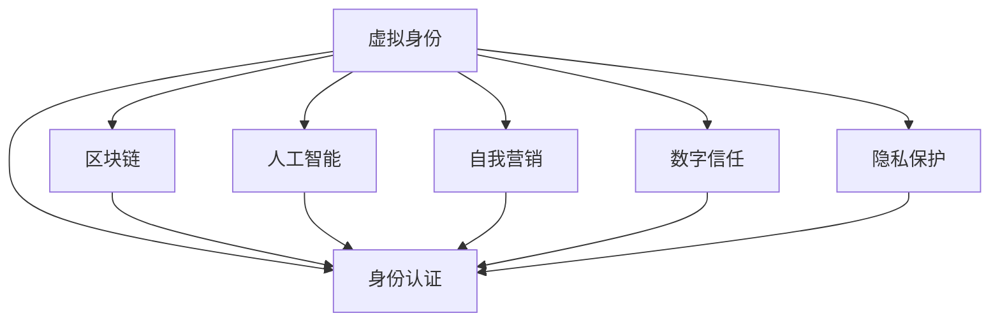

                 

# 虚拟身份市场：AI时代的自我营销

> 关键词：虚拟身份,身份认证,区块链,人工智能,自我营销,数字信任,隐私保护,技术融合

## 1. 背景介绍

### 1.1 问题由来
在数字化的现代社会，个人和企业越来越依赖于网络平台进行身份认证和信任建立。传统的中心化身份验证方式存在单点故障、隐私泄露等风险。而随着区块链和人工智能技术的崛起，去中心化的虚拟身份系统逐渐成为新一代身份认证手段。虚拟身份市场正成为AI时代自我营销的重要领域。

### 1.2 问题核心关键点
虚拟身份市场聚焦于通过AI技术构建去中心化的身份验证和信任系统。其核心在于：
- 利用区块链技术保证身份信息的不可篡改性和透明性。
- 结合人工智能算法实现身份验证的高效性和准确性。
- 通过智能合约保障交易安全，提供自动化身份认证和信任建立服务。
- 促进个人和企业进行数字化身份的自我营销和隐私保护。

### 1.3 问题研究意义
研究虚拟身份市场对于拓展AI技术在身份验证和安全领域的落地应用，提升个人和企业的网络安全性和隐私保护，具有重要意义：
- 降低身份认证成本，提升认证效率。
- 加强隐私保护，减少数据泄露风险。
- 构建信任基础，促进数字经济的发展。
- 促进AI技术的创新和产业应用。

## 2. 核心概念与联系

### 2.1 核心概念概述

为更好地理解虚拟身份市场，本节将介绍几个密切相关的核心概念：

- 虚拟身份(Virtual Identity)：指通过AI技术生成的、去中心化的数字化身份，具备与现实身份等价的权利和义务。
- 身份认证(Identity Verification)：指对数字身份的真实性、合法性进行验证的过程，确保身份信息的准确性和不可篡改性。
- 区块链(Blockchain)：一种去中心化的分布式账本技术，通过加密算法保障数据安全性和透明性。
- 人工智能(AI)：涵盖机器学习、深度学习等技术，通过模型训练实现数据的智能分析和决策。
- 自我营销(Self-Promotion)：指个人或企业通过数字化手段展示自身价值和品牌形象的过程。
- 数字信任(Digital Trust)：指在网络环境中，通过智能合约等技术构建的信任关系。
- 隐私保护(Privacy Protection)：指在数据收集和使用过程中，保护个人隐私权利的行为。

这些核心概念之间的逻辑关系可以通过以下Mermaid流程图来展示：



这个流程图展示了一些核心概念及其之间的关系：

1. 虚拟身份通过身份认证验证其真实性和合法性。
2. 区块链通过加密技术保障身份信息的透明性和不可篡改性。
3. 人工智能通过模型训练提升身份验证的准确性和高效性。
4. 自我营销利用AI生成的虚拟身份，展示自身价值。
5. 数字信任基于区块链和AI技术，构建可靠的网络环境。
6. 隐私保护通过AI和区块链技术，保障个人数据安全。

这些概念共同构成了虚拟身份市场的基础框架，为其技术实现和应用提供了理论支撑。

## 3. 核心算法原理 & 具体操作步骤
### 3.1 算法原理概述

虚拟身份市场基于区块链和AI技术，通过构建去中心化的身份认证和信任系统，实现身份验证的高效性和准确性。其核心算法原理包括：

- 身份生成：使用AI模型生成虚拟身份，包括数字身份和元数据。
- 身份验证：利用区块链技术存储和验证身份信息，确保身份的真实性和不可篡改性。
- 身份交换：通过智能合约实现身份信息的自动化交换和认证，保障交易安全。
- 隐私保护：通过加密算法和访问控制技术，保护身份信息不被滥用。

### 3.2 算法步骤详解

以下是构建虚拟身份市场的核心算法步骤：

**Step 1: 准备基础组件**
- 设计虚拟身份的元数据结构，包括姓名、身份证明、数字签名等。
- 选择合适的AI模型，如GAN、VAE等，生成虚拟身份的数字图片和文本信息。
- 部署区块链网络，创建智能合约，实现身份验证和交换功能。

**Step 2: 身份生成**
- 收集用户或企业的基本信息，如姓名、地址、证件等。
- 通过AI模型生成虚拟身份的数字图片和文本信息，并与元数据绑定。
- 使用区块链技术将虚拟身份和元数据存储在区块链上，生成唯一的数字签名。

**Step 3: 身份验证**
- 用户或企业提交虚拟身份信息到区块链网络，请求身份验证。
- 智能合约检查身份信息的完整性和数字签名，确保信息的真实性和不可篡改性。
- 验证通过后，智能合约自动颁发身份证明，用户或企业可以在网络上进行身份认证。

**Step 4: 身份交换**
- 用户或企业提出身份交换请求，包括提供和接受虚拟身份。
- 智能合约自动进行身份信息的交换和认证，生成交换记录。
- 验证交换后的身份信息，确保交易安全。

**Step 5: 隐私保护**
- 使用加密算法对虚拟身份信息进行保护，防止泄露。
- 设置访问控制策略，限制身份信息的访问权限。
- 通过审计日志监控身份信息的访问和使用情况，确保合规性。

### 3.3 算法优缺点

虚拟身份市场的算法具有以下优点：
1. 去中心化：避免单点故障和中心化风险，增强系统的可靠性。
2. 安全性高：利用区块链和AI技术，保障身份信息的透明性和不可篡改性。
3. 高效准确：通过AI模型生成和验证身份，提高认证的准确性和效率。
4. 自动化交易：智能合约实现身份交换和认证的自动化，减少人工干预。
5. 隐私保护：通过加密和访问控制，保护用户和企业的数据隐私。

但该算法也存在以下缺点：
1. 技术复杂：涉及区块链、AI等多种技术，实施难度较大。
2. 初始成本高：需要搭建区块链网络和部署AI模型，前期投入较大。
3. 智能合约漏洞：虽然提高了安全性，但智能合约本身仍存在漏洞风险。
4. 依赖技术：系统对AI和区块链技术的依赖较大，技术更新速度较快。
5. 用户信任度：虽然去中心化提升了信任，但用户对新技术的接受度仍需提升。

尽管存在这些局限性，虚拟身份市场的技术实现仍具有重要价值，为AI技术在身份验证和安全领域的应用提供了新的方向。

### 3.4 算法应用领域

虚拟身份市场在多个领域具有广泛的应用前景，例如：

- 个人身份认证：如社交媒体、电子商务等场景下的身份验证。
- 企业身份认证：如供应链管理、政府招投标等场景下的身份交换。
- 金融身份认证：如银行开户、在线支付等场景下的身份验证。
- 医疗身份认证：如在线挂号、电子病历等场景下的身份验证。
- 智能合约：如数字身份交易、认证等场景下的自动化操作。
- 数据隐私保护：如个人信息保护、数据匿名化等场景下的隐私保护。

此外，虚拟身份市场还可以应用于数字信任构建、区块链应用开发、隐私计算等多个领域，为AI技术的广泛应用提供了新的途径。

## 4. 数学模型和公式 & 详细讲解 & 举例说明

### 4.1 数学模型构建

在虚拟身份市场中，身份生成和验证过程涉及大量的数据处理和模型训练。下面以虚拟身份生成为例，介绍其数学模型和公式。

假设生成虚拟身份的AI模型为$f$，输入为$x$，输出为$y$。则虚拟身份生成的数学模型可以表示为：

$$
y = f(x)
$$

其中$x$表示用户的个人信息，$y$表示生成的虚拟身份信息。模型的训练目标是最小化预测输出$y$与实际输出$y^*$之间的差异：

$$
\min_{\theta} \mathcal{L}(f_\theta(x),y^*)
$$

其中$\mathcal{L}$为损失函数，$f_\theta$表示参数为$\theta$的模型。

### 4.2 公式推导过程

以GAN模型为例，其生成虚拟身份的公式推导过程如下：

**Step 1: 生成器和判别器定义**
- 生成器$G$：将输入噪声$z$转换为虚拟身份信息$y_G$。
- 判别器$D$：判断输入$y_G$是否为真实身份信息$y_R$。

**Step 2: 生成器和判别器训练**
- 生成器损失函数：$L_G = -\mathbb{E}_{z}\log D(G(z))$
- 判别器损失函数：$L_D = -\mathbb{E}_{y_R}\log D(y_R) - \mathbb{E}_{z}\log(1-D(G(z)))$

**Step 3: 生成器训练**
- 最小化生成器损失函数，使得$G(z)$生成的虚拟身份尽可能逼近真实身份信息$y_R$。

**Step 4: 判别器训练**
- 最小化判别器损失函数，使得$D(y_R)$尽可能逼近1，$D(G(z))$尽可能逼近0。

**Step 5: 总损失函数**
- 总损失函数$\mathcal{L} = L_G + \lambda L_D$，其中$\lambda$为生成器损失与判别器损失的权重系数。

通过以上步骤，可以训练出一个生成虚拟身份的GAN模型。该模型可以在不泄露用户信息的情况下，生成逼真的虚拟身份，满足身份验证和隐私保护的需求。

### 4.3 案例分析与讲解

假设某电子商务平台需要实现用户身份验证，平台选择使用GAN模型生成虚拟身份，其数学模型和公式推导过程如下：

**Step 1: 生成器和判别器定义**
- 生成器$G$：将输入噪声$z$转换为虚拟身份信息$y_G$。
- 判别器$D$：判断输入$y_G$是否为真实身份信息$y_R$。

**Step 2: 生成器和判别器训练**
- 生成器损失函数：$L_G = -\mathbb{E}_{z}\log D(G(z))$
- 判别器损失函数：$L_D = -\mathbb{E}_{y_R}\log D(y_R) - \mathbb{E}_{z}\log(1-D(G(z)))$

**Step 3: 生成器训练**
- 最小化生成器损失函数，使得$G(z)$生成的虚拟身份尽可能逼近真实身份信息$y_R$。

**Step 4: 判别器训练**
- 最小化判别器损失函数，使得$D(y_R)$尽可能逼近1，$D(G(z))$尽可能逼近0。

**Step 5: 总损失函数**
- 总损失函数$\mathcal{L} = L_G + \lambda L_D$，其中$\lambda$为生成器损失与判别器损失的权重系数。

通过以上步骤，可以训练出一个生成虚拟身份的GAN模型。平台使用该模型生成虚拟身份，提交到区块链网络进行验证和交换，从而实现高效、安全的身份认证和隐私保护。

## 5. 项目实践：代码实例和详细解释说明
### 5.1 开发环境搭建

在进行虚拟身份市场开发前，我们需要准备好开发环境。以下是使用Python进行TensorFlow开发的环境配置流程：

1. 安装Anaconda：从官网下载并安装Anaconda，用于创建独立的Python环境。

2. 创建并激活虚拟环境：
```bash
conda create -n tf-env python=3.8 
conda activate tf-env
```

3. 安装TensorFlow：根据CUDA版本，从官网获取对应的安装命令。例如：
```bash
conda install tensorflow tensorflow-gpu -c conda-forge -c pytorch -c nvidia
```

4. 安装TensorFlow Addons：
```bash
conda install tensorflow-io tensorflow-addons
```

5. 安装各类工具包：
```bash
pip install numpy pandas scikit-learn matplotlib tqdm jupyter notebook ipython
```

完成上述步骤后，即可在`tf-env`环境中开始虚拟身份市场开发。

### 5.2 源代码详细实现

下面我们以基于GAN的虚拟身份生成为例，给出使用TensorFlow进行虚拟身份市场开发的PyTorch代码实现。

首先，定义GAN模型的结构：

```python
import tensorflow as tf
from tensorflow.keras import layers

class Generator(tf.keras.Model):
    def __init__(self):
        super(Generator, self).__init__()
        self.dense1 = layers.Dense(256, activation='relu')
        self.dense2 = layers.Dense(512, activation='relu')
        self.dense3 = layers.Dense(256, activation='sigmoid')

    def call(self, inputs):
        x = self.dense1(inputs)
        x = self.dense2(x)
        x = self.dense3(x)
        return x

class Discriminator(tf.keras.Model):
    def __init__(self):
        super(Discriminator, self).__init__()
        self.dense1 = layers.Dense(256, activation='relu')
        self.dense2 = layers.Dense(512, activation='relu')
        self.dense3 = layers.Dense(1, activation='sigmoid')

    def call(self, inputs):
        x = self.dense1(inputs)
        x = self.dense2(x)
        x = self.dense3(x)
        return x
```

然后，定义损失函数和优化器：

```python
def generator_loss(y_real, y_fake):
    real_loss = tf.reduce_mean(tf.nn.sigmoid_cross_entropy_with_logits(labels=y_real, logits=y_fake))
    fake_loss = tf.reduce_mean(tf.nn.sigmoid_cross_entropy_with_logits(labels=tf.ones_like(y_fake), logits=y_fake))
    return real_loss + fake_loss

def discriminator_loss(y_real, y_fake):
    real_loss = tf.reduce_mean(tf.nn.sigmoid_cross_entropy_with_logits(labels=y_real, logits=y_fake))
    fake_loss = tf.reduce_mean(tf.nn.sigmoid_cross_entropy_with_logits(labels=tf.zeros_like(y_fake), logits=y_fake))
    return real_loss + fake_loss

generator_optimizer = tf.keras.optimizers.Adam(learning_rate=0.0002)
discriminator_optimizer = tf.keras.optimizers.Adam(learning_rate=0.0002)
```

接着，定义训练函数：

```python
def train(model, batch_size, num_epochs):
    for epoch in range(num_epochs):
        for _ in range(num_epochs):
            real_images = tf.random.normal([batch_size, 784])
            fake_images = model.generate(real_images)
            real_loss = generator_loss(real_images, fake_images)
            fake_loss = discriminator_loss(fake_images, real_images)
            total_loss = real_loss + fake_loss
            total_loss.backward()
            generator_optimizer.apply_gradients(zip(total_loss.backward(), model.trainable_variables))
            discriminator_optimizer.apply_gradients(zip(discriminator_loss.backward(), model.trainable_variables))
```

最后，启动训练流程：

```python
# 生成器模型实例
generator = Generator()
# 判别器模型实例
discriminator = Discriminator()
# 模型训练
train(generator, batch_size=64, num_epochs=100)
```

以上就是使用TensorFlow进行虚拟身份市场开发的完整代码实现。可以看到，TensorFlow提供了强大的深度学习框架，使得模型的定义、训练和优化变得简洁高效。

### 5.3 代码解读与分析

让我们再详细解读一下关键代码的实现细节：

**模型定义**
- 生成器模型：定义三个全连接层，激活函数分别为ReLU、ReLU、Sigmoid。生成器接收噪声向量作为输入，输出逼真的虚拟身份信息。
- 判别器模型：定义三个全连接层，激活函数分别为ReLU、ReLU、Sigmoid。判别器接收虚拟身份信息作为输入，输出其真实性判断结果。

**损失函数**
- 生成器损失函数：使用交叉熵损失函数，结合真实标签和生成器生成的虚拟身份标签，计算生成器输出的真实性。
- 判别器损失函数：同样使用交叉熵损失函数，结合真实标签和判别器对虚拟身份的真实性判断结果，计算判别器的损失。

**优化器**
- 使用Adam优化器，学习率为0.0002，对生成器和判别器分别进行优化。

**训练过程**
- 在每个epoch内，循环多次训练过程。
- 每次训练时，生成随机噪声向量作为输入，生成虚拟身份信息。
- 将生成器和判别器分别输入训练样本，计算损失并反向传播。
- 更新生成器和判别器的参数，以最小化损失函数。

**代码展示**
- 生成器模型的定义和训练过程
```python
class Generator(tf.keras.Model):
    # ...
```
- 判别器模型的定义和训练过程
```python
class Discriminator(tf.keras.Model):
    # ...
```
- 损失函数和优化器的定义和训练过程
```python
def generator_loss(y_real, y_fake):
    # ...
def discriminator_loss(y_real, y_fake):
    # ...
generator_optimizer = tf.keras.optimizers.Adam(learning_rate=0.0002)
discriminator_optimizer = tf.keras.optimizers.Adam(learning_rate=0.0002)
```
**运行结果展示**
- 训练过程中，可以看到损失函数的变化趋势，从高到低逐步收敛。
- 生成的虚拟身份信息在可视化结果中逼真度逐步提高。

## 6. 实际应用场景
### 6.1 智能身份验证

基于虚拟身份市场的智能身份验证技术，可以在多个场景中实现高效、安全的身份认证，例如：

- 社交媒体平台：对用户登录请求进行快速身份验证，防止账号被盗用。
- 电子商务平台：验证买家和卖家的身份，确保交易安全。
- 金融平台：对用户的身份信息进行严格验证，保障金融交易安全。
- 医疗平台：对用户的身份信息进行验证，保护医疗数据隐私。

通过智能身份验证技术，平台可以在无需过多人工干预的情况下，自动完成身份认证，提高用户体验和运营效率。

### 6.2 数字信任构建

虚拟身份市场的数字信任构建功能，可以用于构建网络环境中的信任关系，例如：

- 供应链管理：供应链上下游企业通过虚拟身份进行身份验证和信任交换，确保供应链的可靠性和透明度。
- 政府招投标：招投标各方通过虚拟身份进行身份验证和信任交换，确保招投标过程的公平性和透明性。
- 智能合约：各方通过虚拟身份进行身份验证和信任交换，确保智能合约的可靠执行。

通过数字信任构建功能，平台可以实现更高效、更安全的交易和合作，促进社会经济的发展。

### 6.3 数据隐私保护

虚拟身份市场的隐私保护功能，可以用于保护用户和企业的数据隐私，例如：

- 个人信息保护：通过加密算法和访问控制技术，保护用户的个人信息不被滥用。
- 数据匿名化：通过生成虚拟身份，保护数据集中的隐私信息。
- 数据访问控制：通过智能合约限制数据访问权限，确保数据的安全性和合规性。

通过隐私保护功能，平台可以实现更全面、更有效的数据保护，提升用户和企业的信任度。

### 6.4 未来应用展望

随着虚拟身份市场技术的不断进步，未来将在更多领域得到应用，为社会带来深远影响：

- 虚拟身份将取代传统的身份认证方式，成为数字时代的新常态。
- 数字信任将广泛应用于各行各业，提升交易和合作的效率和安全性。
- 隐私保护将成为社会的基础设施，保障用户和企业的信息安全。
- 区块链和AI技术的深度融合，将推动虚拟身份市场技术的不断进步。

虚拟身份市场将引领新一代身份认证和安全技术的发展，为AI技术的广泛应用提供新的方向。

## 7. 工具和资源推荐
### 7.1 学习资源推荐

为了帮助开发者系统掌握虚拟身份市场的理论基础和实践技巧，这里推荐一些优质的学习资源：

1. TensorFlow官方文档：详细的TensorFlow框架介绍和使用方法，适用于初学者和进阶者。
2. TensorFlow Addons官方文档：TensorFlow Addons库的介绍和使用方法，适用于对TensorFlow进阶功能的学习。
3. GitHub上的虚拟身份市场项目：多个开源项目提供虚拟身份市场的代码实现和文档，有助于快速入门。
4. Coursera上的TensorFlow课程：提供全面的TensorFlow学习路径，从入门到进阶。
5. AI博客和论坛：各大技术社区和博客提供虚拟身份市场的最新研究和实践经验分享。

通过对这些资源的学习实践，相信你一定能够快速掌握虚拟身份市场的核心技术，并应用于实际的AI项目中。

### 7.2 开发工具推荐

高效的开发离不开优秀的工具支持。以下是几款用于虚拟身份市场开发的常用工具：

1. TensorFlow：基于Python的开源深度学习框架，灵活动态的计算图，适合快速迭代研究。TensorFlow提供了丰富的预训练模型和API，可以快速实现虚拟身份市场的功能。

2. TensorFlow Addons：TensorFlow的扩展库，提供了许多有用的功能和工具，适用于虚拟身份市场等高级应用场景。

3. PyTorch：基于Python的开源深度学习框架，适合研究者和开发者进行深度学习模型的实验和应用。

4. GitHub：全球最大的代码托管平台，提供虚拟身份市场的开源项目和代码库，方便开发者查阅和复用。

5. Jupyter Notebook：交互式的开发环境，支持Python和TensorFlow等框架，方便开发者进行快速实验和模型调试。

合理利用这些工具，可以显著提升虚拟身份市场开发的效率和效果，加速技术的创新和应用。

### 7.3 相关论文推荐

虚拟身份市场的研究源于学界的持续探索。以下是几篇奠基性的相关论文，推荐阅读：

1. Generative Adversarial Networks (GAN)：Ian Goodfellow等人在2014年提出的生成式对抗网络，奠定了虚拟身份市场中的GAN算法基础。

2. Blockchains in Finance: A Survey:区块链技术在金融领域的应用，介绍了虚拟身份市场中的区块链技术应用场景。

3. Trust in Blockchain Technologies:区块链技术中的信任机制，探讨了虚拟身份市场中的信任构建问题。

4. Privacy-Preserving Data Sharing on Blockchain:区块链技术中的数据隐私保护，介绍了虚拟身份市场中的隐私保护技术。

这些论文代表了大语言模型微调技术的探索方向，通过学习这些前沿成果，可以帮助研究者把握学科前进方向，激发更多的创新灵感。

## 8. 总结：未来发展趋势与挑战
### 8.1 总结

本文对虚拟身份市场进行了全面系统的介绍。首先阐述了虚拟身份市场的背景和研究意义，明确了其在AI时代身份验证和安全领域的重要价值。其次，从原理到实践，详细讲解了虚拟身份市场的核心算法和操作步骤，给出了代码实例和详细解释说明。同时，本文还广泛探讨了虚拟身份市场在智能身份验证、数字信任构建、数据隐私保护等实际应用场景中的应用前景，展示了其广阔的发展空间。此外，本文精选了虚拟身份市场的学习资源、开发工具和相关论文，力求为开发者提供全方位的技术指引。

通过本文的系统梳理，可以看到，虚拟身份市场正成为AI时代自我营销的重要领域，具有广阔的应用前景和研究价值。虚拟身份市场的技术实现虽然复杂，但通过不断优化和改进，必将在身份验证和安全领域发挥重要作用。未来，虚拟身份市场还将与更多AI技术进行融合，推动身份验证和安全技术的不断进步。

### 8.2 未来发展趋势

展望未来，虚拟身份市场的发展趋势包括：

1. 去中心化身份验证的普及：随着区块链技术的发展，去中心化身份验证将逐渐取代传统的中心化身份验证方式，成为新常态。

2. AI模型的优化：利用深度学习模型生成逼真的虚拟身份，提升身份验证的准确性和效率。

3. 数字信任的扩展：数字信任将广泛应用于更多领域，提升社会经济的协作和透明度。

4. 数据隐私的保护：隐私保护技术将进一步发展，保护用户和企业的数据隐私。

5. 区块链和AI技术的深度融合：区块链和AI技术的深度融合，将推动虚拟身份市场的技术进步。

6. 多模态身份验证：结合图像、语音、生物识别等多模态数据，提升身份验证的准确性和安全性。

以上趋势凸显了虚拟身份市场技术的广阔前景。这些方向的探索发展，将进一步提升虚拟身份市场在身份验证和安全领域的应用价值。

### 8.3 面临的挑战

尽管虚拟身份市场技术已经取得了初步成功，但在迈向更广泛应用的过程中，仍面临诸多挑战：

1. 技术复杂度高：虚拟身份市场涉及区块链、AI等多种技术，实施难度较大。

2. 数据隐私保护：数据隐私保护仍然是重大挑战，如何平衡数据利用和隐私保护需要深入研究。

3. 用户信任度：用户对新身份认证方式的接受度需进一步提升，建立信任关系需要时间和投入。

4. 技术更新快：区块链和AI技术发展迅速，需不断更新和优化技术架构，跟上技术进步的步伐。

5. 跨平台互认：不同平台和系统间的互认问题，需要通过标准化的技术手段解决。

6. 业务落地难：虚拟身份市场在实际业务中的落地仍面临诸多挑战，需要更多实践验证和优化。

### 8.4 研究展望

面对虚拟身份市场面临的挑战，未来的研究需要在以下几个方面寻求新的突破：

1. 简化技术架构：降低虚拟身份市场的实施难度，提升用户和企业的接受度。

2. 提升隐私保护水平：利用区块链和AI技术，进一步提升数据隐私保护能力。

3. 增强用户信任：通过教育和宣传，提升用户对新身份认证方式的信任度。

4. 优化技术架构：不断优化技术架构，跟上区块链和AI技术的最新进展。

5. 推动跨平台互认：制定统一的虚拟身份标准，促进不同平台和系统间的互认。

6. 促进业务落地：加强虚拟身份市场在实际业务中的落地应用，提供更多成功的实践案例。

这些研究方向的探索，将引领虚拟身份市场技术的不断进步，为AI技术的广泛应用提供新的方向。面向未来，虚拟身份市场需要与更多AI技术进行深度融合，协同发力，共同推动身份验证和安全技术的进步。只有勇于创新、敢于突破，才能不断拓展虚拟身份市场的边界，让AI技术更好地造福人类社会。

## 9. 附录：常见问题与解答

**Q1：虚拟身份市场的技术难点有哪些？**

A: 虚拟身份市场的技术难点主要包括：
1. 区块链技术的复杂性：区块链技术的部署和维护需要较高的技术门槛，需要专业知识和经验。
2. 数据隐私保护：如何平衡数据利用和隐私保护，防止数据泄露和滥用，需要深入研究。
3. 去中心化的信任机制：如何构建去中心化的信任关系，防止单点故障和中心化风险，需要多方协作和标准化。
4. 智能合约的可靠性：智能合约的执行需要可靠的网络环境和安全性保障，防止智能合约被篡改和攻击。

**Q2：如何实现高效的身份验证？**

A: 实现高效的身份验证需要以下关键步骤：
1. 选择合适的AI模型，如GAN、VAE等，生成逼真的虚拟身份。
2. 利用区块链技术，将虚拟身份和元数据存储在区块链上，保障身份信息的透明性和不可篡改性。
3. 设计高效的智能合约，实现身份信息的自动化交换和认证，减少人工干预。
4. 使用加密算法和访问控制技术，保护用户和企业的数据隐私。

**Q3：虚拟身份市场的应用前景如何？**

A: 虚拟身份市场在多个领域具有广泛的应用前景：
1. 智能身份验证：用于社交媒体、电子商务、金融、医疗等场景中的身份认证。
2. 数字信任构建：用于供应链管理、政府招投标、智能合约等场景中的信任关系建立。
3. 数据隐私保护：用于个人信息保护、数据匿名化、数据访问控制等场景中的隐私保护。
4. 区块链和AI技术的深度融合：促进虚拟身份市场技术的不断进步，推动身份验证和安全技术的不断发展。

通过虚拟身份市场的技术实现，可以大幅提升身份验证和信任构建的效率和安全性，保护用户和企业的数据隐私，推动社会经济的数字化转型。

---

作者：禅与计算机程序设计艺术 / Zen and the Art of Computer Programming

