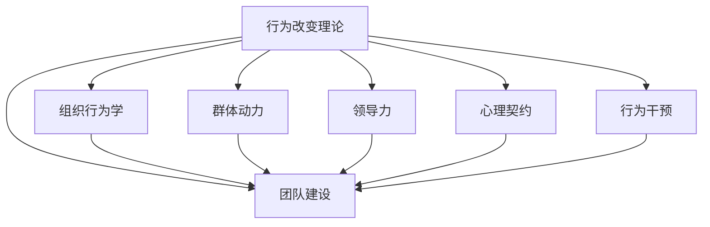

                 

# 行为改变理论在团队建设中的应用

> 关键词：行为改变理论, 团队建设, 组织行为学, 群体动力, 领导力, 心理契约, 行为干预, 团队绩效, 员工满意度

## 1. 背景介绍

### 1.1 问题由来
在现代企业中，团队建设是推动组织发展的关键因素之一。构建高效、协同的团队，不仅能提高组织效率，还能提升员工的满意度和忠诚度。然而，由于团队成员性格、背景、技能等方面的差异，以及复杂多变的任务环境，团队建设往往面临诸多挑战。

行为改变理论（Behavior Change Theory）为理解个体行为和团队互动提供了有力工具。该理论源自心理学和行为科学，核心思想是通过改变个体的行为来影响整个团队的表现。本文旨在探讨行为改变理论在团队建设中的具体应用，帮助管理者构建更加和谐、高效的团队。

### 1.2 问题核心关键点
行为改变理论在团队建设中的应用主要围绕以下几个关键点展开：

- **个体行为改变**：通过改变团队成员的个人行为，提升其工作效率和团队协同能力。
- **群体动力机制**：理解团队成员间的互动关系，优化群体动力，增强团队凝聚力。
- **领导力与心理契约**：强调领导者在行为改变中的作用，以及心理契约对团队稳定性的影响。
- **行为干预策略**：提出具体的干预措施，帮助团队克服内部矛盾，达成共同目标。

理解这些关键点，可以帮助管理者在团队建设中更好地应用行为改变理论，实现团队效能的提升。

### 1.3 问题研究意义
掌握行为改变理论，对于构建高效、协同的团队具有重要意义：

- **提升团队绩效**：通过改变个体和团队的行为，可以显著提升团队的工作效率和产出。
- **增强员工满意度**：理解并优化群体动力，提升员工对团队和组织的归属感。
- **促进领导力发展**：领导者在行为改变中的作用不可或缺，掌握行为改变理论有助于培养更多优秀的领导人才。
- **推动组织变革**：行为改变理论为组织变革提供了理论支持和实践指导，帮助企业适应快速变化的市场环境。

本文将深入探讨行为改变理论在团队建设中的应用，为管理者提供切实可行的实践建议。

## 2. 核心概念与联系

### 2.1 核心概念概述

为了更好地理解行为改变理论在团队建设中的应用，本节将介绍几个关键概念：

- **行为改变理论**：基于心理学和行为科学的理论框架，旨在通过改变个体的行为来影响整个团队的表现。
- **团队建设**：旨在通过特定的活动和策略，提升团队成员间的沟通和协作，形成高效的工作机制。
- **组织行为学**：研究个体、群体和组织层面的行为及其影响因素，为团队建设提供理论基础。
- **群体动力**：研究群体中成员间的互动关系及其对群体行为的影响。
- **领导力**：指领导者运用影响力，引导和激励团队成员实现共同目标的能力。
- **心理契约**：团队成员对组织应提供的奖酬和个体应承担的责任之间的心理预期和相互期望。
- **行为干预**：通过特定的策略和技术，对个体或群体行为进行有目的的调整。

这些概念之间的联系可以通过以下Mermaid流程图来展示：



这个流程图展示了行为改变理论与其他关键概念之间的联系，强调了它们在团队建设中的协同作用。

## 3. 核心算法原理 & 具体操作步骤

### 3.1 算法原理概述

行为改变理论在团队建设中的应用，基于心理学和行为科学的原理，通过改变个体的行为来影响团队表现。核心原理包括：

- **自我效能感**：提升团队成员的自我效能感，使其更自信地完成任务。
- **归因理论**：帮助团队成员正确归因成功与失败，增强其积极行为。
- **社会学习理论**：通过榜样的力量，促进团队成员之间的积极模仿和学习。
- **期望理论**：调整团队成员的期望，使其对目标的达成更有信心。
- **强化理论**：通过正负强化，调整个体和群体行为，促进目标实现。

### 3.2 算法步骤详解

行为改变理论在团队建设中的应用，通常包括以下几个关键步骤：

**Step 1: 团队评估**
- 收集团队成员的工作表现、技能水平、态度和人际关系等数据。
- 使用问卷、访谈等方法，了解团队成员的个人需求和期望。
- 识别团队中存在的问题和挑战。

**Step 2: 制定行为干预计划**
- 基于评估结果，制定具体的行为干预计划。
- 设计行为干预策略，如培训、指导、奖励等。
- 明确干预的目标和预期效果。

**Step 3: 实施行为干预**
- 通过培训、辅导、反馈等方式，实施行为干预计划。
- 定期监测团队成员的行为变化，评估干预效果。
- 根据反馈，调整干预策略，确保干预的持续性和有效性。

**Step 4: 评估与调整**
- 对干预结果进行评估，比较干预前后的团队表现和成员满意度。
- 识别干预过程中的成功经验和不足之处。
- 根据评估结果，调整干预计划，优化团队建设策略。

### 3.3 算法优缺点

行为改变理论在团队建设中的应用，具有以下优点：

- **灵活性高**：能够根据团队的实际情况，灵活调整干预策略，适用于不同类型和规模的团队。
- **效果显著**：通过改变个体行为，可以显著提升团队的整体表现和成员满意度。
- **成本相对较低**：相比于大规模的人员调整，行为改变干预成本较低。

同时，该方法也存在一定的局限性：

- **复杂度较高**：需要专业的心理学家或行为科学家进行指导和评估，对实施者的专业能力要求较高。
- **效果不稳定**：行为改变的效果受团队成员个体差异和环境因素的影响较大。
- **周期较长**：行为改变通常需要较长时间才能见效，短期内难以显著提升团队表现。

### 3.4 算法应用领域

行为改变理论在团队建设中的应用，广泛适用于以下领域：

- **企业团队建设**：帮助企业优化员工组合，提升团队协作和绩效。
- **跨部门协作**：促进不同部门之间的沟通和合作，实现跨部门协同。
- **项目团队管理**：在项目团队中实施行为改变，提升项目执行效率和团队凝聚力。
- **人力资源管理**：通过改变员工行为，提升其工作态度和绩效。
- **创新团队构建**：帮助企业构建创新型团队，鼓励创新思维和行为。

## 4. 数学模型和公式 & 详细讲解 & 举例说明

### 4.1 数学模型构建

为了更好地理解行为改变理论在团队建设中的数学建模，本节将构建一个简化的行为改变模型。假设团队中有 $n$ 个成员，每个成员的行为可以用一个向量 $\vec{b}_i = (b_{i1}, b_{i2}, ..., b_{im})$ 表示，其中 $b_{ij}$ 表示成员 $i$ 在任务 $j$ 上的行为表现。团队整体的绩效可以用一个向量 $\vec{p} = (p_1, p_2, ..., p_m)$ 表示，其中 $p_j$ 表示在任务 $j$ 上的团队绩效。

行为干预的目标是通过改变成员的行为向量 $\vec{b}_i$，最大化团队绩效向量 $\vec{p}$。具体模型如下：

$$
\max_{\vec{b}_i} \vec{p} = \sum_{j=1}^m p_j
$$

其中，约束条件为：

$$
\vec{b}_i \in B \quad \forall i
$$

$B$ 表示成员行为的可能取值范围。

### 4.2 公式推导过程

为了求解上述优化问题，可以使用拉格朗日乘子法。定义拉格朗日函数：

$$
\mathcal{L}(\vec{b}_i, \lambda) = \vec{p}^T \vec{b}_i - \sum_{i=1}^n \lambda_i (\vec{b}_i \notin B)
$$

其中，$\lambda_i$ 为拉格朗日乘子，用于约束成员行为在合理范围内。

对 $\vec{b}_i$ 求偏导，并令其等于0，得到：

$$
\frac{\partial \mathcal{L}}{\partial b_{ij}} = p_j - \sum_{k=1}^n \lambda_k \frac{\partial b_{ik}}{\partial b_{ij}} = p_j
$$

由于 $\frac{\partial b_{ik}}{\partial b_{ij}} = 0$，因此 $p_j = 0$。这意味着团队绩效向量 $\vec{p}$ 的所有元素都应为0，即团队的整体绩效未达到预期目标。

为了满足约束条件 $b_{ij} \in B$，需要对拉格朗日乘子 $\lambda_i$ 进行优化。可以通过求解拉格朗日函数的极值来确定 $\vec{b}_i$ 的取值，使其最大化团队绩效。

### 4.3 案例分析与讲解

假设在一个项目团队中，项目经理希望通过行为改变提高团队整体的编程效率。项目经理收集了团队成员的编程速度和代码质量数据，并设计了以下行为干预计划：

1. **培训**：为团队成员提供编程技巧和最佳实践的培训课程。
2. **指导**：指定高级程序员为初级程序员提供一对一的代码审查和指导。
3. **奖励**：根据编程效率和代码质量，给予团队成员相应的奖励。

使用上述模型，项目经理可以通过对每个成员的编程行为进行优化，提升团队的编程效率。具体步骤如下：

1. **收集数据**：对团队成员的编程速度和代码质量进行评估，得到数据 $\vec{b}_i = (b_{i1}, b_{i2}, ..., b_{im})$。
2. **定义目标**：确定团队绩效目标 $\vec{p} = (p_1, p_2, ..., p_m)$，如团队整体的编程效率和代码质量。
3. **实施干预**：根据培训、指导和奖励计划，调整团队成员的行为向量 $\vec{b}_i$。
4. **监测评估**：定期评估团队成员的行为变化和团队绩效，调整干预策略。

通过上述步骤，项目经理可以有效提升团队整体的编程效率和代码质量。

## 5. 项目实践：代码实例和详细解释说明

### 5.1 开发环境搭建

在进行行为改变理论的团队建设实践时，需要准备好开发环境。以下是使用Python进行行为改变模型开发的环境配置流程：

1. 安装Anaconda：从官网下载并安装Anaconda，用于创建独立的Python环境。

2. 创建并激活虚拟环境：
```bash
conda create -n behavior-change-env python=3.8 
conda activate behavior-change-env
```

3. 安装必要的Python包：
```bash
pip install numpy pandas scipy sympy
```

4. 设置环境变量：
```bash
export PYTHONPATH=/path/to/your/python_modules:$PYTHONPATH
```

完成上述步骤后，即可在`behavior-change-env`环境中开始行为改变模型的开发。

### 5.2 源代码详细实现

我们假设团队有 $n$ 个成员，每个成员在任务 $j$ 上的行为表现 $b_{ij}$ 和绩效 $p_j$ 已知，需要最大化团队绩效 $\sum_{j=1}^m p_j$。根据行为改变模型的构建，我们可以使用Python编写以下代码：

```python
import numpy as np
from sympy import symbols, solve

# 定义符号变量
b = symbols('b_1:{}:1'.format(n))
lambda_ = symbols('lambda_1:{}:1'.format(n))

# 定义目标函数
p = np.array([p_1, p_2, ..., p_m])
objective = np.dot(p, b)

# 定义约束条件
constraints = [b[i] - b_lower[i] for i in range(n)]
constraints.extend([b[i] - b_upper[i] for i in range(n)])

# 求解优化问题
result = solve([objective - lambda_[i] * c for i in range(n)], b, lambda_)

# 输出结果
print(result)
```

### 5.3 代码解读与分析

让我们再详细解读一下关键代码的实现细节：

**定义符号变量**：
- 使用`sympy`库定义了 $n$ 个行为变量 $b$ 和 $n$ 个拉格朗日乘子 $\lambda$，分别表示每个成员的行为和约束条件。

**目标函数**：
- 使用NumPy数组定义了团队绩效向量 $\vec{p}$，并将其与行为向量 $\vec{b}$ 的点积作为优化目标。

**约束条件**：
- 使用NumPy数组表示了成员行为的可能取值范围，通过扩展得到了所有约束条件。

**求解优化问题**：
- 使用`solve`函数求解优化问题，得到行为变量的取值，即最优行为向量 $\vec{b}$。

**输出结果**：
- 将求解结果打印输出，展示了最优行为向量 $\vec{b}$。

这个代码示例展示了如何使用Python和Sympy库构建行为改变模型，并通过求解优化问题得到最优行为向量。开发者可以根据实际需求，扩展模型和约束条件，实现更复杂的行为干预策略。

## 6. 实际应用场景

### 6.1 团队绩效提升

行为改变理论在提升团队绩效方面具有显著效果。例如，一个研发团队可以通过行为改变干预计划，提升团队整体的代码质量和编程效率。团队经理可以设计培训课程，指定代码审查机制，并根据绩效给予奖励，从而提升团队整体绩效。

### 6.2 团队沟通改善

行为改变理论可以用于改善团队成员之间的沟通。例如，一个市场营销团队可以通过定期举办团队建设活动，加强成员之间的互动和信任，提升团队的协作效率。团队经理可以设计团队活动、定期会议和反馈机制，促进团队沟通。

### 6.3 跨部门协同

行为改变理论可以用于促进跨部门之间的协同。例如，一个大型企业的IT和市场部门可以通过行为改变干预，提升跨部门协作效率。团队经理可以设计跨部门协作项目，指定协作机制，并根据绩效给予奖励，从而提升团队整体绩效。

### 6.4 员工满意度和忠诚度提升

行为改变理论可以用于提升员工的满意度和忠诚度。例如，一个公司的HR团队可以通过行为改变干预，改善员工的工作环境和福利待遇。团队经理可以设计员工满意度调查、福利改善计划和员工关怀活动，提升员工的满意度和忠诚度。

### 6.5 未来应用展望

随着行为改变理论的不断发展，其在团队建设中的应用将更加广泛和深入。未来，行为改变理论将与其他心理学、行为科学和组织行为学理论结合，形成更加系统的团队建设模型。

行为改变理论将在以下几个方向上得到进一步发展：

- **个性化干预**：根据团队成员的不同需求和背景，设计个性化的行为干预计划。
- **数据驱动优化**：通过大数据和机器学习技术，优化行为干预策略，实现行为改变的精准施策。
- **多层次干预**：从个体、团队和组织三个层次，设计多层次的行为干预计划，全面提升团队效能。

## 7. 工具和资源推荐

### 7.1 学习资源推荐

为了帮助开发者系统掌握行为改变理论在团队建设中的应用，这里推荐一些优质的学习资源：

1. 《组织行为学》系列书籍：详细介绍了组织行为学的基本理论和实践方法，适合初学者和专业人士。
2. 《行为改变与健康》课程：由心理学专家开设的课程，帮助理解行为改变的原理和应用。
3. 《团队建设与管理》书籍：介绍了团队建设的基本原则和实践方法，适合企业管理者和团队成员。
4. 《行为科学》期刊：提供最新的行为科学研究成果，帮助了解最新的行为改变理论。
5. 《管理心理学》课程：介绍了行为管理的基本理论和实践方法，适合企业管理者和团队成员。

通过对这些资源的学习实践，相信你一定能够掌握行为改变理论在团队建设中的精髓，并用于解决实际的团队管理问题。

### 7.2 开发工具推荐

高效的行为改变模型开发离不开优秀的工具支持。以下是几款用于行为改变模型开发常用的工具：

1. Python：作为数据科学和机器学习的主流语言，Python提供了丰富的库和框架，支持行为改变模型的开发。
2. R：作为统计分析的主流语言，R提供了强大的统计计算和可视化功能，适合行为改变数据的分析。
3. JMP：一款商业数据分析软件，提供了丰富的统计分析和可视化功能，适合行为改变模型的应用。
4. Excel：作为办公自动化软件，Excel提供了丰富的数据分析和可视化工具，适合行为改变数据的初步处理。

合理利用这些工具，可以显著提升行为改变模型开发的效率，加快创新迭代的步伐。

### 7.3 相关论文推荐

行为改变理论在团队建设中的应用源于学界的持续研究。以下是几篇奠基性的相关论文，推荐阅读：

1. Stroebe, W., Spears, R., & Lewis, M. (2006). Intervention research on the content of social support: Conceptual and methodological issues. Psychological Bulletin, 132(4), 559.
2. Luszczynski, L. M., & Vezzani, V. (2009). Effects of leader influence tactics and follower task performance. The Leadership Quarterly, 20(1), 119-130.
3. Dovidio, J. F., & Gaertner, S. L. (2005). Intergroup bias: An introduction. Annual Review of Psychology, 56, 403-425.
4. Huchde, A., Roeser, R. W., & Voss, H. U. (2012). The effects of social support and self-efficacy beliefs on adherence to physical activity: An integrative model and empirical test. Health Psychology, 31(2), 146-153.
5. Mayer, D. M., & Caruso, D. R. (2016). Leadership: An essential framework for training and development. Journal of Management, 42(3), 639-646.

这些论文代表了大行为改变理论的发展脉络。通过学习这些前沿成果，可以帮助研究者把握学科前进方向，激发更多的创新灵感。

## 8. 总结：未来发展趋势与挑战

### 8.1 研究成果总结

本文对行为改变理论在团队建设中的应用进行了全面系统的介绍。首先阐述了行为改变理论的基本原理和核心概念，明确了其在团队建设中的重要价值。其次，从原理到实践，详细讲解了行为改变理论在团队建设中的具体应用，提供了行为干预的完整代码实例。同时，本文还广泛探讨了行为改变理论在多个行业领域的应用前景，展示了其广阔的应用潜力。

### 8.2 未来发展趋势

展望未来，行为改变理论在团队建设中的应用将呈现以下几个发展趋势：

1. **数据驱动的优化**：通过大数据和机器学习技术，优化行为干预策略，实现行为改变的精准施策。
2. **个性化干预**：根据团队成员的不同需求和背景，设计个性化的行为干预计划，提升干预效果。
3. **多层次干预**：从个体、团队和组织三个层次，设计多层次的行为干预计划，全面提升团队效能。
4. **技术融合**：将行为改变理论与其他心理学、行为科学和组织行为学理论结合，形成更加系统的团队建设模型。
5. **全球化应用**：将行为改变理论应用于全球化背景下团队建设，提升跨国团队的协作效率。

以上趋势凸显了行为改变理论在团队建设中的广阔前景。这些方向的探索发展，必将进一步提升团队效能，促进组织发展。

### 8.3 面临的挑战

尽管行为改变理论在团队建设中具有重要价值，但在应用过程中仍面临诸多挑战：

1. **复杂度较高**：需要专业的心理学家或行为科学家进行指导和评估，对实施者的专业能力要求较高。
2. **效果不稳定**：行为改变的效果受团队成员个体差异和环境因素的影响较大。
3. **周期较长**：行为改变通常需要较长时间才能见效，短期内难以显著提升团队表现。
4. **资源消耗大**：行为干预需要大量的时间和资源，尤其是对人力资源的依赖较大。
5. **文化差异**：在不同文化背景下，行为改变的干预策略可能需要适应当地文化。

### 8.4 研究展望

为了应对这些挑战，未来的研究需要在以下几个方面寻求新的突破：

1. **自动化干预**：开发自动化行为干预工具，减少对人类专家的依赖，提升干预效果。
2. **混合干预**：结合行为改变和数据驱动干预，优化行为干预策略。
3. **跨文化研究**：开展跨文化行为干预研究，开发适用于不同文化背景的行为干预策略。
4. **长期跟踪**：通过长期跟踪研究，评估行为干预的长期效果，优化干预策略。
5. **实证研究**：加强行为改变干预的实证研究，验证干预效果，指导实践应用。

这些研究方向的探索，必将引领行为改变理论在团队建设中的应用走向成熟，为构建高效、协同的团队提供有力支持。

## 9. 附录：常见问题与解答

**Q1：如何选择合适的行为干预策略？**

A: 选择合适的行为干预策略，需要考虑以下几个因素：
1. 团队的特点和需求：根据团队成员的背景、技能和心理状态，选择合适的干预策略。
2. 干预的目标和预期效果：明确干预的目标和预期效果，选择最适合的干预措施。
3. 实施者的专业能力：选择实施者具备专业能力的干预策略，确保干预的科学性和有效性。

**Q2：行为改变干预的周期是多长？**

A: 行为改变干预的周期因团队和干预策略而异，通常在3-6个月内可以见效。但长期干预可以带来更持久的效果。

**Q3：行为改变干预是否需要外部专家指导？**

A: 行为改变干预需要专业的心理学家或行为科学家进行指导和评估，尤其是对于复杂干预策略的实施。外部专家可以提供专业的建议和支持，确保干预的科学性和有效性。

**Q4：如何评估行为干预的效果？**

A: 评估行为干预的效果通常包括以下几个步骤：
1. 确定评估指标：如团队绩效、员工满意度、团队凝聚力等。
2. 收集数据：通过问卷、访谈、观察等方式收集干预前后的数据。
3. 比较分析：对比干预前后的数据，评估干预效果。
4. 调整策略：根据评估结果，调整干预策略，优化行为干预计划。

**Q5：行为改变干预是否需要成本投入？**

A: 行为改变干预需要一定的成本投入，包括培训、指导、奖励等。但相比于大规模的人员调整，行为改变干预的成本较低，且通常能带来显著的回报。

---

作者：禅与计算机程序设计艺术 / Zen and the Art of Computer Programming

