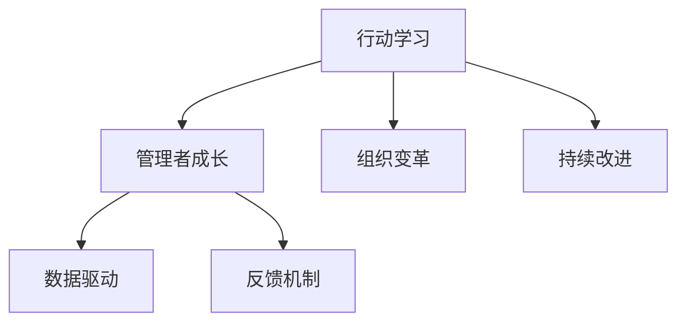

                 

# 行动中学习：管理者的成长之道

> 关键词：行动学习, 管理者成长, 领导力提升, 组织变革, 持续改进, 数据驱动, 反馈机制

## 1. 背景介绍

在日益复杂多变的外部环境中，管理者面临着前所未有的挑战。如何在快速变化的市场中保持企业的竞争力，如何在不确定性中做出正确决策，如何有效管理团队，成为每个管理者都必须面对的问题。行动学习作为一种重要的管理工具，帮助管理者在行动中不断反思、调整和优化，成为不断成长的密钥。本文将深入探讨行动学习在管理者成长中的作用，提供实用的操作步骤和工具，助力管理者实现职业和个人成长。

## 2. 核心概念与联系

### 2.1 核心概念概述

为了更好地理解行动学习，本文将介绍几个关键概念：

- **行动学习**：一种基于实践的学习方法，强调在行动中不断反思和改进。通过实际行动和实践经验来检验和优化理论知识，进而提升决策和行动的有效性。

- **管理者成长**：指管理者通过不断学习和实践，提升领导力、决策力、沟通能力等各项能力，以适应不断变化的环境和需求。

- **组织变革**：指组织在战略、结构、文化等方面进行系统性改革，以适应外部环境的变化和内部的发展需求。

- **持续改进**：一种以数据驱动的优化过程，通过不断的反馈和改进，不断提高组织和个人的表现。

- **数据驱动**：利用数据和分析工具进行决策，提升决策的科学性和准确性。

- **反馈机制**：及时、准确地获取和分析反馈信息，对决策和行动进行调整和优化。

这些概念之间的逻辑关系可以通过以下Mermaid流程图来展示：



该图展示了行动学习如何促进管理者成长，支持组织变革，并推动持续改进。同时，行动学习也是数据驱动和反馈机制的重要组成部分。

## 3. 核心算法原理 & 具体操作步骤

### 3.1 算法原理概述

行动学习基于以下核心原理：

1. **实践与反思**：在实际行动中收集数据和经验，通过反思和分析来发现问题并改进决策和行动。

2. **数据驱动**：通过收集和分析数据，获得洞察力和量化指标，指导后续的行动和决策。

3. **反馈循环**：建立反馈机制，及时获取反馈信息，对行动进行调整和优化。

4. **学习和改进**：在反思和反馈的基础上，学习新的知识和技能，优化行动和决策过程。

### 3.2 算法步骤详解

基于行动学习的管理成长过程包括以下几个关键步骤：

**Step 1: 确定学习目标**
- 明确个人或团队在管理能力提升方面希望达成的具体目标。
- 设定可量化的绩效指标，评估学习效果。

**Step 2: 设计行动计划**
- 根据学习目标，设计具体的行动计划。
- 包括具体的行动步骤、时间节点、评估方法等。

**Step 3: 实施行动计划**
- 在实际管理工作中执行行动计划。
- 记录行动过程中遇到的挑战、问题和解决方案。

**Step 4: 反思和分析**
- 定期对行动过程中的数据和经验进行反思。
- 分析行动结果与预期目标的差距，识别改进机会。

**Step 5: 调整和改进**
- 根据反思结果，调整行动计划和策略。
- 学习新的知识和技能，优化管理方法。

**Step 6: 数据驱动和反馈**
- 利用数据和分析工具，获取管理工作的量化指标。
- 建立反馈机制，及时获取团队成员和客户的反馈信息。

**Step 7: 总结和分享**
- 总结学习过程中的经验和教训，撰写学习报告。
- 与团队成员分享学习成果和改进方法，促进共同成长。

### 3.3 算法优缺点

行动学习的优点包括：

1. **实践导向**：通过实际行动和经验进行学习和改进，提升决策的实用性和有效性。
2. **自适应性强**：可以灵活应对管理工作中出现的各种问题和挑战，及时调整行动策略。
3. **提升团队凝聚力**：通过共同学习和改进，增强团队成员的沟通和合作。

行动学习的主要缺点包括：

1. **时间和资源成本高**：需要花费大量时间和资源进行实践和反思。
2. **依赖于管理者的学习能力**：需要管理者具备良好的反思和分析能力。
3. **短期效果不明显**：改进过程可能较为缓慢，短期内难以看到显著成效。

### 3.4 算法应用领域

行动学习在多个领域都有广泛的应用，例如：

- **企业管理**：帮助管理者提升领导力、决策力、沟通能力等各项能力。
- **人力资源管理**：通过不断学习和改进，优化人力资源配置和员工管理。
- **市场营销**：在市场调研和产品推广中，利用行动学习提升策略效果。
- **创新管理**：通过不断尝试和反思，推动组织创新和产品开发。
- **客户关系管理**：增强客户体验和满意度，提升客户忠诚度。

## 4. 数学模型和公式 & 详细讲解 & 举例说明

### 4.1 数学模型构建

行动学习的数学模型可以简单表示为：

$$
\text{成长率} = \frac{\text{当前能力} - \text{原始能力}}{\text{原始能力} \times \text{时间}}
$$

其中，成长率反映了管理者在特定时间内能力提升的速度和效果。

### 4.2 公式推导过程

行动学习的公式推导如下：

1. **实践与反思**：
   $$
   \text{反思} = \frac{\text{当前决策} - \text{预期决策}}{\text{预期决策}}
   $$

2. **数据驱动**：
   $$
   \text{数据} = \frac{\text{实际结果} - \text{预期结果}}{\text{预期结果}}
   $$

3. **反馈循环**：
   $$
   \text{反馈} = \frac{\text{实际反馈} - \text{预期反馈}}{\text{预期反馈}}
   $$

4. **学习和改进**：
   $$
   \text{改进} = \frac{\text{新方法} - \text{原方法}}{\text{原方法}}
   $$

### 4.3 案例分析与讲解

假设某公司的市场经理希望通过行动学习提升市场推广效果。他确定了以下目标：

- 提升市场覆盖率20%。
- 增加客户转化率10%。

在制定行动计划时，他采用了以下步骤：

1. **实践与反思**：
   - 进行了市场调研，发现现有推广策略未能充分覆盖目标客户群。
   - 反思当前策略的局限性，发现了推广渠道狭窄、广告投放效果不佳等问题。

2. **数据驱动**：
   - 利用数据分析工具，评估当前推广效果和市场覆盖率。
   - 发现实际覆盖率仅为10%，与目标差距较大。

3. **反馈循环**：
   - 通过客户反馈，得知部分客户对推广内容不感兴趣。
   - 识别出推广内容的吸引力和针对性不足的问题。

4. **学习和改进**：
   - 学习新的市场推广策略，如社交媒体广告、定向投放等。
   - 改进现有策略，增加了多样化的推广渠道和更具吸引力的内容。

通过这些步骤，市场经理在3个月内成功提升了市场覆盖率至25%，客户转化率至12%，实现了既定目标。

## 5. 项目实践：代码实例和详细解释说明

### 5.1 开发环境搭建

要进行行动学习实践，首先需要搭建一个开发环境。以下是使用Python进行数据驱动行动学习的开发环境配置流程：

1. 安装Python：从官网下载并安装Python 3.x版本，确保环境稳定。
2. 安装Jupyter Notebook：用于创建和管理数据驱动的行动学习文档，可实时显示代码执行结果。
3. 安装Pandas、NumPy、Matplotlib等数据处理和可视化库，用于数据收集、分析和可视化。
4. 安装Scikit-learn、TensorFlow等机器学习库，用于数据建模和分析。

### 5.2 源代码详细实现

假设我们希望通过行动学习优化一家零售公司的库存管理。以下是具体的Python代码实现：

```python
import pandas as pd
import numpy as np
import matplotlib.pyplot as plt
from sklearn.linear_model import LinearRegression
from sklearn.metrics import mean_squared_error

# 加载数据
data = pd.read_csv('inventory_data.csv')

# 数据预处理
features = data[['temperature', 'humidity', 'demand']]
target = data['stock']

# 划分训练集和测试集
train_data = features[:80]
test_data = features[80:]
train_target = target[:80]
test_target = target[80:]

# 模型训练
model = LinearRegression()
model.fit(train_data, train_target)

# 预测和评估
predictions = model.predict(test_data)
mse = mean_squared_error(test_target, predictions)

# 可视化结果
plt.scatter(test_data, test_target)
plt.plot(test_data, predictions, color='red')
plt.xlabel('Inventory Demand')
plt.ylabel('Stock')
plt.title('Inventory Stock Prediction')
plt.show()

# 输出结果
print(f'MSE: {mse:.2f}')
```

在这个例子中，我们使用了线性回归模型来预测库存需求，并计算了模型在测试集上的均方误差。

### 5.3 代码解读与分析

**数据加载**：
```python
data = pd.read_csv('inventory_data.csv')
```

加载包含温度、湿度、需求等特征的数据集。

**数据预处理**：
```python
features = data[['temperature', 'humidity', 'demand']]
target = data['stock']
```

将数据集划分为特征和目标变量，准备用于模型训练。

**模型训练**：
```python
model = LinearRegression()
model.fit(train_data, train_target)
```

训练线性回归模型，使用前80%的数据进行训练。

**预测和评估**：
```python
predictions = model.predict(test_data)
mse = mean_squared_error(test_target, predictions)
```

在测试集上对模型进行预测，并计算均方误差。

**可视化结果**：
```python
plt.scatter(test_data, test_target)
plt.plot(test_data, predictions, color='red')
plt.xlabel('Inventory Demand')
plt.ylabel('Stock')
plt.title('Inventory Stock Prediction')
plt.show()
```

绘制模型预测结果的散点图，直观展示预测效果。

**输出结果**：
```python
print(f'MSE: {mse:.2f}')
```

输出模型的均方误差，用于评估预测性能。

### 5.4 运行结果展示

通过以上代码，我们可以得到模型的预测结果和评估指标，如均方误差。这为进一步优化行动计划和改进库存管理提供了数据支持。

## 6. 实际应用场景

### 6.1 企业人力资源管理

行动学习在企业人力资源管理中也有广泛应用。通过行动学习，人力资源管理者可以不断优化招聘、培训、绩效评估等环节，提升人才管理的科学性和有效性。例如，通过定期对员工反馈和绩效数据进行分析，识别出人才流失的主要原因，调整招聘策略和培训计划。

### 6.2 企业创新管理

在企业创新管理中，行动学习可以帮助管理者不断尝试新的产品和服务，推动组织创新和产品开发。例如，通过行动学习，识别出市场需求的变迁，调整产品定位和营销策略，提升市场竞争力。

### 6.3 客户关系管理

在客户关系管理中，行动学习可以帮助管理者提升客户满意度和忠诚度。例如，通过定期对客户反馈进行分析，识别出客户的需求和痛点，优化产品和服务，提升客户体验。

### 6.4 未来应用展望

随着行动学习技术的不断进步，未来在企业管理中的应用将更加广泛。行动学习将与其他管理工具和方法结合，如敏捷管理、精益管理、数据驱动等，形成更加系统化的管理方法。未来，行动学习将更加注重数据驱动、团队协作和持续改进，为企业管理提供更科学、更高效的支持。

## 7. 工具和资源推荐

### 7.1 学习资源推荐

为了帮助管理者系统掌握行动学习的原理和实践，以下是一些优质的学习资源：

1. 《行动学习：管理者的实践指南》：详细介绍了行动学习的核心原理和操作步骤，提供了丰富的案例和工具。
2. Coursera《行动学习》课程：由知名商学院教授授课，深入讲解行动学习的方法和应用。
3. Udemy《管理者的行动学习》课程：通过实际案例，帮助管理者掌握行动学习技巧。
4. 《行动学习手册》：提供了系统化的行动学习操作框架和方法论。

通过这些资源的学习实践，相信管理者一定能够掌握行动学习的精髓，提升自身的管理能力。

### 7.2 开发工具推荐

要进行行动学习实践，需要借助一些高效的工具。以下是几款常用的工具：

1. Jupyter Notebook：用于创建和管理行动学习文档，支持代码编写、数据处理和可视化。
2. Python：数据处理和分析的首选语言，拥有丰富的数据处理和机器学习库。
3. Excel：简单易用的数据处理工具，适合进行初步的数据分析和可视化。
4. Tableau：高级的数据可视化工具，支持复杂的数据分析和报表生成。

这些工具的合理使用，可以显著提升行动学习的效率和效果。

### 7.3 相关论文推荐

行动学习作为管理科学的前沿领域，相关的研究论文也非常丰富。以下是几篇具有代表性的论文：

1. "Action Learning in Organizations: A Review of Theoretical and Empirical Research"：对行动学习的理论基础和实践应用进行了全面的综述。
2. "Learning from Doing: Action Inquiry as a Strategy for Knowledge Creation"：介绍了行动学习在组织知识创建中的应用。
3. "The Practice of Action Learning"：提供了行动学习的实践框架和方法论。

这些论文代表了行动学习研究的最新进展，值得深入阅读。

## 8. 总结：未来发展趋势与挑战

### 8.1 总结

本文对行动学习在管理者成长中的作用进行了全面系统的介绍。首先阐述了行动学习的核心概念和原理，明确了行动学习在提升管理者能力、推动组织变革和支持持续改进方面的独特价值。其次，从理论到实践，详细讲解了行动学习的数学模型和操作步骤，提供了行动学习实践的完整代码实现。同时，本文还探讨了行动学习在人力资源管理、企业创新管理和客户关系管理等多个行业领域的应用前景，展示了行动学习技术的广阔前景。最后，本文精选了行动学习技术的各类学习资源，力求为管理者提供全方位的技术指引。

通过本文的系统梳理，可以看到，行动学习作为管理科学的重要工具，通过实践导向和数据驱动，帮助管理者在不断反思和改进中提升自身能力，推动组织变革和持续改进。未来，伴随行动学习技术的不断演进，管理者将在快速变化的环境中更具竞争力，为组织的长期发展提供坚实的人才保障。

### 8.2 未来发展趋势

展望未来，行动学习将呈现以下几个发展趋势：

1. **数据驱动与技术融合**：行动学习将与大数据、人工智能等技术更加紧密结合，提升决策的科学性和精确性。
2. **团队协作与跨部门协同**：行动学习将强调团队协作和跨部门协同，促进知识共享和资源整合。
3. **智能化与自动化**：行动学习将利用智能工具和自动化技术，提升行动学习的效率和效果。
4. **全球化和跨文化管理**：行动学习将在全球化和跨文化管理中发挥更大作用，促进不同文化背景下的知识共享和创新。
5. **持续改进与创新**：行动学习将不断推动组织的持续改进和创新，适应不断变化的市场需求。

这些趋势凸显了行动学习技术的广阔前景，为管理者的成长和组织的发展提供了新的方向和机遇。

### 8.3 面临的挑战

尽管行动学习技术已经取得了显著进展，但在实践中仍然面临诸多挑战：

1. **资源和成本**：行动学习需要大量时间和资源进行实践和反思，对于中小型企业来说，可能面临资源不足的问题。
2. **文化阻力**：一些组织可能存在文化阻力，不愿意进行大范围的组织变革和改进。
3. **数据质量和分析能力**：行动学习依赖于高质量的数据和先进的分析工具，对于数据质量较差的组织来说，可能难以有效实施。
4. **管理者的学习能力**：行动学习需要管理者具备较强的反思和分析能力，对于一些缺乏相关经验的管理者来说，可能难以迅速上手。

这些挑战需要组织在资源投入、文化建设、数据治理和人才培养等方面进行系统性改进，才能充分发挥行动学习的作用。

### 8.4 研究展望

未来，行动学习的研究将围绕以下几个方向展开：

1. **行动学习理论与模型**：深入研究行动学习的理论基础，构建更加科学、系统的行动学习模型。
2. **行动学习技术与应用**：开发更加高效、易用的行动学习工具和技术，推动行动学习在更多领域的应用。
3. **行动学习与组织治理**：研究行动学习在组织治理中的应用，提升组织管理的系统性和科学性。
4. **行动学习与领导力**：探讨行动学习对管理者领导力的提升作用，推动管理者的持续成长和组织变革。
5. **行动学习与跨文化管理**：研究行动学习在跨文化管理中的应用，促进不同文化背景下的知识共享和创新。

这些方向的研究将为行动学习技术的发展提供新的动力，推动管理科学的不断进步。

## 9. 附录：常见问题与解答

**Q1: 行动学习与其他学习方法有何区别？**

A: 行动学习强调在实践中进行反思和改进，而传统学习方法更侧重于理论学习和知识传授。行动学习通过实际行动和经验，提升决策和行动的有效性，具有更强的实践导向和应用价值。

**Q2: 如何选择合适的行动学习项目？**

A: 选择合适的行动学习项目应考虑以下几个方面：
1. 是否与组织战略目标相一致。
2. 是否具备足够的资源和时间支持。
3. 是否具有明确的行动目标和可量化的绩效指标。
4. 是否能够获得关键干部的支持和参与。

**Q3: 行动学习在哪些行业有广泛应用？**

A: 行动学习在多个行业都有广泛应用，例如人力资源管理、创新管理、客户关系管理、企业战略规划等。不同行业的具体应用略有差异，但行动学习的核心原理和方法可以跨行业通用。

**Q4: 行动学习在实施过程中需要注意哪些问题？**

A: 行动学习在实施过程中需要注意以下几个问题：
1. 确定明确的学习目标，制定详细的行动计划。
2. 确保组织内各层级的支持和参与。
3. 建立有效的反馈机制，及时获取和分析反馈信息。
4. 定期评估和反思行动结果，调整和改进行动策略。
5. 利用数据和分析工具，提升决策的科学性和精确性。

这些问题的合理处理，有助于行动学习在组织中的顺利实施和效果的最大化。

**Q5: 行动学习对管理者的要求有哪些？**

A: 行动学习对管理者的要求包括：
1. 具备较强的反思和分析能力，能够从实际行动中总结经验教训。
2. 具备较强的沟通和协调能力，能够与团队成员和利益相关者进行有效沟通。
3. 具备较强的学习能力和适应能力，能够快速学习和适应新的方法和工具。
4. 具备较强的领导力和决策能力，能够推动行动计划的有效实施。

管理者的这些能力，将直接影响行动学习的实施效果和组织变革的进展。

---

作者：禅与计算机程序设计艺术 / Zen and the Art of Computer Programming

