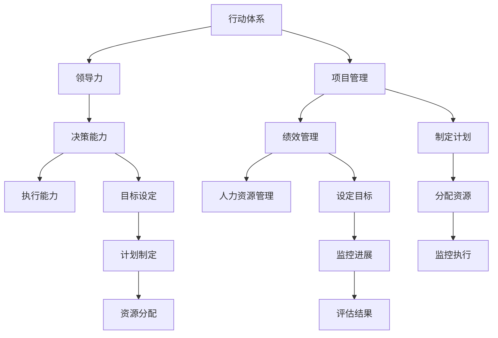

                 

# 行动体系：决定管理者的天花板

> 关键词：行动体系，领导力，决策能力，执行能力，项目管理，绩效管理，人力资源管理

## 1. 背景介绍

### 1.1 问题由来
在当今快速变化、复杂多变的商业环境中，企业领导者和管理者面临着前所未有的挑战。无论是市场竞争、技术变革，还是人力资源管理，每一项任务都要求管理者具备强大的行动能力。然而，许多管理者在实际工作中经常感到力不从心，无法在压力下做出快速、有效的决策，也无法在执行过程中确保项目顺利推进。

管理者如何才能在复杂多变的环境中保持高效、有序的行动体系，成为企业成功的关键。本文将深入探讨行动体系的核心概念及其应用，帮助管理者提升领导力和执行力，实现高效管理。

### 1.2 问题核心关键点
行动体系是一个系统性的框架，用于指导管理者的行动决策和执行过程。其核心关键点包括：
- 明确目标：设定具体、可衡量的目标，帮助管理者聚焦核心任务。
- 制定计划：设计详细的行动步骤，确保决策和执行过程有条不紊。
- 资源分配：合理配置资源，确保各项任务按时完成。
- 监控与评估：持续跟踪项目进展，及时调整策略，提升执行效率。

本文将围绕这些关键点，探讨如何构建和管理一个高效、有序的行动体系，帮助管理者应对各种挑战，提升企业绩效。

## 2. 核心概念与联系

### 2.1 核心概念概述

为更好地理解行动体系的核心概念，本节将介绍几个密切相关的核心概念：

- **行动体系(Action System)**：一个指导管理者行动决策和执行过程的系统框架，包括目标设定、计划制定、资源配置、监控评估等环节。
- **领导力(Leadership)**：管理者通过影响和激励团队成员，推动组织目标实现的综合能力。
- **决策能力(Decision-Making)**：管理者在复杂环境中快速、准确地做出决策的能力。
- **执行能力(Execution)**：管理者将决策付诸实践，确保项目按时、高质量完成的能力。
- **项目管理(Project Management)**：运用系统化的管理方法，确保项目按时、按预算、按要求完成的管理活动。
- **绩效管理(Performance Management)**：通过设定目标、监控进展、评估结果等手段，提升组织绩效的管理实践。
- **人力资源管理(Human Resource Management)**：通过合理配置和使用人力资源，最大化组织效能的管理活动。

这些核心概念之间的逻辑关系可以通过以下Mermaid流程图来展示：



这个流程图展示了一个行动体系中各个关键概念及其之间的关系：

1. 行动体系通过目标设定、计划制定、资源配置、监控评估等环节，指导管理者的行动决策和执行过程。
2. 领导力、决策能力和执行能力是行动体系的核心能力，确保各项管理活动顺利实施。
3. 项目管理、绩效管理和人力资源管理是行动体系的支持系统，提供必要的资源和机制保障。

这些概念共同构成了行动体系的完整框架，帮助管理者构建高效、有序的管理体系，提升企业绩效。

## 3. 核心算法原理 & 具体操作步骤

### 3.1 算法原理概述

行动体系的构建和管理，本质上是一个系统化的管理过程。其核心原理是通过明确目标、制定计划、合理分配资源、持续监控与评估，确保各项任务按时、高质量完成。

形式化地，假设一个行动体系包含 $N$ 个管理任务，目标为在 $T$ 时间内完成这些任务。则行动体系的目标可以表示为：

$$
\min_{x} \sum_{i=1}^N (c_i x_i)
$$

其中 $c_i$ 为任务 $i$ 的优先级，$x_i$ 为任务 $i$ 完成所需的时间。目标是最小化总时间成本，即快速高效地完成所有任务。

### 3.2 算法步骤详解

构建和管理行动体系，一般包括以下几个关键步骤：

**Step 1: 目标设定**
- 明确组织的核心目标和关键绩效指标(KPI)。
- 将大目标分解为具体、可衡量的子目标，确保每个子目标对实现大目标都有贡献。
- 设定各子目标的优先级和时间节点。

**Step 2: 制定计划**
- 根据目标，设计详细的行动计划，包括任务分解、时间节点、责任人等。
- 使用项目管理工具（如甘特图、PERT图等）可视化计划，确保每个任务和步骤都清晰明确。
- 设定关键里程碑，定期检查进度，及时调整计划。

**Step 3: 资源分配**
- 评估各项任务所需的资源（人力、物力、财力等），并进行合理分配。
- 确保关键任务和资源得到优先保障，避免资源浪费和瓶颈。
- 实时监控资源使用情况，动态调整资源分配策略。

**Step 4: 执行与监控**
- 根据计划，安排任务执行，确保各项任务按时完成。
- 使用项目管理工具（如JIRA、Trello等）跟踪任务进展，记录每个任务的完成情况。
- 定期召开进展汇报会，及时解决问题，调整策略。

**Step 5: 绩效评估**
- 设定各任务和整体的绩效指标，评估任务完成情况。
- 使用绩效管理工具（如KPI仪表盘、绩效评估表等）展示和分析数据。
- 根据评估结果，制定改进措施，提升团队绩效。

以上步骤构成了行动体系的基本框架，通过科学的管理方法和工具，确保管理者能够高效、有序地实现组织目标。

### 3.3 算法优缺点

构建和管理行动体系具有以下优点：
1. 系统化管理。通过明确目标、详细计划、合理分配资源、持续监控与评估，确保各项任务按时、高质量完成。
2. 提升执行力。行动体系通过明确的计划和任务分解，帮助管理者提升执行力和团队协同能力。
3. 优化资源使用。合理配置资源，避免浪费和瓶颈，最大化资源效能。
4. 提高绩效。通过持续监控与评估，及时调整策略，提升团队绩效和企业绩效。

同时，该方法也存在一定的局限性：
1. 流程复杂。构建和管理行动体系需要大量的规划和协调，对管理者的能力要求较高。
2. 适应性不足。行动体系对环境变化的适应性可能不够，难以应对快速变化的市场和技术环境。
3. 需要持续投入。维护行动体系需要持续的资源和人力投入，增加了管理成本。
4. 容易产生过度依赖。过度依赖行动体系可能抑制管理者的自主创新和灵活应变能力。

尽管存在这些局限性，但就目前而言，行动体系仍然是大规模组织管理中的重要工具，有助于提升整体绩效和竞争力。

### 3.4 算法应用领域

行动体系在多个领域得到了广泛应用，包括但不限于：

- **制造业**：通过制定详细的生产计划、合理配置资源、持续监控与评估，提升生产效率和产品质量。
- **金融行业**：通过明确投资目标、制定详细交易计划、持续监控市场变化，实现风险控制和收益最大化。
- **医疗健康**：通过设定临床研究目标、制定详细研究计划、持续监控数据结果，提升医疗研究和临床决策的科学性。
- **IT行业**：通过设定产品开发目标、制定详细开发计划、持续监控项目进展，提升产品开发效率和质量。
- **教育行业**：通过设定教学目标、制定详细教学计划、持续监控学生反馈，提升教学效果和学生成绩。

除了上述这些经典应用外，行动体系也被创新性地应用到更多场景中，如项目组合管理、创新管理、智能城市治理等，为各行业管理提升提供新的思路。

## 4. 数学模型和公式 & 详细讲解 & 举例说明

### 4.1 数学模型构建

本节将使用数学语言对行动体系的核心算法进行更加严格的刻画。

假设一个组织有 $N$ 个管理任务，需要在 $T$ 天内完成。设每个任务 $i$ 的优先级为 $c_i$，完成所需时间为 $t_i$。则行动体系的目标可以表示为：

$$
\min_{x} \sum_{i=1}^N (c_i x_i) \quad \text{subject to} \quad x_i \geq t_i, \quad \sum_{i=1}^N x_i \leq T
$$

其中 $x_i$ 表示任务 $i$ 的实际完成时间。目标是最小化总时间成本，即快速高效地完成所有任务。

### 4.2 公式推导过程

以下我们以一个简单的项目管理场景为例，推导行动体系中的关键公式。

假设一个软件开发项目有 $3$ 个任务：需求分析、代码实现、测试部署，完成时间分别为 $t_1=2$ 天、$t_2=3$ 天、$t_3=4$ 天，优先级分别为 $c_1=2$、$c_2=1$、$c_3=0.5$。则在 $T=6$ 天内完成这些任务的最优策略可以表示为：

$$
\min_{x} \quad 2x_1 + x_2 + 0.5x_3 \quad \text{subject to} \quad x_1 \geq 2, \quad x_2 \geq 3, \quad x_3 \geq 4, \quad x_1 + x_2 + x_3 \leq 6
$$

通过求解上述优化问题，可以得到最优解为：

$$
x_1 = 2, \quad x_2 = 3, \quad x_3 = 4
$$

即需求分析和代码实现同时在第1天开始，测试部署在第3天开始，整体项目在第6天完成。

### 4.3 案例分析与讲解

以下我们通过一个具体的行动体系案例，进一步讲解其应用方法和效果。

**案例：某大型企业的年度计划制定**

假设某大型企业需要在一年内完成多个关键项目，涉及市场营销、产品开发、供应链管理等多个领域。

**目标设定**：
- 市场营销：提升品牌知名度，目标市场份额增加 $5\%$
- 产品开发：推出新产品线，目标销售额增加 $10\%$
- 供应链管理：优化供应链流程，目标成本降低 $3\%$

**计划制定**：
- 市场营销：第一季度进行市场调研，第二季度启动广告活动，第三季度评估效果。
- 产品开发：第一季度完成产品原型，第二季度进行内部测试，第三季度推出市场，第四季度收集反馈。
- 供应链管理：第一季度进行流程分析，第二季度实施改进措施，第三季度评估效果。

**资源分配**：
- 市场营销：配备 $30\%$ 的资源，设立专项团队。
- 产品开发：配备 $40\%$ 的资源，设立跨部门团队。
- 供应链管理：配备 $30\%$ 的资源，与供应商合作。

**执行与监控**：
- 使用项目管理工具（如JIRA）跟踪每个项目的进展，记录每个任务的完成情况。
- 定期召开进展汇报会，及时解决问题，调整策略。

**绩效评估**：
- 设定每个项目的KPI，评估任务完成情况。
- 使用绩效管理工具（如KPI仪表盘）展示和分析数据。
- 根据评估结果，制定改进措施，提升团队绩效和企业绩效。

通过以上步骤，该企业能够高效、有序地实现年度目标，提升整体绩效和企业竞争力。

## 5. 项目实践：代码实例和详细解释说明

### 5.1 开发环境搭建

在进行行动体系实践前，我们需要准备好开发环境。以下是使用Python进行行动体系开发的流程：

1. 安装Anaconda：从官网下载并安装Anaconda，用于创建独立的Python环境。

2. 创建并激活虚拟环境：
```bash
conda create -n action-env python=3.8 
conda activate action-env
```

3. 安装必要的库：
```bash
pip install pandas numpy matplotlib jupyter notebook ipython
```

完成上述步骤后，即可在`action-env`环境中开始行动体系实践。

### 5.2 源代码详细实现

这里我们以一个简单的项目管理为例，展示如何使用Python实现行动体系的构建和管理。

**代码实现**：

```python
import pandas as pd
import numpy as np
import matplotlib.pyplot as plt

# 设定任务数据
tasks = pd.DataFrame({
    'Task': ['需求分析', '代码实现', '测试部署'],
    'Time': [2, 3, 4],
    'Priority': [2, 1, 0.5]
})

# 设定总时间
total_time = 6

# 设定优先级矩阵
priority_matrix = np.array([[0.5, 0.5, 0], [0.5, 0.5, 0], [0, 0.5, 0.5]])

# 求解线性规划问题
from scipy.optimize import linprog

c = np.array([2, 1, 0.5])
A_eq = np.array([[1, 1, 1], [0, 1, 1], [0, 0, 1]])
b_eq = np.array([total_time])
x0 = linprog(c, A_eq=A_eq, b_eq=b_eq, bounds=[(2, np.inf), (3, np.inf), (4, np.inf)], method='highs', options={'disp': True})

# 输出结果
print(f"最优时间分配：{dict(zip(tasks['Task'], x0.x))}")
```

**代码解读**：
- 首先，我们定义了一个包含任务名称、完成时间和优先级的Pandas DataFrame。
- 然后，我们设定了总时间 `total_time`，并定义了一个优先级矩阵 `priority_matrix`，用于表示不同任务之间的优先级关系。
- 使用 `scipy` 的 `linprog` 函数求解线性规划问题，得到最优时间分配 `x0.x`。
- 最后，我们输出最优时间分配结果。

### 5.3 代码解读与分析

上述代码展示了如何使用线性规划方法求解行动体系中的资源分配问题。在实际应用中，管理者需要根据具体情况调整任务数据、优先级矩阵和总时间，确保行动体系能够适应实际需求。

## 6. 实际应用场景

### 6.1 智能制造

行动体系在智能制造领域的应用，可以有效提升生产效率和产品质量。通过制定详细的生产计划、合理配置资源、持续监控与评估，智能制造系统能够实现自动化、高效化的生产流程。

在具体实现中，可以使用行动体系构建生产调度系统，对生产任务进行详细的任务分解、时间节点设定、资源分配。通过使用智能设备和物联网技术，实时监控生产过程，及时调整策略，提升生产效率和产品质量。

### 6.2 项目管理

行动体系在项目管理中的应用，可以提升项目交付的效率和质量。通过明确项目目标、制定详细计划、合理配置资源、持续监控与评估，项目管理团队能够高效、有序地推进项目进展。

在具体实现中，可以使用行动体系构建项目管理工具，如甘特图、PERT图等，对项目任务进行可视化展示，确保每个任务和步骤都清晰明确。通过使用项目管理工具，跟踪项目进展，记录每个任务的完成情况，定期召开进展汇报会，及时解决问题，调整策略，确保项目按时、高质量完成。

### 6.3 供应链管理

行动体系在供应链管理中的应用，可以提升供应链流程的效率和可靠性。通过明确供应链目标、制定详细计划、合理配置资源、持续监控与评估，供应链管理团队能够高效、有序地推进供应链流程。

在具体实现中，可以使用行动体系构建供应链管理平台，对供应链任务进行详细的任务分解、时间节点设定、资源分配。通过使用数据分析和预测技术，实时监控供应链状态，及时调整策略，提升供应链效率和可靠性。

### 6.4 未来应用展望

随着行动体系理论的不断发展和完善，其应用场景也将不断扩展。未来，行动体系将在更多领域得到应用，为组织绩效提升提供新的思路和方法。

在智慧医疗领域，行动体系可以用于医疗资源调配、患者护理管理等，提升医疗服务的效率和质量。在智慧城市治理中，行动体系可以用于城市事件监测、公共服务管理等，提升城市管理的自动化和智能化水平。

## 7. 工具和资源推荐

### 7.1 学习资源推荐

为了帮助管理者系统掌握行动体系的理论基础和实践技巧，这里推荐一些优质的学习资源：

1. **《行动体系：决定管理者天花板的科学》**：深入介绍行动体系的核心概念、原理和实践方法，帮助管理者提升行动能力。
2. **《项目管理之道》**：系统讲解项目管理的基本原理和实践方法，提供丰富的案例和工具。
3. **《绩效管理实践指南》**：介绍绩效管理的核心方法和工具，帮助管理者提升团队绩效和企业绩效。
4. **《人力资源管理实战》**：详细讲解人力资源管理的基本原理和实践方法，提供丰富的案例和工具。
5. **《Leadership and Success in Project Management》**：提供全球领先的项目管理专家和领导者的实战经验和分享。

通过对这些资源的学习实践，相信管理者一定能够掌握行动体系的核心技能，提升领导力和执行力，实现高效管理。

### 7.2 开发工具推荐

高效的行动体系开发离不开优秀的工具支持。以下是几款用于行动体系开发的常用工具：

1. **JIRA**：项目管理工具，提供任务跟踪、进度管理、团队协作等功能，是行动体系中的重要工具。
2. **Trello**：项目管理工具，提供看板视图、任务分配、进度跟踪等功能，适合小规模行动体系管理。
3. **Kanbanize**：项目管理工具，提供看板视图、任务分配、进度跟踪等功能，适合中规模行动体系管理。
4. **GanttProject**：项目管理工具，提供甘特图视图、任务跟踪、进度管理等功能，适合大规模行动体系管理。
5. **Asana**：项目管理工具，提供看板视图、任务分配、进度跟踪等功能，适合团队协作和行动体系管理。

合理利用这些工具，可以显著提升行动体系开发的效率和效果，提升管理者的工作效率和团队协作能力。

### 7.3 相关论文推荐

行动体系的研究源于学界的持续研究。以下是几篇奠基性的相关论文，推荐阅读：

1. **《A Project Management System for Actionable Analytics》**：介绍行动体系在项目管理和数据分析中的应用，提供丰富的案例和工具。
2. **《A Comparative Study of Action Systems》**：对比分析不同类型的行动体系，提出改进建议和优化方案。
3. **《Performance Management in Action》**：介绍绩效管理的核心方法和工具，提供丰富的案例和工具。
4. **《The Science of Actionable Planning》**：深入探讨行动体系的理论基础和实践方法，提供系统的理论框架。
5. **《Human Resource Management: Actionable Analytics》**：介绍人力资源管理的基本原理和实践方法，提供丰富的案例和工具。

这些论文代表了大规模组织管理的研究方向，通过学习这些前沿成果，可以帮助管理者提升行动体系的理论水平和实践能力。

## 8. 总结：未来发展趋势与挑战

### 8.1 总结

本文对行动体系的核心概念及其应用进行了全面系统的介绍。首先阐述了行动体系的理论基础和核心原理，明确了行动体系在组织管理中的重要地位。其次，从构建到管理，详细讲解了行动体系的具体步骤和实现方法，并通过案例分析展示了其应用效果。最后，本文还广泛探讨了行动体系在多个领域的应用前景，展示了其广阔的发展潜力。

通过本文的系统梳理，可以看到，行动体系在大规模组织管理中具有重要的应用价值，能够帮助管理者构建高效、有序的管理体系，提升整体绩效和企业竞争力。

### 8.2 未来发展趋势

展望未来，行动体系的发展趋势将主要体现在以下几个方面：

1. **智能化升级**：随着人工智能技术的不断发展，行动体系将更加智能化，通过数据分析和机器学习技术，提供更精准的资源分配和任务安排，提升管理效率。
2. **协同化增强**：行动体系将更加注重团队协作和跨部门协同，通过协同工具和平台，提升团队沟通和协作能力。
3. **数据驱动**：行动体系将更加注重数据驱动，通过数据分析和可视化技术，提供更科学的决策依据，提升管理决策的准确性。
4. **模块化设计**：行动体系将更加模块化，通过模块化设计，提升系统的灵活性和可扩展性，满足不同组织的需求。
5. **国际化扩展**：行动体系将更加国际化，通过跨文化管理工具和平台，提升全球化管理能力。

这些趋势凸显了行动体系的发展方向，将帮助管理者更好地应对未来复杂多变的环境，提升组织绩效和竞争力。

### 8.3 面临的挑战

尽管行动体系在组织管理中具有重要的应用价值，但其发展也面临诸多挑战：

1. **数据质量问题**：行动体系对数据的质量和准确性要求较高，数据偏差和噪声可能影响决策结果。
2. **系统复杂性**：行动体系的系统设计和实现较为复杂，需要较高的技术水平和实施成本。
3. **用户接受度**：部分管理者可能对行动体系的使用和推广存在抵触情绪，影响系统实施效果。
4. **技术变革**：随着技术环境的变化，行动体系需要不断更新和升级，才能保持其有效性和先进性。
5. **用户培训**：行动体系的系统使用需要用户具备一定的技术能力和管理知识，需要进行系统的培训和支持。

这些挑战需要在实际应用中不断克服，通过持续改进和优化，确保行动体系的科学性和有效性。

### 8.4 研究展望

面对行动体系面临的挑战，未来的研究需要在以下几个方面寻求新的突破：

1. **数据治理**：通过数据治理措施，提升数据质量和准确性，确保行动体系的数据基础可靠。
2. **系统优化**：通过系统优化设计，提升行动体系的用户友好性和易用性，降低实施成本。
3. **培训支持**：通过系统的培训和支持，提升用户对行动体系的使用能力和接受度，确保系统的顺利推广和应用。
4. **技术融合**：通过与人工智能、大数据、物联网等技术的融合，提升行动体系的智能化和自动化水平，满足复杂多变的环境需求。
5. **跨文化应用**：通过跨文化管理工具和平台，提升行动体系的国际化能力，支持全球化管理需求。

这些研究方向将推动行动体系不断进步，为组织绩效提升提供新的思路和方法，帮助管理者应对未来复杂多变的环境，提升整体绩效和企业竞争力。

## 9. 附录：常见问题与解答

**Q1：行动体系是否适用于所有组织管理？**

A: 行动体系适用于需要系统化管理的大型组织，能够帮助管理者构建高效、有序的管理体系。但对于小型组织或简单的管理场景，可能需要更加灵活和简化的管理方法。

**Q2：如何设计行动体系的目标和任务？**

A: 行动体系的目标和任务设定需要根据组织的实际情况和需求进行设计，确保目标明确、可衡量。通常建议设定短期和长期目标，将大目标分解为具体、可衡量的子目标，确保每个子目标对实现大目标都有贡献。

**Q3：如何提升行动体系的用户接受度？**

A: 提升行动体系的用户接受度，需要从以下几个方面进行改进：
1. 简化系统设计，提高易用性。
2. 提供系统培训和支持，提升用户使用能力。
3. 与现有管理流程和工具进行无缝对接，降低使用成本。
4. 通过成功案例和标杆管理，展示系统效果，增强用户信心。

**Q4：行动体系如何应对快速变化的市场环境？**

A: 行动体系可以通过灵活的任务分解和优先级调整，适应快速变化的市场环境。通过持续监控与评估，及时调整策略，确保系统能够快速响应市场变化，保持竞争优势。

**Q5：如何提升行动体系的系统效率？**

A: 提升行动体系的系统效率，需要从以下几个方面进行改进：
1. 简化系统设计，提高易用性。
2. 优化算法和模型，提升决策效率。
3. 引入自动化工具和平台，提升管理效率。
4. 持续优化和升级系统，确保系统先进性和有效性。

通过以上措施，可以显著提升行动体系的系统效率，帮助管理者更高效地实现管理目标。

---

作者：禅与计算机程序设计艺术 / Zen and the Art of Computer Programming

