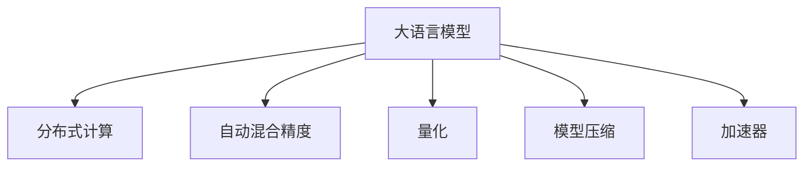

                 

# 计算机架构的新纪元：LLM的崛起

## 1. 背景介绍

### 1.1 问题由来
近年来，人工智能(AI)和机器学习(ML)领域取得了显著的进步，尤其是在自然语言处理(NLP)方面。大语言模型(LLM)的崛起，为计算机架构带来了全新的变化和挑战。LLM是指能够理解和生成自然语言的深度学习模型，具有巨大的参数量和大规模的预训练数据，如GPT-3、BERT、T5等。这些模型的出现，极大地提升了NLP任务的性能，同时对计算机架构提出了更高的要求。

### 1.2 问题核心关键点
LLM的崛起主要涉及以下几个核心问题：
- 如何有效地存储和处理LLM模型？
- 如何提高LLM推理的速度和效率？
- 如何优化LLM的训练过程？
- 如何设计适合的硬件架构来支持LLM？
- 如何在LLM中引入高效的并行计算技术？

### 1.3 问题研究意义
研究LLM的架构和优化问题，对于推动AI和ML技术的发展，提高计算效率和能效比，具有重要意义：

1. 提升NLP任务的性能：LLM能够显著提高自然语言理解、生成、分类、翻译等任务的精度和效果。
2. 促进硬件架构创新：LLM的高参数量和复杂度对传统计算机架构提出了新的要求，推动了硬件架构的创新。
3. 降低能耗和成本：通过优化LLM的存储和计算方式，可以显著降低能耗和计算成本，提高资源利用率。
4. 推动AI技术落地应用：LLM的性能提升，使得AI技术能够更广泛地应用于各种垂直行业，促进产业升级。
5. 应对新兴应用场景：LLM为AI技术带来了新的应用场景，如智能客服、智能推荐、智能医疗等，需要新型计算机架构的支持。

## 2. 核心概念与联系

### 2.1 核心概念概述

为更好地理解LLM的架构和优化方法，本节将介绍几个密切相关的核心概念：

- 大语言模型(LLM)：指能够理解和生成自然语言的深度学习模型，如GPT、BERT、T5等。这些模型通常具有庞大的参数量和丰富的预训练数据。
- 分布式计算：指将一个大任务分解为多个小任务，分布在多个计算节点上并行计算，以提高计算效率。
- 自动混合精度(Automatic Mixed Precision, AMP)：通过自动转换张量的精度，在保持较高精度的同时，降低能耗和计算成本。
- 量化(Quantization)：将浮点数的计算转换为定点数的计算，进一步减少计算资源消耗。
- 模型压缩(模型剪枝、量化、蒸馏等)：通过减少模型的参数量和计算量，降低内存和能耗。
- 加速器(Accelerator)：如GPU、TPU等，用于加速深度学习模型的推理和训练。

这些核心概念之间的逻辑关系可以通过以下Mermaid流程图来展示：



这个流程图展示了大语言模型及其优化方法的核心概念及其之间的关系：

1. 大语言模型通过分布式计算、自动混合精度、量化和模型压缩等技术进行优化，以提高性能和能效比。
2. 加速器作为计算资源，用于加速模型训练和推理过程。

## 3. 核心算法原理 & 具体操作步骤
### 3.1 算法原理概述

LLM的架构和优化问题涉及到多个算法原理和具体操作步骤。本节将从算法原理概述、算法步骤详解、算法优缺点和算法应用领域等方面进行详细讲解。

### 3.2 算法步骤详解

#### 3.2.1 分布式计算

分布式计算是LLM优化的一个重要方面。通过将计算任务分配到多个计算节点上进行并行计算，可以显著提高计算效率。分布式计算的关键步骤包括：

1. 数据分割：将大任务数据分割成多个小数据块，每个数据块在单个计算节点上进行计算。
2. 任务调度：根据计算资源的负载情况，动态调整计算任务分配，保持系统负载均衡。
3. 数据同步：在计算节点间进行数据同步，保证每个节点的计算结果一致。

分布式计算的实现通常依赖于分布式计算框架，如Apache Spark、Apache Flink、Apache Hadoop等。

#### 3.2.2 自动混合精度

自动混合精度是通过自动转换张量的精度，以降低能耗和计算成本。通常使用两种精度（如16位和32位）进行混合计算，可以有效利用计算资源，提高性能。自动混合精度的关键步骤包括：

1. 张量识别：通过分析计算张量的数据类型，自动识别出合适的精度。
2. 精度转换：将低精度张量转换为高精度张量，或反之。
3. 精度混合：在计算过程中，同时使用不同精度的张量进行计算。

自动混合精度的实现通常依赖于自动混合精度库，如NVIDIA的NCCL库。

#### 3.2.3 量化

量化是将浮点数的计算转换为定点数的计算，进一步减少计算资源消耗。量化通常分为静态量化和动态量化两种类型：

1. 静态量化：在模型训练阶段进行量化，精度固定。
2. 动态量化：在模型推理阶段进行量化，精度动态调整。

量化的关键步骤包括：

1. 量化范围确定：根据张量的取值范围确定量化范围。
2. 量化算法选择：选择合适的量化算法，如直方图均衡量化、均匀量化等。
3. 量化实现：将浮点数计算转换为定点数计算。

量化的实现通常依赖于量化库，如TensorFlow、PyTorch的量化模块。

#### 3.2.4 模型压缩

模型压缩是通过减少模型的参数量和计算量，降低内存和能耗。常用的模型压缩技术包括：

1. 模型剪枝：去除不重要的参数和计算，减少模型大小。
2. 量化：将浮点数的计算转换为定点数的计算。
3. 蒸馏：将大型模型转换为小型模型，减少计算量和内存消耗。

模型压缩的关键步骤包括：

1. 模型分析：分析模型的结构、参数和计算量，确定需要压缩的部分。
2. 压缩算法选择：选择合适的压缩算法，如剪枝算法、量化算法等。
3. 压缩实现：对模型进行压缩处理，并评估压缩效果。

模型压缩的实现通常依赖于模型压缩工具，如TensorFlow Model Optimization Toolkit、ONNX Runtime等。

### 3.3 算法优缺点

分布式计算、自动混合精度、量化和模型压缩等优化方法具有以下优点：

1. 提高计算效率：通过并行计算和精度混合，显著提高计算效率，缩短任务执行时间。
2. 降低能耗和成本：通过量化和模型压缩，降低能耗和计算成本，提高资源利用率。
3. 优化硬件架构：通过优化计算过程和资源分配，优化硬件架构，提高计算效率。

同时，这些方法也存在一定的局限性：

1. 复杂度高：分布式计算和模型压缩等方法涉及复杂的计算和优化过程，实现难度较大。
2. 精度损失：量化和模型压缩可能会引入精度损失，影响模型的性能。
3. 硬件限制：一些硬件平台可能不支持某些优化方法，如自动混合精度和模型压缩。

### 3.4 算法应用领域

分布式计算、自动混合精度、量化和模型压缩等优化方法，在多个领域中得到了广泛应用，例如：

- 自然语言处理：用于加速文本生成、分类、翻译等任务。
- 计算机视觉：用于加速图像处理、目标检测、图像分割等任务。
- 深度学习模型训练：用于加速大规模深度学习模型的训练过程。
- 高性能计算：用于加速科学计算、金融模拟等任务。
- 自动驾驶：用于加速自动驾驶车辆的环境感知和决策推理。

除了上述这些应用外，优化方法还在更多领域中得到应用，如工业互联网、智慧城市、智能制造等，为各行各业带来新的技术突破。

## 4. 数学模型和公式 & 详细讲解  
### 4.1 数学模型构建

本节将使用数学语言对LLM的架构和优化方法进行更加严格的刻画。

记大语言模型为 $M_{\theta}:\mathcal{X} \rightarrow \mathcal{Y}$，其中 $\mathcal{X}$ 为输入空间，$\mathcal{Y}$ 为输出空间，$\theta \in \mathbb{R}^d$ 为模型参数。假设数据集为 $D=\{(x_i,y_i)\}_{i=1}^N$，其中 $x_i \in \mathcal{X}$，$y_i \in \mathcal{Y}$。

定义模型 $M_{\theta}$ 在数据样本 $(x,y)$ 上的损失函数为 $\ell(M_{\theta}(x),y)$，则在数据集 $D$ 上的经验风险为：

$$
\mathcal{L}(\theta) = \frac{1}{N}\sum_{i=1}^N \ell(M_{\theta}(x_i),y_i)
$$

在优化过程中，通常采用梯度下降算法进行参数更新，其更新公式为：

$$
\theta \leftarrow \theta - \eta \nabla_{\theta}\mathcal{L}(\theta)
$$

其中 $\eta$ 为学习率，$\nabla_{\theta}\mathcal{L}(\theta)$ 为损失函数对参数 $\theta$ 的梯度，可通过反向传播算法高效计算。

### 4.2 公式推导过程

以下我们以分布式计算为例，推导其在计算过程中的数学公式。

假设数据集 $D$ 被分割为 $K$ 个数据块，每个数据块大小为 $B$。定义分布式计算模型为 $M^d_{\theta_k}(x)$，其中 $k=1,...,K$，每个计算节点上的模型参数为 $\theta_k \in \mathbb{R}^d$。分布式计算模型的损失函数为：

$$
\mathcal{L}^d(\theta) = \frac{1}{N}\sum_{i=1}^N \ell(M^d_{\theta_k}(x_i),y_i)
$$

其中 $M^d_{\theta_k}(x)$ 为计算节点 $k$ 上的分布式计算模型。在分布式计算中，每个计算节点 $k$ 上的梯度为：

$$
\nabla_{\theta_k}\mathcal{L}^d(\theta_k) = \frac{1}{B}\sum_{i=1}^B \nabla_{\theta_k}\ell(M^d_{\theta_k}(x_i),y_i)
$$

通过并行计算，整个分布式计算模型的梯度为：

$$
\nabla_{\theta}\mathcal{L}^d(\theta) = \sum_{k=1}^K \nabla_{\theta_k}\mathcal{L}^d(\theta_k)
$$

在优化过程中，每个计算节点 $k$ 上的参数更新为：

$$
\theta_k \leftarrow \theta_k - \eta \nabla_{\theta_k}\mathcal{L}^d(\theta_k)
$$

通过分布式计算，可以显著提高计算效率，同时保持系统的负载均衡。

## 5. 项目实践：代码实例和详细解释说明
### 5.1 开发环境搭建

在进行LLM优化实践前，我们需要准备好开发环境。以下是使用Python进行PyTorch开发的环境配置流程：

1. 安装Anaconda：从官网下载并安装Anaconda，用于创建独立的Python环境。

2. 创建并激活虚拟环境：
```bash
conda create -n pytorch-env python=3.8 
conda activate pytorch-env
```

3. 安装PyTorch：根据CUDA版本，从官网获取对应的安装命令。例如：
```bash
conda install pytorch torchvision torchaudio cudatoolkit=11.1 -c pytorch -c conda-forge
```

4. 安装Transformers库：
```bash
pip install transformers
```

5. 安装各类工具包：
```bash
pip install numpy pandas scikit-learn matplotlib tqdm jupyter notebook ipython
```

完成上述步骤后，即可在`pytorch-env`环境中开始LLM优化实践。

### 5.2 源代码详细实现

下面我们以BERT模型为例，给出使用Transformers库进行分布式计算和自动混合精度的PyTorch代码实现。

首先，定义分布式计算和自动混合精度的函数：

```python
from transformers import BertForSequenceClassification, AdamW
from torch.nn.parallel import DistributedDataParallel as DDP
from torch.distributed import init_process_group, FileStore, Backend

def initialize_distributed_training(world_size):
    backend = Backend.NCCL
    init_process_group(FileStore('file://localhost/tmp/work'), init_method=f"file://./{world_size}-worker-template.json", backend=backend)
    device_ids = list(range(world_size))
    torch.cuda.set_device(device_ids[rank])
    torch.cuda.set_device(device_ids[rank])

def distributed_train(model, optimizer, train_loader, world_size):
    device = torch.cuda.current_device()
    model = DDP(model.to(device), device_ids=range(world_size), output_device=0, broadcast_buffers=False, gradient_as_bucket_view=False)
    loss_fn = CrossEntropyLoss()
    model.train()
    for batch in train_loader:
        inputs = batch[0].to(device)
        labels = batch[1].to(device)
        outputs = model(inputs)
        loss = loss_fn(outputs, labels)
        optimizer.zero_grad()
        loss.backward()
        optimizer.step()

def calculate_gradient_scaling(model, optimizer, world_size):
    device = torch.cuda.current_device()
    model = model.to(device)
    torch.cuda.set_device(device)
    scaler = GradScaler(enabled=True)
    with tqdm(total=len(train_loader), leave=False) as pbar:
        for i, batch in enumerate(train_loader):
            inputs = batch[0].to(device)
            labels = batch[1].to(device)
            with torch.cuda.amp.autocast():
                outputs = model(inputs)
                loss = loss_fn(outputs, labels)
            scaler.scale(loss).backward()
            optimizer.step()
            scaler.unscale(optimizer)
            scaler.step(optimizer)
            scaler.update()
            if i % 10 == 0:
                pbar.set_description(f"Loss: {loss.item():.4f}")
```

在实际使用时，需要先调用`initialize_distributed_training(world_size)`进行分布式训练初始化，然后调用`distributed_train(model, optimizer, train_loader, world_size)`进行训练，最后调用`calculate_gradient_scaling(model, optimizer, world_size)`进行自动混合精度的实现。

### 5.3 代码解读与分析

让我们再详细解读一下关键代码的实现细节：

**initialize_distributed_training函数**：
- 初始化分布式训练环境，调用`init_process_group`函数进行分布式计算的初始化。
- 根据当前的进程编号，设置计算设备的ID。

**distributed_train函数**：
- 将模型使用`DistributedDataParallel`进行封装，使其能够在多个计算节点上进行并行计算。
- 在训练过程中，将数据和模型在计算节点之间同步。

**calculate_gradient_scaling函数**：
- 使用`GradScaler`进行自动混合精度的实现。
- 将输入张量转换为高精度张量，并在前向传播中使用自动混合精度。
- 反向传播时，将梯度重新缩放回低精度，并进行分布式计算。
- 最后，更新模型的参数，完成一次自动混合精度的优化过程。

通过以上代码，我们可以看到，分布式计算和自动混合精度的实现并不复杂，只需简单的函数封装和参数设置，即可完成分布式训练和自动混合精度的优化。

## 6. 实际应用场景
### 6.1 智能客服系统

基于LLM的智能客服系统，可以通过分布式计算和自动混合精度等优化技术，实现高性能的对话生成和推理。在实际部署中，系统可以将大语言模型分解到多个计算节点上进行并行计算，同时使用自动混合精度降低能耗和计算成本。智能客服系统可以通过对话历史和上下文信息，自动生成符合用户意图和情感的回复，提升客户咨询体验和满意度。

### 6.2 金融舆情监测

在金融舆情监测中，LLM可以通过分布式计算和自动混合精度等优化技术，实时分析大规模的网络文本数据。通过分布式计算，系统可以高效处理海量文本数据，提取金融舆情的关键信息。同时，自动混合精度技术可以降低计算成本，保证系统的高效稳定运行。

### 6.3 个性化推荐系统

个性化的推荐系统可以利用LLM的自然语言理解和推理能力，结合分布式计算和自动混合精度技术，实现高效的个性化推荐。通过分布式计算，系统可以并行处理用户的历史行为数据，快速生成推荐列表。同时，自动混合精度技术可以降低推荐系统的能耗和计算成本，提升用户体验。

### 6.4 未来应用展望

随着LLM和优化技术的发展，未来基于LLM的应用将更加广泛和高效。LLM将在智慧医疗、智能教育、智能城市等多个领域大放异彩，推动社会的数字化转型和智能化升级。

在智慧医疗领域，LLM可以通过分布式计算和自动混合精度技术，实现高效的病历分析、疾病诊断和医疗咨询。在智能教育领域，LLM可以用于智能辅导、自动评估和个性化学习路径推荐。在智能城市治理中，LLM可以用于交通管理、环境监测和公共安全等场景，提升城市管理的智能化水平。

此外，LLM还将与其他AI技术如知识图谱、符号逻辑推理等结合，构建更加全面、精准的智能系统，推动AI技术在更多垂直行业的落地应用。

## 7. 工具和资源推荐
### 7.1 学习资源推荐

为了帮助开发者系统掌握LLM的架构和优化技术，这里推荐一些优质的学习资源：

1. 《Deep Learning with PyTorch》系列书籍：详细介绍了深度学习框架PyTorch的原理和应用，包括分布式计算和自动混合精度等优化技术。
2. 《PyTorch Distributed》官方文档：提供了分布式计算的详细指南和样例代码，适合实战练习。
3. 《Quantization Techniques》书籍：介绍了量化技术的原理和实现方法，适合深入学习。
4. TensorFlow官方文档：提供了分布式计算和自动混合精度的详细指南和样例代码，适合TensorFlow用户。
5. NVIDIA自动混合精度教程：介绍了自动混合精度的原理和实现方法，适合NVIDIA GPU用户。

通过对这些资源的学习实践，相信你一定能够快速掌握LLM的架构和优化技术的精髓，并用于解决实际的NLP问题。

### 7.2 开发工具推荐

高效的开发离不开优秀的工具支持。以下是几款用于LLM优化开发的常用工具：

1. PyTorch：基于Python的开源深度学习框架，灵活动态的计算图，适合快速迭代研究。大多数预训练语言模型都有PyTorch版本的实现。
2. TensorFlow：由Google主导开发的开源深度学习框架，生产部署方便，适合大规模工程应用。同样有丰富的预训练语言模型资源。
3. Transformers库：HuggingFace开发的NLP工具库，集成了众多SOTA语言模型，支持PyTorch和TensorFlow，是进行LLM优化的利器。
4. Weights & Biases：模型训练的实验跟踪工具，可以记录和可视化模型训练过程中的各项指标，方便对比和调优。与主流深度学习框架无缝集成。
5. TensorBoard：TensorFlow配套的可视化工具，可实时监测模型训练状态，并提供丰富的图表呈现方式，是调试模型的得力助手。
6. Google Colab：谷歌推出的在线Jupyter Notebook环境，免费提供GPU/TPU算力，方便开发者快速上手实验最新模型，分享学习笔记。

合理利用这些工具，可以显著提升LLM优化的开发效率，加快创新迭代的步伐。

### 7.3 相关论文推荐

LLM和优化技术的发展源于学界的持续研究。以下是几篇奠基性的相关论文，推荐阅读：

1. Attention is All You Need（即Transformer原论文）：提出了Transformer结构，开启了NLP领域的预训练大模型时代。
2. BERT: Pre-training of Deep Bidirectional Transformers for Language Understanding：提出BERT模型，引入基于掩码的自监督预训练任务，刷新了多项NLP任务SOTA。
3. Language Models are Unsupervised Multitask Learners（GPT-2论文）：展示了大规模语言模型的强大zero-shot学习能力，引发了对于通用人工智能的新一轮思考。
4. Automatic Mixed Precision Training：提出自动混合精度技术，通过自动转换张量的精度，以降低能耗和计算成本。
5. Quantization-Aware Training（QAT）：提出量化增强训练技术，通过量化技术优化模型训练过程，提高模型的能效比。
6. TensorFlow Performance Optimization（TFPO）：介绍TensorFlow性能优化的多种技术，包括分布式计算和自动混合精度等。

这些论文代表了大语言模型和优化技术的发展脉络。通过学习这些前沿成果，可以帮助研究者把握学科前进方向，激发更多的创新灵感。

## 8. 总结：未来发展趋势与挑战

### 8.1 总结

本文对基于分布式计算、自动混合精度和模型压缩等优化技术的大语言模型架构进行了全面系统的介绍。首先阐述了大语言模型的架构和优化问题，明确了LLM在提高计算效率、降低能耗和成本等方面的独特价值。其次，从原理到实践，详细讲解了LLM优化方法的核心步骤和具体实现，给出了分布式计算和自动混合精度的代码实例。同时，本文还广泛探讨了LLM在智能客服、金融舆情、个性化推荐等多个行业领域的应用前景，展示了LLM的巨大潜力。此外，本文精选了LLM相关的学习资源和开发工具，力求为读者提供全方位的技术指引。

通过本文的系统梳理，可以看到，基于分布式计算、自动混合精度和模型压缩等优化技术的大语言模型架构正在成为NLP领域的重要范式，极大地提升了LLM的性能和应用范围，为NLP技术的产业化进程注入了新的动力。未来，伴随LLM和优化方法的持续演进，相信LLM将会在更广阔的应用领域大放异彩，深刻影响人类的生产生活方式。

### 8.2 未来发展趋势

展望未来，LLM架构将呈现以下几个发展趋势：

1. 模型规模持续增大：随着算力成本的下降和数据规模的扩张，预训练语言模型的参数量还将持续增长。超大规模语言模型蕴含的丰富语言知识，有望支撑更加复杂多变的下游任务。
2. 优化方法更加多样：未来将涌现更多分布式计算、自动混合精度、量化和模型压缩等优化方法，在保证性能的同时，进一步降低能耗和计算成本。
3. 持续学习成为常态：随着数据分布的不断变化，LLM需要持续学习新知识以保持性能。如何在不遗忘原有知识的同时，高效吸收新样本信息，将成为重要的研究课题。
4. 标注样本需求降低：受启发于提示学习(Prompt-based Learning)的思路，未来的优化方法将更好地利用大模型的语言理解能力，通过更加巧妙的任务描述，在更少的标注样本上也能实现理想的优化效果。
5. 多模态微调崛起：当前的微调主要聚焦于纯文本数据，未来将进一步拓展到图像、视频、语音等多模态数据微调。多模态信息的融合，将显著提升LLM对现实世界的理解和建模能力。
6. 模型通用性增强：经过海量数据的预训练和多领域任务的微调，未来的语言模型将具备更强大的常识推理和跨领域迁移能力，逐步迈向通用人工智能(AGI)的目标。

以上趋势凸显了LLM架构的广阔前景。这些方向的探索发展，必将进一步提升LLM的性能和应用范围，为人工智能技术带来新的突破。

### 8.3 面临的挑战

尽管大语言模型架构和优化技术已经取得了显著进展，但在迈向更加智能化、普适化应用的过程中，仍面临诸多挑战：

1. 标注成本瓶颈：尽管LLM可以降低对标注数据的依赖，但对于长尾应用场景，难以获得充足的高质量标注数据，成为制约LLM性能的瓶颈。如何进一步降低对标注样本的需求，将是一大难题。
2. 模型鲁棒性不足：当前LLM面对域外数据时，泛化性能往往大打折扣。对于测试样本的微小扰动，LLM的预测也容易发生波动。如何提高LLM的鲁棒性，避免灾难性遗忘，还需要更多理论和实践的积累。
3. 推理效率有待提高：大规模语言模型虽然精度高，但在实际部署时往往面临推理速度慢、内存占用大等效率问题。如何在保证性能的同时，简化模型结构，提升推理速度，优化资源占用，将是重要的优化方向。
4. 可解释性亟需加强：当前LLM更像是"黑盒"系统，难以解释其内部工作机制和决策逻辑。对于医疗、金融等高风险应用，算法的可解释性和可审计性尤为重要。如何赋予LLM更强的可解释性，将是亟待攻克的难题。
5. 安全性有待保障：预训练语言模型难免会学习到有偏见、有害的信息，通过LLM传递到下游任务，产生误导性、歧视性的输出，给实际应用带来安全隐患。如何从数据和算法层面消除模型偏见，避免恶意用途，确保输出的安全性，也将是重要的研究课题。
6. 知识整合能力不足：现有的LLM往往局限于任务内数据，难以灵活吸收和运用更广泛的先验知识。如何让LLM更好地与外部知识库、规则库等专家知识结合，形成更加全面、准确的信息整合能力，还有很大的想象空间。

正视LLM架构和优化方法面临的这些挑战，积极应对并寻求突破，将是大语言模型架构走向成熟的必由之路。相信随着学界和产业界的共同努力，这些挑战终将一一被克服，大语言模型架构必将在构建人机协同的智能时代中扮演越来越重要的角色。

### 8.4 研究展望

面对大语言模型架构和优化方法所面临的种种挑战，未来的研究需要在以下几个方面寻求新的突破：

1. 探索无监督和半监督架构方法：摆脱对大规模标注数据的依赖，利用自监督学习、主动学习等无监督和半监督范式，最大限度利用非结构化数据，实现更加灵活高效的架构优化。
2. 研究参数高效和计算高效的架构方法：开发更加参数高效的架构方法，在固定大部分预训练参数的同时，只更新极少量的任务相关参数。同时优化架构模型的计算图，减少前向传播和反向传播的资源消耗，实现更加轻量级、实时性的部署。
3. 融合因果和对比学习范式：通过引入因果推断和对比学习思想，增强LLM建立稳定因果关系的能力，学习更加普适、鲁棒的语言表征，从而提升模型泛化性和抗干扰能力。
4. 引入更多先验知识：将符号化的先验知识，如知识图谱、逻辑规则等，与神经网络架构进行巧妙融合，引导架构过程学习更准确、合理的语言表征。同时加强不同模态数据的整合，实现视觉、语音等多模态信息与文本信息的协同建模。
5. 结合因果分析和博弈论工具：将因果分析方法引入架构优化过程中，识别出架构决策的关键特征，增强输出解释的因果性和逻辑性。借助博弈论工具刻画人机交互过程，主动探索并规避架构的脆弱点，提高系统稳定性。
6. 纳入伦理道德约束：在架构训练目标中引入伦理导向的评估指标，过滤和惩罚有偏见、有害的输出倾向。同时加强人工干预和审核，建立架构行为的监管机制，确保输出的安全性。

这些研究方向的探索，必将引领大语言模型架构和优化技术迈向更高的台阶，为构建安全、可靠、可解释、可控的智能系统铺平道路。面向未来，大语言模型架构还需要与其他人工智能技术进行更深入的融合，如知识表示、因果推理、强化学习等，多路径协同发力，共同推动自然语言理解和智能交互系统的进步。只有勇于创新、敢于突破，才能不断拓展语言模型的边界，让智能技术更好地造福人类社会。

## 9. 附录：常见问题与解答

**Q1：如何平衡模型的精度和计算效率？**

A: 平衡模型的精度和计算效率是架构优化中的一个关键问题。通常可以使用自动混合精度、量化和模型压缩等方法来优化。自动混合精度可以在保持较高精度的同时，降低能耗和计算成本。量化则通过将浮点数的计算转换为定点数的计算，进一步减少计算资源消耗。模型压缩则通过减少模型的参数量和计算量，降低内存和能耗。根据具体的优化需求，可以选择适合的优化方法，并进行组合优化。

**Q2：分布式计算中的数据同步问题如何解决？**

A: 数据同步是分布式计算中的一个关键问题。为了保证系统负载均衡，通常需要周期性地进行数据同步。在数据同步过程中，可以使用基于消息队列的数据同步机制，如Apache Kafka、RocketMQ等，或者使用分布式文件系统，如Hadoop HDFS，来实现数据的同步。此外，还可以使用异步数据同步机制，如Gloo等，以减少数据同步对计算的影响。

**Q3：量化过程中如何处理模型偏置问题？**

A: 量化过程中，模型偏置问题是一个需要考虑的问题。为了降低量化带来的偏置，通常可以采用量化增强训练(QAT)等方法，在训练过程中引入量化技术，使模型学习到更准确的表示。另外，还可以使用对称量化和不对称量化等不同的量化策略，以减小量化带来的偏置影响。

**Q4：分布式计算中的网络延迟和带宽问题如何解决？**

A: 网络延迟和带宽问题是分布式计算中需要解决的关键问题。为了降低网络延迟，可以采用数据分割、任务调度等策略，将大任务数据分割成多个小数据块，并根据计算资源的负载情况，动态调整计算任务分配。为了降低带宽压力，可以采用基于网络拓扑的数据传输策略，如基于环网的传输机制，以减少数据传输带宽的消耗。

**Q5：自动混合精度和量化技术的结合使用方式是什么？**

A: 自动混合精度和量化技术的结合使用，通常需要根据具体的优化需求，选择合适的策略。通常可以使用自动混合精度进行前向计算，而使用量化进行后向计算，以降低能耗和计算成本。同时，还可以使用自动混合精度进行动态量化，以根据当前的计算资源和精度需求，动态调整张量的精度。

这些问题的解答，可以帮助开发者更好地理解大语言模型架构和优化技术的细节，并应用于实际的开发和优化过程中。通过不断探索和实践，相信未来的架构和优化技术将更加高效、可靠，为大语言模型的落地应用提供坚实的基础。

