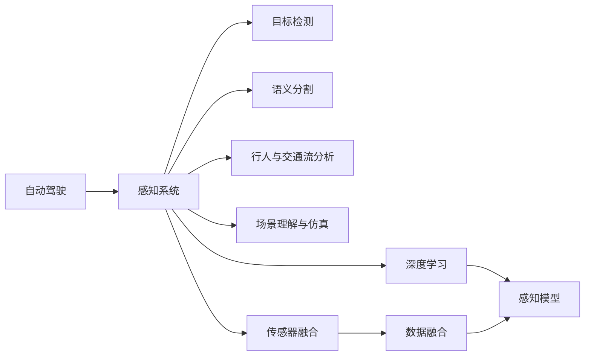

                 

# 计算机视觉在自动驾驶中的应用

> 关键词：自动驾驶,计算机视觉,感知系统,传感器融合,目标检测,语义分割,感知任务,图像处理,深度学习

## 1. 背景介绍

### 1.1 问题由来
随着人工智能和计算机视觉技术的飞速发展，自动驾驶技术已成为新一代智能交通系统的核心驱动力之一。自动驾驶系统通过融合多种传感器数据，利用先进的计算机视觉技术，实现车辆在复杂交通环境下的自主导航、避障、停车等功能。近年来，基于计算机视觉的自动驾驶感知系统已经取得了显著进展，成为实现自动驾驶的关键技术之一。

计算机视觉在自动驾驶中的应用主要体现在以下几个方面：
- **目标检测与识别**：识别和定位道路上的车辆、行人、交通信号灯等对象，为决策提供基础信息。
- **语义分割**：将道路场景分割成不同的语义区域，理解道路结构，为行驶路径规划提供信息。
- **行人与交通流分析**：分析行人行为和交通流，预测潜在危险，为驾驶决策提供支持。
- **场景理解与仿真**：通过场景理解与仿真技术，提前预测车辆行为，提高驾驶安全性。
- **激光雷达与摄像头融合**：结合不同传感器的数据，提高感知系统的鲁棒性和准确性。

自动驾驶系统对计算机视觉技术的依赖度非常高，特别是感知系统部分，计算机视觉技术起着至关重要的作用。随着技术的不断进步，基于计算机视觉的自动驾驶感知系统已经逐步从实验室走向实际应用，为实现安全、高效的自动驾驶提供了有力支持。

### 1.2 问题核心关键点
计算机视觉在自动驾驶中的应用主要涉及以下几个关键点：
- **传感器融合**：将激光雷达、摄像头、雷达等不同传感器数据融合，提升感知系统的鲁棒性和精度。
- **深度学习技术**：利用深度学习模型进行目标检测、语义分割、行人分析等感知任务，提高系统的智能化水平。
- **硬件加速**：通过专用硬件如GPU、TPU等进行加速，提高计算机视觉任务的计算效率。
- **实时性要求**：感知系统需要在毫秒级时间内完成数据处理，以应对复杂多变的交通场景。
- **环境适应性**：确保在各种天气和光照条件下，感知系统仍能保持稳定的性能。
- **安全性考量**：感知系统的输出必须保证高可靠性，避免误判带来的安全隐患。

这些关键点共同构成了计算机视觉在自动驾驶中应用的总体框架，确保了自动驾驶系统能够在各种复杂环境下正常运行，实现安全、高效的驾驶体验。

## 2. 核心概念与联系

### 2.1 核心概念概述

为了更好地理解计算机视觉在自动驾驶中的应用，本节将介绍几个密切相关的核心概念：

- **自动驾驶**：利用计算机视觉、传感器融合、人工智能等技术，实现车辆在无人工干预下的自主导航和驾驶。
- **感知系统**：自动驾驶中的核心模块之一，负责通过多种传感器获取道路环境信息，并进行数据处理和融合。
- **目标检测**：识别道路上的物体，包括车辆、行人、交通信号等，是自动驾驶中的基础感知任务。
- **语义分割**：将道路场景分割成不同的语义区域，如道路、车道、行人区等，为行驶路径规划提供信息。
- **行人与交通流分析**：分析行人和车辆的行为和流量，预测潜在危险，为驾驶决策提供支持。
- **场景理解与仿真**：通过场景理解与仿真技术，预测车辆行为，提高驾驶安全性。
- **传感器融合**：将激光雷达、摄像头、雷达等不同传感器数据融合，提升感知系统的鲁棒性和精度。
- **深度学习**：利用深度学习模型进行感知任务，提高系统的智能化水平。
- **实时性**：感知系统需要在毫秒级时间内完成数据处理，以应对复杂多变的交通场景。

这些核心概念之间的逻辑关系可以通过以下Mermaid流程图来展示：



这个流程图展示了一个典型的自动驾驶感知系统框架，其中感知系统是核心，通过目标检测、语义分割、行人与交通流分析等模块实现对道路环境的全面感知。深度学习模型和传感器融合技术为这些模块提供支持，确保系统能够在各种条件下正常工作。

## 3. 核心算法原理 & 具体操作步骤

### 3.1 算法原理概述

计算机视觉在自动驾驶中的应用主要通过以下几个步骤实现：
1. **传感器数据获取**：通过摄像头、激光雷达、雷达等传感器获取道路环境信息。
2. **数据预处理**：对传感器数据进行去噪、归一化等处理，提升数据质量。
3. **特征提取**：利用计算机视觉技术，如卷积神经网络（CNN）等，提取道路环境的关键特征。
4. **目标检测与识别**：使用深度学习模型进行目标检测，识别道路上的车辆、行人等对象。
5. **语义分割**：使用语义分割模型将道路场景分割成不同的语义区域，理解道路结构。
6. **行人与交通流分析**：分析行人和车辆的行为和流量，预测潜在危险。
7. **场景理解与仿真**：通过场景理解与仿真技术，预测车辆行为，提高驾驶安全性。
8. **传感器数据融合**：将不同传感器数据融合，提升感知系统的鲁棒性和精度。
9. **模型优化**：通过不断优化模型参数，提高系统的性能和稳定性。

### 3.2 算法步骤详解

计算机视觉在自动驾驶中的应用，一般包括以下几个关键步骤：

**Step 1: 传感器数据获取**
- 通过摄像头、激光雷达、雷达等传感器获取道路环境信息。
- 摄像头用于获取道路上的图像信息，激光雷达和雷达用于获取道路上的点云和距离信息。
- 传感器数据需要进行同步和校准，以确保数据的一致性和准确性。

**Step 2: 数据预处理**
- 对传感器数据进行去噪、归一化等处理，提升数据质量。
- 去除数据中的噪声和干扰信号，提高数据的清晰度。
- 对数据进行标准化处理，如归一化、直方图均衡化等，提升数据对比度。

**Step 3: 特征提取**
- 利用计算机视觉技术，如卷积神经网络（CNN）等，提取道路环境的关键特征。
- CNN可以通过多层次的卷积和池化操作，捕捉道路场景的局部和全局特征。
- 特征提取的深度和宽度可以根据具体任务需求进行调整。

**Step 4: 目标检测与识别**
- 使用深度学习模型进行目标检测，识别道路上的车辆、行人等对象。
- 常用的目标检测模型包括YOLO、Faster R-CNN、SSD等。
- 目标检测需要训练深度神经网络，通过标注的数据集进行监督学习。

**Step 5: 语义分割**
- 使用语义分割模型将道路场景分割成不同的语义区域，理解道路结构。
- 常用的语义分割模型包括U-Net、DeepLab等。
- 语义分割需要在大量标注的数据上进行训练，以学习道路场景的语义结构。

**Step 6: 行人与交通流分析**
- 分析行人和车辆的行为和流量，预测潜在危险。
- 常用的行人检测和交通流模型包括DPM、FlowNet等。
- 这些模型需要学习行人和车辆的行为模式，并进行流量预测。

**Step 7: 场景理解与仿真**
- 通过场景理解与仿真技术，预测车辆行为，提高驾驶安全性。
- 常用的场景理解与仿真模型包括SimNet、EgoNet等。
- 这些模型需要学习道路场景中的交通规则和行为规律，进行行为预测和仿真。

**Step 8: 传感器数据融合**
- 将不同传感器数据融合，提升感知系统的鲁棒性和精度。
- 常用的传感器融合方法包括卡尔曼滤波、粒子滤波等。
- 传感器数据融合需要考虑不同传感器的特性和精度，进行加权和融合。

**Step 9: 模型优化**
- 通过不断优化模型参数，提高系统的性能和稳定性。
- 常用的优化方法包括梯度下降、Adam等。
- 模型优化需要结合具体任务需求进行调整，避免过拟合和欠拟合。

### 3.3 算法优缺点

计算机视觉在自动驾驶中的应用具有以下优点：
1. **感知能力强大**：通过多种传感器数据融合，提升感知系统的鲁棒性和精度。
2. **智能化水平高**：利用深度学习模型进行目标检测、语义分割等任务，提高系统的智能化水平。
3. **实时性强**：通过硬件加速和优化算法，确保感知系统在毫秒级时间内完成数据处理。
4. **环境适应性高**：能够在各种天气和光照条件下保持稳定的性能。
5. **安全性高**：通过场景理解与仿真技术，提前预测车辆行为，提高驾驶安全性。

同时，该方法也存在一些缺点：
1. **成本高**：传感器和硬件设备的成本较高，增加了系统开发的经济负担。
2. **算法复杂**：深度学习模型和传感器融合算法较为复杂，需要较高的技术门槛。
3. **数据依赖性强**：需要大量高质量标注数据进行训练，数据获取成本较高。
4. **计算资源需求大**：深度学习模型和传感器数据处理需要大量的计算资源，硬件要求较高。
5. **对抗攻击易感性**：深度学习模型容易受到对抗样本攻击，影响系统安全性。

尽管存在这些缺点，但计算机视觉在自动驾驶中的应用仍是大势所趋，未来需要从算法、硬件和数据等多个方面进行优化，以实现更高的性能和更低的成本。

### 3.4 算法应用领域

计算机视觉在自动驾驶中的应用已经涵盖了多个领域，主要包括以下几个方面：
- **智能驾驶辅助系统**：通过计算机视觉技术，实现车道保持、自适应巡航、自动泊车等功能。
- **事故预警系统**：通过检测车辆间的距离和速度，预测潜在碰撞危险，实现事故预警。
- **路况识别系统**：通过识别道路标志和路面状况，提供路况信息，辅助驾驶员做出决策。
- **自动避障系统**：通过检测障碍物的形状和位置，实现自动避障。
- **交通信号识别系统**：通过识别交通信号，实现交通信号的自动判断和响应。

计算机视觉在自动驾驶中的应用已经初见成效，未来有望在更多的领域得到广泛应用，推动自动驾驶技术的进一步发展。

## 4. 数学模型和公式 & 详细讲解  
### 4.1 数学模型构建

为了更好地理解计算机视觉在自动驾驶中的应用，本节将通过数学语言对相关模型进行更加严格的刻画。

记摄像头捕捉到的道路图像为 $I$，激光雷达检测到的点云数据为 $L$，雷达检测到的距离数据为 $R$。假设图像 $I$ 的大小为 $H\times W$，像素值为 $[0,255]$。

定义图像特征提取网络为 $F$，目标检测模型为 $D$，语义分割模型为 $S$，行人与交通流分析模型为 $F$，场景理解与仿真模型为 $G$。传感器数据融合模型为 $H$。

**目标检测模型 $D$**：假设输入图像 $I$ 和激光雷达点云数据 $L$，输出目标位置和类别 $T$。则目标检测模型可以表示为：

$$
T = D(I, L)
$$

**语义分割模型 $S$**：假设输入图像 $I$，输出道路场景的语义分割结果 $M$。则语义分割模型可以表示为：

$$
M = S(I)
$$

**行人与交通流分析模型 $F$**：假设输入图像 $I$ 和雷达距离数据 $R$，输出行人与车辆的行为和流量信息 $P$。则行人与交通流分析模型可以表示为：

$$
P = F(I, R)
$$

**场景理解与仿真模型 $G$**：假设输入图像 $I$，输出道路场景的理解和仿真结果 $U$。则场景理解与仿真模型可以表示为：

$$
U = G(I)
$$

**传感器数据融合模型 $H$**：假设输入摄像头图像 $I$、激光雷达点云数据 $L$ 和雷达距离数据 $R$，输出融合后的传感器数据 $F$。则传感器数据融合模型可以表示为：

$$
F = H(I, L, R)
$$

### 4.2 公式推导过程

以下我们以目标检测模型为例，推导其损失函数及其梯度的计算公式。

假设目标检测模型 $D$ 在输入图像 $I$ 和激光雷达点云数据 $L$ 上的输出为 $T$，表示目标位置和类别。真实标签 $T_{real}$ 为 $[(x_i, y_i, c_i)]$ 形式，其中 $x_i$、$y_i$ 为目标位置坐标，$c_i$ 为目标类别。

定义目标检测模型的损失函数为交叉熵损失，其表达式为：

$$
\ell(D) = -\frac{1}{N}\sum_{i=1}^N \sum_{c \in \mathcal{C}} p_c(T_{real})\log p_c(T)
$$

其中 $\mathcal{C}$ 为所有可能的类别集合，$p_c(T)$ 为模型在类别 $c$ 上的预测概率。

根据链式法则，损失函数对模型参数 $\theta$ 的梯度为：

$$
\frac{\partial \ell(D)}{\partial \theta} = -\frac{1}{N}\sum_{i=1}^N \sum_{c \in \mathcal{C}} p_c(T_{real})\frac{\partial \log p_c(T)}{\partial T} \frac{\partial T}{\partial \theta}
$$

其中 $\frac{\partial \log p_c(T)}{\partial T}$ 为模型对目标位置的预测误差，$\frac{\partial T}{\partial \theta}$ 为模型对目标位置和类别的预测与真实标签的误差。

在得到损失函数的梯度后，即可带入参数更新公式，完成模型的迭代优化。重复上述过程直至收敛，最终得到适应自动驾驶感知任务的最优模型参数 $\theta^*$。

## 5. 项目实践：代码实例和详细解释说明

### 5.1 开发环境搭建

在进行自动驾驶感知系统开发前，我们需要准备好开发环境。以下是使用Python进行TensorFlow和Keras开发的环境配置流程：

1. 安装Anaconda：从官网下载并安装Anaconda，用于创建独立的Python环境。

2. 创建并激活虚拟环境：
```bash
conda create -n auto_driver_env python=3.8 
conda activate auto_driver_env
```

3. 安装TensorFlow：根据CUDA版本，从官网获取对应的安装命令。例如：
```bash
conda install tensorflow tensorflow-gpu=2.7 -c pytorch -c conda-forge
```

4. 安装Keras：
```bash
pip install keras
```

5. 安装各类工具包：
```bash
pip install numpy pandas scikit-learn matplotlib tqdm jupyter notebook ipython
```

完成上述步骤后，即可在`auto_driver_env`环境中开始自动驾驶感知系统的开发。

### 5.2 源代码详细实现

下面我们以自动驾驶中的目标检测为例，给出使用TensorFlow和Keras进行目标检测的代码实现。

首先，定义目标检测的数据处理函数：

```python
from tensorflow.keras.preprocessing.image import ImageDataGenerator

def preprocess_input(image):
    image = image / 255.0  # 标准化
    image = image - 0.5  # 均值中心化
    image = image / 0.5  # 归一化
    return image

def preprocess_label(label):
    label = label.astype(int)  # 类型转换
    label = label / 255.0  # 标准化
    return label

def preprocess_dataset(dataset):
    train_generator = ImageDataGenerator(rescale=1./255, 
                                        shear_range=0.2, 
                                        zoom_range=0.2, 
                                        horizontal_flip=True)
    test_generator = ImageDataGenerator(rescale=1./255)
    train_dataset = train_generator.flow_from_directory(dataset['train'], 
                                                      target_size=(224, 224), 
                                                      batch_size=32, 
                                                      class_mode='categorical')
    test_dataset = test_generator.flow_from_directory(dataset['test'], 
                                                    target_size=(224, 224), 
                                                    batch_size=32, 
                                                    class_mode='categorical')
    return train_dataset, test_dataset
```

然后，定义目标检测模型：

```python
from tensorflow.keras.applications.resnet50 import ResNet50
from tensorflow.keras.layers import Dense, GlobalAveragePooling2D

def build_model(input_shape, num_classes):
    base_model = ResNet50(weights='imagenet', include_top=False, input_shape=input_shape)
    x = base_model.output
    x = GlobalAveragePooling2D()(x)
    x = Dense(1024, activation='relu')(x)
    x = Dense(num_classes, activation='softmax')(x)
    model = Model(inputs=base_model.input, outputs=x)
    return model
```

接着，定义训练和评估函数：

```python
from tensorflow.keras import optimizers

def train_model(model, train_dataset, test_dataset, num_epochs):
    model.compile(optimizer=optimizers.Adam(learning_rate=0.001), 
                  loss='categorical_crossentropy', 
                  metrics=['accuracy'])
    model.fit(train_dataset, epochs=num_epochs, 
              validation_data=test_dataset)
    test_loss, test_acc = model.evaluate(test_dataset)
    print(f'Test accuracy: {test_acc}')
    
def evaluate_model(model, test_dataset):
    test_loss, test_acc = model.evaluate(test_dataset)
    print(f'Test accuracy: {test_acc}')
```

最后，启动训练流程并在测试集上评估：

```python
input_shape = (224, 224, 3)
num_classes = 10

model = build_model(input_shape, num_classes)
model.summary()

train_dataset, test_dataset = preprocess_dataset(dataset)
train_model(model, train_dataset, test_dataset, 10)

evaluate_model(model, test_dataset)
```

以上就是使用TensorFlow和Keras进行目标检测的完整代码实现。可以看到，通过TensorFlow的Keras API，我们可以用相对简洁的代码完成目标检测模型的训练和评估。

### 5.3 代码解读与分析

让我们再详细解读一下关键代码的实现细节：

**preprocess_input函数**：
- 对输入图像进行标准化、均值中心化和归一化处理，以便后续模型训练。

**preprocess_label函数**：
- 对标签进行类型转换和标准化处理，以便模型进行预测。

**preprocess_dataset函数**：
- 定义了图像数据生成器，用于对训练集和测试集进行预处理和批次生成。

**build_model函数**：
- 构建了一个基于ResNet50的网络结构，用于目标检测。该网络包含一个全局平均池化层和一个全连接层。

**train_model函数**：
- 定义了模型训练过程，包括编译模型、设置损失函数和优化器，并使用fit方法进行训练。

**evaluate_model函数**：
- 定义了模型评估过程，使用evaluate方法在测试集上计算准确率。

**train_model函数**：
- 定义了模型训练过程，包括编译模型、设置损失函数和优化器，并使用fit方法进行训练。

可以看到，TensorFlow和Keras的API设计简洁高效，便于开发者进行模型构建和训练。然而，工业级的系统实现还需考虑更多因素，如模型的保存和部署、超参数的自动搜索、更灵活的任务适配层等。但核心的模型训练流程基本与此类似。

## 6. 实际应用场景

### 6.1 智能驾驶辅助系统

智能驾驶辅助系统是计算机视觉在自动驾驶中应用的重要领域之一。通过计算机视觉技术，实现车道保持、自适应巡航、自动泊车等功能，大大提升了驾驶的舒适度和安全性。

在技术实现上，可以收集大量的驾驶数据，如车道线、交通标志、车辆轨迹等，并将其标注成训练集。在此基础上，对预训练的目标检测和语义分割模型进行微调，使其能够准确识别道路上的各种对象和结构。将微调后的模型集成到智能驾驶辅助系统中，便可以实现车道保持、自适应巡航、自动泊车等功能。

### 6.2 事故预警系统

事故预警系统是计算机视觉在自动驾驶中应用的另一重要领域。通过计算机视觉技术，实时检测车辆间的距离和速度，预测潜在碰撞危险，实现事故预警。

在技术实现上，可以收集大量的交通事故数据，并将其标注成训练集。在此基础上，对预训练的目标检测和行人与交通流分析模型进行微调，使其能够实时检测车辆和行人，并进行行为预测。将微调后的模型集成到事故预警系统中，便可以实现实时检测和预警功能，有效减少交通事故的发生。

### 6.3 路况识别系统

路况识别系统是计算机视觉在自动驾驶中应用的重要组成部分。通过计算机视觉技术，实时检测道路状况，如交通信号、路面标记、道路标志等，提供路况信息，辅助驾驶员做出决策。

在技术实现上，可以收集大量的道路状况数据，并将其标注成训练集。在此基础上，对预训练的语义分割和场景理解与仿真模型进行微调，使其能够准确识别道路上的各种对象和结构。将微调后的模型集成到路况识别系统中，便可以实现实时检测和信息提供功能，有效提升驾驶的安全性和舒适性。

### 6.4 未来应用展望

随着计算机视觉技术的不断发展，未来在自动驾驶中应用将更加广泛和深入。以下是一些可能的应用场景：

- **智能交通管理**：通过计算机视觉技术，实时监测交通流量，优化交通信号灯控制，减少交通拥堵。
- **智能交通指挥**：通过计算机视觉技术，实时监测交通状况，辅助交通管理人员进行指挥调度。
- **智能车辆维护**：通过计算机视觉技术，实时检测车辆部件状态，辅助维护人员进行维修保养。
- **智能车辆设计**：通过计算机视觉技术，辅助设计师进行车辆外形设计和内饰设计。
- **智能车辆交互**：通过计算机视觉技术，实现驾驶员与车辆之间的自然交互，提升驾驶体验。

未来，随着计算机视觉技术的不断发展，其在自动驾驶中的应用将更加广泛和深入，为实现安全、高效的自动驾驶提供有力支持。

## 7. 工具和资源推荐
### 7.1 学习资源推荐

为了帮助开发者系统掌握计算机视觉在自动驾驶中的应用，这里推荐一些优质的学习资源：

1. 《深度学习》系列书籍：由深度学习领域的权威专家撰写，系统讲解了深度学习的基本原理和应用。
2. 《计算机视觉：算法与应用》课程：斯坦福大学开设的计算机视觉课程，涵盖了计算机视觉的基本概念和技术。
3. 《TensorFlow官方文档》：TensorFlow官方文档，提供了丰富的API接口和样例代码，是学习TensorFlow的重要资源。
4. 《Keras官方文档》：Keras官方文档，提供了Keras的基本使用和高级技巧，是学习Keras的重要资源。
5. 《AutoDrive论文集》：Autonomous Driving论文集，收录了自动驾驶领域的前沿研究成果，是了解最新进展的重要资源。

通过对这些资源的学习实践，相信你一定能够快速掌握计算机视觉在自动驾驶中的应用，并用于解决实际的自动驾驶问题。

### 7.2 开发工具推荐

高效的开发离不开优秀的工具支持。以下是几款用于自动驾驶感知系统开发的常用工具：

1. TensorFlow：由Google主导开发的开源深度学习框架，生产部署方便，适合大规模工程应用。提供了丰富的预训练模型和高效的深度学习API。
2. Keras：基于TensorFlow等框架开发的高级深度学习API，简单易用，适合快速迭代研究。
3. OpenCV：开源计算机视觉库，提供了丰富的图像处理和计算机视觉算法，适合进行图像预处理和特征提取。
4. PyTorch：基于Python的开源深度学习框架，灵活性高，适合快速迭代研究。
5. Caffe：开源深度学习框架，适合高性能计算，适合大规模模型训练。
6. Fast R-CNN：高效的深度学习目标检测框架，适合实时目标检测和识别。

合理利用这些工具，可以显著提升自动驾驶感知系统的开发效率，加快创新迭代的步伐。

### 7.3 相关论文推荐

计算机视觉在自动驾驶中的应用源于学界的持续研究。以下是几篇奠基性的相关论文，推荐阅读：

1. R-CNN: Rich feature hierarchies for accurate object detection and semantic segmentation：提出基于区域卷积神经网络的物体检测和语义分割方法，是目标检测领域的重要里程碑。
2. Faster R-CNN: Towards real-time object detection with region proposal networks：提出基于区域提议网络的快速目标检测方法，提高了目标检测的速度和精度。
3. SSD: Single shot multi-box detector：提出单阶段目标检测方法，提高了目标检测的速度和精度。
4. DeepLab: Semantic image segmentation with deep convolutional nets, atrous convolution, and fully connected crfs：提出基于深度卷积网络和空洞卷积的目标语义分割方法，提高了语义分割的精度和鲁棒性。
5. Scene Understanding with Scene-Level Classifier Graphs：提出基于场景级分类图的方法，提高了场景理解和仿真的精度和鲁棒性。

这些论文代表了大规模计算机视觉模型和算法的最新进展，通过学习这些前沿成果，可以帮助研究者把握学科前进方向，激发更多的创新灵感。

## 8. 总结：未来发展趋势与挑战

### 8.1 总结

本文对计算机视觉在自动驾驶中的应用进行了全面系统的介绍。首先阐述了计算机视觉在自动驾驶中的背景和重要性，明确了感知系统在自动驾驶中的核心地位。其次，从原理到实践，详细讲解了目标检测、语义分割、行人与交通流分析等关键感知任务的数学模型和计算过程，给出了具体的代码实现。同时，本文还广泛探讨了计算机视觉在智能驾驶辅助系统、事故预警系统、路况识别系统等实际应用场景中的广泛应用，展示了计算机视觉技术的强大能力。

通过本文的系统梳理，可以看到，计算机视觉在自动驾驶中的应用已经深入各个环节，为自动驾驶系统的开发提供了强有力的技术支持。未来，随着计算机视觉技术的不断进步，基于计算机视觉的自动驾驶感知系统必将在更多领域得到应用，推动自动驾驶技术的进一步发展。

### 8.2 未来发展趋势

展望未来，计算机视觉在自动驾驶中的应用将呈现以下几个发展趋势：

1. **深度学习模型的发展**：随着深度学习模型的不断进步，目标检测、语义分割等任务的性能将进一步提升，计算机视觉在自动驾驶中的应用也将更加广泛和深入。
2. **传感器融合技术的提升**：未来的传感器融合技术将更加复杂和高效，能够在各种天气和光照条件下保证系统的鲁棒性和精度。
3. **硬件加速的突破**：未来的硬件加速技术将更加强大和普及，能够在毫秒级时间内完成大规模图像和点云数据的处理。
4. **场景理解的提升**：未来的场景理解与仿真技术将更加精确和全面，能够更好地理解道路场景，预测车辆行为，提升驾驶安全性。
5. **多模态数据的应用**：未来的计算机视觉系统将更好地融合视觉、雷达、激光雷达等多模态数据，提升系统的性能和鲁棒性。
6. **联邦学习的应用**：未来的自动驾驶系统将采用联邦学习等技术，保护数据隐私，提升数据利用效率。
7. **边缘计算的引入**：未来的自动驾驶系统将引入边缘计算技术，实现数据的高效处理和实时响应。

以上趋势凸显了计算机视觉在自动驾驶中的广阔前景。这些方向的探索发展，必将进一步提升自动驾驶系统的性能和可靠性，为实现安全、高效的自动驾驶提供有力支持。

### 8.3 面临的挑战

尽管计算机视觉在自动驾驶中的应用已经取得了显著进展，但在迈向更加智能化、普适化应用的过程中，它仍面临着诸多挑战：

1. **数据依赖性强**：计算机视觉系统需要大量高质量标注数据进行训练，数据获取成本较高。如何降低数据依赖，提高数据利用效率，是一个重要的问题。
2. **算法复杂度高**：深度学习模型和传感器融合算法较为复杂，需要较高的技术门槛。如何降低算法复杂度，提升系统开发效率，是一个重要的研究方向。
3. **硬件资源需求大**：计算机视觉系统需要高性能计算资源，硬件成本较高。如何降低硬件成本，提升系统可靠性，是一个重要的研究方向。
4. **鲁棒性不足**：计算机视觉系统在各种天气和光照条件下，鲁棒性不足。如何提升系统的鲁棒性，避免环境干扰，是一个重要的研究方向。
5. **安全性问题**：计算机视觉系统容易受到对抗样本攻击，影响系统安全性。如何提高系统的安全性，避免误判和攻击，是一个重要的研究方向。
6. **实时性问题**：计算机视觉系统需要在毫秒级时间内完成数据处理，硬件资源和算法优化是其关键。如何提升系统的实时性，实现实时响应，是一个重要的研究方向。

这些挑战凸显了计算机视觉在自动驾驶中的复杂性和挑战性，需要学界和产业界的共同努力，不断进行技术创新和优化。

### 8.4 研究展望

未来，计算机视觉在自动驾驶中的应用仍需从多个方面进行深入研究，以解决当前面临的问题，提升系统的性能和可靠性。以下是几个可能的研究方向：

1. **轻量级模型研究**：研究轻量级深度学习模型，提升模型的计算效率和实时性，适应移动设备和边缘计算环境。
2. **高效传感器融合技术**：研究高效的传感器融合技术，提升系统的鲁棒性和精度，适应各种复杂的道路环境。
3. **联邦学习技术**：研究联邦学习等技术，保护数据隐私，提升数据利用效率，适应多方合作和隐私保护需求。
4. **边缘计算技术**：研究边缘计算技术，实现数据的高效处理和实时响应，适应高带宽低延时的通信环境。
5. **对抗样本攻击防护**：研究对抗样本攻击防护技术，提高系统的安全性，避免误判和攻击。
6. **实时性优化技术**：研究实时性优化技术，提升系统的计算效率和响应速度，适应实时驾驶需求。
7. **场景理解与仿真技术**：研究场景理解与仿真技术，提高系统的场景理解能力和行为预测能力，提升驾驶安全性。

这些研究方向将推动计算机视觉在自动驾驶中的应用进一步深化，为实现安全、高效的自动驾驶提供新的突破。未来，随着计算机视觉技术的不断发展，基于计算机视觉的自动驾驶系统必将在更多领域得到应用，推动自动驾驶技术的进一步发展。

