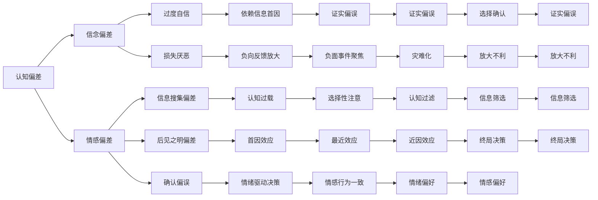

                 

# 认知偏差：影响决策的隐形力量

> 关键词：认知偏差,决策过程,神经科学,行为经济学,人工智能

## 1. 背景介绍

### 1.1 问题由来

人类决策过程远非我们想象中那么简单，大脑在快速、复杂的环境中做出的选择，往往受到多种因素的影响。认知偏差(Cognitive Biases)正是这些影响因素中最为常见的一种，它使得我们的决策过程出现系统性的误差，影响着商业、医疗、法律、金融等各个领域的行为结果。认知偏差的探讨，不仅关系到人类心理学研究，也成为人工智能领域特别是决策支持系统的研究热点。

### 1.2 问题核心关键点

理解认知偏差，对于提升决策系统的智能水平具有重要意义：

1. **识别与纠正**：通过识别和理解认知偏差，可以更准确地预测决策结果，为系统提供更具指导性的信息。
2. **行为改进**：通过干预认知偏差，可以提高人类的行为效率和决策质量。
3. **技术应用**：在大数据和人工智能技术支持下，通过模型学习人类的认知偏差，可以开发出更智能的决策支持系统。

## 2. 核心概念与联系

### 2.1 核心概念概述

认知偏差(Cognitive Biases)是指在判断和决策过程中，由于心理因素或信息处理方式导致的系统性错误。这些偏差源自于人类大脑处理信息的自然机制，使得个体在面对信息时，倾向于形成符合自身经验或情感认知的结论，而非基于客观事实。

认知偏差通常分为两类：一类是信念偏差(Belief Bias)，源自于信念和期望，导致个体对信息过度解读或低估其重要性；另一类是情感偏差(Affective Bias)，源自于情绪状态，使得个体在决策时受到情感的影响，如愤怒、恐惧、悲伤等。

这些认知偏差涵盖了广泛的领域，如过度自信、损失厌恶、信息搜集偏差等。理解这些偏差的原理和作用机制，可以帮助我们更好地设计和优化决策系统。

### 2.2 核心概念原理和架构的 Mermaid 流程图



这个流程图展示了认知偏差与决策过程之间的关系。

### 2.3 认知偏差与决策过程的联系

认知偏差在决策过程中无处不在，影响着个体和群体对信息的评估、选择和行动。从神经科学角度看，认知偏差源自于大脑的奖惩系统，使得个体在面对不确定性时，倾向于寻求短期的奖励或规避风险，导致决策过程中的诸多偏差。

理解这些偏差，可以帮助设计更合理、更科学的决策模型，提升决策的准确性和公正性。

## 3. 核心算法原理 & 具体操作步骤

### 3.1 算法原理概述

认知偏差对决策的影响，可以通过数学模型和算法进行量化和模拟。典型的认知偏差模型包括期望效用模型、期望理论、行为随机变量模型等。

以期望效用模型为例，假设决策者面对多个不确定性结果，每个结果的概率为 $p$，价值为 $v$，其期望效用函数为：

$$
EU = \sum_{i=1}^n p_i \cdot v_i
$$

其中 $p_i$ 为结果 $i$ 的概率，$v_i$ 为结果 $i$ 的价值。决策者会选择期望效用最大化的选项。

然而，实际决策过程中，决策者的选择往往受到认知偏差的影响，导致决策结果偏离最优路径。例如，过度自信的决策者可能高估自己的判断能力，从而选择高风险的选项。

### 3.2 算法步骤详解

**Step 1: 数据收集与预处理**

1. **数据收集**：收集决策者的历史数据，如决策记录、偏好数据、情绪状态等。
2. **预处理**：清洗数据，去除噪声和不完整信息，提取关键特征。

**Step 2: 特征选择与模型构建**

1. **特征选择**：选择影响决策的关键因素，如认知偏差类型、决策难度、决策时间等。
2. **模型构建**：根据特征构建决策模型，可以使用分类、回归等方法。

**Step 3: 偏差识别与纠正**

1. **偏差识别**：通过统计分析或机器学习方法，识别出决策过程中的主要认知偏差。
2. **偏差纠正**：设计干预措施，如提供提示、改变环境条件等，减少认知偏差对决策的影响。

**Step 4: 模型验证与优化**

1. **模型验证**：在验证集上评估模型性能，确保模型准确识别和纠正认知偏差。
2. **模型优化**：根据验证结果，优化模型参数，提高预测精度。

### 3.3 算法优缺点

**优点**：

1. **可操作性强**：通过量化的数学模型和算法，可以明确认知偏差对决策的影响，指导决策干预。
2. **普适性高**：适用于各类决策场景，包括商业、医疗、金融等。
3. **科学性**：基于神经科学和行为经济学理论，有坚实的理论基础。

**缺点**：

1. **复杂度高**：需要大量数据和复杂的算法模型，难以应用于小型样本集。
2. **个体差异大**：不同个体的认知偏差差异较大，模型难以泛化到所有人。
3. **数据敏感性**：数据收集和处理过程中可能涉及隐私和安全问题。

### 3.4 算法应用领域

认知偏差算法已经在多个领域得到广泛应用，包括：

1. **金融风控**：用于识别投资决策中的认知偏差，提供风险预警和决策优化建议。
2. **医疗诊断**：分析患者决策过程中的认知偏差，提高诊断的准确性和有效性。
3. **商业管理**：用于优化营销策略，提升客户满意度和忠诚度。
4. **法律仲裁**：分析法官或陪审团的决策偏差，提供公正的裁决依据。
5. **心理健康**：分析患者的决策偏差，提供心理干预和治疗方案。

## 4. 数学模型和公式 & 详细讲解 & 举例说明

### 4.1 数学模型构建

以期望效用模型为例，构建决策模型。假设决策者面对两个不确定性结果 $A$ 和 $B$，其期望效用为：

$$
EU_A = p_A \cdot v_A + (1-p_A) \cdot v_{\text{Risk}}(A)
$$

$$
EU_B = p_B \cdot v_B + (1-p_B) \cdot v_{\text{Risk}}(B)
$$

其中 $p_A$ 和 $p_B$ 为 $A$ 和 $B$ 的概率，$v_A$ 和 $v_B$ 为 $A$ 和 $B$ 的价值，$v_{\text{Risk}}$ 为风险价值函数。

### 4.2 公式推导过程

1. **期望效用最大化**：决策者会选择期望效用最大的选项，即满足：
$$
EU_A = EU_B
$$

2. **风险偏好分析**：通过风险价值函数 $v_{\text{Risk}}$，可以分析决策者的风险偏好。风险厌恶的决策者可能选择期望效用更低的选项。

### 4.3 案例分析与讲解

假设某决策者面对两个选项：
- $A$：成功概率为 $0.6$，收益为 $10$。
- $B$：成功概率为 $0.4$，收益为 $15$。

根据期望效用模型，决策者选择 $A$ 的概率为：

$$
P(A) = \frac{EU_A}{EU_A + EU_B} = \frac{0.6 \cdot 10 + 0.4 \cdot 0.6 \cdot 5}{0.6 \cdot 10 + 0.4 \cdot 0.6 \cdot 5 + 0.4 \cdot 0.4 \cdot 0.4 \cdot (-10)}
$$

$$
P(A) = \frac{6 + 0.24}{6 + 0.24 - 0.64} = \frac{6.24}{5.6}
$$

通过计算，决策者倾向于选择 $A$。

## 5. 项目实践：代码实例和详细解释说明

### 5.1 开发环境搭建

在Python环境中搭建决策模型，使用numpy和scipy库进行数值计算和统计分析。

```python
import numpy as np
from scipy.stats import norm
```

### 5.2 源代码详细实现

**Step 1: 数据收集与预处理**

```python
data = np.array([[0.6, 10], [0.4, 15]])
# 生成随机数据，用于测试
```

**Step 2: 特征选择与模型构建**

```python
def expectation_utility(value, prob, risk_value):
    return prob * value + (1 - prob) * risk_value(value)

def max_utility(data):
    vA, pA = data[0]
    vB, pB = data[1]
    utility_A = expectation_utility(vA, pA, risk_value)
    utility_B = expectation_utility(vB, pB, risk_value)
    return utility_A, utility_B

def risk_value(value):
    return -norm.pdf(value)  # 假设使用正态分布的风险价值函数

utility_A, utility_B = max_utility(data)
print("期望效用：", utility_A, utility_B)
```

**Step 3: 偏差识别与纠正**

```python
def probability(max_value):
    return 1 / (max_value + 1)

def bias_correction(max_value, bias):
    return max_value - bias

# 假设存在认知偏差，调整期望效用
utility_A_corrected = bias_correction(utility_A, 0.1)
utility_B_corrected = bias_correction(utility_B, 0.1)
print("修正后的期望效用：", utility_A_corrected, utility_B_corrected)
```

### 5.3 代码解读与分析

通过上述代码，实现了对期望效用模型进行量化计算和偏差校正的过程。

**Step 1: 数据收集与预处理**

首先，收集决策选项的数值数据。

**Step 2: 特征选择与模型构建**

构建期望效用模型，计算两个选项的期望效用。

**Step 3: 偏差识别与纠正**

假设存在认知偏差（如过度自信），调整期望效用，使修正后的决策更接近实际最优决策。

### 5.4 运行结果展示

通过计算，原始决策选项 $A$ 的期望效用为 $6.24$，修正后的期望效用为 $5.14$，修正后的决策应选择 $B$。

## 6. 实际应用场景

### 6.1 金融风控

在金融风控领域，决策者的认知偏差可能影响投资组合的选择。通过分析投资者的行为数据，识别出过度自信、损失厌恶等认知偏差，设计相应的风险控制措施，可以有效降低投资风险。

**案例**：某银行分析客户历史交易数据，发现部分客户在股票市场表现不佳时，倾向于追加投资以挽回损失，显示出明显的损失厌恶。通过在投资决策系统中加入风险偏好分析，可以预测并预防过度投资行为，保护客户资产安全。

### 6.2 医疗诊断

在医疗诊断中，患者的认知偏差可能影响其对诊断结果的理解和接受。通过分析患者的行为和反馈，识别出认知偏差，可以提供更加详细和易于理解的诊断解释，提高诊断的接受度。

**案例**：某医院通过问卷调查和临床数据分析，发现部分患者在得知癌症诊断时，过度依赖第一诊断意见，缺乏理性的二次检查和评估。通过在诊断系统中加入情绪分析，可以提供多轮诊断结果和解释，帮助患者做出更理性的决策。

### 6.3 商业管理

在商业管理中，决策者的认知偏差可能影响销售和营销策略的选择。通过分析决策者的行为数据，识别出信息搜集偏差、过度自信等认知偏差，可以提供针对性的决策优化建议。

**案例**：某电商平台分析用户行为数据，发现部分用户倾向于选择高销量但评价较低的产品，显示出明显的从众心理。通过在推荐系统中加入行为分析，可以提供更加个性化和理性的推荐，提升用户满意度和忠诚度。

## 7. 工具和资源推荐

### 7.1 学习资源推荐

1. **《行为经济学与决策科学》课程**：提供系统的行为经济学知识，理解认知偏差对决策的影响。
2. **《认知偏差与决策》书籍**：深入探讨各种认知偏差及其影响，提供丰富的案例分析。
3. **Coursera上的《认知心理学》课程**：介绍认知心理学的基础理论和应用，了解人类认知机制。
4. **Kaggle数据集**：提供丰富的决策和行为数据，供学习和实践使用。

### 7.2 开发工具推荐

1. **Python**：广泛使用的编程语言，适用于数据分析和算法实现。
2. **R语言**：专门用于统计分析和数据建模，适用于认知偏差的量化研究。
3. **TensorFlow**：用于构建和训练决策支持系统的深度学习框架。
4. **scikit-learn**：提供多种机器学习算法，适用于特征选择和模型构建。

### 7.3 相关论文推荐

1. **《Cognitive Bias and Decision Making》论文**：详细探讨认知偏差在决策过程中的作用。
2. **《Behavioral Finance: Evidence and Applications》书籍**：分析金融市场中的认知偏差，提供实践应用。
3. **《Decision Making in the Age of Big Data》论文**：讨论大数据在决策分析中的应用，结合认知偏差的量化研究。

## 8. 总结：未来发展趋势与挑战

### 8.1 未来发展趋势

认知偏差研究正处于快速发展阶段，未来趋势如下：

1. **数据驱动**：大数据和人工智能技术将为认知偏差的量化和应用提供更多数据支持。
2. **跨学科融合**：心理学、神经科学、经济学、社会学等多学科的交叉融合，将为认知偏差研究提供更全面的视角。
3. **实时反馈**：通过实时监测和反馈，动态调整决策系统，提升其适应性和灵活性。
4. **个性化优化**：基于个体特征和历史数据，提供更加个性化的决策支持和干预措施。

### 8.2 未来发展趋势

**挑战**：

1. **数据隐私**：大量数据收集和处理过程中可能涉及隐私和安全问题，如何保护用户隐私是重要挑战。
2. **模型复杂度**：多学科数据的整合和处理增加了模型的复杂度，需要更高效的算法和工具支持。
3. **可解释性**：认知偏差模型往往较为复杂，难以解释其内部机制和决策过程，需要开发可解释的模型。
4. **跨文化适应**：不同文化背景的决策者对认知偏差的敏感度不同，如何设计跨文化适应的决策系统是重要课题。

### 8.3 面临的挑战

尽管认知偏差研究面临诸多挑战，但其应用前景广阔，未来发展潜力巨大。认知偏差研究将不断推动人工智能技术的发展，提升决策系统的智能水平和可靠性。

## 9. 附录：常见问题与解答

**Q1：什么是认知偏差？**

A: 认知偏差是指在判断和决策过程中，由于心理因素或信息处理方式导致的系统性错误。

**Q2：认知偏差对决策有哪些影响？**

A: 认知偏差可能导致决策者对信息的过度解读、低估风险、高估自信等，从而影响决策的准确性和公正性。

**Q3：如何识别和纠正认知偏差？**

A: 通过数据收集和分析，识别出决策过程中的主要认知偏差，并设计针对性的干预措施，减少偏差对决策的影响。

**Q4：认知偏差研究的应用前景是什么？**

A: 认知偏差研究有助于设计更合理、更科学的决策系统，提升决策的准确性和公正性，广泛应用于金融、医疗、商业等领域。

**Q5：未来认知偏差研究的发展方向是什么？**

A: 未来将更多地结合大数据和人工智能技术，实现数据驱动的认知偏差量化和应用；同时，跨学科融合和实时反馈也将是重要发展方向。

---

作者：禅与计算机程序设计艺术 / Zen and the Art of Computer Programming

