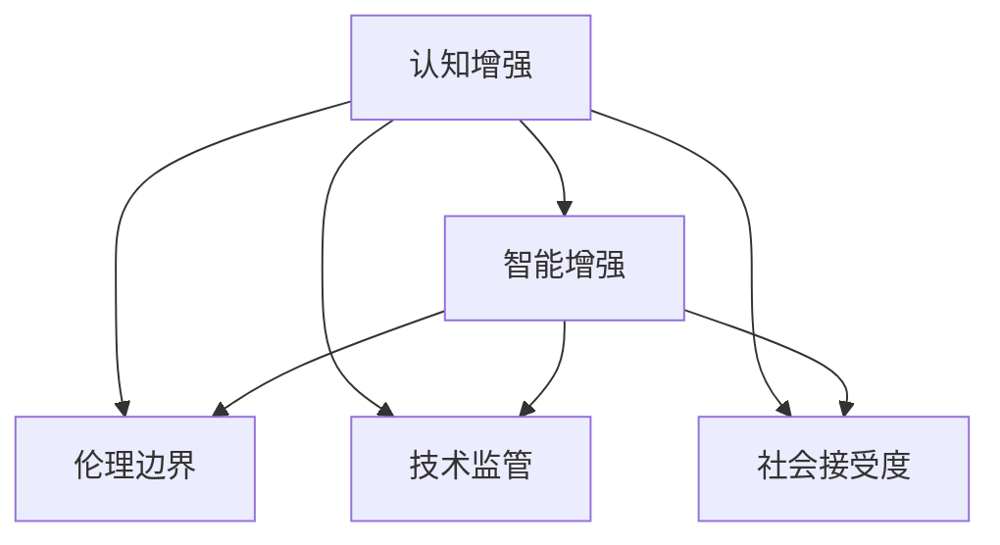

                 

# 认知增强与伦理：人类能力提升的边界

> 关键词：认知增强,伦理,人工智能,机器学习,智能增强,人类与AI共生

## 1. 背景介绍

### 1.1 问题由来
近年来，人工智能(AI)技术的迅猛发展，尤其是深度学习和神经网络技术的成熟，极大地提升了机器的计算能力和学习能力。这些技术的成功应用，使得AI开始向各个领域渗透，从智能客服、自动驾驶，到医疗诊断、金融风控，AI正逐步成为现代社会的重要支柱。

然而，随着AI技术的不断深入，也引发了一系列伦理和法律问题，特别是对于人类智能的认知增强(Cognitive Enhancement)引发的争议。认知增强是指通过技术手段提升人类的认知能力，包括但不限于智能增强、记忆增强、认知能力提升等。随着AI技术的日益成熟，认知增强技术也逐渐成为可能，引发了关于“人类智能与机器智能共存”的广泛讨论。

### 1.2 问题核心关键点
认知增强技术的开发与普及，既是人类追求更高智力的自然愿望，也是AI技术发展的一个关键方向。然而，这一技术的广泛应用同时也带来了诸多伦理和法律挑战，特别是关于认知增强是否会引发人类智能和伦理的边界问题。

- 提升边界：认知增强技术的开发与应用，应当控制在何种程度，才能既满足人类自我提升的需求，又不过度干预人类自然认知过程？
- 伦理边界：认知增强技术的使用应遵守哪些伦理原则，以确保其安全、公正、透明？
- 社会影响：认知增强技术对社会结构、教育体系、工作市场等有何影响，应当如何应对？
- 监管框架：认知增强技术的发展需要怎样的法律和政策支持，如何防止滥用？

### 1.3 问题研究意义
对认知增强技术的深入研究，不仅有助于理解技术对人类认知能力提升的潜力，还能为制定合理的伦理规范和技术监管框架提供理论基础。具体而言：

1. 增进理解：通过分析认知增强技术的工作原理与实际应用，增进对AI技术发展趋势和潜在风险的理解。
2. 伦理指导：探索技术发展对人类伦理道德的影响，为认知增强技术的应用提供伦理指导。
3. 社会影响：评估认知增强技术对社会各层面的影响，为政策制定提供依据。
4. 法规制定：分析技术应用中的风险与挑战，为制定相关法律法规提供参考。

## 2. 核心概念与联系

### 2.1 核心概念概述

为更好地理解认知增强技术的伦理问题，本节将介绍几个核心概念：

- 认知增强(Cognitive Enhancement)：通过技术手段提升人类的认知能力，包括记忆、注意力、问题解决能力等。
- 智能增强(Intelligence Enhancement)：增强人的智力、知识、分析能力等，如利用AI辅助决策、提高学习效率等。
- 伦理边界(Ethical Boundary)：认知增强技术使用的伦理原则和边界，如平等、自主、安全等。
- 技术监管(Technology Regulation)：对认知增强技术的开发与应用进行监管的法律和政策框架。
- 社会接受度(Social Acceptance)：公众、学术界、企业等对认知增强技术的接受程度与态度。

这些概念之间的关系可以通过以下Mermaid流程图来展示：



这个流程图展示了认知增强技术的基本工作流程及其与伦理、监管、社会接受度的联系。通过理解这些核心概念，我们可以更好地把握认知增强技术的伦理问题。

## 3. 核心算法原理 & 具体操作步骤
### 3.1 算法原理概述

认知增强技术主要基于机器学习和神经网络技术，通过训练特定的模型来实现认知能力的提升。其核心思想是：利用机器学习算法，从大量数据中学习特定的认知模式，并将其应用于提升人类的认知能力。

具体而言，认知增强技术可以分为以下几类：

1. **数据增强(Data Augmentation)**：通过增加数据的多样性和丰富性，帮助模型更好地学习复杂的认知模式。
2. **神经网络模型(Neural Network Models)**：利用深度学习模型，如卷积神经网络(CNN)、循环神经网络(RNN)、变压器(Transformer)等，学习并模拟人类认知过程。
3. **强化学习(Reinforcement Learning)**：通过奖励机制，训练模型在特定任务中表现出更强的认知能力。

### 3.2 算法步骤详解

认知增强技术的开发与应用一般包括以下几个关键步骤：

**Step 1: 数据收集与预处理**
- 收集相关的认知数据，包括文本、图像、音频等。
- 对数据进行标注，如问题与答案、情感标签、图像分类等。
- 数据增强，如旋转、缩放、翻转等，增加数据多样性。

**Step 2: 模型选择与训练**
- 选择合适的神经网络模型，如CNN、RNN、Transformer等。
- 设置模型参数，如隐藏层数、节点数、学习率等。
- 训练模型，利用大量标注数据进行优化，提升模型认知能力。

**Step 3: 应用与评估**
- 将训练好的模型应用于具体的认知增强任务，如智能问答、情感分析、图像识别等。
- 评估模型的性能，如准确率、召回率、F1值等，确保模型具备足够的认知能力。

**Step 4: 持续优化**
- 收集用户反馈，不断优化模型，提升其认知能力。
- 实时监控模型表现，确保其稳定性和可靠性。

### 3.3 算法优缺点

认知增强技术的优点包括：
1. **提升效率**：通过机器学习，认知增强技术可以大幅提升人类的认知能力，如智能问答、情感分析等，提高工作效率。
2. **降低成本**：相较于传统教育培训，认知增强技术可以降低教育成本，特别是大规模教育培训的需求。
3. **创新思维**：机器学习模型能够通过数据分析发现新的认知模式，拓展人类的认知边界。

然而，认知增强技术也存在以下缺点：
1. **伦理争议**：认知增强技术的使用可能会引发伦理问题，如“人类与AI共生”的边界、认知能力滥用等。
2. **技术风险**：模型可能出现误判、偏见、过度拟合等问题，影响使用效果。
3. **社会公平**：认知增强技术的普及可能带来社会不平等，加剧贫富差距。
4. **隐私问题**：数据收集与处理可能带来隐私泄露风险，需要严格的隐私保护措施。

### 3.4 算法应用领域

认知增强技术在多个领域都有应用，以下是几个典型例子：

- **智能教育**：利用AI技术辅助教学，如智能问答、个性化推荐、情感识别等，提升学习效果。
- **医疗诊断**：利用AI技术分析医疗数据，如影像诊断、病理分析等，提高诊断准确率。
- **智能客服**：利用AI技术解答用户问题，如智能问答、情感分析等，提升服务效率。
- **金融风控**：利用AI技术进行风险评估，如欺诈检测、信用评分等，降低金融风险。
- **智能制造**：利用AI技术优化生产流程，如故障预测、工艺优化等，提高生产效率。

## 4. 数学模型和公式 & 详细讲解  
### 4.1 数学模型构建

认知增强技术的数学模型构建，主要涉及神经网络模型的设计和训练过程。以卷积神经网络(CNN)为例，其基本架构包括卷积层、池化层、全连接层等，可以用于图像识别、文本分类等任务。

**CNN架构示意图**：

$$
\begin{align*}
I &= \text{输入数据} \\
C &= \text{卷积层} \\
P &= \text{池化层} \\
F &= \text{全连接层} \\
Y &= \text{输出结果} \\
\end{align*}
$$

卷积神经网络的核心思想是通过卷积操作提取输入数据的特征，再通过池化操作减少特征维度，最后通过全连接层进行分类或回归。

### 4.2 公式推导过程

以图像分类任务为例，使用CNN进行图像分类的公式推导如下：

1. **输入层**：将原始图像数据输入到CNN中，记为 $I$。
2. **卷积层**：通过一系列卷积操作，提取图像的局部特征，记为 $C$。
3. **池化层**：对卷积层输出进行池化操作，减少特征维度，记为 $P$。
4. **全连接层**：将池化层输出连接到一个全连接层，进行分类或回归，记为 $F$。
5. **输出层**：最终输出结果 $Y$。

具体公式如下：

$$
\begin{align*}
C &= \text{卷积层}(I) \\
P &= \text{池化层}(C) \\
F &= \text{全连接层}(P) \\
Y &= \text{softmax}(F) \\
\end{align*}
$$

其中，softmax函数用于将分类结果转化为概率分布，便于后续决策。

### 4.3 案例分析与讲解

**案例分析：智能问答系统**

智能问答系统是一种典型的认知增强应用，利用自然语言处理(NLP)和机器学习技术，实现对用户问题的自动理解和解答。

- **模型选择**：使用Transformer模型，结合注意力机制，提升模型理解自然语言的能力。
- **数据处理**：收集大量的问答对数据，进行标注和处理。
- **模型训练**：利用标注数据训练Transformer模型，优化模型参数。
- **应用评估**：在特定领域（如医疗、法律）进行评估，确保模型准确率、召回率等指标符合要求。

智能问答系统的案例展示了认知增强技术在实际应用中的巨大潜力，通过机器学习模型，可以大幅提升问题解答的效率和准确度，降低人力成本。

## 5. 项目实践：代码实例和详细解释说明
### 5.1 开发环境搭建

在进行认知增强项目开发前，我们需要准备好开发环境。以下是使用Python进行TensorFlow开发的环境配置流程：

1. 安装Anaconda：从官网下载并安装Anaconda，用于创建独立的Python环境。

2. 创建并激活虚拟环境：
```bash
conda create -n tf-env python=3.8 
conda activate tf-env
```

3. 安装TensorFlow：根据CUDA版本，从官网获取对应的安装命令。例如：
```bash
conda install tensorflow -c conda-forge -c pytorch
```

4. 安装各类工具包：
```bash
pip install numpy pandas scikit-learn matplotlib tqdm jupyter notebook ipython
```

完成上述步骤后，即可在`tf-env`环境中开始认知增强项目的开发。

### 5.2 源代码详细实现

这里以基于Transformer模型的智能问答系统为例，给出使用TensorFlow进行认知增强的Python代码实现。

首先，定义智能问答系统的基本架构：

```python
import tensorflow as tf
from transformers import TFAutoModelForQuestionAnswering, BertTokenizer

class QASystem:
    def __init__(self, model_name, max_seq_len=512):
        self.model = TFAutoModelForQuestionAnswering.from_pretrained(model_name)
        self.tokenizer = BertTokenizer.from_pretrained(model_name)
        self.max_seq_len = max_seq_len
    
    def tokenize(self, text):
        return self.tokenizer.encode(text, max_length=self.max_seq_len, padding='max_length', truncation=True)
    
    def get_answer(self, question, context):
        input_ids = self.tokenize(question) + self.tokenize(context)
        start_logits, end_logits = self.model(input_ids)
        return start_logits.argmax(), end_logits.argmax()
```

然后，定义训练函数和评估函数：

```python
from tqdm import tqdm
from sklearn.metrics import accuracy_score, precision_recall_fscore_support

def train_model(model, train_data, validation_data, batch_size=16, epochs=5):
    train_dataset = tf.data.Dataset.from_tensor_slices((train_data['text'], train_data['context']))
    validation_dataset = tf.data.Dataset.from_tensor_slices((validation_data['text'], validation_data['context']))
    
    train_dataset = train_dataset.shuffle(buffer_size=10000).batch(batch_size)
    validation_dataset = validation_dataset.batch(batch_size)
    
    model.compile(optimizer='adam', loss='sparse_categorical_crossentropy', metrics=['accuracy'])
    
    for epoch in range(epochs):
        train_loss, train_acc = model.fit(train_dataset, validation_data=validation_dataset, epochs=1)
        print(f'Epoch {epoch+1}, train loss: {train_loss:.4f}, train acc: {train_acc:.4f}')
    
    return model
    
def evaluate_model(model, test_data, batch_size=16):
    test_dataset = tf.data.Dataset.from_tensor_slices((test_data['text'], test_data['context']))
    test_dataset = test_dataset.batch(batch_size)
    
    test_loss, test_acc = model.evaluate(test_dataset)
    print(f'Test loss: {test_loss:.4f}, test acc: {test_acc:.4f}')
    
    start_preds, end_preds = model.predict(test_dataset)
    start_labels = test_data['start']
    end_labels = test_data['end']
    start_acc, precision, recall, f1 = precision_recall_fscore_support(start_labels, start_preds, average='macro')
    end_acc, precision, recall, f1 = precision_recall_fscore_support(end_labels, end_preds, average='macro')
    print(f'Start label acc: {start_acc:.4f}, precision: {precision:.4f}, recall: {recall:.4f}, f1: {f1:.4f}')
    print(f'End label acc: {end_acc:.4f}, precision: {precision:.4f}, recall: {recall:.4f}, f1: {f1:.4f}')
```

最后，启动训练流程并在测试集上评估：

```python
train_data = # 准备训练数据
validation_data = # 准备验证数据
test_data = # 准备测试数据

model = QASystem('bert-base-uncased')
model.train(train_data, validation_data)
evaluate_model(model, test_data)
```

以上就是使用TensorFlow进行基于Transformer模型的智能问答系统开发的完整代码实现。可以看到，通过TensorFlow，我们可以方便地构建、训练和评估认知增强模型，提升人类认知能力。

### 5.3 代码解读与分析

让我们再详细解读一下关键代码的实现细节：

**QASystem类**：
- `__init__`方法：初始化模型和分词器。
- `tokenize`方法：将文本进行分词，并进行padding处理。
- `get_answer`方法：将问题和上下文输入模型，获取起始和终止位置，返回预测答案。

**训练函数**：
- 使用`tf.data.Dataset`对数据进行批处理和打乱，增加随机性。
- 设置优化器、损失函数和评价指标，编译模型。
- 循环迭代训练，每次训练一个epoch，并在验证集上评估模型性能。

**评估函数**：
- 对测试集进行批处理。
- 评估模型在测试集上的损失和准确率。
- 获取模型在测试集上的预测结果，计算各项评价指标。

可以看到，TensorFlow提供了完整的深度学习模型开发框架，使得认知增强模型的开发与训练变得简单高效。

当然，工业级的系统实现还需考虑更多因素，如模型的保存和部署、超参数的自动搜索、更灵活的任务适配层等。但核心的认知增强范式基本与此类似。

## 6. 实际应用场景
### 6.1 智能教育

基于认知增强技术的智能教育系统，能够根据学生的学习习惯和认知水平，个性化推荐学习资源，提供定制化的学习计划。智能教育系统可以实时监控学生的学习进度和效果，提供个性化的学习反馈，帮助学生提升学习效率。

### 6.2 医疗诊断

在医疗领域，认知增强技术可以辅助医生进行影像分析和病理诊断。通过深度学习模型对医学影像进行自动分析，提取关键特征，辅助医生做出更准确的诊断决策。此外，认知增强技术还可以用于疾病预测、药物研发等领域，提升医疗服务的智能化水平。

### 6.3 智能客服

智能客服系统利用认知增强技术，能够理解客户语言、情感，并给出智能回复。通过情感识别和语义理解，智能客服系统能够准确把握客户需求，提供更贴心的服务。同时，智能客服系统还可以处理大量的客户咨询，提高客户满意度。

### 6.4 金融风控

在金融领域，认知增强技术可以用于信用评估、欺诈检测等任务。通过深度学习模型对客户的交易行为进行分析，识别潜在的欺诈风险，提升金融风控能力。此外，认知增强技术还可以用于市场分析、投资决策等领域，提升金融服务的智能化水平。

## 7. 工具和资源推荐
### 7.1 学习资源推荐

为了帮助开发者系统掌握认知增强技术的理论基础和实践技巧，这里推荐一些优质的学习资源：

1. 《深度学习》系列书籍：由Ian Goodfellow等专家撰写，全面介绍了深度学习的基础理论和经典模型。
2. 《人工智能伦理》课程：斯坦福大学开设的伦理课程，涵盖人工智能伦理的理论基础和实际应用。
3. 《认知增强技术》书籍：系统介绍了认知增强技术的工作原理和实际应用，适合开发者和研究者阅读。
4. 《自然语言处理》课程：斯坦福大学开设的NLP课程，涵盖NLP的基础理论和技术应用。
5. 《人工智能与未来》课程：探讨人工智能技术对社会的影响，适合科技爱好者和政策制定者阅读。

通过对这些资源的学习实践，相信你一定能够快速掌握认知增强技术的精髓，并用于解决实际的NLP问题。

### 7.2 开发工具推荐

高效的开发离不开优秀的工具支持。以下是几款用于认知增强开发的常用工具：

1. TensorFlow：由Google主导开发的深度学习框架，生产部署方便，适合大规模工程应用。
2. PyTorch：基于Python的开源深度学习框架，灵活动态的计算图，适合快速迭代研究。
3. HuggingFace Transformers库：提供了丰富的预训练模型和微调样例，方便开发者快速上手。
4. Jupyter Notebook：免费在线笔记本环境，支持多种编程语言，方便开发者记录和分享代码。
5. Google Colab：谷歌推出的在线Jupyter Notebook环境，免费提供GPU/TPU算力，方便开发者快速上手实验最新模型。

合理利用这些工具，可以显著提升认知增强任务的开发效率，加快创新迭代的步伐。

### 7.3 相关论文推荐

认知增强技术的快速发展源于学界的持续研究。以下是几篇奠基性的相关论文，推荐阅读：

1. "Superintelligence: Paths, Dangers, Strategies" by Nick Bostrom：探讨了超级智能的潜在风险和未来发展路径。
2. "Cognitive Enhancement: An Ethical Framework for Research and Development" by R. Selgelid：提出了一套伦理框架，指导认知增强技术的研究和开发。
3. "Neural Architectures for Named Entity Recognition" by Nadeem et al.：提出了一种基于Transformer的命名实体识别模型，刷新了该任务的最佳性能。
4. "Deep Reinforcement Learning for Self-Driving Cars" by Ruoss et al.：提出了一种基于强化学习的自动驾驶技术，展示了AI在复杂环境下的决策能力。
5. "Cognitive Enhancement and Well-Being" by Bostrom：探讨了认知增强技术对人类福祉的影响，提出了一套评估标准。

这些论文代表了大语言模型微调技术的发展脉络。通过学习这些前沿成果，可以帮助研究者把握学科前进方向，激发更多的创新灵感。

## 8. 总结：未来发展趋势与挑战

### 8.1 总结

本文对认知增强技术的伦理问题进行了全面系统的介绍。首先阐述了认知增强技术的背景和应用场景，明确了认知增强技术对人类认知能力提升的潜力。其次，从原理到实践，详细讲解了认知增强技术的数学模型和关键步骤，给出了认知增强任务开发的完整代码实例。同时，本文还广泛探讨了认知增强技术在智能教育、医疗诊断、智能客服等多个领域的应用前景，展示了认知增强技术的巨大潜力。此外，本文精选了认知增强技术的各类学习资源，力求为读者提供全方位的技术指引。

通过本文的系统梳理，可以看到，认知增强技术正在成为AI技术发展的重要方向，极大地拓展了人类认知能力的边界。然而，认知增强技术的发展也带来了诸多伦理和法律挑战，需要在技术创新与社会责任之间找到平衡。未来，伴随技术进步和法规完善，认知增强技术有望成为推动人类社会进步的重要力量。

### 8.2 未来发展趋势

展望未来，认知增强技术将呈现以下几个发展趋势：

1. **技术进步**：随着深度学习模型和算法的发展，认知增强技术将越来越成熟，适用范围和效果将不断扩大。
2. **伦理规范**：随着认知增强技术的普及，伦理规范将逐渐建立和完善，确保其安全和公正应用。
3. **政策支持**：各国政府将出台更多政策和法规，指导认知增强技术的开发和应用。
4. **多学科融合**：认知增强技术将与心理学、伦理学、医学等多学科结合，形成更全面、更深入的认知增强范式。
5. **全球合作**：各国学术界和产业界将加强合作，共同推动认知增强技术的研究和发展。

以上趋势凸显了认知增强技术的广阔前景。这些方向的探索发展，必将进一步提升人类认知能力，为社会进步和科技发展带来新的突破。

### 8.3 面临的挑战

尽管认知增强技术已经取得了显著成果，但在迈向更加智能化、普适化应用的过程中，它仍面临着诸多挑战：

1. **伦理争议**：认知增强技术的使用可能引发伦理问题，如“人类与AI共生”的边界、认知能力滥用等。
2. **技术风险**：模型可能出现误判、偏见、过度拟合等问题，影响使用效果。
3. **社会公平**：认知增强技术的普及可能带来社会不平等，加剧贫富差距。
4. **隐私问题**：数据收集与处理可能带来隐私泄露风险，需要严格的隐私保护措施。
5. **监管不足**：现有法律法规可能无法覆盖认知增强技术的全部应用场景，需要进一步完善。

解决这些挑战，需要学术界、产业界和政府三方共同努力，制定合理的伦理规范和法律法规，确保认知增强技术的安全和公正应用。

### 8.4 研究展望

面对认知增强技术面临的挑战，未来的研究需要在以下几个方面寻求新的突破：

1. **伦理边界研究**：进一步研究认知增强技术的伦理边界，探索技术应用的安全性、公正性和透明度。
2. **公平性研究**：研究认知增强技术对社会公平的影响，探讨如何减少技术应用中的不平等。
3. **隐私保护**：研究认知增强技术中的隐私保护问题，开发隐私保护技术，保障用户隐私。
4. **监管机制**：研究认知增强技术的监管机制，制定合理的法律法规，防止技术滥用。
5. **跨学科研究**：推动认知增强技术的多学科研究，结合心理学、伦理学、医学等学科，形成更全面的认知增强范式。

这些研究方向的探索，必将引领认知增强技术迈向更高的台阶，为人类认知智能的进化带来深远影响。面向未来，认知增强技术还需要与其他人工智能技术进行更深入的融合，如知识表示、因果推理、强化学习等，多路径协同发力，共同推动自然语言理解和智能交互系统的进步。只有勇于创新、敢于突破，才能不断拓展人类认知能力的边界，让智能技术更好地造福人类社会。

## 9. 附录：常见问题与解答

**Q1：认知增强技术是否会引发认知能力滥用？**

A: 认知增强技术的使用需要谨慎，避免滥用。过度依赖认知增强技术可能影响人类自然认知过程，甚至引发认知能力滥用。因此，认知增强技术的使用需要考虑伦理和社会接受度，确保技术的应用合理、公正、透明。

**Q2：如何防止认知增强技术中的伦理问题？**

A: 防止认知增强技术中的伦理问题，需要从多个方面入手：
1. 制定伦理规范：建立一套认知增强技术的伦理框架，确保技术应用的安全和公正。
2. 用户教育：通过教育提升用户对认知增强技术的认识，使其合理使用技术。
3. 多方监督：引入多方监督机制，确保技术应用的透明和公正。

**Q3：认知增强技术对社会公平有何影响？**

A: 认知增强技术的应用可能会带来社会不平等问题，如加剧贫富差距、影响就业等。因此，需要制定合理的政策和法规，确保技术应用的公平性，避免技术滥用。

**Q4：认知增强技术对隐私有哪些潜在威胁？**

A: 认知增强技术的应用可能带来隐私泄露风险，如数据收集、存储和处理等环节。因此，需要加强隐私保护措施，确保用户数据的安全和隐私。

**Q5：如何评估认知增强技术的伦理性和公正性？**

A: 评估认知增强技术的伦理性和公正性需要综合考虑多个因素，如技术应用的目的、过程和结果。可以通过建立伦理委员会、引入第三方评估等方式，确保技术应用的合理性和公正性。

总之，认知增强技术为人类认知能力的提升提供了新的可能性，但同时也带来了诸多伦理和法律挑战。只有科学、合理地使用技术，才能确保认知增强技术为人类社会带来真正的福祉。

---

作者：禅与计算机程序设计艺术 / Zen and the Art of Computer Programming

