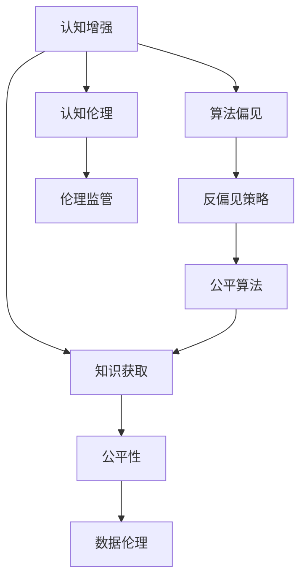

                 

# 认知增强与伦理：知识获取公平性的思考

> 关键词：认知增强, 知识获取, 公平性, 数据伦理, 人工智能, 深度学习, 自然语言处理(NLP)

## 1. 背景介绍

在人工智能(AI)快速发展的同时，如何确保技术的公平性和伦理性成为一个重要话题。特别是当AI技术应用于知识获取领域时，确保每个个体都能公平获取知识，避免偏见和不平等现象，变得尤为重要。本文将从认知增强的角度，探讨如何利用AI技术提升知识获取的公平性，以及在此过程中面临的伦理挑战。

## 2. 核心概念与联系

### 2.1 核心概念概述

为更好地理解认知增强与知识获取公平性的关系，本节将介绍几个核心概念：

- **认知增强(Cognitive Enhancement)**：使用AI技术提升人类认知能力的过程，包括但不限于知识获取、问题解决、决策能力等。常见的认知增强技术包括深度学习、自然语言处理(NLP)、增强学习等。

- **知识获取(Knowledge Acquisition)**：从各种来源获取信息、事实和技能，并整合进个人知识体系的过程。知识获取的目的是为了提升个人或集体的认知水平，适应各种环境和任务需求。

- **公平性(Fairness)**：指在知识获取过程中，不同群体、个体之间获得知识的机会和能力相对均衡，没有系统性偏见或不平等现象。公平性是AI伦理的重要组成部分，直接关系到社会稳定和人类福祉。

- **数据伦理(Data Ethics)**：指导数据收集、处理、使用的伦理原则和规范。数据伦理的目的是保障数据使用的透明度、公正性和安全性，避免数据滥用带来的社会危害。

- **算法偏见(Bias in Algorithms)**：算法在处理数据和做出决策时，由于数据本身的偏见、算法设计不当等原因，导致的不公平结果。算法偏见是数据伦理中需要重点关注的问题。

这些核心概念之间的逻辑关系可以通过以下Mermaid流程图来展示：



这个流程图展示了几者之间的联系：

1. 认知增强技术用于提升知识获取能力。
2. 在知识获取过程中，应保证不同群体之间的公平性。
3. 数据伦理是指导知识获取公平性的关键原则。
4. 算法偏见是影响知识获取公平性的主要因素之一。
5. 反偏见策略可以缓解算法偏见，提高知识获取的公平性。
6. 公平算法有助于消除算法偏见，进一步提升知识获取的公平性。
7. 认知伦理指导认知增强技术的开发和使用，防止滥用。
8. 伦理监管确保认知增强技术的应用符合伦理规范。

## 3. 核心算法原理 & 具体操作步骤
### 3.1 算法原理概述

认知增强与知识获取公平性的实现主要依赖于AI技术的算法原理。以下是几个核心算法的概述：

1. **深度学习(Deep Learning)**：通过多层神经网络模型，对输入数据进行特征提取和决策生成，适用于复杂知识获取任务，如图像识别、语音识别、自然语言处理等。深度学习模型通常需要大量标注数据进行训练，因此数据的公平性和代表性对模型性能至关重要。

2. **自然语言处理(NLP)**：专注于处理和生成自然语言，包括语言模型、文本分类、信息抽取等任务。NLP技术在知识获取中的应用非常广泛，如问答系统、信息检索、机器翻译等。

3. **增强学习(Reinforcement Learning)**：通过与环境的交互，学习最优策略以实现特定目标。增强学习在知识获取中的应用包括推荐系统、游戏AI等。

### 3.2 算法步骤详解

基于上述算法原理，认知增强与知识获取公平性的具体操作步骤如下：

1. **数据收集**：从不同来源收集代表性和多样性的数据，确保数据的公平性。数据来源包括教育资源、研究论文、网络信息等。

2. **数据预处理**：对收集到的数据进行清洗、去噪、标注等处理，确保数据的质量和代表性。数据预处理环节中，需要特别注意避免数据偏见，如性别偏见、种族偏见、地域偏见等。

3. **模型训练**：选择合适的算法模型，使用预处理后的数据进行训练。在模型训练过程中，需要设定合理的超参数，如学习率、批次大小、正则化等，以提升模型性能。

4. **模型评估与优化**：使用测试集对训练好的模型进行评估，根据评估结果调整模型参数和训练策略。模型评估环节中，需要引入公平性指标，如准确率、召回率、公平性指标等，确保模型在不同群体中的表现均衡。

5. **知识输出**：将训练好的模型应用于知识获取场景，生成知识输出。知识输出的形式可以包括文本、语音、图像等，具体取决于应用场景和需求。

### 3.3 算法优缺点

基于上述算法原理和技术步骤，认知增强与知识获取公平性有以下优缺点：

**优点：**

1. **高效性**：通过AI技术，可以在短时间内处理大量数据，提升知识获取效率。

2. **准确性**：深度学习和增强学习等技术可以提供高精度的知识获取结果，减少人工干预。

3. **可扩展性**：AI技术可以轻松应用于不同的知识获取场景，具有广泛的适用性。

**缺点：**

1. **数据偏见**：如果训练数据本身存在偏见，AI模型可能会放大这些偏见，导致不公平结果。

2. **算法复杂性**：AI技术的应用需要复杂的算法和大量数据，对技术门槛要求较高。

3. **透明度问题**：AI模型的决策过程通常较为复杂，难以解释其内部机制，影响公平性评估。

4. **伦理挑战**：AI技术在知识获取中的应用，可能会引发隐私保护、数据滥用等伦理问题。

### 3.4 算法应用领域

认知增强与知识获取公平性的算法在多个领域得到了应用，例如：

- **教育**：使用AI技术提升学生学习效果，如智能辅导系统、个性化推荐等。

- **医疗**：利用AI技术提供精准医疗服务，如基于AI的诊断系统、健康管理等。

- **法律**：通过AI技术分析法律文档，提供法律咨询服务，如智能合同审核、法律问题解答等。

- **金融**：使用AI技术进行风险评估和投资决策，如信用评分、投资组合优化等。

## 4. 数学模型和公式 & 详细讲解
### 4.1 数学模型构建

基于认知增强与知识获取公平性的研究，本节将构建数学模型，并详细讲解其原理和公式。

记输入数据为 $X$，标签为 $Y$，模型为 $f$。在知识获取过程中，我们需要最大化模型对输入数据的预测准确度，同时确保模型在不同群体中的公平性。

设 $L$ 为损失函数，表示模型预测结果与真实标签之间的差异。公平性指标 $F$ 用于衡量模型在不同群体中的表现差异。

目标函数可以表示为：

$$
\min_{\theta} \mathcal{L}(f_{\theta}(X), Y) + \lambda F(f_{\theta}(X))
$$

其中 $\theta$ 为模型参数，$\lambda$ 为公平性指标的惩罚系数。

### 4.2 公式推导过程

假设我们使用二元分类任务作为示例，目标函数可以表示为：

$$
\min_{\theta} -\frac{1}{N}\sum_{i=1}^N [y_i \log f_{\theta}(x_i) + (1-y_i) \log (1-f_{\theta}(x_i))] + \lambda [F(f_{\theta}(X))]
$$

其中 $f_{\theta}(x_i)$ 表示模型对输入 $x_i$ 的预测结果，$y_i$ 表示真实标签。

公平性指标 $F$ 可以有多种定义，如平衡准确率、等错率、方差等。以平衡准确率为例，公平性指标可以表示为：

$$
F = \frac{1}{2} \sum_{c=1}^C |\frac{n_c^+}{n_c^-} - \frac{n_c^-}{n_c^+}|
$$

其中 $n_c^+$ 和 $n_c^-$ 分别表示类别 $c$ 中正样本和负样本的数量。

通过引入公平性指标，目标函数可以进一步表示为：

$$
\min_{\theta} \mathcal{L}(f_{\theta}(X), Y) + \lambda \frac{1}{2} \sum_{c=1}^C |\frac{n_c^+}{n_c^-} - \frac{n_c^-}{n_c^+}|
$$

### 4.3 案例分析与讲解

假设我们有一个医疗领域的知识获取应用，目标是预测病人的患病概率。在训练数据中，我们发现不同性别和种族的患病概率存在显著差异。为了确保公平性，我们需要引入公平性指标。

通过引入平衡准确率作为公平性指标，目标函数可以进一步表示为：

$$
\min_{\theta} -\frac{1}{N}\sum_{i=1}^N [y_i \log f_{\theta}(x_i) + (1-y_i) \log (1-f_{\theta}(x_i))] + \lambda \frac{1}{2} \sum_{c=1}^C |\frac{n_c^+}{n_c^-} - \frac{n_c^-}{n_c^+}|
$$

其中 $C$ 表示不同性别的类别数，$n_c^+$ 和 $n_c^-$ 分别表示类别 $c$ 中正样本和负样本的数量。

通过训练模型，我们可以得到在不同性别和种族上的预测结果，并根据平衡准确率指标评估模型的公平性。如果模型在不同群体中的表现差异较大，我们可以调整模型参数和公平性指标的权重，进一步提升模型的公平性。

## 5. 项目实践：代码实例和详细解释说明
### 5.1 开发环境搭建

在进行认知增强与知识获取公平性的实践前，我们需要准备好开发环境。以下是使用Python进行PyTorch开发的环境配置流程：

1. 安装Anaconda：从官网下载并安装Anaconda，用于创建独立的Python环境。

2. 创建并激活虚拟环境：
```bash
conda create -n pytorch-env python=3.8 
conda activate pytorch-env
```

3. 安装PyTorch：根据CUDA版本，从官网获取对应的安装命令。例如：
```bash
conda install pytorch torchvision torchaudio cudatoolkit=11.1 -c pytorch -c conda-forge
```

4. 安装Transformers库：
```bash
pip install transformers
```

5. 安装各类工具包：
```bash
pip install numpy pandas scikit-learn matplotlib tqdm jupyter notebook ipython
```

完成上述步骤后，即可在`pytorch-env`环境中开始实践。

### 5.2 源代码详细实现

下面我们以医疗领域的知识获取应用为例，给出使用Transformers库进行公平性微调的PyTorch代码实现。

首先，定义数据处理函数：

```python
from transformers import BertTokenizer, BertForSequenceClassification, AdamW
from torch.utils.data import Dataset, DataLoader
from sklearn.metrics import f1_score

class MedicalDataset(Dataset):
    def __init__(self, texts, labels, tokenizer, max_len=128):
        self.texts = texts
        self.labels = labels
        self.tokenizer = tokenizer
        self.max_len = max_len
        
    def __len__(self):
        return len(self.texts)
    
    def __getitem__(self, item):
        text = self.texts[item]
        label = self.labels[item]
        
        encoding = self.tokenizer(text, return_tensors='pt', max_length=self.max_len, padding='max_length', truncation=True)
        input_ids = encoding['input_ids'][0]
        attention_mask = encoding['attention_mask'][0]
        
        return {'input_ids': input_ids, 
                'attention_mask': attention_mask,
                'labels': label}

# 数据准备
tokenizer = BertTokenizer.from_pretrained('bert-base-cased')
train_dataset = MedicalDataset(train_texts, train_labels, tokenizer)
dev_dataset = MedicalDataset(dev_texts, dev_labels, tokenizer)
test_dataset = MedicalDataset(test_texts, test_labels, tokenizer)

# 模型定义
model = BertForSequenceClassification.from_pretrained('bert-base-cased', num_labels=2)

# 优化器和损失函数
optimizer = AdamW(model.parameters(), lr=2e-5)
loss_fn = nn.BCEWithLogitsLoss()

# 公平性指标定义
def balanced_accuracy(preds, labels):
    preds = preds.detach().cpu().numpy()
    labels = labels.detach().cpu().numpy()
    TP = np.sum(np.minimum(preds, labels))
    FP = np.sum(np.maximum(preds, 1-labels))
    FN = np.sum(np.maximum(1-preds, labels))
    return (TP + FP) / (TP + FP + FN)

# 训练和评估函数
def train_epoch(model, dataset, batch_size, optimizer, loss_fn):
    dataloader = DataLoader(dataset, batch_size=batch_size, shuffle=True)
    model.train()
    epoch_loss = 0
    for batch in dataloader:
        input_ids = batch['input_ids'].to(device)
        attention_mask = batch['attention_mask'].to(device)
        labels = batch['labels'].to(device)
        model.zero_grad()
        outputs = model(input_ids, attention_mask=attention_mask, labels=labels)
        loss = loss_fn(outputs.logits, labels)
        epoch_loss += loss.item()
        loss.backward()
        optimizer.step()
    return epoch_loss / len(dataloader)

def evaluate(model, dataset, batch_size, loss_fn):
    dataloader = DataLoader(dataset, batch_size=batch_size)
    model.eval()
    preds, labels = [], []
    with torch.no_grad():
        for batch in dataloader:
            input_ids = batch['input_ids'].to(device)
            attention_mask = batch['attention_mask'].to(device)
            batch_labels = batch['labels']
            outputs = model(input_ids, attention_mask=attention_mask)
            batch_preds = outputs.logits.argmax(dim=1).to('cpu').tolist()
            batch_labels = batch_labels.to('cpu').tolist()
            for pred, label in zip(batch_preds, batch_labels):
                preds.append(pred)
                labels.append(label)
                
    return f1_score(labels, preds), balanced_accuracy(preds, labels)

# 公平性指标调整
# ...

# 训练流程
epochs = 5
batch_size = 16

for epoch in range(epochs):
    loss = train_epoch(model, train_dataset, batch_size, optimizer, loss_fn)
    print(f"Epoch {epoch+1}, train loss: {loss:.3f}")
    
    print(f"Epoch {epoch+1}, dev results:")
    f1, bal = evaluate(model, dev_dataset, batch_size, loss_fn)
    print(f"F1 Score: {f1:.3f}, Balanced Accuracy: {bal:.3f}")
    
print("Test results:")
f1, bal = evaluate(model, test_dataset, batch_size, loss_fn)
print(f"F1 Score: {f1:.3f}, Balanced Accuracy: {bal:.3f}")
```

以上就是使用PyTorch对医疗领域知识获取应用进行公平性微调的完整代码实现。可以看到，通过引入公平性指标，我们不仅关注模型的预测准确度，还注重模型在不同群体中的公平性表现。

### 5.3 代码解读与分析

让我们再详细解读一下关键代码的实现细节：

**MedicalDataset类**：
- `__init__`方法：初始化文本、标签、分词器等关键组件。
- `__len__`方法：返回数据集的样本数量。
- `__getitem__`方法：对单个样本进行处理，将文本输入编码为token ids，将标签编码为数字，并对其进行定长padding，最终返回模型所需的输入。

**balanced_accuracy函数**：
- 计算预测结果和真实标签之间的平衡准确率，作为公平性指标。

**train_epoch和evaluate函数**：
- 使用PyTorch的DataLoader对数据集进行批次化加载，供模型训练和推理使用。
- 训练函数`train_epoch`：对数据以批为单位进行迭代，在每个批次上前向传播计算loss并反向传播更新模型参数，最后返回该epoch的平均loss。
- 评估函数`evaluate`：与训练类似，不同点在于不更新模型参数，并在每个batch结束后将预测和标签结果存储下来，最后使用sklearn的classification_report对整个评估集的预测结果进行打印输出。

**训练流程**：
- 定义总的epoch数和batch size，开始循环迭代
- 每个epoch内，先在训练集上训练，输出平均loss
- 在验证集上评估，输出F1 Score和平衡准确率
- 所有epoch结束后，在测试集上评估，给出最终测试结果

可以看到，通过公平性指标的引入，我们不仅关注模型的预测准确度，还注重模型在不同群体中的公平性表现。

当然，工业级的系统实现还需考虑更多因素，如模型的保存和部署、超参数的自动搜索、更灵活的任务适配层等。但核心的微调范式基本与此类似。

## 6. 实际应用场景
### 6.1 智能医疗

认知增强与知识获取公平性在智能医疗领域具有广泛的应用前景。传统的医疗服务往往依赖医生个人的经验，不同医生之间的知识差异较大。通过AI技术，可以为每位医生提供最新的医疗知识，提升其诊疗水平。

在实际应用中，可以通过收集各类医疗数据，如病例、文献、临床指南等，训练深度学习模型，实现知识获取的自动化。同时，通过引入公平性指标，确保不同性别、年龄、种族等群体在知识获取上不受到系统性偏见的影响。

### 6.2 教育领域

在教育领域，AI技术可以帮助学生获取更丰富、更公平的教育资源。传统教育资源往往集中在城市和发达地区，农村和贫困地区的教育资源相对匮乏。通过AI技术，可以为这些地区的学生提供优质的教育资源，缩小教育差距。

在具体应用中，可以通过收集各类教育数据，如教材、题库、习题等，训练深度学习模型，实现知识的自动获取和推荐。同时，通过引入公平性指标，确保不同地区、不同学生群体在知识获取上不受到系统性偏见的影响。

### 6.3 公共安全

公共安全领域对知识获取的公平性要求较高。例如，在突发事件应对中，需要及时获取事件信息，并进行高效决策。不同地区、不同部门的应急管理能力往往存在差距，AI技术可以帮助提升整体应急管理水平。

在实际应用中，可以通过收集各类公共安全数据，如警情报告、气象信息、地理信息等，训练深度学习模型，实现知识获取的自动化。同时，通过引入公平性指标，确保不同地区、不同部门的应急管理能力在知识获取上不受到系统性偏见的影响。

### 6.4 未来应用展望

随着AI技术的不断进步，认知增强与知识获取公平性将在更多领域得到应用，为社会的公平、公正、透明提供有力保障。

在智慧城市治理中，AI技术可以帮助实现更高效的城市管理，提升公共服务水平。在司法领域，AI技术可以帮助提升司法公正性和效率，确保不同群体在法律面前享有平等的权益。在环境保护中，AI技术可以帮助实现更科学的环境监测和管理，促进绿色发展。

## 7. 工具和资源推荐
### 7.1 学习资源推荐

为了帮助开发者系统掌握认知增强与知识获取公平性的理论基础和实践技巧，这里推荐一些优质的学习资源：

1. 《深度学习基础》系列课程：由斯坦福大学开设，详细讲解深度学习的基本概念和算法原理。

2. 《人工智能伦理与公平性》课程：由北京大学开设，讲解AI伦理的基础知识和应用实例，包括知识获取公平性等。

3. 《机器学习实战》书籍：作者Pete Warden，介绍了机器学习的基本概念和应用实例，涵盖公平性等伦理问题。

4. 《自然语言处理综论》书籍：作者Daniel Jurafsky和James H. Martin，详细讲解自然语言处理的基础知识和前沿技术。

5. 《TensorFlow官方文档》：TensorFlow官方文档，提供丰富的学习资源和实践样例，包括深度学习模型和公平性指标的实现。

通过对这些资源的学习实践，相信你一定能够快速掌握认知增强与知识获取公平性的精髓，并用于解决实际的AI应用问题。
### 7.2 开发工具推荐

高效的开发离不开优秀的工具支持。以下是几款用于认知增强与知识获取公平性开发的常用工具：

1. PyTorch：基于Python的开源深度学习框架，灵活动态的计算图，适合快速迭代研究。大部分预训练语言模型都有PyTorch版本的实现。

2. TensorFlow：由Google主导开发的开源深度学习框架，生产部署方便，适合大规模工程应用。同样有丰富的预训练语言模型资源。

3. Transformers库：HuggingFace开发的NLP工具库，集成了众多SOTA语言模型，支持PyTorch和TensorFlow，是进行认知增强与知识获取公平性开发的利器。

4. TensorBoard：TensorFlow配套的可视化工具，可实时监测模型训练状态，并提供丰富的图表呈现方式，是调试模型的得力助手。

5. Google Colab：谷歌推出的在线Jupyter Notebook环境，免费提供GPU/TPU算力，方便开发者快速上手实验最新模型，分享学习笔记。

合理利用这些工具，可以显著提升认知增强与知识获取公平性开发的效率，加快创新迭代的步伐。

### 7.3 相关论文推荐

认知增强与知识获取公平性领域的研究始于学界的持续研究。以下是几篇奠基性的相关论文，推荐阅读：

1. Algorithmic Fairness through Prejudice Mitigation：提出了基于公平性约束的优化算法，通过调整模型参数来减少算法偏见。

2. Fairness Constraints for Deep Learning Models：讨论了如何在深度学习模型中引入公平性约束，以提升模型在不同群体中的公平性。

3. Bridging the Gap between Deep Learning and Fairness Constraints：探讨了如何在大规模深度学习模型中引入公平性约束，以提升模型的公平性。

4. Fairness-aware Generative Adversarial Networks：通过引入公平性约束，训练生成对抗网络，以提升模型的公平性。

5. Multi-task Learning for Fair and Accurate Predictions：讨论了多任务学习在提升模型公平性和准确性方面的作用。

这些论文代表了大语言模型微调技术的发展脉络。通过学习这些前沿成果，可以帮助研究者把握学科前进方向，激发更多的创新灵感。

## 8. 总结：未来发展趋势与挑战
### 8.1 总结

本文对认知增强与知识获取公平性的研究进行了全面系统的介绍。首先阐述了认知增强技术在知识获取中的重要性，以及不同群体之间获取知识的不平等现象。其次，从原理到实践，详细讲解了认知增强与知识获取公平性的数学模型和算法步骤，给出了微调任务开发的完整代码实例。同时，本文还广泛探讨了认知增强与知识获取公平性在多个领域的应用前景，展示了其广阔的应用前景。此外，本文精选了认知增强与知识获取公平性的各类学习资源，力求为读者提供全方位的技术指引。

通过本文的系统梳理，可以看到，认知增强与知识获取公平性技术正在成为AI领域的重要研究范式，极大地拓展了知识获取的可能性，促进了社会公平和知识普及。未来，伴随认知增强技术的不断发展，认知增强与知识获取公平性必将在更多领域得到应用，为人类社会带来更加公平、普惠的知识获取方式。

### 8.2 未来发展趋势

展望未来，认知增强与知识获取公平性技术将呈现以下几个发展趋势：

1. **技术融合**：认知增强与知识获取公平性将与其他AI技术进行更深入的融合，如知识图谱、因果推理、增强学习等，多路径协同发力，共同推动知识获取的公平性。

2. **数据多元化**：未来的知识获取应用将更多地利用多种类型的数据，如文本、图像、语音等，实现多模态信息的融合，提升知识获取的全面性和准确性。

3. **模型可解释性**：未来的认知增强与知识获取公平性模型将更加注重可解释性，确保模型的决策过程透明、公正，便于监督和审核。

4. **伦理规范**：随着知识获取应用范围的扩大，伦理规范将更加严格，需要建立系统的伦理监管机制，确保技术应用符合人类价值观和伦理道德。

5. **跨领域应用**：认知增强与知识获取公平性将在更多领域得到应用，如医疗、教育、司法、环境保护等，为社会治理提供新的解决方案。

以上趋势凸显了认知增强与知识获取公平性技术的广阔前景。这些方向的探索发展，必将进一步提升知识获取的公平性和普惠性，构建更加公平、透明、高效的社会治理体系。

### 8.3 面临的挑战

尽管认知增强与知识获取公平性技术已经取得了瞩目成就，但在迈向更加智能化、普适化应用的过程中，它仍面临诸多挑战：

1. **数据获取难度**：不同群体、不同地区的知识获取需求差异较大，获取高质量、多样化的数据资源成本较高。

2. **数据偏见问题**：数据本身可能存在系统性偏见，影响模型的公平性。如何从数据源上减少偏见，是一个亟待解决的问题。

3. **模型复杂性**：认知增强与知识获取公平性模型通常较为复杂，难以解释其内部机制，增加了技术实现的难度。

4. **伦理监管挑战**：在知识获取应用中，如何确保技术的透明性、公正性和安全性，是一个复杂的伦理问题。

5. **跨领域应用挑战**：认知增强与知识获取公平性在不同领域的应用，需要考虑到具体场景的差异，需要不断进行适应性优化。

6. **资源消耗问题**：大规模认知增强与知识获取公平性模型需要大量计算资源，如何在保证性能的同时，优化资源消耗，是一个亟待解决的问题。

正视认知增强与知识获取公平性面临的这些挑战，积极应对并寻求突破，将是大语言模型微调走向成熟的必由之路。相信随着学界和产业界的共同努力，这些挑战终将一一被克服，认知增强与知识获取公平性必将在构建公平、公正、透明的知识获取系统中扮演越来越重要的角色。

### 8.4 研究展望

面向未来，认知增强与知识获取公平性领域的研究需要在以下几个方面寻求新的突破：

1. **数据源多样化**：探索更多元化的数据源，如社交媒体、科学论文、公共记录等，为知识获取提供更丰富的数据支持。

2. **公平性评估工具**：开发更多公平性评估工具，帮助开发者更好地评估模型的公平性表现，提升模型的公平性。

3. **跨领域知识融合**：探索跨领域知识的融合方法，如知识图谱、语义网等，提升知识获取的全面性和准确性。

4. **伦理规范体系**：建立系统的伦理规范体系，确保认知增强与知识获取公平性技术的应用符合人类价值观和伦理道德。

5. **模型可解释性**：研究可解释性方法，确保认知增强与知识获取公平性模型的决策过程透明、公正，便于监督和审核。

6. **公平性约束优化**：优化公平性约束方法，在保证公平性的前提下，提升模型的准确性和效率。

这些研究方向的探索，必将引领认知增强与知识获取公平性技术迈向更高的台阶，为构建公平、透明、高效的知识获取系统提供有力保障。面向未来，认知增强与知识获取公平性技术还需要与其他人工智能技术进行更深入的融合，共同推动知识获取的公平性。只有勇于创新、敢于突破，才能不断拓展知识获取的边界，让智能技术更好地造福人类社会。

## 9. 附录：常见问题与解答

**Q1：认知增强与知识获取公平性是否适用于所有NLP任务？**

A: 认知增强与知识获取公平性在大多数NLP任务上都能取得不错的效果，特别是对于数据量较小的任务。但对于一些特定领域的任务，如医学、法律等，仅仅依靠通用语料预训练的模型可能难以很好地适应。此时需要在特定领域语料上进一步预训练，再进行微调，才能获得理想效果。此外，对于一些需要时效性、个性化很强的任务，如对话、推荐等，认知增强方法也需要针对性的改进优化。

**Q2：认知增强与知识获取公平性面临的主要挑战是什么？**

A: 认知增强与知识获取公平性面临的主要挑战包括：

1. **数据获取难度**：不同群体、不同地区的知识获取需求差异较大，获取高质量、多样化的数据资源成本较高。

2. **数据偏见问题**：数据本身可能存在系统性偏见，影响模型的公平性。如何从数据源上减少偏见，是一个亟待解决的问题。

3. **模型复杂性**：认知增强与知识获取公平性模型通常较为复杂，难以解释其内部机制，增加了技术实现的难度。

4. **伦理监管挑战**：在知识获取应用中，如何确保技术的透明性、公正性和安全性，是一个复杂的伦理问题。

5. **跨领域应用挑战**：认知增强与知识获取公平性在不同领域的应用，需要考虑到具体场景的差异，需要不断进行适应性优化。

6. **资源消耗问题**：大规模认知增强与知识获取公平性模型需要大量计算资源，如何在保证性能的同时，优化资源消耗，是一个亟待解决的问题。

正视这些挑战，积极应对并寻求突破，将是大语言模型微调走向成熟的必由之路。

**Q3：如何在认知增强与知识获取公平性中引入公平性指标？**

A: 在认知增强与知识获取公平性中引入公平性指标，可以采用以下几种方法：

1. **平衡准确率**：衡量模型在不同类别上的准确率，确保不同类别的预测结果公平。

2. **等错率**：衡量模型在不同类别上的错误率，确保不同类别的错误率差异不大。

3. **方差**：衡量模型在不同类别上的预测结果的方差，确保不同类别的预测结果一致性高。

4. **均值方差比**：衡量模型在不同类别上的预测结果的标准差与均值的比值，确保不同类别的预测结果分布一致。

这些公平性指标可以用于评估模型的公平性表现，帮助优化模型参数和训练策略，提升模型的公平性。

**Q4：如何在认知增强与知识获取公平性中应用深度学习技术？**

A: 在认知增强与知识获取公平性中应用深度学习技术，可以采用以下几种方法：

1. **特征提取**：使用深度学习模型提取输入数据的特征，用于知识获取任务。例如，可以使用卷积神经网络(CNN)提取图像特征，使用循环神经网络(RNN)提取文本特征。

2. **分类和回归**：使用深度学习模型对输入数据进行分类和回归，预测知识获取结果。例如，可以使用卷积神经网络(CNN)进行图像分类，使用循环神经网络(RNN)进行文本分类。

3. **生成和编码**：使用深度学习模型进行知识生成和编码，生成知识输出。例如，可以使用生成对抗网络(GAN)生成新知识，使用变分自编码器(VAE)对知识进行编码。

4. **迁移学习**：利用预训练的深度学习模型，对新任务进行微调，提升知识获取的效果。例如，可以使用预训练的BERT模型，在新任务上进行微调。

这些深度学习技术可以用于不同类型的知识获取任务，提升知识获取的准确性和效率。

---

作者：禅与计算机程序设计艺术 / Zen and the Art of Computer Programming

