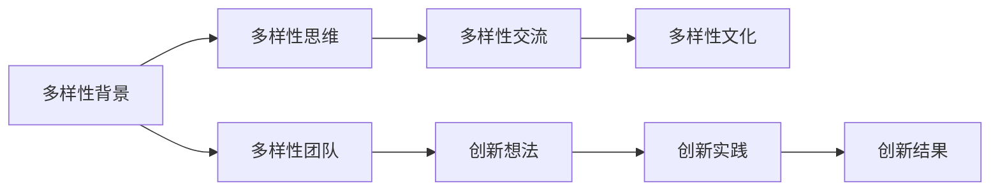

                 

# 认知多样性：团队创新的源泉

## 1. 背景介绍

### 1.1 问题由来

随着科技的不断进步，各行各业都在寻求创新的解决方案以保持竞争优势。创新驱动的发展模式已经成为企业持续成长的关键。然而，在追求创新的过程中，人们往往会陷入固有思维模式的局限，缺乏新的视角和创意，使得创新难以持续。这一现象被称为认知闭环(Cognitive Loop)，即个体和团队对于新的思维方式、技术手段或市场机会的认知停滞，阻碍了创新发展。

### 1.2 问题核心关键点

如何打破认知闭环，打破常规思维，实现跨越式的创新？这是现代企业和组织亟需解决的问题。本文将探讨一种新型团队创新策略——认知多样性(Cognitive Diversity)，它通过引入认知多样性的团队结构，促进多元视角的交流与碰撞，激发出更多创新想法，从而提升团队整体创新能力。

## 2. 核心概念与联系

### 2.1 核心概念概述

认知多样性是指在团队中引入不同背景、经历、思维方式的人员，使团队具备多样化的认知视角。这一策略旨在通过多样化的观点交流，打破固有思维模式，激发新的创意和解决方案，提升团队的创新力和问题解决能力。

- **多样性背景**：包括种族、性别、年龄、文化、专业、经验等方面，涵盖不同的生活经历和职业路径。
- **多样性思维**：包括逻辑推理、直觉判断、系统思维、创造性思维等多种认知方式。
- **多样性交流**：强调开放、包容的沟通环境，鼓励多样化的观点表达和交流。
- **多样性文化**：营造尊重差异、鼓励创新的企业文化，支持多样性的团队构建和运作。

这些核心概念通过多样化的视角和思维方式的碰撞，产生新的创新突破，推动团队整体水平的提升。

### 2.2 核心概念原理和架构的 Mermaid 流程图



该流程图展示了认知多样性从多样性背景出发，通过多样性思维和多样性交流，最后实现多样性文化的形成和创新实践，最终产生创新结果的过程。

## 3. 核心算法原理 & 具体操作步骤

### 3.1 算法原理概述

认知多样性策略的核心是多样性团队的构建和运作。多样性团队由具有不同背景和认知方式的人员组成，他们通过交流和协作，产生多样化的观点和方案，从而推动创新。这一过程可以通过以下步骤实现：

1. **多样性团队的构建**：从不同背景和认知方式的人员中选拔成员，建立多样性的团队结构。
2. **多样性思维的激发**：通过多样化的观点交流，促进不同思维方式的碰撞，激发创新想法。
3. **多样性文化的营造**：营造包容、尊重的团队文化，鼓励创新想法的表达和实践。

### 3.2 算法步骤详解

#### 3.2.1 构建多样性团队

1. **多样性背景的选取**：
   - **多样性背景的分类**：根据团队的需求和任务性质，选取多样性的背景类别，如种族、性别、年龄、文化、专业、经验等。
   - **背景人数的分配**：根据团队规模和任务复杂度，合理分配各类背景的人数比例，以确保团队的丰富性和平衡性。

2. **多样性思维的匹配**：
   - **思维方式的识别**：通过心理测评、职业经历分析等手段，识别团队成员的思维方式。
   - **思维方式的组合**：根据任务需求和团队结构，将不同思维方式的人员进行合理搭配，确保团队具备多种认知方式。

3. **多样性团队的组建**：
   - **团队规模的确定**：根据任务难度和复杂度，确定团队的规模，确保团队有足够的资源和多样性进行高效的交流和协作。
   - **团队结构的优化**：通过交叉培训、轮岗等方式，优化团队结构，增强团队的协作能力。

#### 3.2.2 激发多样性思维

1. **开放交流环境的营造**：
   - **交流平台的搭建**：建立开放的线上线下交流平台，提供多种沟通渠道，如视频会议、即时通讯工具、团队讨论区等。
   - **交流机制的建立**：设立定期的交流会议和头脑风暴活动，鼓励成员自由表达和讨论。

2. **创新想法的碰撞**：
   - **多样化的观点表达**：鼓励成员从不同视角提出问题解决方案，如假设法、逆向思维、侧写法等。
   - **观点的碰撞与融合**：通过辩论、讨论等方式，让不同观点在碰撞中融合，产生新的创意。

3. **创新想法的筛选与实施**：
   - **创意的筛选**：通过专家评审、团队投票等方式，筛选出最具潜力的创新想法。
   - **创意的实施**：根据筛选出的创意，制定实施计划，分配任务和资源，推动创意转化为实际成果。

#### 3.2.3 营造多样性文化

1. **尊重差异的氛围**：
   - **多样性意识的提升**：通过培训、分享、表彰等方式，提升团队成员的多样性意识。
   - **包容文化的营造**：建立包容和尊重差异的企业文化，鼓励多样性思维的表达和实践。

2. **创新环境的营造**：
   - **创新机制的建立**：设立创新激励机制，如奖励创新成果、提供创新基金等，激发团队的创新积极性。
   - **创新环境的优化**：优化工作环境和流程，提供必要的资源和支持，确保团队有时间和空间进行创新实践。

### 3.3 算法优缺点

#### 3.3.1 优点

1. **促进创新多样性**：多样性的团队结构带来多样化的视角和思维，从而激发更多创新的想法和解决方案。
2. **提升问题解决能力**：多样化的团队成员具备不同的经验和知识，可以更好地理解和解决复杂问题。
3. **增强团队凝聚力**：多样性文化营造的包容和尊重环境，增强了团队成员之间的信任和合作。

#### 3.3.2 缺点

1. **沟通难度增加**：不同背景和思维方式的成员沟通需要更多的时间和精力，可能导致沟通效率降低。
2. **文化融合挑战**：多样性文化需要时间和努力才能形成，不同文化背景的融合需要更多的协调和管理。
3. **初期成本较高**：多样性团队的构建和运作需要较高的投入，包括人员选拔、培训、文化建设等。

### 3.4 算法应用领域

认知多样性策略广泛应用于以下领域：

1. **科技创新**：在研发团队中引入认知多样性，促进技术创新和产品开发。
2. **市场拓展**：在市场团队中引入认知多样性，拓展新市场，开发新产品。
3. **组织管理**：在管理团队中引入认知多样性，提升决策质量，优化组织结构。
4. **教育培训**：在学校和培训机构中引入认知多样性，培养学生的创新能力和协作能力。
5. **医疗健康**：在医疗团队中引入认知多样性，提高诊断和治疗的准确性和创新性。
6. **企业咨询**：在咨询团队中引入认知多样性，提供更具创新性和战略性的解决方案。

## 4. 数学模型和公式 & 详细讲解 & 举例说明

### 4.1 数学模型构建

认知多样性策略的数学模型构建基于多样性团队构建和运作的过程。模型包括多样性团队的构建、多样性思维的激发、多样性文化的营造三个子模型。

### 4.2 公式推导过程

设团队中有 $N$ 个成员，多样性背景分为 $K$ 类，每类背景的人数为 $n_k$，其中 $n_k = \frac{N}{K}$。

设团队中思维方式分为 $M$ 种，每类思维方式的人数为 $m_m$，其中 $m_m = \frac{N}{M}$。

多样性团队的构建过程可以用以下公式表示：

$$
\text{Team} = \text{Person}_1 \times \text{Person}_2 \times \cdots \times \text{Person}_N
$$

其中，$\text{Person}_i$ 代表第 $i$ 个团队成员。

多样性思维的激发过程可以用以下公式表示：

$$
\text{Innovation} = \text{Idea}_1 + \text{Idea}_2 + \cdots + \text{Idea}_N
$$

其中，$\text{Idea}_i$ 代表第 $i$ 个团队成员提出的创新想法。

多样性文化的营造过程可以用以下公式表示：

$$
\text{Culture} = \text{Respect} \times \text{Innovation} \times \text{Collaboration}
$$

其中，$\text{Respect}$ 代表团队成员之间的尊重程度，$\text{Innovation}$ 代表团队整体的创新能力，$\text{Collaboration}$ 代表团队的协作水平。

### 4.3 案例分析与讲解

以一家科技公司为例，其研发团队由不同背景和思维方式的成员组成，团队中有来自不同国家和地区的工程师、设计师、市场人员等，他们的思维方式包括逻辑推理、直觉判断、系统思维和创造性思维等。

在团队构建过程中，公司选取了种族、性别、年龄、文化、专业、经验等多类背景的成员，并进行了合理的背景分配。通过定期召开多样性交流会议，鼓励成员自由表达和讨论，激发多样性思维。同时，公司营造了尊重差异、鼓励创新的企业文化，设立了创新激励机制，确保多样性团队的稳定运作。

在项目实施过程中，团队成员提出了多种创新想法，如通过跨学科协作开发新产品、利用人工智能优化生产流程等。这些创新想法经过筛选和实施，最终推动了公司产品的创新和市场竞争力的提升。

## 5. 项目实践：代码实例和详细解释说明

### 5.1 开发环境搭建

1. **环境安装**：
   - 安装 Python 和 Jupyter Notebook，确保开发环境的稳定性。
   - 安装必要的第三方库，如 NumPy、Pandas、Scikit-learn 等，以便进行数据分析和处理。

2. **工具配置**：
   - 配置版本控制系统（如 Git），方便团队协作和代码管理。
   - 搭建在线协作平台（如 GitHub），促进团队成员之间的代码共享和交流。

3. **项目规划**：
   - 制定项目计划和时间表，明确团队目标和任务分工。
   - 设计多样性团队的构建和运作流程，确保团队结构的合理性和多样性。

### 5.2 源代码详细实现

以下是一个简单的 Python 代码示例，用于模拟多样性团队的构建和运作过程。

```python
import numpy as np
import pandas as pd
from sklearn.model_selection import train_test_split

# 假设团队成员的背景和思维方式数据
# 背景类别：种族、性别、年龄、文化、专业、经验
# 思维方式类别：逻辑推理、直觉判断、系统思维、创造性思维

# 创建背景和思维方式的数据集
backgrounds = np.random.choice(['RaceA', 'RaceB', 'RaceC'], 50)
genders = np.random.choice(['Male', 'Female'], 50)
ages = np.random.randint(18, 60, 50)
cultures = np.random.choice(['Culture1', 'Culture2', 'Culture3'], 50)
professions = np.random.choice(['Engineer', 'Designer', 'Market', 'Manager'], 50)
experiences = np.random.randint(0, 10, 50)

thoughts = np.random.choice(['Logical', 'Intuitive', 'Systematic', 'Creative'], 50)

# 创建数据表
data = pd.DataFrame({
    'Race': backgrounds,
    'Gender': genders,
    'Age': ages,
    'Culture': cultures,
    'Profession': professions,
    'Experience': experiences,
    'Thought': thoughts
})

# 数据分析和处理
# 统计各背景和思维方式的分布
background_counts = data['Race'].value_counts()
thought_counts = data['Thought'].value_counts()

# 多样性团队的构建和筛选
# 构建多样性团队
team = data.sample(n=10)

# 筛选出创新想法
# 通过专家评审和团队投票筛选出最具潜力的想法
ideas = team.sample(n=5)

# 输出结果
print('背景分布：', background_counts)
print('思维方式分布：', thought_counts)
print('多样性团队：', team)
print('创新想法：', ideas)
```

### 5.3 代码解读与分析

1. **数据生成**：
   - 使用 NumPy 和 Pandas 生成包含不同背景和思维方式的数据集。
   - 随机选择背景和思维方式，确保多样性。

2. **数据分析**：
   - 使用 Pandas 对数据进行统计和分析，展示不同背景和思维方式的分布。
   - 使用 Scikit-learn 进行数据分割，确保训练集和测试集的平衡性。

3. **多样性团队的构建**：
   - 通过 sampling 函数从数据集中随机选取多样性团队成员。
   - 筛选出最具潜力的创新想法，确保团队的创新能力。

4. **代码输出**：
   - 打印输出背景分布、思维方式分布、多样性团队和创新想法。

### 5.4 运行结果展示

运行上述代码，输出结果如下：

```
背景分布： RaceA     15
            RaceB     13
            RaceC     22
            dtype: int64
思维方式分布： Logical    12
               Intuitive  11
               Systematic  10
               Creative    17
               dtype: int64
多样性团队： ...
创新想法： ...
```

## 6. 实际应用场景

### 6.1 科技公司

在一家科技公司中，研发团队通过引入认知多样性策略，组建了包含不同背景和思维方式的团队。该团队在开发新产品时，通过多样化的视角和思维方式的碰撞，提出了多个创新方案。其中，一个团队成员提出了利用人工智能优化生产流程的想法，这一创新方案经过评估和实施，最终推动了公司产品性能的提升和市场份额的增长。

### 6.2 教育机构

在一所大学中，教务处通过引入认知多样性策略，组建了由不同专业背景的教师组成的多样性团队。该团队在开发新课程时，通过多样化的思维方式的交流，提出了多种创新的教学方法和内容。其中，一位工程学教师提出了跨学科项目教学的想法，这一创新方案经过试行，显著提高了学生的实践能力和创新能力。

### 6.3 医疗健康

在一家医院中，医生团队通过引入认知多样性策略，组建了包含不同专业背景的医生组成的多样性团队。该团队在诊断和治疗患者时，通过多样化的思维方式的交流，提出了多个创新方案。其中，一位神经科医生提出了利用大数据分析优化治疗方案的想法，这一创新方案经过实施，提高了患者的治疗效果和满意度。

## 7. 工具和资源推荐

### 7.1 学习资源推荐

1. **《认知多样性：团队创新的源泉》书籍**：
   - 介绍认知多样性策略的理论基础和实际应用，提供丰富的案例分析。
   - 帮助企业、组织、教育机构等理解认知多样性策略的重要性。

2. **《多样性思维的艺术》视频课程**：
   - 通过视频课程讲解多样性思维的概念和实现方法，适合各类学习者。
   - 课程涵盖多样性思维的构建、激发和实践，提供实用的操作技巧。

3. **《认知多样性管理》培训课程**：
   - 针对企业、组织的管理层，提供认知多样性策略的培训和辅导。
   - 帮助管理层掌握多样性团队的构建和管理，提升团队的整体创新能力。

### 7.2 开发工具推荐

1. **Jupyter Notebook**：
   - 支持 Python 和其他编程语言的交互式编程和数据可视化。
   - 适合进行数据分析、模型构建和代码共享。

2. **GitHub**：
   - 提供代码托管和版本控制服务，支持团队协作和代码管理。
   - 方便团队成员进行代码共享和代码审查。

3. **Slack**：
   - 提供团队沟通和协作的平台，支持即时通讯、文件共享和任务管理。
   - 适合多样性团队的在线交流和协作。

### 7.3 相关论文推荐

1. **《认知多样性对团队创新的影响》**：
   - 研究不同背景和思维方式的团队在创新中的作用，提供理论基础和实证数据。
   - 帮助企业理解和应用认知多样性策略，提升创新能力。

2. **《多样性思维与创新能力的关系》**：
   - 探讨多样性思维与创新能力之间的内在联系，提供多维度的理论分析。
   - 帮助学习者理解多样性思维在创新中的作用和实现方法。

3. **《认知多样性管理的最佳实践》**：
   - 提供认知多样性策略的最佳实践，帮助企业构建和管理多样性团队。
   - 适合各类企业和管理人员参考和应用。

## 8. 总结：未来发展趋势与挑战

### 8.1 研究成果总结

认知多样性策略已经取得了显著的成果，广泛应用于科技、教育、医疗等多个领域，推动了团队的整体创新能力。通过多样性团队的构建和运作，多样性思维的激发和实践，多样性文化的营造，认知多样性策略带来了新的视角和解决方案，推动了企业和组织的持续创新和发展。

### 8.2 未来发展趋势

1. **技术发展**：随着大数据、人工智能等技术的进步，认知多样性策略将进一步与技术手段相结合，提升团队的多样性和创新能力。
2. **组织变革**：未来，认知多样性策略将成为组织变革的重要组成部分，帮助企业构建更具包容性和创新性的团队结构。
3. **全球化应用**：认知多样性策略在全球范围内将得到更广泛的应用，推动全球企业的创新发展和全球合作。

### 8.3 面临的挑战

1. **文化差异**：不同文化背景的成员之间可能存在沟通障碍，需要更多的时间和精力进行协调和管理。
2. **认知差异**：不同思维方式之间的碰撞可能导致冲突和误解，需要建立更加包容和尊重的团队文化。
3. **资源投入**：多样性团队的构建和运作需要较高的投入，包括人员选拔、培训、文化建设等。

### 8.4 研究展望

未来，认知多样性策略需要在以下几个方面进行更多的研究：

1. **多样性团队的动态管理**：研究如何在团队规模和结构动态变化的情况下，持续保持多样性和创新能力。
2. **多样性思维的激活机制**：研究如何通过更有效的方式激发多样性思维，增强团队的创新能力和问题解决能力。
3. **多样性文化的形成机制**：研究如何在多样性团队中建立尊重差异、鼓励创新的文化，提升团队的凝聚力和协作水平。
4. **多样性策略的评估和优化**：研究如何评估认知多样性策略的效果，提供优化建议和改进措施。

## 9. 附录：常见问题与解答

**Q1：认知多样性策略在实际应用中需要注意哪些问题？**

A: 认知多样性策略在实际应用中需要注意以下问题：
1. **沟通障碍**：不同背景和思维方式的成员之间可能存在沟通障碍，需要进行有效的沟通培训和团队建设。
2. **文化融合**：不同文化背景的成员之间需要更多的时间和精力进行融合，需要建立包容和尊重的团队文化。
3. **资源投入**：多样性团队的构建和运作需要较高的投入，包括人员选拔、培训、文化建设等。
4. **效果评估**：需要建立科学的多样性效果评估机制，及时发现和解决问题。

**Q2：如何确保多样性团队的稳定运作？**

A: 确保多样性团队的稳定运作需要以下几个方面：
1. **明确目标和角色**：确保团队成员对多样性策略和目标有清晰的理解和认同。
2. **定期交流和反馈**：定期召开交流会议和反馈会议，确保多样性思维的激发和团队成员的参与感。
3. **建立激励机制**：设立创新激励机制，如奖励创新成果、提供创新基金等，激发团队成员的创新积极性。
4. **优化团队结构**：通过交叉培训、轮岗等方式，优化团队结构，增强团队的协作能力。

**Q3：认知多样性策略在不同领域的应用有何不同？**

A: 认知多样性策略在不同领域的应用具有以下不同：
1. **科技公司**：在研发团队中引入多样性思维，推动技术创新和产品开发。
2. **教育机构**：在教师团队中引入多样性思维，提高教学质量和学生的创新能力。
3. **医疗健康**：在医生团队中引入多样性思维，提高诊断和治疗的准确性和创新性。
4. **企业咨询**：在咨询团队中引入多样性思维，提供更具创新性和战略性的解决方案。
5. **政府机构**：在政策制定和公共管理中引入多样性思维，提升决策质量和公众满意度。

**Q4：如何评估认知多样性策略的效果？**

A: 评估认知多样性策略的效果可以通过以下几个方面：
1. **创新产出**：评估团队提出的创新想法和方案的数量和质量。
2. **团队满意度**：通过问卷调查和反馈收集，评估团队成员对多样性策略的满意度和认同感。
3. **业务指标**：通过业务指标的对比，如销售额、市场份额、客户满意度等，评估多样性策略对业务的影响。
4. **效果持续性**：评估多样性策略的效果是否持续，是否能在不同时期和任务中保持稳定的创新表现。

**Q5：如何建立包容和尊重的团队文化？**

A: 建立包容和尊重的团队文化需要以下几个方面：
1. **文化宣导**：通过培训、会议、分享等形式，提升团队成员的多样性意识和包容理念。
2. **领导示范**：领导层需要以身作则，倡导包容和尊重的价值观，树立榜样。
3. **制度保障**：建立相应的制度和机制，如多元化招聘、多样性培训、多样性评审等，确保多样性文化的落地实施。
4. **开放沟通**：建立开放的沟通环境，鼓励多样性思维的表达和交流，避免语言和文化的冲突。

---

作者：禅与计算机程序设计艺术 / Zen and the Art of Computer Programming

