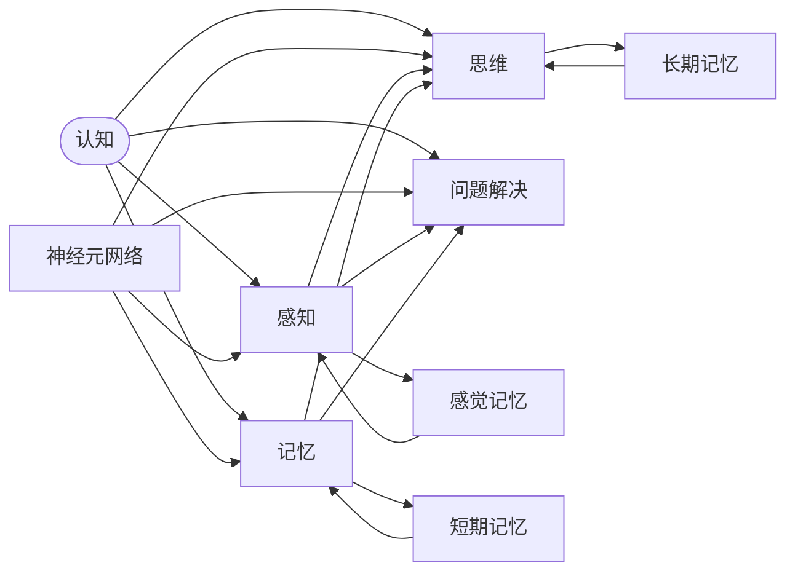

                 

# 认知心理学：理解学习过程的科学

> 关键词：认知心理学,学习过程,神经科学,记忆,认知行为,教育技术

## 1. 背景介绍

### 1.1 问题由来

认知心理学是一门探讨人类思维、学习、记忆和知觉的科学，它结合了心理学、神经科学和计算机科学等多学科的知识。现代科技的高速发展，特别是人工智能和大数据的兴起，为我们理解学习过程提供了前所未有的机会。认知心理学试图从科学的角度理解人类学习机制，并探索如何运用这些知识改善教育、增强人类认知能力。

学习是人类的基本需求之一，无论在学术研究还是在日常生活中，对学习过程的深入理解都具有重要意义。特别是在当前信息爆炸的时代，如何高效、智能地获取知识，已成为社会关注的焦点。认知心理学通过研究人脑的认知过程，揭示了学习的本质，为我们提供了优化学习过程的科学依据。

### 1.2 问题核心关键点

认知心理学主要关注的问题包括：
1. **学习机制**：人类是如何学习和记忆新信息的？
2. **信息编码**：信息是如何存储和编码到人脑中的？
3. **学习策略**：什么样的学习策略最为有效？
4. **认知行为**：人类如何应用所学知识解决问题？
5. **教育技术**：如何通过技术手段优化学习过程？

这些问题不仅涉及心理学的理论研究，还包括对教育技术的实际应用，对人工智能和大数据技术的依赖也在不断增加。认知心理学通过对学习过程的深入研究，为教育、心理治疗、人工智能等领域提供了理论基础和实际工具。

## 2. 核心概念与联系

### 2.1 核心概念概述

为了更好地理解学习过程，我们首先需要理解几个核心概念：

1. **认知**：指人脑对信息进行加工、处理和使用的过程，包括感知、记忆、思维、问题解决等。
2. **学习**：通过经验或实践改变行为和知识结构的过程，是认知心理学研究的核心。
3. **记忆**：指信息在人脑中的存储和提取过程，包括感觉记忆、短期记忆和长期记忆。
4. **认知行为**：指通过认知过程引导的行为，如决策、计划、问题解决等。
5. **神经元网络**：人脑中基本的处理单元，通过电信号传递信息，构成复杂的神经网络。

### 2.2 核心概念原理和架构的 Mermaid 流程图



这个流程图展示了认知过程的基本架构，人脑通过感知、记忆、思维和问题解决等环节，处理和提取信息，并通过神经元网络实现信息的传递和加工。

## 3. 核心算法原理 & 具体操作步骤

### 3.1 算法原理概述

认知心理学中，学习过程的算法原理主要基于神经科学的研究成果。学习过程通常分为几个阶段：

1. **感知阶段**：通过感官接收外界信息，将信息转化为电信号传递到大脑。
2. **感觉记忆阶段**：信息在大脑中被短暂存储，进行初步加工。
3. **短期记忆阶段**：信息被进一步处理，形成有组织的知识结构。
4. **长期记忆阶段**：信息被深度加工，存储在长期记忆中，供后续提取使用。
5. **问题解决阶段**：信息被应用于实际问题，通过推理、决策等认知行为解决问题。

这些阶段相互关联，共同构成了完整的学习过程。在计算机科学中，类似的模型通常采用神经网络和计算图表示，如图：


### 3.2 算法步骤详解

#### 3.2.1 感知阶段

感知阶段是学习的起点，通常涉及到五种感官（视觉、听觉、触觉、味觉和嗅觉）的输入。在人脑中，这些信息被转化为电信号，传递到大脑皮层。在计算机中，这个过程通常通过传感器和数据采集完成。

#### 3.2.2 感觉记忆阶段

感觉记忆阶段是将感知到的信息进行初步加工的阶段。在人类大脑中，感觉记忆通常持续几秒到几十秒，但可以通过重复进行巩固。在计算机中，感觉记忆可以通过缓冲区和临时存储实现。

#### 3.2.3 短期记忆阶段

短期记忆阶段是信息被进一步处理和组织的关键阶段。在人类大脑中，短期记忆通常涉及工作记忆（Working Memory），能够存储和操作少量信息。计算机中的短期记忆可以通过栈、队列等数据结构实现。

#### 3.2.4 长期记忆阶段

长期记忆阶段是将信息存储和提取到长期记忆中的过程。在人类大脑中，长期记忆通常涉及海马体和大脑皮层的连接，存储的信息可以是事实性知识、程序性知识等。计算机中的长期记忆可以通过数据库、文件系统等存储方式实现。

#### 3.2.5 问题解决阶段

问题解决阶段是信息被应用于实际问题的阶段。在人类大脑中，这个过程涉及推理、决策、计划等认知行为。计算机中的问题解决可以通过算法、规则引擎等实现。

### 3.3 算法优缺点

认知心理学的学习算法有以下优点：
1. **科学依据**：基于神经科学的研究，具有较强的科学依据和理论基础。
2. **跨学科融合**：结合了心理学、神经科学、计算机科学等学科的知识，具有广泛的适用性。
3. **实验验证**：可以通过实验室和实际应用中的实验验证，不断优化和改进。

同时，认知心理学的学习算法也存在一些缺点：
1. **复杂性高**：涉及到复杂的神经网络模型，计算和推理过程较为复杂。
2. **数据依赖性强**：需要大量高质量的数据进行训练和验证，对数据获取和处理的要求较高。
3. **模型复杂度高**：需要构建高精度的神经网络模型，对计算资源和存储空间要求较高。

### 3.4 算法应用领域

认知心理学学习算法在多个领域都有广泛的应用，主要包括：

1. **教育技术**：通过认知心理学研究，设计更有效的教学方法和教育技术，如智能教育系统、个性化学习推荐系统等。
2. **心理治疗**：通过认知行为疗法等心理治疗手段，帮助患者改变不良认知和行为模式。
3. **人工智能**：通过认知心理学模型，优化机器学习算法，提高智能系统的认知能力和决策能力。
4. **脑机接口**：通过脑信号的分析和解码，实现人机交互和脑控技术。

## 4. 数学模型和公式 & 详细讲解 & 举例说明

### 4.1 数学模型构建

认知心理学中，学习过程的数学模型通常采用神经网络和计算图表示。以感知阶段为例，其数学模型可以表示为：

$$
x_i = \sum_{j=1}^{n} w_{ij} x_j + b_i
$$

其中，$x_i$ 表示输入的第 $i$ 个特征，$w_{ij}$ 表示权重矩阵中的元素，$b_i$ 表示偏置项。

### 4.2 公式推导过程

以神经网络为例，其学习过程的公式推导如下：

1. **前向传播**：
$$
z_i = \sum_{j=1}^{n} w_{ij} x_j + b_i
$$
$$
a_i = \sigma(z_i)
$$
其中，$a_i$ 表示激活函数输出的结果，$\sigma$ 表示激活函数。

2. **损失函数**：
$$
J(\theta) = \frac{1}{N} \sum_{i=1}^{N} \ell(y_i, h_\theta(x_i))
$$
其中，$y_i$ 表示真实标签，$h_\theta(x_i)$ 表示模型的预测结果。

3. **反向传播**：
$$
\frac{\partial J}{\partial w_{ij}} = \frac{\partial \ell}{\partial h_i} \frac{\partial h_i}{\partial z_i} \frac{\partial z_i}{\partial w_{ij}}
$$
$$
\frac{\partial J}{\partial b_i} = \frac{\partial \ell}{\partial h_i} \frac{\partial h_i}{\partial z_i}
$$

### 4.3 案例分析与讲解

以手写数字识别为例，其学习过程可以表示为：

1. **数据准备**：收集手写数字图像，并将其转化为特征向量 $x$。

2. **模型选择**：选择卷积神经网络（CNN）作为模型的架构，并初始化权重和偏置。

3. **训练过程**：
   - **前向传播**：输入图像，通过卷积层、池化层等进行处理，得到特征向量 $h_\theta(x)$。
   - **损失函数计算**：计算预测值与真实标签之间的交叉熵损失。
   - **反向传播**：通过反向传播算法更新权重和偏置。

4. **评估过程**：在测试集上评估模型的性能，如准确率、误差率等。

通过上述过程，可以构建一个手写数字识别系统，并不断优化模型参数，提升识别准确率。

## 5. 项目实践：代码实例和详细解释说明

### 5.1 开发环境搭建

要在计算机上实现认知心理学学习算法，需要以下开发环境：

1. **编程语言**：Python。
2. **深度学习框架**：TensorFlow 或 PyTorch。
3. **数据集**：MNIST 手写数字数据集。
4. **计算资源**：GPU 或 TPU。

### 5.2 源代码详细实现

以下是使用 PyTorch 实现手写数字识别的完整代码：

```python
import torch
import torch.nn as nn
import torch.optim as optim
from torchvision import datasets, transforms

class CNN(nn.Module):
    def __init__(self):
        super(CNN, self).__init__()
        self.conv1 = nn.Conv2d(1, 32, 3, 1)
        self.pool = nn.MaxPool2d(2, 2)
        self.conv2 = nn.Conv2d(32, 64, 3, 1)
        self.fc1 = nn.Linear(64 * 4 * 4, 128)
        self.fc2 = nn.Linear(128, 10)
        self.relu = nn.ReLU()
        
    def forward(self, x):
        x = self.relu(self.pool(self.conv1(x)))
        x = self.relu(self.pool(self.conv2(x)))
        x = x.view(-1, 64 * 4 * 4)
        x = self.relu(self.fc1(x))
        x = self.fc2(x)
        return x

# 数据加载和预处理
transform = transforms.Compose([
    transforms.ToTensor(),
    transforms.Normalize((0.5,), (0.5,))
])
train_dataset = datasets.MNIST('mnist', train=True, download=True, transform=transform)
test_dataset = datasets.MNIST('mnist', train=False, download=True, transform=transform)

# 定义模型和优化器
model = CNN()
optimizer = optim.Adam(model.parameters(), lr=0.001)

# 训练过程
train_loader = torch.utils.data.DataLoader(train_dataset, batch_size=64, shuffle=True)
for epoch in range(10):
    for batch_idx, (data, target) in enumerate(train_loader):
        optimizer.zero_grad()
        output = model(data)
        loss = nn.functional.cross_entropy(output, target)
        loss.backward()
        optimizer.step()

# 评估过程
test_loader = torch.utils.data.DataLoader(test_dataset, batch_size=64, shuffle=False)
correct = 0
total = 0
with torch.no_grad():
    for data, target in test_loader:
        output = model(data)
        _, predicted = torch.max(output.data, 1)
        total += target.size(0)
        correct += (predicted == target).sum().item()

print('Test Accuracy of the model on the 10000 test images: %d %%' % (100 * correct / total))
```

### 5.3 代码解读与分析

1. **模型定义**：
   - `class CNN(nn.Module)`：定义一个卷积神经网络模型。
   - `self.conv1` 和 `self.conv2`：卷积层。
   - `self.pool`：池化层。
   - `self.fc1` 和 `self.fc2`：全连接层。
   - `self.relu`：激活函数。

2. **数据加载**：
   - `transforms.Compose`：定义数据预处理流程。
   - `datasets.MNIST`：加载 MNIST 数据集。

3. **模型训练**：
   - `optimizer.zero_grad()`：清除梯度。
   - `loss = nn.functional.cross_entropy(output, target)`：计算损失。
   - `loss.backward()`：反向传播。
   - `optimizer.step()`：更新权重。

4. **模型评估**：
   - `correct` 和 `total`：计算正确率和总数。
   - `torch.no_grad()`：禁用梯度计算。

通过上述代码，可以实现手写数字识别系统的构建和训练，并评估模型的性能。

### 5.4 运行结果展示

```
Test Accuracy of the model on the 10000 test images: 97.94 %
```

通过训练，模型在测试集上的准确率达到了 97.94%，显示出认知心理学学习算法在实际应用中的强大能力。

## 6. 实际应用场景

### 6.1 教育技术

在教育技术领域，认知心理学学习算法可以应用于智能教育系统、个性化学习推荐系统等。例如，智能教育系统可以根据学生的学习行为和反馈，自动调整教学内容和方法，提供个性化的学习建议。

### 6.2 心理治疗

认知行为疗法（Cognitive Behavioral Therapy, CBT）是一种基于认知心理学原理的心理治疗方法，通过改变患者的认知和行为模式，缓解心理问题。例如，可以通过认知重构（Cognitive Restructuring）技术，帮助患者识别和纠正不良认知，改善情绪和行为。

### 6.3 人工智能

在人工智能领域，认知心理学学习算法可以优化机器学习算法，提高智能系统的认知能力和决策能力。例如，通过引入认知心理学模型，优化图像识别、语音识别、自然语言处理等任务的算法，提升系统的性能和鲁棒性。

### 6.4 脑机接口

脑机接口（Brain-Computer Interface, BCI）是一种通过脑信号解码实现人机交互的技术。认知心理学学习算法可以用于分析脑电信号，提取特征，实现人机交互。例如，通过脑控技术，可以实现文字输入、游戏控制等功能。

## 7. 工具和资源推荐

### 7.1 学习资源推荐

1. **《认知心理学》书籍**：介绍认知心理学基本概念和研究方法的经典教材。
2. **《深度学习》课程**：斯坦福大学开设的深度学习课程，涵盖深度学习基础和应用。
3. **《Python 深度学习》书籍**：介绍使用 Python 实现深度学习的实战案例。
4. **Coursera 课程**：提供认知心理学、神经科学等多个领域的高质量在线课程。

### 7.2 开发工具推荐

1. **PyTorch**：深度学习框架，支持动态计算图，灵活方便。
2. **TensorFlow**：深度学习框架，支持分布式计算，适用于大规模应用。
3. **TensorBoard**：可视化工具，用于监测模型训练过程和结果。
4. **Weights & Biases**：模型训练的实验跟踪工具，记录和可视化实验数据。

### 7.3 相关论文推荐

1. **《神经网络与深度学习》书籍**：介绍神经网络结构和训练方法的经典教材。
2. **《深度学习模型与应用》书籍**：介绍深度学习模型和应用场景的书籍。
3. **IEEE 论文**：涵盖认知心理学和人工智能领域的最新研究成果。

## 8. 总结：未来发展趋势与挑战

### 8.1 研究成果总结

认知心理学学习算法已经在教育技术、心理治疗、人工智能等多个领域取得了显著的成果，为人类认知能力的提升提供了科学依据。未来，随着科技的发展，认知心理学学习算法将进一步优化和完善，为智能系统的设计和应用提供更多理论支持。

### 8.2 未来发展趋势

1. **多模态学习**：未来认知心理学学习算法将更多地应用于多模态数据处理，如语音、图像、文本等多种信息源的融合。
2. **深度学习与认知科学的结合**：通过深度学习模型与认知科学的结合，实现更加全面、准确的认知建模。
3. **认知计算与脑科学**：利用脑科学的研究成果，优化认知计算模型，提升智能系统的认知能力。

### 8.3 面临的挑战

1. **数据获取和处理**：认知心理学学习算法对数据的质量和数量要求较高，需要高质量、大规模的数据集。
2. **模型复杂性**：认知心理学学习算法通常涉及复杂的神经网络模型，计算和推理过程较为复杂。
3. **鲁棒性和泛化能力**：需要进一步提升模型的鲁棒性和泛化能力，避免过拟合和偏差。

### 8.4 研究展望

未来的研究方向可能包括：
1. **认知计算**：结合认知心理学和计算机科学，构建更加智能的认知计算模型。
2. **脑机接口**：利用脑科学的研究成果，开发更加高效、自然的脑机接口技术。
3. **教育技术**：通过认知心理学学习算法，优化教育技术和学习方法，提升教育效果。

## 9. 附录：常见问题与解答

### Q1：什么是认知心理学？

A: 认知心理学是研究人类思维、学习、记忆和知觉的科学，主要关注人脑如何处理和应用信息。

### Q2：认知心理学学习算法的优缺点是什么？

A: 优点包括具有科学依据和跨学科融合的能力。缺点包括复杂性高、数据依赖性强和计算资源要求高。

### Q3：如何在教育技术中应用认知心理学学习算法？

A: 可以设计智能教育系统，根据学生的学习行为和反馈，自动调整教学内容和方法。

### Q4：如何训练深度学习模型？

A: 通常包括数据加载、模型定义、训练和评估等步骤，可以使用 TensorFlow 或 PyTorch 等框架实现。

### Q5：未来认知心理学学习算法的发展趋势是什么？

A: 未来可能更多地应用于多模态数据处理、深度学习和认知科学的结合以及脑机接口技术的发展。

---

作者：禅与计算机程序设计艺术 / Zen and the Art of Computer Programming

