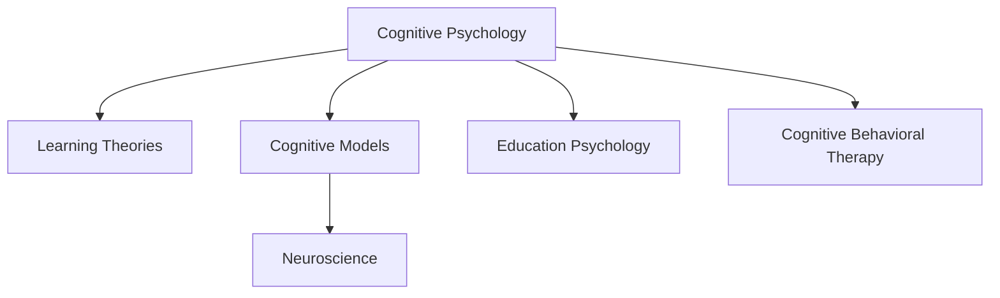

                 

# 认知心理学：理解学习过程的科学

> 关键词：认知心理学, 学习理论, 认知模型, 神经科学, 教育心理学, 认知行为疗法

## 1. 背景介绍

### 1.1 问题由来
学习是人类最基本、最普遍的能力之一，从婴儿的牙牙学语到成人的日积月累，学习贯穿了整个生命过程。然而，我们如何学习，学习过程中如何存储和提取信息，以及学习的机制是什么，这些问题的答案往往难以捉摸。认知心理学作为研究人类学习、记忆、思维等心理过程的科学，通过对学习过程的深入研究，为我们提供了理解人类认知行为的科学视角和方法。

### 1.2 问题核心关键点
认知心理学从20世纪初开始，逐渐发展成为一门系统的学科，其主要研究人类如何获取、处理、存储和应用信息。认知心理学的方法包括实验、观察、调查和计算模拟等，其理论基础来自神经科学、发展心理学、语言学、人工智能等多个领域。认知心理学不仅帮助我们理解个体如何学习，还为教育、临床心理治疗、人机交互等领域提供了理论指导和实践参考。

## 2. 核心概念与联系

### 2.1 核心概念概述

为了更好地理解认知心理学，本节将介绍几个核心的概念及其相互联系：

- **认知心理学（Cognitive Psychology）**：研究人类如何获取、处理、存储和应用信息的科学。
- **学习理论（Learning Theories）**：研究人类和动物如何通过经验获得知识、技能和行为的科学。
- **认知模型（Cognitive Models）**：通过计算机模拟和数学建模，对认知过程进行仿真和预测。
- **神经科学（Neuroscience）**：研究大脑结构和功能的科学，为认知心理学的研究提供了生物学基础。
- **教育心理学（Educational Psychology）**：研究学习与教学过程的科学，为教育实践提供理论指导。
- **认知行为疗法（Cognitive Behavioral Therapy, CBT）**：一种以认知过程为核心的心理治疗方法，通过改变思维方式来调节情感和行为。

这些核心概念之间的逻辑关系可以通过以下Mermaid流程图来展示：



这个流程图展示了认知心理学与其他相关领域之间的联系，其中：

- 认知心理学与学习理论、认知模型、教育心理学和认知行为疗法之间有着直接的关联。
- 神经科学为认知心理学的研究提供了生物学基础。

## 3. 核心算法原理 & 具体操作步骤

### 3.1 算法原理概述

认知心理学中的学习模型通常基于以下假设：

- 学习是信息加工和编码的过程。
- 学习的信息存储在记忆中，通过检索提取被应用。
- 学习依赖于环境刺激和个体的认知结构。

根据这些假设，认知心理学家提出了各种学习模型，如经典条件反射、操作条件反射、强化学习等。这些模型描述了学习过程中的信息编码、存储和提取机制，并解释了学习行为的变化规律。

### 3.2 算法步骤详解

认知心理学中的学习模型构建和操作通常包括以下步骤：

**Step 1: 定义问题空间**
- 确定研究的具体问题，如儿童如何学习数学，成年人如何记忆信息等。
- 明确问题的研究范围和假设，如儿童学习数学是否依赖于图形理解。

**Step 2: 设计实验**
- 根据问题空间设计实验，如观察儿童学习数学的过程，记录其认知行为和表现。
- 使用合适的实验方法，如观察法、问卷调查、心理测验等，收集数据。

**Step 3: 数据收集和处理**
- 收集实验数据，如儿童在解决数学问题时的反应时间、正确率、错误类型等。
- 对数据进行预处理，如去除异常值、数据标准化等。

**Step 4: 构建认知模型**
- 根据收集的数据，构建认知模型，如神经网络、联结主义模型、符号主义模型等。
- 通过仿真和预测，验证模型的有效性，如通过模拟儿童学习数学的认知过程，预测其学习效果。

**Step 5: 模型评估和优化**
- 使用多种评估指标，如准确率、召回率、F1分数等，评估模型的性能。
- 根据评估结果，对模型进行优化，如调整参数、增加复杂度、引入新的认知机制等。

### 3.3 算法优缺点

认知心理学中的学习模型具有以下优点：
- 理论与实践紧密结合，解释了学习过程中的信息编码、存储和提取机制。
- 模型可预测和模拟学习行为，为教育实践提供了理论指导。
- 跨领域应用广泛，如神经科学、教育心理学、临床心理治疗等。

同时，这些模型也存在一些局限性：
- 数据量需求大，难以收集大量的实验数据。
- 模型复杂度高，解析和优化难度大。
- 理论假设单一，难以解释复杂的学习行为。

尽管存在这些局限性，但就目前而言，认知心理学中的学习模型仍是对学习过程研究的重要工具，为认知行为疗法、教育改革、人工智能等领域提供了理论支持。

### 3.4 算法应用领域

认知心理学中的学习模型广泛应用于以下领域：

- **教育心理学**：帮助教师理解学生学习过程，优化教学方法，提高教学效果。
- **神经心理学**：研究神经基础，理解认知过程和行为机制，指导临床治疗。
- **人工智能**：构建认知模型，用于智能系统的设计和开发，如认知机器人和自然语言处理。
- **认知行为疗法**：基于认知模型，通过改变思维方式来调节情感和行为，用于治疗抑郁症、焦虑症等心理问题。
- **学习理论**：研究学习机制，解释人类和动物如何通过经验获得知识和技能。

## 4. 数学模型和公式 & 详细讲解 & 举例说明

### 4.1 数学模型构建

认知心理学中的学习模型通常基于数学建模，以数学公式表示认知过程和行为规律。例如，强化学习模型使用数学公式描述环境刺激、行为选择和奖励反馈之间的动态关系。

### 4.2 公式推导过程

以强化学习中的Q-learning算法为例，其核心公式如下：

$$ Q(s,a) = Q(s,a) + \alpha [r + \gamma \max Q(s',a') - Q(s,a)] $$

其中，$Q(s,a)$表示在状态$s$下选择动作$a$的期望回报，$r$为即时奖励，$\gamma$为折扣因子，$s'$为下一个状态，$a'$为下一个动作，$\alpha$为学习率。

这个公式表示，在状态$s$下选择动作$a$的回报，可以通过即时奖励$r$加上下一个状态$s'$的最大回报$Q(s',a')$进行更新，乘以折扣因子$\gamma$进行折现，再减去当前动作的回报$Q(s,a)$，乘以学习率$\alpha$进行学习率控制。

### 4.3 案例分析与讲解

Q-learning算法可以应用于多个领域，如机器人控制、游戏策略优化、自动化交易等。以下是一个Q-learning算法的简单实现示例：

```python
import numpy as np

# 定义状态、动作和回报
states = ['A', 'B', 'C']
actions = ['left', 'right']
rewards = {'A': {'left': -1, 'right': 1}, 'B': {'left': 1, 'right': -1}, 'C': {'left': 1, 'right': -1}}
discount_factor = 0.9
learning_rate = 0.5

# 初始化Q值表
Q = np.zeros((len(states), len(actions)))

# Q-learning算法实现
for episode in range(1000):
    state = np.random.choice(states)
    while True:
        action = np.random.choice(actions)
        next_state = np.random.choice(states)
        reward = rewards[state][action]
        Q[state][action] += learning_rate * (reward + discount_factor * np.max(Q[next_state]) - Q[state][action])
        state = next_state
        if state == 'C':
            break

print(Q)
```

这个代码实现了一个简单的Q-learning算法，用于一个简单的状态空间，通过不断更新Q值表，学习出最优策略。

## 5. 项目实践：代码实例和详细解释说明

### 5.1 开发环境搭建

要进行认知心理学中的学习模型实践，需要搭建一个开发环境，包括必要的软件工具和数据集。以下是一个基于Python的开发环境搭建示例：

1. 安装Python：从官网下载并安装Python 3.x版本。
2. 安装必要的包：使用pip安装numpy、scipy、matplotlib等科学计算包。
3. 准备数据集：收集实验数据，如学生学习数学的记录、行为数据等，存储在CSV或文本文件中。
4. 准备实验环境：搭建实验平台，如使用Jupyter Notebook或PyCharm等IDE。

### 5.2 源代码详细实现

以神经网络模型为例，以下是一个简单的神经网络模型实现示例：

```python
import numpy as np
import matplotlib.pyplot as plt

# 定义神经网络模型
class NeuralNetwork:
    def __init__(self, input_size, hidden_size, output_size):
        self.input_size = input_size
        self.hidden_size = hidden_size
        self.output_size = output_size
        self.weights1 = np.random.randn(input_size, hidden_size)
        self.weights2 = np.random.randn(hidden_size, output_size)
        
    def forward(self, X):
        self.z = np.dot(X, self.weights1)
        self.z2 = self.sigmoid(self.z)
        self.z3 = np.dot(self.z2, self.weights2)
        y_hat = self.sigmoid(self.z3)
        return y_hat
    
    def sigmoid(self, z):
        return 1 / (1 + np.exp(-z))
    
    def sigmoid_derivative(self, z):
        return z * (1 - z)
    
    def train(self, X, y, learning_rate, epochs):
        for epoch in range(epochs):
            output = self.forward(X)
            loss = np.mean(np.square(y - output))
            d_weights2 = np.dot(self.z2.T, (2 * (y - output) * self.sigmoid_derivative(output)))
            d_weights1 = np.dot(X.T, (np.dot(2 * (y - output) * self.sigmoid_derivative(output), self.z2.T) * self.sigmoid_derivative(self.z2)))
            self.weights1 += learning_rate * d_weights1
            self.weights2 += learning_rate * d_weights2
    
    def predict(self, X):
        y_hat = self.forward(X)
        return np.round(y_hat)

# 准备数据集
X = np.array([[0, 0], [0, 1], [1, 0], [1, 1]])
y = np.array([[0], [1], [1], [0]])

# 训练模型
nn = NeuralNetwork(2, 3, 1)
nn.train(X, y, 0.1, 10000)

# 测试模型
y_pred = nn.predict(X)
print(y_pred)
```

这个代码实现了一个简单的神经网络模型，用于处理简单的逻辑门问题，通过前向传播和反向传播更新权重，实现二值分类。

### 5.3 代码解读与分析

在这个代码实现中，主要使用了sigmoid激活函数和均方误差损失函数。sigmoid函数用于激活神经元，将输入映射到0和1之间。均方误差损失函数用于计算模型预测和真实标签之间的误差，并通过反向传播更新权重。

在训练过程中，使用随机梯度下降法更新权重，以均方误差为损失函数，迭代多次训练模型。训练完成后，使用模型对新的数据进行预测，得到预测结果。

## 6. 实际应用场景

### 6.1 认知行为疗法

认知行为疗法（CBT）是一种基于认知心理学理论的心理治疗方法，用于治疗抑郁症、焦虑症、强迫症等心理问题。CBT通过改变个体的认知结构和行为模式，帮助其摆脱消极情绪和思维模式，建立积极健康的心态。

在CBT中，治疗师和患者共同制定认知行为干预计划，通过认知重构、行为实验、家庭作业等方法，逐步改变患者的认知和行为模式。这种治疗方法广泛应用于心理咨询和治疗领域，被证明对许多心理问题有显著疗效。

### 6.2 教育心理学

教育心理学是研究学习过程及其在教育中的应用，旨在提高教学效果和学习效率。认知心理学中的学习模型为教育心理学提供了理论基础和方法指导，帮助教师理解学生的学习过程，设计有效的教学策略。

例如，研究者使用认知模型模拟儿童学习数学的过程，发现儿童在解决复杂数学问题时，依赖于图形理解和空间认知。基于这些发现，教师可以通过引入图形化教学工具和空间认知训练，提高学生的数学学习效果。

### 6.3 人工智能

认知心理学中的学习模型在人工智能领域也得到了广泛应用。通过构建认知模型，人工智能系统可以模拟人类认知过程，实现智能决策和行为预测。

例如，在自然语言处理中，通过构建语言模型，AI可以理解自然语言，进行文本分类、情感分析、机器翻译等任务。在机器人控制中，通过构建动作规划和感知模型，AI可以模拟人类行为，实现自主导航、对象识别等任务。

### 6.4 未来应用展望

随着认知心理学研究的不断深入，基于认知心理学理论的学习模型将在更多领域得到应用，为人类认知智能的进化带来新的突破。

在智慧医疗领域，基于认知心理学的学习模型可以用于医学教育、诊断和治疗，帮助医生理解和应用复杂的医学知识。

在智能教育领域，认知心理学中的学习模型可以用于个性化学习、智能辅导系统，提高学生的学习效果和兴趣。

在智慧城市治理中，认知心理学中的学习模型可以用于城市事件监测、应急管理，提高城市管理的自动化和智能化水平。

此外，在企业生产、社会治理、文娱传媒等众多领域，认知心理学中的学习模型也将不断拓展应用，为经济社会发展注入新的动力。相信随着学界和产业界的共同努力，认知心理学中的学习模型必将在构建人机协同的智能时代中扮演越来越重要的角色。

## 7. 工具和资源推荐

### 7.1 学习资源推荐

为了帮助开发者系统掌握认知心理学中的学习模型，这里推荐一些优质的学习资源：

1. 《认知心理学概论》（Saul K oversey）：一本介绍认知心理学基本概念和研究方法的经典教材。
2. 《认知行为疗法基础》（Judith S Beck）：一本介绍认知行为疗法的理论基础和实践方法的经典教材。
3. 《深度学习》（Ian Goodfellow, Yoshua Bengio, Aaron Courville）：一本介绍深度学习原理和应用方法的经典教材，其中包含了大量认知心理学和神经科学的相关内容。
4. Coursera《认知心理学》课程：由斯坦福大学开设的认知心理学课程，提供系统化的学习资源和互动机会。
5. WeChat《认知心理学》专栏：腾讯平台推出的认知心理学专栏，包含大量认知心理学相关内容和学习资源。

通过对这些资源的学习实践，相信你一定能够快速掌握认知心理学中的学习模型，并用于解决实际的学习问题。

### 7.2 开发工具推荐

高效的开发离不开优秀的工具支持。以下是几款用于认知心理学中学习模型开发的常用工具：

1. Python：基于Python的开源深度学习框架，灵活动态的计算图，适合快速迭代研究。
2. Jupyter Notebook：交互式笔记本环境，适合撰写和执行Python代码，提供丰富的可视化工具。
3. TensorFlow：由Google主导开发的开源深度学习框架，生产部署方便，适合大规模工程应用。
4. Keras：基于TensorFlow等深度学习框架的高级API，提供了简单易用的接口，适合快速原型开发。
5. PyCharm：专业的IDE工具，支持Python开发和调试，提供丰富的代码编辑器和调试器。

合理利用这些工具，可以显著提升认知心理学中学习模型的开发效率，加快创新迭代的步伐。

### 7.3 相关论文推荐

认知心理学中的学习模型发展源于学界的持续研究。以下是几篇奠基性的相关论文，推荐阅读：

1. **"Conditioned Organization of Behavior: The Operant Aspects of Progressive Ratios and other Behaviors" by Michael G. Killeen**：介绍了操作条件反射理论和实验方法，为认知心理学中的学习研究提供了基础。
2. **"The Cognitive Psychology of Reasoning" by N. Shanks and P. A. Maguire**：介绍了认知心理学中推理过程的研究方法和理论模型，解释了人类如何处理复杂问题和推理决策。
3. **"Neural basis of memory" by Lisa A. Squire**：介绍了神经科学中关于记忆机制的研究，为认知心理学中的学习模型提供了生物学基础。
4. **"Deep Learning for Language Understanding and Generation" by Yoshua Bengio**：介绍了深度学习在自然语言处理中的应用，为认知心理学中的学习模型提供了技术支持。

这些论文代表了大语言模型微调技术的发展脉络。通过学习这些前沿成果，可以帮助研究者把握学科前进方向，激发更多的创新灵感。

## 8. 总结：未来发展趋势与挑战

### 8.1 总结

本文对认知心理学中的学习模型进行了全面系统的介绍。首先阐述了认知心理学和学习理论的研究背景和意义，明确了认知心理学在解释人类学习过程中的关键作用。其次，从原理到实践，详细讲解了认知心理学中的学习模型的构建和操作，给出了学习模型的代码实现。同时，本文还探讨了认知心理学中的学习模型在教育心理学、认知行为疗法、人工智能等领域的广泛应用前景。最后，本文精选了认知心理学中的学习模型的学习资源、开发工具和相关论文，力求为读者提供全方位的理论指导和实践指引。

通过本文的系统梳理，可以看到，认知心理学中的学习模型正在成为认知行为疗法、教育实践、人工智能等领域的重要工具，为人类认知智能的进化提供了科学理论和方法指导。未来，随着认知心理学研究的不断深入，基于认知心理学理论的学习模型将在更多领域得到应用，为经济社会发展注入新的动力。

### 8.2 未来发展趋势

展望未来，认知心理学中的学习模型将呈现以下几个发展趋势：

1. **跨领域应用扩展**：认知心理学中的学习模型将与其他学科和技术进行更深入的融合，如神经科学、计算机科学、人工智能等，推动认知行为疗法、教育改革、人工智能等领域的发展。
2. **模型复杂度和精准度提升**：随着神经科学和计算机技术的发展，认知心理学中的学习模型将变得更加复杂和精准，能够更准确地模拟人类认知过程。
3. **多模态数据融合**：未来的学习模型将不仅限于单一数据源，而是融合视觉、听觉、触觉等多模态数据，更全面地理解人类认知过程。
4. **个性化学习增强**：基于认知心理学中的学习模型，将开发更加智能、自适应的个性化学习系统，适应不同个体的认知特点和需求。
5. **实时反馈和干预**：未来的学习模型将具备实时反馈和干预能力，能够根据个体的认知行为和表现，动态调整学习策略和干预措施，提高学习效果。

以上趋势凸显了认知心理学中的学习模型在认知行为疗法、教育心理学、人工智能等领域的应用前景，为构建更加智能、高效、个性化的学习系统铺平了道路。

### 8.3 面临的挑战

尽管认知心理学中的学习模型已经取得了显著成果，但在迈向更加智能化、普适化应用的过程中，它仍面临着诸多挑战：

1. **数据量和多样性不足**：当前认知心理学中的学习模型往往依赖于单一数据源，数据量和多样性不足限制了模型的应用范围。
2. **模型复杂性和可解释性**：认知心理学中的学习模型通常比较复杂，难以解释其内部工作机制和决策逻辑，导致模型的可解释性和可验证性不足。
3. **跨领域应用困难**：认知心理学中的学习模型在不同领域中的应用需要定制化设计，难度较大，且跨领域融合仍然是一个挑战。
4. **实时性和交互性不足**：现有的学习模型往往缺乏实时反馈和交互能力，难以实现动态调整和自适应学习。
5. **伦理和安全问题**：认知心理学中的学习模型可能面临数据隐私和伦理问题，如何保护用户数据和隐私，确保模型的安全性，是一个重要的研究方向。

这些挑战需要研究者不断探索和优化，才能使认知心理学中的学习模型更好地应用于实际领域。

### 8.4 研究展望

面向未来，认知心理学中的学习模型的研究需要在以下几个方面寻求新的突破：

1. **多模态数据融合**：开发更加复杂、精确的多模态学习模型，融合视觉、听觉、触觉等多模态数据，更全面地理解人类认知过程。
2. **实时反馈和自适应**：开发具备实时反馈和自适应能力的学习模型，能够根据个体的认知行为和表现，动态调整学习策略和干预措施，提高学习效果。
3. **跨领域应用**：推动认知心理学中的学习模型在更多领域的应用，如医学、教育、机器人等领域，提供更加个性化、高效的学习和干预方法。
4. **可解释性和可验证性**：开发更加可解释、可验证的学习模型，能够解释其内部工作机制和决策逻辑，提高模型的可信度和应用范围。
5. **伦理和安全保障**：研究如何保护用户数据和隐私，确保模型的安全性，同时确保模型应用符合伦理和社会规范。

这些研究方向将推动认知心理学中的学习模型走向更加智能化、普适化和高效化，为构建人机协同的智能时代提供更加坚实的基础。

## 9. 附录：常见问题与解答

**Q1：认知心理学中的学习模型是否适用于所有领域？**

A: 认知心理学中的学习模型在教育心理学、认知行为疗法、人工智能等领域有着广泛的应用，但并不适用于所有领域。例如，对于复杂的系统控制和决策问题，基于认知心理学中的学习模型可能无法提供足够的指导和解释。

**Q2：认知心理学中的学习模型如何进行跨领域应用？**

A: 认知心理学中的学习模型进行跨领域应用，需要根据具体问题进行调整和优化。例如，在医疗领域，可以使用认知心理学中的学习模型进行医学教育和诊断，但需要对模型进行领域特定的数据和知识融合。

**Q3：认知心理学中的学习模型如何处理复杂的数据和问题？**

A: 认知心理学中的学习模型通常较为简单，难以处理复杂的数据和问题。需要通过引入神经网络、深度学习等复杂模型，或与其他学科和技术进行跨学科融合，才能更好地解决复杂问题。

**Q4：认知心理学中的学习模型如何提高可解释性？**

A: 认知心理学中的学习模型可以通过引入符号主义模型、因果推理等方法，提高其可解释性。同时，通过可视化工具和技术，对模型的内部机制进行分析和解释，也可以提高模型的可理解性。

**Q5：认知心理学中的学习模型如何应用于人工智能？**

A: 认知心理学中的学习模型可以用于人工智能中的认知建模和智能决策，例如在自然语言处理中，通过构建语言模型和认知模型，实现文本分类、情感分析、机器翻译等任务。

这些问题的解答，为我们进一步理解认知心理学中的学习模型提供了思路和指导，有助于在实际应用中充分发挥其潜力。

---

作者：禅与计算机程序设计艺术 / Zen and the Art of Computer Programming

