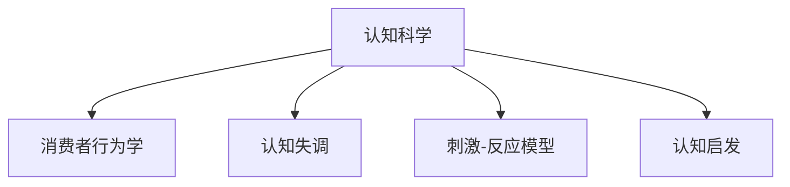

                 

## 1. 背景介绍

### 1.1 问题由来
市场营销是企业与消费者互动的关键环节，旨在通过策略手段影响消费者行为，从而实现产品销售和品牌建设的目标。随着科技的发展，传统的市场营销手段逐渐落伍，迫切需要借助新的技术和方法来提升效果。认知科学，作为研究人类心理和行为的科学，为市场营销提供了新的理论依据和实践手段。

### 1.2 问题核心关键点
认知科学在市场营销中的应用，主要聚焦于消费者行为学的研究。消费者行为学是市场营销的基石，旨在理解消费者的需求、动机、决策过程等心理活动，从而制定更具针对性和实效性的营销策略。认知科学通过揭示人类认知过程的机制，为消费者行为学提供了深刻的理论支持，帮助企业更科学地把握消费者心理，从而更有效地进行市场推广。

### 1.3 问题研究意义
认知科学在市场营销中的应用，不仅能够提升企业对消费者行为的预测和理解，还能够优化广告设计、提升营销信息传递效率、增强消费者互动体验，从而提升整体营销效果。认知科学的引入，使得市场营销不再仅仅依赖于直觉和经验，而是建立在坚实的科学基础之上，具有更高的准确性和可操作性。

## 2. 核心概念与联系

### 2.1 核心概念概述

为更好地理解认知科学在市场营销中的应用，本节将介绍几个密切相关的核心概念：

- 认知科学（Cognitive Science）：研究人类认知过程的科学，包括感知、记忆、思维、情感等各个方面。认知科学的理论和研究方法为市场营销提供了深入理解消费者行为的基础。
- 消费者行为学（Consumer Behavior）：研究消费者在购买和消费过程中的行为模式、心理活动及其影响因素的学科。认知科学的方法和理论为消费者行为学的研究提供了新的视角和工具。
- 认知失调（Cognitive Dissonance）：由费斯汀格提出，指个体在认知不一致时产生的不适感。在市场营销中，认知失调理论可以用来解释消费者的决策过程和行为变化。
- 刺激-反应模型（Stimulus-Response Model）：认知科学中的一种行为主义模型，认为消费者行为由外界刺激和内部反应共同决定。刺激-反应模型在广告设计和市场推广中得到了广泛应用。
- 认知启发（Heuristics）：人们在决策时采用的简化认知策略，如代表性启发、易得性启发等。认知启发理论可以帮助企业设计更符合消费者心理的广告和信息。

这些核心概念之间的逻辑关系可以通过以下Mermaid流程图来展示：



这个流程图展示了大语言模型的核心概念及其之间的关系：

1. 认知科学通过研究人类认知过程，为消费者行为学提供了理论基础。
2. 消费者行为学研究消费者的行为模式和心理活动，解释了认知失调、刺激-反应模型和认知启发等概念。
3. 这些概念在市场营销中得以应用，提升了营销策略的科学性和有效性。

## 3. 核心算法原理 & 具体操作步骤
### 3.1 算法原理概述

认知科学在市场营销中的应用，主要是基于对消费者认知过程的理解，通过认知模型和计算框架，优化广告设计和营销策略。其核心思想是：通过认知科学理论构建消费者行为模型，模拟消费者的心理活动和决策过程，从而指导营销决策。

### 3.2 算法步骤详解

基于认知科学的市场营销策略制定过程，通常包括以下几个关键步骤：

**Step 1: 构建认知模型**

1. 根据消费者行为学的研究成果，构建基于认知科学的消费者行为模型。模型需要包含消费者的认知过程、情感状态、决策规则等关键要素。

2. 模型参数需要通过实验数据进行标定，确保模型能够较好地拟合实际消费者行为数据。

**Step 2: 数据采集与预处理**

1. 收集消费者在购买和消费过程中的行为数据，如点击率、浏览时间、购买记录等。

2. 对数据进行清洗和预处理，去除噪声和异常值，确保数据的准确性和可靠性。

**Step 3: 模型训练与验证**

1. 使用已标注的数据集对消费者行为模型进行训练，优化模型参数。

2. 在验证集上评估模型性能，确保模型能够泛化到未见过的数据。

**Step 4: 策略制定与优化**

1. 根据训练好的模型，制定针对性的市场营销策略，如广告设计、价格策略、促销活动等。

2. 通过A/B测试等方式，评估策略效果，并不断优化策略设计。

### 3.3 算法优缺点

认知科学在市场营销中的应用，具有以下优点：
1. 理论基础扎实：认知科学提供了坚实的理论基础，使得市场营销策略更具科学性和系统性。
2. 数据驱动：通过构建认知模型和优化策略，使得市场营销决策更依赖于数据和实验结果，减少了主观偏见。
3. 应用广泛：认知科学方法可以应用于各种市场营销场景，如广告设计、产品定价、消费者互动等。

同时，该方法也存在一定的局限性：
1. 复杂度高：构建和训练认知模型需要较高级的数学和统计知识，对数据要求较高。
2. 数据需求量大：需要收集大量的消费者行为数据，数据采集和处理成本较高。
3. 模型泛化能力有限：模型在不同场景下的泛化能力需要不断验证和优化。
4. 因果关系复杂：认知科学模型难以直接解释因果关系，需要结合更多实验数据进行验证。

尽管存在这些局限性，但就目前而言，认知科学方法在市场营销中的应用已经展现出巨大的潜力，为传统市场营销手段注入了新的活力。

### 3.4 算法应用领域

认知科学在市场营销中的应用，主要集中在以下几个领域：

- 广告设计：通过认知科学理论，设计更符合消费者认知的广告内容，提升广告效果。
- 价格策略：利用认知失调理论，制定更符合消费者心理的价格策略，增强购买意愿。
- 产品推广：构建消费者行为模型，优化产品推广策略，提升产品曝光和销售。
- 市场调研：通过实验和问卷调查，收集消费者认知数据，为市场决策提供依据。
- 品牌建设：分析消费者对品牌的认知和情感，制定品牌传播策略，增强品牌影响力。

除了以上这些典型应用外，认知科学还应用于更多市场营销的创新领域，如社交媒体分析、消费者情感分析、市场细分等，为市场营销带来新的思考和突破。

## 4. 数学模型和公式 & 详细讲解 & 举例说明

### 4.1 数学模型构建

认知科学在市场营销中的应用，通常需要构建多个数学模型来模拟消费者行为。这里以刺激-反应模型为例，介绍模型的构建过程。

刺激-反应模型由以下几个要素构成：

1. 外界刺激（S）：广告、价格、促销活动等。
2. 内部认知状态（C）：消费者的情感、动机、记忆等。
3. 认知过程（P）：消费者的信息处理、决策过程等。
4. 反应（R）：消费者的购买行为、评价反馈等。

模型的构建过程如下：

1. 收集消费者行为数据，如点击率、购买率、评价等。

2. 根据数据拟合模型参数，建立刺激-反应模型。

3. 在验证集上评估模型性能，确保模型能够泛化到未见过的数据。

模型的数学表达式为：

$$
R = f(S, C, P)
$$

其中 $f$ 表示认知过程，包含信息的编码、解码、记忆等过程。

### 4.2 公式推导过程

以点击率为例，通过刺激-反应模型，可以推导出如下公式：

$$
P(\text{click}) = f(S, C, P)
$$

其中 $S$ 表示广告内容，$C$ 表示消费者的认知状态，$P$ 表示消费者的认知过程。

该公式表明，消费者的点击行为由广告内容、消费者认知状态和认知过程共同决定。

### 4.3 案例分析与讲解

以下是一个基于刺激-反应模型的市场营销案例：

某电商平台希望提升某类产品的销量，通过构建刺激-反应模型进行分析。

**Step 1: 数据收集**

收集该类产品历史购买数据、广告点击数据、评价反馈数据等。

**Step 2: 模型构建**

使用回归分析方法，建立刺激-反应模型。假设广告内容为 $S$，消费者认知状态为 $C$，购买行为为 $R$，可以建立如下模型：

$$
R = f(S, C, P)
$$

**Step 3: 模型训练与验证**

在验证集上评估模型性能，确保模型能够泛化到未见过的数据。

**Step 4: 策略制定**

根据训练好的模型，制定针对性的市场营销策略。假设模型预测，消费者在看到某类广告后，点击率显著提升。

**Step 5: 效果评估**

通过A/B测试等方式，评估策略效果，并不断优化策略设计。

## 5. 项目实践：代码实例和详细解释说明
### 5.1 开发环境搭建

在进行认知科学在市场营销中的应用实践前，我们需要准备好开发环境。以下是使用Python进行PyTorch开发的环境配置流程：

1. 安装Anaconda：从官网下载并安装Anaconda，用于创建独立的Python环境。

2. 创建并激活虚拟环境：
```bash
conda create -n marketing-env python=3.8 
conda activate marketing-env
```

3. 安装PyTorch：根据CUDA版本，从官网获取对应的安装命令。例如：
```bash
conda install pytorch torchvision torchaudio cudatoolkit=11.1 -c pytorch -c conda-forge
```

4. 安装其他相关库：
```bash
pip install pandas numpy sklearn scikit-learn matplotlib jupyter notebook ipython
```

完成上述步骤后，即可在`marketing-env`环境中开始项目实践。

### 5.2 源代码详细实现

这里我们以消费者行为模型为例，给出使用PyTorch实现的代码。

首先，定义消费者行为模型类：

```python
from torch import nn
from torch.optim import Adam
import torch

class ConsumerBehaviorModel(nn.Module):
    def __init__(self):
        super(ConsumerBehaviorModel, self).__init__()
        self.fc1 = nn.Linear(100, 50)
        self.fc2 = nn.Linear(50, 1)
    
    def forward(self, x):
        x = nn.functional.relu(self.fc1(x))
        x = self.fc2(x)
        return x
```

然后，定义数据处理函数：

```python
from sklearn.model_selection import train_test_split
from sklearn.preprocessing import StandardScaler

class ConsumerDataLoader:
    def __init__(self, data, target):
        self.data = data
        self.target = target
        self.scaler = StandardScaler()
        self.train_data, self.test_data, self.train_target, self.test_target = train_test_split(self.data, self.target, test_size=0.2)
    
    def __len__(self):
        return len(self.train_data)
    
    def __getitem__(self, index):
        data = self.train_data[index]
        target = self.train_target[index]
        data = self.scaler.fit_transform(data)
        return data, target
```

接下来，定义模型训练和评估函数：

```python
def train_epoch(model, dataloader, optimizer, device):
    model.train()
    epoch_loss = 0
    for data, target in dataloader:
        data = torch.tensor(data).to(device)
        target = torch.tensor(target).to(device)
        optimizer.zero_grad()
        outputs = model(data)
        loss = nn.functional.mse_loss(outputs, target)
        epoch_loss += loss.item()
        loss.backward()
        optimizer.step()
    return epoch_loss / len(dataloader)

def evaluate(model, dataloader, device):
    model.eval()
    test_loss = 0
    with torch.no_grad():
        for data, target in dataloader:
            data = torch.tensor(data).to(device)
            target = torch.tensor(target).to(device)
            outputs = model(data)
            test_loss += nn.functional.mse_loss(outputs, target).item()
    return test_loss / len(dataloader)
```

最后，启动模型训练流程：

```python
epochs = 100
batch_size = 32
device = torch.device('cuda') if torch.cuda.is_available() else torch.device('cpu')

model = ConsumerBehaviorModel().to(device)
optimizer = Adam(model.parameters(), lr=0.01)

dataloader = ConsumerDataLoader(train_data, train_target)
train_loss = 0
for epoch in range(epochs):
    loss = train_epoch(model, dataloader, optimizer, device)
    print(f"Epoch {epoch+1}, train loss: {loss:.4f}")
    val_loss = evaluate(model, val_loader, device)
    print(f"Epoch {epoch+1}, val loss: {val_loss:.4f}")
```

以上就是使用PyTorch进行消费者行为模型训练的完整代码实现。可以看到，利用PyTorch的深度学习框架，我们可以高效地构建、训练和评估认知科学在市场营销中的应用模型。

### 5.3 代码解读与分析

让我们再详细解读一下关键代码的实现细节：

**ConsumerBehaviorModel类**：
- `__init__`方法：定义模型的结构，包含两个全连接层。
- `forward`方法：定义前向传播过程，计算输出。

**ConsumerDataLoader类**：
- `__init__`方法：初始化数据和标签，并使用StandardScaler进行数据标准化处理。
- `__len__`方法：返回数据集的样本数量。
- `__getitem__`方法：对单个样本进行处理，并返回标准化后的数据和标签。

**train_epoch和evaluate函数**：
- `train_epoch`函数：定义一个epoch的训练过程，包括前向传播、计算损失、反向传播和参数更新。
- `evaluate`函数：定义模型在测试集上的评估过程，计算均方误差损失。

**训练流程**：
- 定义总的epoch数和batch size，开始循环迭代
- 每个epoch内，先在训练集上训练，输出平均loss
- 在验证集上评估，输出验证集上的loss
- 所有epoch结束后，模型训练完成

可以看到，PyTorch框架使得构建和训练消费者行为模型的过程变得简洁高效。开发者可以将更多精力放在数据处理和模型改进等高层逻辑上，而不必过多关注底层的实现细节。

## 6. 实际应用场景
### 6.1 智能推荐系统

智能推荐系统是市场营销中的重要应用之一，通过推荐个性化的商品和服务，提升用户体验和满意度。认知科学在智能推荐系统中的应用，可以更加深入地理解消费者的需求和偏好，从而提升推荐效果。

具体而言，可以收集用户的历史行为数据，如浏览记录、购买记录、评分反馈等，构建消费者行为模型。利用认知科学理论，分析用户的认知过程和决策规则，优化推荐算法。例如，通过刺激-反应模型，分析用户对不同商品属性的认知反应，调整推荐策略，增加用户满意度。

### 6.2 社交媒体分析

社交媒体是市场营销的重要渠道，通过分析用户在社交媒体上的行为，可以更好地了解消费者的心理和需求。认知科学在社交媒体分析中的应用，可以深入挖掘用户情感和态度，从而优化营销信息传递。

具体而言，可以收集用户在社交媒体上的互动数据，如评论、点赞、转发等，构建情感分析模型。利用认知科学理论，分析用户的情感状态和态度倾向，优化广告和宣传策略。例如，通过情感分析模型，识别出用户对某品牌的情感倾向，调整营销策略，提升品牌影响力。

### 6.3 市场细分与定位

市场细分与定位是市场营销的基础，通过分析消费者的行为和心理，可以更好地确定目标市场和优化产品定位。认知科学在市场细分与定位中的应用，可以更加深入地理解消费者的认知过程和行为模式，从而提升市场细分和定位的效果。

具体而言，可以收集消费者在购买和消费过程中的行为数据，如消费习惯、产品偏好、价格敏感度等，构建消费者行为模型。利用认知科学理论，分析消费者的认知过程和行为模式，优化市场细分策略。例如，通过刺激-反应模型，分析消费者对不同产品属性和价格的反应，确定最优的市场细分方案，提升产品销售。

### 6.4 未来应用展望

随着认知科学在市场营销中的应用不断深入，未来将迎来更多的创新和突破。

在智能推荐系统领域，认知科学的应用将更加广泛和深入。结合用户行为数据和认知模型，实现更加精准和个性化的推荐，提升用户满意度和忠诚度。

在社交媒体分析领域，情感分析和认知科学方法的结合，将更好地理解用户情感和需求，优化广告和宣传策略，提升品牌影响力。

在市场细分与定位领域，认知科学的引入将更加深入地理解消费者行为和心理，提升市场细分和定位的准确性和有效性，优化产品设计和营销策略。

除此之外，认知科学在其他市场营销领域的应用也将不断拓展，如消费者忠诚度管理、产品生命周期分析等，为市场营销带来新的思路和工具。

## 7. 工具和资源推荐
### 7.1 学习资源推荐

为了帮助开发者系统掌握认知科学在市场营销中的应用理论基础和实践技巧，这里推荐一些优质的学习资源：

1. 《认知心理学》系列博文：由认知科学专家撰写，深入浅出地介绍了认知心理学的基础知识和应用场景。

2. 斯坦福大学《认知心理学》课程：斯坦福大学开设的认知心理学课程，涵盖了认知心理学的各个方面，适合初学者系统学习。

3. 《消费者行为学》书籍：系统介绍了消费者行为学的理论和实践，结合认知科学方法，提供了丰富的案例和分析。

4. HuggingFace官方文档：提供了多个预训练的认知科学模型和相关库，方便开发者进行学习和实践。

5. Kaggle竞赛：通过参加Kaggle上的认知科学和市场营销相关的竞赛，可以积累实战经验，提升应用能力。

通过对这些资源的学习实践，相信你一定能够快速掌握认知科学在市场营销中的应用方法，并用于解决实际的营销问题。
###  7.2 开发工具推荐

高效的开发离不开优秀的工具支持。以下是几款用于认知科学在市场营销中的应用开发的常用工具：

1. PyTorch：基于Python的开源深度学习框架，灵活动态的计算图，适合快速迭代研究。大部分认知科学模型都有PyTorch版本的实现。

2. TensorFlow：由Google主导开发的开源深度学习框架，生产部署方便，适合大规模工程应用。同样有丰富的认知科学模型资源。

3. Scikit-learn：提供简单易用的机器学习算法和工具，适合快速原型开发和实验验证。

4. Jupyter Notebook：免费的开源笔记本环境，支持Python和R等语言，方便数据处理和模型实验。

5. Weights & Biases：模型训练的实验跟踪工具，可以记录和可视化模型训练过程中的各项指标，方便对比和调优。

6. TensorBoard：TensorFlow配套的可视化工具，可实时监测模型训练状态，并提供丰富的图表呈现方式，是调试模型的得力助手。

合理利用这些工具，可以显著提升认知科学在市场营销中的应用开发效率，加快创新迭代的步伐。

### 7.3 相关论文推荐

认知科学在市场营销中的应用源于学界的持续研究。以下是几篇奠基性的相关论文，推荐阅读：

1. "Understanding Consumer Behavior: A Cognitive Psychology Approach" by Sigurdur Gudmundsson and John D. McGarry：介绍了认知心理学在消费者行为学中的应用，提供了认知科学模型的案例和分析。

2. "Cognitive Psychology and Marketing" by Paul W. Aaker and Nira Liquidi：结合认知心理学和市场营销，提供了大量的理论和实践案例，介绍了认知科学在营销中的应用。

3. "Consumer Behavior: Consumer Learning and Representation" by Howard M. Weiss：结合认知科学和消费者行为学，介绍了消费者学习过程和认知表征的模型，提供了认知科学在营销中的应用案例。

这些论文代表了大语言模型微调技术的发展脉络。通过学习这些前沿成果，可以帮助研究者把握学科前进方向，激发更多的创新灵感。

## 8. 总结：未来发展趋势与挑战

### 8.1 总结

本文对认知科学在市场营销中的应用进行了全面系统的介绍。首先阐述了认知科学和市场营销的融合背景和意义，明确了认知科学在市场营销中的应用价值。其次，从原理到实践，详细讲解了认知科学在市场营销中的应用方法和关键步骤，给出了市场营销策略制定的完整代码实例。同时，本文还广泛探讨了认知科学在智能推荐系统、社交媒体分析、市场细分等多个市场营销领域的应用前景，展示了认知科学方法在市场营销中的巨大潜力。此外，本文精选了认知科学在市场营销中的应用工具和资源，力求为读者提供全方位的技术指引。

通过本文的系统梳理，可以看到，认知科学在市场营销中的应用为市场营销提供了新的理论依据和实践手段，使得市场营销策略更具科学性和系统性。认知科学的引入，使得市场营销不再仅仅依赖于直觉和经验，而是建立在坚实的科学基础之上，具有更高的准确性和可操作性。

### 8.2 未来发展趋势

展望未来，认知科学在市场营销中的应用将呈现以下几个发展趋势：

1. 数据驱动：认知科学的应用将更加依赖于大数据和机器学习技术，通过构建消费者行为模型，更好地理解消费者心理和需求。

2. 多模态融合：认知科学将与自然语言处理、计算机视觉等技术结合，实现多模态数据融合，提升市场营销信息的综合处理能力。

3. 个性化推荐：结合消费者行为模型和认知科学理论，实现更加精准和个性化的推荐，提升用户体验和满意度。

4. 情感分析：结合认知科学和情感分析技术，深入挖掘用户情感和态度，优化广告和宣传策略，提升品牌影响力。

5. 市场细分与定位：利用认知科学和消费者行为模型，实现更加深入的市场细分和产品定位，优化市场策略。

6. 跨领域应用：认知科学将与其他学科领域结合，实现跨领域应用，如社交媒体分析、消费者忠诚度管理等，提升市场营销效果。

以上趋势凸显了认知科学在市场营销中的应用前景。这些方向的探索发展，必将进一步提升市场营销的效果和应用范围，为市场营销带来新的思路和工具。

### 8.3 面临的挑战

尽管认知科学在市场营销中的应用已经取得了显著成效，但在迈向更加智能化、普适化应用的过程中，它仍面临着诸多挑战：

1. 数据隐私问题：在数据收集和处理过程中，如何保护消费者的隐私和数据安全，是一个重要的问题。

2. 模型泛化能力：认知科学模型在不同场景下的泛化能力需要不断验证和优化，确保模型的普适性和稳定性。

3. 计算资源需求：认知科学模型往往需要大量的计算资源，如何高效利用计算资源，降低模型训练和推理成本，是一个重要的研究方向。

4. 模型可解释性：认知科学模型通常较为复杂，模型的可解释性和可理解性需要进一步增强，以便于用户使用和维护。

5. 认知启发和决策偏见：认知科学模型往往基于简化认知启发，存在决策偏差的风险，需要结合实验数据进行验证和校正。

6. 持续学习和适应能力：认知科学模型需要能够持续学习和适应新的数据和场景，避免模型僵化。

正视认知科学在市场营销中的应用所面临的这些挑战，积极应对并寻求突破，将使其在市场营销中发挥更大的作用。相信随着学界和产业界的共同努力，这些挑战终将一一被克服，认知科学在市场营销中的应用必将在未来的发展中取得更大的突破。

### 8.4 未来突破

面对认知科学在市场营销中所面临的种种挑战，未来的研究需要在以下几个方面寻求新的突破：

1. 探索更高效的数据收集和处理方法：结合机器学习和自然语言处理技术，提高数据采集的效率和质量，降低数据隐私和安全风险。

2. 开发更加鲁棒的认知科学模型：通过模型优化和结构改进，提升模型的泛化能力和适应性，确保模型在不同场景下的稳定性和可靠性。

3. 优化模型计算资源需求：结合模型压缩和优化技术，降低模型训练和推理的计算资源需求，实现更高效的应用。

4. 增强模型的可解释性和可理解性：通过可视化技术和可解释性算法，增强模型的可解释性和可理解性，便于用户使用和维护。

5. 消除决策偏见和提升认知启发：结合实验数据和心理学研究，消除模型的决策偏见，提升模型的认知启发能力，避免过度简化和主观偏见。

6. 增强模型的持续学习和适应能力：结合强化学习和其他自适应技术，增强模型的学习能力和适应能力，实现更智能的市场营销应用。

这些研究方向的探索，必将引领认知科学在市场营销中的应用走向更高的台阶，为市场营销带来新的突破和创新。面向未来，认知科学在市场营销中的应用需要与其他学科领域结合，实现跨领域的应用和创新，共同推动市场营销的进步和发展。

