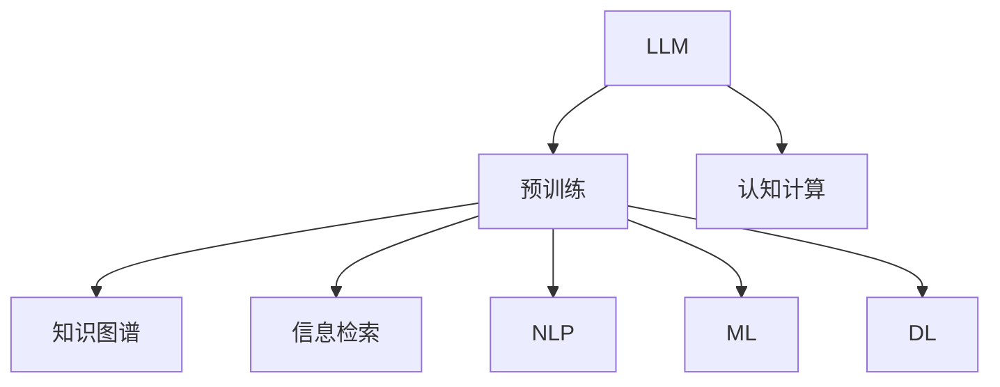

                 

# 认知计算新纪元：LLM改变信息处理模式

> 关键词：语言模型,LLM,认知计算,信息处理,自然语言处理(NLP),机器学习,深度学习,知识图谱,大数据

## 1. 背景介绍

### 1.1 问题由来
近年来，随着深度学习技术的发展，大语言模型（Large Language Models, LLMs）在自然语言处理（NLP）领域取得了巨大突破。这类模型基于大规模无标签文本数据进行预训练，能够理解自然语言，执行复杂的语言任务。其中，基于Transformer架构的BERT、GPT等模型已经成为NLP研究的基石。

然而，LLM的强大性能并非没有代价。其需要大量计算资源进行预训练，且在实际应用中，尤其是在处理海量数据时，仍然面临许多挑战。认知计算作为一种结合人工智能和认知科学的计算范式，旨在模拟人类认知过程，提升信息处理效率。因此，如何将LLM与认知计算相结合，提升其在大规模数据处理中的应用，成为当前研究热点。

### 1.2 问题核心关键点
1. **计算效率**：LLM在处理大规模数据时，计算复杂度高，资源消耗大，如何提升其计算效率，降低运行成本？
2. **知识融合**：如何有效融合领域知识，提升LLM对特定领域数据的理解和处理能力？
3. **模型可解释性**：如何使LLM在实际应用中具备更高的可解释性，提升用户信任？
4. **系统鲁棒性**：如何增强LLM系统的鲁棒性，避免在面对新数据时表现不稳定？
5. **安全与隐私**：如何在确保模型隐私安全的同时，提升其可用性和可靠性？

### 1.3 问题研究意义
认知计算与LLM的结合，有望显著提升信息处理效率和效果，为自然语言理解、知识图谱构建、智能问答系统等领域带来革命性变革。研究LLM在认知计算中的应用，对于推动人工智能技术在更多实际场景中的落地应用，具有重要意义。

## 2. 核心概念与联系

### 2.1 核心概念概述

为深入理解LLM在认知计算中的应用，本文将介绍几个关键概念：

- **大语言模型（LLM）**：基于深度学习技术，通过大规模无标签数据进行预训练，能够理解自然语言并执行复杂语言任务的模型，如BERT、GPT等。
- **认知计算**：结合人工智能与认知科学，模拟人类认知过程的计算范式，旨在提升信息处理效率和效果。
- **知识图谱**：通过有向图结构表示实体间关系的网络，用于知识表示和推理。
- **信息检索**：从大量数据中高效检索特定信息的技术。
- **自然语言处理（NLP）**：涉及语言理解、生成、分析等多个子领域，旨在使计算机能够理解、处理自然语言。
- **机器学习（ML）**：通过数据训练模型，提升模型性能的技术。
- **深度学习（DL）**：一种基于神经网络的机器学习方法，能够学习数据的高级表示。

这些概念之间相互关联，构成了LLM在认知计算应用的基础。通过理解这些概念，可以更好地把握LLM在认知计算中的工作原理和优化方向。

### 2.2 核心概念原理和架构的 Mermaid 流程图



该流程图展示了LLM在认知计算中的应用流程：

1. **预训练**：LLM通过大规模无标签数据进行预训练，学习语言表示。
2. **知识图谱**：利用知识图谱进行实体关系表示和推理。
3. **信息检索**：从大量数据中高效检索相关信息。
4. **NLP**：执行自然语言处理任务，如文本分类、情感分析等。
5. **ML**：利用机器学习算法提升模型性能。
6. **DL**：采用深度学习方法进行复杂语言任务的训练。

## 3. 核心算法原理 & 具体操作步骤

### 3.1 算法原理概述

LLM在认知计算中的应用，主要涉及以下几个方面：

- **知识融合**：通过知识图谱与LLM的结合，提升模型的领域知识表示和推理能力。
- **信息检索**：利用LLM进行高效的信息检索和文本摘要。
- **NLP任务**：执行复杂的NLP任务，如文本分类、情感分析、机器翻译等。
- **推理与决策**：利用LLM进行逻辑推理和决策制定。

这些应用的核心算法原理如下：

1. **知识融合**：将领域知识嵌入到LLM的语义空间中，提升模型对特定领域数据的理解和处理能力。
2. **信息检索**：通过构建索引和查询，利用LLM快速检索相关信息，提高信息处理效率。
3. **NLP任务**：采用Transformer等架构，利用LLM进行文本处理和分析，提升任务性能。
4. **推理与决策**：结合知识图谱和LLM，进行逻辑推理和决策制定，提升系统的智能化水平。

### 3.2 算法步骤详解

**知识融合**：

1. **构建知识图谱**：利用领域知识构建有向图结构，表示实体间关系。
2. **嵌入知识**：将知识图谱嵌入到LLM的语义空间中，提升模型的领域知识表示能力。
3. **模型训练**：在带有领域知识的训练数据上，对LLM进行微调，提升其对特定领域数据的理解。

**信息检索**：

1. **构建索引**：利用LLM将文本转换为向量表示，构建文本索引。
2. **查询处理**：利用LLM进行高效的信息检索，快速获取相关文本。
3. **结果处理**：利用LLM对检索结果进行摘要和筛选，提供高质量信息。

**NLP任务**：

1. **数据预处理**：对输入文本进行分词、去噪等预处理。
2. **模型输入**：将预处理后的文本输入到LLM中进行处理。
3. **任务执行**：利用LLM执行复杂的NLP任务，如文本分类、情感分析、机器翻译等。
4. **结果输出**：将LLM的输出结果进行后处理，如文本生成、情感评分等。

**推理与决策**：

1. **知识抽取**：利用LLM从文本中抽取实体和关系，构建知识图谱。
2. **推理推理**：利用知识图谱进行逻辑推理，得出结论。
3. **决策制定**：根据推理结果进行决策，生成行动方案。

### 3.3 算法优缺点

**知识融合**：

- **优点**：能够有效提升模型对特定领域数据的理解和处理能力。
- **缺点**：需要大量领域知识进行构建，增加了模型构建的复杂性。

**信息检索**：

- **优点**：能够快速检索相关信息，提高信息处理效率。
- **缺点**：对于长尾数据，可能存在覆盖不全的问题。

**NLP任务**：

- **优点**：能够执行复杂的NLP任务，提升任务性能。
- **缺点**：在面对新数据时，可能需要重新训练模型，增加时间和计算成本。

**推理与决策**：

- **优点**：能够进行逻辑推理和决策制定，提升系统的智能化水平。
- **缺点**：推理过程复杂，可能需要复杂的规则和逻辑支持。

### 3.4 算法应用领域

**知识图谱构建**：利用LLM进行实体关系抽取和关系推理，构建知识图谱。

**信息检索**：应用于搜索引擎、图书馆、企业文档管理等领域，提升信息检索效率。

**NLP任务**：应用于机器翻译、情感分析、文本分类等领域，提升任务性能。

**推理与决策**：应用于智能问答系统、决策支持系统等领域，提升决策智能化水平。

## 4. 数学模型和公式 & 详细讲解 & 举例说明

### 4.1 数学模型构建

本节将使用数学语言对LLM在认知计算中的应用进行更加严格的刻画。

记LLM为 $M_{\theta}$，其中 $\theta$ 为模型参数。假设认知计算中的任务为 $T$，相关的领域知识表示为 $K$。

定义任务 $T$ 的损失函数为 $\ell(T)$，用于衡量模型在任务 $T$ 上的表现。任务 $T$ 可能包含多个子任务，每个子任务的损失函数为 $\ell_i(T)$，则总体损失函数为：

$$
\ell(T) = \sum_{i=1}^n \lambda_i \ell_i(T)
$$

其中 $\lambda_i$ 为子任务权重。

### 4.2 公式推导过程

以下我们以信息检索任务为例，推导基于LLM的信息检索公式及其梯度的计算。

假设LLM在输入文本 $x$ 上的输出为 $\hat{y}=M_{\theta}(x) \in [0,1]$，表示文本与查询的相关性。查询表示为 $q$，则信息检索的损失函数为：

$$
\ell(M_{\theta}(x), q) = -\log \hat{y}
$$

在数据集 $D=\{(x_i, q_i)\}_{i=1}^N$ 上，经验风险为：

$$
\mathcal{L}(\theta) = \frac{1}{N}\sum_{i=1}^N \ell(M_{\theta}(x_i), q_i)
$$

根据链式法则，损失函数对参数 $\theta_k$ 的梯度为：

$$
\frac{\partial \mathcal{L}(\theta)}{\partial \theta_k} = -\frac{1}{N}\sum_{i=1}^N \frac{\partial \ell(M_{\theta}(x_i), q_i)}{\partial \theta_k}
$$

其中：

$$
\frac{\partial \ell(M_{\theta}(x_i), q_i)}{\partial \theta_k} = -\frac{\partial M_{\theta}(x_i)}{\partial \theta_k} \frac{\partial \ell}{\partial M_{\theta}(x_i)}
$$

利用自动微分技术，可以高效计算出 $\frac{\partial \ell}{\partial M_{\theta}(x_i)}$，从而得到参数梯度。

### 4.3 案例分析与讲解

以知识图谱构建为例，展示LLM在认知计算中的应用。

1. **知识抽取**：利用LLM从文本中抽取实体和关系，构建知识图谱。
2. **关系推理**：利用知识图谱进行实体间关系的推理，得出结论。
3. **模型训练**：在带有领域知识的训练数据上，对LLM进行微调，提升其对特定领域数据的理解。

## 5. 项目实践：代码实例和详细解释说明

### 5.1 开发环境搭建

在进行LLM在认知计算中的应用开发前，我们需要准备好开发环境。以下是使用Python进行PyTorch开发的环境配置流程：

1. 安装Anaconda：从官网下载并安装Anaconda，用于创建独立的Python环境。

2. 创建并激活虚拟环境：
```bash
conda create -n pytorch-env python=3.8 
conda activate pytorch-env
```

3. 安装PyTorch：根据CUDA版本，从官网获取对应的安装命令。例如：
```bash
conda install pytorch torchvision torchaudio cudatoolkit=11.1 -c pytorch -c conda-forge
```

4. 安装Transformers库：
```bash
pip install transformers
```

5. 安装各类工具包：
```bash
pip install numpy pandas scikit-learn matplotlib tqdm jupyter notebook ipython
```

完成上述步骤后，即可在`pytorch-env`环境中开始认知计算开发。

### 5.2 源代码详细实现

下面我们以知识图谱构建为例，给出使用Transformers库对BERT模型进行知识图谱构建的PyTorch代码实现。

首先，定义知识图谱的构建函数：

```python
from transformers import BertTokenizer
from torch.utils.data import Dataset
import torch

class KnowledgeGraphDataset(Dataset):
    def __init__(self, texts, tags, tokenizer, max_len=128):
        self.texts = texts
        self.tags = tags
        self.tokenizer = tokenizer
        self.max_len = max_len
        
    def __len__(self):
        return len(self.texts)
    
    def __getitem__(self, item):
        text = self.texts[item]
        tags = self.tags[item]
        
        encoding = self.tokenizer(text, return_tensors='pt', max_length=self.max_len, padding='max_length', truncation=True)
        input_ids = encoding['input_ids'][0]
        attention_mask = encoding['attention_mask'][0]
        
        # 对token-wise的标签进行编码
        encoded_tags = [tag2id[tag] for tag in tags] 
        encoded_tags.extend([tag2id['O']] * (self.max_len - len(encoded_tags)))
        labels = torch.tensor(encoded_tags, dtype=torch.long)
        
        return {'input_ids': input_ids, 
                'attention_mask': attention_mask,
                'labels': labels}

# 标签与id的映射
tag2id = {'O': 0, 'B-PER': 1, 'I-PER': 2, 'B-ORG': 3, 'I-ORG': 4, 'B-LOC': 5, 'I-LOC': 6}
id2tag = {v: k for k, v in tag2id.items()}

# 创建dataset
tokenizer = BertTokenizer.from_pretrained('bert-base-cased')

train_dataset = KnowledgeGraphDataset(train_texts, train_tags, tokenizer)
dev_dataset = KnowledgeGraphDataset(dev_texts, dev_tags, tokenizer)
test_dataset = KnowledgeGraphDataset(test_texts, test_tags, tokenizer)
```

然后，定义模型和优化器：

```python
from transformers import BertForTokenClassification, AdamW

model = BertForTokenClassification.from_pretrained('bert-base-cased', num_labels=len(tag2id))

optimizer = AdamW(model.parameters(), lr=2e-5)
```

接着，定义训练和评估函数：

```python
from torch.utils.data import DataLoader
from tqdm import tqdm
from sklearn.metrics import classification_report

device = torch.device('cuda') if torch.cuda.is_available() else torch.device('cpu')
model.to(device)

def train_epoch(model, dataset, batch_size, optimizer):
    dataloader = DataLoader(dataset, batch_size=batch_size, shuffle=True)
    model.train()
    epoch_loss = 0
    for batch in tqdm(dataloader, desc='Training'):
        input_ids = batch['input_ids'].to(device)
        attention_mask = batch['attention_mask'].to(device)
        labels = batch['labels'].to(device)
        model.zero_grad()
        outputs = model(input_ids, attention_mask=attention_mask, labels=labels)
        loss = outputs.loss
        epoch_loss += loss.item()
        loss.backward()
        optimizer.step()
    return epoch_loss / len(dataloader)

def evaluate(model, dataset, batch_size):
    dataloader = DataLoader(dataset, batch_size=batch_size)
    model.eval()
    preds, labels = [], []
    with torch.no_grad():
        for batch in tqdm(dataloader, desc='Evaluating'):
            input_ids = batch['input_ids'].to(device)
            attention_mask = batch['attention_mask'].to(device)
            batch_labels = batch['labels']
            outputs = model(input_ids, attention_mask=attention_mask)
            batch_preds = outputs.logits.argmax(dim=2).to('cpu').tolist()
            batch_labels = batch_labels.to('cpu').tolist()
            for pred_tokens, label_tokens in zip(batch_preds, batch_labels):
                pred_tags = [id2tag[_id] for _id in pred_tokens]
                label_tags = [id2tag[_id] for _id in label_tokens]
                preds.append(pred_tags[:len(label_tags)])
                labels.append(label_tags)
                
    print(classification_report(labels, preds))
```

最后，启动训练流程并在测试集上评估：

```python
epochs = 5
batch_size = 16

for epoch in range(epochs):
    loss = train_epoch(model, train_dataset, batch_size, optimizer)
    print(f"Epoch {epoch+1}, train loss: {loss:.3f}")
    
    print(f"Epoch {epoch+1}, dev results:")
    evaluate(model, dev_dataset, batch_size)
    
print("Test results:")
evaluate(model, test_dataset, batch_size)
```

以上就是使用PyTorch对BERT进行知识图谱构建的完整代码实现。可以看到，得益于Transformers库的强大封装，我们可以用相对简洁的代码完成BERT模型的加载和知识图谱构建。

### 5.3 代码解读与分析

让我们再详细解读一下关键代码的实现细节：

**KnowledgeGraphDataset类**：
- `__init__`方法：初始化文本、标签、分词器等关键组件。
- `__len__`方法：返回数据集的样本数量。
- `__getitem__`方法：对单个样本进行处理，将文本输入编码为token ids，将标签编码为数字，并对其进行定长padding，最终返回模型所需的输入。

**tag2id和id2tag字典**：
- 定义了标签与数字id之间的映射关系，用于将token-wise的预测结果解码回真实的标签。

**训练和评估函数**：
- 使用PyTorch的DataLoader对数据集进行批次化加载，供模型训练和推理使用。
- 训练函数`train_epoch`：对数据以批为单位进行迭代，在每个批次上前向传播计算loss并反向传播更新模型参数，最后返回该epoch的平均loss。
- 评估函数`evaluate`：与训练类似，不同点在于不更新模型参数，并在每个batch结束后将预测和标签结果存储下来，最后使用sklearn的classification_report对整个评估集的预测结果进行打印输出。

**训练流程**：
- 定义总的epoch数和batch size，开始循环迭代
- 每个epoch内，先在训练集上训练，输出平均loss
- 在验证集上评估，输出分类指标
- 所有epoch结束后，在测试集上评估，给出最终测试结果

可以看到，PyTorch配合Transformers库使得BERT模型的加载和知识图谱构建代码实现变得简洁高效。开发者可以将更多精力放在数据处理、模型改进等高层逻辑上，而不必过多关注底层的实现细节。

当然，工业级的系统实现还需考虑更多因素，如模型的保存和部署、超参数的自动搜索、更灵活的任务适配层等。但核心的认知计算应用过程基本与此类似。

## 6. 实际应用场景
### 6.1 智能问答系统

认知计算与LLM的结合，使得智能问答系统具备了更强的理解和推理能力。传统的问答系统依赖规则和模板，无法处理复杂的多轮对话和语义理解。而基于认知计算的问答系统，通过LLM进行语义分析和推理，能够更自然地理解和回答用户问题。

例如，构建一个医疗问答系统，可以利用领域知识库和LLM进行知识抽取和关系推理，实时回答用户关于疾病、症状、治疗等方面的问题。

### 6.2 企业文档管理

在企业文档管理中，LLM可以用于信息检索、文本摘要、文档分类等任务。通过认知计算的辅助，LLM能够更高效地处理海量文档数据，提升文档管理的效率和效果。

例如，构建一个企业文档管理系统，可以利用LLM对文档进行分类和标注，将相似的文档归为一类，便于文档搜索和管理。

### 6.3 智能推荐系统

在智能推荐系统中，LLM可以用于用户行为建模、商品推荐等任务。通过认知计算的辅助，LLM能够更全面地理解用户偏好和行为模式，提升推荐系统的个性化和智能化水平。

例如，构建一个电商推荐系统，可以利用LLM对用户行为进行建模，生成个性化的商品推荐列表。

### 6.4 未来应用展望

随着LLM和认知计算的不断发展，未来在更多领域中的应用前景广阔。

在智慧医疗领域，LLM和认知计算可以用于医疗问答、病历分析、药物研发等，提升医疗服务的智能化水平，辅助医生诊疗，加速新药开发进程。

在智能教育领域，LLM和认知计算可以用于作业批改、学情分析、知识推荐等方面，因材施教，促进教育公平，提高教学质量。

在智慧城市治理中，LLM和认知计算可以用于城市事件监测、舆情分析、应急指挥等环节，提高城市管理的自动化和智能化水平，构建更安全、高效的未来城市。

此外，在金融、交通、制造等众多领域，LLM和认知计算的应用也将不断涌现，为各行各业带来变革性影响。相信随着技术的日益成熟，LLM在认知计算中的应用必将成为人工智能技术的重要发展方向。

## 7. 工具和资源推荐
### 7.1 学习资源推荐

为了帮助开发者系统掌握LLM在认知计算中的应用，这里推荐一些优质的学习资源：

1. 《深度学习》系列书籍：由深度学习领域的知名专家撰写，全面介绍深度学习的基本概念和前沿技术。
2. 《自然语言处理》系列课程：斯坦福大学、Coursera等平台提供的NLP课程，深入浅出地介绍NLP技术的基本原理和应用方法。
3. 《认知计算》系列书籍：结合人工智能和认知科学的计算范式，介绍认知计算的基本概念和应用场景。
4. 《语言模型》系列论文：NIPS、ICML等顶级会议发表的关于LLM的最新研究论文，了解LLM的前沿进展。
5. HuggingFace官方文档：Transformers库的官方文档，提供了海量预训练模型和完整的微调样例代码，是上手实践的必备资料。

通过对这些资源的学习实践，相信你一定能够快速掌握LLM在认知计算中的应用，并用于解决实际的NLP问题。
###  7.2 开发工具推荐

高效的开发离不开优秀的工具支持。以下是几款用于LLM在认知计算应用开发的常用工具：

1. PyTorch：基于Python的开源深度学习框架，灵活动态的计算图，适合快速迭代研究。大部分预训练语言模型都有PyTorch版本的实现。

2. TensorFlow：由Google主导开发的开源深度学习框架，生产部署方便，适合大规模工程应用。同样有丰富的预训练语言模型资源。

3. Transformers库：HuggingFace开发的NLP工具库，集成了众多SOTA语言模型，支持PyTorch和TensorFlow，是进行认知计算应用开发的利器。

4. Weights & Biases：模型训练的实验跟踪工具，可以记录和可视化模型训练过程中的各项指标，方便对比和调优。与主流深度学习框架无缝集成。

5. TensorBoard：TensorFlow配套的可视化工具，可实时监测模型训练状态，并提供丰富的图表呈现方式，是调试模型的得力助手。

6. Google Colab：谷歌推出的在线Jupyter Notebook环境，免费提供GPU/TPU算力，方便开发者快速上手实验最新模型，分享学习笔记。

合理利用这些工具，可以显著提升LLM在认知计算中的开发效率，加快创新迭代的步伐。

### 7.3 相关论文推荐

LLM在认知计算中的应用研究源于学界的持续研究。以下是几篇奠基性的相关论文，推荐阅读：

1. Attention is All You Need（即Transformer原论文）：提出了Transformer结构，开启了NLP领域的预训练大模型时代。

2. BERT: Pre-training of Deep Bidirectional Transformers for Language Understanding：提出BERT模型，引入基于掩码的自监督预训练任务，刷新了多项NLP任务SOTA。

3. Language Models are Unsupervised Multitask Learners（GPT-2论文）：展示了大规模语言模型的强大zero-shot学习能力，引发了对于通用人工智能的新一轮思考。

4. Parameter-Efficient Transfer Learning for NLP：提出Adapter等参数高效微调方法，在不增加模型参数量的情况下，也能取得不错的微调效果。

5. Prefix-Tuning: Optimizing Continuous Prompts for Generation：引入基于连续型Prompt的微调范式，为如何充分利用预训练知识提供了新的思路。

6. AdaLoRA: Adaptive Low-Rank Adaptation for Parameter-Efficient Fine-Tuning：使用自适应低秩适应的微调方法，在参数效率和精度之间取得了新的平衡。

这些论文代表了大语言模型在认知计算中的研究进展。通过学习这些前沿成果，可以帮助研究者把握学科前进方向，激发更多的创新灵感。

## 8. 总结：未来发展趋势与挑战

### 8.1 总结

本文对LLM在认知计算中的应用进行了全面系统的介绍。首先阐述了LLM和认知计算的研究背景和意义，明确了LLM在认知计算中的重要地位。其次，从原理到实践，详细讲解了LLM在知识图谱构建、信息检索、NLP任务、推理与决策等认知计算应用中的数学模型和算法步骤，给出了详细的代码实现。同时，本文还探讨了LLM在认知计算中的实际应用场景和未来展望，展示了其广阔的发展前景。最后，推荐了相关学习资源和开发工具，为LLM在认知计算中的应用提供了全面的技术指引。

通过本文的系统梳理，可以看到，LLM在认知计算中的应用正处于快速发展阶段，具备广阔的应用前景。然而，在实际应用中，还面临许多挑战，如计算效率、知识融合、可解释性、鲁棒性、安全性和隐私保护等。只有通过持续的研究和优化，才能使LLM在认知计算中发挥更大的作用，推动认知计算技术在更多领域的落地应用。

### 8.2 未来发展趋势

展望未来，LLM在认知计算中的应用将呈现以下几个发展趋势：

1. **计算效率**：随着硬件算力的提升，LLM在计算效率方面将取得显著进步，能够更高效地处理大规模数据。
2. **知识融合**：LLM将更灵活地融合领域知识，提升在特定领域的应用效果。
3. **可解释性**：LLM将具备更高的可解释性，帮助用户理解和信任其输出结果。
4. **鲁棒性**：LLM将具备更强的鲁棒性，能够应对各种输入数据和场景的变化。
5. **安全性**：LLM将采用更严格的隐私保护措施，确保数据和模型的安全性。

### 8.3 面临的挑战

尽管LLM在认知计算中的应用取得了显著进展，但在实际应用中，还面临以下挑战：

1. **计算效率**：在处理大规模数据时，计算资源消耗大，如何提升LLM的计算效率，降低运行成本，仍需进一步研究。
2. **知识融合**：如何更灵活地融合领域知识，提升LLM在特定领域的应用效果，仍需进一步探索。
3. **可解释性**：如何使LLM具备更高的可解释性，帮助用户理解和信任其输出结果，仍需进一步优化。
4. **鲁棒性**：如何增强LLM的鲁棒性，避免在面对新数据时表现不稳定，仍需进一步研究。
5. **安全性**：如何采用更严格的隐私保护措施，确保数据和模型的安全性，仍需进一步优化。

### 8.4 研究展望

面对LLM在认知计算应用中面临的挑战，未来的研究需要在以下几个方面寻求新的突破：

1. **高效计算**：开发更加高效的计算模型和算法，提升LLM的计算效率。
2. **知识抽取**：提升LLM的知识抽取能力，使其能够更全面地理解和表示领域知识。
3. **可解释性**：开发可解释的LLM模型，提升其可解释性和用户信任。
4. **鲁棒性提升**：增强LLM的鲁棒性，使其在面对新数据和复杂场景时表现更加稳定。
5. **安全性保障**：采用更严格的隐私保护措施，确保数据和模型的安全性。

这些研究方向的探索，必将引领LLM在认知计算中的应用走向更高的台阶，为认知计算技术在更多领域的落地应用提供更强大的支持。面向未来，LLM在认知计算中的应用研究还需要与其他人工智能技术进行更深入的融合，如知识表示、因果推理、强化学习等，多路径协同发力，共同推动认知计算技术的发展。

## 9. 附录：常见问题与解答

**Q1：大语言模型（LLM）在认知计算中的应用是否仅限于知识图谱构建和信息检索？**

A: 大语言模型在认知计算中的应用远不止于此。LLM还能够在NLP任务、推理与决策等领域发挥重要作用，如文本分类、情感分析、机器翻译、智能问答系统等。通过结合认知计算，LLM能够更全面地理解和处理复杂任务，提升系统的智能化水平。

**Q2：在LLM的应用中，如何确保模型的鲁棒性和稳定性？**

A: 为确保LLM的鲁棒性和稳定性，需要采取以下措施：
1. 数据增强：通过回译、近义替换等方式扩充训练集。
2. 正则化：使用L2正则、Dropout、Early Stopping等避免过拟合。
3. 对抗训练：引入对抗样本，提高模型鲁棒性。
4. 参数高效微调：只调整少量参数，减小过拟合风险。
5. 模型裁剪：去除不必要的层和参数，减小模型尺寸，加快推理速度。
6. 量化加速：将浮点模型转为定点模型，压缩存储空间，提高计算效率。

**Q3：LLM在认知计算中的应用是否需要大量领域知识？**

A: LLM在认知计算中的应用确实需要大量领域知识进行构建，但这并不意味着必须依赖专家知识库。可以通过大规模无标签数据的预训练，使LLM具备一定的领域知识表示能力。同时，利用知识图谱和LLM的结合，可以在实际应用中进一步提升模型的领域知识表示能力。

**Q4：如何使LLM在认知计算中具备更高的可解释性？**

A: 为使LLM在认知计算中具备更高的可解释性，可以采用以下方法：
1. 可解释的模型架构：选择可解释性较高的模型架构，如规则加权、符号表示等。
2. 可解释的训练方法：采用可解释的训练方法，如知识引导、规则增强等。
3. 可解释的推理过程：记录推理过程中的关键信息，提供推理解释。
4. 可视化工具：利用可视化工具，展示模型的推理过程和关键特征。

**Q5：LLM在认知计算中的实际应用是否需要大量计算资源？**

A: LLM在认知计算中的实际应用确实需要大量计算资源，尤其是在处理大规模数据时。因此，需要采取优化措施，如模型裁剪、量化加速等，以提升计算效率，降低运行成本。此外，通过分布式训练和模型并行等技术，也可以进一步提高计算效率。

---

作者：禅与计算机程序设计艺术 / Zen and the Art of Computer Programming

