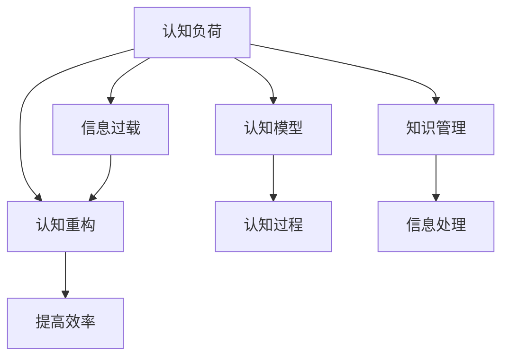

                 

## 1. 背景介绍

### 1.1 问题由来

信息时代，我们被前所未有的数据量所包围。从智能手机、社交网络到电子邮件、在线广告，每时每刻都有大量信息涌入我们的生活。这种信息过载不仅让我们的注意力分散，还带来了认知负荷，即认知资源被过度消耗的问题。认知负荷指的是我们在处理信息、做出决策和进行任务时所需要的心理能量。当认知负荷超过我们的认知能力时，我们就会感到疲惫、焦虑，甚至会出现认知障碍。

### 1.2 问题核心关键点

认知负荷管理的目标是优化信息处理流程，减少不必要的认知努力，提高工作效率和生活质量。关键点包括：

- **识别关键信息**：在繁杂的信息流中，快速识别并聚焦关键信息。
- **优化信息处理**：采用有效的信息处理工具和方法，提高信息处理效率。
- **减少认知消耗**：通过认知重构和行为调整，减轻认知负荷。
- **建立知识架构**：构建个人知识体系，提高信息存储和检索能力。

### 1.3 问题研究意义

在信息过载的时代，认知负荷管理成为我们生存和发展的关键技能。它不仅能提升我们的工作效率，还能改善生活质量，帮助我们在复杂的现代社会中更好地应对各种挑战。

## 2. 核心概念与联系

### 2.1 核心概念概述

为了更好地理解认知负荷管理的原理和应用，本节将介绍几个关键概念：

- **认知负荷**：在处理信息、做出决策和进行任务时，所需的心理能量和资源。
- **信息过载**：接受到的信息超过我们处理能力，导致认知资源过度消耗。
- **认知重构**：通过改变认知策略，减轻认知负荷的过程。
- **认知模型**：描述认知过程和认知负荷动态变化的心理模型。
- **知识管理**：通过组织和利用知识，优化认知过程和提高信息处理效率的实践。

这些核心概念之间的逻辑关系可以通过以下Mermaid流程图来展示：



这个流程图展示了一系列核心概念及其相互关系：

1. 认知负荷管理通常从识别信息过载开始。
2. 信息过载导致认知负荷，需要通过认知重构来减轻。
3. 认知重构依赖于对认知过程和认知模型的理解。
4. 知识管理则通过组织知识来优化信息处理。
5. 综合以上因素，可以有效地提高信息处理效率。

## 3. 核心算法原理 & 具体操作步骤

### 3.1 算法原理概述

认知负荷管理的核心算法原理主要围绕以下几个方面展开：

- **认知负荷识别**：通过行为分析和认知测量，识别出信息处理过程中的认知负荷。
- **认知重构策略**：通过改变认知策略和行为模式，减轻认知负荷。
- **知识管理技术**：通过构建知识体系和利用知识管理工具，提高信息处理效率。

### 3.2 算法步骤详解

#### 3.2.1 认知负荷识别

1. **行为数据收集**：使用应用程序监控工具收集用户的信息处理行为数据，如浏览时间、点击次数、多任务处理频率等。
2. **认知负荷评估**：利用问卷调查和认知任务，评估用户在不同任务中的认知负荷水平。
3. **数据整合与分析**：将行为数据和认知负荷评估结果整合，分析信息处理过程中的认知负荷动态变化。

#### 3.2.2 认知重构策略

1. **单任务处理**：采用单任务处理模式，避免多任务处理带来的认知负担。
2. **批处理任务**：将相似或相关的任务集中处理，减少任务切换带来的认知负荷。
3. **优先级管理**：根据任务的重要性和紧急性，合理安排处理顺序，减少次要任务的认知资源消耗。
4. **认知负荷分散**：通过分配不同的认知任务，分散注意力，避免长时间集中注意力带来的疲劳。

#### 3.2.3 知识管理技术

1. **知识分类与编码**：将知识按照主题、类型和层次进行分类和编码，建立知识架构。
2. **知识检索与利用**：使用搜索引擎和知识管理系统，快速检索和利用知识。
3. **知识更新与迭代**：定期更新和迭代知识库，保持知识的最新性和相关性。

### 3.3 算法优缺点

#### 3.3.1 优点

1. **提高信息处理效率**：通过认知重构和知识管理，能够更高效地处理信息，减少不必要的认知努力。
2. **降低认知负荷**：通过优化认知策略和行为模式，减轻认知负荷，提升工作和生活质量。
3. **增强决策能力**：通过建立知识体系，能够更快地做出决策，提高决策质量。
4. **促进创新思维**：通过优化认知过程，释放更多的认知资源，促进创新思维的产生。

#### 3.3.2 缺点

1. **初始投资高**：需要投入时间和资源进行数据收集和认知负荷评估，初期成本较高。
2. **实施复杂**：认知重构和知识管理需要技术支持和用户培训，实施过程较为复杂。
3. **个性化难度大**：不同的人认知负荷管理需求不同，需要个性化的解决方案。
4. **技术依赖性高**：依赖于各种工具和平台，一旦技术失效，效果可能大打折扣。

### 3.4 算法应用领域

认知负荷管理的应用领域非常广泛，涵盖工作、学习、生活等多个方面：

- **工作环境**：通过优化信息处理流程，提高工作效率，减少工作压力。
- **学习过程**：通过建立知识体系，提高学习效率，增强记忆和理解能力。
- **日常生活**：通过减少认知负荷，提升生活质量，减少焦虑和疲劳。
- **组织管理**：通过优化团队协作，提高组织效率，促进创新和协同。
- **健康管理**：通过减轻认知负荷，改善心理健康，提升整体健康水平。

## 4. 数学模型和公式 & 详细讲解 & 举例说明

### 4.1 数学模型构建

认知负荷管理可以通过数学模型来描述和量化。本节将建立一个简单的认知负荷模型，用于描述认知负荷的动态变化。

设 $L(t)$ 表示在时间 $t$ 的认知负荷水平，$I(t)$ 表示在时间 $t$ 接收到的信息量，$C(t)$ 表示在时间 $t$ 的认知处理能力。则认知负荷的动态变化可以表示为：

$$ L(t+1) = f(L(t), I(t), C(t)) $$

其中 $f$ 是一个描述认知负荷变化的函数，具体形式可以根据不同的认知模型来确定。

### 4.2 公式推导过程

假设认知负荷的变化遵循以下规则：

1. **信息接收导致的认知负荷增加**：认知负荷与信息量成正比，即 $L(t+1) = L(t) + kI(t)$，其中 $k$ 为信息处理的认知效率。
2. **认知处理能力导致的认知负荷减少**：认知负荷与认知处理能力成反比，即 $L(t+1) = L(t) - \frac{1}{C(t)}$。

将这些规则代入认知负荷的动态变化方程中，得到：

$$ L(t+1) = L(t) + kI(t) - \frac{1}{C(t)} $$

这是一个简单的差分方程，描述了认知负荷随时间变化的规律。

### 4.3 案例分析与讲解

假设某用户在工作中的认知负荷水平 $L(t)$ 为 60，他每小时接收的信息量 $I(t)$ 为 100，每小时的信息处理能力 $C(t)$ 为 50。则根据上述模型，我们可以计算出他在下一小时（$t+1$）的认知负荷水平：

$$ L(t+1) = 60 + 100k - \frac{1}{50} = 60 + 100k - 0.02 $$

如果用户的信息处理效率 $k$ 为 0.1，则：

$$ L(t+1) = 60 + 100 \times 0.1 - 0.02 = 60 + 10 - 0.02 = 69.98 $$

这意味着在下一小时，用户的认知负荷将增加至 70（向上取整）。如果用户的认知负荷超过某个阈值（如 70），他可能会感到疲劳，影响工作效率。

## 5. 项目实践：代码实例和详细解释说明

### 5.1 开发环境搭建

在进行认知负荷管理实践前，我们需要准备好开发环境。以下是使用Python进行环境搭建的步骤：

1. **安装Python**：从官网下载并安装Python，建议使用3.x版本，以保证与常用库的兼容性。
2. **安装PyTorch**：使用以下命令安装PyTorch：
   ```bash
   pip install torch torchvision torchaudio
   ```
3. **安装TensorBoard**：用于可视化模型训练过程，使用以下命令安装：
   ```bash
   pip install tensorboard
   ```

### 5.2 源代码详细实现

以下是一个简单的认知负荷管理模型的Python实现，用于模拟信息处理过程中的认知负荷变化：

```python
import torch
import torch.nn as nn
import torch.optim as optim

# 定义认知负荷模型
class CognitiveLoadModel(nn.Module):
    def __init__(self, k=0.1):
        super(CognitiveLoadModel, self).__init__()
        self.k = k
        self.load = nn.Parameter(torch.tensor([0.0]))

    def forward(self, info, capacity):
        self.load = (self.load + self.k * info - 1/capacity).clamp(min=0, max=100)
        return self.load

# 训练认知负荷模型
def train_model():
    model = CognitiveLoadModel(k=0.1)
    optimizer = optim.SGD(model.parameters(), lr=0.01)
    loss_fn = nn.L1Loss()

    for epoch in range(100):
        for i in range(10):
            info = torch.tensor(100, dtype=torch.float)
            capacity = torch.tensor(50, dtype=torch.float)
            load = model(info, capacity)
            optimizer.zero_grad()
            loss = loss_fn(load, torch.tensor(70, dtype=torch.float))
            loss.backward()
            optimizer.step()
        print(f"Epoch {epoch+1}, cognitive load: {load.item()}")
```

在这个代码中，我们定义了一个简单的认知负荷模型，使用PyTorch实现。模型包含一个可训练的参数 `load`，表示当前的认知负荷水平。在每个训练迭代中，模型接收一个固定值的信息量（100）和一个固定的信息处理能力（50），通过前向传播和反向传播更新模型参数。

### 5.3 代码解读与分析

这段代码实现了一个简单的认知负荷管理模型，用于模拟信息处理过程中的认知负荷变化。具体来说：

- **定义认知负荷模型**：我们定义了一个 `CognitiveLoadModel` 类，继承自 `nn.Module`。模型包含一个可训练的参数 `load`，表示当前的认知负荷水平。
- **训练认知负荷模型**：在 `train_model` 函数中，我们实例化了认知负荷模型，并使用随机梯度下降优化器进行训练。每个训练迭代中，接收一个固定值的信息量（100）和一个固定的信息处理能力（50），通过前向传播和反向传播更新模型参数。
- **输出认知负荷水平**：在每个训练迭代结束后，输出当前的认知负荷水平。

这个简单的模型可以帮助我们理解认知负荷管理的基本原理。在实际应用中，认知负荷管理需要结合具体任务和用户需求进行个性化的设计和实施。

## 6. 实际应用场景

### 6.1 工作环境

在工作环境中，认知负荷管理可以帮助提升工作效率和减少压力。例如，一名项目经理需要在多个项目之间切换，每个项目都有不同的工作内容和目标。通过认知负荷管理，他可以优化任务处理顺序，减少多任务处理带来的认知负荷。

具体来说，他可以：

- **单任务处理**：将相似的任务集中处理，减少任务切换带来的认知负荷。
- **优先级管理**：根据任务的重要性和紧急性，合理安排处理顺序，减少次要任务的认知资源消耗。
- **认知负荷分散**：通过分配不同的认知任务，分散注意力，避免长时间集中注意力带来的疲劳。

### 6.2 学习过程

在学习过程中，认知负荷管理可以帮助提高学习效率和增强记忆。例如，一名学生需要阅读大量书籍和文章，准备考试。通过认知负荷管理，他可以优化学习流程，减少不必要的认知努力。

具体来说，他可以：

- **知识分类与编码**：将知识按照主题、类型和层次进行分类和编码，建立知识架构。
- **知识检索与利用**：使用搜索引擎和知识管理系统，快速检索和利用知识。
- **知识更新与迭代**：定期更新和迭代知识库，保持知识的最新性和相关性。

### 6.3 日常生活

在日常生活，认知负荷管理可以帮助提升生活质量和减少焦虑。例如，一名忙碌的职场人士，需要在工作、家庭和社交之间平衡。通过认知负荷管理，他可以优化时间安排，减少不必要的认知努力。

具体来说，他可以：

- **时间管理**：合理安排工作、家庭和社交活动，避免时间冲突带来的认知负荷。
- **心理放松**：通过冥想、运动等放松方式，减轻心理压力，提升生活质量。
- **健康管理**：定期进行体检和健康监测，保持身体健康，减少健康问题带来的认知负荷。

## 7. 工具和资源推荐

### 7.1 学习资源推荐

为了帮助开发者系统掌握认知负荷管理的理论基础和实践技巧，这里推荐一些优质的学习资源：

1. **《认知负荷管理：信息过载时代的生存技能》**：一本详细介绍认知负荷管理理论和方法的书籍。
2. **《信息心理学》**：一本介绍信息处理心理学原理和方法的书籍。
3. **《认知负荷管理工具与技术》**：一本介绍认知负荷管理工具和技术的应用案例和方法的书籍。
4. **Coursera《认知心理学》课程**：斯坦福大学开设的认知心理学课程，涵盖认知负荷管理的理论和实践。
5. **Udemy《认知负荷管理》课程**：Udemy上的认知负荷管理课程，涵盖认知负荷管理的各种技术和工具。

### 7.2 开发工具推荐

认知负荷管理的工具推荐如下：

1. **RescueTime**：一款监控和分析用户时间管理工具，帮助用户识别时间浪费和注意力分散的根源。
2. **Forest**：一款番茄时钟应用，帮助用户集中注意力，避免多任务处理。
3. **Pomodoro Timer**：一款番茄时钟应用，采用番茄工作法，提高工作效率。
4. **Notion**：一款笔记和知识管理应用，帮助用户构建知识体系，提高信息处理效率。
5. **Evernote**：一款笔记和知识管理应用，支持多设备同步和团队协作。

### 7.3 相关论文推荐

认知负荷管理的研究论文推荐如下：

1. **Cognitive Load Theory: Theory, Recent Advances, and New Directions**：介绍认知负荷理论的最新进展和未来方向的综述论文。
2. **Cognitive Load Management: A Systematic Review**：一篇系统综述论文，总结了认知负荷管理的各种技术和方法。
3. **Designing Instructional Scenarios to Manage Cognitive Load**：一篇关于如何设计教学场景来管理认知负荷的研究论文。
4. **Cognitive Load Management in Mobile Learning**：一篇关于如何在移动学习中管理认知负荷的研究论文。
5. **Cognitive Load Theory and Design of E-Learning**：一篇介绍如何将认知负荷理论应用于电子学习设计的研究论文。

## 8. 总结：未来发展趋势与挑战

### 8.1 总结

本文对认知负荷管理的原理和应用进行了全面系统的介绍。首先阐述了认知负荷管理的背景和意义，明确了认知负荷管理在信息过载时代的生存技能中的核心作用。其次，从原理到实践，详细讲解了认知负荷管理的数学模型和操作步骤，给出了认知负荷管理任务的完整代码实现。同时，本文还广泛探讨了认知负荷管理在各个行业领域的应用前景，展示了认知负荷管理范式的巨大潜力。此外，本文精选了认知负荷管理的各类学习资源，力求为读者提供全方位的技术指引。

通过本文的系统梳理，可以看到，认知负荷管理在信息时代具有重要的实用价值，能够显著提升信息处理效率和生活质量。认知负荷管理的理论和方法不断演进，将成为未来人机协同智能系统的重要组成部分。

### 8.2 未来发展趋势

展望未来，认知负荷管理将呈现以下几个发展趋势：

1. **个性化定制**：认知负荷管理将更加注重个性化定制，根据不同用户的需求和特点，提供个性化的解决方案。
2. **智能化应用**：结合人工智能技术，认知负荷管理将实现更加智能化和自动化，提升用户体验和效率。
3. **多模态融合**：结合视觉、听觉、触觉等多模态信息，优化认知负荷管理流程，提升信息处理效率。
4. **实时监测**：通过实时监测用户行为和认知状态，及时调整认知负荷管理策略，提升效果和体验。
5. **跨领域应用**：认知负荷管理将应用于更多领域，如医疗、教育、娱乐等，提供全面的解决方案。

### 8.3 面临的挑战

尽管认知负荷管理已经取得了一定的进展，但在迈向更加智能化、普适化应用的过程中，它仍面临诸多挑战：

1. **数据隐私问题**：认知负荷管理需要收集和分析用户行为数据，如何保护用户隐私，防止数据滥用，是一个重要的问题。
2. **技术复杂性**：认知负荷管理需要结合多种技术和工具，实施过程较为复杂，需要技术支持和用户培训。
3. **用户接受度**：认知负荷管理需要用户主动使用，如何提高用户接受度和参与度，是一个关键问题。
4. **效果评估**：认知负荷管理的效果评估标准较为复杂，如何客观、公正地评估其效果，是一个挑战。
5. **跨学科整合**：认知负荷管理涉及心理学、认知科学、计算机科学等多个学科，如何整合不同领域的知识，是一个难题。

### 8.4 研究展望

面向未来，认知负荷管理的研究方向将聚焦于以下几个方面：

1. **认知负荷理论的深化**：进一步深入研究认知负荷的理论基础，探索认知负荷的动态变化规律。
2. **认知负荷管理的算法优化**：开发更加高效的认知负荷管理算法，提高信息处理效率和用户体验。
3. **人工智能技术的应用**：结合人工智能技术，如深度学习、自然语言处理等，优化认知负荷管理流程。
4. **多模态信息的融合**：结合视觉、听觉、触觉等多模态信息，提升认知负荷管理的效果和实用性。
5. **跨学科的整合**：整合心理学、认知科学、计算机科学等多个学科的知识，构建全面的认知负荷管理理论体系。

总之，认知负荷管理在信息过载时代具有重要的应用价值。未来，通过不断的研究和实践，认知负荷管理将能够更好地服务于人们的工作、学习和生活，成为信息时代的重要生存技能。

## 9. 附录：常见问题与解答

**Q1：认知负荷管理的理论基础是什么？**

A: 认知负荷管理基于认知负荷理论，该理论由Edward T. gloss和John Sweller提出。认知负荷理论认为，人在处理信息时，需要消耗一定的心理资源，即认知负荷。认知负荷分为内在负荷和外在负荷，内在负荷指信息本身的复杂度，外在负荷指信息处理任务的复杂度。认知负荷管理的目标是减轻认知负荷，提高信息处理效率。

**Q2：认知负荷管理的步骤是什么？**

A: 认知负荷管理通常包括以下几个步骤：

1. **认知负荷识别**：通过行为分析和认知测量，识别出信息处理过程中的认知负荷。
2. **认知重构策略**：通过改变认知策略和行为模式，减轻认知负荷。
3. **知识管理技术**：通过构建知识体系和利用知识管理工具，提高信息处理效率。

**Q3：认知负荷管理的应用场景有哪些？**

A: 认知负荷管理的应用场景非常广泛，涵盖工作、学习、生活等多个方面：

- **工作环境**：通过优化信息处理流程，提高工作效率，减少工作压力。
- **学习过程**：通过建立知识体系，提高学习效率，增强记忆和理解能力。
- **日常生活**：通过减少认知负荷，提升生活质量，减少焦虑和疲劳。
- **组织管理**：通过优化团队协作，提高组织效率，促进创新和协同。
- **健康管理**：通过减轻认知负荷，改善心理健康，提升整体健康水平。

**Q4：认知负荷管理需要哪些工具和技术？**

A: 认知负荷管理需要结合多种技术和工具，主要包括以下几种：

- **行为监控工具**：如RescueTime、Forest、Pomodoro Timer等，用于监测用户时间管理和注意力分布。
- **知识管理工具**：如Notion、Evernote等，用于构建知识体系，提高信息处理效率。
- **认知测量工具**：如认知负荷评估问卷、认知任务等，用于评估用户认知负荷水平。
- **认知重构工具**：如认知策略调整、行为模式训练等，用于优化认知策略和行为模式。

**Q5：认知负荷管理的未来发展方向是什么？**

A: 认知负荷管理的未来发展方向包括：

1. **个性化定制**：根据不同用户的需求和特点，提供个性化的认知负荷管理解决方案。
2. **智能化应用**：结合人工智能技术，如深度学习、自然语言处理等，实现更加智能化和自动化的认知负荷管理。
3. **多模态融合**：结合视觉、听觉、触觉等多模态信息，提升认知负荷管理的效果和实用性。
4. **实时监测**：通过实时监测用户行为和认知状态，及时调整认知负荷管理策略。
5. **跨领域应用**：将认知负荷管理应用于更多领域，如医疗、教育、娱乐等，提供全面的解决方案。

---

作者：禅与计算机程序设计艺术 / Zen and the Art of Computer Programming

