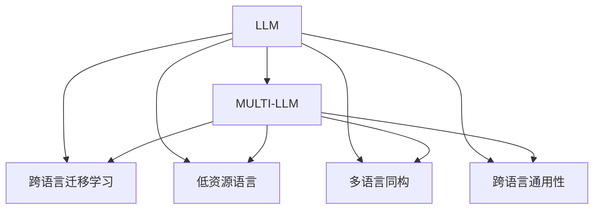

                 

# 语言多样性：LLM 对多语言的适应

## 1. 背景介绍

### 1.1 问题由来

语言多样性（Linguistic Diversity）是当今世界的一大特征，不同语言、方言和书写系统的广泛存在，给人工智能系统带来了诸多挑战。在自然语言处理（NLP）领域，由于语言多样性的存在，语言模型的训练和应用面临着独特的困难。传统的基于英文的预训练语言模型（LLM, Large Language Models）通常难以直接应用于其他语言，尤其是在低资源语言（Low-Resource Languages）上，性能往往不尽如人意。

### 1.2 问题核心关键点

大语言模型（LLM）在处理多语言任务时，面临着以下几个核心问题：

- **多语言适应**：如何在不同语言间迁移知识，提升多语言模型的性能？
- **低资源语言**：对于缺乏大量标注数据的语言，如何构建和微调模型？
- **多语言同构**：是否存在一种通用模型架构，能够高效处理多种语言的相似任务？
- **跨语言通用性**：如何构建能够同时适应多种语言的NLP系统？

### 1.3 问题研究意义

研究LLM对多语言的适应问题，对于提升全球范围内的NLP技术水平，促进语言多样性地区的经济发展，具有重要意义：

1. **语言公平**：使NLP技术能够公平地服务于所有语言，减少语言偏见。
2. **应用广泛**：拓展NLP技术的应用范围，推动全球化经济社会的数字化转型。
3. **多语言支持**：为多语言用户提供更好的交互体验和信息获取能力。
4. **学术贡献**：推动学术界对多语言NLP问题的研究，提升科学研究的深度和广度。

## 2. 核心概念与联系

### 2.1 核心概念概述

要深入理解LLM对多语言的适应问题，首先需要明确一些核心概念及其相互关系：

- **大语言模型（LLM）**：基于自回归（如GPT）或自编码（如BERT）架构的预训练语言模型，通过大量无标签文本数据预训练，获得通用的语言知识。
- **多语言模型（MULTI-LLM）**：能够同时适应多种语言的NLP模型，包括跨语言迁移学习、零样本和少样本学习等。
- **跨语言迁移学习**：通过在一种语言上训练的模型参数，转移到另一种语言上进行微调，提升多语言性能。
- **低资源语言（Low-Resource Languages）**：数据标注量相对较少的语言，如非洲和中东地区的部分语言。
- **多语言同构**：寻找一种通用的NLP模型架构，适应多种语言的相似任务，如问答、翻译等。
- **跨语言通用性**：构建能够同时处理多种语言的通用NLP系统，提升系统的泛化能力和适应性。

这些概念之间的逻辑关系可以通过以下Mermaid流程图来展示：



这个流程图展示了大语言模型向多语言模型的迁移过程，以及多语言模型在不同应用场景下的迁移和适配策略。

## 3. 核心算法原理 & 具体操作步骤

### 3.1 算法原理概述

LLM对多语言的适应问题，本质上是一个跨语言迁移学习（Cross-Language Transfer Learning）的过程。其核心思想是：通过在大规模多语言数据集上预训练一个大语言模型，然后将该模型参数迁移到其他语言上，通过微调来适应特定语言的任务。

形式化地，假设预训练的多语言数据集为 $D=\{(x_i, y_i)\}_{i=1}^N$，其中 $x_i$ 为输入文本，$y_i$ 为标签，可以表示为：

$$
y_i = M_{\theta}(x_i)
$$

其中 $M_{\theta}$ 为预训练的通用语言模型，$\theta$ 为模型参数。

### 3.2 算法步骤详解

基于跨语言迁移学习的LLM适应步骤一般包括以下几个关键步骤：

**Step 1: 准备预训练数据集**

- 收集多种语言的文本数据集 $D=\{(x_i, y_i)\}_{i=1}^N$，包括英文、中文、阿拉伯语等。
- 确保数据集覆盖多种语言，且语言间的比例相对均衡。
- 清洗数据集，去除噪声和低质量文本。

**Step 2: 构建多语言模型**

- 选择一种通用的语言模型架构，如BERT、GPT等。
- 在多语言数据集上预训练模型 $M_{\theta}$，使其学习到多种语言共通的语言知识。
- 使用预训练模型进行微调，适应特定语言的任务，如分类、匹配、生成等。

**Step 3: 设置微调超参数**

- 选择合适的优化算法及其参数，如AdamW、SGD等。
- 设置学习率、批大小、迭代轮数等。
- 设置正则化技术及强度，包括权重衰减、Dropout等。

**Step 4: 执行梯度训练**

- 将训练集数据分批次输入模型，前向传播计算损失函数。
- 反向传播计算参数梯度，根据设定的优化算法和学习率更新模型参数。
- 周期性在验证集上评估模型性能，根据性能指标决定是否触发Early Stopping。
- 重复上述步骤直到满足预设的迭代轮数或Early Stopping条件。

**Step 5: 测试和部署**

- 在测试集上评估微调后模型 $M_{\hat{\theta}}$ 的性能，对比微调前后的精度提升。
- 使用微调后的模型对新样本进行推理预测，集成到实际的应用系统中。
- 持续收集新的数据，定期重新微调模型，以适应数据分布的变化。

以上是跨语言迁移学习的基本流程。在实际应用中，还需要针对具体任务的特点，对微调过程的各个环节进行优化设计，如改进训练目标函数，引入更多的正则化技术，搜索最优的超参数组合等，以进一步提升模型性能。

### 3.3 算法优缺点

跨语言迁移学习具有以下优点：

1. **高效性**：利用多语言预训练的知识，可以有效提升低资源语言的NLP性能，减少标注成本。
2. **泛化能力强**：能够适应多种语言的任务，提升模型的跨领域迁移能力。
3. **通用性强**：可以构建适用于多种语言的通用NLP系统，提高系统的可扩展性和灵活性。
4. **成本低**：相比于从头训练多语言模型，微调的方式成本较低，节省时间和计算资源。

同时，该方法也存在一些局限性：

1. **数据偏差**：预训练模型可能受到源语言数据的影响，存在一定的数据偏差。
2. **多语言同构性**：不同语言间的任务存在差异，预训练的通用知识不一定能完全适应所有任务。
3. **语义歧义**：多语言间的语义差异较大，部分任务可能无法直接迁移。
4. **模型泛化性**：低资源语言的微调可能面临数据量和质量不足的问题，影响模型泛化能力。

尽管存在这些局限性，但就目前而言，跨语言迁移学习仍是解决多语言NLP问题的主流方法。未来相关研究的重点在于如何进一步降低预训练模型的数据偏差，提高模型的跨领域迁移能力和泛化性，同时兼顾不同语言间的任务差异和语义歧义问题。

### 3.4 算法应用领域

跨语言迁移学习已经在多语言NLP的诸多领域得到应用，例如：

- **多语言分类**：如新闻分类、情感分析等，预训练模型在多种语言上进行微调，提升跨语言分类性能。
- **跨语言匹配**：如信息检索、问答匹配等，利用预训练模型学习的多语言共通知识，提升匹配准确率。
- **多语言生成**：如文本生成、翻译等，通过预训练模型在多种语言上进行微调，提升生成效果。
- **多语言问答**：如跨语言问答系统、多语言客服等，通过预训练模型在多种语言上进行微调，提供多语言支持。

除了上述这些经典任务外，跨语言迁移学习还被创新性地应用到更多场景中，如跨语言情感分析、跨语言摘要、跨语言文本分类等，为NLP技术带来了新的突破。

## 4. 数学模型和公式 & 详细讲解 & 举例说明

### 4.1 数学模型构建

本节将使用数学语言对跨语言迁移学习的数学原理进行更加严格的刻画。

记多语言数据集为 $D=\{(x_i, y_i)\}_{i=1}^N$，其中 $x_i$ 为输入文本，$y_i$ 为标签。假设预训练的通用语言模型为 $M_{\theta}$，其中 $\theta$ 为模型参数。

定义模型 $M_{\theta}$ 在输入 $x$ 上的损失函数为 $\ell(M_{\theta}(x),y)$，则在数据集 $D$ 上的经验风险为：

$$
\mathcal{L}(\theta) = \frac{1}{N}\sum_{i=1}^N \ell(M_{\theta}(x_i),y_i)
$$

微调的优化目标是最小化经验风险，即找到最优参数：

$$
\theta^* = \mathop{\arg\min}_{\theta} \mathcal{L}(\theta)
$$

在实践中，我们通常使用基于梯度的优化算法（如SGD、Adam等）来近似求解上述最优化问题。设 $\eta$ 为学习率，$\lambda$ 为正则化系数，则参数的更新公式为：

$$
\theta \leftarrow \theta - \eta \nabla_{\theta}\mathcal{L}(\theta) - \eta\lambda\theta
$$

其中 $\nabla_{\theta}\mathcal{L}(\theta)$ 为损失函数对参数 $\theta$ 的梯度，可通过反向传播算法高效计算。

### 4.2 公式推导过程

以下我们以二分类任务为例，推导交叉熵损失函数及其梯度的计算公式。

假设模型 $M_{\theta}$ 在输入 $x$ 上的输出为 $\hat{y}=M_{\theta}(x) \in [0,1]$，表示样本属于正类的概率。真实标签 $y \in \{0,1\}$。则二分类交叉熵损失函数定义为：

$$
\ell(M_{\theta}(x),y) = -[y\log \hat{y} + (1-y)\log (1-\hat{y})]
$$

将其代入经验风险公式，得：

$$
\mathcal{L}(\theta) = -\frac{1}{N}\sum_{i=1}^N [y_i\log M_{\theta}(x_i)+(1-y_i)\log(1-M_{\theta}(x_i))]
$$

根据链式法则，损失函数对参数 $\theta_k$ 的梯度为：

$$
\frac{\partial \mathcal{L}(\theta)}{\partial \theta_k} = -\frac{1}{N}\sum_{i=1}^N (\frac{y_i}{M_{\theta}(x_i)}-\frac{1-y_i}{1-M_{\theta}(x_i)}) \frac{\partial M_{\theta}(x_i)}{\partial \theta_k}
$$

其中 $\frac{\partial M_{\theta}(x_i)}{\partial \theta_k}$ 可进一步递归展开，利用自动微分技术完成计算。

### 4.3 案例分析与讲解

为了更好地理解跨语言迁移学习的数学原理，下面以一个具体案例进行详细讲解。

假设我们要在一个法语数据集上对预训练的英文BERT模型进行微调，以提升其在法语分类任务上的性能。

**Step 1: 准备预训练数据集**

- 收集法语文本数据集 $D=\{(x_i, y_i)\}_{i=1}^N$，并确保数据集质量。
- 将数据集划分为训练集、验证集和测试集。

**Step 2: 构建多语言模型**

- 使用英文BERT模型作为预训练模型，构建多语言BERT模型 $M_{\theta}$。
- 在多语言数据集上进行预训练，学习通用的语言知识。
- 使用预训练模型进行微调，适应法语分类任务。

**Step 3: 设置微调超参数**

- 选择AdamW优化器，设置学习率为2e-5。
- 设置批大小为16，迭代轮数为5。
- 使用权重衰减和Dropout进行正则化。

**Step 4: 执行梯度训练**

- 在训练集上执行梯度训练，计算损失函数。
- 反向传播计算参数梯度，更新模型参数。
- 在验证集上评估模型性能，根据性能指标决定是否触发Early Stopping。
- 重复上述步骤直到满足预设的迭代轮数或Early Stopping条件。

**Step 5: 测试和部署**

- 在测试集上评估微调后模型 $M_{\hat{\theta}}$ 的性能，对比微调前后的精度提升。
- 使用微调后的模型对新样本进行推理预测，集成到实际的应用系统中。

以上案例展示了跨语言迁移学习的基本流程和关键步骤。需要注意的是，不同语言间的语义差异较大，预训练模型可能存在一定的数据偏差，因此需要根据具体情况进行微调参数的调整。

## 5. 项目实践：代码实例和详细解释说明

### 5.1 开发环境搭建

在进行跨语言迁移学习实践前，我们需要准备好开发环境。以下是使用Python进行PyTorch开发的环境配置流程：

1. 安装Anaconda：从官网下载并安装Anaconda，用于创建独立的Python环境。

2. 创建并激活虚拟环境：
```bash
conda create -n pytorch-env python=3.8 
conda activate pytorch-env
```

3. 安装PyTorch：根据CUDA版本，从官网获取对应的安装命令。例如：
```bash
conda install pytorch torchvision torchaudio cudatoolkit=11.1 -c pytorch -c conda-forge
```

4. 安装Transformers库：
```bash
pip install transformers
```

5. 安装各类工具包：
```bash
pip install numpy pandas scikit-learn matplotlib tqdm jupyter notebook ipython
```

完成上述步骤后，即可在`pytorch-env`环境中开始跨语言迁移学习的实践。

### 5.2 源代码详细实现

下面我们以跨语言分类任务为例，给出使用Transformers库对多语言BERT模型进行微调的PyTorch代码实现。

首先，定义二分类任务的数据处理函数：

```python
from transformers import BertTokenizer
from torch.utils.data import Dataset
import torch

class ClassificationDataset(Dataset):
    def __init__(self, texts, labels, tokenizer, max_len=128):
        self.texts = texts
        self.labels = labels
        self.tokenizer = tokenizer
        self.max_len = max_len
        
    def __len__(self):
        return len(self.texts)
    
    def __getitem__(self, item):
        text = self.texts[item]
        label = self.labels[item]
        
        encoding = self.tokenizer(text, return_tensors='pt', max_length=self.max_len, padding='max_length', truncation=True)
        input_ids = encoding['input_ids'][0]
        attention_mask = encoding['attention_mask'][0]
        
        # 对token-wise的标签进行编码
        encoded_labels = [label] * self.max_len
        labels = torch.tensor(encoded_labels, dtype=torch.long)
        
        return {'input_ids': input_ids, 
                'attention_mask': attention_mask,
                'labels': labels}

# 标签与id的映射
label2id = {'positive': 1, 'negative': 0}
id2label = {v: k for k, v in label2id.items()}

# 创建dataset
tokenizer = BertTokenizer.from_pretrained('bert-base-cased')

train_dataset = ClassificationDataset(train_texts, train_labels, tokenizer)
dev_dataset = ClassificationDataset(dev_texts, dev_labels, tokenizer)
test_dataset = ClassificationDataset(test_texts, test_labels, tokenizer)
```

然后，定义模型和优化器：

```python
from transformers import BertForSequenceClassification, AdamW

model = BertForSequenceClassification.from_pretrained('bert-base-cased', num_labels=len(label2id))

optimizer = AdamW(model.parameters(), lr=2e-5)
```

接着，定义训练和评估函数：

```python
from torch.utils.data import DataLoader
from tqdm import tqdm
from sklearn.metrics import classification_report

device = torch.device('cuda') if torch.cuda.is_available() else torch.device('cpu')
model.to(device)

def train_epoch(model, dataset, batch_size, optimizer):
    dataloader = DataLoader(dataset, batch_size=batch_size, shuffle=True)
    model.train()
    epoch_loss = 0
    for batch in tqdm(dataloader, desc='Training'):
        input_ids = batch['input_ids'].to(device)
        attention_mask = batch['attention_mask'].to(device)
        labels = batch['labels'].to(device)
        model.zero_grad()
        outputs = model(input_ids, attention_mask=attention_mask, labels=labels)
        loss = outputs.loss
        epoch_loss += loss.item()
        loss.backward()
        optimizer.step()
    return epoch_loss / len(dataloader)

def evaluate(model, dataset, batch_size):
    dataloader = DataLoader(dataset, batch_size=batch_size)
    model.eval()
    preds, labels = [], []
    with torch.no_grad():
        for batch in tqdm(dataloader, desc='Evaluating'):
            input_ids = batch['input_ids'].to(device)
            attention_mask = batch['attention_mask'].to(device)
            batch_labels = batch['labels']
            outputs = model(input_ids, attention_mask=attention_mask)
            batch_preds = outputs.logits.argmax(dim=2).to('cpu').tolist()
            batch_labels = batch_labels.to('cpu').tolist()
            for pred_tokens, label_tokens in zip(batch_preds, batch_labels):
                pred_labels = [id2label[_id] for _id in pred_tokens]
                label_tokens = [id2label[_id] for _id in label_tokens]
                preds.append(pred_labels[:len(label_tokens)])
                labels.append(label_tokens)
                
    print(classification_report(labels, preds))
```

最后，启动训练流程并在测试集上评估：

```python
epochs = 5
batch_size = 16

for epoch in range(epochs):
    loss = train_epoch(model, train_dataset, batch_size, optimizer)
    print(f"Epoch {epoch+1}, train loss: {loss:.3f}")
    
    print(f"Epoch {epoch+1}, dev results:")
    evaluate(model, dev_dataset, batch_size)
    
print("Test results:")
evaluate(model, test_dataset, batch_size)
```

以上就是使用PyTorch对多语言BERT模型进行二分类任务微调的完整代码实现。可以看到，得益于Transformers库的强大封装，我们可以用相对简洁的代码完成BERT模型的加载和微调。

### 5.3 代码解读与分析

让我们再详细解读一下关键代码的实现细节：

**ClassificationDataset类**：
- `__init__`方法：初始化文本、标签、分词器等关键组件。
- `__len__`方法：返回数据集的样本数量。
- `__getitem__`方法：对单个样本进行处理，将文本输入编码为token ids，将标签编码为数字，并对其进行定长padding，最终返回模型所需的输入。

**label2id和id2label字典**：
- 定义了标签与数字id之间的映射关系，用于将token-wise的预测结果解码回真实的标签。

**训练和评估函数**：
- 使用PyTorch的DataLoader对数据集进行批次化加载，供模型训练和推理使用。
- 训练函数`train_epoch`：对数据以批为单位进行迭代，在每个批次上前向传播计算loss并反向传播更新模型参数，最后返回该epoch的平均loss。
- 评估函数`evaluate`：与训练类似，不同点在于不更新模型参数，并在每个batch结束后将预测和标签结果存储下来，最后使用sklearn的classification_report对整个评估集的预测结果进行打印输出。

**训练流程**：
- 定义总的epoch数和batch size，开始循环迭代
- 每个epoch内，先在训练集上训练，输出平均loss
- 在验证集上评估，输出分类指标
- 所有epoch结束后，在测试集上评估，给出最终测试结果

可以看到，PyTorch配合Transformers库使得BERT多语言微调的代码实现变得简洁高效。开发者可以将更多精力放在数据处理、模型改进等高层逻辑上，而不必过多关注底层的实现细节。

当然，工业级的系统实现还需考虑更多因素，如模型的保存和部署、超参数的自动搜索、更灵活的任务适配层等。但核心的跨语言迁移学习过程基本与此类似。

## 6. 实际应用场景

### 6.1 跨语言情感分析

情感分析（Sentiment Analysis）是NLP领域的重要应用之一，用于判断文本中的情感倾向。在多语言场景下，情感分析可以帮助企业、政府等机构了解不同语言地区的公众情绪，为决策提供数据支持。

具体而言，可以收集多语言的新闻、评论、社交媒体等文本数据，并对其进行情感标注。在此基础上对预训练语言模型进行微调，使其能够自动判断文本的情感倾向。将微调后的模型应用到实时抓取的网络文本数据，就能够自动监测不同语言地区的情感变化趋势，一旦发现负面情绪激增等异常情况，系统便会自动预警，帮助相关机构快速应对负面信息传播。

### 6.2 多语言机器翻译

机器翻译（Machine Translation, MT）是将一种语言的文本自动翻译成另一种语言的过程。在多语言场景下，多语言机器翻译可以显著降低人工翻译成本，提升翻译效率和准确性。

具体而言，可以收集多语言的新闻、文章、网页等文本数据，并对其进行平行语料标注。在此基础上对预训练语言模型进行微调，使其能够自动将源语言文本翻译成目标语言文本。将微调后的模型应用于实时翻译系统，能够实现多语言快速转换，极大地提升跨语言沟通效率。

### 6.3 多语言问答系统

问答系统（Question Answering, QA）是一种能够理解并回答自然语言问题的系统。在多语言场景下，多语言问答系统可以支持不同语言的用户提问，提供多语言支持的智能回答。

具体而言，可以收集多语言的用户提问和回答数据，并对其进行标注。在此基础上对预训练语言模型进行微调，使其能够自动理解并回答不同语言的用户问题。将微调后的模型应用于智能客服系统、智能助手等场景，能够实现多语言自动问答，提升用户交互体验。

### 6.4 未来应用展望

随着预训练语言模型和跨语言迁移学习技术的不断发展，跨语言NLP技术将迎来更多的应用场景和机遇。

在智慧城市治理中，多语言问答系统可以提供多语言支持，帮助不同语言背景的用户进行智能交互，提升城市管理效率。

在智能家居设备中，多语言翻译系统可以实现多语言智能控制，提升用户的生活便利性和体验。

在社交媒体平台上，多语言情感分析系统可以实时监测不同语言地区的用户情绪，帮助企业进行市场分析和决策。

此外，在教育、旅游、金融等领域，跨语言NLP技术也将不断拓展应用范围，为全球化经济社会带来新的发展机遇。

## 7. 工具和资源推荐

### 7.1 学习资源推荐

为了帮助开发者系统掌握跨语言迁移学习的理论基础和实践技巧，这里推荐一些优质的学习资源：

1. 《Transformer from the Inside Out》系列博文：由大模型技术专家撰写，深入浅出地介绍了Transformer原理、多语言模型、跨语言迁移学习等前沿话题。

2. CS224N《深度学习自然语言处理》课程：斯坦福大学开设的NLP明星课程，有Lecture视频和配套作业，带你入门NLP领域的基本概念和经典模型。

3. 《Multilingual NLP with Transformers》书籍：展示了如何使用Transformers库进行多语言NLP任务开发，包括跨语言迁移学习的详细实践。

4. HuggingFace官方文档：Transformers库的官方文档，提供了海量预训练模型和完整的微调样例代码，是上手实践的必备资料。

5. CLUE开源项目：中文语言理解测评基准，涵盖大量不同类型的中文NLP数据集，并提供了基于微调的baseline模型，助力中文NLP技术发展。

通过对这些资源的学习实践，相信你一定能够快速掌握跨语言迁移学习的精髓，并用于解决实际的NLP问题。

### 7.2 开发工具推荐

高效的开发离不开优秀的工具支持。以下是几款用于跨语言迁移学习开发的常用工具：

1. PyTorch：基于Python的开源深度学习框架，灵活动态的计算图，适合快速迭代研究。大部分预训练语言模型都有PyTorch版本的实现。

2. TensorFlow：由Google主导开发的开源深度学习框架，生产部署方便，适合大规模工程应用。同样有丰富的预训练语言模型资源。

3. Transformers库：HuggingFace开发的NLP工具库，集成了众多SOTA语言模型，支持PyTorch和TensorFlow，是进行多语言NLP任务开发的利器。

4. Weights & Biases：模型训练的实验跟踪工具，可以记录和可视化模型训练过程中的各项指标，方便对比和调优。与主流深度学习框架无缝集成。

5. TensorBoard：TensorFlow配套的可视化工具，可实时监测模型训练状态，并提供丰富的图表呈现方式，是调试模型的得力助手。

6. Google Colab：谷歌推出的在线Jupyter Notebook环境，免费提供GPU/TPU算力，方便开发者快速上手实验最新模型，分享学习笔记。

合理利用这些工具，可以显著提升跨语言迁移学习的开发效率，加快创新迭代的步伐。

### 7.3 相关论文推荐

跨语言迁移学习的发展源于学界的持续研究。以下是几篇奠基性的相关论文，推荐阅读：

1. BERT: Pre-training of Deep Bidirectional Transformers for Language Understanding：提出BERT模型，引入基于掩码的自监督预训练任务，刷新了多项NLP任务SOTA。

2. Multilingual BERT: A Multi-task Learning Approach to Natural Language Processing：提出M-BERT模型，在多语言数据上进行预训练和微调，提升了多语言NLP性能。

3. Cross-lingual Language Model Pretraining（XLM）：提出XLM模型，通过多语言联合预训练提升跨语言性能。

4. MASS: Multilingual Single-task and Sequence-to-Sequence Model Adaptation for Low-Resource Languages：提出MASS模型，利用多语言迁移学习提升低资源语言的NLP性能。

5. ALBERT: A lite BERT for Self-supervised Learning of Language Representations：提出ALBERT模型，设计轻量级多语言预训练框架，提升跨语言性能。

这些论文代表了大语言模型跨语言迁移学习的发展脉络。通过学习这些前沿成果，可以帮助研究者把握学科前进方向，激发更多的创新灵感。

## 8. 总结：未来发展趋势与挑战

### 8.1 总结

本文对跨语言迁移学习进行了全面系统的介绍。首先阐述了LLM对多语言适应的研究背景和意义，明确了跨语言迁移学习在提升多语言NLP性能、促进语言多样性地区发展等方面的独特价值。其次，从原理到实践，详细讲解了跨语言迁移学习的数学原理和关键步骤，给出了跨语言迁移任务开发的完整代码实例。同时，本文还广泛探讨了跨语言迁移学习在多语言情感分析、机器翻译、问答系统等多个领域的应用前景，展示了跨语言迁移学习方法的巨大潜力。此外，本文精选了跨语言迁移学习的各类学习资源，力求为读者提供全方位的技术指引。

通过本文的系统梳理，可以看到，跨语言迁移学习正成为NLP领域的重要范式，极大地拓展了预训练语言模型的应用边界，催生了更多的落地场景。得益于大规模多语言数据的预训练，跨语言迁移学习模型能够在不同语言上取得不俗的性能，为多语言用户提供更好的信息获取和交互体验。未来，伴随预训练语言模型和跨语言迁移学习方法的持续演进，跨语言NLP技术必将得到更广泛的应用，深刻影响全球化经济社会的数字化转型。

### 8.2 未来发展趋势

展望未来，跨语言迁移学习技术将呈现以下几个发展趋势：

1. **多语言知识共享**：随着多语言数据的不断增加，预训练模型将学习到更丰富的跨语言知识，提升模型在多语言任务上的泛化能力。

2. **零样本与少样本学习**：跨语言迁移学习将逐步实现零样本和少样本学习，无需大量标注数据，即能够适应新语言的任务。

3. **跨语言模型统一**：未来的跨语言模型将实现多语言同构，构建统一的架构，适应多种语言的相似任务。

4. **跨语言通用性增强**：跨语言迁移学习将更加注重通用性，构建同时适应多种语言的通用NLP系统，提升系统的灵活性和可扩展性。

5. **多语言数据协同**：未来的跨语言迁移学习将充分利用多语言数据的协同效应，提升模型的多语言处理能力。

以上趋势凸显了跨语言迁移学习技术的广阔前景。这些方向的探索发展，必将进一步提升NLP系统的性能和应用范围，为语言多样性地区的经济社会发展提供强大的技术支撑。

### 8.3 面临的挑战

尽管跨语言迁移学习技术已经取得了瞩目成就，但在迈向更加智能化、普适化应用的过程中，它仍面临着诸多挑战：

1. **数据偏差**：预训练模型可能受到源语言数据的影响，存在一定的数据偏差。如何减少数据偏差，提升模型泛化能力，是一大挑战。

2. **语言多样性**：不同语言间的语义差异较大，部分任务可能无法直接迁移。如何处理语言多样性，提升跨语言迁移效果，需要更多的研究。

3. **计算资源**：跨语言迁移学习需要大量的计算资源和时间，如何优化模型结构和训练流程，提升训练效率，是一大挑战。

4. **知识整合**：如何将预训练模型和多语言知识进行高效整合，提升模型跨语言知识利用率，是一大挑战。

尽管存在这些挑战，但就目前而言，跨语言迁移学习仍是解决多语言NLP问题的主流方法。未来相关研究的重点在于如何进一步降低数据偏差，提高模型的跨领域迁移能力和泛化性，同时兼顾不同语言间的任务差异和语义歧义问题。

### 8.4 研究展望

面对跨语言迁移学习所面临的种种挑战，未来的研究需要在以下几个方面寻求新的突破：

1. **多语言联合预训练**：探索联合预训练框架，充分利用多语言数据的协同效应，提升模型的多语言处理能力。

2. **自适应跨语言迁移**：开发自适应跨语言迁移方法，根据任务需求动态调整预训练和微调策略，提升模型的泛化能力和适应性。

3. **多语言知识提取**：研究多语言知识提取技术，如知识图谱、逻辑规则等，与神经网络模型进行巧妙融合，提升模型的知识利用率和泛化能力。

4. **跨语言数据增强**：探索跨语言数据增强方法，利用多语言数据提升模型在低资源语言上的性能。

5. **跨语言对比学习**：引入对比学习思想，增强模型在不同语言间的迁移能力，提升模型的泛化能力和鲁棒性。

6. **跨语言对抗训练**：引入对抗训练技术，提高模型在不同语言间的鲁棒性和泛化能力，避免数据偏差和语义歧义问题。

这些研究方向的探索，必将引领跨语言迁移学习技术迈向更高的台阶，为构建安全、可靠、可解释、可控的智能系统铺平道路。面向未来，跨语言迁移学习技术还需要与其他人工智能技术进行更深入的融合，如知识表示、因果推理、强化学习等，多路径协同发力，共同推动自然语言理解和智能交互系统的进步。只有勇于创新、敢于突破，才能不断拓展跨语言迁移学习的边界，让智能技术更好地造福语言多样性地区的经济社会发展。

## 9. 附录：常见问题与解答

**Q1：如何缓解多语言迁移学习中的数据偏差问题？**

A: 数据偏差是跨语言迁移学习中的常见问题，可以通过以下方法缓解：

1. **多语言联合预训练**：在多语言数据上进行联合预训练，使得模型学习到跨语言的通用知识，减少数据偏差。

2. **自适应微调**：根据目标语言的特性，调整预训练模型的权重，使其更好地适应目标语言的任务。

3. **数据增强**：通过数据增强技术，扩充训练集的多样性，减少数据偏差的影响。

4. **对抗训练**：引入对抗样本，提高模型的鲁棒性，减少数据偏差的影响。

5. **多语言数据混合**：将多种语言的数据混合在一起进行预训练，使得模型能够更好地处理多语言数据。

这些方法需要根据具体任务和数据特点进行选择和调整，以达到最好的效果。

**Q2：多语言迁移学习如何处理语言多样性问题？**

A: 语言多样性是跨语言迁移学习中面临的重大挑战之一，可以通过以下方法处理：

1. **多语言联合预训练**：在多语言数据上进行联合预训练，使得模型学习到跨语言的通用知识，减少语言多样性的影响。

2. **自适应迁移**：根据目标语言的特性，调整预训练模型的权重，使其更好地适应目标语言的任务。

3. **多语言数据混合**：将多种语言的数据混合在一起进行预训练，使得模型能够更好地处理多语言数据。

4. **跨语言对比学习**：引入对比学习技术，增强模型在不同语言间的迁移能力，提升模型的泛化能力和鲁棒性。

5. **多语言数据增强**：通过数据增强技术，扩充训练集的多样性，减少语言多样性的影响。

6. **跨语言对抗训练**：引入对抗训练技术，提高模型在不同语言间的鲁棒性，减少语言多样性的影响。

这些方法需要根据具体任务和数据特点进行选择和调整，以达到最好的效果。

**Q3：多语言迁移学习中的计算资源优化有哪些方法？**

A: 多语言迁移学习需要大量的计算资源和时间，可以通过以下方法进行优化：

1. **分布式训练**：将训练任务分配到多个GPU或TPU上进行并行训练，提高训练效率。

2. **模型压缩**：采用模型压缩技术，如知识蒸馏、剪枝等，减小模型规模，减少计算资源消耗。

3. **参数高效微调**：只更新少量的模型参数，固定大部分预训练权重不变，减小计算资源消耗。

4. **数据增强**：通过数据增强技术，扩充训练集的多样性，提高模型的泛化能力和鲁棒性，减少计算资源消耗。

5. **自适应优化器**：采用自适应优化器，如AdamW、Adafactor等，根据模型状态动态调整学习率，提高训练效率。

6. **梯度累积**：将多个小批次的梯度进行累积，再进行更新，减小每次更新时的计算资源消耗。

这些方法需要根据具体任务和数据特点进行选择和调整，以达到最好的效果。

**Q4：跨语言迁移学习如何处理知识整合问题？**

A: 跨语言迁移学习中，如何将预训练模型和多语言知识进行高效整合，是一个重要的研究方向。以下是一些可能的方法：

1. **多语言知识图谱**：构建多语言知识图谱，利用图谱中的结构化知识，提升模型的跨语言知识利用率。

2. **逻辑规则融合**：将符号化的先验知识，如知识图谱、逻辑规则等，与神经网络模型进行巧妙融合，提升模型的知识利用率和泛化能力。

3. **多语言对比学习**：引入对比学习技术，增强模型在不同语言间的迁移能力，提升模型的泛化能力和鲁棒性。

4. **多语言数据增强**：通过数据增强技术，扩充训练集的多样性，提升模型的泛化能力和鲁棒性。

5. **跨语言对抗训练**：引入对抗训练技术，提高模型在不同语言间的鲁棒性，减少知识整合的影响。

6. **自适应迁移**：根据目标语言的特性，调整预训练模型的权重，使其更好地适应目标语言的任务。

这些方法需要根据具体任务和数据特点进行选择和调整，以达到最好的效果。

**Q5：跨语言迁移学习在多语言情感分析中的应用前景如何？**

A: 跨语言迁移学习在多语言情感分析中的应用前景广阔。通过将预训练模型在多种语言上进行微调，能够提升模型的跨语言情感分析能力，为不同语言地区的情感监测提供有力支持。具体应用包括：

1. **情感倾向分析**：自动判断文本的情感倾向，如正面、负面、中性等。

2. **情感主题分析**：自动判断文本的情感主题，如快乐、悲伤、愤怒等。

3. **情感趋势监测**：实时监测不同语言地区的情感变化趋势，如疫情、政策变化等。

4. **情感异常检测**：自动检测情感异常事件，如负面新闻、谣言传播等。

5. **情感推荐系统**：根据用户情感状态，推荐合适的信息内容。

通过跨语言迁移学习，能够快速构建多语言情感分析系统，提升用户情感体验和信息获取能力，推动情感分析技术在多语言场景下的广泛应用。

---

作者：禅与计算机程序设计艺术 / Zen and the Art of Computer Programming

