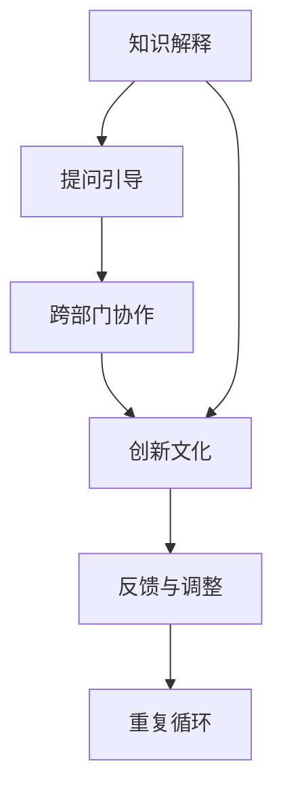

                 

# 费曼提问法促进团队学习与成长

> 关键词：费曼学习法, 费曼提问法, 团队学习, 知识分享, 跨部门协作, 创新文化

## 1. 背景介绍

### 1.1 问题由来

在信息爆炸的时代，快速掌握新知识、新技术成为企业和个人成长的关键。然而，知识的吸收和转化往往面临诸多挑战，如信息的复杂性、知识碎片化、学习效率低下等。费曼学习法（Feynman Learning Techniques），源自诺贝尔物理学奖得主理查德·费曼的独特学习方法，通过简化复杂概念和激发自主学习，大大提升了知识掌握效率。在团队学习环境中，费曼提问法（Feynman Teaching Method）作为费曼学习法的延伸，更加注重知识的分享和跨部门协作，为团队学习与成长提供了高效、互动的途径。

### 1.2 问题核心关键点

费曼提问法强调通过向他人解释新知识来巩固和深化理解。这种学习方法不仅能够促进个人深度理解，还能促进团队成员之间的交流和协作。它通过构建“教-学”循环，使团队成员相互促进、共同进步，形成了一种良性的学习生态。

核心关键点包括：
- 知识解释：通过向他人解释新概念，激发自我深入理解。
- 提问引导：提出问题引发思考，鼓励主动探索。
- 跨部门协作：促进不同背景、专业领域的知识交流，拓宽视野。
- 创新文化：在交流中产生新思路，推动技术创新。

### 1.3 问题研究意义

费曼提问法在推动团队学习与成长方面的意义重大：
1. **提升个人与团队学习效率**：通过知识解释和互动提问，使学习过程更加高效、深刻。
2. **促进跨部门协作**：不同领域的知识交流和整合，可以带来更全面的视角和解决方案。
3. **营造创新氛围**：在交流中激发新想法，推动技术创新和产品改进。
4. **增强团队凝聚力**：通过共同学习，增强团队成员之间的信任和合作。

## 2. 核心概念与联系

### 2.1 核心概念概述

费曼提问法是一种通过教与学的互动循环来促进深入理解的学习方法。核心概念包括：
- **知识解释**：通过向他人解释新知识，巩固自身的理解。
- **提问引导**：提出具有挑战性的问题，激发思考和探索。
- **跨部门协作**：促进不同领域、专业的知识交流和整合。
- **创新文化**：在交流中激发新思路，推动技术创新。

### 2.2 核心概念原理和架构的 Mermaid 流程图



这个流程图展示了费曼提问法的核心流程：
1. 通过知识解释巩固理解。
2. 提出问题激发思考。
3. 跨部门协作分享知识。
4. 营造创新文化。
5. 持续反馈与调整，形成循环。

### 2.3 核心概念之间联系

费曼提问法通过知识解释和提问引导，促进个人和团队深层次的理解和思考。跨部门协作在此基础上，拓宽了知识共享的广度和深度，带来了更多的创新和合作机会。创新文化是费曼提问法的内在驱动力，它通过持续的反馈与调整，推动团队不断优化和迭代。

## 3. 核心算法原理 & 具体操作步骤

### 3.1 算法原理概述

费曼提问法的核心原理是通过知识解释和提问引导，促进个人和团队的知识共享和深度理解。其步骤如下：

1. **知识解释**：选择一个新概念或技术，尽可能简洁明了地向他人解释。
2. **提问引导**：在解释过程中，不断提出问题，引导他人深入思考。
3. **跨部门协作**：与其他部门或专业领域的成员交流，拓宽知识视野。
4. **创新文化**：在交流中提出新的想法或解决方案，促进创新。

### 3.2 算法步骤详解

1. **知识解释**：
   - 选择一个新概念或技术，确保其对他人来说是未知的。
   - 尝试用最简单的语言解释这个概念或技术。
   - 如果解释过程中遇到困难，说明可能理解不够深入。

2. **提问引导**：
   - 在解释过程中，不断提出问题，鼓励他人思考。
   - 问题的设计应具有挑战性，激发深入思考和探索。
   - 记录下他人的问题和回答，以便于后续回顾和改进。

3. **跨部门协作**：
   - 与其他部门或专业领域的成员交流，分享知识。
   - 跨部门协作可以带来不同视角和经验，促进知识整合。
   - 通过协作，发现新的应用场景和解决方案。

4. **创新文化**：
   - 在交流中，提出新的想法或解决方案，促进创新。
   - 记录下新想法，并与团队分享，评估其潜在的价值和可行性。
   - 持续反馈与调整，不断优化和迭代。

### 3.3 算法优缺点

**优点**：
1. **提升理解深度**：通过向他人解释新概念，激发自我深入理解。
2. **促进知识共享**：通过提问引导和跨部门协作，拓宽知识视野。
3. **激发创新**：在交流中提出新想法，推动技术创新。
4. **增强团队凝聚力**：通过共同学习，增强团队成员之间的信任和合作。

**缺点**：
1. **需要较高沟通能力**：需要解释者和提问者具备良好的沟通能力，能够简洁明了地表达和引导。
2. **时间成本较高**：费时费力的互动过程，可能不适合快速推进的紧急任务。
3. **依赖积极参与者**：需要所有参与者都积极投入，才能达到最佳效果。

### 3.4 算法应用领域

费曼提问法适用于各种团队学习场景，包括但不限于以下领域：
- **技术研发团队**：促进技术分享和创新，提升技术研发效率。
- **产品开发团队**：跨部门协作，整合不同领域的知识，提升产品竞争力。
- **销售团队**：通过知识分享和跨部门协作，提升销售技巧和客户服务质量。
- **培训与教育**：教师通过向学生解释概念，促进学生的深度理解。
- **管理层**：通过知识分享，提高决策质量，推动企业战略实施。

## 4. 数学模型和公式 & 详细讲解 & 举例说明

### 4.1 数学模型构建

费曼提问法并不直接涉及复杂的数学模型，但可以通过数学方式来描述其核心步骤。以下是一个简化的数学模型：

假设团队中有 $N$ 名成员，每个人都需要掌握 $K$ 个新概念。每个成员 $i$ 对概念 $j$ 的理解程度为 $u_{ij}$，初始值为 0。团队通过 $T$ 轮提问与解释，每轮提问引导 $i$ 向其他 $N-1$ 名成员解释概念 $j$，并提出问题 $q_{ij}$，其他成员的回答为 $a_{ij}$。每轮结束后，成员 $i$ 对概念 $j$ 的理解程度更新为 $u_{ij}^{(t+1)}$。

### 4.2 公式推导过程

每轮提问与解释后，成员 $i$ 对概念 $j$ 的理解程度更新为：

$$
u_{ij}^{(t+1)} = u_{ij}^{(t)} + \alpha \left(\frac{1}{N-1} \sum_{k=1}^{N-1} \left( q_{ij} a_{ij} - \log a_{ij} \right) \right)
$$

其中 $\alpha$ 是学习率，$u_{ij}^{(t)}$ 是第 $t$ 轮结束时成员 $i$ 对概念 $j$ 的理解程度，$\sum_{k=1}^{N-1} a_{ij}$ 是对成员 $i$ 的平均回答，$\log a_{ij}$ 是对应的对数概率。

### 4.3 案例分析与讲解

假设一个技术团队有 5 名成员，他们需要掌握 3 个新概念。在第一轮中，成员 A 向成员 B、C、D、E 分别解释概念 1，并提出问题 $q_{A1}$。其他成员回答，成员 A 更新理解程度。

在第二轮中，成员 B 向其他成员解释概念 1，并提出问题 $q_{B1}$。成员 A、C、D、E 回答，成员 B 更新理解程度。

依此类推，通过多轮提问与解释，团队成员对新概念的理解程度不断提高，达到共同掌握的目标。

## 5. 项目实践：代码实例和详细解释说明

### 5.1 开发环境搭建

费曼提问法的实践并不依赖于特定的编程语言或工具，但需要一个支持团队协作的平台。以下是一个基于在线协作平台的简单实现：

1. **选择协作平台**：选择如Trello、Jira、Slack等支持在线协作和知识共享的工具。
2. **创建知识库**：创建知识库，存储新概念、技术、项目文档等。
3. **划分任务**：将任务划分为知识解释、提问引导、跨部门协作等，分配给团队成员。
4. **安排时间**：安排团队成员按照固定时间表参与互动学习。

### 5.2 源代码详细实现

以下是一个基于Python和Jupyter Notebook的简单实现示例：

```python
import sympy as sp

# 定义变量
N = 5  # 团队成员数
K = 3  # 新概念数
T = 3  # 互动轮数
alpha = 0.1  # 学习率

# 初始化理解程度
u = sp.Matrix([[0] * K for _ in range(N)])

# 模拟提问与解释
for t in range(T):
    for i in range(N):
        # 随机选择一个概念进行解释
        j = sp.rand(1, 1)[0, 0]
        # 随机生成问题和回答
        q = sp.rand(1, 1)[0, 0]
        a = sp.rand(1, 1)[0, 0]
        # 更新理解程度
        u[i, j] += alpha * (q * a - sp.log(a))

# 输出最终理解程度
u
```

### 5.3 代码解读与分析

此示例代码使用Sympy库定义了变量和矩阵，模拟了多轮提问与解释的学习过程，并计算了最终的团队理解程度。

1. **变量定义**：定义了团队成员数 $N$，新概念数 $K$，互动轮数 $T$ 和学习率 $\alpha$。
2. **初始化理解程度**：使用Sympy创建了一个 $N \times K$ 的矩阵 $u$，表示每个成员对每个概念的理解程度。
3. **提问与解释模拟**：通过嵌套循环，随机选择一个概念进行解释，并随机生成问题和回答。
4. **更新理解程度**：根据公式计算每个成员对每个概念的理解程度更新。
5. **输出最终理解程度**：展示经过多轮互动后，团队对每个概念的理解程度。

## 6. 实际应用场景

### 6.1 软件开发团队

在软件开发团队中，费曼提问法可以用于技术分享和知识管理：
- **技术分享**：定期组织技术分享会，团队成员互相解释新技术、新工具。
- **问题引导**：在分享会上，提出具有挑战性的问题，激发深度思考。
- **跨部门协作**：邀请产品、测试、运维等部门成员参与，拓宽知识视野。
- **创新文化**：在交流中提出新想法，推动技术创新。

### 6.2 项目管理团队

项目管理团队可以通过费曼提问法提升沟通和协作效率：
- **项目汇报**：项目经理定期向团队成员汇报项目进展，解释项目目标和方案。
- **问题引导**：在汇报过程中，提出问题，激发团队成员的思考和讨论。
- **跨部门协作**：邀请产品、研发、运营等部门成员参与，整合不同领域的知识。
- **创新文化**：在交流中提出新想法，优化项目管理方案。

### 6.3 培训与教育

在培训与教育领域，费曼提问法可以提升教学效果和学习深度：
- **知识讲解**：教师通过向学生解释新概念，巩固自身的理解。
- **问题引导**：在讲解过程中，提出具有挑战性的问题，激发学生的思考。
- **互动学习**：通过小组讨论、案例分析等方式，促进学生之间的知识共享。
- **创新文化**：在交流中提出新想法，推动创新教育模式。

## 7. 工具和资源推荐

### 7.1 学习资源推荐

费曼提问法的学习资源丰富多样，以下是一些推荐的资源：
1. **《费曼学习法：超级科学家学习经验全集》**：由Richard Feynman的传记作者James Gleick所著，详细介绍了费曼的学习方法。
2. **《费曼的教导》**：Feynman的亲笔信件和演讲，展示了他独特的思维方式。
3. **《如何像费曼一样学习》**：这本书详细介绍了费曼的思维模式和学习方法。
4. **《费曼技巧：如何讲解复杂概念》**：详细介绍了费曼提问法的原理和实践方法。

### 7.2 开发工具推荐

费曼提问法并不依赖特定的开发工具，但以下工具可以辅助实现：
1. **Trello**：在线协作平台，支持任务管理和知识共享。
2. **Jira**：项目管理工具，支持团队协作和进度跟踪。
3. **Slack**：即时通讯工具，支持团队沟通和信息共享。
4. **Google Docs**：在线文档工具，支持实时协作和知识共享。
5. **Microsoft Teams**：团队协作平台，支持视频会议、文件共享等功能。

### 7.3 相关论文推荐

费曼提问法的研究在学术界也得到了广泛关注，以下是几篇推荐论文：
1. **《Feynman's Techniques for Learning and Problem-Solving》**：详细介绍了费曼的学习方法和技巧。
2. **《Teaching Physics with the Feynman Techniques》**：展示了费曼的物理教学方法。
3. **《The Feynman Techniques for Self-Taught Learning》**：探讨了费曼技巧在自学者中的应用。
4. **《The Feynman Technique: How to Learn Anything Faster and Better》**：介绍了费曼技巧的现代应用。

## 8. 总结：未来发展趋势与挑战

### 8.1 总结

费曼提问法通过知识解释和提问引导，促进团队学习与成长。其核心原理简洁明了，操作步骤清晰，适用于各种团队学习场景。通过深入理解新概念、激发思考和跨部门协作，费曼提问法能够显著提升团队的学习效率和创新能力。

### 8.2 未来发展趋势

未来，费曼提问法将在以下几个方面继续发展：
1. **技术进步**：随着AI和机器学习技术的进步，费曼提问法将进一步数字化、智能化，提高效率和效果。
2. **应用扩展**：在更多行业和领域推广应用，如医疗、金融、教育等，拓展应用场景。
3. **工具创新**：开发更多在线协作工具，支持远程和分布式团队学习。
4. **文化建设**：推广费曼提问法，营造创新和学习的企业文化。

### 8.3 面临的挑战

尽管费曼提问法在团队学习中具有显著优势，但仍面临一些挑战：
1. **沟通障碍**：不同背景和语言水平的团队成员，可能在沟通和理解上存在困难。
2. **时间管理**：需要合理安排互动时间，避免影响工作效率。
3. **文化差异**：不同团队和文化背景，可能对费曼提问法的接受度不同。

### 8.4 研究展望

未来的研究可以从以下几个方面进行：
1. **理论完善**：进一步完善费曼提问法的理论基础，探索更多优化方法。
2. **实践应用**：在更多行业和领域推广应用，验证其效果和可操作性。
3. **工具创新**：开发更多智能化工具，支持远程和分布式团队学习。
4. **文化建设**：推广费曼提问法，营造创新和学习的企业文化。

## 9. 附录：常见问题与解答

**Q1：如何平衡费曼提问法与其他团队协作方法？**

A: 费曼提问法可以作为团队协作的一种补充方式，与其他方法如敏捷开发、Scrum等结合使用。例如，在Scrum的Sprint回顾阶段，可以使用费曼提问法进行知识分享和讨论。

**Q2：在技术讨论中使用费曼提问法时，应如何设计问题？**

A: 设计问题时应具有挑战性，能够激发团队成员的深度思考和讨论。例如，可以提出“如何优化某个算法？”、“某技术难点如何解决？”等问题。

**Q3：非技术背景的团队成员如何参与费曼提问法？**

A: 非技术背景的团队成员可以通过简单的问题和解释，参与到技术讨论中。例如，可以讨论“某产品如何改进？”、“某业务流程优化建议？”等问题。

**Q4：费曼提问法是否适用于所有团队？**

A: 费曼提问法适用于具备学习需求和沟通能力的团队，对于以执行操作为主的任务团队，可能并不适用。

**Q5：费曼提问法的学习效率如何？**

A: 费曼提问法的学习效率较高，但需要团队成员积极参与和投入。通过多次互动和反馈，逐步提升团队成员的理解深度和知识水平。

---

作者：禅与计算机程序设计艺术 / Zen and the Art of Computer Programming

