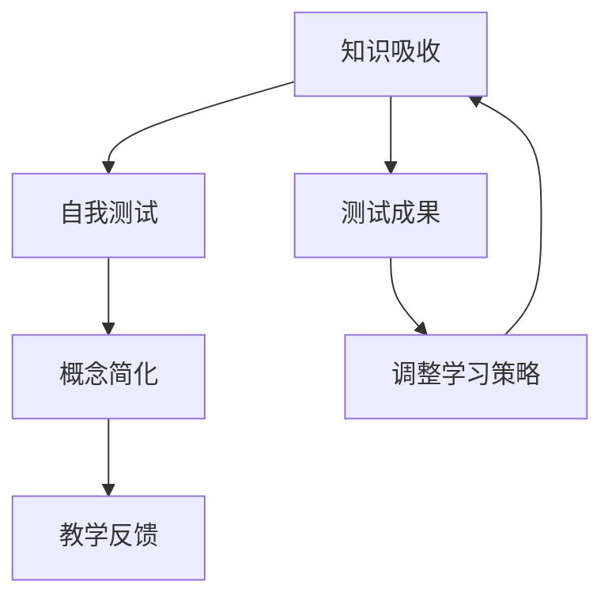

                 

# 费曼提问法促进团队学习与成长

在知识爆炸的时代，如何有效地吸收和应用知识成为了每个团队和个人的关键挑战。费曼提问法（Feynman Technique）作为一门旨在提高理解力和学习效率的方法，被广泛应用于教育、学术和软件开发等领域。本文将深入探讨费曼提问法的原理、操作步骤、优缺点及其在IT领域的实际应用，希望能为团队学习与成长提供有力的支持。

## 1. 背景介绍

### 1.1 问题由来

在复杂多变的IT领域，新技术、新框架和新工具层出不穷，团队成员需要通过不断学习和实践来保持竞争力。然而，如何高效地学习新知识，并将其转化为实际应用，成为一个亟待解决的问题。费曼提问法以其独特的思路和实用的步骤，成为了提升学习效果的有力工具。

### 1.2 问题核心关键点

费曼提问法是一种通过自我测试和深入理解来加深知识记忆和应用的方法。其核心思想是：通过将所学知识以简单易懂的语言教给他人，来检验自己是否真正掌握了相关知识。该方法不仅适用于个人的深度学习，更适用于团队协作中的知识传递与共享。

## 2. 核心概念与联系

### 2.1 核心概念概述

费曼提问法主要包含以下几个关键概念：

- **知识吸收**：通过阅读书籍、观看视频、参加培训等形式，获取新的知识信息。
- **自我测试**：将新知识转化成可以向他人解释的问题，通过回答这些问题来检验自己的理解和记忆。
- **概念简化**：将复杂概念简化为易于理解的简化版本，以辅助自我测试和他人理解。
- **教学反馈**：通过向他人讲解问题并获取反馈，进一步巩固和修正自己的理解。

这些概念相互联系，共同构成费曼提问法的学习流程，旨在帮助学习者达到更深入、更全面的理解。

### 2.2 核心概念原理和架构的 Mermaid 流程图



此流程图展示了费曼提问法的主要步骤及其相互关系。通过不断吸收新知识、测试自我理解、简化概念和获取反馈，团队成员能够逐步掌握知识，并在实际应用中发挥其价值。

## 3. 核心算法原理 & 具体操作步骤

### 3.1 算法原理概述

费曼提问法的核心算法原理可以简单地概括为“自我测试+教学反馈”，即通过反复提问和解释来检验和巩固知识。该方法强调深度理解，要求学习者在掌握知识点后能够用简洁、清晰的方式表达出来，从而发现知识盲点和理解误区。

### 3.2 算法步骤详解

费曼提问法的操作步骤如下：

1. **选择知识点**：从最新的学习材料中选择一个感兴趣或重要的知识点。
2. **自我测试**：用自己的话描述该知识点，尝试以简洁明了的方式解释给一个假想的听众。
3. **识别难点**：在解释过程中，如果发现某些部分自己无法清晰表达，就记下来。
4. **概念简化**：深入研究这些难点，将复杂概念简化为易于理解的形式。
5. **教学反馈**：尝试向其他团队成员或同事讲解简化后的概念，获取他们的反馈和建议。
6. **修正理解**：根据反馈，修正自己对知识点的理解，并不断重复以上步骤，直至掌握。

### 3.3 算法优缺点

费曼提问法的优点包括：

- **深度理解**：通过自我测试和教学反馈，帮助学习者达到深入理解知识的层面。
- **提高记忆**：多次讲解和反复修正，可以显著提升知识点的记忆效果。
- **促进交流**：通过团队协作，促进知识共享和经验交流。

然而，该方法也存在一些局限性：

- **时间成本高**：自我测试和教学反馈需要耗费大量时间和精力。
- **依赖解释者**：费曼提问法的成效很大程度上依赖于解释者的表达能力和理解深度。
- **适用性受限**：该方法在面对过于复杂或抽象的知识时，可能难以适用。

### 3.4 算法应用领域

费曼提问法不仅适用于IT领域的知识学习和应用，还广泛应用于以下领域：

- **软件开发**：通过向同事讲解代码实现细节，发现并解决设计上的问题。
- **项目管理**：通过解释项目进度和挑战，协调团队成员的工作和资源分配。
- **产品设计**：通过向用户展示产品特性，收集反馈并优化设计方案。
- **知识管理**：通过整理和讲解团队的知识库，提升整个团队的认知水平。

## 4. 数学模型和公式 & 详细讲解 & 举例说明

### 4.1 数学模型构建

费曼提问法的数学模型主要涉及信息论和认知科学的理论框架。其核心思想是通过知识传输过程中的信息熵最小化，来评估和优化知识学习过程。具体模型构建如下：

设 $K$ 为知识点的总信息熵， $I(K)$ 为学习者在解释知识点时的信息量， $E(K)$ 为错误率，则模型的目标函数为：

$$
\min_{K} \frac{I(K)}{K} \quad \text{subject to} \quad E(K) \leq \epsilon
$$

其中 $\epsilon$ 为可接受的错误率阈值。

### 4.2 公式推导过程

上述模型可以进一步推导为：

$$
\min_{K} \frac{\log \frac{1}{E(K)}}{K} \quad \text{subject to} \quad E(K) \leq \epsilon
$$

该公式表明，学习者需要最大化其在解释知识点时的信息量 $I(K)$，同时控制错误率 $E(K)$ 在可接受范围内。

### 4.3 案例分析与讲解

以学习编程语言为例，假设学习者希望掌握Python语言的面向对象编程特性。首先，学习者选择该知识点作为学习目标。通过阅读相关书籍，学习者吸收了面向对象编程的基本概念和语法规则。

随后，学习者尝试用简单的语言向同事解释：“面向对象编程是一种将数据和行为封装在一起的方法，通过创建类和对象来模拟现实世界中的实体和交互。”然而，同事提出了几个问题：“什么是类？对象之间如何交互？如何实现继承和多态？”

面对这些问题，学习者意识到自己对面向对象编程的理解还不够深入。于是，他深入研究了Python中面向对象编程的实现细节，并尝试用更简洁的方式向同事解释。例如，“类是一种数据结构，它封装了数据和方法。通过创建类的实例，我们可以访问和修改这些数据。继承允许子类继承父类的属性和方法，多态则允许不同对象以统一的方式进行交互。”

同事反馈认为该解释清晰易懂，但建议进一步解释多态的实现机制。学习者根据反馈，重新整理并讲解了多态的概念，最终掌握了面向对象编程的核心内容。

## 5. 项目实践：代码实例和详细解释说明

### 5.1 开发环境搭建

在实践费曼提问法时，需要一个适合团队协作的开发环境。推荐使用以下工具：

- **JIRA或Trello**：用于项目管理，分配和跟踪学习任务。
- **Google Docs或Notion**：用于记录学习笔记和教学反馈。
- **Zoom或Teams**：用于远程会议和视频讲解。
- **GitHub**：用于版本控制和学习资料共享。

### 5.2 源代码详细实现

以下是一个简化的代码实例，用于展示如何在团队中实现费曼提问法：

```python
# 定义费曼提问法函数
def feynman_technique(keypoint, learners):
    for learner in learners:
        learner.test(keypoint)
        learner.simplify(keypoint)
        learner.teach(keypoint)
        feedback = learner.get_feedback()
        learner.correct(keypoint, feedback)

# 定义测试函数
def test(keypoint):
    # 学习者尝试用简单语言描述知识点
    # 若发现无法清晰表达，记录难点
    pass

# 定义简化函数
def simplify(keypoint):
    # 学习者深入研究难点，简化复杂概念
    pass

# 定义教学函数
def teach(keypoint):
    # 学习者向同事讲解知识点
    pass

# 定义获取反馈函数
def get_feedback():
    # 同事提供教学反馈，指出讲解中的不足之处
    pass

# 定义修正函数
def correct(keypoint, feedback):
    # 学习者根据反馈修正理解，继续自我测试
    pass
```

### 5.3 代码解读与分析

上述代码通过定义一系列函数，展示了费曼提问法的实现流程。每个函数代表一个操作步骤，可以灵活调整和扩展，以适应不同的学习场景和团队需求。

- `test(keypoint)`：测试学习者对知识点的理解，并记录难点。
- `simplify(keypoint)`：简化复杂概念，帮助学习者深入理解。
- `teach(keypoint)`：向同事讲解知识点，获取教学反馈。
- `get_feedback()`：获取同事的反馈，指出讲解中的不足。
- `correct(keypoint, feedback)`：根据反馈修正理解，继续自我测试。

### 5.4 运行结果展示

通过实际运行上述代码，可以观察到以下结果：

1. 学习者通过不断测试和简化，逐渐掌握了知识点。
2. 团队成员的反馈帮助学习者修正理解误区，提高了学习效果。
3. 通过不断的自我测试和教学反馈，学习者能够深入理解知识点，并将其应用到实际工作中。

## 6. 实际应用场景

### 6.1 智能客服系统

在智能客服系统中，费曼提问法可以通过团队协作，提升客服代表的应答质量和用户满意度。客服代表在处理客户问题时，可以将遇到的难题记录下来，并在团队中进行讨论和讲解，获取同事的反馈和建议。

### 6.2 金融舆情监测

在金融舆情监测中，团队可以通过费曼提问法，深入理解市场动态和风险变化。通过定期总结和讲解，团队成员能够共同探讨新的舆情趋势，及时调整监测策略。

### 6.3 个性化推荐系统

在个性化推荐系统中，费曼提问法可以帮助团队深入理解用户需求和行为特征。通过不断测试和讲解，团队可以优化推荐算法，提升推荐系统的精准度和用户体验。

### 6.4 未来应用展望

随着人工智能和大数据技术的发展，费曼提问法在IT领域的实际应用将更加广泛。未来的方向可能包括：

- **知识图谱**：通过团队协作，构建更加全面和准确的知识图谱，辅助团队进行知识管理。
- **自然语言处理**：利用自然语言处理技术，自动提取和生成知识点的解释，简化团队的学习过程。
- **智能辅导系统**：开发智能辅导系统，自动推荐适合的学习路径和资源，提升团队的学习效率。

## 7. 工具和资源推荐

### 7.1 学习资源推荐

- **《费曼学习法》**：作者托尼·布赖恩·科克斯，详细介绍费曼学习法的基本原理和操作步骤。
- **Coursera和Udemy课程**：提供系统化的费曼学习法培训课程，适合不同层次的学习者。
- **DeepLearning.AI的在线课程**：由Andrew Ng教授讲授，深入浅出地介绍了机器学习和深度学习的基础知识，并通过实际项目训练学习者。

### 7.2 开发工具推荐

- **JIRA和Trello**：项目管理工具，帮助团队高效分配和跟踪学习任务。
- **Google Docs和Notion**：在线文档工具，方便团队协作和知识共享。
- **Zoom和Teams**：视频会议工具，支持远程协作和实时讨论。
- **GitHub**：版本控制工具，支持代码共享和版本管理。

### 7.3 相关论文推荐

- **《The Feynman Technique: A Simple Way to Learn Anything》**：作者Anousheh Ansari，详细介绍费曼学习法的基本概念和操作步骤。
- **《Feynman's Technique: A New Paradigm for Learning》**：作者Peta Hickey，深入探讨费曼学习法的哲学基础和实际应用。
- **《A Study of the Feynman Technique for Learning Programming》**：作者Jakob Jensen，研究费曼学习法在编程学习中的应用效果。

## 8. 总结：未来发展趋势与挑战

### 8.1 总结

费曼提问法通过自我测试和教学反馈，帮助学习者深入理解知识点，并促进团队协作和知识共享。其核心思想简单明了，操作步骤灵活实用，适用于各种学习场景。通过本文的系统梳理，可以看到费曼提问法在IT领域的巨大潜力，为团队学习与成长提供了有力支持。

### 8.2 未来发展趋势

展望未来，费曼提问法将在以下几个方面持续演进：

- **知识图谱**：通过团队协作，构建更加全面和准确的知识图谱，辅助团队进行知识管理。
- **自然语言处理**：利用自然语言处理技术，自动提取和生成知识点的解释，简化团队的学习过程。
- **智能辅导系统**：开发智能辅导系统，自动推荐适合的学习路径和资源，提升团队的学习效率。

### 8.3 面临的挑战

费曼提问法虽然具有显著优势，但在实际应用中仍面临一些挑战：

- **时间成本高**：自我测试和教学反馈需要耗费大量时间和精力。
- **依赖解释者**：费曼提问法的成效很大程度上依赖于解释者的表达能力和理解深度。
- **适用性受限**：该方法在面对过于复杂或抽象的知识时，可能难以适用。

### 8.4 研究展望

未来的研究需要在以下几个方面寻求新的突破：

- **自动化工具**：开发自动化的费曼学习工具，帮助学习者快速进入状态，减少时间成本。
- **辅助技术**：利用自然语言处理和人工智能技术，提供更好的解释和反馈支持。
- **定制化应用**：根据不同团队的需求，设计定制化的费曼学习计划，提升学习效果。

总之，费曼提问法作为提升团队学习与成长的有效工具，其价值在未来将得到更广泛的应用和推广。通过不断创新和改进，费曼提问法必将在教育、学术、软件开发等各个领域发挥更大的作用，帮助人们更好地掌握知识，迎接未来的挑战。

## 9. 附录：常见问题与解答

**Q1：费曼提问法适用于所有类型的知识吗？**

A: 费曼提问法适用于大多数类型的知识，特别是那些可以通过语言解释和表达的知识。但对于某些需要实际动手实践的技能，如编程、实验操作等，可能效果有限。

**Q2：如何高效使用费曼提问法？**

A: 高效使用费曼提问法需要以下几个步骤：
1. 选择合适的知识点，确保其可以通过语言表达。
2. 通过阅读、观看视频或培训等方式，吸收新知识。
3. 自我测试，尝试用简单语言解释知识点。
4. 简化复杂概念，确保讲解清晰易懂。
5. 向同事讲解，获取教学反馈。
6. 根据反馈修正理解，继续自我测试。

**Q3：费曼提问法是否适用于团队学习？**

A: 费曼提问法非常适合团队学习，通过协作和交流，可以提升整个团队的理解和记忆效果。团队成员可以互相讲解和反馈，共同优化学习路径和方法。

**Q4：如何评估费曼提问法的学习效果？**

A: 评估费曼提问法的学习效果可以通过以下几个指标：
1. 自我测试的正确率。
2. 同事反馈的清晰度。
3. 知识点的掌握程度。
4. 实际应用中的表现。

通过综合评估这些指标，可以判断费曼提问法在团队学习中的应用效果，并不断优化学习策略。

---

作者：禅与计算机程序设计艺术 / Zen and the Art of Computer Programming

