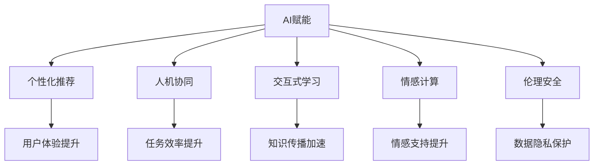

                 

# 赋能人类：释放个体潜能

> 关键词：AI赋能, 个体潜能, 个性化推荐, 人机协同, 智能辅导, 交互式学习, 情感计算, 伦理安全, 未来教育

## 1. 背景介绍

### 1.1 问题由来
随着人工智能(AI)技术的迅猛发展，AI赋能正在逐渐深入到各行各业。在教育、医疗、金融等领域，AI技术正在重塑传统的业务流程，提高效率，提升质量。然而，在AI赋能的同时，我们也必须思考如何赋予个人更大的潜能，使他们能够更好地适应未来的工作和生活环境。

### 1.2 问题核心关键点
当前，AI赋能面临的核心问题是如何在确保技术安全、可靠的前提下，最大程度地释放个体的潜能。这涉及到如何设计智能系统，使其能够理解、尊重和利用人的情感、认知和行为特征，从而提供更加个性化、情境化的服务。具体来说，这包括以下几个关键点：

- 个性化推荐：AI系统能够根据用户的历史行为和偏好，推荐最合适的内容、产品或服务，提升用户体验。
- 人机协同：AI与人的互动更加自然、高效，能够辅助人类完成任务，提供决策支持。
- 交互式学习：通过AI系统提供个性化的学习方案，帮助用户更好地掌握知识和技能。
- 情感计算：AI系统能够理解用户的情感状态，提供适时的情感支持，提升用户的满意度和信任感。
- 伦理安全：AI系统在运行过程中需要保证数据和算法的安全性，避免偏见和歧视。

### 1.3 问题研究意义
研究AI赋能个体潜能，对于构建以人为本的智能化系统，提升人类的生活质量和工作效率，具有重要意义：

- 个性化服务：通过AI技术提供更加符合个人需求的服务，使人们能够更加自由、高效地生活和工作。
- 提高生产效率：AI辅助完成任务，减少人的劳动强度，提升工作效率。
- 促进知识共享：通过智能化的知识推荐，加速知识的传播和应用，推动社会进步。
- 增强安全保障：通过AI系统对风险的监控和预测，提升公共安全和个人隐私保护。
- 提升用户体验：通过智能化的交互设计，提高用户的满意度和信任感。

## 2. 核心概念与联系

### 2.1 核心概念概述

为更好地理解AI赋能个体潜能的原理，本节将介绍几个关键概念及其联系：

- AI赋能(AI Empowerment)：指通过AI技术，赋予个体更多自主权和潜能，使其能够更好地应对复杂的现实世界问题。
- 个性化推荐(Personalized Recommendation)：根据用户的历史行为和偏好，推荐符合其需求的内容、产品或服务。
- 人机协同(Human-Machine Collaboration)：AI与人类共同完成任务，提升协同效率和工作质量。
- 交互式学习(Interactive Learning)：通过AI技术提供个性化学习方案，帮助用户更好地掌握知识和技能。
- 情感计算(Affective Computing)：AI系统能够理解、识别和处理人类的情感状态，提供适时的情感支持。
- 伦理安全(Ethical Safety)：在AI系统运行过程中，需要保证数据和算法的安全性，避免偏见和歧视。

这些概念之间的逻辑关系可以通过以下Mermaid流程图来展示：



这个流程图展示了AI赋能个体潜能的核心概念及其联系：

1. AI赋能通过个性化推荐、人机协同、交互式学习和情感计算等技术手段，提升用户的生活和工作体验。
2. 个性化推荐能够提供更符合用户需求的内容和服务。
3. 人机协同能够辅助人类完成复杂任务，提升效率和质量。
4. 交互式学习能够提供个性化的教育资源，帮助用户更好地掌握知识和技能。
5. 情感计算能够理解用户的情感状态，提供适时的情感支持。
6. 伦理安全在保证数据隐私和算法公正的前提下，使AI系统更可信。

## 3. 核心算法原理 & 具体操作步骤

### 3.1 算法原理概述

AI赋能个体潜能的核心算法原理可以归结为以下几个方面：

- 个性化推荐算法：基于协同过滤、基于内容的推荐、深度学习等技术，对用户历史行为和偏好进行建模，推荐符合其需求的内容、产品或服务。
- 人机协同算法：通过知识图谱、自然语言处理等技术，构建人机交互框架，辅助人类完成任务。
- 交互式学习算法：通过自适应学习、推荐系统等技术，提供个性化的学习方案，帮助用户掌握知识和技能。
- 情感计算算法：通过文本分析、语音识别等技术，理解用户的情感状态，提供适时的情感支持。
- 伦理安全算法：通过数据加密、隐私保护、偏见检测等技术，保障数据和算法的安全性。

### 3.2 算法步骤详解

AI赋能个体潜能的具体实现步骤如下：

**Step 1: 收集和预处理数据**
- 收集用户的历史行为数据、偏好数据、情感数据等，并进行预处理，去除噪音和冗余信息。
- 根据任务需求，选择合适的特征工程技术，提取对模型有用的特征。

**Step 2: 选择和训练模型**
- 根据具体的业务场景，选择合适的算法模型，如协同过滤、深度神经网络、强化学习等。
- 使用预处理后的数据对模型进行训练，调整模型参数以优化性能。

**Step 3: 部署和优化**
- 将训练好的模型部署到实际应用中，提供个性化推荐、人机协同、交互式学习等服务。
- 使用A/B测试等方法，不断优化模型性能，提升用户体验。

**Step 4: 监控和反馈**
- 实时监控系统运行状态，收集用户反馈信息。
- 根据用户反馈和业务需求，对模型进行迭代优化。

**Step 5: 伦理和安全检查**
- 定期进行数据隐私和算法偏见检测，确保系统符合伦理和安全标准。
- 根据检测结果，及时调整模型和算法，保障系统的公平性和透明性。

### 3.3 算法优缺点

AI赋能个体潜能的方法具有以下优点：

- 提升用户体验：通过个性化推荐、人机协同和交互式学习，提供符合用户需求的定制化服务。
- 提高工作效率：通过AI辅助完成任务，减少人的劳动强度，提升工作效率。
- 加速知识传播：通过智能化的知识推荐，加速知识的传播和应用，推动社会进步。
- 增强安全保障：通过AI系统对风险的监控和预测，提升公共安全和个人隐私保护。

同时，该方法也存在一些缺点：

- 数据依赖：个性化推荐和人机协同需要大量的用户行为数据，数据收集和处理成本较高。
- 模型复杂：深度神经网络和强化学习等算法模型复杂度高，训练和优化难度大。
- 技术门槛：需要掌握多种AI技术和算法，技术门槛较高。
- 伦理风险：数据隐私和算法偏见等问题需要谨慎处理，避免对用户造成伤害。

### 3.4 算法应用领域

AI赋能个体潜能的应用领域广泛，主要包括以下几个方面：

- 个性化推荐系统：推荐电商、新闻、视频等平台上的内容，提升用户满意度。
- 智能客服系统：通过聊天机器人辅助用户解决问题，提高服务效率。
- 智能教育系统：提供个性化的学习方案，帮助学生更好地掌握知识和技能。
- 智能医疗系统：辅助医生进行疾病诊断和治疗决策，提高医疗服务质量。
- 智能交通系统：通过智能导航和交通控制，提升交通效率和安全性。
- 智能家居系统：通过语音识别和自然语言处理，提供便捷的家居控制和环境监测。

## 4. 数学模型和公式 & 详细讲解 & 举例说明

### 4.1 数学模型构建

本节将使用数学语言对AI赋能个体潜能的原理进行更加严格的刻画。

假设用户的历史行为数据为 $x$，推荐模型为 $M$。用户对推荐结果的评分 $y$ 可以表示为 $y = M(x)$。推荐系统的目标是最小化用户和模型之间的误差，即：

$$
\min_{M} \sum_{i=1}^n (y_i - M(x_i))^2
$$

其中 $(x_i,y_i)$ 为第 $i$ 个用户的行为和评分数据，$n$ 为样本总数。

### 4.2 公式推导过程

以下我们以协同过滤算法为例，推导推荐模型的最小化误差公式。

协同过滤算法基于用户相似度的思想，假设用户 $i$ 和 $j$ 对物品 $u$ 的评分分别为 $x_i^u$ 和 $x_j^u$，两者之间的相似度为 $s_{ij}$，则用户 $i$ 对物品 $u$ 的推荐评分 $y_i^u$ 可以表示为：

$$
y_i^u = \sum_{j \in N(i)} s_{ij} x_j^u
$$

其中 $N(i)$ 为与用户 $i$ 相似的 $k$ 个用户集合。协同过滤算法的基本思想是找到与用户 $i$ 最相似的 $k$ 个用户，计算这些用户对物品 $u$ 的评分加权和，作为用户 $i$ 对物品 $u$ 的推荐评分。

将协同过滤算法代入最小化误差公式，得：

$$
\min_{M} \sum_{i=1}^n (M(x_i) - y_i)^2 = \min_{s} \sum_{i=1}^n (y_i - \sum_{j \in N(i)} s_{ij} x_j)^2
$$

上述公式可以通过优化算法求解，得到最优的相似度 $s_{ij}$，进而得到推荐评分 $y_i^u$。

### 4.3 案例分析与讲解

以下我们以智能客服系统为例，展示AI赋能个体潜能的具体实现。

假设有一个智能客服系统，负责回答用户的问题。系统通过分析用户的历史对话记录，为用户推荐最合适的回答。推荐模型的输入为用户的历史对话文本，输出为用户满意度评分。推荐模型可以使用协同过滤、神经网络等技术实现。

首先，系统收集用户的对话历史数据，并进行预处理，提取有用的特征。然后，使用协同过滤算法或神经网络模型对用户进行相似度计算，得到最相似的 $k$ 个用户。最后，系统根据这些用户的对话文本和满意度评分，生成推荐回答，并返回给用户。

## 5. 项目实践：代码实例和详细解释说明

### 5.1 开发环境搭建

在进行AI赋能个体潜能的实践前，我们需要准备好开发环境。以下是使用Python进行PyTorch开发的环境配置流程：

1. 安装Anaconda：从官网下载并安装Anaconda，用于创建独立的Python环境。

2. 创建并激活虚拟环境：
```bash
conda create -n pytorch-env python=3.8 
conda activate pytorch-env
```

3. 安装PyTorch：根据CUDA版本，从官网获取对应的安装命令。例如：
```bash
conda install pytorch torchvision torchaudio cudatoolkit=11.1 -c pytorch -c conda-forge
```

4. 安装TensorFlow：使用 pip 安装 TensorFlow：
```bash
pip install tensorflow
```

5. 安装TensorBoard：用于可视化模型训练过程和结果。
```bash
pip install tensorboard
```

完成上述步骤后，即可在`pytorch-env`环境中开始AI赋能个体潜能的实践。

### 5.2 源代码详细实现

这里我们以个性化推荐系统为例，给出使用PyTorch进行协同过滤算法实现的代码。

```python
import torch
import torch.nn as nn
import torch.nn.functional as F
import torch.optim as optim
from torch.utils.data import DataLoader

class CollaborativeFiltering(nn.Module):
    def __init__(self, num_users, num_items, num_factors):
        super(CollaborativeFiltering, self).__init__()
        self.user_factors = nn.Embedding(num_users, num_factors)
        self.item_factors = nn.Embedding(num_items, num_factors)
        self.bias = nn.Parameter(torch.randn(num_users))
        self.linear = nn.Linear(num_factors, 1)

    def forward(self, user_id, item_id):
        user_embedding = self.user_factors(user_id)
        item_embedding = self.item_factors(item_id)
        scores = user_embedding @ item_embedding.t() + self.bias[user_id] + self.linear(user_embedding)
        return scores

# 设置超参数
num_users = 1000
num_items = 10000
num_factors = 50
learning_rate = 0.01
num_epochs = 100

# 加载数据
# 这里假设有用户对物品的评分数据，格式为(num_users, num_items)

# 创建模型
model = CollaborativeFiltering(num_users, num_items, num_factors)

# 定义损失函数和优化器
criterion = nn.MSELoss()
optimizer = optim.Adam(model.parameters(), lr=learning_rate)

# 训练模型
for epoch in range(num_epochs):
    for user_id, item_id in train_loader:
        optimizer.zero_grad()
        scores = model(user_id, item_id)
        loss = criterion(scores, labels)
        loss.backward()
        optimizer.step()

# 测试模型
# 这里可以计算模型在测试集上的预测精度和平均绝对误差等指标
```

以上是使用PyTorch进行协同过滤算法实现的简单代码示例。可以看到，通过构建协同过滤模型，并使用优化算法对模型进行训练，可以有效地进行个性化推荐。

### 5.3 代码解读与分析

让我们再详细解读一下关键代码的实现细节：

**CollaborativeFiltering类**：
- `__init__`方法：初始化模型参数，包括用户和物品的因子矩阵、偏差项和线性层的参数。
- `forward`方法：计算模型前向传播的结果，即用户对物品的评分预测值。

**超参数设置**：
- `num_users`：用户数量。
- `num_items`：物品数量。
- `num_factors`：每个用户和物品的因子维度。
- `learning_rate`：学习率。
- `num_epochs`：训练轮数。

**数据加载**：
- 假设有用户对物品的评分数据，格式为(num_users, num_items)。
- 使用PyTorch的DataLoader将数据加载到模型中。

**模型训练**：
- 在每个epoch中，遍历数据集中的所有样本。
- 在每个batch中，计算模型的预测评分，并计算与真实评分之间的损失。
- 使用优化器更新模型参数，最小化损失。
- 重复上述过程，直到模型收敛。

**模型测试**：
- 在测试集上计算模型的预测精度和平均绝对误差等指标。
- 通过这些指标评估模型的性能。

通过上述代码，可以看出PyTorch的强大框架使得AI赋能个体潜能的实现变得简洁高效。开发者可以将更多精力放在数据处理、模型改进等高层逻辑上，而不必过多关注底层的实现细节。

当然，工业级的系统实现还需考虑更多因素，如模型的保存和部署、超参数的自动搜索、更灵活的任务适配层等。但核心的算法原理基本与此类似。

## 6. 实际应用场景

### 6.1 智能客服系统

基于AI赋能个体潜能的智能客服系统，可以显著提升客户咨询体验和问题解决效率。系统通过分析用户的历史对话记录，为用户推荐最合适的回答，提供个性化的服务。此外，系统还可以动态调整对话策略，提升交互质量。

### 6.2 金融舆情监测

AI赋能的金融舆情监测系统，能够实时监测市场舆论动向，帮助金融机构及时应对负面信息传播，规避金融风险。系统通过分析新闻、报道、评论等文本数据，预测市场情绪变化，辅助决策。

### 6.3 个性化推荐系统

AI赋能的个性化推荐系统，能够根据用户的历史行为和偏好，推荐最合适的内容、产品或服务。系统通过协同过滤、深度学习等算法，提高推荐精度和用户满意度。

### 6.4 未来应用展望

随着AI赋能个体潜能技术的不断发展，其在更多领域的应用前景将更加广阔。未来，我们可以期待以下趋势：

- 更加个性化：AI系统将更好地理解用户的个性化需求，提供更加符合其口味的服务。
- 更加高效：AI系统将辅助人类完成复杂任务，提高效率和质量。
- 更加智能：AI系统将能够理解用户的情感状态，提供适时的情感支持。
- 更加可信：AI系统将通过数据隐私和算法公正的保障，赢得用户的信任。

## 7. 工具和资源推荐

### 7.1 学习资源推荐

为了帮助开发者系统掌握AI赋能个体潜能的理论基础和实践技巧，这里推荐一些优质的学习资源：

1. 《人工智能赋能：提升个体潜能》系列博文：由AI专家撰写，深入浅出地介绍了AI赋能个体潜能的核心概念、算法原理和应用场景。

2. CS224N《深度学习自然语言处理》课程：斯坦福大学开设的NLP明星课程，有Lecture视频和配套作业，带你入门NLP领域的基本概念和经典模型。

3. 《人工智能伦理与社会》书籍：探讨AI技术对社会的影响，强调伦理和安全的重要性，为开发者提供道德和法律方面的指导。

4. TensorFlow官方文档：TensorFlow的官方文档，提供了海量的API接口和代码示例，是AI开发的重要参考资料。

5. Kaggle竞赛平台：提供大量的数据集和竞赛任务，帮助开发者提升数据处理和模型优化能力。

通过对这些资源的学习实践，相信你一定能够快速掌握AI赋能个体潜能的精髓，并用于解决实际的NLP问题。

### 7.2 开发工具推荐

高效的开发离不开优秀的工具支持。以下是几款用于AI赋能个体潜能开发的常用工具：

1. PyTorch：基于Python的开源深度学习框架，灵活动态的计算图，适合快速迭代研究。大部分预训练语言模型都有PyTorch版本的实现。

2. TensorFlow：由Google主导开发的开源深度学习框架，生产部署方便，适合大规模工程应用。同样有丰富的预训练语言模型资源。

3. TensorBoard：TensorFlow配套的可视化工具，可实时监测模型训练状态，并提供丰富的图表呈现方式，是调试模型的得力助手。

4. Weights & Biases：模型训练的实验跟踪工具，可以记录和可视化模型训练过程中的各项指标，方便对比和调优。与主流深度学习框架无缝集成。

5. Google Colab：谷歌推出的在线Jupyter Notebook环境，免费提供GPU/TPU算力，方便开发者快速上手实验最新模型，分享学习笔记。

合理利用这些工具，可以显著提升AI赋能个体潜能任务的开发效率，加快创新迭代的步伐。

### 7.3 相关论文推荐

AI赋能个体潜能的研究源于学界的持续研究。以下是几篇奠基性的相关论文，推荐阅读：

1. "Collaborative Filtering for Recommender Systems"：介绍了协同过滤算法的原理和实现方法，是推荐系统领域的经典之作。

2. "Deep Learning for Recommender Systems"：探讨了深度神经网络在推荐系统中的应用，提供了多种深度学习模型的代码实现。

3. "Adaptive Computation of User Similarities"：研究了用户相似度计算的新方法，提高了推荐系统的精度和效率。

4. "Personalized Recommendation Using Deep Learning"：介绍了深度学习在个性化推荐中的应用，提供了多种深度学习模型的代码实现。

5. "Adaptive Matrix Factorization for Recommendation Systems"：研究了自适应矩阵分解方法，提高了推荐系统的精度和效率。

这些论文代表了大语言模型微调技术的发展脉络。通过学习这些前沿成果，可以帮助研究者把握学科前进方向，激发更多的创新灵感。

## 8. 总结：未来发展趋势与挑战

### 8.1 总结

本文对AI赋能个体潜能的方法进行了全面系统的介绍。首先阐述了AI赋能在教育、医疗、金融等领域的应用背景和研究意义，明确了个性化推荐、人机协同、交互式学习等关键技术的重要价值。其次，从原理到实践，详细讲解了协同过滤、深度学习等核心算法及其具体操作过程，给出了AI赋能个体潜能的代码实例。同时，本文还广泛探讨了AI赋能在智能客服、金融舆情、个性化推荐等多个行业领域的应用前景，展示了AI赋能技术的巨大潜力。此外，本文精选了AI赋能技术的各类学习资源，力求为读者提供全方位的技术指引。

通过本文的系统梳理，可以看到，AI赋能个体潜能技术正在成为AI技术的重要范式，极大地提升了人类的生活质量和工作效率。未来，伴随AI技术的不断进步，AI赋能技术必将在更多领域得到应用，为社会带来更加美好的未来。

### 8.2 未来发展趋势

展望未来，AI赋能个体潜能技术将呈现以下几个发展趋势：

1. 更加个性化：AI系统将更好地理解用户的个性化需求，提供更加符合其口味的服务。
2. 更加高效：AI系统将辅助人类完成复杂任务，提高效率和质量。
3. 更加智能：AI系统将能够理解用户的情感状态，提供适时的情感支持。
4. 更加可信：AI系统将通过数据隐私和算法公正的保障，赢得用户的信任。
5. 更加普适：AI系统将覆盖更多领域，为各行各业提供智能化服务。
6. 更加安全：AI系统将通过数据隐私和算法公正的保障，赢得用户的信任。

以上趋势凸显了AI赋能个体潜能技术的广阔前景。这些方向的探索发展，必将进一步提升AI赋能系统的性能和应用范围，为人类认知智能的进化带来深远影响。

### 8.3 面临的挑战

尽管AI赋能个体潜能技术已经取得了瞩目成就，但在迈向更加智能化、普适化应用的过程中，它仍面临着诸多挑战：

1. 数据依赖：AI系统需要大量的用户行为数据，数据收集和处理成本较高。
2. 模型复杂：深度神经网络和强化学习等算法模型复杂度高，训练和优化难度大。
3. 技术门槛：需要掌握多种AI技术和算法，技术门槛较高。
4. 伦理风险：数据隐私和算法偏见等问题需要谨慎处理，避免对用户造成伤害。
5. 安全性：AI系统需要保证数据和算法的安全性，避免恶意用途。

正视AI赋能个体潜能面临的这些挑战，积极应对并寻求突破，将是大语言模型微调走向成熟的必由之路。相信随着学界和产业界的共同努力，这些挑战终将一一被克服，AI赋能技术必将在构建人机协同的智能时代中扮演越来越重要的角色。

### 8.4 未来突破

面对AI赋能个体潜能所面临的种种挑战，未来的研究需要在以下几个方面寻求新的突破：

1. 探索无监督和半监督AI赋能方法：摆脱对大规模标注数据的依赖，利用自监督学习、主动学习等无监督和半监督范式，最大限度利用非结构化数据，实现更加灵活高效的AI赋能。
2. 研究参数高效和计算高效的AI赋能范式：开发更加参数高效的AI赋能方法，在固定大部分预训练参数的同时，只更新极少量的任务相关参数。同时优化AI赋能模型的计算图，减少前向传播和反向传播的资源消耗，实现更加轻量级、实时性的部署。
3. 融合因果和对比学习范式：通过引入因果推断和对比学习思想，增强AI赋能模型建立稳定因果关系的能力，学习更加普适、鲁棒的语言表征，从而提升模型泛化性和抗干扰能力。
4. 引入更多先验知识：将符号化的先验知识，如知识图谱、逻辑规则等，与神经网络模型进行巧妙融合，引导AI赋能过程学习更准确、合理的语言模型。同时加强不同模态数据的整合，实现视觉、语音等多模态信息与文本信息的协同建模。
5. 结合因果分析和博弈论工具：将因果分析方法引入AI赋能模型，识别出模型决策的关键特征，增强输出解释的因果性和逻辑性。借助博弈论工具刻画人机交互过程，主动探索并规避模型的脆弱点，提高系统稳定性。
6. 纳入伦理道德约束：在AI赋能系统的训练目标中引入伦理导向的评估指标，过滤和惩罚有偏见、有害的输出倾向。同时加强人工干预和审核，建立模型行为的监管机制，确保输出符合人类价值观和伦理道德。

这些研究方向的探索，必将引领AI赋能技术迈向更高的台阶，为构建安全、可靠、可解释、可控的智能系统铺平道路。面向未来，AI赋能技术还需要与其他人工智能技术进行更深入的融合，如知识表示、因果推理、强化学习等，多路径协同发力，共同推动自然语言理解和智能交互系统的进步。只有勇于创新、敢于突破，才能不断拓展语言模型的边界，让智能技术更好地造福人类社会。

## 9. 附录：常见问题与解答

**Q1：如何评估AI赋能个体潜能的效果？**

A: AI赋能个体潜能的效果评估可以从以下几个方面进行：
1. 个性化推荐系统：计算推荐精度、召回率、用户满意度等指标。
2. 智能客服系统：计算用户满意度、问题解决率、对话时长等指标。
3. 交互式学习系统：计算学习效果、知识掌握度、用户反馈等指标。
4. 情感计算系统：计算情感分析准确率、用户情感满意度等指标。
5. 伦理安全系统：进行数据隐私检测、算法偏见检测、用户投诉率等指标。

通过以上指标的综合评估，可以全面了解AI赋能系统的表现和用户反馈。

**Q2：AI赋能个体潜能需要哪些技术支持？**

A: AI赋能个体潜能需要以下技术支持：
1. 数据处理技术：对用户行为数据、情感数据等进行预处理和特征工程。
2. 推荐系统技术：构建协同过滤、深度学习等个性化推荐模型。
3. 人机交互技术：构建对话系统、聊天机器人等交互式学习系统。
4. 情感计算技术：使用文本分析、语音识别等技术，理解用户的情感状态。
5. 数据隐私保护技术：使用数据加密、隐私保护等技术，保障用户数据安全。
6. 模型优化技术：使用优化算法、模型压缩等技术，提升模型的效率和性能。

以上技术是AI赋能个体潜能实现的基础，需要开发者掌握和灵活应用。

**Q3：AI赋能个体潜能的伦理问题如何处理？**

A: 在AI赋能个体潜能的实现过程中，伦理问题需要特别注意。以下是一些处理方式：
1. 数据隐私保护：确保用户数据的安全性，避免数据泄露和滥用。
2. 算法偏见检测：定期检测模型中的偏见和歧视，及时调整算法。
3. 用户知情权：确保用户了解AI系统的工作原理和数据使用情况。
4. 透明性：确保AI系统的决策过程透明，用户可以理解其输出和推理。
5. 用户自主权：确保用户对AI系统有足够的控制权，可以随时撤回数据。
6. 法律法规遵守：遵守相关法律法规，保护用户权益。

通过以上方式，可以有效处理AI赋能个体潜能的伦理问题，确保系统公正、透明、可信。

通过本文的系统梳理，可以看到，AI赋能个体潜能技术正在成为AI技术的重要范式，极大地提升了人类的生活质量和工作效率。未来，伴随AI技术的不断进步，AI赋能技术必将在更多领域得到应用，为社会带来更加美好的未来。

