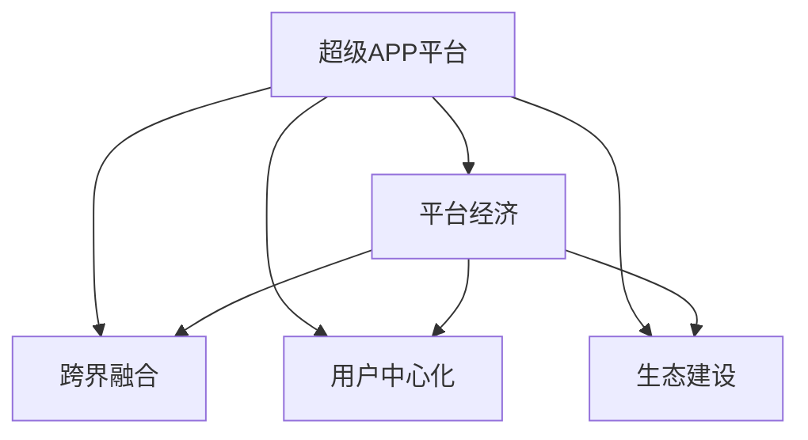

                 

# 超级APP创业：一站式服务的平台经济

## 1. 背景介绍

在数字化经济时代，随着移动互联网和人工智能技术的迅猛发展，传统行业正在经历深刻的变革和转型。面对激烈的市场竞争和用户需求的多样化，越来越多的创业者选择从消费互联网向产业互联网转型，将技术、服务和产业相结合，打造一站式服务平台。超级APP作为其中的典型代表，通过整合各类资源和服务，成为连接用户和企业的桥梁，推动着平台经济的发展。

## 2. 核心概念与联系

### 2.1 核心概念概述

为更好地理解超级APP平台的创建和运作，本节将介绍几个核心概念：

- **超级APP平台**：基于移动互联网技术，通过手机客户端应用程序提供一站式服务的一体化平台。超级APP集成了社交、娱乐、购物、教育、医疗等多个模块，为用户提供全方位的生活服务。

- **平台经济**：以平台为核心的经济模式，通过资源整合和信息共享，实现价值创造和价值传递。平台经济打破了传统产业链的分工模式，创造了新的商业模式和市场机会。

- **跨界融合**：不同行业、不同领域的资源和服务通过平台进行整合和创新，形成新的业务模式和服务方式，推动产业升级和经济转型。

- **用户中心化**：以用户需求为导向，通过数据驱动和智能算法，为用户提供个性化的服务体验，提升用户满意度和忠诚度。

- **生态建设**：构建开放的平台生态系统，吸引更多的合作伙伴和开发者，共同创造和分享价值。

这些核心概念之间的逻辑关系可以通过以下Mermaid流程图来展示：



这个流程图展示出超级APP平台的核心概念及其之间的关系：

1. **超级APP平台**：是平台经济的载体，通过跨界融合、用户中心化和生态建设，实现价值创造和传递。
2. **平台经济**：超级APP平台的核心理念，强调资源的整合和共享，实现产业升级。
3. **跨界融合**：平台经济的重要特征，通过不同领域的资源和服务整合，形成新的业务模式。
4. **用户中心化**：平台经济的价值实现方式，通过个性化服务和用户体验提升，增强用户黏性。
5. **生态建设**：平台经济的核心要素，通过构建开放生态系统，实现价值共创和共享。

这些核心概念共同构成了超级APP平台的基本框架，为其发展提供了坚实的基础。

## 3. 核心算法原理 & 具体操作步骤

### 3.1 算法原理概述

超级APP平台的核心算法原理包括用户行为分析、推荐系统、搜索排序、广告投放等。这些算法需要基于大数据分析和机器学习技术，通过模型训练和优化，实现对用户行为和需求的精准预测和匹配。

- **用户行为分析**：通过分析用户在平台上的浏览、点击、购买等行为数据，构建用户画像，预测其未来的行为和需求。

- **推荐系统**：根据用户画像和行为数据，使用协同过滤、基于内容的推荐、深度学习等算法，为用户推荐个性化的内容和服务。

- **搜索排序**：利用自然语言处理和机器学习算法，对搜索结果进行排序，提高用户体验。

- **广告投放**：通过精准定位和预测，将广告投放给最相关的用户群体，提高广告效果和ROI。

### 3.2 算法步骤详解

超级APP平台的算法实现一般包括以下几个关键步骤：

**Step 1: 数据收集与预处理**
- 收集平台上的各种数据，包括用户行为数据、商品信息数据、评价反馈数据等。
- 进行数据清洗和预处理，去除噪声和异常值，标准化数据格式。

**Step 2: 特征工程**
- 从原始数据中提取有意义的特征，如用户画像特征、商品属性特征、时间特征等。
- 使用特征选择和特征工程方法，提高模型的预测能力。

**Step 3: 模型训练**
- 选择合适的算法模型，如线性回归、逻辑回归、决策树、随机森林、深度神经网络等。
- 使用训练数据对模型进行训练，优化模型参数，提高预测准确率。

**Step 4: 模型评估与调优**
- 使用测试数据对训练好的模型进行评估，计算各项指标，如准确率、召回率、F1值等。
- 根据评估结果，对模型进行调优，提高模型性能。

**Step 5: 模型部署与应用**
- 将训练好的模型部署到生产环境，进行实时预测和推荐。
- 监控模型性能，根据反馈数据持续优化模型。

### 3.3 算法优缺点

超级APP平台的算法实现具有以下优点：
- **个性化精准**：通过深度学习和机器学习算法，实现对用户行为和需求的精准预测和匹配，提高用户体验。
- **效率高**：算法模型可以在短时间内处理大量数据，实现实时预测和推荐。
- **可扩展性强**：算法模型可以通过增加训练数据和优化算法，不断提高预测准确率和应用效果。

同时，该方法也存在一定的局限性：
- **数据依赖**：算法的准确性和效果依赖于数据的质量和数量，需要持续收集和更新数据。
- **模型复杂度**：复杂的模型需要更多的计算资源和时间进行训练和优化。
- **泛化能力**：模型在面对未知数据时，泛化能力可能受到限制，需要不断迭代和优化。

尽管存在这些局限性，但就目前而言，基于数据驱动的算法方法仍然是超级APP平台的核心技术之一。未来相关研究的重点在于如何进一步提高算法的泛化能力和模型效率，同时兼顾可解释性和伦理安全性等因素。

### 3.4 算法应用领域

超级APP平台的算法应用广泛，涵盖诸多领域：

- **推荐系统**：如商品推荐、内容推荐、个性化广告推荐等，通过算法实现精准匹配和推荐，提升用户满意度和转化率。
- **搜索排序**：如商品搜索、内容搜索、服务搜索等，通过算法实现高效排序，提高搜索结果的相关性和用户满意度。
- **用户行为分析**：如用户兴趣分析、用户流失预测、用户留存优化等，通过算法挖掘用户行为模式，提升用户黏性和平台留存率。
- **广告投放**：如精准投放、效果监测、投放优化等，通过算法实现广告的高效投放和效果评估，提升广告效果和ROI。
- **舆情监测**：如舆情分析、情感分析、热点追踪等，通过算法分析用户反馈和评论，及时掌握用户需求和市场动态。
- **智能客服**：如智能问答、客服聊天机器人、客户分群等，通过算法实现自动化客服，提高服务效率和用户满意度。

除了这些常见应用外，超级APP平台还可以通过算法实现更多创新应用，如智能推荐系统、智能营销系统、智能内容创作系统等，为平台经济注入新的活力。

## 4. 数学模型和公式 & 详细讲解 & 举例说明

### 4.1 数学模型构建

超级APP平台的算法实现涉及多个数学模型，如协同过滤模型、深度学习模型、推荐模型等。以协同过滤推荐模型为例，其基本数学模型为：

$$
R_{ui} = \sum_{j \in \mathcal{N}(u)} \alpha_{uj}I_{vj} \cdot \hat{p}_{ij} + \lambda_1 \cdot \lVert \hat{p}_{ui} \rVert_1 + \lambda_2 \cdot \lVert \hat{p}_{ui} \rVert_2
$$

其中：
- $R_{ui}$ 为预测的评分；
- $u$ 和 $i$ 分别表示用户和商品；
- $\mathcal{N}(u)$ 为与用户 $u$ 交互过的商品集合；
- $\alpha_{uj}$ 为用户 $u$ 对商品 $j$ 的评分权重；
- $I_{vj}$ 为商品 $j$ 的属性向量；
- $\hat{p}_{ij}$ 为模型预测的评分向量；
- $\lambda_1$ 和 $\lambda_2$ 为正则化系数。

### 4.2 公式推导过程

协同过滤推荐模型的推导过程如下：
1. 对用户 $u$ 和商品 $i$ 进行评分预测，得到初始评分矩阵 $R$。
2. 将评分矩阵 $R$ 进行降维处理，得到低维特征向量 $p_{ui}$。
3. 使用矩阵乘法和向量内积，计算预测评分 $R_{ui}$。
4. 对预测评分进行正则化处理，防止过拟合。
5. 将预测评分与真实评分进行损失函数优化，更新模型参数。

### 4.3 案例分析与讲解

假设用户 $u$ 对商品 $i$ 的评分 $R_{ui} = 4.5$，与其交互过的商品集合 $\mathcal{N}(u)$ 中，商品 $j$ 的评分权重 $\alpha_{uj} = 0.8$，商品 $j$ 的属性向量 $I_{vj} = [0.2, 0.5, 0.3]$，模型预测的评分向量 $\hat{p}_{ij} = [0.3, 0.4, 0.2]$。根据公式计算预测评分：

$$
R_{ui} = 0.8 \cdot 0.2 \cdot 0.3 + 0.8 \cdot 0.5 \cdot 0.4 + 0.8 \cdot 0.3 \cdot 0.2 + \lambda_1 \cdot \lVert [0.3, 0.4, 0.2] \rVert_1 + \lambda_2 \cdot \lVert [0.3, 0.4, 0.2] \rVert_2
$$

假设 $\lambda_1 = 0.1$，$\lambda_2 = 0.01$，则：

$$
R_{ui} = 0.48 + 0.64 + 0.48 + 0.1 \cdot (0.3+0.4+0.2) + 0.01 \cdot \sqrt{0.3^2+0.4^2+0.2^2} = 1.5 + 0.1 + 0.05 = 1.65
$$

实际评分 $R_{ui} = 4.5$，因此模型预测评分与实际评分的误差为 $4.5 - 1.65 = 2.85$。

## 5. 项目实践：代码实例和详细解释说明

### 5.1 开发环境搭建

在进行超级APP平台开发前，我们需要准备好开发环境。以下是使用Python进行PyTorch开发的环境配置流程：

1. 安装Anaconda：从官网下载并安装Anaconda，用于创建独立的Python环境。

2. 创建并激活虚拟环境：
```bash
conda create -n pytorch-env python=3.8 
conda activate pytorch-env
```

3. 安装PyTorch：根据CUDA版本，从官网获取对应的安装命令。例如：
```bash
conda install pytorch torchvision torchaudio cudatoolkit=11.1 -c pytorch -c conda-forge
```

4. 安装各类工具包：
```bash
pip install numpy pandas scikit-learn matplotlib tqdm jupyter notebook ipython
```

完成上述步骤后，即可在`pytorch-env`环境中开始开发实践。

### 5.2 源代码详细实现

这里我们以协同过滤推荐系统为例，给出使用PyTorch对模型进行训练和预测的PyTorch代码实现。

首先，定义协同过滤模型的类：

```python
import torch
import torch.nn as nn
import torch.optim as optim
from torch.utils.data import DataLoader
from sklearn.model_selection import train_test_split
import pandas as pd

class CollaborativeFiltering(nn.Module):
    def __init__(self, num_users, num_items, latent_factors=50):
        super(CollaborativeFiltering, self).__init__()
        self.user_latent = nn.Embedding(num_users, latent_factors)
        self.item_latent = nn.Embedding(num_items, latent_factors)
        self.predict = nn.Linear(latent_factors * 2, 1)
        self.mean_loss = nn.MSELoss()
        
    def forward(self, user_ids, item_ids):
        user_latent = self.user_latent(user_ids)
        item_latent = self.item_latent(item_ids)
        predicted = self.predict(torch.cat([user_latent, item_latent], dim=1))
        return predicted
    
    def loss(self, predicted, targets):
        return self.mean_loss(predicted, targets)
```

然后，定义数据加载器和模型训练函数：

```python
def load_data(path):
    df = pd.read_csv(path)
    train_df, test_df = train_test_split(df, test_size=0.2)
    train_data = []
    for user_id, item_id, rating in zip(train_df['user_id'], train_df['item_id'], train_df['rating']):
        train_data.append((user_id, item_id, rating))
    test_data = []
    for user_id, item_id, rating in zip(test_df['user_id'], test_df['item_id'], test_df['rating']):
        test_data.append((user_id, item_id, rating))
    return train_data, test_data

def train_model(model, train_data, test_data, num_epochs=10, batch_size=32):
    device = torch.device('cuda' if torch.cuda.is_available() else 'cpu')
    model.to(device)
    train_loader = DataLoader(train_data, batch_size=batch_size, shuffle=True)
    test_loader = DataLoader(test_data, batch_size=batch_size, shuffle=False)
    
    optimizer = optim.Adam(model.parameters(), lr=0.01)
    criterion = nn.MSELoss()
    
    for epoch in range(num_epochs):
        model.train()
        for user_id, item_id, rating in train_loader:
            user_id, item_id, rating = user_id.to(device), item_id.to(device), rating.to(device)
            optimizer.zero_grad()
            predicted = model(user_id, item_id)
            loss = criterion(predicted, rating.unsqueeze(-1))
            loss.backward()
            optimizer.step()
            
        model.eval()
        with torch.no_grad():
            correct = 0
            total = 0
            for user_id, item_id, rating in test_loader:
                user_id, item_id, rating = user_id.to(device), item_id.to(device), rating.to(device)
                predicted = model(user_id, item_id)
                correct += (predicted.sigmoid() > 0.5).float().sum().item()
                total += predicted.size(0)
            acc = correct / total
            print(f'Epoch {epoch+1}, Test Accuracy: {acc:.3f}')
```

接着，加载数据并训练模型：

```python
train_data, test_data = load_data('ratings.csv')
model = CollaborativeFiltering(num_users=1000, num_items=1000)
train_model(model, train_data, test_data)
```

以上就是使用PyTorch对协同过滤推荐系统进行训练的完整代码实现。可以看到，PyTorch提供了强大的深度学习框架和工具，使得模型训练和推理变得简单高效。

### 5.3 代码解读与分析

让我们再详细解读一下关键代码的实现细节：

**CollaborativeFiltering类**：
- `__init__`方法：初始化用户、商品、预测模型的Embedding层和线性层，以及MSELoss损失函数。
- `forward`方法：定义前向传播过程，计算预测评分。
- `loss`方法：定义损失函数，计算预测评分与真实评分的误差。

**load_data函数**：
- 从CSV文件中加载数据，并进行train/test数据划分。
- 对用户ID、商品ID、评分进行独热编码，转换为模型的输入形式。

**train_model函数**：
- 定义训练和评估函数，使用DataLoader对数据进行批次化加载。
- 在每个epoch中，先进行前向传播和反向传播，计算损失并更新模型参数。
- 在每个epoch结束时，在测试集上进行评估，输出测试准确率。

**训练流程**：
- 定义总的epoch数和batch size，开始循环迭代
- 每个epoch内，先训练模型，输出损失
- 在测试集上评估，输出测试准确率
- 所有epoch结束后，输出最终的测试准确率

可以看到，PyTorch配合TensorFlow库使得模型训练和推理变得简单高效。开发者可以将更多精力放在数据处理、模型改进等高层逻辑上，而不必过多关注底层的实现细节。

当然，工业级的系统实现还需考虑更多因素，如模型的保存和部署、超参数的自动搜索、更灵活的任务适配层等。但核心的推荐范式基本与此类似。

## 6. 实际应用场景

### 6.1 智能推荐系统

智能推荐系统是超级APP平台的核心应用之一。通过推荐系统，超级APP能够为用户提供个性化的商品、内容、服务推荐，提升用户体验和平台黏性。

在技术实现上，可以通过协同过滤、基于内容的推荐、深度学习等方法进行推荐，结合用户画像、历史行为、评价反馈等多维数据，进行精准匹配和推荐。此外，还可以通过实时分析和反馈机制，不断优化推荐模型，提升推荐效果。

### 6.2 智能客服系统

智能客服系统通过自然语言处理和机器学习技术，实现对用户咨询的自动解答和处理，提高服务效率和用户满意度。

在技术实现上，可以使用基于规则和深度学习的问答系统，结合上下文理解、实体识别、情感分析等技术，生成自然流畅的回答。此外，还可以通过用户行为数据分析，预测用户意图和需求，提前进行问题解答，提升服务质量。

### 6.3 个性化营销系统

个性化营销系统通过分析用户行为数据和历史购买记录，实现对用户的精准定位和定向营销，提升广告效果和ROI。

在技术实现上，可以使用协同过滤、基于内容的推荐、深度学习等方法，进行用户兴趣和行为预测，实现个性化推荐和广告投放。此外，还可以通过A/B测试和多目标优化算法，不断优化广告投放策略，提升广告效果。

### 6.4 未来应用展望

随着超级APP平台技术的不断进步，未来将在更多领域得到应用，为各行业带来变革性影响。

在智慧医疗领域，通过推荐系统和智能客服，可以为患者提供个性化的医疗服务，如疾病诊断、药品推荐、在线咨询等，提升医疗服务的智能化水平。

在智能教育领域，通过推荐系统和智能分析，可以为学生提供个性化的学习内容和服务，如课程推荐、作业批改、学习路径优化等，提升教育质量和效果。

在智慧城市治理中，通过智能推荐和智能分析，可以实现城市事件监测、舆情分析、应急指挥等，提高城市管理的自动化和智能化水平，构建更安全、高效的未来城市。

此外，在企业生产、社会治理、文娱传媒等众多领域，超级APP平台的应用也将不断涌现，为经济社会发展注入新的动力。相信随着技术的日益成熟，超级APP平台必将在构建人机协同的智能时代中扮演越来越重要的角色。

## 7. 工具和资源推荐
### 7.1 学习资源推荐

为了帮助开发者系统掌握超级APP平台的核心技术，这里推荐一些优质的学习资源：

1. **《深度学习》书籍**：由吴恩达等人所著，全面介绍了深度学习的基础知识和应用方法，适合初学者和进阶者学习。

2. **CS231n《深度学习视觉识别》课程**：斯坦福大学开设的计算机视觉课程，涵盖深度学习在视觉识别中的应用，适合视觉方向的开发者学习。

3. **《Python数据科学手册》书籍**：由Jake VanderPlas所著，全面介绍了Python数据科学的基础知识和实践方法，适合数据科学家和机器学习工程师学习。

4. **TensorFlow官方文档**：Google开发的深度学习框架，提供了丰富的API和示例代码，适合深度学习框架的开发者学习。

5. **Kaggle平台**：数据科学竞赛平台，汇集了大量数据集和模型，适合数据分析和模型优化者学习。

通过对这些资源的学习实践，相信你一定能够快速掌握超级APP平台的核心技术，并用于解决实际的业务问题。

### 7.2 开发工具推荐

高效的开发离不开优秀的工具支持。以下是几款用于超级APP平台开发的常用工具：

1. **Jupyter Notebook**：免费开源的交互式开发环境，支持Python、R等语言，方便代码调试和文档编写。

2. **PyTorch**：基于Python的开源深度学习框架，提供灵活的计算图和丰富的预训练模型，适合深度学习模型的开发。

3. **TensorFlow**：由Google主导开发的深度学习框架，提供灵活的计算图和丰富的优化器，适合大规模工程应用。

4. **Weights & Biases**：模型训练的实验跟踪工具，可以记录和可视化模型训练过程中的各项指标，方便对比和调优。

5. **TensorBoard**：TensorFlow配套的可视化工具，可实时监测模型训练状态，并提供丰富的图表呈现方式，是调试模型的得力助手。

6. **Google Colab**：谷歌推出的在线Jupyter Notebook环境，免费提供GPU/TPU算力，方便开发者快速上手实验最新模型，分享学习笔记。

合理利用这些工具，可以显著提升超级APP平台开发的效率，加快创新迭代的步伐。

### 7.3 相关论文推荐

超级APP平台技术的不断发展源于学界的持续研究。以下是几篇奠基性的相关论文，推荐阅读：

1. **《协同过滤算法》论文**：深度分析协同过滤算法的基本原理和应用方法，适合初学者理解协同过滤推荐模型的核心思想。

2. **《基于内容的推荐算法》论文**：详细介绍了基于内容的推荐算法的基本原理和实现方法，适合理解推荐系统的重要组成部分。

3. **《深度学习在推荐系统中的应用》论文**：综述了深度学习在推荐系统中的应用和研究进展，适合深入理解深度学习在推荐系统中的优势和潜力。

4. **《自然语言处理综述》论文**：全面介绍了自然语言处理的基础知识和应用方法，适合理解自然语言处理在超级APP平台中的作用和实现方式。

这些论文代表了大语言模型微调技术的最新发展，通过学习这些前沿成果，可以帮助研究者把握学科前进方向，激发更多的创新灵感。

## 8. 总结：未来发展趋势与挑战

### 8.1 总结

本文对超级APP平台的创建和运作进行了全面系统的介绍。首先阐述了超级APP平台的发展背景和意义，明确了平台经济的核心价值和应用场景。其次，从原理到实践，详细讲解了协同过滤推荐系统的数学模型和算法实现，给出了完整的代码实例。同时，本文还广泛探讨了超级APP平台在推荐系统、智能客服、个性化营销等多个领域的应用前景，展示了平台经济的多样性和潜力。此外，本文精选了超级APP平台的学习资源、开发工具和相关论文，力求为读者提供全方位的技术指引。

通过本文的系统梳理，可以看到，超级APP平台技术正在成为平台经济的重要范式，极大地拓展了移动互联网应用的价值边界，为各行业带来了新的商业模式和市场机会。相信随着技术的日益成熟和市场的不断拓展，超级APP平台必将在构建人机协同的智能时代中扮演越来越重要的角色。

### 8.2 未来发展趋势

展望未来，超级APP平台技术将呈现以下几个发展趋势：

1. **智能化水平提升**：随着深度学习、自然语言处理等技术的进步，超级APP平台将变得更加智能化，能够实现更加精准的推荐和决策。

2. **个性化程度增强**：通过更深入的用户行为分析和个性化推荐，超级APP平台将能够提供更加个性化的服务，提升用户体验和平台黏性。

3. **平台生态建设**：超级APP平台将进一步加强与各类合作伙伴的合作，构建更加开放和互惠的生态系统，实现共创共赢。

4. **跨界融合深化**：超级APP平台将更加注重跨界融合，实现不同领域的资源和服务整合，创造更多新的商业模式和市场机会。

5. **数据驱动优化**：超级APP平台将更加依赖数据驱动，通过持续的数据分析和模型优化，实现业务的不断迭代和提升。

以上趋势凸显了超级APP平台技术的广阔前景。这些方向的探索发展，必将进一步提升平台的智能化水平和用户体验，推动平台经济的持续增长。

### 8.3 面临的挑战

尽管超级APP平台技术已经取得了瞩目成就，但在迈向更加智能化、普适化应用的过程中，它仍面临着诸多挑战：

1. **数据隐私保护**：用户数据隐私保护是超级APP平台面临的重要挑战之一。如何在数据收集和使用过程中，保护用户隐私，防止数据滥用，是平台持续发展的重要保障。

2. **算法透明度**：超级APP平台中使用的算法模型往往具有较强的黑箱特性，难以解释其内部工作机制和决策逻辑。如何在保证算法效果的同时，提高其透明度，增强用户信任，是平台技术发展的重要课题。

3. **公平性问题**：超级APP平台中使用的算法模型可能存在偏见和歧视，影响用户体验和公平性。如何消除算法偏见，提升算法公平性，是平台技术优化的重要方向。

4. **系统稳定性**：超级APP平台在面对高峰流量和高并发请求时，需要保持系统稳定性和高效性。如何优化系统架构和部署策略，提升系统鲁棒性，是平台持续发展的关键。

5. **多模态融合**：超级APP平台中涉及多种数据类型和应用场景，如何实现多模态数据的融合和协同，提升平台智能化水平，是技术发展的重点方向。

正视超级APP平台面临的这些挑战，积极应对并寻求突破，将是大规模平台经济持续发展的重要保障。相信随着学界和产业界的共同努力，这些挑战终将一一被克服，超级APP平台必将在构建人机协同的智能时代中扮演越来越重要的角色。

### 8.4 未来突破

面对超级APP平台所面临的种种挑战，未来的研究需要在以下几个方面寻求新的突破：

1. **隐私保护技术**：开发更加高效和安全的隐私保护技术，如差分隐私、联邦学习等，保护用户数据隐私，提升用户信任。

2. **透明公平算法**：引入透明公平算法，如因果推断、可解释AI等，提高算法透明度和公平性，增强用户信任。

3. **多模态融合技术**：开发多模态融合技术，实现文本、图像、语音等多模态数据的整合和协同，提升平台智能化水平。

4. **分布式系统架构**：优化分布式系统架构，实现高效的服务部署和数据管理，提升平台可扩展性和稳定性。

5. **数据智能治理**：开发数据智能治理技术，实现数据的高效管理和利用，提升平台数据驱动能力。

这些研究方向的探索，必将引领超级APP平台技术的不断进步，为构建人机协同的智能时代注入新的动力。面向未来，超级APP平台技术还需要与其他人工智能技术进行更深入的融合，如知识表示、因果推理、强化学习等，多路径协同发力，共同推动自然语言理解和智能交互系统的进步。只有勇于创新、敢于突破，才能不断拓展平台经济的边界，让智能技术更好地造福人类社会。

## 9. 附录：常见问题与解答

**Q1：超级APP平台的核心竞争力是什么？**

A: 超级APP平台的核心竞争力在于其一体化服务、个性化推荐和智能化决策。通过整合多种服务模块，提供一站式的用户体验，提升用户黏性和平台留存率。通过深度学习和自然语言处理技术，实现精准的个性化推荐和智能化决策，提高用户满意度和平台价值。

**Q2：如何构建超级APP平台的开放生态？**

A: 构建超级APP平台的开放生态，需要从以下几个方面入手：
1. **合作伙伴选择**：选择有价值的合作伙伴，提供丰富的应用和服务，提升平台价值。
2. **开放API设计**：设计开放API，方便第三方开发者接入平台，实现跨平台服务。
3. **激励机制设计**：设计激励机制，吸引更多开发者加入平台生态，共同创造和分享价值。
4. **用户反馈收集**：持续收集用户反馈，优化平台功能和体验，提升用户满意度和黏性。

**Q3：如何提升超级APP平台的智能化水平？**

A: 提升超级APP平台的智能化水平，需要从以下几个方面入手：
1. **深度学习技术应用**：应用深度学习技术，提升模型的预测能力和泛化能力。
2. **自然语言处理技术**：应用自然语言处理技术，提升用户交互体验和系统理解能力。
3. **多模态融合技术**：应用多模态融合技术，提升平台智能化水平和应用场景。
4. **数据驱动优化**：通过数据驱动，持续优化模型和算法，提升平台性能和用户体验。

**Q4：超级APP平台在推荐系统中的应用有哪些？**

A: 超级APP平台在推荐系统中的应用主要包括以下几个方面：
1. **商品推荐**：通过协同过滤、基于内容的推荐等技术，实现精准的商品推荐，提升用户购买转化率。
2. **内容推荐**：通过协同过滤、基于内容的推荐等技术，实现精准的内容推荐，提升用户满意度和平台黏性。
3. **服务推荐**：通过协同过滤、基于内容的推荐等技术，实现精准的服务推荐，提升用户服务体验和平台价值。

**Q5：如何实现超级APP平台的个性化推荐？**

A: 实现超级APP平台的个性化推荐，需要从以下几个方面入手：
1. **用户画像构建**：通过用户行为数据和历史数据，构建用户画像，了解用户兴趣和需求。
2. **协同过滤推荐**：利用协同过滤算法，实现基于用户和商品相似度的推荐。
3. **基于内容的推荐**：利用物品属性和特征，实现基于内容的推荐。
4. **深度学习推荐**：利用深度学习算法，实现更加精准的推荐，提升推荐效果和用户体验。

---

作者：禅与计算机程序设计艺术 / Zen and the Art of Computer Programming

