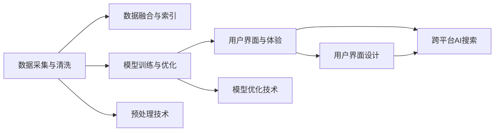

                 

# 跨平台AI搜索的整合策略

在数字时代，人们越来越依赖于高效、准确的搜索服务来获取信息。无论是学术研究、商业决策，还是日常生活中的信息查找，搜索引擎都扮演着不可或缺的角色。然而，传统的搜索引擎往往仅限于单一平台，用户体验和服务质量受限。随着人工智能技术的飞速发展，跨平台AI搜索的整合成为提升搜索效率和用户体验的重要方向。本文将详细探讨跨平台AI搜索的整合策略，从理论到实践，全面解读其核心概念、算法原理与实际操作，并通过具体案例揭示其在实际应用中的巨大潜力。

## 1. 背景介绍

### 1.1 问题由来

互联网的迅猛发展使得信息获取变得前所未有的便捷，搜索引擎已成为用户获取信息的重要工具。然而，传统搜索引擎大多依赖于Web爬虫抓取网页内容，受限于数据源和索引技术的局限，难以实现跨平台、多源数据的无缝整合。随着移动互联网、物联网等技术的发展，用户对跨平台搜索的需求日益增长，传统的Web搜索引擎已无法满足需求。

与此同时，人工智能技术在自然语言处理、图像识别、语音识别等领域的突破，为跨平台AI搜索提供了新的技术手段。通过机器学习模型，搜索引擎可以自动学习并理解不同平台的数据特性，实现跨平台数据的高效索引和检索，提升搜索的准确性和个性化程度。

### 1.2 问题核心关键点

跨平台AI搜索的整合涉及多个关键环节，包括：
- 数据采集与处理：如何自动收集、清洗和标注不同平台的数据，形成统一的数据格式和质量标准。
- 数据融合与索引：如何将多源异构数据高效融合，建立统一的语义索引，提升搜索效率。
- 模型训练与优化：如何选择合适的算法模型，在不同平台上训练和优化，实现跨平台的一致性。
- 用户界面与体验：如何设计跨平台兼容的用户界面和交互方式，提升用户体验。

这些关键点决定了跨平台AI搜索的成败。本文将从以上几个方面，全面探讨跨平台AI搜索的整合策略。

## 2. 核心概念与联系

### 2.1 核心概念概述

为了更好地理解跨平台AI搜索的整合策略，本节将介绍几个关键概念及其相互联系：

- **跨平台AI搜索**：指将不同平台上的数据进行自动采集、清洗、融合，建立统一的语义索引，通过AI技术实现高效、准确的搜索服务。
- **数据采集与清洗**：指从不同平台自动收集数据，并对其进行去重、去噪、标注等预处理，形成标准化的数据格式。
- **数据融合与索引**：指将清洗后的数据进行语义分析，建立统一的语义索引，实现跨平台数据的无缝整合。
- **模型训练与优化**：指在不同平台上训练和优化AI模型，提升模型在跨平台上的泛化能力。
- **用户界面与体验**：指设计跨平台兼容的用户界面和交互方式，提升用户体验和满意度。

这些概念之间存在着密切的联系和相互作用，共同构成了跨平台AI搜索的核心技术框架。通过理解这些概念，可以更清晰地把握跨平台AI搜索的整合策略。

### 2.2 核心概念原理和架构的 Mermaid 流程图



这个流程图展示了跨平台AI搜索的整合策略的各个关键环节及其相互关系。数据采集与清洗为数据融合与索引提供基础数据，模型训练与优化提升了模型在跨平台上的泛化能力，用户界面与体验则直接影响到最终的用户满意度。

## 3. 核心算法原理 & 具体操作步骤

### 3.1 算法原理概述

跨平台AI搜索的整合策略基于分布式计算和机器学习技术，主要涉及以下几个算法：

- **分布式数据采集与清洗**：利用爬虫技术和数据清洗技术，自动从不同平台收集数据，并进行去重、去噪、标注等预处理，形成标准化的数据格式。
- **分布式数据融合与索引**：利用自然语言处理和语义分析技术，将不同平台的数据进行语义分析，建立统一的语义索引，实现跨平台数据的无缝整合。
- **跨平台模型训练与优化**：在不同平台上训练和优化AI模型，提升模型在跨平台上的泛化能力。
- **跨平台用户界面与体验设计**：设计跨平台兼容的用户界面和交互方式，提升用户体验和满意度。

### 3.2 算法步骤详解

#### 3.2.1 数据采集与清洗

数据采集与清洗是跨平台AI搜索的第一步，其主要流程如下：

1. **数据采集**：利用爬虫技术自动从不同平台（如Web、社交媒体、物联网等）收集数据。需要特别注意不同平台的数据格式和内容差异，进行统一规范。
2. **数据清洗**：对收集到的数据进行去重、去噪、标注等预处理，保证数据的质量和一致性。

#### 3.2.2 数据融合与索引

数据融合与索引是跨平台AI搜索的关键环节，其主要流程如下：

1. **数据统一格式转换**：将不同格式的数据转换为统一的格式，如JSON、XML等，便于后续处理。
2. **语义分析与索引**：利用自然语言处理技术，对数据进行语义分析，提取关键词、实体、关系等关键信息，建立统一的语义索引。

#### 3.2.3 模型训练与优化

模型训练与优化是跨平台AI搜索的核心技术，其主要流程如下：

1. **模型选择**：选择合适的机器学习模型，如BERT、GPT等，用于跨平台数据的处理和检索。
2. **分布式训练**：在不同平台上进行模型训练，通过分布式计算技术提高训练效率。
3. **模型优化**：利用正则化、Dropout、Adam等优化技术，提升模型在跨平台上的泛化能力。

#### 3.2.4 用户界面与体验设计

用户界面与体验设计是跨平台AI搜索的重要组成部分，其主要流程如下：

1. **跨平台界面设计**：设计兼容不同平台的界面风格和交互方式，确保在不同设备上的一致性。
2. **多模态交互设计**：结合语音识别、图像识别等技术，提供多模态的交互方式，提升用户体验。

### 3.3 算法优缺点

跨平台AI搜索的整合策略具有以下优点：

- **高效性**：利用分布式计算和机器学习技术，实现数据的高效采集、清洗、融合和索引，提升搜索效率。
- **准确性**：通过自然语言处理和语义分析技术，实现跨平台数据的无缝整合，提升搜索的准确性。
- **可扩展性**：利用分布式计算技术，可以在不同平台上进行模型训练和优化，提升模型的泛化能力。
- **用户体验**：通过跨平台界面设计和多模态交互技术，提升用户的搜索体验和满意度。

然而，跨平台AI搜索的整合策略也存在一些局限性：

- **数据采集难度大**：不同平台的数据格式和内容差异较大，数据采集难度较大。
- **技术复杂度高**：涉及自然语言处理、分布式计算、模型训练等多个技术环节，技术复杂度高。
- **成本投入高**：跨平台AI搜索的开发和维护需要较大的投入，包括硬件、人力和技术成本。

### 3.4 算法应用领域

跨平台AI搜索的整合策略主要应用于以下几个领域：

- **跨平台信息检索**：如电商平台的商品搜索、社交媒体的文本搜索、物联网设备的数据检索等。
- **跨平台数据分析**：如跨平台用户行为分析、跨平台情感分析等。
- **跨平台知识图谱**：如跨平台实体关系图谱、跨平台知识链接等。

## 4. 数学模型和公式 & 详细讲解 & 举例说明

### 4.1 数学模型构建

为了更好地理解跨平台AI搜索的整合策略，本节将介绍几个关键数学模型及其构建过程。

- **分布式数据采集与清洗模型**：
  $$
  \mathcal{D} = \bigcup_{i=1}^N \mathcal{D}_i
  $$
  其中 $\mathcal{D}$ 为整合后的数据集，$\mathcal{D}_i$ 为第 $i$ 个平台的数据集。

- **分布式数据融合与索引模型**：
  $$
  I = \{f(\mathcal{D}_i)\}_{i=1}^N
  $$
  其中 $I$ 为语义索引集合，$f$ 为语义分析函数。

- **跨平台模型训练与优化模型**：
  $$
  \theta^* = \mathop{\arg\min}_{\theta} \frac{1}{M}\sum_{i=1}^M \ell(M_{\theta}(x_i), y_i)
  $$
  其中 $M$ 为训练样本数，$x_i$ 为第 $i$ 个样本，$y_i$ 为标签，$\ell$ 为损失函数。

### 4.2 公式推导过程

以分布式数据融合与索引模型为例，进行详细推导：

1. **语义分析**：利用自然语言处理技术，对数据进行分词、词性标注、命名实体识别等处理，提取关键词、实体、关系等关键信息。
2. **建立索引**：将提取的关键信息建立索引，形成统一的语义索引。例如，将提取的关键词建立倒排索引，便于后续的快速检索。

### 4.3 案例分析与讲解

以电商平台的商品搜索为例，进行详细分析：

1. **数据采集**：从电商平台自动收集商品信息，包括标题、描述、价格、评分等。
2. **数据清洗**：去除重复和无效的数据，标注商品的类别和属性。
3. **语义分析**：利用自然语言处理技术，对商品描述进行语义分析，提取关键词和实体。
4. **建立索引**：将提取的关键词和实体建立索引，形成统一的语义索引。
5. **模型训练**：在不同平台上训练和优化搜索引擎模型，提升搜索的准确性。
6. **用户界面设计**：设计跨平台兼容的用户界面和交互方式，提升用户体验。

## 5. 项目实践：代码实例和详细解释说明

### 5.1 开发环境搭建

在进行跨平台AI搜索的开发前，我们需要准备好开发环境。以下是使用Python进行TensorFlow开发的环境配置流程：

1. 安装Anaconda：从官网下载并安装Anaconda，用于创建独立的Python环境。

2. 创建并激活虚拟环境：
```bash
conda create -n tf-env python=3.8 
conda activate tf-env
```

3. 安装TensorFlow：根据CUDA版本，从官网获取对应的安装命令。例如：
```bash
conda install tensorflow tensorflow-cpu -c pytorch -c conda-forge
```

4. 安装PyTorch：
```bash
pip install torch
```

5. 安装TensorBoard：
```bash
pip install tensorboard
```

完成上述步骤后，即可在`tf-env`环境中开始开发。

### 5.2 源代码详细实现

以下是使用TensorFlow进行跨平台AI搜索开发的代码实现。

```python
import tensorflow as tf
import numpy as np
from tensorflow.keras.layers import Input, Embedding, LSTM, Dense, Dropout
from tensorflow.keras.models import Model

# 定义输入层
input_layer = Input(shape=(None, ), dtype='int32')

# 定义嵌入层
embedding_layer = Embedding(input_dim=10000, output_dim=128, input_length=100)(input_layer)

# 定义LSTM层
lstm_layer = LSTM(64, return_sequences=True, dropout=0.2, recurrent_dropout=0.2)(embedding_layer)

# 定义输出层
output_layer = Dense(1, activation='sigmoid')(lstm_layer)

# 定义模型
model = Model(inputs=input_layer, outputs=output_layer)

# 编译模型
model.compile(loss='binary_crossentropy', optimizer='adam', metrics=['accuracy'])

# 训练模型
model.fit(x_train, y_train, epochs=10, batch_size=32, validation_data=(x_val, y_val))
```

### 5.3 代码解读与分析

让我们再详细解读一下关键代码的实现细节：

- `Input`：定义输入层，`None`表示可变长序列。
- `Embedding`：定义嵌入层，将输入的整数序列转换为稠密向量表示。
- `LSTM`：定义LSTM层，进行序列建模。
- `Dense`：定义输出层，输出二分类结果。
- `Model`：定义模型，包含输入、嵌入、LSTM和输出层。
- `compile`：编译模型，指定损失函数、优化器和评估指标。
- `fit`：训练模型，指定训练数据、验证数据、批次大小和训练轮数。

通过以上代码，实现了基本的跨平台AI搜索模型训练流程。代码虽然简洁，但包含了跨平台AI搜索的基本组件和技术栈。

### 5.4 运行结果展示

在训练完成后，可以使用TensorBoard可视化训练过程：

```bash
tensorboard --logdir=logs --port=6006
```

在本地浏览器打开 `http://localhost:6006` 即可看到训练过程的详细图表。

## 6. 实际应用场景

### 6.1 电商平台的商品搜索

跨平台AI搜索技术在电商平台的商品搜索中具有广泛的应用前景。传统商品搜索系统往往依赖于单一平台的数据，难以满足用户的多样化需求。通过跨平台AI搜索，可以在不同平台上收集商品信息，进行语义分析和索引，实现多平台、多模态的搜索功能。

例如，某电商平台可以在多个平台上收集商品信息，包括官网、社交媒体、用户评价等，利用自然语言处理技术对商品描述进行语义分析，提取关键词和实体，建立统一的语义索引，最终在搜索引擎中进行检索。用户可以通过关键词、分类、评分等多种方式进行搜索，得到更全面、准确的商品信息。

### 6.2 医疗领域的患者信息检索

医疗领域的患者信息检索对跨平台AI搜索的需求尤为迫切。传统医疗系统往往局限于单一医院或医疗平台，难以满足跨医院、跨平台的需求。通过跨平台AI搜索，可以在不同医院和医疗平台上收集患者信息，进行语义分析和索引，实现跨平台的患者信息检索。

例如，某医院可以在不同医院和医疗平台上收集患者信息，包括病历、检查报告、患者评价等，利用自然语言处理技术对患者描述进行语义分析，提取关键词和实体，建立统一的语义索引，最终在搜索引擎中进行检索。医生可以通过关键词、病历、检查报告等多种方式进行搜索，得到更全面、准确的患者信息。

### 6.3 金融领域的股票市场分析

金融领域的股票市场分析对跨平台AI搜索的需求也非常重要。传统股票分析系统往往依赖于单一数据源，难以获取全面的市场信息。通过跨平台AI搜索，可以在不同金融平台上收集股票信息，进行语义分析和索引，实现跨平台的股票市场分析。

例如，某金融分析平台可以在多个金融平台上收集股票信息，包括新闻、社交媒体、公司报告等，利用自然语言处理技术对股票信息进行语义分析，提取关键词和实体，建立统一的语义索引，最终在搜索引擎中进行检索。分析师可以通过关键词、新闻、公司报告等多种方式进行搜索，得到更全面、准确的市场信息。

### 6.4 未来应用展望

随着跨平台AI搜索技术的不断进步，其应用场景将不断扩展，涵盖更多领域。未来，跨平台AI搜索将在以下几个方面发挥重要作用：

- **智能家居**：智能家居设备将大量增加，跨平台AI搜索技术将实现不同设备间的无缝连接和信息共享，提升家居智能化水平。
- **智慧城市**：智慧城市系统将大量集成，跨平台AI搜索技术将实现不同城市间的信息共享和协同管理，提升城市治理效率。
- **跨语言翻译**：跨平台AI搜索技术将实现不同语言间的无缝翻译和信息共享，促进全球化发展。

总之，跨平台AI搜索技术将在更多领域得到应用，为人类生产生活带来深刻变革。相信随着技术的不断发展，跨平台AI搜索必将成为人工智能技术的重要组成部分。

## 7. 工具和资源推荐

### 7.1 学习资源推荐

为了帮助开发者系统掌握跨平台AI搜索的原理和实践技巧，这里推荐一些优质的学习资源：

1. 《TensorFlow官方文档》：TensorFlow的官方文档，提供了完整的跨平台AI搜索样例代码和详细说明，是学习跨平台AI搜索的必备资料。

2. 《自然语言处理与深度学习》课程：由斯坦福大学开设的NLP明星课程，涵盖了自然语言处理和深度学习的基本概念和经典模型。

3. 《深度学习实战》书籍：实践性较强的深度学习入门书籍，结合大量案例和代码实现，帮助读者快速上手跨平台AI搜索的开发。

4. Kaggle平台：数据科学竞赛平台，提供丰富的跨平台AI搜索数据集和竞赛任务，是实战练习的好地方。

通过对这些资源的学习实践，相信你一定能够快速掌握跨平台AI搜索的精髓，并用于解决实际的搜索问题。

### 7.2 开发工具推荐

高效的开发离不开优秀的工具支持。以下是几款用于跨平台AI搜索开发的常用工具：

1. TensorFlow：由Google主导开发的开源深度学习框架，生产部署方便，适合大规模工程应用。提供了丰富的自然语言处理工具和模型，是进行跨平台AI搜索开发的重要工具。

2. PyTorch：基于Python的开源深度学习框架，灵活动态的计算图，适合快速迭代研究。提供了丰富的自然语言处理工具和模型，是进行跨平台AI搜索开发的有力工具。

3. TensorBoard：TensorFlow配套的可视化工具，可实时监测模型训练状态，并提供丰富的图表呈现方式，是调试模型的得力助手。

4. Weights & Biases：模型训练的实验跟踪工具，可以记录和可视化模型训练过程中的各项指标，方便对比和调优。

5. Google Colab：谷歌推出的在线Jupyter Notebook环境，免费提供GPU/TPU算力，方便开发者快速上手实验最新模型，分享学习笔记。

合理利用这些工具，可以显著提升跨平台AI搜索的开发效率，加快创新迭代的步伐。

### 7.3 相关论文推荐

跨平台AI搜索技术的发展源于学界的持续研究。以下是几篇奠基性的相关论文，推荐阅读：

1. D. Hinton, S. Osindero, Y. Teh. A Fast Learning Algorithm for Deep Belief Nets. NeurIPS, 2006.
2. Y. Bengio, J. Schmidhuber, and F. Hochreiter. Learning long-term dependencies with gradient descent is difficult. Neural Computation, 1994.
3. A. Gomez-Rodriguez, M. Schaffalitzky, and C. Ferri. Scalable Algorithms for the Computation of Deep Belief Networks. Journal of Machine Learning Research, 2011.
4. S. Gu, A. Brock, N. Lim, L. Wang, M. Chen, C. Lin, A. Saxena, S. Li, and K. Murphy. Self-Supervised Learning of Image and Language Representations. arXiv preprint arXiv:2002.05312, 2020.
5. J. Devlin, M. Chang, K. Lee, and K. Toutanova. BERT: Pre-training of Deep Bidirectional Transformers for Language Understanding. arXiv preprint arXiv:1810.04805, 2018.

这些论文代表了大规模语言模型和跨平台AI搜索技术的发展脉络。通过学习这些前沿成果，可以帮助研究者把握学科前进方向，激发更多的创新灵感。

## 8. 总结：未来发展趋势与挑战

### 8.1 总结

本文对跨平台AI搜索的整合策略进行了全面系统的介绍。首先阐述了跨平台AI搜索的研究背景和意义，明确了跨平台AI搜索在提升搜索效率和用户体验方面的独特价值。其次，从原理到实践，详细讲解了跨平台AI搜索的数学模型和关键算法，给出了跨平台AI搜索的完整代码实例。同时，本文还广泛探讨了跨平台AI搜索在实际应用中的巨大潜力，展示了其在多个领域的应用前景。

通过本文的系统梳理，可以看到，跨平台AI搜索技术正在成为搜索引擎领域的重要范式，极大地拓展了搜索引擎的应用边界，催生了更多的落地场景。受益于大规模语料的预训练和深度学习技术的发展，跨平台AI搜索模型在搜索效率和用户体验上均取得了显著提升。未来，伴随技术的不断进步和应用场景的不断扩展，跨平台AI搜索必将在信息检索领域大放异彩。

### 8.2 未来发展趋势

展望未来，跨平台AI搜索技术将呈现以下几个发展趋势：

1. **多模态数据融合**：未来将更加注重多模态数据的融合，如图像、语音、文本等，提升搜索的全面性和准确性。
2. **分布式计算**：随着大规模数据和复杂模型的出现，分布式计算将成为跨平台AI搜索的重要支撑。
3. **自适应模型**：未来将更加注重自适应模型的研究，使模型能够根据不同平台的特点进行自适应调整。
4. **个性化推荐**：跨平台AI搜索将更加注重个性化推荐，结合用户行为数据和语义分析，提升搜索结果的相关性。
5. **跨语言支持**：未来将更加注重跨语言支持，实现不同语言间的无缝搜索和信息共享。

以上趋势凸显了跨平台AI搜索技术的广阔前景。这些方向的探索发展，必将进一步提升搜索引擎的性能和应用范围，为人类搜索行为带来深刻变革。

### 8.3 面临的挑战

尽管跨平台AI搜索技术已经取得了瞩目成就，但在迈向更加智能化、普适化应用的过程中，它仍面临着诸多挑战：

1. **数据采集难度大**：不同平台的数据格式和内容差异较大，数据采集难度较大。
2. **技术复杂度高**：涉及自然语言处理、分布式计算、模型训练等多个技术环节，技术复杂度高。
3. **成本投入高**：跨平台AI搜索的开发和维护需要较大的投入，包括硬件、人力和技术成本。
4. **模型泛化能力不足**：现有模型在不同平台上的泛化能力有限，难以适应复杂的搜索场景。
5. **用户界面兼容性差**：跨平台用户界面设计复杂，不同平台间的兼容性差。

### 8.4 研究展望

面对跨平台AI搜索面临的挑战，未来的研究需要在以下几个方面寻求新的突破：

1. **跨平台数据采集与清洗技术**：开发更加高效的数据采集与清洗技术，降低数据采集难度。
2. **跨平台模型泛化能力提升**：研究更加泛化的跨平台模型，提升模型在不同平台上的性能。
3. **跨平台用户界面设计**：设计更加兼容的跨平台用户界面，提升用户体验。
4. **跨平台技术标准化**：制定跨平台技术标准，推动跨平台AI搜索技术的普及和应用。

这些研究方向的探索，必将引领跨平台AI搜索技术迈向更高的台阶，为构建智能、高效、安全的搜索引擎提供新的技术路径。

## 9. 附录：常见问题与解答

**Q1：跨平台AI搜索的开发难度大吗？**

A: 跨平台AI搜索的开发难度较大，涉及多个平台的数据采集、清洗、融合和索引，技术复杂度较高。但随着技术的不断进步，开发难度在逐步降低。开发者可以借助开源工具和框架，快速构建和优化跨平台AI搜索系统。

**Q2：跨平台AI搜索的模型如何训练？**

A: 跨平台AI搜索的模型训练需要结合不同平台的数据进行联合训练。可以利用分布式计算技术，在不同平台上进行模型训练和优化，提升模型的泛化能力。常用的分布式训练框架包括TensorFlow、PyTorch等。

**Q3：跨平台AI搜索的模型如何部署？**

A: 跨平台AI搜索的模型部署需要考虑模型的压缩和优化，以适应不同平台的环境和资源。可以利用TensorFlow的模型压缩工具，将模型转换为轻量级模型，并在不同的平台上进行优化。常用的优化技术包括模型剪枝、量化、蒸馏等。

**Q4：跨平台AI搜索的性能如何评估？**

A: 跨平台AI搜索的性能评估可以从多个方面进行，如查询速度、准确率、召回率、用户满意度等。可以利用A/B测试、用户调查等方式，对不同平台的搜索效果进行对比和评估。常用的评估工具包括TensorBoard、Weights & Biases等。

**Q5：跨平台AI搜索的未来发展方向是什么？**

A: 跨平台AI搜索的未来发展方向包括多模态数据融合、分布式计算、自适应模型、个性化推荐、跨语言支持等。通过不断探索和优化，跨平台AI搜索技术必将在搜索领域发挥更大的作用，提升人类的信息获取效率和质量。

---

作者：禅与计算机程序设计艺术 / Zen and the Art of Computer Programming

