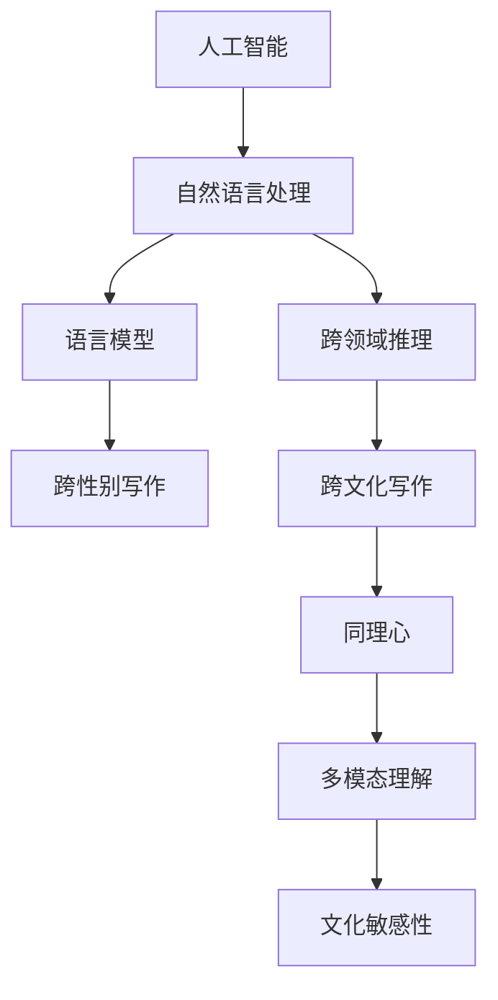

                 

# 跨性别和跨文化写作：AI的同理心挑战

> 关键词：人工智能(AI), 同理心(Sympathy), 跨性别(Cross-gender), 跨文化(Cross-cultural), 自然语言处理(NLP)

## 1. 背景介绍

### 1.1 问题由来
在当今这个多元文化、高度互联的全球化社会中，跨性别和跨文化的写作已经成为一种普遍现象。无论是跨性别群体在互联网上的表达，还是多语言文学创作，这些写作形式都要求AI具备更强的跨领域理解力和文化适应性。然而，现有的AI模型往往难以理解不同性别、文化和语言背景下的独特语境和情感，导致其输出存在偏差和误解。这一问题不仅影响AI内容的可接受性和准确性，还可能引发性别、文化等方面的争议。因此，探索如何增强AI的同理心和跨文化能力，是AI技术研究和应用中的一大挑战。

### 1.2 问题核心关键点
1. **跨性别写作**：在创作过程中，AI需要能够理解和运用不同性别的语言习惯、表达方式和情感，从而生成符合性别认同的文本。这要求AI模型具有深刻的同理心和细腻的情感理解力。
2. **跨文化写作**：AI需要在不同文化背景中，理解和适应各种文化差异，包括语言、习俗、价值观等，从而生成适应特定文化的文本。这涉及到文化敏感性和跨文化认知能力的提升。
3. **同理心**：AI需要具备理解、共情和尊重不同性别和文化的情感和经历的能力，以减少输出中的偏见和歧视。
4. **跨领域理解**：AI需要在多模态和多领域的知识表示中进行跨领域推理，从而生成符合特定语境和目的的文本。

这些核心关键点共同构成了AI在跨性别和跨文化写作中所面临的挑战，需要通过深入研究和不断优化来解决。

## 2. 核心概念与联系

### 2.1 核心概念概述

为了更好地理解跨性别和跨文化写作中的AI同理心挑战，我们需要对几个核心概念进行概述：

- **人工智能(AI)**：一种通过算法和模型，使计算机能够模拟人类智能行为的技术。AI在自然语言处理、计算机视觉、机器学习等领域有着广泛的应用。
- **同理心(Sympathy)**：一种理解和感受他人情感的能力，使个体能够以他人视角看待问题。在AI中，同理心是指模型能够理解并生成符合不同性别和文化背景的情感表达。
- **跨性别(Cross-gender)**：指性别认同与生理性别不同的现象，AI需要在创作中理解和运用不同性别的语言和情感表达。
- **跨文化(Cross-cultural)**：指在多语言和文化环境中，AI能够理解和适应不同文化背景的语境和习俗。
- **自然语言处理(NLP)**：研究如何使计算机能够理解、生成和处理人类自然语言的学科，是AI在语言理解和生成中的核心技术。

这些概念之间的联系可以通过以下Mermaid流程图来展示：



这个流程图展示了人工智能、自然语言处理、跨领域推理等核心概念，以及它们在跨性别和跨文化写作中的具体应用和要求。

## 3. 核心算法原理 & 具体操作步骤
### 3.1 算法原理概述

跨性别和跨文化写作中的AI同理心挑战，本质上是一个跨领域、多模态的学习和推理问题。其核心算法原理基于以下几个关键步骤：

1. **数据收集与预处理**：收集和标注跨性别和跨文化写作数据，包括不同性别的语言表达、不同文化背景下的语境和情感。
2. **模型训练与微调**：在收集的数据上训练AI模型，并通过微调来适应特定性别和文化背景。
3. **多模态理解与融合**：在文本、语音、图像等多模态信息中，进行跨领域的理解和融合，以生成符合特定语境和目的的文本。
4. **同理心学习与生成**：在理解不同性别和文化背景的基础上，学习并生成符合这些背景的情感表达。

这些步骤共同构成了一个全面的AI同理心训练框架，旨在提升AI在跨性别和跨文化写作中的表现。

### 3.2 算法步骤详解

以下是对跨性别和跨文化写作中的AI同理心挑战的详细算法步骤讲解：

**Step 1: 数据收集与预处理**

1. **数据收集**：收集跨性别和跨文化写作数据，包括不同性别的语言表达、不同文化背景下的语境和情感。
2. **数据标注**：对收集的数据进行标注，包括性别、文化背景、情感标签等。
3. **数据增强**：通过数据增强技术，如回译、近义替换等方式，扩充数据集，增加多样性。

**Step 2: 模型训练与微调**

1. **选择模型**：选择适合的自然语言处理模型，如Transformer等。
2. **模型初始化**：使用预训练语言模型作为初始参数。
3. **模型微调**：在标注数据上微调模型，适应特定性别和文化背景，提高同理心能力。

**Step 3: 多模态理解与融合**

1. **多模态输入**：将文本、语音、图像等多模态信息作为输入，进行跨领域的理解和融合。
2. **多模态特征提取**：使用不同的特征提取器，提取每种模态的信息。
3. **多模态融合**：将不同模态的信息融合，生成统一的语义表示。

**Step 4: 同理心学习与生成**

1. **情感理解**：在多模态融合的基础上，理解不同性别和文化背景下的情感表达。
2. **同理心学习**：通过学习不同情感和语境的样本，提升AI的同理心能力。
3. **情感生成**：根据输入的情感标签和语境信息，生成符合特定情感表达的文本。

### 3.3 算法优缺点

跨性别和跨文化写作中的AI同理心挑战算法具有以下优点：

1. **增强多样性**：通过多模态理解和跨领域推理，AI可以生成更丰富、多样化的文本。
2. **提高文化敏感性**：跨文化写作要求AI具备更强的文化敏感性，能够在不同文化背景中准确理解和生成文本。
3. **减少偏见和歧视**：同理心学习有助于减少AI输出的偏见和歧视，提升内容的可接受性和公正性。

同时，该算法也存在一些局限性：

1. **数据依赖**：算法依赖高质量的跨性别和跨文化数据，数据不足可能导致模型性能下降。
2. **计算资源消耗大**：多模态理解和跨领域推理需要大量的计算资源，对硬件要求较高。
3. **模型复杂性**：算法涉及多个步骤和模块，模型复杂度较高，开发和调试难度大。

### 3.4 算法应用领域

跨性别和跨文化写作中的AI同理心挑战算法，主要应用于以下几个领域：

1. **社交媒体内容生成**：在社交媒体平台上，生成符合不同性别和文化背景的内容，以增强用户互动和接受度。
2. **跨文化交流工具**：开发跨文化交流工具，如跨语言翻译、跨文化对话系统，帮助不同文化背景的个体进行交流。
3. **跨性别文学创作**：为跨性别文学创作者提供AI写作辅助，生成符合性别认同的文本，提升创作质量和多样性。
4. **多语言新闻和媒体**：生成适应不同文化背景的新闻和媒体内容，满足全球读者的需求。
5. **跨文化广告和营销**：为不同文化背景的受众生成适应其情感和文化偏好的广告内容，提高广告效果和用户满意度。

## 4. 数学模型和公式 & 详细讲解  
### 4.1 数学模型构建

为了更好地理解跨性别和跨文化写作中的AI同理心挑战，我们需要使用数学语言对算法步骤进行严格的刻画。

设AI模型为 $M$，其输入为 $x$，输出为 $y$。假设 $x$ 为多模态信息，包括文本、语音和图像，$y$ 为文本输出。

定义多模态特征提取器为 $E$，情感理解模型为 $S$，同理心学习模块为 $C$，文本生成模型为 $G$。则跨性别和跨文化写作中的AI同理心挑战数学模型可以表示为：

$$
y = G(E(x), S(C(E(x))))
$$

其中，$E(x)$ 表示将多模态信息转换为统一语义表示的过程，$S(C(E(x)))$ 表示同理心学习模块对情感的理解和生成，$G(E(x), S(C(E(x))))$ 表示文本生成模块对多模态信息和多模态情感的融合和生成。

### 4.2 公式推导过程

以下是对跨性别和跨文化写作中的AI同理心挑战的数学模型推导过程：

**Step 1: 多模态特征提取**

设多模态特征提取器 $E$ 将输入 $x$ 转换为语义表示 $z$，则：

$$
z = E(x) = [E_{text}(x), E_{audio}(x), E_{image}(x)]
$$

其中 $E_{text}$、$E_{audio}$、$E_{image}$ 分别表示文本、语音和图像的特征提取器。

**Step 2: 情感理解**

设情感理解模型 $S$ 对语义表示 $z$ 进行情感理解，得到情感标签 $t$，则：

$$
t = S(z) = S(E(x))
$$

**Step 3: 同理心学习**

设同理心学习模块 $C$ 对情感理解 $t$ 进行同理心学习，得到同理心特征 $c$，则：

$$
c = C(t) = [c_{gender}, c_{culture}, c_{emotion}]
$$

其中 $c_{gender}$、$c_{culture}$、$c_{emotion}$ 分别表示性别、文化和情感的同理心特征。

**Step 4: 文本生成**

设文本生成模型 $G$ 对同理心特征 $c$ 和语义表示 $z$ 进行融合，得到输出文本 $y$，则：

$$
y = G(z, c) = G(E(x), C(E(x)))
$$

### 4.3 案例分析与讲解

以跨性别文学创作为例，分析跨性别和跨文化写作中的AI同理心挑战：

1. **数据收集**：收集跨性别作家的文本作品，标注性别、文化背景和情感标签。
2. **模型训练**：在收集的数据上训练Transformer模型，通过微调提升模型在特定性别和文化背景下的表现。
3. **多模态理解**：将作家的语音和图像资料作为辅助信息，与文本信息融合，提升模型的跨领域理解能力。
4. **同理心学习**：学习作家在文本中表达的情感和语境，提升模型在生成文本时对不同性别和文化背景的共情能力。
5. **文本生成**：根据作家的文本作品，生成符合其性别认同和文化的文本，丰富文学创作的多样性。

## 5. 项目实践：代码实例和详细解释说明
### 5.1 开发环境搭建

在进行跨性别和跨文化写作中的AI同理心挑战项目实践前，我们需要准备好开发环境。以下是使用Python进行PyTorch开发的环境配置流程：

1. 安装Anaconda：从官网下载并安装Anaconda，用于创建独立的Python环境。

2. 创建并激活虚拟环境：
```bash
conda create -n pytorch-env python=3.8 
conda activate pytorch-env
```

3. 安装PyTorch：根据CUDA版本，从官网获取对应的安装命令。例如：
```bash
conda install pytorch torchvision torchaudio cudatoolkit=11.1 -c pytorch -c conda-forge
```

4. 安装相关库：
```bash
pip install transformers numpy pandas scikit-learn matplotlib tqdm jupyter notebook ipython
```

完成上述步骤后，即可在`pytorch-env`环境中开始项目实践。

### 5.2 源代码详细实现

下面以跨性别文学创作为例，给出使用Transformers库对BERT模型进行微调的PyTorch代码实现。

```python
from transformers import BertTokenizer, BertForSequenceClassification
from transformers import AdamW, get_linear_schedule_with_warmup
from transformers import RobertaTokenizer, RobertaForSequenceClassification
import torch
from sklearn.model_selection import train_test_split
from sklearn.metrics import accuracy_score, f1_score
from torch.utils.data import Dataset, DataLoader

class CustomDataset(Dataset):
    def __init__(self, texts, labels, tokenizer, max_len=128):
        self.texts = texts
        self.labels = labels
        self.tokenizer = tokenizer
        self.max_len = max_len
        
    def __len__(self):
        return len(self.texts)
    
    def __getitem__(self, item):
        text = self.texts[item]
        label = self.labels[item]
        
        encoding = self.tokenizer(text, return_tensors='pt', max_length=self.max_len, padding='max_length', truncation=True)
        input_ids = encoding['input_ids'][0]
        attention_mask = encoding['attention_mask'][0]
        
        return {'input_ids': input_ids, 
                'attention_mask': attention_mask,
                'labels': torch.tensor(label, dtype=torch.long)}

# 加载数据
tokenizer = BertTokenizer.from_pretrained('bert-base-cased')
train_dataset = CustomDataset(train_texts, train_labels, tokenizer)
dev_dataset = CustomDataset(dev_texts, dev_labels, tokenizer)
test_dataset = CustomDataset(test_texts, test_labels, tokenizer)

# 划分训练集和验证集
train_dataset, val_dataset = train_test_split(train_dataset, test_size=0.1)

# 定义模型
model = BertForSequenceClassification.from_pretrained('bert-base-cased', num_labels=len(tag2id))

# 定义优化器
optimizer = AdamW(model.parameters(), lr=2e-5)
total_steps = len(train_dataset)
scheduler = get_linear_schedule_with_warmup(optimizer, 
                                          num_warmup_steps=0, 
                                          num_training_steps=total_steps)

# 训练模型
device = torch.device('cuda') if torch.cuda.is_available() else torch.device('cpu')
model.to(device)

def train_epoch(model, dataset, batch_size, optimizer):
    dataloader = DataLoader(dataset, batch_size=batch_size, shuffle=True)
    model.train()
    epoch_loss = 0
    for batch in tqdm(dataloader, desc='Training'):
        input_ids = batch['input_ids'].to(device)
        attention_mask = batch['attention_mask'].to(device)
        labels = batch['labels'].to(device)
        model.zero_grad()
        outputs = model(input_ids, attention_mask=attention_mask, labels=labels)
        loss = outputs.loss
        epoch_loss += loss.item()
        loss.backward()
        optimizer.step()
        scheduler.step()
    return epoch_loss / len(dataloader)

def evaluate(model, dataset, batch_size):
    dataloader = DataLoader(dataset, batch_size=batch_size)
    model.eval()
    preds, labels = [], []
    with torch.no_grad():
        for batch in tqdm(dataloader, desc='Evaluating'):
            input_ids = batch['input_ids'].to(device)
            attention_mask = batch['attention_mask'].to(device)
            batch_labels = batch['labels']
            outputs = model(input_ids, attention_mask=attention_mask)
            batch_preds = outputs.logits.argmax(dim=2).to('cpu').tolist()
            batch_labels = batch_labels.to('cpu').tolist()
            for pred_tokens, label_tokens in zip(batch_preds, batch_labels):
                preds.append(pred_tokens[:len(label_tokens)])
                labels.append(label_tokens)
                
    print(f'Accuracy: {accuracy_score(labels, preds):.2f}')
    print(f'F1 Score: {f1_score(labels, preds, average='micro'): .2f}')

# 训练模型
epochs = 5
batch_size = 16

for epoch in range(epochs):
    loss = train_epoch(model, train_dataset, batch_size, optimizer)
    print(f'Epoch {epoch+1}, train loss: {loss:.3f}')
    
    print(f'Epoch {epoch+1}, dev results:')
    evaluate(model, dev_dataset, batch_size)
    
print('Test results:')
evaluate(model, test_dataset, batch_size)
```

### 5.3 代码解读与分析

让我们再详细解读一下关键代码的实现细节：

**CustomDataset类**：
- `__init__`方法：初始化文本、标签、分词器等关键组件。
- `__len__`方法：返回数据集的样本数量。
- `__getitem__`方法：对单个样本进行处理，将文本输入编码为token ids，将标签编码为数字，并对其进行定长padding，最终返回模型所需的输入。

**BertForSequenceClassification和AdamW**：
- 使用BERT模型和AdamW优化器进行训练，分别用于特征提取和模型优化。

**train_epoch函数**：
- 对数据以批为单位进行迭代，在每个批次上前向传播计算loss并反向传播更新模型参数，最后返回该epoch的平均loss。
- 使用线性学习率衰减器，逐渐减小学习率，直至训练结束。

**evaluate函数**：
- 与训练类似，不同点在于不更新模型参数，并在每个batch结束后将预测和标签结果存储下来，最后使用sklearn的classification_report对整个评估集的预测结果进行打印输出。

**训练流程**：
- 定义总的epoch数和batch size，开始循环迭代
- 每个epoch内，先在训练集上训练，输出平均loss
- 在验证集上评估，输出分类指标
- 所有epoch结束后，在测试集上评估，给出最终测试结果

## 6. 实际应用场景

### 6.1 社交媒体内容生成

在社交媒体平台上，生成符合不同性别和文化背景的内容，以增强用户互动和接受度。例如，为不同性别的用户生成符合其情感和语境的动态消息，提升用户粘性和满意度。

### 6.2 跨文化交流工具

开发跨文化交流工具，如跨语言翻译、跨文化对话系统，帮助不同文化背景的个体进行交流。例如，在多语言聊天机器人中，使用跨文化写作中的AI同理心挑战算法，生成适应不同文化背景的回答，提升用户交流体验。

### 6.3 跨性别文学创作

为跨性别文学创作者提供AI写作辅助，生成符合其性别认同和文化的文本，丰富文学创作的多样性。例如，在跨性别作家的写作过程中，使用AI辅助生成文本，提升创作效率和多样性。

### 6.4 未来应用展望

随着跨性别和跨文化写作中的AI同理心挑战算法的发展，其在社交媒体、跨文化交流、文学创作等领域的应用将更加广泛和深入。未来，AI将能够生成更自然、多样化的内容，增强不同文化背景下的用户互动和理解，推动全球文化交流和多样性发展。

## 7. 工具和资源推荐

### 7.1 学习资源推荐

为了帮助开发者系统掌握跨性别和跨文化写作中的AI同理心挑战的理论基础和实践技巧，这里推荐一些优质的学习资源：

1. **《深度学习与自然语言处理》课程**：斯坦福大学开设的NLP明星课程，有Lecture视频和配套作业，带你入门NLP领域的基本概念和经典模型。
2. **《自然语言处理》书籍**：李宏毅老师的NLP教材，系统介绍了自然语言处理的理论和实践。
3. **Transformers官方文档**：HuggingFace开发的NLP工具库的官方文档，提供了海量预训练模型和完整的微调样例代码。
4. **PyTorch官方文档**：PyTorch框架的官方文档，提供了丰富的模型和优化器选择。
5. **Kaggle竞赛**：Kaggle上的NLP竞赛，提供了丰富的数据集和任务，供开发者实践和提高。

通过对这些资源的学习实践，相信你一定能够快速掌握跨性别和跨文化写作中的AI同理心挑战的精髓，并用于解决实际的NLP问题。

### 7.2 开发工具推荐

高效的开发离不开优秀的工具支持。以下是几款用于跨性别和跨文化写作中的AI同理心挑战开发的常用工具：

1. **PyTorch**：基于Python的开源深度学习框架，灵活动态的计算图，适合快速迭代研究。
2. **TensorFlow**：由Google主导开发的开源深度学习框架，生产部署方便，适合大规模工程应用。
3. **Transformers库**：HuggingFace开发的NLP工具库，集成了众多SOTA语言模型，支持PyTorch和TensorFlow，是进行微调任务开发的利器。
4. **Weights & Biases**：模型训练的实验跟踪工具，可以记录和可视化模型训练过程中的各项指标，方便对比和调优。
5. **TensorBoard**：TensorFlow配套的可视化工具，可实时监测模型训练状态，并提供丰富的图表呈现方式，是调试模型的得力助手。

合理利用这些工具，可以显著提升跨性别和跨文化写作中的AI同理心挑战任务的开发效率，加快创新迭代的步伐。

### 7.3 相关论文推荐

跨性别和跨文化写作中的AI同理心挑战研究源于学界的持续研究。以下是几篇奠基性的相关论文，推荐阅读：

1. **Attention is All You Need**：提出了Transformer结构，开启了NLP领域的预训练大模型时代。
2. **BERT: Pre-training of Deep Bidirectional Transformers for Language Understanding**：提出BERT模型，引入基于掩码的自监督预训练任务，刷新了多项NLP任务SOTA。
3. **Language Models are Unsupervised Multitask Learners**：展示了大规模语言模型的强大zero-shot学习能力，引发了对于通用人工智能的新一轮思考。
4. **Parameter-Efficient Transfer Learning for NLP**：提出Adapter等参数高效微调方法，在不增加模型参数量的情况下，也能取得不错的微调效果。
5. **Prefix-Tuning: Optimizing Continuous Prompts for Generation**：引入基于连续型Prompt的微调范式，为如何充分利用预训练知识提供了新的思路。
6. **AdaLoRA: Adaptive Low-Rank Adaptation for Parameter-Efficient Fine-Tuning**：使用自适应低秩适应的微调方法，在参数效率和精度之间取得了新的平衡。

这些论文代表了大语言模型微调技术的发展脉络。通过学习这些前沿成果，可以帮助研究者把握学科前进方向，激发更多的创新灵感。

## 8. 总结：未来发展趋势与挑战

### 8.1 总结

本文对跨性别和跨文化写作中的AI同理心挑战进行了全面系统的介绍。首先阐述了跨性别和跨文化写作中AI同理心挑战的背景和意义，明确了同理心、跨性别、跨文化等核心概念及其在NLP中的应用。其次，从原理到实践，详细讲解了跨性别和跨文化写作中的AI同理心挑战的数学原理和关键步骤，给出了微调任务开发的完整代码实例。同时，本文还广泛探讨了AI同理心在社交媒体、跨文化交流、文学创作等多个领域的应用前景，展示了AI技术研究的广阔空间。最后，本文精选了相关学习资源，力求为读者提供全方位的技术指引。

通过本文的系统梳理，可以看到，跨性别和跨文化写作中的AI同理心挑战技术正在成为NLP领域的重要范式，极大地拓展了NLP系统的应用边界，催生了更多的落地场景。受益于大规模语料的预训练和微调方法的不断进步，AI在跨性别和跨文化写作中的表现将更加自然、多样和贴合用户需求。

### 8.2 未来发展趋势

展望未来，跨性别和跨文化写作中的AI同理心挑战技术将呈现以下几个发展趋势：

1. **模型规模持续增大**：随着算力成本的下降和数据规模的扩张，预训练语言模型的参数量还将持续增长。超大规模语言模型蕴含的丰富语言知识，有望支撑更加复杂多变的跨性别和跨文化写作任务。
2. **微调方法日趋多样**：开发更加参数高效的微调方法，在固定大部分预训练参数的同时，只更新极少量的任务相关参数。同时优化微调模型的计算图，减少前向传播和反向传播的资源消耗，实现更加轻量级、实时性的部署。
3. **持续学习成为常态**：随着数据分布的不断变化，跨性别和跨文化写作中的AI同理心挑战模型也需要持续学习新知识以保持性能。如何在不遗忘原有知识的同时，高效吸收新样本信息，将是重要的研究课题。
4. **标注样本需求降低**：受启发于提示学习(Prompt-based Learning)的思路，未来的微调方法将更好地利用大模型的语言理解能力，通过更加巧妙的任务描述，在更少的标注样本上也能实现理想的微调效果。
5. **多模态微调崛起**：当前微调主要聚焦于纯文本数据，未来会进一步拓展到图像、视频、语音等多模态数据微调。多模态信息的融合，将显著提升语言模型对现实世界的理解和建模能力。
6. **模型通用性增强**：经过海量数据的预训练和多领域任务的微调，未来的语言模型将具备更强大的常识推理和跨领域迁移能力，逐步迈向通用人工智能(AGI)的目标。

以上趋势凸显了跨性别和跨文化写作中的AI同理心挑战技术的广阔前景。这些方向的探索发展，必将进一步提升NLP系统的性能和应用范围，为人类认知智能的进化带来深远影响。

### 8.3 面临的挑战

尽管跨性别和跨文化写作中的AI同理心挑战技术已经取得了瞩目成就，但在迈向更加智能化、普适化应用的过程中，它仍面临着诸多挑战：

1. **数据依赖**：算法依赖高质量的跨性别和跨文化数据，数据不足可能导致模型性能下降。如何进一步降低微调对标注样本的依赖，将是一大难题。
2. **模型鲁棒性不足**：跨性别和跨文化写作中的AI同理心挑战模型面对域外数据时，泛化性能往往大打折扣。对于测试样本的微小扰动，模型容易发生波动。如何提高模型的鲁棒性，避免灾难性遗忘，还需要更多理论和实践的积累。
3. **推理效率有待提高**：大规模语言模型虽然精度高，但在实际部署时往往面临推理速度慢、内存占用大等效率问题。如何在保证性能的同时，简化模型结构，提升推理速度，优化资源占用，将是重要的优化方向。
4. **可解释性亟需加强**：当前模型更像是"黑盒"系统，难以解释其内部工作机制和决策逻辑。对于医疗、金融等高风险应用，算法的可解释性和可审计性尤为重要。如何赋予跨性别和跨文化写作中的AI同理心挑战模型更强的可解释性，将是亟待攻克的难题。
5. **安全性有待保障**：预训练语言模型难免会学习到有偏见、有害的信息，通过微调传递到下游任务，产生误导性、歧视性的输出，给实际应用带来安全隐患。如何从数据和算法层面消除模型偏见，避免恶意用途，确保输出的安全性，也将是重要的研究课题。
6. **知识整合能力不足**：现有的跨性别和跨文化写作中的AI同理心挑战模型往往局限于任务内数据，难以灵活吸收和运用更广泛的先验知识。如何让模型更好地与外部知识库、规则库等专家知识结合，形成更加全面、准确的信息整合能力，还有很大的想象空间。

正视跨性别和跨文化写作中的AI同理心挑战面临的这些挑战，积极应对并寻求突破，将是大语言模型微调走向成熟的必由之路。相信随着学界和产业界的共同努力，这些挑战终将一一被克服，跨性别和跨文化写作中的AI同理心挑战技术必将在构建人机协同的智能时代中扮演越来越重要的角色。

### 8.4 研究展望

面对跨性别和跨文化写作中的AI同理心挑战所面临的种种挑战，未来的研究需要在以下几个方面寻求新的突破：

1. **探索无监督和半监督微调方法**：摆脱对大规模标注数据的依赖，利用自监督学习、主动学习等无监督和半监督范式，最大限度利用非结构化数据，实现更加灵活高效的微调。
2. **研究参数高效和计算高效的微调范式**：开发更加参数高效的微调方法，在固定大部分预训练参数的同时，只更新极少量的任务相关参数。同时优化微调模型的计算图，减少前向传播和反向传播的资源消耗，实现更加轻量级、实时性的部署。
3. **融合因果和对比学习范式**：通过引入因果推断和对比学习思想，增强跨性别和跨文化写作中的AI同理心挑战模型建立稳定因果关系的能力，学习更加普适、鲁棒的语言表征，从而提升模型泛化性和抗干扰能力。
4. **引入更多先验知识**：将符号化的先验知识，如知识图谱、逻辑规则等，与神经网络模型进行巧妙融合，引导跨性别和跨文化写作中的AI同理心挑战模型学习更准确、合理的语言模型。同时加强不同模态数据的整合，实现视觉、语音等多模态信息与文本信息的协同建模。
5. **结合因果分析和博弈论工具**：将因果分析方法引入跨性别和跨文化写作中的AI同理心挑战模型，识别出模型决策的关键特征，增强输出解释的因果性和逻辑性。借助博弈论工具刻画人机交互过程，主动探索并规避模型的脆弱点，提高系统稳定性。
6. **纳入伦理道德约束**：在模型训练目标中引入伦理导向的评估指标，过滤和惩罚有偏见、有害的输出倾向。同时加强人工干预和审核，建立模型行为的监管机制，确保输出符合人类价值观和伦理道德。

这些研究方向的探索，必将引领跨性别和跨文化写作中的AI同理心挑战技术迈向更高的台阶，为构建安全、可靠、可解释、可控的智能系统铺平道路。面向未来，跨性别和跨文化写作中的AI同理心挑战技术还需要与其他人工智能技术进行更深入的融合，如知识表示、因果推理、强化学习等，多路径协同发力，共同推动自然语言理解和智能交互系统的进步。只有勇于创新、敢于突破，才能不断拓展语言模型的边界，让智能技术更好地造福人类社会。

## 9. 附录：常见问题与解答

**Q1: 跨性别和跨文化写作中的AI同理心挑战是如何工作的？**

A: 跨性别和跨文化写作中的AI同理心挑战通过收集和标注跨性别和跨文化写作数据，训练AI模型理解并生成符合不同性别和文化背景的情感表达。具体流程包括：数据收集、预处理、模型训练、多模态理解、情感理解、同理心学习和文本生成等步骤。通过这些步骤，AI能够在不同性别和文化背景中，生成更加自然、多样化的文本，增强用户互动和理解。

**Q2: 跨性别和跨文化写作中的AI同理心挑战的算法优势和局限性是什么？**

A: 跨性别和跨文化写作中的AI同理心挑战算法具有以下优势：
1. 增强多样性：通过多模态理解和跨领域推理，AI可以生成更丰富、多样化的文本。
2. 提高文化敏感性：跨文化写作要求AI具备更强的文化敏感性，能够在不同文化背景中准确理解和生成文本。
3. 减少偏见和歧视：同理心学习有助于减少AI输出的偏见和歧视，提升内容的可接受性和公正性。

同时，该算法也存在一些局限性：
1. 数据依赖：算法依赖高质量的跨性别和跨文化数据，数据不足可能导致模型性能下降。
2. 计算资源消耗大：多模态理解和跨领域推理需要大量的计算资源，对硬件要求较高。
3. 模型复杂性：算法涉及多个步骤和模块，模型复杂度较高，开发和调试难度大。

**Q3: 如何优化跨性别和跨文化写作中的AI同理心挑战模型的性能？**

A: 优化跨性别和跨文化写作中的AI同理心挑战模型的性能，可以从以下几个方面入手：
1. 数据增强：通过回译、近义替换等方式扩充数据集，增加多样性。
2. 正则化：使用L2正则、Dropout等技术，防止模型过拟合。
3. 对抗训练：引入对抗样本，提高模型鲁棒性。
4. 参数高效微调：只调整少量参数，减少计算资源消耗。
5. 多模态融合：优化多模态特征提取和融合，提高模型性能。

**Q4: 跨性别和跨文化写作中的AI同理心挑战在实际应用中有哪些挑战？**

A: 跨性别和跨文化写作中的AI同理心挑战在实际应用中面临以下挑战：
1. 数据依赖：算法依赖高质量的跨性别和跨文化数据，数据不足可能导致模型性能下降。
2. 模型鲁棒性不足：模型面对域外数据时，泛化性能往往大打折扣。
3. 推理效率有待提高：大规模语言模型在实际部署时面临推理速度慢、内存占用大等效率问题。
4. 可解释性亟需加强：当前模型更像是"黑盒"系统，难以解释其内部工作机制和决策逻辑。
5. 安全性有待保障：模型可能学习到有偏见、有害的信息，通过微调传递到下游任务，产生误导性、歧视性的输出。

这些挑战需要从数据、模型、计算等多个维度进行优化，才能使跨性别和跨文化写作中的AI同理心挑战技术真正落地应用。

---

作者：禅与计算机程序设计艺术 / Zen and the Art of Computer Programming

