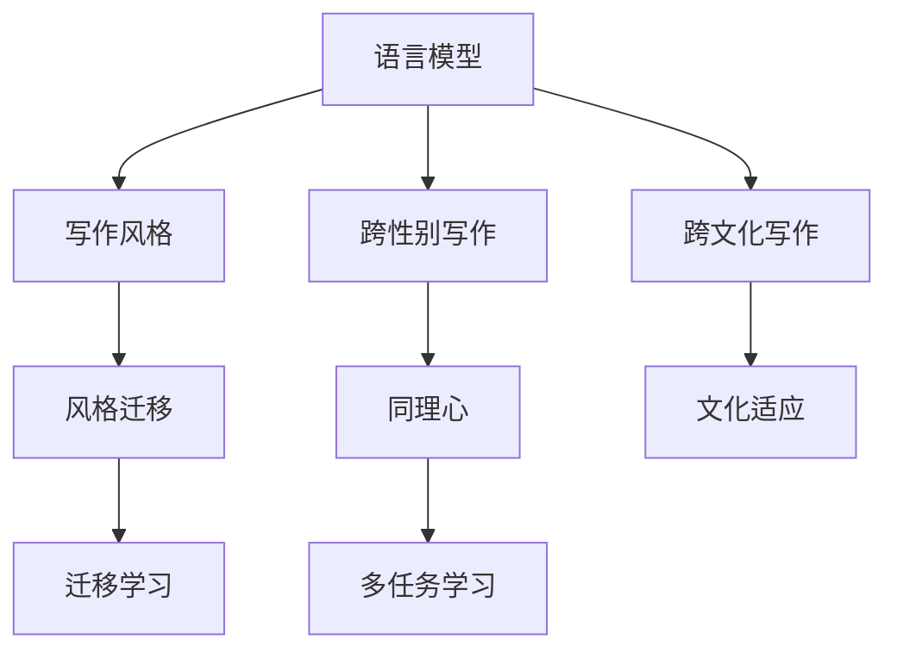

                 

# 跨性别和跨文化写作：AI的同理心挑战

> 关键词：人工智能,写作风格,跨性别,跨文化,同理心,语言模型

## 1. 背景介绍

### 1.1 问题由来
随着人工智能技术的快速发展，自然语言处理（NLP）领域取得了显著进展，尤其是在文本生成、文本风格迁移、写作风格转换等方面。然而，当前的AI写作模型还存在诸多局限性，尤其是对跨性别和跨文化的理解和生成能力。如何使AI在写作时具有更强的同理心，更好地理解和表达不同性别、文化背景下的情感和体验，成为亟待解决的重要问题。

### 1.2 问题核心关键点
跨性别和跨文化写作的挑战主要集中在以下几个方面：

1. **文化多样性**：不同文化背景下的语言表达习惯、社会规范、情感表达方式存在显著差异，AI模型需要具备足够的文化敏感性和适应性。
2. **性别认同**：性别认同对个人身份、行为方式、语言风格等方面有深刻影响，AI写作模型需要能够准确理解并表达不同性别身份的独特性。
3. **情感共鸣**：写作不仅仅是语言的堆砌，更是情感的传递。AI模型需要具备同理心，能够理解和表达复杂的人类情感。
4. **语言模型局限**：现有的预训练语言模型主要基于大规模中性语料进行训练，对性别和文化的理解往往有所欠缺。
5. **偏见和歧视**：AI模型在训练过程中可能学习到偏见，对某些群体的表达存在歧视，需要在模型设计和训练过程中加以避免。

### 1.3 问题研究意义
研究跨性别和跨文化写作的AI模型，对于提升AI写作的自然度、多样性和包容性，具有重要意义：

1. **自然度提升**：使AI写作更接近人类自然语言表达，提升写作质量。
2. **多样化增强**：增加AI写作的多样性，丰富写作风格和表达方式。
3. **包容性提升**：更好地理解和表达不同性别、文化背景下的情感和体验，促进社会包容。
4. **人机交互改善**：使AI写作更具同理心，改善人机交互体验。
5. **语言模型改进**：推动预训练语言模型的改进，使其更全面、准确地理解各种语言特征和文化背景。

## 2. 核心概念与联系

### 2.1 核心概念概述

为了更好地理解跨性别和跨文化写作的AI模型，本节将介绍几个关键概念及其之间的联系：

1. **写作风格（Writing Style）**：指文本的语气、用词、句式等特征的综合体现，不同作家或时代有不同的写作风格。
2. **跨性别写作（Transgender Writing）**：涉及使用不同于生理性别的语言和表达方式，反映了个人对性别的自我认同和表达。
3. **跨文化写作（Intercultural Writing）**：涉及不同文化背景下的语言使用和表达，包括对语言习惯、社会规范、文化元素的考量。
4. **同理心（Empathy）**：指AI模型理解和共情人类情感的能力，能够根据上下文理解他人的情感状态。
5. **语言模型（Language Model）**：指基于大规模文本数据进行训练的模型，能够预测下一个单词或句子，用于文本生成和风格转换等任务。
6. **迁移学习（Transfer Learning）**：指将一个领域的知识迁移到另一个领域，提升新任务上的性能。
7. **多任务学习（Multi-task Learning）**：指同时进行多个任务的学习，提升模型在多个相关任务上的性能。

这些概念之间存在密切的联系，通过迁移学习、多任务学习等技术，使语言模型能够更好地理解和生成跨性别和跨文化背景下的文本。

### 2.2 核心概念原理和架构的 Mermaid 流程图



### 2.3 核心概念原理与架构的详细说明

1. **语言模型**：基于大规模文本数据进行预训练，学习语言的通用特征，能够生成连贯、符合语法规范的文本。
2. **写作风格**：通过迁移学习和多任务学习，使语言模型能够生成具有特定风格的文本。例如，通过迁移学习将一个作者的写作风格应用于另一个作者的文本。
3. **跨性别写作**：通过对文本进行性别标识符识别和风格迁移，使语言模型能够生成符合不同性别身份的文本。例如，将一个男性的文本风格转换为女性的风格。
4. **跨文化写作**：通过文化适应和多任务学习，使语言模型能够生成符合不同文化背景的文本。例如，将一个文化背景的文本转换为另一个文化背景的文本。
5. **同理心**：通过情感理解和生成模型的训练，使语言模型能够生成具有情感共鸣的文本。例如，能够理解并生成不同情感背景下的文本。
6. **风格迁移**：通过迁移学习，将一种风格的文本转换为另一种风格的文本。例如，将一段正式的文本转换为口语化的文本。
7. **文化适应**：通过多任务学习，使语言模型能够适应不同文化背景的文本。例如，将一段美国的文本转换为中国的文本。

这些概念和技术相互交织，共同构成了跨性别和跨文化写作的AI模型架构。

## 3. 核心算法原理 & 具体操作步骤

### 3.1 算法原理概述

跨性别和跨文化写作的AI模型，通常采用基于迁移学习和多任务学习的方法。其核心思想是：利用预训练语言模型的通用特征，通过迁移学习和多任务学习，使其具备跨性别和跨文化的理解和生成能力。

具体而言，算法流程如下：

1. **数据收集与预处理**：收集跨性别和跨文化的文本数据，并进行清洗、标注等预处理。
2. **模型选择与初始化**：选择合适的预训练语言模型，如GPT、BERT等，作为初始化参数。
3. **迁移学习**：通过迁移学习，将预训练语言模型的通用特征应用于特定任务，如性别或文化适应。
4. **多任务学习**：通过多任务学习，同时训练模型在不同性别、文化背景下的写作风格和情感表达。
5. **模型微调**：在特定任务上进行微调，以提高模型的性能和效果。

### 3.2 算法步骤详解

**Step 1: 数据收集与预处理**

1. **数据收集**：收集跨性别和跨文化的文本数据，包括不同性别、不同文化背景下的日记、文章、评论等。可以使用公开数据集或自行收集。
2. **数据清洗**：去除噪音数据，如拼写错误、重复内容等，确保数据质量。
3. **数据标注**：为数据集进行性别和文化背景的标注，便于后续模型的训练。

**Step 2: 模型选择与初始化**

1. **模型选择**：选择合适的预训练语言模型，如GPT、BERT等，作为初始化参数。
2. **模型初始化**：将预训练模型的权重作为初始权重，用于后续训练。

**Step 3: 迁移学习**

1. **性别适应**：通过迁移学习，使模型能够适应不同性别的写作风格。例如，将一个男性的写作风格应用于女性的文本。
2. **文化适应**：通过迁移学习，使模型能够适应不同文化背景的文本。例如，将一个文化背景的文本转换为另一个文化背景的文本。
3. **情感共鸣**：通过迁移学习，使模型能够理解并生成不同情感背景下的文本。例如，理解并生成悲伤、喜悦、愤怒等情感的文本。

**Step 4: 多任务学习**

1. **性别与文化适应**：通过多任务学习，同时训练模型在不同性别、文化背景下的写作风格。
2. **情感表达**：通过多任务学习，使模型能够同时理解并生成不同情感背景下的文本。
3. **风格迁移**：通过多任务学习，将一种风格的文本转换为另一种风格的文本。例如，将正式的文本转换为口语化的文本。

**Step 5: 模型微调**

1. **微调目标**：根据特定任务的需求，进行模型微调，以提高模型在特定任务上的性能。
2. **微调方法**：使用较小的学习率，对模型的顶层或特定层进行微调，以避免破坏预训练权重。
3. **评估与优化**：在验证集上评估模型性能，根据评估结果调整超参数，优化模型。

### 3.3 算法优缺点

**优点**：

1. **提升写作自然度**：通过迁移学习和多任务学习，使AI写作更接近人类自然语言表达。
2. **增强写作多样性**：通过风格迁移和文化适应，增加AI写作的多样性。
3. **促进社会包容**：通过跨性别和跨文化写作，促进社会的包容性和多样性。
4. **改善人机交互**：通过同理心和情感共鸣，改善人机交互体验。
5. **推动语言模型改进**：通过跨性别和跨文化写作的训练，推动预训练语言模型的改进。

**缺点**：

1. **数据依赖**：数据质量和数量对模型的效果有重要影响，数据收集和标注工作量大。
2. **模型复杂性**：多任务学习和迁移学习增加了模型的复杂性，训练和优化难度较大。
3. **偏见与歧视**：模型可能学习到偏见和歧视，需要在训练过程中加以避免。
4. **文化冲突**：不同文化之间的差异可能导致文化冲突，需谨慎处理。
5. **理解深度不足**：AI模型可能无法完全理解人类情感和体验的复杂性，存在一定局限性。

### 3.4 算法应用领域

跨性别和跨文化写作的AI模型，可以应用于以下几个领域：

1. **教育**：用于编写跨性别和跨文化背景下的教学材料，提升学生的文化敏感性和同理心。
2. **医疗**：用于编写跨性别和跨文化背景下的患者交流材料，提高医患沟通效果。
3. **企业**：用于编写跨性别和跨文化背景下的营销材料，提升品牌多样性和包容性。
4. **文学创作**：用于创作跨性别和跨文化背景下的文学作品，丰富文学多样性。
5. **社交媒体**：用于生成跨性别和跨文化背景下的社交媒体内容，提升社区多样性。
6. **旅游**：用于编写跨文化背景下的旅游指南，提升旅游体验。

## 4. 数学模型和公式 & 详细讲解 & 举例说明

### 4.1 数学模型构建

假设预训练语言模型为 $M_{\theta}$，其中 $\theta$ 为预训练得到的模型参数。收集跨性别和跨文化的文本数据集 $D=\{(x_i,y_i)\}_{i=1}^N$，其中 $x_i$ 为输入文本，$y_i$ 为性别或文化背景的标注。

定义模型 $M_{\theta}$ 在输入 $x$ 上的输出为 $p(y|x)$，表示在输入 $x$ 条件下，输出 $y$ 的概率分布。微调的目标是最大化在数据集 $D$ 上的条件概率：

$$
\max_{\theta} \frac{1}{N}\sum_{i=1}^N \log p(y_i|x_i)
$$

通过最大化条件概率，使模型在特定任务上的输出尽可能接近真实标注，从而提高模型的性能。

### 4.2 公式推导过程

以性别适应为例，假设输入文本 $x$ 包含性别标识符，如“他”、“她”、“它”等。性别标注 $y$ 为二分类问题，如“男性”、“女性”。则模型在输入 $x$ 上的输出为：

$$
p(y|x) = \frac{\exp[\log p(y|x)]}{\sum_{y' \in \mathcal{Y}} \exp[\log p(y'|x)]}
$$

其中 $\log p(y|x)$ 为模型在输入 $x$ 条件下，输出 $y$ 的概率对数。通过最大化 $\log p(y|x)$，使模型在输入 $x$ 条件下，输出 $y$ 的概率尽可能接近真实标注 $y_i$。

在训练过程中，使用交叉熵损失函数：

$$
L(y,\hat{y}) = -\sum_{i=1}^N [y_i\log \hat{y}_i + (1-y_i)\log (1-\hat{y}_i)]
$$

其中 $\hat{y}$ 为模型的预测输出。通过最小化损失函数，使模型在特定任务上的预测输出尽可能接近真实标注。

### 4.3 案例分析与讲解

以跨性别写作为例，假设输入文本 $x$ 包含性别标识符，如“他”、“她”、“它”等。性别标注 $y$ 为二分类问题，如“男性”、“女性”。则模型在输入 $x$ 上的输出为：

$$
p(y|x) = \frac{\exp[\log p(y|x)]}{\sum_{y' \in \mathcal{Y}} \exp[\log p(y'|x)]}
$$

其中 $\log p(y|x)$ 为模型在输入 $x$ 条件下，输出 $y$ 的概率对数。通过最大化 $\log p(y|x)$，使模型在输入 $x$ 条件下，输出 $y$ 的概率尽可能接近真实标注 $y_i$。

在训练过程中，使用交叉熵损失函数：

$$
L(y,\hat{y}) = -\sum_{i=1}^N [y_i\log \hat{y}_i + (1-y_i)\log (1-\hat{y}_i)]
$$

其中 $\hat{y}$ 为模型的预测输出。通过最小化损失函数，使模型在特定任务上的预测输出尽可能接近真实标注。

以生成女性写作风格为例，假设有两个文本：

1. 男性写作：“我喜欢打篮球。”
2. 女性写作：“我喜欢看篮球比赛。”

通过迁移学习，将男性写作转换为女性写作，步骤如下：

1. **数据预处理**：将男性写作转换为女性写作，即将“我喜欢打篮球”转换为“我喜欢看篮球比赛”。
2. **模型选择与初始化**：选择合适的预训练语言模型，如GPT、BERT等，作为初始化参数。
3. **模型微调**：在特定任务上进行微调，以提高模型在女性写作风格上的性能。
4. **评估与优化**：在验证集上评估模型性能，根据评估结果调整超参数，优化模型。

## 5. 项目实践：代码实例和详细解释说明

### 5.1 开发环境搭建

在进行跨性别和跨文化写作的AI模型实践前，我们需要准备好开发环境。以下是使用Python进行PyTorch开发的环境配置流程：

1. 安装Anaconda：从官网下载并安装Anaconda，用于创建独立的Python环境。

2. 创建并激活虚拟环境：
```bash
conda create -n pytorch-env python=3.8 
conda activate pytorch-env
```

3. 安装PyTorch：根据CUDA版本，从官网获取对应的安装命令。例如：
```bash
conda install pytorch torchvision torchaudio cudatoolkit=11.1 -c pytorch -c conda-forge
```

4. 安装Transformers库：
```bash
pip install transformers
```

5. 安装各类工具包：
```bash
pip install numpy pandas scikit-learn matplotlib tqdm jupyter notebook ipython
```

完成上述步骤后，即可在`pytorch-env`环境中开始实践。

### 5.2 源代码详细实现

下面我们以跨性别写作任务为例，给出使用Transformers库对BERT模型进行性别适应的PyTorch代码实现。

首先，定义性别适应的数据处理函数：

```python
from transformers import BertTokenizer
from torch.utils.data import Dataset
import torch

class GenderDataset(Dataset):
    def __init__(self, texts, tags, tokenizer, max_len=128):
        self.texts = texts
        self.tags = tags
        self.tokenizer = tokenizer
        self.max_len = max_len
        
    def __len__(self):
        return len(self.texts)
    
    def __getitem__(self, item):
        text = self.texts[item]
        tags = self.tags[item]
        
        encoding = self.tokenizer(text, return_tensors='pt', max_length=self.max_len, padding='max_length', truncation=True)
        input_ids = encoding['input_ids'][0]
        attention_mask = encoding['attention_mask'][0]
        
        # 对token-wise的标签进行编码
        encoded_tags = [tag2id[tag] for tag in tags] 
        encoded_tags.extend([tag2id['O']] * (self.max_len - len(encoded_tags)))
        labels = torch.tensor(encoded_tags, dtype=torch.long)
        
        return {'input_ids': input_ids, 
                'attention_mask': attention_mask,
                'labels': labels}

# 标签与id的映射
tag2id = {'O': 0, 'M': 1, 'F': 2}
id2tag = {v: k for k, v in tag2id.items()}

# 创建dataset
tokenizer = BertTokenizer.from_pretrained('bert-base-cased')

train_dataset = GenderDataset(train_texts, train_tags, tokenizer)
dev_dataset = GenderDataset(dev_texts, dev_tags, tokenizer)
test_dataset = GenderDataset(test_texts, test_tags, tokenizer)
```

然后，定义模型和优化器：

```python
from transformers import BertForTokenClassification, AdamW

model = BertForTokenClassification.from_pretrained('bert-base-cased', num_labels=len(tag2id))

optimizer = AdamW(model.parameters(), lr=2e-5)
```

接着，定义训练和评估函数：

```python
from torch.utils.data import DataLoader
from tqdm import tqdm
from sklearn.metrics import classification_report

device = torch.device('cuda') if torch.cuda.is_available() else torch.device('cpu')
model.to(device)

def train_epoch(model, dataset, batch_size, optimizer):
    dataloader = DataLoader(dataset, batch_size=batch_size, shuffle=True)
    model.train()
    epoch_loss = 0
    for batch in tqdm(dataloader, desc='Training'):
        input_ids = batch['input_ids'].to(device)
        attention_mask = batch['attention_mask'].to(device)
        labels = batch['labels'].to(device)
        model.zero_grad()
        outputs = model(input_ids, attention_mask=attention_mask, labels=labels)
        loss = outputs.loss
        epoch_loss += loss.item()
        loss.backward()
        optimizer.step()
    return epoch_loss / len(dataloader)

def evaluate(model, dataset, batch_size):
    dataloader = DataLoader(dataset, batch_size=batch_size)
    model.eval()
    preds, labels = [], []
    with torch.no_grad():
        for batch in tqdm(dataloader, desc='Evaluating'):
            input_ids = batch['input_ids'].to(device)
            attention_mask = batch['attention_mask'].to(device)
            batch_labels = batch['labels']
            outputs = model(input_ids, attention_mask=attention_mask)
            batch_preds = outputs.logits.argmax(dim=2).to('cpu').tolist()
            batch_labels = batch_labels.to('cpu').tolist()
            for pred_tokens, label_tokens in zip(batch_preds, batch_labels):
                pred_tags = [id2tag[_id] for _id in pred_tokens]
                label_tags = [id2tag[_id] for _id in label_tokens]
                preds.append(pred_tags[:len(label_tags)])
                labels.append(label_tags)
                
    print(classification_report(labels, preds))
```

最后，启动训练流程并在测试集上评估：

```python
epochs = 5
batch_size = 16

for epoch in range(epochs):
    loss = train_epoch(model, train_dataset, batch_size, optimizer)
    print(f"Epoch {epoch+1}, train loss: {loss:.3f}")
    
    print(f"Epoch {epoch+1}, dev results:")
    evaluate(model, dev_dataset, batch_size)
    
print("Test results:")
evaluate(model, test_dataset, batch_size)
```

以上就是使用PyTorch对BERT进行性别适应的完整代码实现。可以看到，得益于Transformers库的强大封装，我们可以用相对简洁的代码完成BERT模型的加载和性别适应的微调。

### 5.3 代码解读与分析

让我们再详细解读一下关键代码的实现细节：

**GenderDataset类**：
- `__init__`方法：初始化文本、标签、分词器等关键组件。
- `__len__`方法：返回数据集的样本数量。
- `__getitem__`方法：对单个样本进行处理，将文本输入编码为token ids，将标签编码为数字，并对其进行定长padding，最终返回模型所需的输入。

**tag2id和id2tag字典**：
- 定义了标签与数字id之间的映射关系，用于将token-wise的预测结果解码回真实的标签。

**训练和评估函数**：
- 使用PyTorch的DataLoader对数据集进行批次化加载，供模型训练和推理使用。
- 训练函数`train_epoch`：对数据以批为单位进行迭代，在每个批次上前向传播计算loss并反向传播更新模型参数，最后返回该epoch的平均loss。
- 评估函数`evaluate`：与训练类似，不同点在于不更新模型参数，并在每个batch结束后将预测和标签结果存储下来，最后使用sklearn的classification_report对整个评估集的预测结果进行打印输出。

**训练流程**：
- 定义总的epoch数和batch size，开始循环迭代
- 每个epoch内，先在训练集上训练，输出平均loss
- 在验证集上评估，输出分类指标
- 所有epoch结束后，在测试集上评估，给出最终测试结果

可以看到，PyTorch配合Transformers库使得BERT性别适应的代码实现变得简洁高效。开发者可以将更多精力放在数据处理、模型改进等高层逻辑上，而不必过多关注底层的实现细节。

当然，工业级的系统实现还需考虑更多因素，如模型的保存和部署、超参数的自动搜索、更灵活的任务适配层等。但核心的微调范式基本与此类似。

## 6. 实际应用场景

### 6.1 智能客服系统

基于大语言模型微调的对话技术，可以广泛应用于智能客服系统的构建。传统客服往往需要配备大量人力，高峰期响应缓慢，且一致性和专业性难以保证。而使用微调后的对话模型，可以7x24小时不间断服务，快速响应客户咨询，用自然流畅的语言解答各类常见问题。

在技术实现上，可以收集企业内部的历史客服对话记录，将问题和最佳答复构建成监督数据，在此基础上对预训练对话模型进行微调。微调后的对话模型能够自动理解用户意图，匹配最合适的答案模板进行回复。对于客户提出的新问题，还可以接入检索系统实时搜索相关内容，动态组织生成回答。如此构建的智能客服系统，能大幅提升客户咨询体验和问题解决效率。

### 6.2 金融舆情监测

金融机构需要实时监测市场舆论动向，以便及时应对负面信息传播，规避金融风险。传统的人工监测方式成本高、效率低，难以应对网络时代海量信息爆发的挑战。基于大语言模型微调的文本分类和情感分析技术，为金融舆情监测提供了新的解决方案。

具体而言，可以收集金融领域相关的新闻、报道、评论等文本数据，并对其进行主题标注和情感标注。在此基础上对预训练语言模型进行微调，使其能够自动判断文本属于何种主题，情感倾向是正面、中性还是负面。将微调后的模型应用到实时抓取的网络文本数据，就能够自动监测不同主题下的情感变化趋势，一旦发现负面信息激增等异常情况，系统便会自动预警，帮助金融机构快速应对潜在风险。

### 6.3 个性化推荐系统

当前的推荐系统往往只依赖用户的历史行为数据进行物品推荐，无法深入理解用户的真实兴趣偏好。基于大语言模型微调技术，个性化推荐系统可以更好地挖掘用户行为背后的语义信息，从而提供更精准、多样的推荐内容。

在实践中，可以收集用户浏览、点击、评论、分享等行为数据，提取和用户交互的物品标题、描述、标签等文本内容。将文本内容作为模型输入，用户的后续行为（如是否点击、购买等）作为监督信号，在此基础上微调预训练语言模型。微调后的模型能够从文本内容中准确把握用户的兴趣点。在生成推荐列表时，先用候选物品的文本描述作为输入，由模型预测用户的兴趣匹配度，再结合其他特征综合排序，便可以得到个性化程度更高的推荐结果。

### 6.4 未来应用展望

随着大语言模型微调技术的发展，其在跨性别和跨文化写作方面将有更广泛的应用，为社会带来深远影响。

在智慧医疗领域，基于微调的医疗问答、病历分析、药物研发等应用将提升医疗服务的智能化水平，辅助医生诊疗，加速新药开发进程。

在智能教育领域，微调技术可应用于作业批改、学情分析、知识推荐等方面，因材施教，促进教育公平，提高教学质量。

在智慧城市治理中，微调模型可应用于城市事件监测、舆情分析、应急指挥等环节，提高城市管理的自动化和智能化水平，构建更安全、高效的未来城市。

此外，在企业生产、社会治理、文娱传媒等众多领域，基于大模型微调的人工智能应用也将不断涌现，为经济社会发展注入新的动力。相信随着技术的日益成熟，微调方法将成为人工智能落地应用的重要范式，推动人工智能技术在各个领域的深入应用。

## 7. 工具和资源推荐

### 7.1 学习资源推荐

为了帮助开发者系统掌握大语言模型微调的理论基础和实践技巧，这里推荐一些优质的学习资源：

1. 《Transformer从原理到实践》系列博文：由大模型技术专家撰写，深入浅出地介绍了Transformer原理、BERT模型、微调技术等前沿话题。

2. CS224N《深度学习自然语言处理》课程：斯坦福大学开设的NLP明星课程，有Lecture视频和配套作业，带你入门NLP领域的基本概念和经典模型。

3. 《Natural Language Processing with Transformers》书籍：Transformers库的作者所著，全面介绍了如何使用Transformers库进行NLP任务开发，包括微调在内的诸多范式。

4. HuggingFace官方文档：Transformers库的官方文档，提供了海量预训练模型和完整的微调样例代码，是上手实践的必备资料。

5. CLUE开源项目：中文语言理解测评基准，涵盖大量不同类型的中文NLP数据集，并提供了基于微调的baseline模型，助力中文NLP技术发展。

通过对这些资源的学习实践，相信你一定能够快速掌握大语言模型微调的精髓，并用于解决实际的NLP问题。
###  7.2 开发工具推荐

高效的开发离不开优秀的工具支持。以下是几款用于大语言模型微调开发的常用工具：

1. PyTorch：基于Python的开源深度学习框架，灵活动态的计算图，适合快速迭代研究。大部分预训练语言模型都有PyTorch版本的实现。

2. TensorFlow：由Google主导开发的开源深度学习框架，生产部署方便，适合大规模工程应用。同样有丰富的预训练语言模型资源。

3. Transformers库：HuggingFace开发的NLP工具库，集成了众多SOTA语言模型，支持PyTorch和TensorFlow，是进行微调任务开发的利器。

4. Weights & Biases：模型训练的实验跟踪工具，可以记录和可视化模型训练过程中的各项指标，方便对比和调优。与主流深度学习框架无缝集成。

5. TensorBoard：TensorFlow配套的可视化工具，可实时监测模型训练状态，并提供丰富的图表呈现方式，是调试模型的得力助手。

6. Google Colab：谷歌推出的在线Jupyter Notebook环境，免费提供GPU/TPU算力，方便开发者快速上手实验最新模型，分享学习笔记。

合理利用这些工具，可以显著提升大语言模型微调任务的开发效率，加快创新迭代的步伐。

### 7.3 相关论文推荐

大语言模型和微调技术的发展源于学界的持续研究。以下是几篇奠基性的相关论文，推荐阅读：

1. Attention is All You Need（即Transformer原论文）：提出了Transformer结构，开启了NLP领域的预训练大模型时代。

2. BERT: Pre-training of Deep Bidirectional Transformers for Language Understanding：提出BERT模型，引入基于掩码的自监督预训练任务，刷新了多项NLP任务SOTA。

3. Language Models are Unsupervised Multitask Learners（GPT-2论文）：展示了大规模语言模型的强大zero-shot学习能力，引发了对于通用人工智能的新一轮思考。

4. Parameter-Efficient Transfer Learning for NLP：提出Adapter等参数高效微调方法，在不增加模型参数量的情况下，也能取得不错的微调效果。

5. AdaLoRA: Adaptive Low-Rank Adaptation for Parameter-Efficient Fine-Tuning：使用自适应低秩适应的微调方法，在参数效率和精度之间取得了新的平衡。

这些论文代表了大语言模型微调技术的发展脉络。通过学习这些前沿成果，可以帮助研究者把握学科前进方向，激发更多的创新灵感。

## 8. 总结：未来发展趋势与挑战

### 8.1 总结

本文对跨性别和跨文化写作的AI模型进行了全面系统的介绍。首先阐述了跨性别和跨文化写作的研究背景和意义，明确了AI模型在提升自然度、多样性和包容性方面的重要价值。其次，从原理到实践，详细讲解了基于迁移学习和多任务学习的大语言模型微调过程，给出了微调任务开发的完整代码实例。同时，本文还探讨了跨性别和跨文化写作在教育、医疗、企业等多个领域的应用前景，展示了其广阔的发展潜力。最后，本文精选了微调技术的各类学习资源，力求为读者提供全方位的技术指引。

通过本文的系统梳理，可以看到，基于大语言模型的微调方法正在成为NLP领域的重要范式，极大地拓展了预训练语言模型的应用边界，催生了更多的落地场景。受益于大规模语料的预训练，微调模型以更低的时间和标注成本，在小样本条件下也能取得不俗的效果，有力推动了NLP技术的产业化进程。未来，伴随预训练语言模型和微调方法的持续演进，相信NLP技术将在更广阔的应用领域大放异彩，深刻影响人类的生产生活方式。

### 8.2 未来发展趋势

展望未来，大语言模型微调技术将呈现以下几个发展趋势：

1. **模型规模持续增大**：随着算力成本的下降和数据规模的扩张，预训练语言模型的参数量还将持续增长。超大规模语言模型蕴含的丰富语言知识，有望支撑更加复杂多变的跨性别和跨文化写作任务。

2. **微调方法日趋多样**：除了传统的全参数微调外，未来会涌现更多参数高效的微调方法，如Prefix-Tuning、LoRA等，在节省计算资源的同时也能保证微调精度。

3. **持续学习成为常态**：随着数据分布的不断变化，微调模型也需要持续学习新知识以保持性能。如何在不遗忘原有知识的同时，高效吸收新样本信息，将成为重要的研究课题。

4. **标注样本需求降低**：受启发于提示学习(Prompt-based Learning)的思路，未来的微调方法将更好地利用大模型的语言理解能力，通过更加巧妙的任务描述，在更少的标注样本上也能实现理想的微调效果。

5. **跨模态微调崛起**：当前的微调主要聚焦于纯文本数据，未来会进一步拓展到图像、视频、语音等多模态数据微调。多模态信息的融合，将显著提升语言模型对现实世界的理解和建模能力。

6. **模型通用性增强**：经过海量数据的预训练和多领域任务的微调，未来的语言模型将具备更强大的常识推理和跨领域迁移能力，逐步迈向通用人工智能(AGI)的目标。

以上趋势凸显了大语言模型微调技术的广阔前景。这些方向的探索发展，必将进一步提升AI写作的自然度、多样性和包容性，为人类社会的语言交流带来深远影响。

### 8.3 面临的挑战

尽管大语言模型微调技术已经取得了显著进展，但在迈向更加智能化、普适化应用的过程中，仍面临诸多挑战：

1. **数据依赖**：数据质量和数量对模型的效果有重要影响，数据收集和标注工作量大，且难以覆盖所有文化背景和性别身份。
2. **模型鲁棒性不足**：模型面对域外数据时，泛化性能往往大打折扣。对于测试样本的微小扰动，模型的输出也容易发生波动。
3. **文化冲突**：不同文化之间的差异可能导致文化冲突，需谨慎处理，避免输出不当。
4. **理解深度不足**：AI模型可能无法完全理解人类情感和体验的复杂性，存在一定的局限性。
5. **偏见与歧视**：模型在训练过程中可能学习到偏见和歧视，需要在训练过程中加以避免。

### 8.4 研究展望

面对大语言模型微调所面临的挑战，未来的研究需要在以下几个方面寻求新的突破：

1. **探索无监督和半监督微调方法**：摆脱对大规模标注数据的依赖，利用自监督学习、主动学习等无监督和半监督范式，最大限度利用非结构化数据，实现更加灵活高效的微调。
2. **研究参数高效和计算高效的微调范式**：开发更加参数高效的微调方法，在固定大部分预训练参数的同时，只更新极少量的任务相关参数。同时优化微调模型的计算图，减少前向传播和反向传播的资源消耗，实现更加轻量级、实时性的部署。
3. **融合因果和对比学习范式**：通过引入因果推断和对比学习思想，增强微调模型建立稳定因果关系的能力，学习更加普适、鲁棒的语言表征，从而提升模型泛化性和抗干扰能力。
4. **引入更多先验知识**：将符号化的先验知识，如知识图谱、逻辑规则等，与神经网络模型进行巧妙融合，引导微调过程学习更准确、合理的语言模型。同时加强不同模态数据的整合，实现视觉、语音等多模态信息与文本信息的协同建模。
5. **结合因果分析和博弈论工具**：将因果分析方法引入微调模型，识别出模型决策的关键特征，增强输出解释的因果性和逻辑性。借助博弈论工具刻画人机交互过程，主动探索并规避模型的脆弱点，提高系统稳定性。
6. **纳入伦理道德约束**：在模型训练目标中引入伦理导向的评估指标，过滤和惩罚有偏见、有害的输出倾向。同时加强人工干预和审核，建立模型行为的监管机制，确保输出符合人类价值观和伦理道德。

这些研究方向的探索，必将引领大语言模型微调技术迈向更高的台阶，为构建安全、可靠、可解释、可控的智能系统铺平道路。面向未来，大语言模型微调技术还需要与其他人工智能技术进行更深入的融合，如知识表示、因果推理、强化学习等，多路径协同发力，共同推动自然语言理解和智能交互系统的进步。只有勇于创新、敢于突破，才能不断拓展语言模型的边界，让智能技术更好地造福人类社会。

## 9. 附录：常见问题与解答

**Q1：大语言模型微调是否适用于所有NLP任务？**

A: 大语言模型微调在大多数NLP任务上都能取得不错的效果，特别是对于数据量较小的任务。但对于一些特定领域的任务，如医学、法律等，仅仅依靠通用语料预训练的模型可能难以很好地适应。此时需要在特定领域语料上进一步预训练，再进行微调，才能获得理想效果。此外，对于一些需要时效性、个性化很强的任务，如对话、推荐等，微调方法也需要针对性的改进优化。

**Q2：微调过程中如何选择合适的学习率？**

A: 微调的学习率一般要比预训练时小1-2个数量级，如果使用过大的学习率，容易破坏预训练权重，导致过拟合。一般建议从1e-5开始调参，逐步减小学习率，直至收敛。也可以使用warmup策略，在开始阶段使用较小的学习率，再逐渐过渡到预设值。需要注意的是，不同的优化器(如AdamW、Adafactor等)以及不同的学习率调度策略，可能需要设置不同的学习率阈值。

**Q3：采用大模型微调时会面临哪些资源瓶颈？**

A: 目前主流的预训练大模型动辄以亿计的参数规模，对算力、内存、存储都提出了很高的要求。GPU/TPU等高性能设备是必不可少的，但即便如此，超大批次的训练和推理也可能遇到显存不足的问题。因此需要采用一些资源优化技术，如梯度积累、混合精度训练、模型并行等，来突破硬件瓶颈。同时，模型的存储和读取也可能占用大量时间和空间，需要采用模型压缩、稀疏化存储等方法进行优化。

**Q4：如何缓解微调过程中的过拟合问题？**

A: 过拟合是微调面临的主要挑战，尤其是在标注数据不足的情况下。常见的缓解策略包括：
1. 数据增强：通过回译、近义替换等方式扩充训练集
2. 正则化：使用L2正则、Dropout、Early Stopping等避免过拟合
3. 对抗训练：引入对抗样本，提高模型鲁棒性
4. 参数高效微调：只调整少量参数(如Adapter、Prefix等)，减小过拟合风险
5. 多模型集成：训练多个微调模型，取平均输出，抑制过拟合

这些策略往往需要根据具体任务和数据特点进行灵活组合。只有在数据、模型、训练、推理等各环节进行全面优化，才能最大限度地发挥大模型微调的威力。

**Q5：微调模型在落地部署时需要注意哪些问题？**

A: 将微调模型转化为实际应用，还需要考虑以下因素：
1. 模型裁剪：去除不必要的层和参数，减小模型尺寸，加快推理速度
2. 量化加速：将浮点模型转为定点模型，压缩存储空间，提高计算效率
3. 服务化封装：将模型封装为标准化服务接口，便于集成调用
4. 弹性伸缩：根据请求流量动态调整资源配置，平衡服务质量和成本
5. 监控告警：实时采集系统指标，设置异常告警阈值，确保服务稳定性
6. 安全防护：采用访问鉴权、数据脱敏等措施，保障数据和模型安全

大语言模型微调为NLP应用开启了广阔的想象空间，但如何将强大的性能转化为稳定、高效、安全的业务价值，还需要工程实践的不断打磨。唯有从数据、算法、工程、业务等多个维度协同发力，才能真正实现人工智能技术在垂直行业的规模化落地。总之，微调需要开发者根据具体任务，不断迭代和优化模型、数据和算法，方能得到理想的效果。

---

作者：禅与计算机程序设计艺术 / Zen and the Art of Computer Programming

