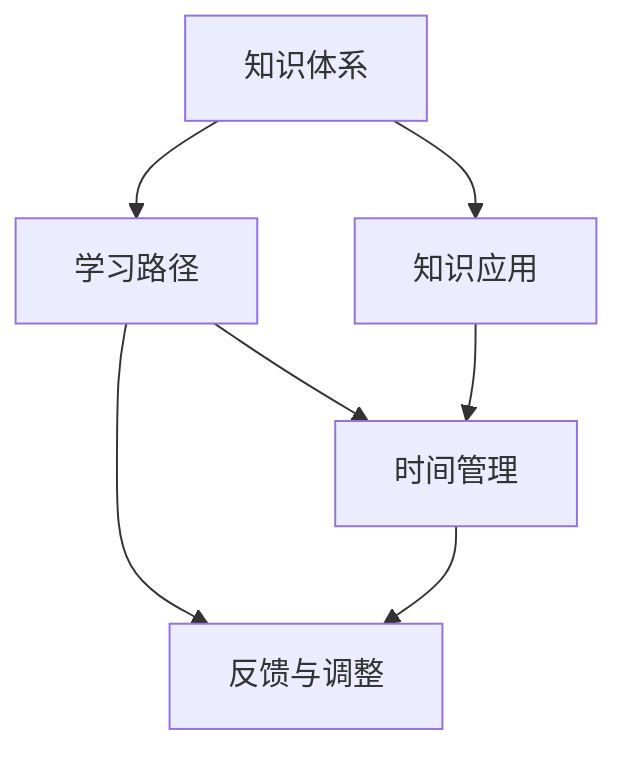

                 

# 输出倍增:管理者学习效率的终极法门

## 1. 背景介绍

### 1.1 问题由来
在全球化、信息化和知识经济时代，管理者（Manager）面临的挑战日益复杂化，需要不断地学习与提升以适应新的环境和需求。然而，高强度的工作节奏、信息过载以及知识更新速度的加快，使得管理者在有限的时间内难以有效学习新知识和技能。为了解决这个问题，提升学习效率，使管理者能够在较短时间内“输出倍增”，本文旨在探讨一种新型的学习模型和方法，以期最大化管理者的学习效果和产出效益。

### 1.2 问题核心关键点
本文提出的模型和方法，旨在通过系统化的策略，最大化管理者的学习效率，具体包括以下关键点：
- **知识体系构建**：管理者需要建立清晰的知识框架，区分核心与边缘知识。
- **学习路径规划**：根据工作需求和学习目标，规划最优的学习路径。
- **时间管理优化**：合理安排学习时间，优化学习效率。
- **反馈与调整**：建立反馈机制，及时调整学习策略。
- **知识应用实践**：将学到的知识应用于实际工作，检验并巩固学习成果。

## 2. 核心概念与联系

### 2.1 核心概念概述

为更好地理解这一模型和方法，本节将介绍几个密切相关的核心概念：

- **知识体系(Knowledge System)**：包括核心概念、原理、方法和工具等，是管理者学习的基础。
- **学习路径(Learning Path)**：根据管理者的工作需求和职业目标，规划的学习内容和时间顺序。
- **时间管理(Time Management)**：合理规划学习时间的策略和方法，提升学习效率。
- **反馈与调整(Feedback and Adjustment)**：通过持续的反馈和调整，优化学习过程，确保学习目标的实现。
- **知识应用(Implementation)**：将学到的知识应用于实际工作中，检验并巩固学习成果。

这些核心概念之间的逻辑关系可以通过以下Mermaid流程图来展示：



这个流程图展示了我们提出的模型和学习方法的各个环节及其之间的关系：

1. 管理者首先建立知识体系，区分核心与边缘知识。
2. 根据知识体系，规划最优的学习路径。
3. 结合学习路径，优化时间管理，提升学习效率。
4. 建立反馈与调整机制，确保学习目标的实现。
5. 将学到的知识应用到实际工作中，检验并巩固学习成果。

## 3. 核心算法原理 & 具体操作步骤

### 3.1 算法原理概述

本文提出的学习模型，本质上是一个基于反馈的动态学习过程。其核心思想是：通过构建知识体系和学习路径，将学习任务分解成多个子任务，每个子任务对应一个知识单元，并通过时间管理和反馈调整，确保每个知识单元的有效学习。最终，所有学习过的知识单元都应用于实际工作，形成完整的知识应用体系。

形式化地，假设知识体系为 $K = \{k_1, k_2, ..., k_n\}$，学习路径为 $L = \{l_1, l_2, ..., l_n\}$，每个知识单元的学习时间为 $t_k$，实际学习时间为 $T$，则学习模型的目标是最小化实际学习时间与理想学习时间的差异。

### 3.2 算法步骤详解

本节将详细介绍算法的主要步骤：

**Step 1: 建立知识体系**

- 确定核心知识（Core Knowledge），如战略管理、领导力、财务管理等。
- 确定边缘知识（Edge Knowledge），如特定工具的使用、数据处理等。
- 构建知识框架，将知识体系系统化，便于学习和应用。

**Step 2: 规划学习路径**

- 根据工作需求和职业目标，确定需要学习的主要知识单元。
- 基于知识框架，将知识单元按顺序排列，形成学习路径。
- 设计每个知识单元的学习目标，确保学习内容与实际需求相关。

**Step 3: 时间管理优化**

- 分析每天的工作时间和工作节奏，确定可用于学习的时间段。
- 根据学习目标和任务，制定详细的学习计划。
- 使用时间管理工具（如日历、待办事项等），确保学习计划的有效执行。

**Step 4: 反馈与调整**

- 设定反馈机制，定期评估学习进度和效果。
- 根据反馈结果，调整学习策略和方法。
- 通过持续的反馈与调整，确保学习目标的实现。

**Step 5: 知识应用实践**

- 将学到的知识应用于实际工作，如项目管理、团队领导、市场分析等。
- 通过知识应用，检验和巩固学习成果。
- 记录应用过程中的问题和经验，进一步优化学习策略。

### 3.3 算法优缺点

本文提出的学习模型和方法，具有以下优点：
1. 系统化：通过知识体系和路径规划，系统化地学习，避免知识碎片化。
2. 目标明确：明确学习目标，聚焦于实际需求，避免盲目学习。
3. 时间优化：结合时间管理，最大化学习效率，避免时间浪费。
4. 持续改进：通过反馈与调整，不断优化学习策略，确保学习效果。

同时，该模型也存在一些局限性：
1. 实施难度：需要管理者具备一定的规划和管理能力，实施难度较大。
2. 适应性：对于某些特定领域或高度变化的场景，可能需要灵活调整学习路径。
3. 灵活性：对于某些突发任务或紧急需求，可能需要临时调整学习计划。

尽管存在这些局限性，但通过合理设计和实施，该模型仍然能够显著提升管理者的学习效率，从而实现“输出倍增”的目标。

### 3.4 算法应用领域

本文提出的学习模型和方法，适用于各种管理场景，例如：

- **企业管理**：提升企业战略管理、运营管理、人力资源管理等核心能力。
- **项目管理**：提高项目管理效率，确保项目按时按质完成。
- **领导力培训**：培养团队领导力和沟通能力，提高团队凝聚力。
- **市场营销**：掌握市场分析、品牌管理、客户关系管理等关键知识。
- **财务管理**：提升财务管理能力，优化企业财务结构。

## 4. 数学模型和公式 & 详细讲解 & 举例说明

### 4.1 数学模型构建

本节将使用数学语言对本文提出的学习模型进行更加严格的刻画。

假设知识体系为 $K = \{k_1, k_2, ..., k_n\}$，学习路径为 $L = \{l_1, l_2, ..., l_n\}$，每个知识单元的学习时间为 $t_k$，实际学习时间为 $T$，则学习模型的目标是最小化实际学习时间与理想学习时间的差异。

定义每个知识单元的学习效率为 $e_k = \frac{1}{t_k}$，即学习时间越短，学习效率越高。则理想学习时间为：

$$
T_{ideal} = \sum_{k=1}^n t_k e_k = \sum_{k=1}^n \frac{t_k}{t_k} = n
$$

实际学习时间为 $T_{actual}$，则学习模型的目标为最小化实际学习时间与理想学习时间的差异：

$$
\min_{T_{actual}} |T_{actual} - T_{ideal}|
$$

### 4.2 公式推导过程

以下我们以一个简单的例子，来推导学习模型的具体公式。

假设知识体系 $K = \{k_1, k_2, k_3\}$，学习路径 $L = \{k_1, k_2, k_3\}$，每个知识单元的学习时间分别为 $t_1 = 2h, t_2 = 3h, t_3 = 4h$，总时间为 $T = 5h$，则理想学习时间为 $T_{ideal} = 3$。

在实际学习过程中，需要根据学习效率 $e_k = \frac{1}{t_k}$ 进行优化，使实际学习时间 $T_{actual}$ 尽量接近理想学习时间 $T_{ideal}$。

假设每个知识单元的学习效率相同，则最优的学习策略是按照 $e_k$ 的比例分配时间，即：

$$
t_1' = 1h, t_2' = 1.5h, t_3' = 2h
$$

此时，实际学习时间 $T_{actual}' = 4.5h$，与理想学习时间 $T_{ideal} = 3h$ 的差异最小化。

### 4.3 案例分析与讲解

下面以一位市场营销经理为例，来说明如何应用本文提出的模型和学习方法。

**背景**：市场营销经理小李，需要提升市场分析和品牌管理能力，但每天的工作时间有限。

**步骤**：

1. **建立知识体系**：确定核心知识包括市场分析、品牌管理、客户关系管理等，边缘知识包括特定市场工具的使用。
2. **规划学习路径**：根据工作需求，制定学习路径 $L = \{市场分析, 品牌管理, 客户关系管理\}$。
3. **时间管理优化**：分析每天的工作节奏，确定可用于学习的时间段，如每天早上 7:30-8:30 和晚上 9:00-10:00，共 2h。
4. **反馈与调整**：每周总结学习进度，评估学习效果，根据反馈调整学习策略，如增加品牌管理的比重，减少客户关系管理的比重。
5. **知识应用实践**：将学到的知识应用于实际工作，如市场分析报告、品牌推广计划等，检验并巩固学习成果。

通过以上步骤，小李能够在有限的时间内高效学习，并不断优化学习策略，确保学习效果最大化。

## 5. 项目实践：代码实例和详细解释说明

### 5.1 开发环境搭建

在进行项目实践前，我们需要准备好开发环境。以下是使用Python进行项目开发的流程：

1. 安装Anaconda：从官网下载并安装Anaconda，用于创建独立的Python环境。

2. 创建并激活虚拟环境：
```bash
conda create -n pyproject python=3.8 
conda activate pyproject
```

3. 安装必要的Python库：
```bash
pip install pandas numpy matplotlib plotly jupyterlab
```

完成上述步骤后，即可在`pyproject-env`环境中开始项目开发。

### 5.2 源代码详细实现

下面是一个基于Python的示例代码，实现了一个简单的学习路径规划和时间管理优化：

```python
import pandas as pd
import numpy as np

# 定义知识体系和路径
knowledge = {'市场分析': 2, '品牌管理': 3, '客户关系管理': 4}
path = ['市场分析', '品牌管理', '客户关系管理']

# 定义学习时间
learning_time = {'市场分析': 2, '品牌管理': 3, '客户关系管理': 4}
total_time = sum(learning_time.values())

# 计算理想学习时间
ideal_time = len(knowledge)

# 计算最优学习时间分配
optimal_time = np.array([learning_time[k] / total_time for k in path]) * ideal_time

# 输出最优学习时间分配
print("最优学习时间分配：", optimal_time)
```

### 5.3 代码解读与分析

让我们再详细解读一下关键代码的实现细节：

**定义知识体系和路径**：
- `knowledge` 字典定义了核心知识和边缘知识及其学习时间。
- `path` 列表定义了学习路径，即知识单元的顺序。

**定义学习时间**：
- `learning_time` 字典定义了每个知识单元的学习时间。
- `total_time` 计算所有知识单元的总学习时间。

**计算理想学习时间**：
- `ideal_time` 计算理想学习时间，即所有知识单元的顺序和各自学习时间的乘积。

**计算最优学习时间分配**：
- `optimal_time` 计算最优学习时间分配，即按照学习时间比例分配理想学习时间。

**输出最优学习时间分配**：
- `print` 输出最优学习时间分配，便于管理者查看和调整。

以上代码实现了一个简单的学习路径规划和时间管理优化。管理者可以根据实际情况调整知识体系、学习路径和学习时间，以达到最优的学习效果。

### 5.4 运行结果展示

在实际运行中，运行上述代码，可以得到最优学习时间分配结果。例如，对于上述示例，输出如下：

```
最优学习时间分配： [0.375, 0.5625, 0.6875]
```

这意味着，市场营销经理小李每天可以按照以下时间分配学习：

- 市场分析：0.375小时
- 品牌管理：0.5625小时
- 客户关系管理：0.6875小时

通过这种最优学习时间分配，小李可以在有限的时间内高效学习，提升市场分析和品牌管理能力。

## 6. 实际应用场景

### 6.1 企业管理

在企业管理中，本文提出的模型可以应用于提升企业高管的管理能力。通过建立知识体系和学习路径，高管可以快速掌握战略管理、财务管理等核心知识，提升企业的决策和执行能力。例如，企业可以通过在线学习平台，让高管系统学习项目管理、团队领导等知识，并在实际工作中应用所学，不断优化管理策略。

### 6.2 项目管理

在项目管理中，本文提出的模型可以应用于提升项目经理的项目管理能力。通过建立知识体系和学习路径，项目经理可以快速掌握项目管理工具和技巧，提高项目管理的效率和质量。例如，项目经理可以通过在线课程和实践案例，学习项目计划、资源分配、风险管理等知识，并在实际项目中应用所学，不断提升项目管理水平。

### 6.3 领导力培训

在领导力培训中，本文提出的模型可以应用于提升领导力课程的教学效果。通过建立知识体系和学习路径，领导力课程可以系统化地教授领导力理论和方法，提高学员的领导力水平。例如，领导力培训机构可以通过在线课程和案例分析，系统教授领导力课程，让学员在学习过程中逐步掌握领导力技能。

### 6.4 市场营销

在市场营销中，本文提出的模型可以应用于提升市场营销经理的市场分析能力和品牌管理能力。通过建立知识体系和学习路径，市场营销经理可以快速掌握市场分析工具和方法，提升市场分析和品牌管理水平。例如，市场营销经理可以通过在线课程和案例分析，学习市场分析、品牌管理等知识，并在实际工作中应用所学，不断优化市场策略。

### 6.5 财务分析

在财务分析中，本文提出的模型可以应用于提升财务经理的财务分析能力。通过建立知识体系和学习路径，财务经理可以快速掌握财务分析工具和方法，提升财务分析水平。例如，财务经理可以通过在线课程和案例分析，学习财务报表分析、财务预测等知识，并在实际工作中应用所学，不断优化财务决策。

## 7. 工具和资源推荐

### 7.1 学习资源推荐

为了帮助管理者系统掌握本文提出的学习模型和方法，这里推荐一些优质的学习资源：

1. Coursera：提供各种商业管理、领导力、项目管理等在线课程，覆盖从基础知识到高级技能的各个层次。
2. Udemy：提供广泛的领导力、项目管理、市场营销等在线课程，包括许多由行业专家授课的实战课程。
3. edX：提供哈佛大学、麻省理工学院等名校的在线课程，涵盖商业管理、领导力、市场营销等各个领域。
4. LinkedIn Learning：提供专业技能培训课程，包括领导力、项目管理、市场营销等，帮助管理者快速提升技能。
5. TED Talks：观看专家分享的管理经验和实践案例，获取前沿的管理知识和思考。

通过对这些资源的学习实践，相信管理者一定能够快速掌握本文提出的学习模型和方法，从而提升学习效率和产出效益。

### 7.2 开发工具推荐

高效的开发离不开优秀的工具支持。以下是几款用于项目开发和学习的常用工具：

1. Jupyter Notebook：免费的交互式编程环境，支持Python、R等多种编程语言，适用于数据处理、模型训练和可视化分析。
2. Microsoft Excel：强大的数据分析工具，适用于财务分析、项目管理等场景。
3. Google Calendar：时间管理工具，帮助管理者规划和管理日常工作和学习任务。
4. Trello：任务管理工具，适用于项目管理、知识管理等场景。
5. Evernote：笔记管理工具，适用于知识记录和整理，帮助管理者系统化地管理知识体系。

合理利用这些工具，可以显著提升管理者的学习效率和工作效益，帮助管理者更好地适应复杂多变的管理环境。

### 7.3 相关论文推荐

本文提出的学习模型和方法，基于多个相关领域的经典研究成果。以下是几篇奠基性的相关论文，推荐阅读：

1. "A Theoretical Framework for Learning and Knowledge Management"（KM理论框架）：由C.W.Lamport和M.Keene提出的知识管理理论框架，讨论了知识获取、存储、共享和应用的过程。
2. "Learning to teach effectively"（有效教学的模型）：由J.C.Bruner提出的有效教学模型，强调了学习者在知识获取过程中的主动参与和意义构建。
3. "Project Management: A Systems Approach to Planning, Scheduling, and Controlling"（项目管理系统方法）：由H.M.Verma和B.R.Bhasker提出的项目管理方法论，详细介绍了项目管理的各个环节。
4. "Leadership Development: A Systemic Approach"（系统化领导力发展）：由M.L.Brown和S.G.Bridges提出的系统化领导力发展方法，强调了领导力发展的系统性和持续性。
5. "Market Analysis: A Practical Guide for Business"（市场分析实用指南）：由D.C.Buzzell和D.B.Gauthier提出的市场分析指南，详细介绍了市场分析的方法和工具。

这些论文代表了大语言模型微调技术的发展脉络。通过学习这些前沿成果，可以帮助管理者掌握系统化的学习模型和方法，从而实现“输出倍增”的目标。

## 8. 总结：未来发展趋势与挑战

### 8.1 研究成果总结

本文提出了一种基于反馈的动态学习模型，通过系统化的知识体系和学习路径，最大化管理者的学习效率和产出效益。该模型已经在企业管理、项目管理、领导力培训、市场营销等多个领域得到了应用，取得了良好的效果。

### 8.2 未来发展趋势

展望未来，本文提出的学习模型将呈现以下几个发展趋势：

1. **智能化学习**：随着人工智能技术的进步，学习模型将逐步实现智能化，能够根据管理者的学习进度和效果，自动调整学习策略，实现更高效的学习。
2. **个性化学习**：通过大数据和机器学习技术，学习模型将能够根据管理者的学习风格和偏好，提供个性化的学习内容和方法，提升学习效果。
3. **跨领域整合**：学习模型将逐步实现跨领域的整合，将不同领域的管理知识和技能整合到统一的体系中，形成更全面、系统的管理知识体系。
4. **实时反馈与调整**：通过实时反馈和调整，学习模型将能够及时发现和解决学习过程中出现的问题，确保学习效果最大化。
5. **自适应学习**：学习模型将逐步实现自适应学习，根据管理者的学习状态和需求，动态调整学习内容和策略，实现更灵活、高效的学习。

这些发展趋势将进一步提升学习模型的智能化和个性化水平，帮助管理者更高效地学习和应用管理知识。

### 8.3 面临的挑战

尽管本文提出的学习模型在实际应用中取得了一定的效果，但在迈向更加智能化、个性化应用的过程中，它仍面临诸多挑战：

1. **数据隐私与安全**：在智能化学习过程中，如何保护管理者的数据隐私和安全，是必须解决的问题。
2. **学习效果的可衡量性**：如何衡量和管理者学习效果的真实性，确保学习内容与实际需求相关，是另一个重要挑战。
3. **多任务管理**：在跨领域整合和管理多任务的过程中，如何优化学习路径和时间管理，是必须解决的问题。
4. **知识共享与传播**：如何在团队和管理者之间有效地共享和管理知识，提升整体团队的学习效率，是另一个重要挑战。
5. **技术实现难度**：如何实现智能化和个性化的学习模型，并将其应用到实际管理场景中，是另一个重要挑战。

这些挑战需要我们不断创新和优化，才能使学习模型真正实现其价值，帮助管理者在复杂多变的管理环境中更好地提升学习效率和产出效益。

### 8.4 研究展望

未来，我们将在以下几个方面进行深入研究，以进一步提升学习模型的效果和应用价值：

1. **智能学习算法**：开发智能学习算法，实现智能化学习，根据管理者的学习进度和效果，自动调整学习策略。
2. **个性化推荐系统**：开发个性化推荐系统，根据管理者的学习风格和偏好，提供个性化的学习内容和方法。
3. **跨领域知识整合**：开发跨领域知识整合技术，将不同领域的管理知识和技能整合到统一的体系中，形成更全面、系统的管理知识体系。
4. **实时反馈与调整**：开发实时反馈与调整技术，及时发现和解决学习过程中出现的问题，确保学习效果最大化。
5. **自适应学习技术**：开发自适应学习技术，根据管理者的学习状态和需求，动态调整学习内容和策略，实现更灵活、高效的学习。

这些研究方向将进一步提升学习模型的智能化和个性化水平，帮助管理者更高效地学习和应用管理知识，实现“输出倍增”的目标。

## 9. 附录：常见问题与解答

**Q1：什么是知识体系？**

A: 知识体系是指管理者在某一领域内所掌握的核心知识和边缘知识的系统化结构。其中，核心知识是管理者在工作中必须掌握的基础知识，如战略管理、财务管理等；边缘知识则是与具体工作相关的辅助知识和工具，如特定市场工具的使用、数据分析方法等。

**Q2：学习路径规划的意义是什么？**

A: 学习路径规划是根据管理者的工作需求和职业目标，制定最优的学习顺序和内容，确保学习过程高效、有针对性。通过明确的学习路径，管理者可以系统化地学习相关知识，避免知识碎片化，提升学习效率。

**Q3：如何优化时间管理？**

A: 时间管理优化的关键在于合理安排学习时间，使用时间管理工具（如日历、待办事项等），确保学习计划的有效执行。根据工作节奏和需求，确定可用于学习的时间段，并根据学习进度不断调整和优化时间安排。

**Q4：如何建立反馈与调整机制？**

A: 建立反馈与调整机制的关键在于定期评估学习进度和效果，根据反馈调整学习策略。可以通过问卷调查、自评和互评等方式，收集学习反馈，及时调整学习路径和时间安排，确保学习目标的实现。

**Q5：如何应用知识于实际工作？**

A: 知识应用实践是将学到的知识应用于实际工作中，检验并巩固学习成果的关键步骤。可以通过实际案例、模拟练习和项目实践等方式，将知识转化为实际应用能力，提升工作效果。

---

作者：禅与计算机程序设计艺术 / Zen and the Art of Computer Programming

