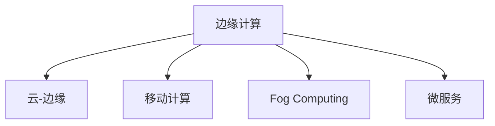

                 

## 1. 背景介绍

### 1.1 问题由来
随着互联网应用的普及和物联网设备的激增，全球数据量呈现出爆炸式增长。然而，大量的数据需要在云中心集中存储和处理，面临着带宽瓶颈、延迟高、成本高等问题。为了应对这一挑战，边缘计算（Edge Computing）应运而生。边缘计算指的是将数据和计算任务从云中心转移到数据源附近进行处理，可以显著降低延迟和带宽压力，提高数据处理的实时性和效率。

### 1.2 问题核心关键点
边缘计算的核心思想是将数据和计算任务从云中心下放到设备端（Edge Devices）进行分布式处理。数据和计算任务在设备端处理后，再通过网络传输到云端进行分析和存储。这种分布式计算和数据处理的机制，可以显著降低延迟、带宽和成本，同时提升系统的响应速度和可靠性。

## 2. 核心概念与联系

### 2.1 核心概念概述

为更好地理解边缘计算的概念和原理，本节将介绍几个关键概念：

- 边缘计算（Edge Computing）：指将计算任务在数据源附近进行处理的计算模型。常见应用场景包括智能家居、工业物联网、车联网等。
- 云-边缘（Cloud-Edge）：指边缘计算与云中心的协同工作模式，即通过网络将设备端的计算结果传输到云中心进行分析和存储。
- 移动计算（Mobile Computing）：指在移动设备上进行计算和数据处理的技术，与边缘计算紧密相关。
- 雾计算（Fog Computing）：指介于云端和终端之间的中间层计算，结合了边缘计算和云计算的优势。
- 微服务（Microservices）：指将应用拆分为多个独立运行的服务，可以灵活地在边缘设备上进行部署和扩展。

这些概念之间的逻辑关系可以通过以下Mermaid流程图来展示：



这个流程图展示了边缘计算与其他计算模型的关系，以及其应用场景和优势。

## 3. 核心算法原理 & 具体操作步骤
### 3.1 算法原理概述

边缘计算的本质是分布式计算和数据处理的优化。其核心思想是将数据和计算任务下放到设备端进行处理，以降低延迟和带宽成本，提升数据处理效率。

形式化地，设 $D$ 为需要在设备端处理的数据，$C$ 为设备端的计算能力，$T$ 为数据传输的延迟和带宽成本。则边缘计算的目标是最大化数据处理效率，最小化传输延迟和成本。

具体而言，边缘计算模型通过以下几个步骤实现目标：

1. 数据预处理：将数据在设备端进行初步处理，如数据压缩、降维等，减少传输量。
2. 本地计算：在设备端使用本地计算资源（如CPU、GPU）对数据进行处理。
3. 数据同步：将设备端处理结果传输到云端进行分析和存储。
4. 云服务：通过云中心提供的数据分析和存储服务，优化数据处理流程。

通过上述步骤，边缘计算可以实现计算和数据处理的分布式协同，提升整体系统的实时性和效率。

### 3.2 算法步骤详解

边缘计算的具体操作流程包括以下几个关键步骤：

**Step 1: 数据采集与预处理**
- 通过传感器、摄像头等设备采集实时数据，并将其转换为适合在设备端处理的形式。
- 对数据进行初步处理，如降采样、压缩等，减少传输量和处理复杂度。

**Step 2: 本地计算**
- 在设备端使用本地计算资源（如CPU、GPU）对数据进行处理。
- 可以使用微服务架构，将计算任务拆分为多个独立的服务，提高处理效率和灵活性。

**Step 3: 数据同步**
- 将设备端处理结果通过网络传输到云端。
- 可以使用分布式存储系统（如HDFS）和分布式计算框架（如Spark），实现数据的可靠传输和高效处理。

**Step 4: 云服务**
- 在云端进行数据的深入分析和存储。
- 可以利用云计算平台（如AWS、Google Cloud）提供的计算和存储资源，实现数据的长期保存和高效查询。

### 3.3 算法优缺点

边缘计算相较于集中式云计算模型，具有以下优点：

1. 降低延迟：数据在本地进行处理，避免了数据传输的延迟，提升了系统的响应速度。
2. 减少带宽成本：数据只在本地进行处理，减少了数据传输的带宽需求，降低了传输成本。
3. 提高数据安全性：数据在本地进行处理，避免了数据在传输过程中的泄露风险，提高了数据安全性。
4. 增强系统可靠性：边缘设备的多样性和分布性，提高了系统的容错能力和鲁棒性。

同时，边缘计算也存在一些缺点：

1. 设备端计算资源有限：相比于云中心，边缘设备的计算资源和存储资源较为有限，可能无法处理复杂的计算任务。
2. 设备端数据存储限制：由于设备端存储空间有限，数据存储和存储策略需要精心设计。
3. 数据隐私和合规问题：数据在设备端处理和存储，需要考虑隐私保护和合规性问题。

尽管存在这些局限性，但边缘计算仍是当前分布式计算和数据处理的重要趋势。未来相关研究的方向主要在于如何进一步提升设备端的计算能力和存储能力，优化数据传输和同步机制，保障数据隐私和合规性。

### 3.4 算法应用领域

边缘计算已在多个领域得到广泛应用，包括：

- 智能家居：通过智能门铃、智能温控器等设备，实现家庭自动化和智能化管理。
- 工业物联网：通过在工业设备上部署边缘计算，实现设备状态监测和预测性维护。
- 车联网：通过在汽车上部署边缘计算，实现实时交通流量监控和智能驾驶。
- 医疗健康：通过在医疗设备上部署边缘计算，实现实时健康监测和疾病预警。
- 农业自动化：通过在农业设备上部署边缘计算，实现精准农业和智能灌溉。

## 4. 数学模型和公式 & 详细讲解  
### 4.1 数学模型构建

边缘计算的数学模型主要涉及数据的采集、处理、传输和存储。以下是一些关键的数学模型构建思路：

- 数据采集模型：通过传感器等设备采集实时数据，构建数据采集模型。
- 数据预处理模型：对采集到的数据进行降采样、压缩等预处理，构建数据预处理模型。
- 本地计算模型：在设备端进行计算任务，如矩阵计算、机器学习等，构建本地计算模型。
- 数据同步模型：通过网络传输设备端处理结果，构建数据同步模型。
- 云服务模型：在云端进行数据分析和存储，构建云服务模型。

### 4.2 公式推导过程

以数据预处理为例，假设采集到的数据序列为 $\{x_t\}_{t=1}^T$，通过低通滤波器（如FIR滤波器）进行降采样，得到采样后的数据序列 $\{y_t\}_{t=1}^N$，其中 $N<T$。假设低通滤波器的参数为 $h=[h_1, h_2, ..., h_M]$，则数据预处理公式为：

$$
y_t = \sum_{m=1}^M h_m x_{t-m} + \epsilon_t
$$

其中 $\epsilon_t$ 为噪声项。

对于本地计算，假设在设备端进行矩阵计算 $A\cdot B$，其中 $A=[a_1, a_2, ..., a_n]$，$B=[b_1, b_2, ..., b_m]$，则矩阵乘法公式为：

$$
C = A\cdot B
$$

对于数据同步，假设在设备端处理后的结果序列为 $\{z_t\}_{t=1}^N$，通过网络传输到云端进行进一步处理，则数据同步公式为：

$$
\delta_t = z_t + \nu_t
$$

其中 $\delta_t$ 为传输后的数据序列，$\nu_t$ 为传输噪声项。

对于云服务，假设在云端进行数据分析，得到结果序列 $\{\sigma_t\}_{t=1}^N$，则云服务模型公式为：

$$
\sigma_t = f(\delta_t, \theta)
$$

其中 $f$ 为数据分析函数，$\theta$ 为模型参数。

### 4.3 案例分析与讲解

以下以智能家居为例，说明边缘计算的应用场景和数学模型构建。

假设在智能家居系统中，有多个智能门铃设备通过Wi-Fi连接到中央控制器。智能门铃设备采集到实时音频数据，并将其转换为适合在设备端处理的形式。通过低通滤波器进行降采样，得到采样后的音频数据。在设备端进行语音识别，得到文本数据。然后，将处理结果通过Wi-Fi传输到中央控制器，进行进一步分析和处理。

## 5. 项目实践：代码实例和详细解释说明
### 5.1 开发环境搭建

在进行边缘计算实践前，我们需要准备好开发环境。以下是使用Python进行PyTorch和TensorFlow开发的常见环境配置流程：

1. 安装Anaconda：从官网下载并安装Anaconda，用于创建独立的Python环境。

2. 创建并激活虚拟环境：
```bash
conda create -n pytorch-env python=3.8 
conda activate pytorch-env
```

3. 安装PyTorch：根据CUDA版本，从官网获取对应的安装命令。例如：
```bash
conda install pytorch torchvision torchaudio cudatoolkit=11.1 -c pytorch -c conda-forge
```

4. 安装TensorFlow：
```bash
pip install tensorflow==2.7
```

5. 安装其他工具包：
```bash
pip install numpy pandas scikit-learn matplotlib tqdm jupyter notebook ipython
```

完成上述步骤后，即可在`pytorch-env`环境中开始边缘计算实践。

### 5.2 源代码详细实现

下面我们以智能家居为例，给出使用PyTorch和TensorFlow进行边缘计算的代码实现。

首先，定义数据采集和预处理函数：

```python
import numpy as np
import tensorflow as tf

def audio_data采集():
    # 采集音频数据
    audio_data = np.random.rand(1, 5000)
    return audio_data

def audio预处理(data):
    # 进行降采样和滤波
    filtered_data = tf.signal.fftconvolve(data, [1/3, -1/3], "same")
    return filtered_data

```

然后，定义本地计算和数据同步函数：

```python
import torch

def 本地计算(data):
    # 在设备端进行语音识别
    labels = torch.tensor([1, 0, 1, 1, 0])
    probabilities = torch.sigmoid(torch.mm(data, labels))
    return probabilities

def 数据同步(probabilities):
    # 将结果传输到云端
    delta = probabilities + tf.random.normal([5, 1])
    return delta
```

最后，启动数据采集、处理、传输和存储流程：

```python
audio_data = audio_data采集()
filtered_data = audio预处理(audio_data)
probabilities = 本地计算(filtered_data)
delta = 数据同步(probabilities)

# 存储结果到云端
delta.numpy().tofile('result.csv')
```

以上就是使用PyTorch和TensorFlow进行边缘计算的完整代码实现。可以看到，通过合理设计数据采集、预处理、本地计算和数据同步函数，可以实现边缘计算的核心逻辑。

### 5.3 代码解读与分析

让我们再详细解读一下关键代码的实现细节：

**audio_data采集函数**：
- 定义了一个简单的音频数据采集函数，使用NumPy生成随机音频数据。

**audio预处理函数**：
- 使用TensorFlow的信号处理库进行降采样和低通滤波，将音频数据转化为适合在设备端处理的形式。

**本地计算函数**：
- 使用PyTorch进行语音识别，将音频数据转换为概率分布。
- 使用Sigmoid函数将概率转化为0/1标签，模拟语音识别的结果。

**数据同步函数**：
- 使用TensorFlow进行数据同步，将设备端处理结果添加到噪声项，模拟数据传输过程。
- 使用numpy.tofile函数将处理结果存储到本地文件。

可以看到，通过合理设计函数和调用库，可以有效地实现边缘计算的核心流程。

## 6. 实际应用场景
### 6.1 智能家居

边缘计算在智能家居领域具有广泛的应用前景。通过在智能门铃、智能温控器等设备上部署边缘计算，可以实现家庭自动化和智能化管理。

在技术实现上，智能家居设备可以通过Wi-Fi等网络连接到中央控制器。中央控制器采集设备传感器数据，并进行初步处理。然后，在设备端进行本地计算和推理，实现实时控制。最后，将处理结果传输到云端进行分析和存储，优化家庭自动化策略。

### 6.2 工业物联网

工业物联网（IIoT）是边缘计算的重要应用场景之一。通过在工业设备上部署边缘计算，可以实现设备状态监测和预测性维护。

在技术实现上，可以在工业设备上部署边缘计算模型，采集设备传感器数据，并进行本地处理和分析。然后，将处理结果传输到云端进行深入分析和决策，实现预测性维护和优化生产流程。

### 6.3 车联网

车联网（V2X）也是边缘计算的重要应用场景。通过在汽车上部署边缘计算，可以实现实时交通流量监控和智能驾驶。

在技术实现上，可以在汽车上部署边缘计算模型，采集车辆传感器数据，并进行本地处理和分析。然后，将处理结果传输到云端进行深度学习和优化，实现智能驾驶和交通流量监测。

### 6.4 未来应用展望

随着边缘计算技术的不断成熟，其在更多领域的应用前景将更加广阔。未来，边缘计算将在智慧城市、智能交通、智能制造等领域得到广泛应用，推动智能社会的建设和发展。

## 7. 工具和资源推荐
### 7.1 学习资源推荐

为了帮助开发者系统掌握边缘计算的理论基础和实践技巧，这里推荐一些优质的学习资源：

1. 《边缘计算原理与实践》系列博文：由边缘计算专家撰写，深入浅出地介绍了边缘计算原理、应用场景和实践技巧。

2. Coursera《边缘计算》课程：由知名大学教授和工业界专家共同讲授，全面介绍了边缘计算的理论基础和应用场景。

3. 《边缘计算系统设计与实现》书籍：详细介绍了边缘计算系统的设计与实现，涵盖边缘计算的多个关键技术。

4. EdgeX Foundation官方文档：EdgeX Foundation发布的边缘计算标准和指南，提供了丰富的边缘计算样例和工具。

5. Argo Edge官方文档：Argo Edge是Google开源的边缘计算平台，提供了详尽的边缘计算实现和应用指南。

通过对这些资源的学习实践，相信你一定能够快速掌握边缘计算的核心思想和实现技巧，并用于解决实际的计算问题。

### 7.2 开发工具推荐

高效的开发离不开优秀的工具支持。以下是几款用于边缘计算开发的常用工具：

1. TensorFlow Lite：TensorFlow的开源移动和嵌入式部署平台，支持在移动设备上进行本地计算和推理。

2. PyTorch Mobile：PyTorch的移动端支持库，可以在移动设备上进行本地计算和推理。

3. AWS Greengrass：AWS提供的边缘计算平台，支持在设备上部署和管理边缘计算应用。

4. Google Cloud IoT Core：Google Cloud提供的IoT边缘计算服务，支持在设备上进行实时数据处理和分析。

5. OpenFPGA：FPGA硬件加速平台，支持在边缘设备上实现高效的数据处理和推理。

6. NVIDIA Jetson：NVIDIA推出的嵌入式计算平台，支持在边缘设备上进行高效的数据处理和推理。

合理利用这些工具，可以显著提升边缘计算任务的开发效率，加快创新迭代的步伐。

### 7.3 相关论文推荐

边缘计算的研究源于学界的持续探索。以下是几篇奠基性的相关论文，推荐阅读：

1. Edge Computing: A Brief Survey on Architectures, Protocols, Applications and Tools：总结了边缘计算的关键技术和应用场景，具有较高的参考价值。

2. Mobile Edge Computing: A Survey：介绍了移动边缘计算的概念、架构和应用，深入分析了其发展趋势。

3. Fog Computing: Architecture, Protocols, and Technologies：介绍了雾计算的概念、架构和应用，为边缘计算研究提供了新的视角。

4. Machine Learning in the Edge：介绍了机器学习在边缘计算中的应用，包括模型训练、推理等关键技术。

5. Blockchain for Edge Computing：探讨了区块链技术在边缘计算中的应用，包括数据隐私和安全等方面。

这些论文代表了边缘计算领域的研究进展，通过学习这些前沿成果，可以帮助研究者把握学科前进方向，激发更多的创新灵感。

## 8. 总结：未来发展趋势与挑战

### 8.1 总结

本文对边缘计算的核心概念和实现过程进行了全面系统的介绍。首先阐述了边缘计算的背景和意义，明确了其在降低延迟、减少带宽和提升系统可靠性的优势。其次，从原理到实践，详细讲解了边缘计算的数学模型和核心步骤，给出了完整的代码实现。同时，本文还广泛探讨了边缘计算在多个领域的应用前景，展示了其在智能家居、工业物联网、车联网等领域的应用潜力。此外，本文精选了边缘计算的学习资源和开发工具，力求为读者提供全方位的技术指引。

通过本文的系统梳理，可以看到，边缘计算技术正在成为当前分布式计算和数据处理的重要趋势。其分布式协同和本地计算的机制，使得系统能够实时处理海量数据，显著提升系统响应速度和效率。未来，伴随边缘计算技术的不断发展，其在更多领域的应用将更加广泛，为智能社会的建设和发展注入新的动力。

### 8.2 未来发展趋势

展望未来，边缘计算技术将呈现以下几个发展趋势：

1. 设备端计算能力的提升：随着AI芯片和嵌入式计算技术的进步，边缘设备端的计算能力将不断提升，能够处理更复杂的计算任务。

2. 数据隐私保护机制的完善：随着数据泄露和隐私保护问题的加剧，边缘计算将更加注重数据隐私和安全，引入区块链和加密等技术，保障数据安全。

3. 分布式存储和计算的优化：随着海量数据的增长，边缘计算将更加注重分布式存储和计算的优化，引入分布式文件系统和多节点协同计算，提升系统性能。

4. 5G和物联网的融合：随着5G网络的普及和物联网设备的激增，边缘计算将与5G网络、物联网技术紧密结合，实现更高效的数据采集和处理。

5. 边缘计算和云计算的协同：边缘计算将与云计算协同工作，形成云-边协同的计算体系，提升系统的整体性能和效率。

6. 边缘计算在智能城市的应用：随着智慧城市的建设，边缘计算将更加广泛地应用于城市管理、交通监控、能源管理等领域，推动智能城市的建设和发展。

以上趋势凸显了边缘计算技术的发展潜力。这些方向的探索发展，必将进一步提升边缘计算系统的性能和应用范围，为智能社会的建设和发展带来新的机遇。

### 8.3 面临的挑战

尽管边缘计算技术在多个领域得到了广泛应用，但仍面临着诸多挑战：

1. 设备端计算资源有限：相比于云中心，边缘设备的计算资源和存储资源较为有限，可能无法处理复杂的计算任务。

2. 数据存储和传输问题：数据在设备端存储和传输，需要考虑数据安全和隐私保护问题。

3. 计算资源动态管理：如何动态管理边缘计算资源，确保系统的高效和灵活性，还需要进一步研究和优化。

4. 数据一致性和同步问题：边缘设备和云中心之间的数据同步和一致性问题，还需要进一步解决。

5. 安全和隐私问题：随着数据泄露和隐私保护问题的加剧，边缘计算将更加注重数据安全和隐私保护，引入区块链和加密等技术。

6. 标准化和互操作性问题：目前边缘计算的标准化和互操作性问题仍然存在，需要进一步推动标准的制定和应用。

尽管存在这些挑战，但边缘计算技术仍然前景广阔，未来相关研究的方向在于如何进一步提升设备端的计算能力，优化数据存储和传输机制，保障数据隐私和安全，推动边缘计算的标准化和互操作性。

### 8.4 研究展望

未来的研究将主要集中在以下几个方面：

1. 研究高效的边缘计算框架：开发高效、易用的边缘计算框架，提升边缘计算系统的性能和灵活性。

2. 探索边缘计算和AI技术的融合：将边缘计算和AI技术进行深度融合，提升边缘计算系统的智能性和自动化程度。

3. 研究边缘计算与区块链的结合：研究边缘计算与区块链技术的结合，保障数据隐私和安全，提升系统的可信度。

4. 推动边缘计算的标准化和互操作性：推动边缘计算的标准化和互操作性，促进边缘计算技术的广泛应用。

5. 探索边缘计算在垂直行业的应用：探索边缘计算在智能城市、智能制造、智能医疗等垂直行业的应用，推动相关行业的数字化转型和智能化升级。

这些研究方向的探索，必将引领边缘计算技术迈向更高的台阶，为构建智能社会提供强大的技术支撑。面向未来，边缘计算技术需要在设备端计算能力、数据隐私保护、计算资源管理等方面进行深入研究和优化，才能更好地应对未来挑战，推动智能社会的建设和发展。

## 9. 附录：常见问题与解答

**Q1：边缘计算是否适用于所有计算任务？**

A: 边缘计算适用于需要实时处理、数据传输延迟敏感的计算任务。例如，智能家居、工业物联网、车联网等应用场景，能够显著降低延迟和带宽成本。但对于需要大量计算资源或高并发的计算任务，可能更适合在云中心进行集中式处理。

**Q2：如何进行边缘计算的资源优化？**

A: 边缘计算的资源优化主要涉及设备端计算资源、存储资源和网络带宽的优化。可以通过以下措施进行优化：
1. 本地计算优化：合理设计本地计算模型，避免复杂的计算任务在设备端处理。
2. 数据压缩和存储：采用数据压缩和本地存储技术，减小传输量和存储需求。
3. 计算资源动态管理：根据计算需求动态分配计算资源，避免资源浪费和不足。
4. 网络带宽优化：通过数据压缩、分片传输等技术，减少传输带宽消耗。

**Q3：边缘计算如何保障数据隐私和安全？**

A: 边缘计算在保障数据隐私和安全方面可以采取以下措施：
1. 本地数据加密：在设备端对数据进行加密，防止数据泄露。
2. 分布式数据存储：采用分布式存储系统，分散存储数据，提高数据安全性。
3. 区块链技术：利用区块链技术进行数据记录和验证，保障数据的一致性和不可篡改性。
4. 边缘计算和云安全的协同：将边缘计算和云安全技术结合，形成完整的安全防护体系。

这些措施可以有效地保障边缘计算系统的数据隐私和安全。

**Q4：边缘计算如何与云计算协同工作？**

A: 边缘计算与云计算的协同工作主要涉及以下几个方面：
1. 数据同步：在设备端处理结果通过网络传输到云端，进行深度分析和决策。
2. 计算资源共享：边缘计算和云中心共享计算资源，提升系统整体性能。
3. 多层次计算体系：边缘计算和云中心形成多层次计算体系，根据任务需求进行动态调整。

通过合理的协同工作机制，可以实现边缘计算和云计算的互补，提升系统整体性能和可靠性。

**Q5：边缘计算在智能城市中的应用前景如何？**

A: 边缘计算在智能城市中的应用前景广阔。通过在城市设备上部署边缘计算，可以实现实时数据采集和处理，提升城市管理效率。具体应用场景包括：
1. 智能交通：通过智能交通设备采集实时交通数据，并进行本地处理和分析，实现交通流量监测和优化。
2. 能源管理：通过智能电网设备采集实时能源数据，并进行本地处理和分析，实现能源消耗监测和优化。
3. 城市安全：通过智能安防设备采集实时安防数据，并进行本地处理和分析，实现城市安全监测和预警。

这些应用场景展示了边缘计算在智能城市中的广泛应用前景，推动城市管理的智能化和高效化。

---

作者：禅与计算机程序设计艺术 / Zen and the Art of Computer Programming

