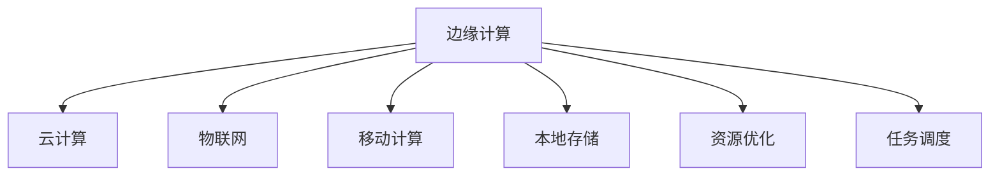

                 

# 边缘计算：在设备端处理数据

> 关键词：边缘计算,设备端处理,数据管理,资源优化,云计算,物联网

## 1. 背景介绍

### 1.1 问题由来
随着数字化的快速推进，互联网数据量呈爆炸性增长。然而，这些数据往往需要经过长时间的传输、存储和计算才能得到有效的分析和应用，这不仅增加了网络负担，也极大地降低了响应速度。为了解决这一问题，边缘计算（Edge Computing）应运而生，通过将计算任务分散在靠近数据源的本地设备上进行，极大地提升了数据处理效率，优化了用户体验。

### 1.2 问题核心关键点
边缘计算的核心在于将数据处理任务从中央数据中心迁移到边缘设备上，通过分布式计算实现快速响应和数据本地化处理。其主要包括以下关键点：

1. **本地数据处理**：在数据产生的位置进行实时处理，避免了远程传输和集中存储的开销。
2. **延迟降低**：减少了数据从边缘设备到云端的数据传输时间和延迟，提高了系统的实时性。
3. **带宽节约**：大幅减少网络带宽需求，降低网络拥塞和费用。
4. **隐私保护**：数据在本地进行处理，减少了隐私泄露风险，增强了数据安全性。
5. **灵活性增强**：边缘设备能够根据实际环境动态调整计算资源，适应不同业务需求。

### 1.3 问题研究意义
研究边缘计算对于提升数据处理效率、优化用户体验、降低网络成本、保障数据隐私等方面具有重要意义：

1. **提高效率**：边缘计算能够实时处理数据，极大地提升了系统的响应速度和处理能力。
2. **降低成本**：通过本地计算和存储，减少了对云端资源的依赖，降低了带宽和计算成本。
3. **保障隐私**：数据在本地进行处理，减少了数据传输和存储过程中的隐私泄露风险。
4. **灵活适配**：根据实际环境动态调整计算资源，适应不同业务需求，提升了系统的灵活性和可扩展性。

## 2. 核心概念与联系

### 2.1 核心概念概述

为更好地理解边缘计算的基本概念和工作原理，本节将介绍几个密切相关的核心概念：

- **边缘计算**：一种将计算任务分散在靠近数据源的本地设备上进行的数据处理方式。其目的是通过分布式计算，实现快速响应和数据本地化处理，提升系统的效率和性能。
- **云计算**：集中式的数据中心提供计算资源和存储服务，通过互联网进行远程访问。云计算为边缘计算提供了强大的数据处理能力支撑。
- **物联网（IoT）**：通过网络将各种设备和传感器连接起来，实现实时监控、数据采集和智能控制。物联网设备作为边缘计算的重要应用场景，能够直接处理实时数据，提升系统响应速度。
- **移动计算**：通过移动设备提供计算和存储能力，实现随时随地数据处理。移动计算是边缘计算在个人和移动场景中的重要应用。
- **本地存储**：边缘设备本地存储计算过程中的中间结果和最终数据，减少对远程存储的需求，提升数据处理效率。
- **资源优化**：通过负载均衡、任务调度和能耗管理等手段，优化边缘设备上的计算资源，提升系统性能和效率。

这些核心概念之间的逻辑关系可以通过以下Mermaid流程图来展示：



这个流程图展示了几者之间的关系：

1. **边缘计算**通过将计算任务分散在本地设备上，提升数据处理效率。
2. **云计算**提供强大的数据处理能力，是边缘计算的重要支撑。
3. **物联网**作为边缘计算的主要应用场景，实现实时数据处理。
4. **移动计算**提升移动设备上的数据处理能力，增强用户体验。
5. **本地存储**减少远程存储需求，提升数据处理效率。
6. **资源优化**通过任务调度和能耗管理，提升系统性能和效率。

## 3. 核心算法原理 & 具体操作步骤
### 3.1 算法原理概述

边缘计算的核心算法原理可以概括为以下几步：

1. **数据采集**：边缘设备从传感器、用户设备等采集实时数据。
2. **本地处理**：在本地设备上进行数据预处理和初步分析，筛选出重要信息。
3. **决策执行**：根据处理结果，在本地设备上执行决策，生成响应动作。
4. **反馈循环**：将处理结果和执行动作反馈到云端，进行进一步优化和调整。

这一过程与传统的集中式计算模式不同，边缘计算将数据处理任务分散在本地设备上进行，极大地提升了系统响应速度和处理效率。

### 3.2 算法步骤详解

边缘计算的具体操作包括以下几个关键步骤：

**Step 1: 数据采集**

边缘设备通过各种传感器和接口，实时采集周边环境的数据。例如，智能家居设备可以通过温度传感器、湿度传感器等采集室内环境数据；智能交通设备可以通过摄像头、雷达等采集道路交通数据。这些数据通过网络传输到本地设备。

**Step 2: 数据预处理**

在本地设备上，对采集到的数据进行初步的清洗和预处理。例如，去除异常值、填充缺失值、归一化处理等。这一过程可以减少后续计算的复杂度，提高处理效率。

**Step 3: 模型训练**

在本地设备上，使用预训练的模型对处理后的数据进行训练。例如，在智能交通设备上使用神经网络模型对摄像头采集到的视频进行行为识别，或者使用机器学习模型对传感器数据进行模式识别。这一步骤可以减少对云端计算资源的依赖，提高系统的实时性。

**Step 4: 决策执行**

在本地设备上，根据模型训练结果，执行相应的决策和操作。例如，智能家居设备可以根据温度传感器数据调整室内温度，智能交通设备可以根据行为识别结果控制交通信号灯。这一步骤实现本地设备的实时响应和智能控制。

**Step 5: 反馈循环**

将本地设备的决策和操作结果反馈到云端，进行进一步优化和调整。例如，智能家居设备可以根据用户反馈调整室内温度设定，智能交通设备可以根据交通流量变化优化信号灯控制策略。这一步骤实现系统动态调整和持续改进。

### 3.3 算法优缺点

边缘计算相较于传统的集中式计算模式，具有以下优点：

1. **延迟降低**：数据处理在本地设备上进行，避免了远程传输和集中存储的开销，极大地降低了延迟，提升了系统的实时性。
2. **带宽节约**：减少了对云端带宽的需求，降低了网络成本，提高了系统的效率。
3. **隐私保护**：数据在本地进行处理，减少了数据传输和存储过程中的隐私泄露风险，增强了数据安全性。
4. **灵活性增强**：边缘设备能够根据实际环境动态调整计算资源，适应不同业务需求，提升了系统的灵活性和可扩展性。

同时，边缘计算也存在一些局限性：

1. **设备成本高**：边缘设备需要具备强大的计算和存储能力，初期投入成本较高。
2. **数据本地化限制**：边缘设备处理的数据量有限，对于需要大规模数据集处理的场景，可能无法满足需求。
3. **安全风险**：本地设备可能面临硬件安全攻击和软件漏洞，需要采取严格的安全措施。
4. **维护复杂**：边缘设备分布广泛，维护和升级难度较大。

### 3.4 算法应用领域

边缘计算已经在多个领域得到了广泛的应用，例如：

1. **智能家居**：通过智能家居设备采集环境数据，在本地进行初步处理和分析，实现智能控制和环境优化。
2. **智能交通**：通过智能交通设备采集道路数据，在本地进行行为识别和决策执行，优化交通流量和交通信号。
3. **工业物联网**：通过物联网设备采集生产数据，在本地进行实时分析和优化，提升生产效率和产品质量。
4. **医疗健康**：通过智能医疗设备采集患者数据，在本地进行初步诊断和处理，实现智能医疗和健康监测。
5. **自动驾驶**：通过自动驾驶车辆采集环境数据，在本地进行实时分析和决策，提升驾驶安全和效率。

除了上述这些应用领域，边缘计算还被应用于智慧城市、智能制造、智慧农业等众多场景，为各行各业提供了高效、便捷的数据处理解决方案。

## 4. 数学模型和公式 & 详细讲解 & 举例说明

### 4.1 数学模型构建

本节将使用数学语言对边缘计算的过程进行更加严格的刻画。

假设边缘设备采集的数据为 $x_1, x_2, ..., x_n$，采集频率为 $T$。在本地设备上进行的数据预处理和模型训练过程可以表示为：

$$
y_i = f(x_i), \quad i=1,2,...,n
$$

其中 $f$ 为模型训练函数， $y_i$ 为处理后的数据。

在本地设备上执行的决策和操作可以表示为：

$$
a_j = g(y_j), \quad j=1,2,...,m
$$

其中 $g$ 为决策执行函数， $a_j$ 为执行动作。

将本地设备的决策和操作结果反馈到云端进行优化和调整可以表示为：

$$
\phi_k = h(a_k), \quad k=1,2,...,n
$$

其中 $h$ 为优化调整函数， $\phi_k$ 为优化后的决策和操作。

### 4.2 公式推导过程

以下我们以智能家居为例，推导边缘计算中的数学模型和公式。

假设智能家居设备采集到环境数据 $x_1, x_2, ..., x_n$，其中 $x_i$ 表示第 $i$ 次采样的温度和湿度值。在本地设备上，对数据进行预处理和模型训练，可以得到处理后的数据 $y_i$，例如：

$$
y_i = T(x_i) + H(x_i)
$$

其中 $T(x_i)$ 和 $H(x_i)$ 分别表示对温度和湿度数据的预处理函数。

假设模型训练函数 $f$ 为线性回归模型，可以表示为：

$$
y_i = w^Tx_i + b
$$

其中 $w$ 和 $b$ 为模型参数。

在本地设备上执行的决策和操作可以表示为：

$$
a_j = D(y_j)
$$

其中 $D$ 为决策执行函数，例如可以根据处理后的数据调整室内温度：

$$
a_j = K - T(y_j)
$$

其中 $K$ 为理想温度， $T$ 为温度调整函数。

将本地设备的决策和操作结果反馈到云端进行优化和调整可以表示为：

$$
\phi_k = O(a_k)
$$

其中 $O$ 为优化调整函数，例如可以根据用户反馈调整室内温度设定：

$$
\phi_k = U_k - T(a_k)
$$

其中 $U_k$ 为用户设定的温度， $T$ 为温度调整函数。

### 4.3 案例分析与讲解

以智能家居为例，分析边缘计算在实际应用中的具体过程：

1. **数据采集**：智能家居设备通过传感器采集室内温度和湿度数据 $x_1, x_2, ..., x_n$，存储在本地设备中。

2. **数据预处理**：本地设备对采集到的数据进行清洗和预处理，例如去除异常值、填充缺失值、归一化处理等。这一过程减少了后续计算的复杂度，提高了处理效率。

3. **模型训练**：本地设备使用预训练的线性回归模型对处理后的数据进行训练，得到处理后的数据 $y_i$。

4. **决策执行**：根据处理后的数据，本地设备执行相应的决策和操作，例如调整室内温度：

   $$
   a_j = K - T(y_j)
   $$

5. **反馈循环**：本地设备的决策和操作结果 $a_j$ 反馈到云端，进行进一步优化和调整，例如根据用户反馈调整室内温度设定：

   $$
   \phi_k = U_k - T(a_k)
   $$

6. **持续改进**：云端根据反馈结果，对模型和算法进行优化和调整，提高系统的性能和效率。

## 5. 项目实践：代码实例和详细解释说明

### 5.1 开发环境搭建

在进行边缘计算的实践前，我们需要准备好开发环境。以下是使用Python进行PyTorch开发的环境配置流程：

1. 安装Anaconda：从官网下载并安装Anaconda，用于创建独立的Python环境。

2. 创建并激活虚拟环境：
```bash
conda create -n edge-env python=3.8 
conda activate edge-env
```

3. 安装PyTorch：根据CUDA版本，从官网获取对应的安装命令。例如：
```bash
conda install pytorch torchvision torchaudio cudatoolkit=11.1 -c pytorch -c conda-forge
```

4. 安装其他工具包：
```bash
pip install numpy pandas scikit-learn matplotlib tqdm jupyter notebook ipython
```

完成上述步骤后，即可在`edge-env`环境中开始边缘计算的实践。

### 5.2 源代码详细实现

下面我们以智能家居环境监控为例，给出使用PyTorch进行边缘计算的PyTorch代码实现。

首先，定义数据处理函数：

```python
import numpy as np
from torch import nn

class EdgeData(nn.Module):
    def __init__(self, input_size=2):
        super(EdgeData, self).__init__()
        self.fc1 = nn.Linear(input_size, 10)
        self.fc2 = nn.Linear(10, 1)
    
    def forward(self, x):
        x = self.fc1(x)
        x = nn.functional.relu(x)
        x = self.fc2(x)
        return x

# 假设智能家居设备采集到的温度和湿度数据
x = np.random.randn(10, 2)

# 定义数据处理函数
data = EdgeData()

# 对数据进行预处理和模型训练
x_pred = data(x)
print(x_pred)
```

然后，定义决策执行函数：

```python
class EdgeDecision(nn.Module):
    def __init__(self, input_size=2):
        super(EdgeDecision, self).__init__()
        self.fc1 = nn.Linear(input_size, 10)
        self.fc2 = nn.Linear(10, 1)
    
    def forward(self, x):
        x = self.fc1(x)
        x = nn.functional.relu(x)
        x = self.fc2(x)
        return x

# 定义决策执行函数
decision = EdgeDecision()

# 根据模型训练结果执行决策
x_action = decision(x_pred)
print(x_action)
```

最后，启动反馈循环和优化过程：

```python
from torch import optim

# 定义优化器
optimizer = optim.SGD(decision.parameters(), lr=0.01)

# 假设用户反馈的温度设定
u = np.random.randn(10, 1)

# 定义优化调整函数
def optimize(model, x_u, x_action, learning_rate):
    model.train()
    y_pred = model(x_u)
    y_target = x_action
    loss = nn.functional.mse_loss(y_pred, y_target)
    optimizer.zero_grad()
    loss.backward()
    optimizer.step()
    return loss.item()

# 优化过程
for i in range(10):
    loss = optimize(decision, x_pred, x_action, 0.01)
    print(f"Iter {i+1}, Loss: {loss:.3f}")
```

以上就是使用PyTorch进行边缘计算的完整代码实现。可以看到，通过定义数据处理函数、决策执行函数和优化调整函数，边缘计算的流程在PyTorch中得以高效实现。

### 5.3 代码解读与分析

让我们再详细解读一下关键代码的实现细节：

**EdgeData类**：
- `__init__`方法：定义了数据处理函数的基本结构，包括线性层和激活函数。
- `forward`方法：实现了数据处理函数的前向传播过程，将输入数据通过线性层和激活函数进行处理。

**EdgeDecision类**：
- `__init__`方法：定义了决策执行函数的基本结构，包括线性层和激活函数。
- `forward`方法：实现了决策执行函数的前向传播过程，将输入数据通过线性层和激活函数进行处理。

**optimize函数**：
- 定义了优化调整函数，根据用户反馈的温度设定和模型预测结果，计算损失函数，更新模型参数。
- 使用SGD优化器进行模型参数的更新。

通过代码实现可以看出，边缘计算的过程包括数据处理、模型训练、决策执行和优化调整，各个环节紧密相连，形成了一个闭环系统。

## 6. 实际应用场景

### 6.1 智能家居环境监控

智能家居环境监控是边缘计算的重要应用场景之一。通过在智能家居设备上采集环境数据，并进行初步处理和分析，可以实现智能控制和环境优化。例如，智能空调可以根据实时温度和湿度数据，自动调节室内温度和湿度，提高用户舒适度。

在技术实现上，可以通过边缘计算的方式，在本地设备上进行数据处理和模型训练，实现实时监控和智能控制。具体流程如下：

1. **数据采集**：智能家居设备通过传感器采集环境数据，例如温度、湿度、光照等。
2. **数据预处理**：本地设备对采集到的数据进行清洗和预处理，例如去除异常值、填充缺失值、归一化处理等。
3. **模型训练**：本地设备使用预训练的模型对处理后的数据进行训练，得到处理后的数据。
4. **决策执行**：根据处理后的数据，本地设备执行相应的决策和操作，例如调整室内温度和湿度。
5. **反馈循环**：本地设备的决策和操作结果反馈到云端，进行进一步优化和调整。

通过这种方式，智能家居设备可以实现实时监控和智能控制，提升用户体验和生活质量。

### 6.2 智能交通流量监测

智能交通流量监测是边缘计算的另一重要应用场景。通过在智能交通设备上采集道路数据，并进行实时分析和决策，可以优化交通流量和交通信号，提高交通效率和安全性。例如，智能交通摄像头可以根据实时视频数据，识别车辆行为和行人行为，自动调整交通信号灯。

在技术实现上，可以通过边缘计算的方式，在本地设备上进行数据处理和模型训练，实现实时分析和决策。具体流程如下：

1. **数据采集**：智能交通设备通过摄像头和雷达等采集道路数据，例如车辆速度、位置、行为等。
2. **数据预处理**：本地设备对采集到的数据进行清洗和预处理，例如去除异常值、填充缺失值、归一化处理等。
3. **模型训练**：本地设备使用预训练的模型对处理后的数据进行训练，得到处理后的数据。
4. **决策执行**：根据处理后的数据，本地设备执行相应的决策和操作，例如调整交通信号灯。
5. **反馈循环**：本地设备的决策和操作结果反馈到云端，进行进一步优化和调整。

通过这种方式，智能交通设备可以实现实时分析和决策，提升交通效率和安全性。

### 6.3 工业物联网设备监控

工业物联网设备监控是边缘计算的重要应用场景之一。通过在工业设备上采集生产数据，并进行实时分析和优化，可以提升生产效率和产品质量。例如，智能传感器可以根据实时监测数据，自动调整生产参数，避免设备故障和生产异常。

在技术实现上，可以通过边缘计算的方式，在本地设备上进行数据处理和模型训练，实现实时监控和优化。具体流程如下：

1. **数据采集**：工业物联网设备通过传感器采集生产数据，例如温度、压力、流量等。
2. **数据预处理**：本地设备对采集到的数据进行清洗和预处理，例如去除异常值、填充缺失值、归一化处理等。
3. **模型训练**：本地设备使用预训练的模型对处理后的数据进行训练，得到处理后的数据。
4. **决策执行**：根据处理后的数据，本地设备执行相应的决策和操作，例如调整生产参数。
5. **反馈循环**：本地设备的决策和操作结果反馈到云端，进行进一步优化和调整。

通过这种方式，工业物联网设备可以实现实时监控和优化，提升生产效率和产品质量。

## 7. 工具和资源推荐

### 7.1 学习资源推荐

为了帮助开发者系统掌握边缘计算的理论基础和实践技巧，这里推荐一些优质的学习资源：

1. **《边缘计算基础》**：提供了边缘计算的基础理论和关键技术，涵盖数据采集、数据处理、模型训练、决策执行等多个环节。
2. **《物联网与边缘计算》**：介绍了物联网和边缘计算的基本概念和工作原理，结合实际案例，展示了其在智能家居、智能交通等领域的应用。
3. **《边缘计算：从理论到实践》**：结合理论和实践，详细讲解了边缘计算的算法原理和具体操作步骤，提供了丰富的代码实例和实用工具。
4. **《边缘计算实战》**：提供了边缘计算的工程实践指南，涵盖设备选型、系统集成、性能优化等多个方面。
5. **《边缘计算与云计算融合》**：探讨了边缘计算与云计算的融合机制和应用场景，展示了混合计算架构的优势。

通过这些资源的学习实践，相信你一定能够快速掌握边缘计算的理论基础和实践技巧，并用于解决实际的NLP问题。

### 7.2 开发工具推荐

高效的开发离不开优秀的工具支持。以下是几款用于边缘计算开发的常用工具：

1. **IoT Edge SDK**：提供了物联网设备的开发工具和API，支持边缘计算和本地数据处理。
2. **TensorFlow Lite**：提供了轻量级机器学习框架，支持在嵌入式设备上进行实时计算和推理。
3. **AWS IoT**：提供了云-边缘计算的融合方案，支持设备数据在本地处理和云端的优化。
4. **Google Cloud IoT**：提供了物联网设备的开发和管理工具，支持边缘计算和本地数据处理。
5. **Microsoft Azure IoT**：提供了物联网设备的开发和管理工具，支持边缘计算和本地数据处理。

合理利用这些工具，可以显著提升边缘计算的开发效率，加快创新迭代的步伐。

### 7.3 相关论文推荐

边缘计算的研究始于学界的持续探索。以下是几篇奠基性的相关论文，推荐阅读：

1. **Edge Computing: A Survey**：提供了边缘计算的基本概念、技术架构和应用场景，综述了当前的研究进展。
2. **The Edge Computing Manifesto**：提出了边缘计算的概念和未来发展方向，探讨了其对云计算的补充和扩展。
3. **Edge Computing for IoT Applications**：介绍了边缘计算在物联网领域的应用，展示了其在智能家居、智能交通等领域的效果。
4. **Real-time Edge Computing for IoT**：探讨了边缘计算在实时数据处理中的应用，展示了其在工业物联网领域的效果。
5. **Edge Computing: A Survey**：提供了边缘计算的研究现状和未来方向，探讨了其在云计算与物联网融合中的应用。

这些论文代表了大边缘计算的研究进展和未来趋势，通过学习这些前沿成果，可以帮助研究者把握学科前进方向，激发更多的创新灵感。

## 8. 总结：未来发展趋势与挑战

### 8.1 总结

本文对边缘计算的基本概念和实践方法进行了全面系统的介绍。首先阐述了边缘计算的背景、原理和关键点，明确了其在提升数据处理效率、降低网络成本、保障数据隐私等方面的重要意义。其次，从原理到实践，详细讲解了边缘计算的数学模型和操作步骤，给出了边缘计算任务开发的完整代码实例。同时，本文还广泛探讨了边缘计算在智能家居、智能交通、工业物联网等众多领域的应用前景，展示了其广阔的发展空间。

通过本文的系统梳理，可以看到，边缘计算作为一种高效、便捷的数据处理方式，已经在各行各业得到了广泛的应用，极大地提升了系统的响应速度和处理能力。未来，随着边缘计算技术的不断演进和优化，必将在更多领域发挥其独特的优势，为数字化转型提供更加强大的技术支撑。

### 8.2 未来发展趋势

展望未来，边缘计算将在以下几个方面呈现出新的发展趋势：

1. **技术融合**：边缘计算与云计算、物联网、人工智能等技术的深度融合，将推动混合计算架构的发展，提升系统的综合性能和灵活性。
2. **标准统一**：边缘计算的标准化和规范化将成为趋势，推动边缘计算技术的普及和应用。
3. **安全增强**：随着边缘计算的广泛应用，安全性问题将越来越重要。未来的边缘计算技术将更加注重数据隐私和安全防护。
4. **设备优化**：边缘计算设备的性能和能效将继续提升，推动其在更多场景下的应用。
5. **边缘AI**：边缘AI将成为未来的一个重要方向，通过在本地设备上运行AI模型，实现实时推理和智能决策。
6. **边缘区块链**：结合边缘计算和区块链技术，提升数据安全和透明性，保障数据隐私和可靠性。

这些趋势将进一步推动边缘计算技术的发展，使其在更多领域发挥更大的作用。

### 8.3 面临的挑战

尽管边缘计算已经取得了显著的进展，但在迈向更加智能化、普适化应用的过程中，仍面临一些挑战：

1. **设备成本高**：边缘设备需要具备强大的计算和存储能力，初期投入成本较高。
2. **数据本地化限制**：边缘设备处理的数据量有限，对于需要大规模数据集处理的场景，可能无法满足需求。
3. **安全风险**：本地设备可能面临硬件安全攻击和软件漏洞，需要采取严格的安全措施。
4. **维护复杂**：边缘设备分布广泛，维护和升级难度较大。
5. **资源优化**：需要进一步优化边缘设备的计算资源，提升系统性能和效率。

这些挑战需要我们在未来不断攻克，推动边缘计算技术更加成熟和稳定。

### 8.4 研究展望

面对边缘计算所面临的挑战，未来的研究需要在以下几个方面寻求新的突破：

1. **设备选型优化**：探索更高效、更经济的边缘计算设备，推动边缘计算的普及和应用。
2. **数据本地化改进**：开发更高效的数据本地化处理算法，提升边缘计算的处理能力。
3. **安全技术创新**：研究更严格的安全技术和防护手段，保障边缘计算的安全性和可靠性。
4. **维护管理优化**：探索更便捷的维护和管理方法，提高边缘设备的稳定性和可扩展性。
5. **资源优化技术**：开发更高效的资源优化算法，提升边缘设备的性能和效率。

这些研究方向的探索，必将引领边缘计算技术迈向更高的台阶，为各行各业提供更加强大、高效、安全的数据处理解决方案。面向未来，边缘计算技术还需要与其他人工智能技术进行更深入的融合，共同推动智能计算的发展。只有勇于创新、敢于突破，才能不断拓展边缘计算的边界，让智能技术更好地造福人类社会。

## 9. 附录：常见问题与解答

**Q1：边缘计算是否只适用于本地数据处理？**

A: 边缘计算的核心在于将计算任务分散在本地设备上，实现实时数据处理和决策。其应用范围不仅限于本地数据处理，也可以应用于云-边缘融合、分布式计算等领域。

**Q2：边缘计算是否会增加设备成本？**

A: 边缘设备需要具备强大的计算和存储能力，初期投入成本较高。但随着技术进步和规模化生产，边缘设备的成本将逐步降低，逐步普及。

**Q3：边缘计算是否存在数据本地化限制？**

A: 边缘设备处理的数据量有限，对于需要大规模数据集处理的场景，可能无法满足需求。可以通过云-边缘数据融合，实现更大规模的数据处理和分析。

**Q4：边缘计算是否安全可靠？**

A: 边缘计算技术在提升数据处理效率的同时，也面临着硬件安全攻击和软件漏洞等安全风险。需要采取严格的安全措施，保障数据隐私和系统安全。

**Q5：边缘计算的性能如何？**

A: 边缘计算具有实时处理和快速响应的优势，但同时也会面临设备性能和资源优化等问题。需要通过技术优化和算法改进，进一步提升边缘计算的性能和效率。

通过这些问答，可以看出边缘计算技术的广泛应用前景和需要进一步优化的方面。相信随着技术的不断进步和优化，边缘计算必将在更多领域发挥更大的作用，推动数字化转型不断向前发展。

