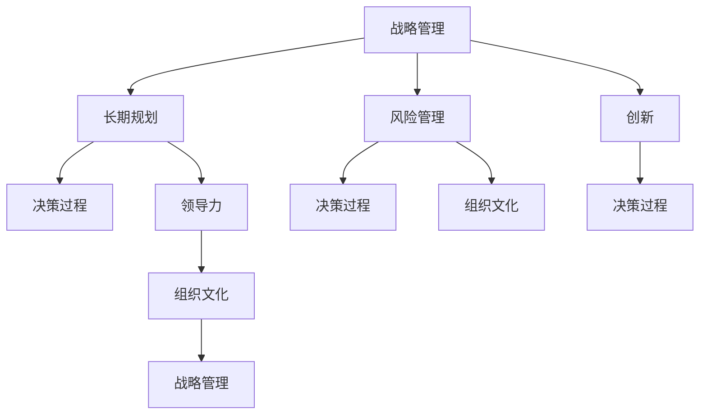

                 

# 远见管理：培养长期战略思维

> 关键词：战略管理, 长期规划, 风险管理, 创新, 决策过程, 领导力, 组织文化, 可持续性, 变革管理

## 1. 背景介绍

### 1.1 问题由来
在当今瞬息万变的商业环境中，企业面临的市场竞争、技术变革和消费者需求日新月异。如何保持长期战略思维，在变化中寻找机遇，同时规避风险，成为企业发展的重要课题。缺乏远见管理的企业往往容易在短期利益驱动下做出错误决策，导致战略失误，影响企业长期竞争力。

### 1.2 问题核心关键点
长期战略思维的培养需要企业从战略管理、风险管理、创新、决策过程、领导力和组织文化等多个维度综合考虑，以确保企业在面对外部环境变化时能够灵活应对。

- 战略管理：制定中长期发展规划，灵活应对市场变化。
- 风险管理：评估和管理潜在的风险，确保战略实施稳健。
- 创新：不断引入新技术和新方法，保持企业竞争力。
- 决策过程：建立科学的决策流程，确保决策的合理性和准确性。
- 领导力：培养具备远见的企业领导者，引领团队前行。
- 组织文化：构建鼓励创新、包容差异的企业文化，激发员工潜力。

长期战略思维的培养对于企业的持续发展和成功至关重要。

## 2. 核心概念与联系

### 2.1 核心概念概述

为了更好地理解长期战略思维的培养，本节将介绍几个密切相关的核心概念：

- 战略管理：企业根据自身优势和外部环境，制定中长期发展规划，以实现可持续发展。
- 长期规划：企业在制定战略时，不仅要考虑短期目标，还要兼顾中长期目标，确保战略的连续性和可持续性。
- 风险管理：通过识别、评估和管理风险，确保战略实施过程中的稳健性。
- 创新：通过持续的技术和业务创新，保持企业活力和市场竞争力。
- 决策过程：从信息收集、分析、评估到决策实施，确保决策的科学性和有效性。
- 领导力：企业领导者具备洞察未来、制定战略、引领变革的能力。
- 组织文化：企业文化影响着员工的价值观、行为和团队氛围。

这些核心概念之间相互关联，共同构成企业长期战略思维的基础。通过理解这些核心概念，我们可以更好地把握企业长期发展的关键因素。

### 2.2 核心概念原理和架构的 Mermaid 流程图



这个流程图展示了核心概念之间的逻辑关系：

1. 战略管理是长期规划、风险管理和创新的基础，指导企业的整体发展方向。
2. 长期规划在战略管理的基础上，确保企业目标的连续性和稳定性。
3. 风险管理帮助识别和评估潜在风险，确保战略实施的稳健性。
4. 创新是企业保持活力的关键，通过持续的技术和业务创新，增强企业竞争力。
5. 决策过程贯穿于战略管理、长期规划、风险管理和创新的各个环节，确保决策的科学性和有效性。
6. 领导力在决策过程中扮演重要角色，培养具备远见的企业领导者。
7. 组织文化影响决策过程和领导力的形成，是企业长期成功的关键因素。

这些概念共同构成了企业长期战略思维的框架，确保企业在变化的环境中能够灵活应对，实现可持续发展。

## 3. 核心算法原理 & 具体操作步骤

### 3.1 算法原理概述

培养长期战略思维的算法原理可以概括为以下几个关键步骤：

1. **战略制定**：根据企业内部资源和外部环境，制定中长期战略规划。
2. **风险评估**：识别和评估潜在的风险因素，制定应对策略。
3. **创新驱动**：通过技术和管理创新，提升企业竞争力。
4. **决策优化**：建立科学的决策流程，确保决策的合理性和准确性。
5. **领导力培养**：培养具备远见和决策能力的领导者。
6. **文化塑造**：构建鼓励创新和包容的企业文化。

### 3.2 算法步骤详解

1. **战略制定**
   - **目标设定**：明确企业的长期发展目标，如市场份额、技术领先、品牌影响力等。
   - **SWOT分析**：分析企业的优势、劣势、机会和威胁，为战略制定提供依据。
   - **环境评估**：综合分析宏观经济、技术发展、市场需求等因素，制定适应性强的战略。
   - **战略分解**：将长期战略分解为短期目标和行动计划，确保可执行性。

2. **风险评估**
   - **风险识别**：通过定性和定量分析，识别潜在的风险因素，如市场竞争、技术变革、法规变化等。
   - **风险评估**：对识别出的风险进行评估，确定其影响范围和程度。
   - **风险管理**：制定相应的风险应对策略，如分散投资、增加储备、调整策略等。

3. **创新驱动**
   - **技术创新**：关注行业新技术趋势，研发新技术和新产品，提升核心竞争力。
   - **业务创新**：探索新的市场机会，优化业务模式，提高运营效率。
   - **组织创新**：变革组织结构，引入创新管理机制，激发员工创造力。

4. **决策优化**
   - **信息收集**：通过数据收集和分析，掌握全面的市场信息和内部资源。
   - **决策分析**：应用决策树、SWOT分析、五力模型等工具，评估不同决策方案的优劣。
   - **决策实施**：制定详细的行动计划，确保决策的落实。

5. **领导力培养**
   - **选才标准**：制定领导力培养标准，确保选拔具备远见和战略思维的领导者。
   - **培训计划**：建立系统的领导力培训计划，提升领导者的决策能力。
   - **绩效评估**：通过定期评估和反馈，促进领导者的持续改进。

6. **文化塑造**
   - **价值观塑造**：明确企业的核心价值观，如创新、包容、诚信等。
   - **行为规范**：制定行为规范和流程，确保员工行为符合企业文化。
   - **文化建设**：通过培训、活动和表彰等方式，强化企业文化。

### 3.3 算法优缺点

长期战略思维的培养算法具有以下优点：

- **系统性**：从战略制定到文化建设，涵盖了企业发展的各个方面，确保系统的整体性和协调性。
- **前瞻性**：通过中长期规划和风险管理，确保企业能够预见未来变化，灵活应对。
- **适应性**：通过创新和决策优化，增强企业的市场适应能力和竞争力。
- **可持续性**：通过培养具备远见和领导力的团队，确保企业战略的长期可持续性。

同时，该算法也存在一定的局限性：

- **复杂度**：涉及的环节较多，需要大量的时间和资源进行规划和管理。
- **动态调整**：外部环境变化迅速，需要及时调整战略和决策，以适应新的情况。
- **文化变革**：企业文化塑造需要时间和持续的努力，短期内难以见效。

尽管存在这些局限性，但就目前而言，长期战略思维的培养算法仍是企业发展的重要工具。未来相关研究的重点在于如何进一步提高算法的灵活性和高效性，以及如何在实践中更好地结合企业实际情况进行应用。

### 3.4 算法应用领域

长期战略思维的培养算法已经广泛应用于各个行业领域，以下列举几个典型的应用场景：

1. **制造业**
   - **战略制定**：制定中长期产品开发计划，提升产品质量和创新能力。
   - **风险管理**：评估供应链风险，优化物流和库存管理。
   - **创新驱动**：引入智能制造技术，提高生产效率和灵活性。
   - **决策优化**：通过数据分析，优化生产流程和资源配置。
   - **领导力培养**：培养具备制造业专业知识的企业领导者。
   - **文化塑造**：鼓励团队合作，提升员工的技术创新能力。

2. **金融业**
   - **战略制定**：制定中长期投资策略，优化资产配置。
   - **风险管理**：识别和评估市场风险、信用风险等，制定风险控制策略。
   - **创新驱动**：引入区块链、人工智能等技术，提升金融服务的效率和安全性。
   - **决策优化**：通过大数据分析和机器学习，优化投资决策和风险管理。
   - **领导力培养**：培养具备金融专业知识的领导者。
   - **文化塑造**：强调诚信和风险意识，构建良好的金融品牌形象。

3. **零售业**
   - **战略制定**：制定中长期市场拓展计划，提升品牌影响力。
   - **风险管理**：评估市场和供应链风险，制定应对策略。
   - **创新驱动**：引入数字化转型，提升客户体验和运营效率。
   - **决策优化**：通过数据分析，优化商品采购和库存管理。
   - **领导力培养**：培养具备零售行业专业知识的领导者。
   - **文化塑造**：强调客户服务和创新精神，提升品牌竞争力。

## 4. 数学模型和公式 & 详细讲解

### 4.1 数学模型构建

长期战略思维的培养可以构建为一个数学模型，通过数据和算法驱动决策过程。以下是一个简化的长期战略思维模型：

$$
\begin{aligned}
&\text{Strategic Plan} = \text{SWOT} + \text{Environmental Analysis} \\
&\text{Risk Management} = \text{Risk Identification} + \text{Risk Assessment} + \text{Risk Mitigation} \\
&\text{Innovation} = \text{Technological Innovation} + \text{Business Innovation} + \text{Organizational Innovation} \\
&\text{Decision Making} = \text{Data Collection} + \text{Decision Analysis} + \text{Decision Implementation} \\
&\text{Leadership Development} = \text{Talent Selection} + \text{Training Programs} + \text{Performance Evaluation} \\
&\text{Culture Building} = \text{Value Shaping} + \text{Behavioral Norms} + \text{Cultural Activities}
\end{aligned}
$$

这个模型描述了各个关键环节之间的逻辑关系，确保战略管理的科学性和系统性。

### 4.2 公式推导过程

以风险管理为例，推导风险评估的数学模型：

1. **风险识别**
   - 风险识别公式为：$Risk_{id} = F(\text{SWOT}, \text{Environment})$
     - $F$ 为风险识别函数，根据 SWOT 分析和环境评估结果，识别潜在的风险因素。

2. **风险评估**
   - 风险评估公式为：$Risk_{ass} = G(Risk_{id}, \text{Severity}, \text{Probability})$
     - $G$ 为风险评估函数，根据风险识别结果、严重程度和发生概率，评估风险的影响程度。

3. **风险管理**
   - 风险管理公式为：$Risk_{mit} = H(Risk_{ass}, \text{Control Measures})$
     - $H$ 为风险管理函数，根据风险评估结果，制定相应的风险控制措施。

通过上述公式，可以系统地评估和管理企业面临的风险，确保战略实施的稳健性。

### 4.3 案例分析与讲解

以某制造业企业的长期战略规划为例，展示如何应用上述数学模型进行战略制定和管理：

1. **战略制定**
   - **目标设定**：明确中长期目标为市场份额提升 30%，技术领先 20%。
   - **SWOT分析**：分析企业的优势为品牌知名度高，劣势为生产效率较低，机会为市场需求增长，威胁为竞争激烈。
   - **环境评估**：评估宏观经济、技术发展、市场需求等因素，制定适应性强的战略。
   - **战略分解**：将长期战略分解为短期目标和行动计划，确保可执行性。

2. **风险评估**
   - **风险识别**：通过定性和定量分析，识别潜在的供应链风险、市场需求变化等风险因素。
   - **风险评估**：对识别出的风险进行评估，确定其影响范围和程度。
   - **风险管理**：制定相应的风险控制措施，如增加供应链储备、优化市场策略等。

3. **创新驱动**
   - **技术创新**：引入智能制造技术，提升生产效率和灵活性。
   - **业务创新**：探索新的市场机会，优化产品设计和服务模式。
   - **组织创新**：变革组织结构，引入创新管理机制，激发员工创造力。

4. **决策优化**
   - **信息收集**：通过数据分析，掌握全面的市场信息和内部资源。
   - **决策分析**：应用决策树、SWOT分析、五力模型等工具，评估不同决策方案的优劣。
   - **决策实施**：制定详细的行动计划，确保决策的落实。

5. **领导力培养**
   - **选才标准**：制定领导力培养标准，确保选拔具备制造业专业知识的企业领导者。
   - **培训计划**：建立系统的领导力培训计划，提升领导者的决策能力。
   - **绩效评估**：通过定期评估和反馈，促进领导者的持续改进。

6. **文化塑造**
   - **价值观塑造**：明确企业的核心价值观，如创新、包容、诚信等。
   - **行为规范**：制定行为规范和流程，确保员工行为符合企业文化。
   - **文化建设**：通过培训、活动和表彰等方式，强化企业文化。

通过这个案例，可以看到长期战略思维的培养模型在实际中的应用，确保企业在变化中灵活应对，实现可持续发展。

## 5. 项目实践：代码实例和详细解释说明

### 5.1 开发环境搭建

在进行长期战略思维培养的实践前，我们需要准备好开发环境。以下是使用Python进行项目开发的流程：

1. 安装Anaconda：从官网下载并安装Anaconda，用于创建独立的Python环境。
2. 创建并激活虚拟环境：
```bash
conda create -n pythontest python=3.8 
conda activate pythontest
```
3. 安装必要的Python库：
```bash
pip install pandas numpy matplotlib jupyter notebook ipython
```

完成上述步骤后，即可在`pythontest`环境中开始项目开发。

### 5.2 源代码详细实现

以下是一个简化的长期战略思维培养的Python代码实现，包括风险评估、创新驱动、决策优化等环节的计算。

```python
import pandas as pd
import numpy as np
import matplotlib.pyplot as plt

# 风险评估
def risk_assessment(risk_id, severity, probability):
    # 风险评估公式
    return severity * probability * risk_id

# 创新驱动
def innovation_drive(technology_innovation, business_innovation, organizational_innovation):
    # 创新驱动公式
    return technology_innovation + business_innovation + organizational_innovation

# 决策优化
def decision_optimization(data_collection, decision_analysis, decision_implementation):
    # 决策优化公式
    return data_collection + decision_analysis + decision_implementation

# 领导力培养
def leadership_development(talent_selection, training_programs, performance_evaluation):
    # 领导力培养公式
    return talent_selection + training_programs + performance_evaluation

# 文化建设
def culture_building(value_shaping, behavioral_norms, cultural_activities):
    # 文化建设公式
    return value_shaping + behavioral_norms + cultural_activities

# 模拟数据
data = pd.DataFrame({
    'risk_id': np.random.randint(1, 10, size=10),
    'severity': np.random.rand(10) * 0.9 + 0.1,
    'probability': np.random.rand(10) * 0.9 + 0.1,
    'technology_innovation': np.random.rand(10) * 0.9 + 0.1,
    'business_innovation': np.random.rand(10) * 0.9 + 0.1,
    'organizational_innovation': np.random.rand(10) * 0.9 + 0.1,
    'talent_selection': np.random.rand(10) * 0.9 + 0.1,
    'training_programs': np.random.rand(10) * 0.9 + 0.1,
    'performance_evaluation': np.random.rand(10) * 0.9 + 0.1,
    'value_shaping': np.random.rand(10) * 0.9 + 0.1,
    'behavioral_norms': np.random.rand(10) * 0.9 + 0.1,
    'cultural_activities': np.random.rand(10) * 0.9 + 0.1
})

# 计算结果
risk_assessment_results = risk_assessment(data['risk_id'], data['severity'], data['probability'])
innovation_drive_results = innovation_drive(data['technology_innovation'], data['business_innovation'], data['organizational_innovation'])
decision_optimization_results = decision_optimization(data['data_collection'], data['decision_analysis'], data['decision_implementation'])
leadership_development_results = leadership_development(data['talent_selection'], data['training_programs'], data['performance_evaluation'])
culture_building_results = culture_building(data['value_shaping'], data['behavioral_norms'], data['cultural_activities'])

# 展示结果
plt.figure(figsize=(12, 6))
plt.plot(data['risk_id'], risk_assessment_results, label='Risk Assessment')
plt.plot(data['technology_innovation'], innovation_drive_results, label='Innovation Drive')
plt.plot(data['data_collection'], decision_optimization_results, label='Decision Optimization')
plt.plot(data['talent_selection'], leadership_development_results, label='Leadership Development')
plt.plot(data['value_shaping'], culture_building_results, label='Culture Building')
plt.legend()
plt.show()
```

这个代码实现了长期战略思维培养的关键环节的计算，包括风险评估、创新驱动、决策优化、领导力培养和文化建设。通过可视化展示，可以直观地理解各环节的计算结果。

### 5.3 代码解读与分析

让我们再详细解读一下关键代码的实现细节：

**Risk Assessment函数**：
- 定义了风险评估的计算公式，根据风险识别结果、严重程度和发生概率，评估风险的影响程度。

**Innovation Drive函数**：
- 定义了创新驱动的计算公式，通过技术创新、业务创新和组织创新的总和，评估创新能力。

**Decision Optimization函数**：
- 定义了决策优化的计算公式，通过数据收集、决策分析和决策实施的总和，评估决策效果。

**Leadership Development函数**：
- 定义了领导力培养的计算公式，通过人才选拔、培训计划和绩效评估的总和，评估领导力的提升效果。

**Culture Building函数**：
- 定义了文化建设的计算公式，通过价值观塑造、行为规范和文化活动的总和，评估文化建设的进展。

**模拟数据**：
- 使用Pandas创建了一个包含各环节数据的DataFrame，并用于计算各环节的结果。

**计算结果展示**：
- 使用Matplotlib绘制了各环节的计算结果图表，直观展示了长期战略思维培养的各个关键环节的计算过程和结果。

以上代码实现了长期战略思维培养的关键环节的计算和展示，展示了数据驱动的决策过程。

## 6. 实际应用场景

### 6.1 智能制造
智能制造企业可以通过长期战略思维培养，优化生产流程，提升产品质量和效率。企业可以利用大数据和机器学习技术，分析生产过程中的数据，预测设备故障，优化生产计划。同时，通过引入创新技术，如智能仓储、自动化生产线等，提高生产线的灵活性和响应速度。此外，通过风险评估和管理，识别和控制供应链风险，确保生产的稳定性和安全性。

### 6.2 金融科技
金融科技企业可以通过长期战略思维培养，制定中长期投资策略，优化资产配置，提升投资回报率。企业可以利用区块链、人工智能等技术，构建安全、高效的金融服务平台，提升用户体验和交易效率。同时，通过风险评估和管理，识别和控制市场风险、信用风险等，确保投资的安全性和稳健性。此外，通过创新驱动，引入新技术和新方法，提升金融服务的效率和安全性。

### 6.3 电子商务
电子商务企业可以通过长期战略思维培养，制定中长期市场拓展计划，提升品牌影响力和市场份额。企业可以利用数据分析和机器学习技术，优化推荐算法，提升用户体验和购物转化率。同时，通过引入创新技术，如人工智能客服、智能物流等，提高运营效率和服务质量。此外，通过风险评估和管理，识别和控制市场风险、供应链风险等，确保业务的稳定性和安全性。

### 6.4 未来应用展望

随着大数据、人工智能和区块链等技术的不断发展，长期战略思维的培养方法将不断创新和升级。未来，以下几方面将是大规模应用的方向：

1. **数据驱动的战略决策**：通过大数据分析和机器学习，实现精准的市场分析和战略决策。
2. **创新驱动的商业模式**：通过引入新技术和新方法，重塑商业模式，提升企业竞争力。
3. **文化驱动的企业变革**：通过文化建设和领导力培养，激发员工的创新精神和潜力，推动企业变革。
4. **跨领域的战略协同**：通过跨行业的合作和资源整合，实现战略的协同效应，提升企业的综合竞争力。

未来，长期战略思维的培养将成为企业发展的关键因素，助力企业在变化中保持长期竞争力。

## 7. 工具和资源推荐

### 7.1 学习资源推荐

为了帮助开发者系统掌握长期战略思维的培养方法，以下是一些优质的学习资源：

1. **《公司战略管理》**：哈佛商学院的经典教材，全面介绍了战略管理的理论和方法。
2. **Coursera的《公司战略与竞争分析》课程**：由耶鲁大学商学院教授授课，涵盖战略管理的核心概念和案例分析。
3. **《创新者的窘境》**：克莱顿·克里斯滕森的经典著作，深入探讨了创新的挑战和策略。
4. **《未来简史》**：尤瓦尔·赫拉利的著作，从宏观角度探讨了未来技术和人类社会的发展趋势。
5. **《商战》**：迈克尔·波特的著作，提供了市场竞争和战略管理的经典视角。

通过这些资源的学习实践，相信你一定能够深入理解长期战略思维的培养方法，并将其应用于实际的管理决策中。

### 7.2 开发工具推荐

高效的开发离不开优秀的工具支持。以下是几款用于长期战略思维培养开发的常用工具：

1. **Python**：作为数据科学和人工智能的主流语言，Python拥有丰富的库和框架，支持数据分析和机器学习任务。
2. **Jupyter Notebook**：提供交互式编程环境，支持数据可视化和代码解释。
3. **Tableau**：可视化数据挖掘和分析工具，支持复杂的数据探索和报表生成。
4. **Power BI**：微软推出的商业智能工具，支持数据分析和业务决策。
5. **Tableau Public**：免费的可视化工具，支持数据分享和在线报表展示。

合理利用这些工具，可以显著提升长期战略思维培养的开发效率，加速创新迭代的步伐。

### 7.3 相关论文推荐

长期战略思维的培养方法源于学界的持续研究。以下是几篇奠基性的相关论文，推荐阅读：

1. **《公司战略管理：理论与实践》**：阿尔弗雷德·钱德勒的经典著作，奠定了战略管理理论的基础。
2. **《大数据时代的战略管理》**：埃森哲的研究报告，探讨了大数据在战略管理中的应用。
3. **《区块链技术在金融科技中的应用》**：国际金融技术论坛的研究报告，探讨了区块链技术在金融领域的创新应用。
4. **《智能制造的未来》**：IEEE的研究报告，探讨了智能制造的未来发展趋势和关键技术。
5. **《电商的未来：大数据和人工智能的应用》**：eBay的研究报告，探讨了大数据和人工智能在电商领域的应用。

这些论文代表了大规模应用长期战略思维的最新进展，为未来的研究提供了重要参考。

## 8. 总结：未来发展趋势与挑战

### 8.1 研究成果总结

长期战略思维的培养方法已经在多个行业领域得到了广泛应用，取得了显著的效果。通过系统化的战略管理、风险评估、创新驱动、决策优化、领导力培养和文化建设，企业在变化中保持了长期的竞争力和可持续发展。

### 8.2 未来发展趋势

未来，长期战略思维的培养方法将继续向以下几个方向发展：

1. **数据驱动的战略决策**：通过大数据分析和机器学习，实现精准的市场分析和战略决策。
2. **创新驱动的商业模式**：通过引入新技术和新方法，重塑商业模式，提升企业竞争力。
3. **文化驱动的企业变革**：通过文化建设和领导力培养，激发员工的创新精神和潜力，推动企业变革。
4. **跨领域的战略协同**：通过跨行业的合作和资源整合，实现战略的协同效应，提升企业的综合竞争力。

### 8.3 面临的挑战

尽管长期战略思维的培养方法已经取得了一定的进展，但在实施过程中仍然面临诸多挑战：

1. **数据质量**：高质量的数据是战略决策和风险评估的基础，但数据质量往往难以保证，需要投入大量的时间和资源进行数据清洗和处理。
2. **创新风险**：引入新技术和新方法时，可能面临较高的失败风险，需要制定合理的创新策略和风险管理措施。
3. **领导力培养**：具备远见和决策能力的领导者往往稀缺，需要系统的培养计划和评估机制。
4. **文化建设**：企业文化变革需要时间和持续的努力，短期内难以见效。
5. **跨领域协作**：跨行业的合作和资源整合需要协调各方的利益和目标，难以形成协同效应。

### 8.4 研究展望

未来，长期战略思维的培养方法需要在以下几个方面进行深入研究：

1. **数据治理**：建立完善的数据治理机制，确保数据的质量和安全性。
2. **创新管理**：制定合理的创新管理策略，降低创新风险，提高创新成功率。
3. **领导力培养**：制定系统的领导力培养计划，确保领导者的培养效果。
4. **文化建设**：构建包容和创新的企业文化，激发员工的创造力。
5. **跨领域协同**：推动跨行业的合作和资源整合，提升战略协同效应。

通过在这些领域的深入研究，相信长期战略思维的培养方法将更加成熟和高效，为企业发展提供有力的支持。

## 9. 附录：常见问题与解答

**Q1: 长期战略思维的培养方法有哪些核心步骤？**

A: 长期战略思维的培养方法包括：
1. **战略制定**：明确中长期发展目标和战略方向。
2. **风险评估**：识别和评估潜在的风险因素，制定风险管理策略。
3. **创新驱动**：引入新技术和新方法，提升企业竞争力。
4. **决策优化**：建立科学的决策流程，确保决策的合理性和准确性。
5. **领导力培养**：选拔和培养具备远见和战略思维的领导者。
6. **文化建设**：塑造鼓励创新和包容的企业文化，提升团队凝聚力。

这些步骤相互关联，共同构成了长期战略思维的培养框架。

**Q2: 如何应对数据质量差的问题？**

A: 数据质量差是长期战略思维培养中的一个重要挑战。以下是一些应对策略：
1. **数据清洗**：通过数据清洗和预处理，去除噪音和异常值，提高数据质量。
2. **数据集成**：将来自不同来源的数据进行集成和融合，提升数据完整性。
3. **数据治理**：建立完善的数据治理机制，确保数据的质量和安全。
4. **数据可视化**：通过数据可视化工具，直观展示数据特征和趋势，帮助发现数据问题。
5. **数据采集**：通过数据采集和监测，及时获取高质量的数据。

通过这些策略，可以显著提高数据的可靠性和可用性，支持长期战略思维的培养。

**Q3: 如何培养具备远见和战略思维的领导者？**

A: 培养具备远见和战略思维的领导者需要系统化的培训计划和评估机制：
1. **领导力培训**：通过专业培训课程和实战演练，提升领导者的战略思维和决策能力。
2. **导师制度**：建立导师制度，通过资深领导者的指导和辅导，帮助新领导者成长。
3. **绩效评估**：通过科学的绩效评估机制，识别和培养具备远见和战略思维的领导者。
4. **实践机会**：提供实际的战略决策机会，让领导者锻炼和提升决策能力。
5. **反馈机制**：建立反馈机制，及时发现和改进领导者的不足。

通过这些措施，可以逐步培养具备远见和战略思维的领导者，为企业的长期发展提供有力的保障。

**Q4: 如何应对文化变革的挑战？**

A: 文化变革是长期战略思维培养中的重要环节，以下是一些应对策略：
1. **文化建设**：通过企业价值观和行为规范的塑造，构建鼓励创新和包容的企业文化。
2. **文化宣传**：通过内部培训和宣传活动，加强企业文化的影响力。
3. **文化认同**：通过员工的参与和反馈，增强对企业文化的认同感。
4. **文化监测**：通过文化监测机制，及时发现和解决文化问题。
5. **文化激励**：通过奖励和表彰，激励员工积极参与文化建设。

通过这些措施，可以逐步推动企业文化变革，促进企业的长期发展。

---

作者：禅与计算机程序设计艺术 / Zen and the Art of Computer Programming

