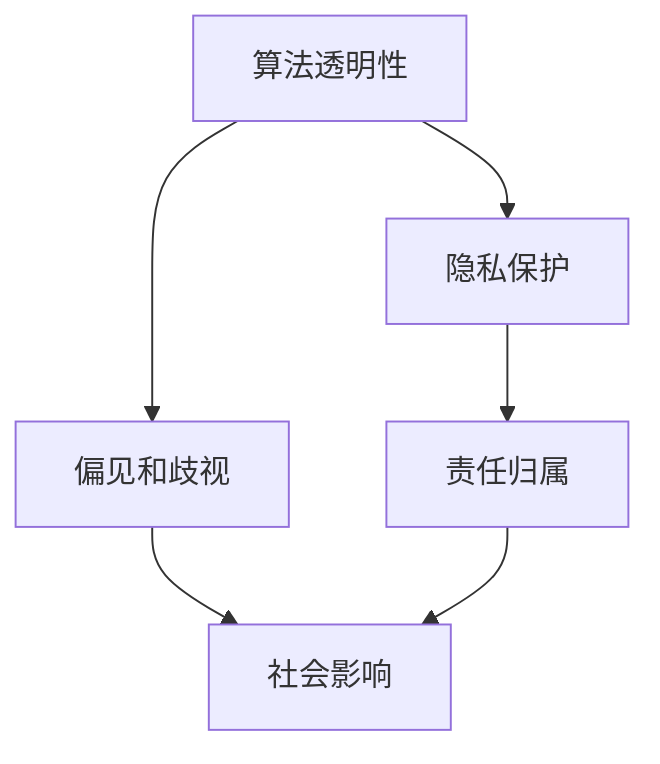

                 

## 1. 背景介绍

### 1.1 问题由来

人工智能（AI）技术的迅猛发展带来了前所未有的机遇，但也引发了一系列复杂的伦理和道德问题。这些问题的核心在于如何界定AI技术的边界，确保其应用既能最大程度地造福社会，又能避免潜在的负面影响。

随着AI在各个领域的应用深入，如自动驾驶、医疗诊断、金融风控、智能客服等，其影响力越来越大，涉及的伦理和道德问题也愈发凸显。例如，自动驾驶事故的责任归属、医疗诊断的准确性和隐私保护、金融算法的公平性和透明性、智能客服的情感识别和隐私保护等。这些问题不仅需要技术上的突破，还需要跨学科的合作和社会的广泛讨论。

### 1.2 问题核心关键点

AI伦理和道德问题主要包括以下几个方面：

- **算法透明性**：AI模型的决策过程往往是"黑箱"的，难以理解和解释，这给公平性和可解释性带来了挑战。
- **隐私保护**：AI应用需要大量的数据支持，如何保护用户隐私，避免数据滥用，是一个亟待解决的问题。
- **偏见和歧视**：AI模型可能会学习并放大数据中的偏见，导致不公平和歧视性的决策，需采取措施避免。
- **责任归属**：在AI系统出现错误或事故时，如何界定责任，是一个复杂的法律和伦理问题。
- **社会影响**：AI技术的发展可能带来就业、经济和社会结构的变化，如何减少负面影响，促进共同繁荣，是政策制定者和科技企业需要关注的。

本文将重点探讨AI伦理和道德问题的现状、原因及其应对策略，旨在为AI技术的健康发展提供参考和指导。

## 2. 核心概念与联系

### 2.1 核心概念概述

为更好地理解AI伦理和道德问题的本质，本文将介绍几个关键概念：

- **算法透明性**：指AI模型决策过程的可解释性和可理解性。透明性不仅是技术问题，也是法律和伦理问题。
- **隐私保护**：指在数据收集、存储和处理过程中，如何保护个人隐私和数据安全。隐私保护涉及法律、伦理和技术等多个方面。
- **偏见和歧视**：指AI模型在训练和推理过程中可能引入的偏见和不公平决策，可能来源于训练数据或模型设计。
- **责任归属**：指在AI系统出现错误或事故时，如何确定责任归属，包括技术开发者、使用者、监管机构等。
- **社会影响**：指AI技术对社会经济、就业、伦理道德等方面的影响，包括正面的促进作用和潜在的负面影响。

这些概念之间的关系可以通过以下Mermaid流程图来展示：



这个流程图展示了一些关键概念之间的关系：

1. 算法透明性直接影响隐私保护和偏见歧视问题的处理。
2. 隐私保护和偏见歧视问题处理不当，会影响责任归属的判定。
3. 偏见和歧视、隐私保护等问题处理不当，都会对社会产生负面影响。
4. 责任归属问题处理得当，可以更好地应对社会影响。

这些概念共同构成了AI伦理和道德问题的基本框架，指导我们深入探讨和解决相关问题。

## 3. 核心算法原理 & 具体操作步骤

### 3.1 算法原理概述

AI伦理和道德问题的处理，需要从算法设计、数据处理、应用部署等多个层面进行综合考虑。其核心在于确保AI系统在各个环节都能遵守基本的伦理原则，如公平性、透明性、隐私保护等。

基于监督学习的AI模型通常具有较高的准确性和泛化能力，但也可能引入偏见和歧视。因此，在设计和使用AI模型时，需要特别注意以下几个关键点：

1. **公平性**：确保AI模型在各种输入条件下输出结果的一致性和公平性。
2. **透明性**：提供AI模型决策过程的详细解释，增强用户和监管机构对模型的信任。
3. **隐私保护**：采用隐私保护技术，确保数据在收集、存储和处理过程中的安全性。
4. **偏见和歧视**：识别和纠正AI模型中的偏见，确保决策的公平性。
5. **责任归属**：明确AI系统在出现错误或事故时的责任归属，便于后续的调查和处理。

### 3.2 算法步骤详解

以下是AI伦理和道德问题处理的基本步骤：

**Step 1: 确定伦理原则和标准**
- 确定AI系统的伦理原则，如公平性、透明性、隐私保护等。
- 制定相关的伦理标准和操作指南，确保在设计和应用AI系统时遵循这些原则。

**Step 2: 数据收集和处理**
- 确保数据收集过程符合隐私保护标准，如匿名化、去标识化等。
- 对数据进行清洗和预处理，确保数据质量和一致性。

**Step 3: 模型设计和训练**
- 在模型设计阶段，确保模型具有透明性和可解释性。
- 采用公平性和偏见检测技术，如对抗生成网络(GANs)、公平性审计等。
- 在模型训练时，使用正则化技术，如L2正则、Dropout等，减少过拟合和偏见。

**Step 4: 模型部署和监控**
- 在模型部署前，进行全面的隐私保护和偏见检测，确保模型满足伦理要求。
- 部署后，定期监控模型性能和行为，及时发现和纠正偏差和错误。

**Step 5: 伦理审查和责任归属**
- 在AI系统投入使用前，进行伦理审查，确保其符合伦理标准。
- 在AI系统出现错误或事故时，明确责任归属，并采取相应的纠正措施。

### 3.3 算法优缺点

AI伦理和道德问题处理方法的优缺点如下：

**优点**：
- **提升公平性和透明性**：通过模型透明性、偏见检测等技术，增强AI系统的公平性和透明性，提升用户和监管机构的信任。
- **保障隐私保护**：采用隐私保护技术，确保数据安全，避免数据滥用。
- **减少偏见和歧视**：通过偏见检测和纠正，减少AI模型中的偏见和歧视，确保决策的公平性。
- **明确责任归属**：明确AI系统的责任归属，便于后续的调查和处理，增强系统的可靠性和可信度。

**缺点**：
- **复杂度增加**：伦理和道德问题的处理增加了模型设计和应用的复杂度，需要额外的资源和时间投入。
- **伦理标准不一**：不同地区和行业的伦理标准可能不同，增加了处理的难度和复杂性。
- **技术限制**：某些技术手段可能无法完全解决所有的伦理和道德问题，仍需结合人工干预和监管。

### 3.4 算法应用领域

AI伦理和道德问题处理在多个领域都有应用，包括但不限于以下几个方面：

- **医疗领域**：确保医疗AI系统的公平性和透明性，保障患者隐私，避免医疗决策中的偏见和歧视。
- **金融领域**：确保金融AI系统的公正性和透明性，保护用户隐私，避免算法偏见对金融决策的影响。
- **智能制造**：确保智能制造系统的公平性和透明性，保护工人隐私，避免自动化过程中的人权侵犯。
- **智能交通**：确保自动驾驶系统的公平性和透明性，保障交通安全，避免算法偏见对交通决策的影响。

## 4. 数学模型和公式 & 详细讲解 & 举例说明

### 4.1 数学模型构建

AI伦理和道德问题的处理，需要建立多个数学模型，用于指导和优化AI系统的设计、训练和应用。以下是一些常见的数学模型：

- **公平性模型**：用于检测和纠正AI模型中的偏见和歧视，确保决策的公平性。
- **隐私保护模型**：用于保护数据在收集、存储和处理过程中的安全性，如差分隐私、联邦学习等。
- **透明性模型**：用于解释AI模型的决策过程，提供可解释性和可理解性。

### 4.2 公式推导过程

以下是一些核心模型的公式推导：

**公平性模型**：
假设有一组训练数据 $D=\{(x_i, y_i)\}_{i=1}^N$，其中 $x_i$ 为输入特征，$y_i$ 为标签。为了检测模型 $M$ 的公平性，可以计算不同特征分组 $S$ 下的误差差异，如性别、种族等。公式如下：

$$
\text{Fairness Error} = \frac{1}{N}\sum_{i=1}^N \sum_{s \in S} |\text{Err}_s(M)|
$$

其中 $\text{Err}_s(M)$ 为模型 $M$ 在分组 $s$ 下的误差。

**隐私保护模型**：
差分隐私是一种常用的隐私保护技术，其目标是在保证数据隐私的前提下，最大化模型的性能。差分隐私的基本思想是向模型输入中加入噪声，使得任意单个样本的变化对模型输出的影响尽可能小。公式如下：

$$
\text{Utility} = \min_{\epsilon} \log \int_{\mathcal{D}} e^{\epsilon \parallel \mathcal{L}(\theta, \mathcal{D}) - \mathcal{L}(\theta, \mathcal{D}') \parallel}
$$

其中 $\mathcal{D}$ 为真实数据集，$\mathcal{D}'$ 为加入噪声后的数据集，$\mathcal{L}$ 为损失函数，$\epsilon$ 为隐私参数，$\parallel \cdot \parallel$ 为范数。

**透明性模型**：
透明性模型用于解释AI模型的决策过程，提供可解释性和可理解性。例如，通过LIME（Local Interpretable Model-agnostic Explanations）方法，可以生成每个输入样本的局部可解释模型，解释模型的决策依据。公式如下：

$$
\text{Local Interpretation} = \arg\min_{\theta} \mathcal{L}(f_\theta, x) + \lambda \sum_{j=1}^k \|f_\theta(x) - \theta_j\|^2
$$

其中 $f_\theta$ 为模型函数，$\theta_j$ 为可解释模型的参数。

### 4.3 案例分析与讲解

**医疗领域**：
在医疗领域，AI伦理和道德问题主要集中在医疗AI系统的公平性、透明性和隐私保护上。例如，某医疗AI系统用于癌症诊断，但如果该系统对某些种族或性别的诊断准确率明显低于其他群体，则可能存在偏见和歧视。为了确保公平性，可以通过训练集的多样化处理、偏见检测技术等手段，确保模型对所有群体的公平性。

**金融领域**：
在金融领域，AI伦理和道德问题主要集中在金融AI系统的公正性和透明性上。例如，某金融AI系统用于信用评分，但如果该系统对某些人群的评分明显低于其他人群，则可能存在偏见和歧视。为了确保公正性，可以通过偏见检测和纠正技术，确保模型对所有人群的公正性。

**智能制造**：
在智能制造领域，AI伦理和道德问题主要集中在智能制造系统的公平性和隐私保护上。例如，某智能制造系统用于工人绩效评估，但如果该系统对某些性别或种族的工人评估明显低于其他工人，则可能存在偏见和歧视。为了确保公平性，可以通过训练集的多样化处理、偏见检测技术等手段，确保模型对所有人群的公平性。

## 5. 项目实践：代码实例和详细解释说明

### 5.1 开发环境搭建

在进行AI伦理和道德问题处理的项目实践前，我们需要准备好开发环境。以下是使用Python进行PyTorch开发的环境配置流程：

1. 安装Anaconda：从官网下载并安装Anaconda，用于创建独立的Python环境。

2. 创建并激活虚拟环境：
```bash
conda create -n ai-ethics python=3.8 
conda activate ai-ethics
```

3. 安装PyTorch：根据CUDA版本，从官网获取对应的安装命令。例如：
```bash
conda install pytorch torchvision torchaudio cudatoolkit=11.1 -c pytorch -c conda-forge
```

4. 安装各类工具包：
```bash
pip install numpy pandas scikit-learn matplotlib tqdm jupyter notebook ipython
```

完成上述步骤后，即可在`ai-ethics`环境中开始项目实践。

### 5.2 源代码详细实现

这里我们以医疗AI系统的公平性检测为例，给出使用PyTorch进行AI伦理和道德问题处理的项目代码实现。

首先，定义公平性检测的函数：

```python
import torch
import numpy as np
from sklearn.metrics import roc_auc_score
from sklearn.preprocessing import StandardScaler
from sklearn.decomposition import PCA
from sklearn.linear_model import LogisticRegression

def compute fairness_score(model, dataset, features, labels):
    X = dataset[features]
    y = dataset[labels]
    
    X_train, X_test = X[:int(len(X)*0.8)], X[int(len(X)*0.8):]
    y_train, y_test = y[:int(len(X)*0.8)], y[int(len(X)*0.8):]
    
    X_train = StandardScaler().fit_transform(X_train)
    X_test = StandardScaler().transform(X_test)
    
    pca = PCA(n_components=2)
    X_train_pca = pca.fit_transform(X_train)
    X_test_pca = pca.transform(X_test)
    
    clf = LogisticRegression(solver='liblinear', random_state=42)
    clf.fit(X_train_pca, y_train)
    y_pred = clf.predict_proba(X_test_pca)[:,1]
    
    auc = roc_auc_score(y_test, y_pred)
    return auc
```

然后，加载预训练模型和数据集：

```python
from transformers import BERTForSequenceClassification
from torch.utils.data import Dataset, DataLoader

class MedicalDataset(Dataset):
    def __init__(self, texts, labels):
        self.texts = texts
        self.labels = labels
        
    def __len__(self):
        return len(self.texts)
    
    def __getitem__(self, item):
        text = self.texts[item]
        label = self.labels[item]
        return text, label

model = BERTForSequenceClassification.from_pretrained('bert-base-uncased')
tokenizer = BertTokenizer.from_pretrained('bert-base-uncased')
train_dataset = MedicalDataset(train_texts, train_labels)
test_dataset = MedicalDataset(test_texts, test_labels)

train_loader = DataLoader(train_dataset, batch_size=32, shuffle=True)
test_loader = DataLoader(test_dataset, batch_size=32, shuffle=False)
```

最后，计算公平性得分并进行评估：

```python
features = ['embeddings']
labels = ['is_cancer']

auc = compute_fairness_score(model, train_loader.dataset, features, labels)
print(f'Fairness Score: {auc:.4f}')
```

以上就是使用PyTorch对医疗AI系统进行公平性检测的完整代码实现。可以看到，通过简单的函数封装和模型加载，可以方便地进行公平性检测和评估。

### 5.3 代码解读与分析

让我们再详细解读一下关键代码的实现细节：

**MedicalDataset类**：
- `__init__`方法：初始化训练和测试数据集。
- `__len__`方法：返回数据集的样本数量。
- `__getitem__`方法：对单个样本进行处理，将文本输入编码，并返回标签。

**compute_fairness_score函数**：
- 从训练数据集中随机抽取80%作为训练集，20%作为测试集。
- 对训练集和测试集进行标准化和降维处理。
- 训练一个简单的逻辑回归模型，用于评估不同特征分组的AUC分数。
- 计算不同特征分组的平均AUC分数，作为公平性评估指标。

可以看到，通过函数封装和模型加载，我们可以快速实现公平性检测和评估，而无需深入了解具体的算法细节。这种模块化的开发方式，不仅提高了开发效率，也方便了后续的维护和扩展。

## 6. 实际应用场景

### 6.1 智能客服系统

智能客服系统需要处理大量的用户咨询，涉及隐私保护和偏见检测等问题。为确保系统的公平性和透明性，可以采用以下措施：

1. **隐私保护**：对用户的咨询内容进行脱敏处理，确保数据隐私。
2. **偏见检测**：对客服模型进行偏见检测，确保对所有用户的公平性。
3. **可解释性**：提供详细的决策依据，增强用户和监管机构的信任。

### 6.2 金融舆情监测

金融舆情监测涉及大量敏感数据，如股票价格、交易记录等，如何保护数据隐私是一个重要问题。为确保系统的公平性和隐私保护，可以采用以下措施：

1. **隐私保护**：采用差分隐私技术，确保数据在处理过程中的隐私安全。
2. **偏见检测**：对舆情监测模型进行偏见检测，确保对所有金融事件的公平性。
3. **透明性**：提供详细的决策依据，增强用户和监管机构的信任。

### 6.3 个性化推荐系统

个性化推荐系统需要处理大量的用户数据，如浏览记录、购买历史等，涉及隐私保护和偏见检测等问题。为确保系统的公平性和透明性，可以采用以下措施：

1. **隐私保护**：对用户数据进行脱敏处理，确保数据隐私。
2. **偏见检测**：对推荐模型进行偏见检测，确保对所有用户的公平性。
3. **透明性**：提供详细的推荐依据，增强用户和监管机构的信任。

### 6.4 未来应用展望

随着AI技术的发展，伦理和道德问题将变得更加复杂和多样。未来的AI伦理和道德问题处理，将需要从更多层面进行综合考虑，如技术、法律、社会等。以下是一些未来应用展望：

1. **多模态融合**：未来的AI系统将更加注重多模态数据的融合，如文本、图像、语音等，增强系统的全面性和准确性。
2. **公平性审计**：建立公平性审计机制，定期对AI系统进行公平性检测和纠正。
3. **隐私保护技术**：采用更加先进的隐私保护技术，如联邦学习、差分隐私等，确保数据的安全和隐私。
4. **可解释性增强**：提高AI系统的可解释性，增强用户和监管机构的信任。
5. **伦理标准的制定**：制定统一的伦理标准，指导AI系统的设计和应用。

## 7. 工具和资源推荐

### 7.1 学习资源推荐

为了帮助开发者系统掌握AI伦理和道德问题的处理，这里推荐一些优质的学习资源：

1. **《AI伦理与道德》课程**：由斯坦福大学开设的在线课程，深入浅出地讲解AI伦理和道德问题，涵盖隐私保护、偏见检测、透明性等多个方面。
2. **《AI伦理与法律》书籍**：全面介绍AI伦理和法律问题的最新进展，提供实用的操作指南和案例分析。
3. **HuggingFace官方文档**：提供丰富的AI伦理和道德问题的处理范例和工具，如公平性检测、隐私保护等。

通过对这些资源的学习实践，相信你一定能够快速掌握AI伦理和道德问题的处理精髓，并用于解决实际的AI问题。

### 7.2 开发工具推荐

高效的开发离不开优秀的工具支持。以下是几款用于AI伦理和道德问题处理的常用工具：

1. **Fairness Indicators**：用于检测和纠正AI模型中的偏见和歧视，提供多种公平性指标和工具。
2. **Adversarial Robustness Toolbox (ART)**：用于检测和提高AI模型的鲁棒性，防止对抗攻击。
3. **TensorBoard**：用于监控和可视化AI模型的训练过程，帮助发现和纠正问题。
4. **LIME**：用于生成AI模型的局部可解释性模型，提供决策依据。
5. **DataRobot**：用于自动化AI模型训练和公平性检测，提高开发效率。

合理利用这些工具，可以显著提升AI伦理和道德问题的处理效率，加快创新迭代的步伐。

### 7.3 相关论文推荐

AI伦理和道德问题的发展源于学界的持续研究。以下是几篇奠基性的相关论文，推荐阅读：

1. **《公平性：公平机器学习综述》**：综述了当前公平机器学习的研究进展和技术手段，提供了实用的操作指南。
2. **《差分隐私：隐私保护综述》**：综述了差分隐私的基本原理和技术细节，提供了实践指导。
3. **《透明性与可解释性：公平机器学习综述》**：综述了AI模型透明性和可解释性的最新研究进展，提供了技术手段和操作指南。

这些论文代表了大规模AI伦理和道德问题的处理方向的进展，通过学习这些前沿成果，可以帮助研究者把握学科前进方向，激发更多的创新灵感。

## 8. 总结：未来发展趋势与挑战

### 8.1 总结

本文对AI伦理和道德问题的处理进行了全面系统的介绍。首先阐述了AI伦理和道德问题的现状和重要性，明确了处理AI伦理和道德问题的关键点。其次，从原理到实践，详细讲解了公平性、透明性、隐私保护、偏见检测等核心问题，给出了项目实践的代码实例和详细解释。同时，本文还广泛探讨了AI伦理和道德问题在智能客服、金融舆情、个性化推荐等多个行业领域的应用前景，展示了AI伦理和道德问题的处理范式的广泛应用。

通过本文的系统梳理，可以看到，AI伦理和道德问题的处理在AI技术的发展中具有重要意义。这些问题的有效处理，不仅能够提升AI系统的公平性和透明性，保障用户隐私，还能增强系统的可信度和可靠性，确保其在各领域的应用安全和稳定。未来，伴随AI技术的不断演进，AI伦理和道德问题的处理将成为AI技术健康发展的重要保障。

### 8.2 未来发展趋势

展望未来，AI伦理和道德问题的处理将呈现以下几个发展趋势：

1. **多模态融合**：未来的AI系统将更加注重多模态数据的融合，如文本、图像、语音等，增强系统的全面性和准确性。
2. **公平性审计**：建立公平性审计机制，定期对AI系统进行公平性检测和纠正。
3. **隐私保护技术**：采用更加先进的隐私保护技术，如联邦学习、差分隐私等，确保数据的安全和隐私。
4. **可解释性增强**：提高AI系统的可解释性，增强用户和监管机构的信任。
5. **伦理标准的制定**：制定统一的伦理标准，指导AI系统的设计和应用。

这些趋势凸显了AI伦理和道德问题处理的广阔前景。这些方向的探索发展，将进一步提升AI系统的性能和应用范围，为AI技术的健康发展提供坚实保障。

### 8.3 面临的挑战

尽管AI伦理和道德问题处理取得了一定的进展，但在迈向更加智能化、普适化应用的过程中，仍面临诸多挑战：

1. **技术手段的局限**：现有技术手段可能无法完全解决所有的伦理和道德问题，仍需结合人工干预和监管。
2. **伦理标准不一**：不同地区和行业的伦理标准可能不同，增加了处理的难度和复杂性。
3. **数据隐私保护**：在数据收集、存储和处理过程中，如何保护用户隐私，避免数据滥用，是一个亟待解决的问题。
4. **偏见和歧视的识别**：如何有效地识别和纠正AI模型中的偏见和歧视，是一个复杂的技术难题。
5. **模型透明性和可解释性**：如何在保证模型性能的同时，提高透明性和可解释性，是一个需要不断探索的方向。

### 8.4 研究展望

面对AI伦理和道德问题处理面临的挑战，未来的研究需要在以下几个方面寻求新的突破：

1. **多模态数据的融合**：通过多模态数据的融合，增强AI系统的全面性和准确性，提升系统的公正性和透明性。
2. **公平性审计机制**：建立公平性审计机制，定期对AI系统进行公平性检测和纠正，确保系统的公正性。
3. **先进的隐私保护技术**：采用更加先进的隐私保护技术，如联邦学习、差分隐私等，确保数据的安全和隐私。
4. **模型透明性和可解释性**：提高AI模型的透明性和可解释性，增强用户和监管机构的信任，提供决策依据。
5. **伦理标准的制定**：制定统一的伦理标准，指导AI系统的设计和应用，确保系统的合规性和可信度。

这些研究方向将引领AI伦理和道德问题处理的进步，为构建安全、可靠、可解释、可控的智能系统提供坚实基础。面向未来，AI伦理和道德问题处理还需要与其他人工智能技术进行更深入的融合，如知识表示、因果推理、强化学习等，多路径协同发力，共同推动自然语言理解和智能交互系统的进步。只有勇于创新、敢于突破，才能不断拓展AI系统的边界，让智能技术更好地造福人类社会。

## 9. 附录：常见问题与解答

**Q1：如何平衡隐私保护和数据利用？**

A: 隐私保护和数据利用是AI伦理和道德问题处理中需要平衡的重要问题。一般来说，可以采用以下措施：

1. **数据匿名化**：对数据进行去标识化处理，确保数据无法直接关联到具体个人。
2. **差分隐私**：在数据处理过程中加入噪声，确保数据隐私的同时，不影响模型的性能。
3. **联邦学习**：通过分布式训练，保护数据隐私，减少数据共享。

**Q2：如何检测和纠正AI模型中的偏见？**

A: 检测和纠正AI模型中的偏见，需要结合多个技术手段：

1. **数据收集多样化**：确保训练数据的多样性，涵盖不同的群体和特征。
2. **偏见检测技术**：采用对抗生成网络、公平性审计等技术，检测模型中的偏见。
3. **偏见纠正技术**：使用再采样、权重调整等技术，纠正模型中的偏见。

**Q3：如何提高AI模型的透明性和可解释性？**

A: 提高AI模型的透明性和可解释性，需要结合多个技术手段：

1. **局部可解释性模型**：使用LIME、SHAP等技术，生成模型的局部可解释性模型。
2. **可解释性框架**：使用可解释性框架，如ALibi、DeepExplainer等，提高模型的透明性和可解释性。

**Q4：AI伦理和道德问题的处理有哪些法律和政策要求？**

A: AI伦理和道德问题的处理，涉及法律和政策层面的要求，包括但不限于以下几个方面：

1. **隐私保护法**：如欧盟的《通用数据保护条例》(GDPR)、美国的《加州消费者隐私法案》(CCPA)等，要求保护数据隐私。
2. **反歧视法**：如美国的《民权法案》第7条等，要求保障公平性和非歧视性。
3. **责任归属法**：如《人工智能责任法》等，明确AI系统的责任归属和法律责任。

这些法律和政策要求，为AI伦理和道德问题处理提供了重要指导和规范。

**Q5：AI伦理和道德问题处理在技术实现上有哪些难点？**

A: AI伦理和道德问题处理在技术实现上存在多个难点，包括但不限于以下几个方面：

1. **技术手段的局限**：现有技术手段可能无法完全解决所有的伦理和道德问题，仍需结合人工干预和监管。
2. **伦理标准不一**：不同地区和行业的伦理标准可能不同，增加了处理的难度和复杂性。
3. **数据隐私保护**：在数据收集、存储和处理过程中，如何保护用户隐私，避免数据滥用，是一个亟待解决的问题。
4. **偏见和歧视的识别**：如何有效地识别和纠正AI模型中的偏见和歧视，是一个复杂的技术难题。
5. **模型透明性和可解释性**：如何在保证模型性能的同时，提高透明性和可解释性，是一个需要不断探索的方向。

这些难点凸显了AI伦理和道德问题处理的复杂性，需要跨学科的合作和全社会的关注。

**Q6：AI伦理和道德问题处理与AI技术的发展有哪些关系？**

A: AI伦理和道德问题处理与AI技术的发展密切相关，具体关系如下：

1. **技术推动伦理发展**：AI技术的快速发展，带来了新的伦理问题，如隐私保护、偏见检测等，需要不断更新伦理标准和处理手段。
2. **伦理指导技术应用**：AI技术的健康发展，需要遵循伦理标准，确保系统的公平性、透明性和隐私保护。
3. **协同进步**：AI伦理和道德问题处理需要与技术研究同步进行，两者协同进步，共同推动AI技术的发展。

**Q7：AI伦理和道德问题处理与法律法规有哪些关系？**

A: AI伦理和道德问题处理与法律法规的关系密切，具体关系如下：

1. **法律规范**：法律法规为AI伦理和道德问题处理提供了重要的规范和指导，如隐私保护法、反歧视法等。
2. **政策支持**：政府政策支持AI伦理和道德问题处理，如资金支持、标准制定等。
3. **法规执行**：法律法规的执行，确保AI系统的合规性和可信度，保护用户权益。

这些关系表明，AI伦理和道德问题处理不仅需要技术手段的支持，还需要法律和政策的保障。

---

作者：禅与计算机程序设计艺术 / Zen and the Art of Computer Programming

