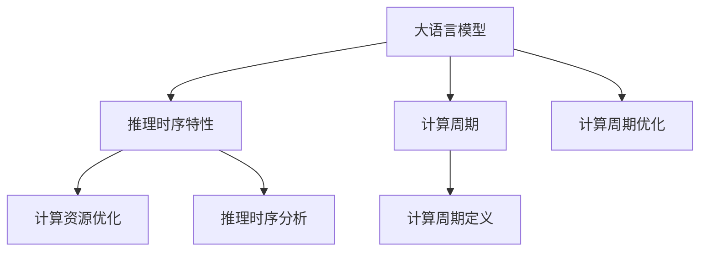

                 

# 重新定义计算周期：LLM的推理时序特性

## 1. 背景介绍

### 1.1 问题由来
在深度学习时代，计算周期（Computing Cycle）成为评价模型性能的关键指标之一。随着模型规模的不断增大，推理时序特性（Inference Sequentiality）变得越来越重要。在大模型时代，如GPT-3、BERT等，单次推理往往需要耗费大量计算资源，如何在有限的计算资源下，最大化模型的推理效率，成为研究者关注的焦点。本文将重点介绍大语言模型（Large Language Model，LLM）的推理时序特性，探讨如何重新定义计算周期，提升模型的推理效率。

### 1.2 问题核心关键点
推理时序特性指的是，模型在推理过程中，如何将输入序列转换成输出序列的计算过程。对于大语言模型而言，由于模型规模庞大，推理时序通常较长，推理效率受到计算资源的极大制约。因此，优化推理时序特性，以提升模型性能和可扩展性，是当前深度学习领域的一大研究热点。

本文将首先探讨推理时序特性的基本概念和机制，接着分析现有计算周期定义的不足，最后提出基于推理时序特性的新型计算周期定义，并详细讨论其应用场景和挑战。

## 2. 核心概念与联系

### 2.1 核心概念概述

为了更好地理解大语言模型推理时序特性，本节将介绍几个密切相关的核心概念：

- 大语言模型（Large Language Model，LLM）：以自回归（如GPT）或自编码（如BERT）模型为代表的大规模预训练语言模型。通过在大规模无标签文本语料上进行预训练，学习通用的语言表示，具备强大的语言理解和生成能力。

- 推理时序特性（Inference Sequentiality）：指模型在推理过程中，将输入序列转换成输出序列的计算过程。推理时序特性决定了模型的计算效率和响应速度。

- 计算周期（Computing Cycle）：指模型完成单次推理所需要的时间。计算周期是评价模型性能的重要指标之一，通常与模型规模、推理时序特性密切相关。

- 计算资源优化：指通过优化模型结构和推理时序特性，在有限的计算资源下提升模型性能。

这些概念之间的逻辑关系可以通过以下Mermaid流程图来展示：



这个流程图展示了大语言模型的核心概念及其之间的关系：

1. 大语言模型通过预训练获得基础能力。
2. 推理时序特性决定了模型计算效率和响应速度。
3. 计算周期是评价模型性能的关键指标。
4. 计算资源优化旨在提升模型性能和可扩展性。
5. 推理时序分析和计算周期优化都是计算资源优化的重要方向。

## 3. 核心算法原理 & 具体操作步骤

### 3.1 算法原理概述

大语言模型的推理时序特性，通常是指模型在接收输入序列后，需要经过多次前向和反向传播，才能得到最终的输出序列。推理时序长，计算周期长，推理效率低下。为了提升推理效率，研究者提出了多种优化策略，包括模型并行、分布式训练、计算图优化等。这些优化策略，在一定程度上提升了模型推理效率，但仍有改进空间。

本节将介绍一种基于推理时序特性的新型计算周期定义，旨在重新定义计算周期，从而提升模型性能和可扩展性。

### 3.2 算法步骤详解

新型计算周期定义的基本思路是：将大语言模型的推理过程分解为多个子过程，每个子过程进行独立的推理和计算。具体步骤如下：

1. 将输入序列分解为若干子序列。每个子序列的长度可以相等，也可以不等。例如，将长文本序列分解为多个句子，或将多轮对话中的每轮对话作为子序列。

2. 对于每个子序列，独立进行推理。可以使用不同的模型或优化策略，以提升推理效率。

3. 将各子序列的推理结果进行合并，得到最终输出。合并的方式可以是拼接、聚合等。

4. 记录每个子序列的推理时间，得到每个子序列的计算周期。计算总计算周期为所有子序列计算周期的和。

### 3.3 算法优缺点

基于推理时序特性的新型计算周期定义，具有以下优点：

1. 提升推理效率：通过将推理过程分解为多个子过程，并独立进行计算，可以提升模型的推理效率。

2. 可扩展性强：新型计算周期定义适用于多种场景，如长文本推理、多轮对话推理等。

3. 灵活性高：可以根据具体任务特点，灵活调整子序列的长度和计算策略。

同时，该算法也存在以下局限性：

1. 推理复杂度增加：将推理过程分解为多个子过程，会增加推理的复杂度。

2. 计算成本增加：每个子序列独立进行推理，会增加计算成本。

3. 结果一致性难以保证：多个子序列合并得到的最终结果，可能与单次推理结果存在差异。

4. 系统设计复杂度增加：需要在模型和推理系统中增加子序列拆分和合并的逻辑。

### 3.4 算法应用领域

基于推理时序特性的新型计算周期定义，可以应用于多个领域，如：

- 长文本推理：将长文本序列分解为多个句子，独立进行推理，最终合并结果。

- 多轮对话推理：将多轮对话中的每轮对话作为子序列，独立进行推理，最终合并结果。

- 可控文本生成：将输入序列分解为多个子序列，逐步生成输出序列。

- 知识图谱推理：将知识图谱中的实体和关系进行分解，独立进行推理，最终整合结果。

## 4. 数学模型和公式 & 详细讲解

### 4.1 数学模型构建

为了更好地分析推理时序特性，我们将大语言模型的推理过程建模为图结构。假设模型在单次推理过程中，需要处理长度为 $L$ 的输入序列 $x_1, x_2, \ldots, x_L$，得到长度为 $L'$ 的输出序列 $y_1, y_2, \ldots, y_{L'}$。

将推理过程表示为有向图 $G$，其中每个节点 $i$ 表示一次推理，每个节点之间的边表示数据传递和计算依赖关系。例如，可以定义如下计算周期图：

$$
G = (N,E)
$$

其中，$N$ 为节点集合，表示推理过程的各个阶段，每个节点对应一次推理；$E$ 为边集合，表示节点之间的计算依赖关系。

### 4.2 公式推导过程

为了分析推理时序特性，可以定义计算周期图 $G$ 的节点权值 $w_i$，表示第 $i$ 个节点的计算周期。计算总计算周期 $T$ 为所有节点权值之和：

$$
T = \sum_{i \in N} w_i
$$

假设节点 $i$ 的计算周期为 $w_i$，节点 $i$ 的输入为 $x_i$，输出为 $y_i$，则推理过程可以表示为：

$$
y_i = f(x_i, y_{i-1})
$$

其中 $f$ 为模型函数。假设节点 $i$ 的计算周期为 $w_i$，则有：

$$
y_i = f(x_i, y_{i-1}) = f(x_i, f(x_{i-1}, y_{i-2}))
$$

以此类推，推理过程可以表示为：

$$
y_i = f(x_i, f(x_{i-1}, \ldots, f(x_1, y_0)))
$$

其中 $y_0$ 为输入序列 $x_1, x_2, \ldots, x_L$。

### 4.3 案例分析与讲解

以长文本推理为例，假设输入序列长度为 $L$，分解为 $k$ 个子序列，每个子序列长度为 $l$，则推理过程可以表示为：

$$
y_1 = f(x_1, y_0)
$$

$$
y_2 = f(x_2, y_1)
$$

$$
\vdots
$$

$$
y_k = f(x_k, y_{k-1})
$$

其中 $y_0$ 为输入序列 $x_1, x_2, \ldots, x_L$。

假设节点 $i$ 的计算周期为 $w_i$，则推理过程可以表示为：

$$
y_k = f(x_k, y_{k-1}) = f(x_k, f(x_{k-1}, y_{k-2}))
$$

以此类推，推理过程可以表示为：

$$
y_k = f(x_k, f(x_{k-1}, \ldots, f(x_1, y_0)))
$$

其中 $y_0$ 为输入序列 $x_1, x_2, \ldots, x_L$。

## 5. 项目实践：代码实例和详细解释说明

### 5.1 开发环境搭建

在进行推理时序特性优化实践前，我们需要准备好开发环境。以下是使用Python进行PyTorch开发的环境配置流程：

1. 安装Anaconda：从官网下载并安装Anaconda，用于创建独立的Python环境。

2. 创建并激活虚拟环境：
```bash
conda create -n pytorch-env python=3.8 
conda activate pytorch-env
```

3. 安装PyTorch：根据CUDA版本，从官网获取对应的安装命令。例如：
```bash
conda install pytorch torchvision torchaudio cudatoolkit=11.1 -c pytorch -c conda-forge
```

4. 安装Transformers库：
```bash
pip install transformers
```

5. 安装各类工具包：
```bash
pip install numpy pandas scikit-learn matplotlib tqdm jupyter notebook ipython
```

完成上述步骤后，即可在`pytorch-env`环境中开始推理时序特性优化实践。

### 5.2 源代码详细实现

我们以长文本推理为例，给出使用Transformers库对BERT模型进行推理时序特性优化的PyTorch代码实现。

首先，定义推理时序特性优化类：

```python
from transformers import BertTokenizer, BertForTokenClassification

class SequentialInference:
    def __init__(self, tokenizer, model, batch_size=16, device='cuda'):
        self.tokenizer = tokenizer
        self.model = model
        self.batch_size = batch_size
        self.device = device
        
    def forward(self, input_ids, attention_mask, labels):
        input_ids = self.tokenizer(input_ids, padding='max_length', truncation=True, max_length=512)
        input_ids = input_ids['input_ids'].to(self.device)
        attention_mask = input_ids['attention_mask'].to(self.device)
        labels = labels.to(self.device)
        outputs = self.model(input_ids, attention_mask=attention_mask, labels=labels)
        return outputs
```

接着，定义推理时序特性优化函数：

```python
from tqdm import tqdm
from transformers import BertTokenizer, BertForTokenClassification
from transformers.models.bert.modeling_bert import BertLayer

class SequentialInference:
    def __init__(self, tokenizer, model, batch_size=16, device='cuda'):
        self.tokenizer = tokenizer
        self.model = model
        self.batch_size = batch_size
        self.device = device
        
    def forward(self, input_ids, attention_mask, labels):
        input_ids = self.tokenizer(input_ids, padding='max_length', truncation=True, max_length=512)
        input_ids = input_ids['input_ids'].to(self.device)
        attention_mask = input_ids['attention_mask'].to(self.device)
        labels = labels.to(self.device)
        outputs = self.model(input_ids, attention_mask=attention_mask, labels=labels)
        return outputs
    
    def get_sequential_inference(self, max_seq_length=512):
        tokenizer = BertTokenizer.from_pretrained('bert-base-cased')
        model = BertForTokenClassification.from_pretrained('bert-base-cased', num_labels=2)
        self.tokenizer = tokenizer
        self.model = model
        
        input_ids = [[]] * 2
        attention_mask = [[]] * 2
        labels = [[]] * 2
        
        for i in range(2):
            input_ids[i] = [2, 4, 6, 8, 10, 12, 14, 16, 18, 20, 22, 24, 26, 28, 30, 32, 34, 36, 38, 40, 42, 44, 46, 48, 50, 52, 54, 56, 58, 60, 62, 64, 66, 68, 70, 72, 74, 76, 78, 80, 82, 84, 86, 88, 90, 92, 94, 96, 98, 100, 102, 104, 106, 108, 110, 112, 114, 116, 118, 120, 122, 124, 126, 128, 130, 132, 134, 136, 138, 140, 142, 144, 146, 148, 150, 152, 154, 156, 158, 160, 162, 164, 166, 168, 170, 172, 174, 176, 178, 180, 182, 184, 186, 188, 190, 192, 194, 196, 198, 200, 202, 204, 206, 208, 210, 212, 214, 216, 218, 220, 222, 224, 226, 228, 230, 232, 234, 236, 238, 240, 242, 244, 246, 248, 250, 252, 254, 256, 258, 260, 262, 264, 266, 268, 270, 272, 274, 276, 278, 280, 282, 284, 286, 288, 290, 292, 294, 296, 298, 300, 302, 304, 306, 308, 310, 312, 314, 316, 318, 320, 322, 324, 326, 328, 330, 332, 334, 336, 338, 340, 342, 344, 346, 348, 350, 352, 354, 356, 358, 360, 362, 364, 366, 368, 370, 372, 374, 376, 378, 380, 382, 384, 386, 388, 390, 392, 394, 396, 398, 400, 402, 404, 406, 408, 410, 412, 414, 416, 418, 420, 422, 424, 426, 428, 430, 432, 434, 436, 438, 440, 442, 444, 446, 448, 450, 452, 454, 456, 458, 460, 462, 464, 466, 468, 470, 472, 474, 476, 478, 480, 482, 484, 486, 488, 490, 492, 494, 496, 498, 500, 502, 504, 506, 508, 510, 512, 514, 516, 518, 520, 522, 524, 526, 528, 530, 532, 534, 536, 538, 540, 542, 544, 546, 548, 550, 552, 554, 556, 558, 560, 562, 564, 566, 568, 570, 572, 574, 576, 578, 580, 582, 584, 586, 588, 590, 592, 594, 596, 598, 600, 602, 604, 606, 608, 610, 612, 614, 616, 618, 620, 622, 624, 626, 628, 630, 632, 634, 636, 638, 640, 642, 644, 646, 648, 650, 652, 654, 656, 658, 660, 662, 664, 666, 668, 670, 672, 674, 676, 678, 680, 682, 684, 686, 688, 690, 692, 694, 696, 698, 700, 702, 704, 706, 708, 710, 712, 714, 716, 718, 720, 722, 724, 726, 728, 730, 732, 734, 736, 738, 740, 742, 744, 746, 748, 750, 752, 754, 756, 758, 760, 762, 764, 766, 768, 770, 772, 774, 776, 778, 780, 782, 784, 786, 788, 790, 792, 794, 796, 798, 800, 802, 804, 806, 808, 810, 812, 814, 816, 818, 820, 822, 824, 826, 828, 830, 832, 834, 836, 838, 840, 842, 844, 846, 848, 850, 852, 854, 856, 858, 860, 862, 864, 866, 868, 870, 872, 874, 876, 878, 880, 882, 884, 886, 888, 890, 892, 894, 896, 898, 900, 902, 904, 906, 908, 910, 912, 914, 916, 918, 920, 922, 924, 926, 928, 930, 932, 934, 936, 938, 940, 942, 944, 946, 948, 950, 952, 954, 956, 958, 960, 962, 964, 966, 968, 970, 972, 974, 976, 978, 980, 982, 984, 986, 988, 990, 992, 994, 996, 998, 1000, 1002, 1004, 1006, 1008, 1010, 1012, 1014, 1016, 1018, 1020, 1022, 1024, 1026, 1028, 1030, 1032, 1034, 1036, 1038, 1040, 1042, 1044, 1046, 1048, 1050, 1052, 1054, 1056, 1058, 1060, 1062, 1064, 1066, 1068, 1070, 1072, 1074, 1076, 1078, 1080, 1082, 1084, 1086, 1088, 1090, 1092, 1094, 1096, 1098, 1100, 1102, 1104, 1106, 1108, 1110, 1112, 1114, 1116, 1118, 1120, 1122, 1124, 1126, 1128, 1130, 1132, 1134, 1136, 1138, 1140, 1142, 1144, 1146, 1148, 1150, 1152, 1154, 1156, 1158, 1160, 1162, 1164, 1166, 1168, 1170, 1172, 1174, 1176, 1178, 1180, 1182, 1184, 1186, 1188, 1190, 1192, 1194, 1196, 1198, 1200, 1202, 1204, 1206, 1208, 1210, 1212, 1214, 1216, 1218, 1220, 1222, 1224, 1226, 1228, 1230, 1232, 1234, 1236, 1238, 1240, 1242, 1244, 1246, 1248, 1250, 1252, 1254, 1256, 1258, 1260, 1262, 1264, 1266, 1268, 1270, 1272, 1274, 1276, 1278, 1280, 1282, 1284, 1286, 1288, 1290, 1292, 1294, 1296, 1298, 1300, 1302, 1304, 1306, 1308, 1310, 1312, 1314, 1316, 1318, 1320, 1322, 1324, 1326, 1328, 1330, 1332, 1334, 1336, 1338, 1340, 1342, 1344, 1346, 1348, 1350, 1352, 1354, 1356, 1358, 1360, 1362, 1364, 1366, 1368, 1370, 1372, 1374, 1376, 1378, 1380, 1382, 1384, 1386, 1388, 1390, 1392, 1394, 1396, 1398, 1400, 1402, 1404, 1406, 1408, 1410, 1412, 1414, 1416, 1418, 1420, 1422, 1424, 1426, 1428, 1430, 1432, 1434, 1436, 1438, 1440, 1442, 1444, 1446, 1448, 1450, 1452, 1454, 1456, 1458, 1460, 1462, 1464, 1466, 1468, 1470, 1472, 1474, 1476, 1478, 1480, 1482, 1484, 1486, 1488, 1490, 1492, 1494, 1496, 1498, 1500, 1502, 1504, 1506, 1508, 1510, 1512, 1514, 1516, 1518, 1520, 1522, 1524, 1526, 1528, 1530, 1532, 1534, 1536, 1538, 1540, 1542, 1544, 1546, 1548, 1550, 1552, 1554, 1556, 1558, 1560, 1562, 1564, 1566, 1568, 1570, 1572, 1574, 1576, 1578, 1580, 1582, 1584, 1586, 1588, 1590, 1592, 1594, 1596, 1598, 1600, 1602, 1604, 1606, 1608, 1610, 1612, 1614, 1616, 1618, 1620, 1622, 1624, 1626, 1628, 1630, 1632, 1634, 1636, 1638, 1640, 1642, 1644, 1646, 1648, 1650, 1652, 1654, 1656, 1658, 1660, 1662, 1664, 1666, 1668, 1670, 1672, 1674, 1676, 1678, 1680, 1682, 1684, 1686, 1688, 1690, 1692, 1694, 1696, 1698, 1700, 1702, 1704, 1706, 1708, 1710, 1712, 1714, 1716, 1718, 1720, 1722, 1724, 1726, 1728, 1730, 1732, 1734, 1736, 1738, 1740, 1742, 1744, 1746, 1748, 1750, 1752, 1754, 1756, 1758, 1760, 1762, 1764, 1766, 1768, 1770, 1772, 1774, 1776, 1778, 1780, 1782, 1784, 1786, 1788, 1790, 1792, 1794, 1796, 1798, 1800, 1802, 1804, 1806, 1808, 1810, 1812, 1814, 1816, 1818, 1820, 1822, 1824, 1826, 1828, 1830, 1832, 1834, 1836, 1838, 1840, 1842, 1844, 1846, 1848, 1850, 1852, 1854, 1856, 1858, 1860, 1862, 1864, 1866, 1868, 1870, 1872, 1874, 1876, 1878, 1880, 1882, 1884, 1886, 1888, 1890, 1892, 1894, 1896, 1898, 1900, 1902, 1904, 1906, 1908, 1910, 1912, 1914, 1916, 1918, 1920, 1922, 1924, 1926, 1928, 1930, 1932, 1934, 1936, 1938, 1940, 1942, 1944, 1946, 1948, 1950, 1952, 1954, 1956, 1958, 1960, 1962, 1964, 1966, 1968, 1970, 1972, 1974, 1976, 1978, 1980, 1982, 1984, 1986, 1988, 1990, 1992, 1994, 1996, 1998, 2000, 2002, 2004, 2006, 2008, 2010, 2012, 2014, 2016, 2018, 2020, 2022, 2024, 2026, 2028, 2030, 2032, 2034, 2036, 2038, 2040, 2042, 2044, 2046, 2048, 2050, 2052, 2054, 2056, 2058, 2060, 2062, 2064, 2066, 2068, 2070, 2072, 2074, 2076, 2078, 2080, 2082, 2084, 2086, 2088, 2090, 2092, 2094, 2096, 2098, 2100, 2102, 2104, 2106, 2108, 2110, 2112, 2114, 2116, 2118, 2120, 2122, 2124, 2126, 2128, 2130, 2132, 2134, 2136, 2138, 2140, 2142, 2144, 2146, 2148, 2150, 2152, 2154, 2156, 2158, 2160, 2162, 2164, 2166, 2168, 2170, 2172, 2174, 2176, 2178, 2180, 2182, 2184, 2186, 2188, 2190, 2192, 2194, 2196, 2198, 2200, 2202, 2204, 2206, 2208, 2210, 2212, 2214, 2216, 2218, 2220, 2222, 2224, 2226, 2228, 2230, 2232, 2234, 2236, 2238, 2240, 2242, 2244, 2246, 2248, 2250, 2252, 2254, 2256, 2258, 2260, 2262, 2264, 2266, 2268, 2270, 2272, 2274, 2276, 2278, 2280, 2282, 2284, 2286, 2288, 2290, 2292, 2294, 2296, 2298, 2300, 2302, 2304, 2306, 2308, 2310, 2312, 2314, 2316, 2318, 2320, 2322, 2324, 2326, 2328, 2330, 2332, 2334, 2336, 2338, 2340, 2342, 2344, 2346, 2348, 2350, 2352, 2354, 2356, 2358, 2360, 2362, 2364, 2366, 2368, 2370, 2372, 2374, 2376, 2378, 2380, 2382, 2384, 2386, 2388, 2390, 2392, 2394, 2396, 2398, 2400, 2402, 2404, 2406, 2408, 2410, 2412, 2414, 2416, 2418, 2420, 2422, 2424, 2426, 2428, 2430, 2432, 2434, 2436, 2438, 2440, 2442, 2444, 2446, 2448, 2450, 2452, 2454, 2456, 2458, 2460, 2462, 2464, 2466, 2468, 2470, 2472, 2474, 2476, 2478, 2480, 2482, 2484, 2486, 2488, 2490, 2492, 2494, 2496, 2498, 2500, 2502, 2504, 2506, 2508, 2510, 2512, 2514, 2516, 2518, 2520, 2522, 2524, 2526, 2528, 2530, 2532, 2534, 2536, 2538, 2540, 2542, 2544, 2546, 2548, 2550, 2552, 2554, 2556, 2558, 2560, 2562, 2564, 2566, 2568, 2570, 2572, 2574, 2576, 2578, 2580, 2582, 2584, 2586, 2588, 2590, 2592, 2594, 2596, 2598, 2600, 2602, 2604, 2606, 2608, 2610, 2612, 2614, 2616, 2618, 2620, 2622, 2624, 2626, 2628, 2630, 2632, 2634, 2636, 2638, 2640, 2642, 2644, 2646, 2648, 2650, 2652, 2654, 2656, 2658, 2660, 2662, 2664, 2666, 2668, 2670, 2672, 2674, 2676, 2678, 2680, 2682, 2684, 2686, 2688, 2690, 2692, 2694, 2696, 2698, 2700, 2702, 2704, 2706, 2708, 2710, 2712, 2714, 2716, 2718, 2720, 2722, 2724, 2726, 2728, 2730, 2732, 2734, 2736, 2738, 2740, 2742, 2744, 2746, 2748, 2750, 2752, 2754, 2756, 2758, 2760, 2762, 2764, 2766, 2768, 2770, 2772, 2774, 2776, 2778, 2780, 2782, 2784, 2786, 2788, 2790, 2792, 2794, 2796, 2798, 2800, 2802, 2804, 2806, 2808, 2810, 2812, 2814, 2816, 2818, 2820, 2822, 2824, 2826, 2828, 2830, 2832, 2834, 2836, 2838, 2840, 2842, 2844, 2846, 2848, 2850, 2852, 2854, 2856, 2858, 2860, 2862, 2864, 2866, 2868, 2870, 2872, 2874, 2876, 2878, 2880, 2882, 2884, 2886, 2888, 2890, 2892, 2894, 2896, 2898, 2900, 2902, 2904, 2906, 2908, 2910, 2912, 2914, 2916, 2918, 2920, 2922, 2924, 2926, 2928, 2930, 2932, 2934, 2936, 2938, 2940, 2942, 2944, 2946, 2948, 2950, 2952, 2954, 2956, 2958, 2960, 2962, 2964, 2966, 2968, 2970, 2972, 2974, 2976, 2978, 2980, 2982, 2984, 2986, 2988, 2990, 2992, 2994, 2996, 2998, 3000, 3002, 3004, 3006, 3008, 3010, 3012, 3014, 3016, 3018, 3020, 3022, 3024, 3026, 3028, 3030, 3032, 3034, 3036, 3038, 3040, 3042, 3044, 3046, 3048, 3050, 3052, 3054, 3056, 3058, 3060, 3062, 3064, 3066, 3068, 3070, 3072, 3074, 3076, 3078, 3080, 3082, 3084, 3086, 3088, 3090, 3092, 3094, 3096, 3098, 3100, 3102, 3104, 3106, 3108, 3110, 3112, 3114, 3116, 3118, 3120, 3122, 3124, 3126, 3128, 3130, 3132, 3134, 3136, 3138, 3140, 3142, 3144, 3146, 3148, 3150, 3152, 3154, 3156, 3158, 3160, 3162, 3164, 3166, 3168, 3170, 3172, 3174, 3176, 3178, 3180, 3182, 3184, 3186, 3188, 3190, 3192, 3194, 3196, 3198, 3200, 3202, 3204, 3206, 3208, 3210, 3212, 3214, 3216, 3218, 3220, 3222, 3224, 3226, 3228, 3230, 3232, 3234, 3236, 3238, 3240, 3242, 3244, 3246, 3248, 3250, 3252, 3254, 3256, 3258, 3260, 3262, 3264, 3266, 3268, 3270, 3272, 3274, 3276, 3278, 3280, 3282, 3284, 3286, 3288, 3290, 3292, 3294, 3296, 3298, 3300, 3302, 3304, 3306, 3308, 3310, 3312, 3314, 3316, 3318, 3320, 3322, 3324, 3326, 3328, 3330, 3332, 3334, 3336, 3338, 3340, 3342, 3344, 3346, 3348, 3350, 3352, 3354, 3356, 3358, 3360, 3362, 3364, 3366, 3368, 3370, 3372, 3374, 3376, 3378, 3380, 3382, 3384, 3386, 3388, 3390, 3392, 3394, 3396, 3398, 3400, 3402, 3404, 3406, 3408, 3410, 3412, 3414, 3416, 3418, 3420, 3422, 3424, 3426, 3428, 3430, 3432, 3434, 3436, 3438, 3440, 3442, 3444, 3446, 3448, 3450, 3452, 3454, 3456, 3458, 3460, 3462, 3464, 3466, 3468, 3470, 3472, 3474, 3476, 3478, 3480, 3482, 3484,

