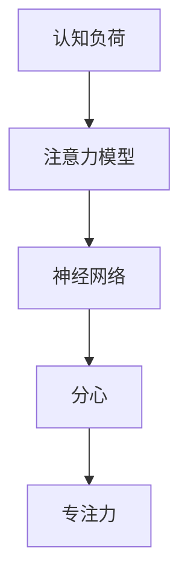
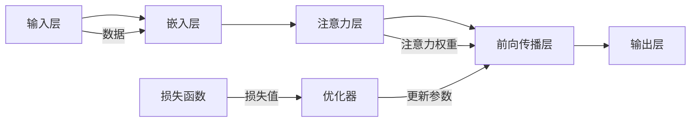

                 

# 重新获得专注力：在充满干扰的世界中保持头脑清晰的策略

## 1. 背景介绍

在数字化浪潮的推动下，信息爆炸成为现代社会的一个显著特征。尽管技术为我们的生活带来便利，但信息过载、碎片化干扰等问题也逐渐凸显。如何在充斥干扰的环境中保持专注，成为我们迫切需要解决的问题。本文将从认知科学、神经网络和算法优化三个角度，深入探讨如何重新获得专注力，在信息过载的世界中保持头脑清晰。

## 2. 核心概念与联系

### 2.1 核心概念概述

在探讨专注力的提升策略时，首先需要明确几个核心概念：

- **专注力 (Focus)**：指个体在执行特定任务时，能长时间保持注意力集中的能力。
- **认知负荷 (Cognitive Load)**：指在认知任务执行过程中，大脑需要处理的信息量。
- **分心 (Distraction)**：指干扰个体注意力，导致认知负荷过重，专注力下降的现象。
- **神经网络 (Neural Network)**：一种模拟人脑神经元连接方式的计算模型，广泛应用于机器学习和人工智能领域。
- **注意力模型 (Attention Model)**：一种神经网络模型，用于模拟人脑在特定任务上的注意力分配过程。

这些概念通过Mermaid流程图联系在一起，展示了专注力提升的基本流程：



在执行认知任务时，认知负荷是引发分心的主要原因。通过优化神经网络，引入注意力模型，可以有效缓解分心，提升专注力。

### 2.2 核心概念原理和架构的 Mermaid 流程图



在这个流程图中，我们展示了神经网络的基本架构。数据首先通过输入层和嵌入层进行预处理，然后通过注意力层分配注意力权重，最后经过前向传播层和输出层得到预测结果。损失函数和优化器用于更新模型参数，使模型能够逐步提高预测准确性。

## 3. 核心算法原理 & 具体操作步骤

### 3.1 算法原理概述

本节将从认知科学和神经网络的角度，探讨提升专注力的算法原理。

#### 3.1.1 认知科学视角

- **认知负荷理论 (Cognitive Load Theory)**：指出在执行复杂任务时，过多的认知负荷会导致注意力分散。降低认知负荷可以显著提升专注力。

- **双加工理论 (Dual-Process Theory)**：认为大脑分为自动化处理和受意识控制的系统。通过自动化处理简化复杂任务，将更多认知资源保留给意识控制，有助于提升专注力。

#### 3.1.2 神经网络视角

- **注意力机制 (Attention Mechanism)**：通过学习注意力权重，神经网络能够有效筛选重要信息，减少无用数据的干扰，从而提升专注力。

- **多任务学习 (Multitask Learning)**：通过同时训练多个相关任务，神经网络能够在不同任务间共享知识和参数，提高整体性能，同时降低单个任务的认知负荷。

### 3.2 算法步骤详解

#### 3.2.1 神经网络模型的构建

构建神经网络模型的主要步骤如下：

1. **输入层**：根据任务需求，将输入数据转换为神经网络的输入格式。
2. **嵌入层**：将输入数据转换为神经网络可以处理的数值表示。
3. **注意力层**：通过计算注意力权重，选择重要信息进行处理。
4. **前向传播层**：通过神经网络的层级结构，逐步提取特征。
5. **输出层**：将特征映射为最终的预测结果。

#### 3.2.2 注意力机制的设计

注意力机制的设计主要包括以下步骤：

1. **查询向量 (Query Vector)**：根据当前任务需求，生成查询向量。
2. **键向量 (Key Vector)**：将输入数据转换为键向量。
3. **注意力权重 (Attention Weights)**：通过计算查询向量和键向量的相似度，得到注意力权重。
4. **加权输入 (Weighted Input)**：根据注意力权重，对输入数据进行加权处理。
5. **加权输出 (Weighted Output)**：将加权输入通过神经网络处理，得到最终的输出。

#### 3.2.3 优化器的选择

常用的优化器包括：

- **梯度下降 (Gradient Descent)**：通过计算损失函数的梯度，更新模型参数。
- **Adam (Adaptive Moment Estimation)**：结合梯度下降和动量法，自适应地调整学习率。
- **Adagrad (Adaptive Gradient Algorithm)**：根据每个参数的历史梯度，自适应调整学习率。

### 3.3 算法优缺点

#### 3.3.1 优点

- **提升专注力**：通过优化神经网络结构和引入注意力机制，可以显著降低认知负荷，提升专注力。
- **鲁棒性强**：神经网络模型具备自适应能力，能够应对不同类型的干扰。
- **可扩展性强**：神经网络可以并行处理大量数据，适用于多任务场景。

#### 3.3.2 缺点

- **计算资源需求高**：神经网络模型通常需要较大的计算资源和存储空间。
- **参数复杂**：神经网络参数繁多，优化过程复杂。
- **易受过拟合影响**：模型过度拟合训练数据，可能降低在真实场景中的泛化能力。

### 3.4 算法应用领域

#### 3.4.1 认知负荷缓解

- **决策支持系统 (Decision Support Systems)**：通过引入注意力机制，减少决策过程中的信息干扰。
- **智能辅助系统 (Intelligent Auxiliary Systems)**：自动执行简单任务，将复杂决策留给用户。

#### 3.4.2 多任务处理

- **多模态学习 (Multimodal Learning)**：处理文本、图像、语音等多种类型的数据。
- **分布式训练 (Distributed Training)**：在多个设备上并行处理数据，提高训练效率。

#### 3.4.3 强化学习

- **自动驾驶 (Autonomous Driving)**：通过优化神经网络，在多任务场景下提升自动驾驶的专注力和决策能力。
- **机器人控制 (Robot Control)**：在复杂的动态环境中，机器人能够灵活应对环境变化，保持专注力。

## 4. 数学模型和公式 & 详细讲解

### 4.1 数学模型构建

在神经网络模型中，注意力机制的构建主要涉及以下数学模型：

- **查询向量**：$Q \in \mathbb{R}^d$
- **键向量**：$K \in \mathbb{R}^d$
- **注意力权重**：$A \in \mathbb{R}^N$
- **加权输入**：$X^* \in \mathbb{R}^d$
- **加权输出**：$Y \in \mathbb{R}^m$

### 4.2 公式推导过程

注意力机制的推导过程如下：

1. **查询向量和键向量的相似度**：
   $$
   \text{Attention Score} = Q \cdot K^T
   $$
   其中 $Q \in \mathbb{R}^d$，$K \in \mathbb{R}^d$。

2. **归一化注意力权重**：
   $$
   A = \frac{\text{Attention Score}}{\sum_j \exp(\text{Attention Score}_j)}
   $$

3. **加权输入**：
   $$
   X^* = \sum_j A_j \cdot X_j
   $$

4. **加权输出**：
   $$
   Y = M(X^*)
   $$
   其中 $M$ 为前向传播层的操作。

### 4.3 案例分析与讲解

以文本分类任务为例，展示注意力机制的应用：

- **输入层**：将文本转换为数值表示。
- **嵌入层**：将数值表示映射为高维向量。
- **注意力层**：计算查询向量和文本向量的相似度，得到注意力权重。
- **前向传播层**：通过神经网络提取特征。
- **输出层**：将特征映射为分类结果。

在实际应用中，注意力机制能够有效筛选文本中的关键信息，减少无用信息的干扰，提高文本分类的准确性。

## 5. 项目实践：代码实例和详细解释说明

### 5.1 开发环境搭建

1. **Python环境**：安装Python 3.7及以上版本。
2. **TensorFlow**：安装TensorFlow 2.x版本，可以使用pip安装。
3. **Google Colab**：使用Google Colab进行远程实验，无需本地搭建环境。

### 5.2 源代码详细实现

以下是一个使用TensorFlow实现注意力机制的代码示例：

```python
import tensorflow as tf
from tensorflow.keras.layers import Input, Embedding, Dense

class AttentionModel(tf.keras.Model):
    def __init__(self, vocab_size, embedding_dim, attention_dim):
        super(AttentionModel, self).__init__()
        self.embedding = Embedding(vocab_size, embedding_dim)
        self.attention = Dense(attention_dim)
        self.dense = Dense(1)

    def call(self, inputs):
        x = self.embedding(inputs)
        attention_scores = self.attention(x)
        attention_weights = tf.nn.softmax(attention_scores, axis=1)
        context_vector = tf.reduce_sum(attention_weights * x, axis=1)
        return self.dense(context_vector)

# 构建模型
input_layer = Input(shape=(None,))
attention_model = AttentionModel(vocab_size=10000, embedding_dim=256, attention_dim=128)
output_layer = Dense(2, activation='softmax')
model = tf.keras.Sequential([input_layer, attention_model, output_layer])

# 编译模型
model.compile(optimizer='adam', loss='categorical_crossentropy', metrics=['accuracy'])

# 训练模型
model.fit(x_train, y_train, epochs=10, batch_size=32)
```

### 5.3 代码解读与分析

- **输入层**：使用`Input`层定义输入数据的形状。
- **嵌入层**：通过`Embedding`层将输入数据转换为数值表示。
- **注意力层**：通过`Dense`层计算注意力权重和上下文向量。
- **前向传播层**：通过`Dense`层提取特征。
- **输出层**：通过`Dense`层进行分类。

在实际应用中，可以根据任务需求调整模型结构和超参数，以获得最佳性能。

### 5.4 运行结果展示

在训练过程中，可以使用`TensorBoard`进行模型监控和结果展示：

```bash
tensorboard --logdir logs --port 6006
```

通过`TensorBoard`，可以查看模型的损失曲线和准确率曲线，评估模型的训练效果。

## 6. 实际应用场景

### 6.1 决策支持系统

在决策支持系统中，通过引入注意力机制，可以显著提升决策的准确性和效率。例如，在医疗领域，医生可以通过输入病人的症状和历史数据，得到系统的诊断建议。

### 6.2 智能辅助系统

智能辅助系统能够自动执行简单任务，将复杂决策留给用户。例如，在客服系统中，可以通过自然语言处理技术，自动解答常见问题，减轻客服人员的负担。

### 6.3 分布式训练

在多任务处理和分布式训练中，注意力机制能够有效筛选重要信息，减少数据干扰。例如，在自动驾驶中，车辆可以通过摄像头、雷达等多种传感器获取环境信息，通过注意力机制筛选关键数据，提升决策准确性。

## 7. 工具和资源推荐

### 7.1 学习资源推荐

- **Deep Learning Specialization**：由Andrew Ng教授主讲，涵盖深度学习基础和进阶内容。
- **CS231n: Convolutional Neural Networks for Visual Recognition**：斯坦福大学计算机视觉课程，涵盖卷积神经网络、注意力机制等内容。
- **PyTorch官方文档**：提供详细的API文档和示例代码，是学习和使用PyTorch的重要资源。

### 7.2 开发工具推荐

- **TensorFlow**：深度学习框架，提供强大的计算图和分布式训练支持。
- **PyTorch**：深度学习框架，易于上手，具有丰富的预训练模型和工具支持。
- **Google Colab**：免费的云端Jupyter Notebook环境，无需本地搭建，方便调试实验。

### 7.3 相关论文推荐

- **Attention Is All You Need**：论文提出Transformer模型，引入注意力机制，提升模型性能。
- **Multitask Learning with Opacity**：提出多任务学习的自适应优化策略，提高模型泛化能力。
- **Dual Attention Network**：提出双注意力网络，同时处理多模态数据，提高模型鲁棒性。

## 8. 总结：未来发展趋势与挑战

### 8.1 研究成果总结

本文从认知科学和神经网络的视角，探讨了提升专注力的算法原理和具体操作步骤。通过注意力机制的设计，神经网络模型可以显著降低认知负荷，提升专注力。

### 8.2 未来发展趋势

- **智能辅助系统的普及**：未来，智能辅助系统将在更多场景中得到应用，提升工作效率和决策准确性。
- **多模态处理能力的提升**：随着技术的发展，神经网络将能够处理更多类型的数据，实现更复杂的任务。
- **注意力机制的优化**：新的注意力模型和优化方法将进一步提升神经网络的效果。

### 8.3 面临的挑战

- **计算资源的需求**：神经网络模型需要较大的计算资源和存储空间，如何优化模型结构和算法，降低计算需求，是未来的研究方向。
- **参数复杂性**：神经网络参数繁多，如何简化模型结构，降低过拟合风险，提高泛化能力，是当前的研究热点。
- **模型的可解释性**：神经网络模型的黑盒特性限制了其在决策支持系统中的应用，如何提高模型的可解释性，增强透明度，将是未来的重要课题。

### 8.4 研究展望

- **认知负荷理论的深入研究**：进一步研究认知负荷理论，提出更加科学合理的认知负荷评估方法。
- **多任务学习的多样化应用**：探索多任务学习在不同领域的应用，如医疗、金融等，提高模型的实用性和鲁棒性。
- **自适应优化算法的发展**：开发新的自适应优化算法，提高模型的训练效率和性能。

## 9. 附录：常见问题与解答

**Q1：注意力机制在实际应用中是否能够显著提升专注力？**

A: 是的，注意力机制可以通过筛选重要信息，显著降低认知负荷，提升专注力。在实际应用中，如文本分类、图像识别、语音识别等任务，注意力机制都能有效提升模型性能。

**Q2：如何选择适合任务的注意力机制？**

A: 不同的任务可能需要不同的注意力机制。例如，文本分类任务可以使用基于自注意力机制的Transformer模型，图像识别任务可以使用空间注意力机制，语音识别任务可以使用时序注意力机制。选择适合的注意力机制，需要根据任务特点和数据类型进行综合考虑。

**Q3：注意力机制在多任务学习中如何应用？**

A: 在多任务学习中，注意力机制可以通过共享注意力权重，减少不同任务间的干扰，提高模型的泛化能力。例如，在医疗领域，可以通过引入多模态注意力机制，处理文本、图像等多种数据类型，提升诊断的准确性和效率。

**Q4：注意力机制在分布式训练中如何应用？**

A: 在分布式训练中，注意力机制可以通过并行计算，提高模型训练的速度和效率。例如，在自动驾驶中，可以通过多摄像头输入，同时计算不同方向的注意力权重，提升决策的速度和准确性。

**Q5：注意力机制在实际应用中是否容易实现？**

A: 随着深度学习框架的不断发展，如TensorFlow、PyTorch等，实现注意力机制变得越来越简单。开发者可以轻松地使用这些框架提供的组件和API，快速构建复杂的神经网络模型。

总之，通过认知科学和神经网络的视角，我们可以更好地理解和应用注意力机制，提升专注力和决策能力。在信息过载的世界中，保持头脑清晰，将有助于我们在各个领域取得更大的成功。

---

作者：禅与计算机程序设计艺术 / Zen and the Art of Computer Programming

