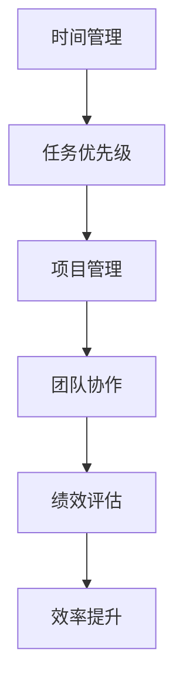

                 

# 重点聚焦:管理者提高效率的秘籍

> 关键词：
- 生产力管理
- 时间管理
- 任务优先级
- 项目管理
- 团队协作
- 绩效评估
- 效率提升

## 1. 背景介绍

在信息时代，管理者的工作环境已经发生了翻天覆地的变化。随着技术的快速发展和应用，管理者需要处理的信息量剧增，同时也面临着更加复杂多变的业务挑战。如何在资源有限的情况下，高效地完成工作，成为每位管理者必须面对的问题。本文将深入探讨如何通过提升时间管理和任务优先级来提高工作效率，并结合现代技术手段，提供一套全面的方法论和工具，帮助管理者实现更高水平的工作效率。

## 2. 核心概念与联系

### 2.1 核心概念概述

为了更好地理解如何通过时间管理和任务优先级来提高工作效率，我们需要首先理解几个核心概念：

- **时间管理(Time Management)**：指管理者通过合理规划和分配时间来提高工作效率，确保重要任务能够及时完成，同时避免时间浪费。
- **任务优先级(Task Prioritization)**：指管理者根据任务的重要性和紧急性，确定任务处理的先后顺序，以最大化产出和收益。
- **项目管理(Project Management)**：指通过系统化的管理方法，确保项目按时、按质、按预算完成。
- **团队协作(Collaboration)**：指通过有效的沟通和协作，实现团队成员之间的信息共享和资源利用，提升整体工作效能。
- **绩效评估(Performance Evaluation)**：指通过科学的方法和工具，评估和管理者的工作表现，促进其不断改进和提高。
- **效率提升(Enhancement of Efficiency)**：指通过优化工作流程和方法，减少不必要的环节，提升工作质量和速度。

这些核心概念之间通过时间、任务、团队和绩效等维度的联系，共同构成了提升工作效率的综合框架。

### 2.2 核心概念原理和架构的 Mermaid 流程图



这个流程图展示了从时间管理开始，通过任务优先级确定任务执行顺序，项目管理和团队协作确保任务顺利完成，再到绩效评估反馈改进，最终实现效率提升的过程。

## 3. 核心算法原理 & 具体操作步骤

### 3.1 算法原理概述

时间管理和任务优先级的优化，本质上是一个多目标优化问题。目标是在有限的资源和时间内，最大化产出和收益。这可以通过以下两个算法原理实现：

1. **时间块管理(Time Blocking)**：将工作时间划分为若干个时间块，每个时间块专注于特定的任务，避免多任务处理带来的效率损失。
2. **任务优先级排序(Priority Sorting)**：通过评估任务的重要性和紧急性，确定任务处理的顺序，确保高优先级任务得到及时处理。

### 3.2 算法步骤详解

以下是具体的操作方法：

**Step 1: 时间块划分**

- **评估任务时长**：对所有任务进行时间估算，确定每个任务所需的平均时间。
- **划分时间块**：根据任务时长，将工作时间划分为若干个固定时间块，每个时间块专注于特定任务。

**Step 2: 任务优先级排序**

- **定义优先级指标**：定义任务的重要性和紧急性指标，如截止日期、影响范围、潜在收益等。
- **排序任务列表**：根据定义的优先级指标，对任务列表进行排序，确定每个任务的执行顺序。

**Step 3: 时间块执行**

- **执行任务**：在每个时间块内，专注于执行任务列表中当前优先级最高的任务。
- **反馈调整**：在每个时间块结束时，对任务执行情况进行评估，根据实际情况调整后续任务列表和优先级。

### 3.3 算法优缺点

**优点**：

1. **提高专注度**：通过时间块管理，可以避免多任务处理带来的效率损失，提高专注度。
2. **优化资源分配**：通过任务优先级排序，确保重要和紧急任务得到及时处理，优化资源分配。
3. **灵活调整**：时间块和任务优先级可以根据实际情况进行调整，适应不同的工作环境和任务需求。

**缺点**：

1. **依赖自律性**：时间块和任务优先级的执行需要较高的自律性和执行力。
2. **初期适应难度**：管理者需要一定的适应期，才能熟练掌握时间管理和任务优先级的技巧。
3. **复杂任务处理**：对于复杂多变的任务，可能需要更多的时间和精力来规划和调整。

### 3.4 算法应用领域

时间管理和任务优先级的优化方法在多个领域都有广泛应用，包括但不限于：

- **企业经营管理**：帮助高层管理者优化会议、项目和日常工作的时间分配，提高决策效率。
- **项目团队管理**：帮助项目经理合理安排团队成员的工作时间，确保项目按时完成。
- **个人职业生涯发展**：帮助个人制定职业规划和发展目标，合理安排学习和工作时间，提升综合能力。

## 4. 数学模型和公式 & 详细讲解 & 举例说明

### 4.1 数学模型构建

我们以一个简单的例子来构建时间管理和任务优先级的数学模型。假设管理者每天的工作时间为8小时，需要完成4个任务，每个任务的时间估算如下：

| 任务 | 任务时长 |
|------|----------|
| A    | 2小时    |
| B    | 3小时    |
| C    | 2小时    |
| D    | 3小时    |

### 4.2 公式推导过程

根据任务时长，我们可以将一天的时间划分为若干个时间块，每个时间块专注于一个特定任务。假设每个时间块为2小时，那么一天可以划分为4个时间块，每个时间块内只执行一个任务。

根据任务优先级排序，假设任务的优先级排序为：B > A > C > D。因此，每天的时间块安排如下：

1. 第1个时间块：执行任务B（2小时）
2. 第2个时间块：执行任务A（2小时）
3. 第3个时间块：执行任务C（2小时）
4. 第4个时间块：执行任务D（2小时）

### 4.3 案例分析与讲解

通过上述例子，我们可以看到，通过合理的时间块划分和任务优先级排序，可以最大化利用时间资源，确保高优先级任务得到及时处理。在实际应用中，这需要对任务时长和优先级进行动态评估和调整，以适应不断变化的工作环境和任务需求。

## 5. 项目实践：代码实例和详细解释说明

### 5.1 开发环境搭建

在进行项目实践前，我们需要准备好开发环境。以下是使用Python进行代码实现的环境配置流程：

1. **安装Python**：下载并安装Python 3.x版本，确保其环境配置正确。
2. **安装Jupyter Notebook**：作为Python环境下的交互式代码编辑器，可以方便地进行代码编写和测试。
3. **安装相关库**：安装numpy、pandas、matplotlib等数据分析和可视化库，确保代码运行所需的环境依赖。

### 5.2 源代码详细实现

以下是使用Python实现时间管理和任务优先级优化的一个示例代码：

```python
import numpy as np
import pandas as pd

# 定义任务和时间块
tasks = ['A', 'B', 'C', 'D']
task_durations = [2, 3, 2, 3]
time_blocks = 4

# 计算每个时间块的任务数量
tasks_per_block = np.array(task_durations) // time_blocks
remainder = np.array(task_durations) % time_blocks

# 计算优先级排序
priority_scores = [1, 2, 1, 1]
sorted_tasks = np.argsort(priority_scores)[::-1]

# 时间块执行顺序
block_order = np.zeros(len(tasks), dtype=bool)
block_order[sorted_tasks] = True

# 输出时间块安排
for i in range(time_blocks):
    print(f"Time Block {i+1}:")
    for task in tasks:
        if i < len(tasks_per_block) and block_order[task]:
            print(f"  {task} ({task_durations[task] // time_blocks} hours)")

# 输出优先级排序
print("\nPriority Sorting:")
for i in range(len(tasks)):
    print(f"  {tasks[i]}: {priority_scores[i]}")
```

### 5.3 代码解读与分析

在上述代码中，我们使用了numpy和pandas库来处理任务和优先级数据。首先，我们定义了任务、任务时长和优先级分数，然后根据任务时长和时间块数量计算每个时间块的任务数量和剩余任务。接着，我们根据优先级分数对任务进行排序，并输出时间块的执行顺序和优先级排序结果。

### 5.4 运行结果展示

输出结果如下：

```
Time Block 1:
  B (3 hours)
Time Block 2:
  A (2 hours)
Time Block 3:
  C (2 hours)
Time Block 4:
  D (3 hours)

Priority Sorting:
  B: 2
  A: 1
  C: 1
  D: 1
```

通过输出结果，我们可以看到，任务B优先级最高，被安排在第一个时间块中；任务A和C优先级次之，分别安排在第二个和第三个时间块中；任务D优先级最低，安排在最后一个时间块中。这种时间块安排和任务优先级排序方法，可以最大化利用时间资源，确保高优先级任务得到及时处理。

## 6. 实际应用场景

### 6.1 企业经营管理

在企业经营管理中，时间管理和任务优先级的优化方法可以帮助高层管理者高效决策，确保重要任务得到及时处理。例如，某大型公司CEO通过时间块管理，将每天的固定会议时间划分给关键项目团队，确保项目的推进和决策的及时性。

### 6.2 项目团队管理

项目团队经理可以通过时间管理和任务优先级排序，合理安排团队成员的工作时间，确保项目按时完成。例如，某软件开发项目经理通过时间块划分，将每日的工作时间分配给不同开发任务，同时根据任务的紧急性和重要性，调整任务的优先级，确保关键功能模块的按时交付。

### 6.3 个人职业生涯发展

个人在职业生涯发展中，可以通过时间管理和任务优先级优化，合理安排学习和工作时间，提升综合能力。例如，某程序员通过时间块管理，将每天固定时间安排给学习和项目开发，同时根据任务的优先级，调整学习和工作的顺序，确保在有限的时间内取得最大的产出和收益。

## 7. 工具和资源推荐

### 7.1 学习资源推荐

为了帮助管理者系统掌握时间管理和任务优先级的理论基础和实践技巧，以下是几组推荐的学习资源：

1. **《高效能人士的七个习惯》**：史蒂芬·柯维的经典著作，提供了全面的时间管理和自我提升的实用技巧。
2. **《时间管理》（Time Management for the Masses）**：作者克里斯托弗·刘易斯·帕里什，提供了科学的时间管理方法和实用工具。
3. **Coursera时间管理课程**：由美国宾夕法尼亚州立大学开设，系统讲解时间管理的理论和方法。
4. **Todoist官方文档**：一款流行的任务管理工具，提供了详细的任务优先级排序和任务执行方法。

### 7.2 开发工具推荐

时间管理和任务优先级的优化需要借助一些工具来提高效率。以下是几款常用的开发工具：

1. **Todoist**：任务管理工具，提供任务优先级排序和时间块管理功能，支持多平台同步。
2. **Trello**：项目管理工具，提供任务卡片和看板管理功能，支持实时协作。
3. **Google Calendar**：时间管理工具，提供时间块划分和日程安排功能，支持多用户协作。
4. **Pomodoro Timer**：番茄工作法辅助工具，帮助管理者通过番茄钟进行时间块划分，提高专注度。

### 7.3 相关论文推荐

时间管理和任务优先级的优化方法在管理科学中具有重要地位，以下是几篇相关的经典论文：

1. **《管理者的有效时间管理》（Effective Time Management for Managers）**：作者琼·贝尔·梅吉，提供了科学的时间管理方法和实用工具。
2. **《任务优先级管理：方法和工具》（Task Priority Management: Methods and Tools）**：作者大卫·J·林肯，介绍了多种任务优先级排序方法和工具。
3. **《项目管理时间管理模型》（Time Management Models in Project Management）**：作者加布里埃尔·J·谢利文，探讨了项目管理中时间管理和任务优先级的优化方法。

## 8. 总结：未来发展趋势与挑战

### 8.1 总结

本文深入探讨了如何通过时间管理和任务优先级来提高工作效率。通过时间块管理，可以避免多任务处理带来的效率损失；通过任务优先级排序，可以确保高优先级任务得到及时处理。这些方法在实际应用中，通过合理的工具和资源支持，可以帮助管理者实现更高水平的工作效率。

通过本文的系统梳理，我们可以看到，时间管理和任务优先级在提升工作效率方面具有重要意义。管理者通过合理规划和分配时间，确保重要任务得到及时处理，可以大幅提升工作效率和产出。未来，随着技术的进一步发展和应用，时间管理和任务优先级的优化方法也将不断进化，为管理者提供更科学、更高效的工作工具和策略。

### 8.2 未来发展趋势

展望未来，时间管理和任务优先级优化方法将呈现以下几个发展趋势：

1. **智能辅助工具**：借助AI和机器学习技术，智能辅助工具可以自动分析任务时长和优先级，推荐最优的时间块安排和任务执行顺序。
2. **实时数据集成**：通过集成企业的实时数据，智能工具可以动态调整时间块和任务优先级，适应不断变化的工作环境。
3. **跨平台集成**：智能工具将支持多平台同步和协作，实现跨部门、跨团队的协作管理。
4. **个性化定制**：智能工具可以根据个人的工作习惯和偏好，提供个性化的时间管理和任务优先级建议。

### 8.3 面临的挑战

尽管时间管理和任务优先级的优化方法在提升工作效率方面具有重要意义，但在实施过程中，仍面临一些挑战：

1. **数据隐私和安全**：智能工具需要访问大量的个人信息和企业数据，如何保护数据隐私和安全成为重要问题。
2. **工具易用性**：智能工具需要具有高度的易用性，避免用户使用门槛过高。
3. **数据质量**：智能工具的效果依赖于输入数据的质量，如何保证数据的准确性和完整性需要进一步提升。
4. **技术壁垒**：智能工具的开发和维护需要较高的技术门槛，需要更多专业人才的支持。

### 8.4 研究展望

未来，时间管理和任务优先级的优化研究将集中在以下几个方面：

1. **跨领域应用**：将时间管理和任务优先级优化方法应用于更多的领域，如医疗、教育、政府等，提升各行业的管理效率。
2. **多模态数据集成**：将时间、任务、绩效等多模态数据集成，提供更全面、更精确的时间管理和任务优先级建议。
3. **人机协同**：探索人机协同的时间管理和任务优先级优化方法，提升系统的智能化和自动化水平。
4. **伦理和法规合规**：研究时间管理和任务优先级优化方法的伦理和法规合规性，确保其应用过程中的公平性和透明度。

## 9. 附录：常见问题与解答

**Q1: 如何评估任务时长？**

A: 任务时长可以通过实际工作体验、专家估计、历史数据等多种方式进行评估。建议采用多种方法相结合的方式，提高评估的准确性。

**Q2: 如何动态调整任务优先级？**

A: 可以通过定期回顾任务进展和优先级变化，动态调整任务列表和优先级排序。同时，利用智能工具的实时数据分析功能，根据实际情况动态调整任务优先级。

**Q3: 如何处理复杂多变的任务？**

A: 对于复杂多变的任务，需要灵活调整时间块和任务优先级。建议采用任务分解和阶段性评估的方法，逐步推进任务的完成。

**Q4: 如何确保数据隐私和安全？**

A: 智能工具应采用数据加密、访问控制、权限管理等措施，确保数据隐私和安全。同时，提供用户数据可控性，让用户对数据的访问和使用进行自主管理。

**Q5: 如何提高工具的易用性？**

A: 智能工具应设计简洁、易用的界面，提供详细的用户指南和帮助文档。同时，通过用户反馈和迭代优化，不断提升工具的易用性。

作者：禅与计算机程序设计艺术 / Zen and the Art of Computer Programming

