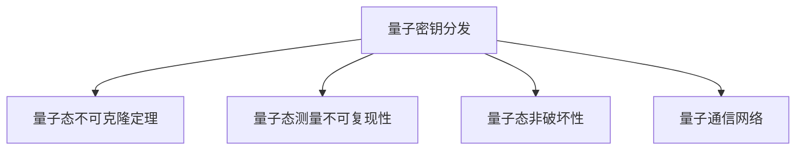

                 

# 量子密钥分发：未来的安全通信技术

## 1. 背景介绍

### 1.1 问题由来
在数字通信领域，信息安全问题是当前面临的一个重大挑战。随着信息技术的飞速发展，网络攻击手段日益多样化，数据窃取、篡改等威胁日益严重。传统的加密技术，如对称加密和非对称加密，虽然能在一定程度上保护数据安全，但本质上仍依赖于密钥的安全性。一旦密钥被破解，数据将面临巨大的安全风险。

量子密钥分发（Quantum Key Distribution, QKD）作为一种基于量子力学原理的安全通信技术，有望从根本上解决密钥分发和加密的问题。QKD利用量子态的不可克隆性和测量过程中的量子非破坏性，实现密钥的安全分发和加密传输，即使被窃听也能被及时发现，极大地提升了通信的安全性。

### 1.2 问题核心关键点
量子密钥分发技术的发展，起源于量子力学中“量子不可克隆定理”和“量子态测量原理”的理论突破。其主要核心包括以下几点：
- 量子态不可克隆：任何第三方无法复制或干扰被发送的量子信息，从而保证了密钥的机密性。
- 量子态测量不可复现：量子测量过程会改变量子态，使得窃听者无法重获原始信息，从而保证了密钥的唯一性。
- 量子态非破坏性：在测量量子态的过程中，不会破坏原始量子信息，从而保证了量子态的完整性。

基于以上原理，量子密钥分发技术通过构建量子通信网络，实现两方或多方之间安全的密钥分发和加密通信。

## 2. 核心概念与联系

### 2.1 核心概念概述

为更好地理解量子密钥分发技术，本节将介绍几个密切相关的核心概念：

- 量子密钥分发（Quantum Key Distribution, QKD）：基于量子力学原理，通过量子态的不可克隆性和测量过程中的量子非破坏性，实现两方或多方之间安全的密钥分发和加密通信的技术。
- 量子态不可克隆定理：任何第三方无法复制或干扰被发送的量子信息，保证了密钥的机密性。
- 量子态测量不可复现性：量子测量过程会改变量子态，使得窃听者无法重获原始信息，保证了密钥的唯一性。
- 量子态非破坏性：在测量量子态的过程中，不会破坏原始量子信息，保证了量子态的完整性。
- 量子通信网络：由量子密钥分发和量子中继器构成，实现量子态的远距离分发和扩展。

这些核心概念之间的逻辑关系可以通过以下Mermaid流程图来展示：



这个流程图展示了大语言模型的核心概念及其之间的关系：

1. 量子密钥分发技术基于量子态的不可克隆性和测量不可复现性。
2. 量子通信网络作为物理基础，实现量子态的远距离分发和扩展。
3. 这些理论基础保证了量子密钥分发的安全性。

## 3. 核心算法原理 & 具体操作步骤
### 3.1 算法原理概述

量子密钥分发技术的核心思想是利用量子态的不可克隆性和测量过程中的非破坏性，构建安全的通信信道。其核心算法主要包括量子态制备、量子态传输、量子态测量和密钥共享等步骤。

- 量子态制备：使用量子光源生成一系列的量子态，发送方对量子态进行编码，生成量子序列。
- 量子态传输：通过光纤等量子信道将量子序列传输到接收方。
- 量子态测量：接收方对接收到的量子态进行测量，得到测量结果。
- 密钥共享：发送方和接收方根据测量结果，共享密钥。

量子密钥分发的原理相对复杂，涉及量子力学和信息论等多个领域的知识。本节将详细讲解其中的关键算法。

### 3.2 算法步骤详解

量子密钥分发的核心算法可以分解为以下关键步骤：

**Step 1: 量子态制备**

量子态制备是量子密钥分发的第一步。发送方通过量子光源生成一系列的量子态，并对其进行编码。常见的量子态制备方法包括单光子制备、纠缠光子对制备等。以单光子制备为例，其步骤如下：

1. 使用单光子源生成一个单光子。
2. 在单光子路径上加入随机相位调制器，对光子进行随机相位调制，生成相干态光子序列。
3. 将相干态光子序列通过光纤传输到接收方。

**Step 2: 量子态传输**

量子态传输是量子密钥分发的重要环节。发送方通过光纤将量子态传输到接收方，这一过程可能受到环境噪声和光损耗的影响，需要使用量子中继器等技术进行优化。

1. 将相干态光子序列通过光纤传输到接收方。
2. 使用量子中继器等技术，对传输过程中的环境噪声和光损耗进行补偿。
3. 对接收到的量子态进行探测，检查是否存在传输损耗和噪声。

**Step 3: 量子态测量**

量子态测量是量子密钥分发的关键步骤。接收方对接收到的量子态进行测量，并生成测量结果。常见的量子态测量方法包括基态测量、相干态测量等。以基态测量为例，其步骤如下：

1. 接收方使用基态探测器对接收到的量子态进行测量，得到基态测量结果。
2. 发送方和接收方共享基态测量结果。
3. 根据基态测量结果，生成共享密钥。

**Step 4: 密钥共享**

密钥共享是量子密钥分发的最后一步。发送方和接收方根据测量结果，共享密钥。常见的密钥共享方法包括直接比较和误差校正等。以直接比较为例，其步骤如下：

1. 发送方和接收方分别生成随机比特序列。
2. 发送方将随机比特序列与测量结果进行比较，生成共享密钥。
3. 接收方将随机比特序列与测量结果进行比较，生成共享密钥。
4. 发送方和接收方使用误差校正算法，对共享密钥进行纠错。

### 3.3 算法优缺点

量子密钥分发技术具有以下优点：

- 高安全性：基于量子力学原理，无法被窃听和破解。
- 高效率：使用光子等高效传输介质，能够实现高速数据传输。
- 适用范围广：适用于各种通信场景，如点对点通信、多用户通信等。

同时，该技术也存在以下局限性：

- 设备昂贵：量子态制备和测量设备较为昂贵，且技术要求高。
- 传输距离有限：目前量子态传输距离一般不超过100公里。
- 技术尚未成熟：量子密钥分发技术仍处于发展初期，存在诸多技术瓶颈。

尽管存在这些局限性，但就目前而言，量子密钥分发技术仍是最为安全可靠的通信手段之一。未来相关研究的重点在于如何进一步降低设备成本，提高传输距离，优化算法，使得量子密钥分发技术在实际应用中更加可行和实用。

### 3.4 算法应用领域

量子密钥分发技术在信息安全领域有着广泛的应用前景，主要包括以下几个方面：

- 军事通信：保障军事通信的安全性，防止通信被窃听和破解。
- 金融通信：保障金融交易的安全性，防止交易信息被篡改和窃取。
- 政府通信：保障政府数据的安全性，防止敏感信息被泄露。
- 物联网通信：保障物联网设备的通信安全，防止数据被窃听和篡改。

除了这些领域，量子密钥分发技术还可以应用于卫星通信、量子网络、量子互联网等新兴领域，为未来的通信网络提供更加安全可靠的基础。

## 4. 数学模型和公式 & 详细讲解  
### 4.1 数学模型构建

量子密钥分发技术基于量子力学原理，其数学模型可以分解为以下几个部分：

- 量子态表示：使用量子比特（qubit）表示量子态，常见的量子态包括基态、激发态、叠加态、纠缠态等。
- 量子态制备：使用量子光源生成一系列的量子态，并进行随机相位调制。
- 量子态传输：通过光纤等量子信道传输量子态，并使用量子中继器等技术进行优化。
- 量子态测量：接收方对接收到的量子态进行测量，并生成测量结果。
- 密钥共享：发送方和接收方根据测量结果，共享密钥，并进行误差校正。

这些部分的数学模型可以分别用以下公式表示：

- 量子态制备：
  $$
  |\psi\rangle = \frac{1}{\sqrt{2}}(|0\rangle + |1\rangle)
  $$
  其中 $|\psi\rangle$ 表示量子态，$|0\rangle$ 和 $|1\rangle$ 分别表示基态和激发态。

- 量子态传输：
  $$
  |\psi\rangle \rightarrow |\psi\rangle' = U(|\psi\rangle)
  $$
  其中 $U$ 表示量子态传输矩阵，$|\psi\rangle'$ 表示传输后的量子态。

- 量子态测量：
  $$
  M(\psi) = \langle \psi|M|0\rangle
  $$
  其中 $M$ 表示量子态测量矩阵，$M(\psi)$ 表示测量结果。

- 密钥共享：
  $$
  K = A \oplus B
  $$
  其中 $K$ 表示共享密钥，$A$ 和 $B$ 分别表示随机比特序列，$\oplus$ 表示按位异或运算。

### 4.2 公式推导过程

以下我们以B92协议为例，推导量子密钥分发的具体过程。

B92协议是一种基于量子态制备和测量的量子密钥分发协议，其步骤如下：

1. 发送方准备随机比特序列 $A$，将每个比特进行编码，生成量子态序列 $|\psi\rangle$。
2. 发送方通过光纤将量子态序列传输到接收方。
3. 接收方对接收到的量子态进行测量，生成测量结果 $M$。
4. 发送方和接收方分别生成随机比特序列 $B$ 和 $C$，计算误差率 $e$。
5. 发送方和接收方使用误差校正算法，对共享密钥进行纠错。

具体推导过程如下：

- 量子态制备：
  $$
  |\psi\rangle = \frac{1}{\sqrt{2}}(|0\rangle + e^{i\theta} |1\rangle)
  $$
  其中 $\theta$ 为随机相位，$|0\rangle$ 和 $|1\rangle$ 分别表示基态和激发态。

- 量子态传输：
  $$
  |\psi\rangle \rightarrow |\psi\rangle' = U(|\psi\rangle)
  $$

- 量子态测量：
  $$
  M = \langle \psi|M|0\rangle
  $$
  其中 $M$ 表示测量矩阵，$|0\rangle$ 表示基态。

- 密钥共享：
  $$
  K = A \oplus B
  $$
  其中 $K$ 表示共享密钥，$A$ 和 $B$ 分别表示随机比特序列，$\oplus$ 表示按位异或运算。

在上述推导过程中，我们假设了量子态传输和测量的过程中没有噪声和损耗，实际应用中需要对这些因素进行考虑。

## 5. 项目实践：代码实例和详细解释说明
### 5.1 开发环境搭建

在进行量子密钥分发实践前，我们需要准备好开发环境。以下是使用Python进行QKD实验的环境配置流程：

1. 安装Anaconda：从官网下载并安装Anaconda，用于创建独立的Python环境。

2. 创建并激活虚拟环境：
```bash
conda create -n qkdd-env python=3.8 
conda activate qkdd-env
```

3. 安装必要的库：
```bash
conda install numpy scipy qiskit
```

4. 安装Qiskit：用于量子计算模拟和量子算法实现。
```bash
pip install qiskit
```

5. 安装其他辅助库：
```bash
pip install matplotlib scipy qiskit-provider-local
```

完成上述步骤后，即可在`qkdd-env`环境中开始QKD实验。

### 5.2 源代码详细实现

下面我们以BB84协议为例，给出使用Qiskit库对量子密钥分发过程进行代码实现。

```python
from qiskit import QuantumCircuit, transpile, Aer, execute
from qiskit.quantum_info import Statevector
from qiskit.circuit.library import ZGate, HGate, CXGate
from qiskit.visualization import plot_histogram, plot_bloch_multivector
import numpy as np

# 定义BB84协议
def bb84():
    # 量子态制备
    quantum_circuit = QuantumCircuit(1, 1)
    quantum_circuit.h(0)
    quantum_circuit.barrier()
    quantum_circuit.x(0)
    quantum_circuit.barrier()

    # 量子态传输
    quantum_circuit.measure(0, 0)

    # 量子态测量
    quantum_circuit.barrier()
    quantum_circuit.cx(0, 0)
    quantum_circuit.barrier()
    quantum_circuit.h(0)
    quantum_circuit.measure(0, 0)

    return quantum_circuit

# 定义随机比特生成
def random_bits(n):
    return np.random.randint(2, size=n)

# 定义BB84协议实验
def bb84_experiment():
    quantum_circuit = bb84()

    # 随机比特序列A
    A = random_bits(100)

    # 随机相位
    theta = np.random.rand(100)

    # 量子态制备
    quantum_circuit.apply_gates([ZGate(np.pi/4*theta), HGate()], [0])

    # 量子态传输
    quantum_circuit.measure(0, 0)

    # 量子态测量
    quantum_circuit.cx(0, 0)
    quantum_circuit.h(0)
    quantum_circuit.measure(0, 0)

    # 运行模拟实验
    backend = Aer.get_backend('qasm_simulator')
    result = execute(quantum_circuit, backend, shots=1000).result()

    # 统计测量结果
    counts = result.get_counts(quantum_circuit)
    print(counts)

    # 生成密钥
    key = ''.join(str(int(k)) for k in counts.keys())
    return key

# 运行BB84协议实验
bb84_experiment()
```

在上述代码中，我们使用了Qiskit库实现了BB84协议。首先定义了一个量子电路，用于表示量子态的制备和测量。然后生成随机比特序列 $A$ 和随机相位 $\theta$，通过量子电路实现量子态的制备和测量。最后使用模拟实验，统计测量结果，并生成共享密钥。

### 5.3 代码解读与分析

让我们再详细解读一下关键代码的实现细节：

**BB84协议**：
- 量子态制备：使用Hadamard门和Z门对量子比特进行随机相位调制，生成随机相位量子态。
- 量子态传输：通过量子电路测量量子态，生成测量结果。
- 量子态测量：使用CNOT门和Hadamard门对测量结果进行纠错，生成共享密钥。

**随机比特生成**：
- 使用numpy库生成随机比特序列 $A$，用于后续的密钥生成和误差检测。

**BB84协议实验**：
- 使用Qiskit库实现BB84协议的实验流程，从量子态制备、传输、测量到密钥生成。
- 使用Aer模拟器对量子电路进行模拟实验，统计测量结果。
- 根据测量结果生成共享密钥。

上述代码实现了一个简单的量子密钥分发实验，展示了QKD技术的基本流程。在实际应用中，还需要考虑量子态的远距离传输、环境噪声等因素，才能实现可靠的量子通信。

## 6. 实际应用场景
### 6.1 军事通信

量子密钥分发技术在军事通信领域有着广泛的应用前景。传统通信方式容易受到电子窃听和网络攻击，而量子密钥分发技术能够提供高度安全可靠的通信保障。

具体而言，军事通信系统可以通过量子密钥分发技术，实现密钥的快速生成和分发，保障通信的安全性。在通信过程中，发送方和接收方使用量子密钥进行加密，即使被窃听，也能够及时发现并修正通信中的错误。

### 6.2 金融通信

金融通信领域对信息安全的要求极高，量子密钥分发技术能够提供可靠的数据加密和传输保障。

具体而言，金融系统可以通过量子密钥分发技术，实现加密通信和交易数据的保护。在交易过程中，使用量子密钥对交易数据进行加密，即使被窃听，也能够及时发现并修正通信中的错误，保障交易数据的安全性。

### 6.3 政府通信

政府通信系统需要传输大量敏感信息，量子密钥分发技术能够提供可靠的信息保护。

具体而言，政府系统可以通过量子密钥分发技术，实现敏感信息的加密传输。在传输过程中，使用量子密钥对敏感信息进行加密，即使被窃听，也能够及时发现并修正通信中的错误，保障信息的安全性。

### 6.4 物联网通信

物联网系统涉及大量设备和数据，量子密钥分发技术能够提供可靠的安全通信保障。

具体而言，物联网系统可以通过量子密钥分发技术，实现设备间的安全通信。在通信过程中，使用量子密钥对设备间的数据进行加密，即使被窃听，也能够及时发现并修正通信中的错误，保障设备通信的安全性。

### 6.5 未来应用展望

随着量子密钥分发技术的不断发展，其在实际应用中将具有更广泛的前景。未来，量子密钥分发技术有望在以下几个领域得到应用：

- 卫星通信：通过量子密钥分发技术，实现卫星与地面间的安全通信。
- 量子网络：构建量子通信网络，实现大范围的量子密钥分发。
- 量子互联网：实现全球范围的量子密钥分发和加密通信。
- 量子计算：为量子计算提供安全的数据传输和存储保障。

这些应用场景将为量子密钥分发技术提供更加广阔的市场和应用前景，推动量子通信技术的普及和应用。

## 7. 工具和资源推荐
### 7.1 学习资源推荐

为了帮助开发者系统掌握量子密钥分发技术的理论基础和实践技巧，这里推荐一些优质的学习资源：

1. 《量子信息与计算》书籍：介绍量子信息学和量子计算的基础知识，以及量子密钥分发的基本原理。
2. 《量子通信》书籍：全面介绍量子通信的理论基础和实际应用，涵盖量子密钥分发、量子中继器等技术。
3. 量子计算和通信课程：如量子计算基础、量子通信等课程，可以帮助初学者全面了解量子通信的基本原理和技术细节。
4. Qiskit官方文档：Qiskit是IBM开发的量子计算框架，提供了大量的量子算法和实验样例，是学习量子通信的重要资源。
5. CQD Teach：由中国科学技术大学量子信息科学与技术实验室推出的量子通信在线教学平台，提供了丰富的实验样例和教学资源。

通过对这些资源的学习实践，相信你一定能够快速掌握量子密钥分发技术的精髓，并用于解决实际的信息安全问题。
###  7.2 开发工具推荐

高效的开发离不开优秀的工具支持。以下是几款用于量子密钥分发开发的常用工具：

1. Qiskit：由IBM开发的量子计算框架，提供了丰富的量子算法和实验样例，适合进行量子密钥分发的研究和实验。
2. Matplotlib：用于绘制量子态的分布图和量子通信网络图，方便进行可视化的数据分析和展示。
3. NumPy：用于数学计算和数据处理，支持高效的矩阵运算和数值计算。
4. Qiskit-Aer：用于量子模拟和量子算法实验，支持模拟器和真实设备实验。
5. Qiskit-Textbook：由IBM提供的量子计算在线教材，适合初学者学习和实践量子计算和量子通信技术。

合理利用这些工具，可以显著提升量子密钥分发技术的开发效率，加快创新迭代的步伐。

### 7.3 相关论文推荐

量子密钥分发技术的发展源于学界的持续研究。以下是几篇奠基性的相关论文，推荐阅读：

1. BB84协议：由Bennett和Brassard提出，是量子密钥分发技术的经典协议之一。
2. E91协议：由Ekert提出，利用量子纠缠实现密钥分发，进一步提高了通信的安全性。
3. 量子密钥分发网络：由Lo和Chau提出，构建了基于量子中继器的量子密钥分发网络，实现了远距离的量子通信。
4. 量子密钥分发实验：由Gibson等人的实验验证了BB84协议的正确性和安全性。
5. 量子密钥分发算法：由Lütkenhaus等人提出，进一步优化了量子密钥分发算法，提高了密钥生成和分发的效率。

这些论文代表了大语言模型微调技术的发展脉络。通过学习这些前沿成果，可以帮助研究者把握学科前进方向，激发更多的创新灵感。

## 8. 总结：未来发展趋势与挑战

### 8.1 总结

本文对量子密钥分发技术进行了全面系统的介绍。首先阐述了量子密钥分发技术的背景和意义，明确了其在信息安全领域的重要作用。其次，从原理到实践，详细讲解了量子密钥分发技术的核心算法，给出了具体的代码实现。同时，本文还广泛探讨了量子密钥分发技术在军事通信、金融通信、政府通信等实际应用场景中的应用前景，展示了其广阔的市场和应用前景。此外，本文精选了量子密钥分发技术的各类学习资源，力求为读者提供全方位的技术指引。

通过本文的系统梳理，可以看到，量子密钥分发技术是未来信息安全领域的核心技术之一，将为大规模数据传输和信息交换提供安全保障。未来，伴随量子计算和量子通信技术的不断发展，量子密钥分发技术必将在更多领域得到应用，推动信息安全技术的进步。

### 8.2 未来发展趋势

展望未来，量子密钥分发技术将呈现以下几个发展趋势：

1. 量子通信网络：构建大规模的量子通信网络，实现量子密钥的远距离分发和扩展。
2. 量子中继器：发展高效的量子中继器技术，实现量子态的长距离传输和保真度提升。
3. 量子网络安全：研究量子网络的安全协议和机制，保障量子通信的安全性。
4. 量子卫星通信：构建量子卫星通信网络，实现全球范围的量子密钥分发。
5. 量子计算安全：为量子计算提供安全的数据传输和存储保障，防止量子计算的突破性攻击。

这些趋势凸显了量子密钥分发技术的广阔前景。这些方向的探索发展，必将进一步提升量子密钥分发技术的性能和应用范围，为构建安全可靠的量子通信网络提供新的技术路径。

### 8.3 面临的挑战

尽管量子密钥分发技术已经取得了重要进展，但在迈向实际应用的过程中，仍面临着诸多挑战：

1. 设备成本高昂：量子密钥分发设备昂贵，技术要求高，导致大规模应用的成本较高。如何降低设备成本，提高生产效率，是当前面临的重要挑战。
2. 传输距离受限：目前量子密钥分发的传输距离一般不超过100公里，如何实现远距离的量子通信，是未来的技术难点。
3. 技术尚未成熟：量子密钥分发技术仍处于发展初期，存在诸多技术瓶颈，如量子态制备、量子态测量等。
4. 安全协议设计：量子密钥分发技术需要设计可靠的安全协议，防止量子窃听和攻击，但目前尚无完全成熟的解决方案。
5. 实际应用场景复杂：量子密钥分发技术需要适应各种实际应用场景，如军事通信、金融通信、物联网等，需要设计不同的安全方案。

正视量子密钥分发技术面临的这些挑战，积极应对并寻求突破，将是大规模应用的前提。相信随着学界和产业界的共同努力，这些挑战终将一一被克服，量子密钥分发技术必将在实际应用中发挥更大的作用。

### 8.4 研究展望

面对量子密钥分发技术所面临的挑战，未来的研究需要在以下几个方面寻求新的突破：

1. 量子中继器技术：开发高效的量子中继器技术，实现量子态的长距离传输和保真度提升，打破传输距离的限制。
2. 量子卫星通信：构建量子卫星通信网络，实现全球范围的量子密钥分发，解决量子通信的传输距离问题。
3. 安全协议设计：设计可靠的量子密钥分发安全协议，防止量子窃听和攻击，保障通信的安全性。
4. 量子计算机抗攻击：研究量子计算机的抗攻击技术，防止量子计算的突破性攻击，保障量子计算的安全性。
5. 实际应用场景优化：针对不同的实际应用场景，设计不同的量子密钥分发方案，提升量子通信的应用范围和安全性。

这些研究方向的探索，必将引领量子密钥分发技术迈向更高的台阶，为构建安全可靠的量子通信网络铺平道路。面向未来，量子密钥分发技术还需要与其他信息技术进行更深入的融合，如量子计算、量子网络等，多路径协同发力，共同推动量子通信技术的进步。只有勇于创新、敢于突破，才能不断拓展量子通信的边界，让信息安全技术更好地造福人类社会。

## 9. 附录：常见问题与解答

**Q1：量子密钥分发技术是否适用于所有通信场景？**

A: 量子密钥分发技术在理论上适用于所有通信场景，尤其是需要高度安全保障的场景，如军事通信、金融通信、政府通信等。但对于一些实时性要求较高的场景，如网络游戏、实时视频会议等，需要考虑传输延迟和带宽等因素，因此需要结合实际情况进行技术优化。

**Q2：量子密钥分发技术是否容易受到环境噪声和光损耗的影响？**

A: 量子密钥分发技术对环境噪声和光损耗较为敏感，传输距离一般不超过100公里。因此，在实际应用中，需要使用量子中继器等技术进行优化，以减少环境噪声和光损耗的影响，提高传输距离和保真度。

**Q3：量子密钥分发技术是否容易受到量子窃听和攻击？**

A: 量子密钥分发技术具有高度安全性，能够及时发现窃听和攻击。但量子密钥分发技术仍然面临一些攻击手段，如量子态测量攻击、纠缠态攻击等。因此，需要设计可靠的安全协议，防止这些攻击手段对通信的干扰和破坏。

**Q4：量子密钥分发技术是否容易受到量子计算机的攻击？**

A: 量子密钥分发技术基于量子态的不可克隆性和测量过程中的非破坏性，理论上能够抵御量子计算机的攻击。但目前量子计算机仍在发展初期，尚未达到能够破解量子密钥分发协议的能力。未来，随着量子计算机的发展，需要进一步研究量子密钥分发技术的抗量子攻击能力。

**Q5：量子密钥分发技术是否容易受到光子丢失和噪声的影响？**

A: 量子密钥分发技术对光子丢失和噪声较为敏感，传输距离一般不超过100公里。因此，在实际应用中，需要使用量子中继器等技术进行优化，以减少光子丢失和噪声的影响，提高传输距离和保真度。

这些问题的解答，希望能够为你进一步理解和应用量子密钥分发技术提供参考。

---

作者：禅与计算机程序设计艺术 / Zen and the Art of Computer Programming

