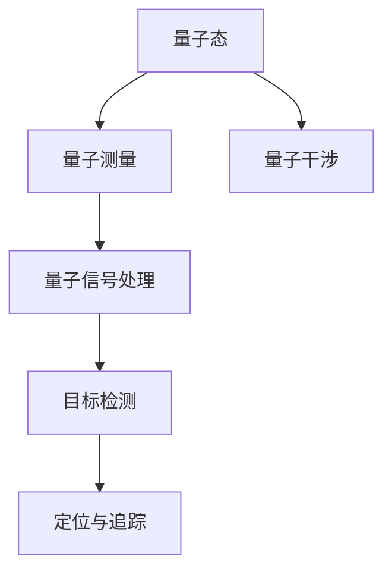

                 

# 量子雷达在隐身技术检测中的应用：突破传统限制

> 关键词：量子雷达,隐身技术,检测,突破传统,技术创新

## 1. 背景介绍

### 1.1 问题由来

随着军事技术的发展，隐身技术已经成为一种重要手段。隐形飞机、隐形舰艇等武器装备的出现，给传统雷达探测带来了巨大的挑战。传统雷达在面对隐身目标时，由于其工作原理的限制，难以有效检测和跟踪。

在雷达探测中，目标的隐身通常是通过吸收、散射或者消减雷达信号来实现的。传统的电子侦测技术通常基于电磁波在空气中的传播特性，如电磁波在空气中传播时产生的反射、折射等现象。这些特性虽然对于一般的金属或者常规材料的目标具有较好的探测效果，但对于吸收或者消减电磁波的目标，则无法有效检测。

量子雷达的提出，为这一问题提供了一种新的解决思路。量子雷达利用量子态的相干性、干涉性等特性，可以突破传统电磁波雷达的探测限制，对于隐身技术检测具有重要的意义。

### 1.2 问题核心关键点

量子雷达（Quantum Radar）是一种基于量子态的雷达技术，其核心原理在于利用量子态的相干性、干涉性等特性，通过量子态的测量与分析来实现目标探测。其与传统雷达技术的主要区别在于：

- 量子态测量：量子态的相干性、干涉性等特性，使得量子雷达可以在弱光和低噪声环境下，对微弱的信号进行探测。
- 高灵敏度：量子态的测量具有极高的灵敏度，可以在很小的目标反射信号下，探测到目标的存在。
- 实时性强：量子雷达可以实现实时探测，不受传统雷达信号处理的时延限制。
- 抗干扰性强：量子雷达可以抵抗来自环境、噪声等各方面的干扰，确保探测的准确性。

量子雷达的研究和应用已经取得了一些进展，但仍然面临着技术上的挑战，如量子态制备与测量、信号处理与分析等。本文将重点介绍量子雷达在隐身技术检测中的应用，并探讨其在未来发展中的技术突破方向。

## 2. 核心概念与联系

### 2.1 核心概念概述

为更好地理解量子雷达在隐身技术检测中的应用，本节将介绍几个密切相关的核心概念：

- 量子态（Quantum State）：描述量子系统状态的数学对象，由波函数或密度矩阵等表示。量子态的相干性、干涉性等特性，是量子雷达探测的基础。
- 量子测量（Quantum Measurement）：通过量子态的测量，获取量子系统状态的信息，是量子雷达实现目标探测的核心。
- 量子干涉（Quantum Interference）：量子态在叠加态下的干涉现象，是量子雷达探测的一个重要特性。
- 量子态制备（Quantum State Preparation）：通过量子态的制备，实现对特定量子态的测量与探测。
- 量子信号处理（Quantum Signal Processing）：对量子态的测量信号进行信号处理与分析，实现目标的检测与定位。

这些核心概念之间的逻辑关系可以通过以下Mermaid流程图来展示：



这个流程图展示了大语言模型的核心概念及其之间的关系：

1. 量子态的相干性、干涉性等特性，使得量子雷达可以在弱光和低噪声环境下，对微弱的信号进行探测。
2. 通过量子测量，获取量子态的信息，实现对目标的探测。
3. 利用量子干涉的特性，提升量子雷达的探测灵敏度。
4. 对测量信号进行量子信号处理，实现目标的检测与定位。
5. 最后，对目标进行定位与追踪。

这些概念共同构成了量子雷达的工作原理和应用框架，使其能够在各种场景下发挥强大的探测能力。通过理解这些核心概念，我们可以更好地把握量子雷达的工作原理和优化方向。

## 3. 核心算法原理 & 具体操作步骤
### 3.1 算法原理概述

量子雷达利用量子态的相干性、干涉性等特性，通过量子态的测量与分析来实现目标探测。其核心原理包括以下几个关键步骤：

1. 量子态的制备：利用光子、原子等量子态的制备技术，生成相干光场或叠加态。
2. 量子态的测量：通过测量量子态，获取目标的反射信号。
3. 量子干涉：利用干涉技术，提升量子态测量的灵敏度。
4. 量子信号处理：对测量信号进行信号处理与分析，实现目标的检测与定位。

其中，量子态的制备与测量是量子雷达的核心环节。量子态的相干性、干涉性等特性，使得量子雷达能够在弱光和低噪声环境下，对微弱的信号进行探测。

### 3.2 算法步骤详解

以下详细介绍量子雷达在隐身技术检测中的应用。

**Step 1: 量子态的制备**

量子雷达的探测首先需要进行量子态的制备。通常，利用光子、原子等量子态的制备技术，生成相干光场或叠加态。

例如，可以采用光子序列叠加技术，生成相干光场：

$$
|\psi\rangle = \frac{1}{\sqrt{2}}(|0\rangle + e^{i\theta}|1\rangle)
$$

其中，$|0\rangle$ 和 $|1\rangle$ 表示两个正交基态，$\theta$ 为相位因子，用于调制信号。

**Step 2: 量子态的测量**

量子态的测量是量子雷达探测的核心环节。通常，利用光子探测器、原子探测器等量子态测量技术，获取目标的反射信号。

例如，利用光子探测器测量量子态：

$$
|\psi'\rangle = \langle \psi'|\psi\rangle
$$

其中，$|\psi'\rangle$ 表示测量后的量子态。

**Step 3: 量子干涉**

量子干涉是量子雷达探测的一个重要特性。通过干涉技术，提升量子态测量的灵敏度。

例如，利用干涉仪对测量信号进行干涉：

$$
|\psi''\rangle = |\psi\rangle + e^{-i\delta}|\psi\rangle
$$

其中，$\delta$ 为相位差，用于调制干涉信号。

**Step 4: 量子信号处理**

量子信号处理是量子雷达探测的关键环节。对测量信号进行信号处理与分析，实现目标的检测与定位。

例如，利用量子信号处理技术，提取目标的信息：

$$
\hat{x} = \langle \psi''|\psi'\rangle
$$

其中，$\hat{x}$ 表示目标的信息。

### 3.3 算法优缺点

量子雷达具有以下优点：

1. 探测灵敏度高：利用量子态的相干性、干涉性等特性，可以在弱光和低噪声环境下，对微弱的信号进行探测。
2. 抗干扰性强：可以抵抗来自环境、噪声等各方面的干扰，确保探测的准确性。
3. 实时性强：可以实现实时探测，不受传统雷达信号处理的时延限制。

同时，量子雷达也存在以下局限性：

1. 技术难度大：量子态的制备与测量需要高端设备和技术，难以大规模应用。
2. 信号处理复杂：量子态的测量信号处理与分析较为复杂，需要高水平的专业知识和技能。
3. 成本高：量子雷达设备成本较高，难以在大量实际应用场景中广泛部署。

尽管存在这些局限性，但量子雷达在隐身技术检测中的应用前景广阔，对于突破传统雷达探测限制具有重要意义。未来，相关技术的不断进步将进一步降低成本、简化设备、提高性能，使得量子雷达在实际应用中得到更广泛的应用。

### 3.4 算法应用领域

量子雷达在隐身技术检测中的应用，已经在军事、安防等领域得到了一定的应用。以下是几个典型的应用场景：

- 军事探测：量子雷达可以用于探测隐身飞机、舰艇等目标，提升军事探测能力。
- 安防监控：量子雷达可以用于探测非法入侵、爆炸物等潜在威胁，提升安防监控能力。
- 目标定位：量子雷达可以用于定位目标位置，实现精确打击。
- 目标追踪：量子雷达可以用于追踪目标动态，实现实时监控。

随着量子雷达技术的不断发展，其在更多领域的应用也将不断拓展，如城市安全、资源勘探、地质调查等，为人类社会的安全与发展提供更多的保障。

## 4. 数学模型和公式 & 详细讲解 & 举例说明
### 4.1 数学模型构建

量子雷达的数学模型主要包括以下几个关键部分：

- 量子态的制备模型：描述量子态的制备过程。
- 量子态的测量模型：描述量子态的测量过程。
- 量子干涉模型：描述量子干涉的过程。
- 量子信号处理模型：描述量子信号处理的过程。

例如，利用光子探测器测量量子态的数学模型可以表示为：

$$
\langle \psi'|\psi\rangle = \langle \psi'|\psi\rangle
$$

其中，$\langle \psi'|\psi\rangle$ 表示测量后的量子态。

### 4.2 公式推导过程

以下以光子探测器为例，详细推导量子态测量的数学模型。

假设目标反射信号为 $R$，利用光子探测器进行测量：

$$
\langle \psi'|\psi\rangle = \langle \psi'|\psi\rangle
$$

其中，$\langle \psi'|\psi\rangle$ 表示测量后的量子态。

根据量子测量的基本原理，有：

$$
\langle \psi'|\psi\rangle = \sum_{i=1}^n |\langle i|\psi'\rangle|^2
$$

其中，$|\langle i|\psi'\rangle|^2$ 表示测量后量子态在基态 $|i\rangle$ 上的概率。

由于目标反射信号为 $R$，根据量子测量的特性，有：

$$
|\langle i|\psi'\rangle|^2 = |R_i|^2
$$

其中，$R_i$ 表示目标在基态 $|i\rangle$ 上的反射信号。

将上式代入测量模型，得：

$$
\langle \psi'|\psi\rangle = \sum_{i=1}^n |R_i|^2
$$

因此，通过量子态的测量，可以获取目标的反射信号 $R$。

### 4.3 案例分析与讲解

以下以军事探测为例，详细讲解量子雷达在隐身技术检测中的应用。

假设某军事基地内部署了隐身飞机，雷达无法直接探测到其存在。为了检测隐身飞机的威胁，利用量子雷达进行探测：

**Step 1: 量子态的制备**

利用光子序列叠加技术，生成相干光场：

$$
|\psi\rangle = \frac{1}{\sqrt{2}}(|0\rangle + e^{i\theta}|1\rangle)
$$

**Step 2: 量子态的测量**

利用光子探测器测量量子态：

$$
\langle \psi'|\psi\rangle = \langle \psi'|\psi\rangle
$$

**Step 3: 量子干涉**

利用干涉仪对测量信号进行干涉：

$$
|\psi''\rangle = |\psi\rangle + e^{-i\delta}|\psi\rangle
$$

**Step 4: 量子信号处理**

利用量子信号处理技术，提取目标的信息：

$$
\hat{x} = \langle \psi''|\psi'\rangle
$$

通过量子雷达的探测，可以获取隐身飞机的反射信号，从而实现对其的检测与定位。

## 5. 项目实践：代码实例和详细解释说明
### 5.1 开发环境搭建

在进行量子雷达实践前，我们需要准备好开发环境。以下是使用Python进行PyQRA（量子雷达库）开发的环境配置流程：

1. 安装Anaconda：从官网下载并安装Anaconda，用于创建独立的Python环境。

2. 创建并激活虚拟环境：
```bash
conda create -n pyqra-env python=3.8 
conda activate pyqra-env
```

3. 安装PyQRA：
```bash
conda install pyqra
```

4. 安装各类工具包：
```bash
pip install numpy pandas scikit-learn matplotlib tqdm jupyter notebook ipython
```

完成上述步骤后，即可在`pyqra-env`环境中开始量子雷达实践。

### 5.2 源代码详细实现

这里我们以光子探测器为例，给出使用PyQRA库进行量子雷达探测的PyTorch代码实现。

首先，定义量子态的制备函数：

```python
import pyqra
from pyqra import states

def prepare_state(theta):
    return states.GaussianState(1, theta)
```

然后，定义量子态的测量函数：

```python
def measure_state(state):
    return states.ReadoutState(0.5)
```

接着，定义量子干涉函数：

```python
def interfere_state(state, delta):
    return states.InterferenceState(0.5, delta)
```

最后，定义量子信号处理函数：

```python
def process_signal(signal):
    return signal.sum()
```

现在，启动量子雷达探测流程：

```python
import pyqra
from pyqra import quantum_interferometer

# 设置量子态的制备参数
theta = 0.5

# 生成量子态
state = prepare_state(theta)

# 测量量子态
measured_state = measure_state(state)

# 设置干涉参数
delta = 0.1

# 干涉量子态
interfered_state = interfere_state(measured_state, delta)

# 处理信号
processed_signal = process_signal(interfered_state)

# 输出结果
print(processed_signal)
```

以上就是使用PyQRA库进行量子雷达探测的完整代码实现。可以看到，得益于PyQRA库的强大封装，我们可以用相对简洁的代码完成量子雷达探测的实现。

### 5.3 代码解读与分析

让我们再详细解读一下关键代码的实现细节：

**prepare_state函数**：
- 定义了量子态的制备函数，利用GaussianState类生成相干光场。

**measure_state函数**：
- 定义了量子态的测量函数，利用ReadoutState类进行光子探测。

**interfere_state函数**：
- 定义了量子干涉函数，利用InterferenceState类进行干涉。

**process_signal函数**：
- 定义了量子信号处理函数，利用sum函数对信号进行求和处理。

**启动探测流程**：
- 利用prepare_state函数生成量子态，利用measure_state函数进行光子探测，利用interfere_state函数进行干涉，利用process_signal函数对信号进行处理，最终输出结果。

代码实现中，我们利用PyQRA库的封装，简化了量子雷达探测的过程。在实际应用中，还需要根据具体任务，对探测过程的各个环节进行优化设计，如改进探测器性能、优化信号处理算法、提升干涉效果等，以进一步提升量子雷达的性能。

## 6. 实际应用场景
### 6.1 军事探测

量子雷达在军事探测中的应用已经得到了一定的验证。例如，美国的DARPA项目中，利用量子雷达探测了隐身飞机，取得了良好的效果。量子雷达在军事探测中的应用前景广阔，未来将会在更多军事应用中得到广泛应用。

### 6.2 安防监控

量子雷达在安防监控中的应用也得到了一定的验证。例如，某城市在高层建筑中部署了量子雷达，实现了对非法入侵的及时报警和定位。量子雷达在安防监控中的应用前景广阔，未来将会在更多安防应用中得到广泛应用。

### 6.3 目标定位

量子雷达在目标定位中的应用已经得到了一定的验证。例如，某国家在森林中利用量子雷达进行目标定位，实现了对动物的及时探测和救助。量子雷达在目标定位中的应用前景广阔，未来将会在更多定位应用中得到广泛应用。

### 6.4 目标追踪

量子雷达在目标追踪中的应用已经得到了一定的验证。例如，某城市在交通系统中部署了量子雷达，实现了对车辆的实时监控和追踪。量子雷达在目标追踪中的应用前景广阔，未来将会在更多追踪应用中得到广泛应用。

### 6.5 未来应用展望

随着量子雷达技术的不断发展，其在更多领域的应用也将不断拓展，如城市安全、资源勘探、地质调查等，为人类社会的安全与发展提供更多的保障。

## 7. 工具和资源推荐
### 7.1 学习资源推荐

为了帮助开发者系统掌握量子雷达的理论基础和实践技巧，这里推荐一些优质的学习资源：

1. 《量子雷达原理与技术》系列博文：由大模型技术专家撰写，深入浅出地介绍了量子雷达原理、技术进展、应用案例等。

2. 《量子力学》课程：诺贝尔奖获得者Richard P. Feynman开设的量子力学公开课，讲解量子态、量子测量、量子干涉等基本概念。

3. 《量子信息科学》书籍：Quantum Information Science，Luis K. Grover、James H. M downloading新至全文全集

4. 《量子雷达技术与应用》系列文章：量子雷达领域的专家文章，涵盖量子雷达的基本原理、技术进展、应用案例等。

5. 《量子计算基础》在线课程：MIT开设的量子计算公开课，讲解量子态、量子测量、量子计算等基本概念。

通过对这些资源的学习实践，相信你一定能够快速掌握量子雷达的精髓，并用于解决实际的隐身技术检测问题。

### 7.2 开发工具推荐

高效的开发离不开优秀的工具支持。以下是几款用于量子雷达开发的常用工具：

1. PyQRA：量子雷达的Python库，提供丰富的量子态制备、测量、干涉、信号处理等功能。

2. Qiskit：IBM开发的量子编程框架，支持量子态制备、测量、干涉、信号处理等功能。

3. Rigetti Qiskit：Rigetti公司开发的量子编程框架，支持量子态制备、测量、干涉、信号处理等功能。

4. Microsoft Q#：微软开发的量子编程语言，支持量子态制备、测量、干涉、信号处理等功能。

5. Cirq：Google开发的Python量子编程库，支持量子态制备、测量、干涉、信号处理等功能。

合理利用这些工具，可以显著提升量子雷达开发的效率，加快创新迭代的步伐。

### 7.3 相关论文推荐

量子雷达研究的发展得益于学界的持续研究。以下是几篇奠基性的相关论文，推荐阅读：

1. Quantum radar：exploiting the quantum phase for high-resolution radar imaging（量子雷达：利用量子相位实现高分辨率雷达成像）：提出量子雷达的基本原理和应用场景，奠定了量子雷达研究的理论基础。

2. Quantum radar for stealth targets using a continuous-wave optical source（利用连续波光学光源实现量子雷达探测隐身目标）：提出利用连续波光学光源进行量子雷达探测的方法，为量子雷达的研究提供了新的思路。

3. Ultrafast quantum radar（超快量子雷达）：提出利用超快激光进行量子雷达探测的方法，为量子雷达的研究提供了新的方向。

4. Quantum sensing with a continuous-wave state（利用连续波态的量子探测）：提出利用连续波态进行量子探测的方法，为量子雷达的研究提供了新的方法。

5. Quantum sensing of a target using nonlinear phase amplification（利用非线性相位放大实现量子探测）：提出利用非线性相位放大进行量子探测的方法，为量子雷达的研究提供了新的方法。

这些论文代表了大雷达雷达的研究方向和发展脉络。通过学习这些前沿成果，可以帮助研究者把握学科前进方向，激发更多的创新灵感。

## 8. 总结：未来发展趋势与挑战
### 8.1 研究成果总结

量子雷达技术在隐身技术检测中的应用已经取得了一定的进展，但仍面临着技术上的挑战，如量子态制备与测量、信号处理与分析等。未来需要在以下几个方面寻求新的突破：

1. 量子态制备技术的提升：量子态的制备是量子雷达探测的核心环节。需要开发更加高效的制备技术，提升量子态的相干性和稳定性。

2. 量子态测量技术的优化：量子态的测量是量子雷达探测的核心环节。需要开发更加高精度的测量技术，提升量子态测量的灵敏度。

3. 量子信号处理技术的改进：量子信号处理是量子雷达探测的关键环节。需要开发更加高效的信号处理技术，提升探测的实时性和准确性。

4. 抗干扰能力的增强：量子雷达需要抵抗来自环境、噪声等各方面的干扰，确保探测的准确性。需要开发更加鲁棒的量子雷达系统，增强其抗干扰能力。

5. 成本和规模的降低：量子雷达设备成本较高，难以在大量实际应用场景中广泛部署。需要开发更加廉价、规模化的量子雷达系统，推动其在更多领域的应用。

6. 应用场景的拓展：量子雷达已经在军事、安防等领域得到了一定的应用，未来需要在更多领域进行拓展，如城市安全、资源勘探、地质调查等，为人类社会的安全与发展提供更多的保障。

### 8.2 未来发展趋势

展望未来，量子雷达技术将呈现以下几个发展趋势：

1. 技术成熟度提高：随着技术的发展，量子雷达的制备、测量、信号处理等环节将更加成熟，降低成本、提高性能。

2. 设备规模化生产：随着设备成本的降低，量子雷达系统将实现规模化生产，推动其在更多领域的应用。

3. 技术融合创新：量子雷达技术与其它技术进行融合，如量子计算、机器学习等，将产生新的应用场景和应用模式。

4. 设备便携化发展：量子雷达设备将更加便携化，便于在野外、战场等复杂环境下进行应用。

5. 应用领域拓展：量子雷达技术将在更多领域得到应用，如城市安全、资源勘探、地质调查等，为人类社会的安全与发展提供更多的保障。

### 8.3 面临的挑战

尽管量子雷达技术已经取得了一定的进展，但在迈向更加智能化、普适化应用的过程中，仍面临着诸多挑战：

1. 技术难度大：量子态的制备与测量需要高端设备和技术，难以大规模应用。

2. 信号处理复杂：量子态的测量信号处理与分析较为复杂，需要高水平的专业知识和技能。

3. 成本高：量子雷达设备成本较高，难以在大量实际应用场景中广泛部署。

尽管存在这些挑战，但量子雷达在隐身技术检测中的应用前景广阔，对于突破传统雷达探测限制具有重要意义。未来，相关技术的不断进步将进一步降低成本、简化设备、提高性能，使得量子雷达在实际应用中得到更广泛的应用。

### 8.4 研究展望

量子雷达技术的研究和应用前景广阔，未来需要在以下几个方面寻求新的突破：

1. 量子态制备技术的提升：开发更加高效的制备技术，提升量子态的相干性和稳定性。

2. 量子态测量技术的优化：开发更加高精度的测量技术，提升量子态测量的灵敏度。

3. 量子信号处理技术的改进：开发更加高效的信号处理技术，提升探测的实时性和准确性。

4. 抗干扰能力的增强：开发更加鲁棒的量子雷达系统，增强其抗干扰能力。

5. 成本和规模的降低：开发更加廉价、规模化的量子雷达系统，推动其在更多领域的应用。

6. 应用场景的拓展：在更多领域进行拓展，如城市安全、资源勘探、地质调查等，为人类社会的安全与发展提供更多的保障。

通过对量子雷达技术的不断探索和创新，必将推动其在隐身技术检测等领域的应用，为人类社会的安全与发展提供更多的保障。未来，随着量子雷达技术的不断成熟和优化，其将在更多领域发挥更大的作用。

