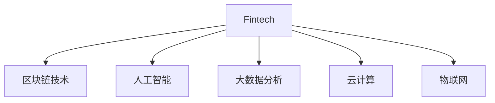

                 

# 金融科技创业：重构金融服务的未来

## 1. 背景介绍

### 1.1 问题由来

金融科技（Fintech）已经成为全球金融业发展的关键推动力量。区块链、人工智能、大数据等技术的应用，极大地提升了金融服务的效率和安全性，推动了金融行业的数字化转型。然而，金融科技创业面临着高成本、强监管、复杂业务逻辑等多重挑战，只有通过创新驱动，才能在激烈的市场竞争中脱颖而出。

### 1.2 问题核心关键点

金融科技创业的核心在于利用先进技术，重构金融服务的流程和模式，提升客户体验和运营效率。通过金融科技手段，可以实现风险控制、客户管理、流程自动化、数据驱动决策等多方面的创新，大幅降低运营成本，提升服务质量。

### 1.3 问题研究意义

研究金融科技创业的方法和技术，对于推动金融行业的数字化转型，促进普惠金融的发展，具有重要意义：

1. **降低运营成本**。金融科技技术能够自动化处理大量重复性工作，减少人工操作，降低人力成本。
2. **提升服务质量**。通过智能算法和大数据分析，可以更精准地识别客户需求，提供个性化服务。
3. **优化风险管理**。通过区块链等技术，可以建立更透明、更安全的交易环境，降低金融风险。
4. **创新业务模式**。通过云计算、物联网等技术，可以构建新的金融业务形态，推动金融服务的泛金融化。
5. **拓展金融边界**。利用金融科技技术，可以拓展金融服务的边界，服务于更多的中小微企业、个人消费者。

## 2. 核心概念与联系

### 2.1 核心概念概述

为更好地理解金融科技创业的方法，本节将介绍几个密切相关的核心概念：

- **金融科技（Fintech）**：利用信息技术手段，提升金融服务的效率和安全性。
- **区块链技术**：去中心化、加密的数据库技术，用于记录交易和资金流转。
- **人工智能（AI）**：通过机器学习和深度学习算法，实现自动化决策和智能推荐。
- **大数据分析**：通过收集和分析海量数据，进行风险评估和用户画像。
- **云计算**：利用云服务基础设施，提供弹性、可扩展的计算资源。
- **物联网（IoT）**：通过传感器和智能设备，收集和传输实时数据。

这些核心概念之间的逻辑关系可以通过以下Mermaid流程图来展示：



这个流程图展示了大数据技术在金融科技中的核心作用：

1. **区块链技术**：用于记录交易和资金流转，保障交易的透明性和安全性。
2. **人工智能技术**：用于自动化决策、风险评估、智能推荐等，提升金融服务的智能化水平。
3. **大数据分析**：用于风险评估、用户画像、市场分析等，提供数据驱动的决策支持。
4. **云计算**：用于存储和处理海量数据，提供弹性计算资源。
5. **物联网技术**：用于实时数据采集和传输，提供全面的数据支持。

这些核心概念共同构成了金融科技的生态系统，使得金融服务能够更加高效、智能、安全。通过理解和应用这些核心概念，可以更好地把握金融科技创业的方向和路径。

## 3. 核心算法原理 & 具体操作步骤
### 3.1 算法原理概述

金融科技创业的算法原理主要涉及以下几个方面：

- **数据分析与建模**：通过大数据分析和机器学习建模，构建预测模型，进行风险评估和用户画像。
- **自动化流程设计**：利用人工智能算法，设计自动化流程，实现流程自动化和智能化。
- **区块链技术应用**：利用区块链技术，记录和验证交易数据，保障交易的透明性和安全性。
- **云计算架构设计**：利用云计算平台，构建弹性、可扩展的计算环境，支撑业务应用。

### 3.2 算法步骤详解

基于金融科技创业的算法原理，我们可以将算法步骤大致分为以下几个阶段：

**Step 1: 数据采集与清洗**

1. **数据来源**：收集金融相关的数据，如交易记录、客户信息、市场数据等。
2. **数据清洗**：清洗不完整、不一致、错误的数据，确保数据质量。

**Step 2: 模型构建与训练**

1. **特征选择**：从清洗后的数据中选择关键特征，构建输入输出映射关系。
2. **模型选择**：选择合适的算法和模型结构，如线性回归、决策树、神经网络等。
3. **模型训练**：利用历史数据训练模型，调整模型参数，提高预测准确性。

**Step 3: 流程自动化与优化**

1. **自动化流程设计**：将模型应用于实际业务流程，自动化处理数据、风险评估、客户管理等任务。
2. **流程优化**：利用机器学习和人工智能算法，优化流程效率和用户体验。

**Step 4: 区块链技术应用**

1. **智能合约设计**：设计智能合约，实现交易自动化和资金流转自动化。
2. **数据上链**：将关键数据记录在区块链上，保障数据透明性和不可篡改性。
3. **验证机制**：利用区块链技术，验证交易数据的真实性和合法性。

**Step 5: 云计算架构设计**

1. **云服务选择**：选择合适的云服务提供商，如AWS、阿里云、腾讯云等。
2. **计算资源配置**：根据业务需求，配置计算资源，包括CPU、内存、存储等。
3. **云平台集成**：将业务应用部署到云平台，实现弹性扩展和高效运营。

### 3.3 算法优缺点

金融科技创业的算法原理具有以下优点：

1. **高效性**：自动化流程设计和机器学习算法能够大大提升处理效率，减少人工操作。
2. **智能性**：通过数据分析和机器学习建模，可以提供智能化的决策支持。
3. **安全性**：利用区块链技术，记录和验证交易数据，保障交易的透明性和安全性。
4. **弹性扩展**：利用云计算架构，可以根据业务需求弹性扩展计算资源，满足不断增长的业务需求。

同时，该方法也存在一些局限性：

1. **数据质量要求高**：算法模型依赖高质量的数据输入，数据清洗和预处理是关键步骤。
2. **模型复杂度高**：复杂的机器学习模型需要大量的计算资源和时间，可能影响系统的响应速度。
3. **安全性挑战**：区块链技术虽然提高了数据安全性，但仍然面临技术漏洞和攻击风险。
4. **成本高**：云计算和区块链技术的部署和维护成本较高，需要较大的初始投资。

尽管存在这些局限性，但就目前而言，金融科技创业的算法原理仍然是大数据和人工智能技术在金融领域应用的重要范式。未来相关研究的重点在于如何进一步降低技术成本，提高数据处理效率，同时兼顾安全性和隐私保护等因素。

### 3.4 算法应用领域

金融科技创业的算法原理在金融行业的应用已经相当广泛，涵盖了以下几个主要领域：

- **智能投顾**：利用大数据分析和机器学习算法，为客户提供个性化投资建议和资产管理。
- **风险管理**：通过数据分析和模型预测，进行信用评估、风险预警和欺诈检测。
- **客户管理**：利用智能算法和大数据分析，实现客户画像、客户流失预测和客户忠诚度管理。
- **智能合同**：利用区块链技术，设计智能合约，实现自动化交易和资金流转。
- **金融云服务**：利用云计算平台，提供弹性、可扩展的金融云服务，支持各种金融业务应用。

除了上述这些核心领域，金融科技创业的算法原理还在供应链金融、普惠金融、保险业务等多个场景中得到应用，推动了金融行业的数字化转型和创新发展。

## 4. 数学模型和公式 & 详细讲解 & 举例说明

### 4.1 数学模型构建

在金融科技创业中，常见的数学模型包括回归模型、分类模型、聚类模型等。这里以回归模型为例，简要介绍模型构建的过程。

假设金融数据集为 $D=\{(x_i, y_i)\}_{i=1}^N$，其中 $x_i$ 为输入特征，$y_i$ 为输出目标变量。回归模型的目标是找到一个线性或非线性的函数 $f(x)$，使得预测值 $f(x_i)$ 与真实值 $y_i$ 的差异最小化。常用的回归模型包括线性回归、多项式回归、决策树回归等。

### 4.2 公式推导过程

以线性回归模型为例，其目标函数为：

$$
\min_{\beta} \frac{1}{N}\sum_{i=1}^N (y_i - \beta^T x_i)^2
$$

其中 $\beta$ 为模型参数，$x_i$ 为输入特征向量，$y_i$ 为输出目标值。通过求解上述目标函数的最小值，可以确定最优的模型参数 $\beta$。

模型的损失函数为：

$$
L(\beta) = \frac{1}{N}\sum_{i=1}^N (y_i - \beta^T x_i)^2
$$

通过梯度下降等优化算法，可以不断更新模型参数 $\beta$，最小化损失函数 $L(\beta)$。

### 4.3 案例分析与讲解

以信用评分模型为例，模型的输入特征可能包括年龄、收入、负债率、还款记录等。通过机器学习算法，可以构建一个信用评分模型，用于预测客户的信用风险。具体步骤如下：

1. **数据收集**：收集历史贷款数据，包括客户的年龄、收入、负债率、还款记录等。
2. **数据清洗**：清洗缺失、异常的数据，确保数据质量。
3. **特征选择**：选择关键特征，构建输入输出映射关系。
4. **模型训练**：选择线性回归或决策树等模型，利用历史数据训练模型，调整模型参数。
5. **模型评估**：在测试集上评估模型性能，选择最优模型。
6. **模型应用**：将模型应用于实际业务，预测新客户的信用风险。

## 5. 项目实践：代码实例和详细解释说明

### 5.1 开发环境搭建

在进行金融科技创业的算法实践前，我们需要准备好开发环境。以下是使用Python进行Scikit-learn开发的环境配置流程：

1. 安装Anaconda：从官网下载并安装Anaconda，用于创建独立的Python环境。
2. 创建并激活虚拟环境：
```bash
conda create -n fintech-env python=3.8 
conda activate fintech-env
```

3. 安装Scikit-learn：
```bash
pip install scikit-learn
```

4. 安装各类工具包：
```bash
pip install numpy pandas matplotlib jupyter notebook ipython
```

完成上述步骤后，即可在`fintech-env`环境中开始金融科技创业的算法实践。

### 5.2 源代码详细实现

这里我们以信用评分模型为例，给出使用Scikit-learn进行线性回归建模的Python代码实现。

```python
from sklearn.linear_model import LinearRegression
from sklearn.model_selection import train_test_split
from sklearn.metrics import mean_squared_error

# 加载数据
X = ...  # 输入特征数据
y = ...  # 输出目标数据

# 数据划分
X_train, X_test, y_train, y_test = train_test_split(X, y, test_size=0.2, random_state=42)

# 模型训练
model = LinearRegression()
model.fit(X_train, y_train)

# 模型评估
y_pred = model.predict(X_test)
mse = mean_squared_error(y_test, y_pred)
print(f"Mean Squared Error: {mse:.3f}")
```

以上是使用Scikit-learn进行线性回归建模的完整代码实现。可以看到，Scikit-learn提供了简单易用的API接口，使得模型训练和评估变得非常容易。

### 5.3 代码解读与分析

让我们再详细解读一下关键代码的实现细节：

**数据加载与划分**：
- `train_test_split`方法：将数据集划分为训练集和测试集，比例为80%和20%。
- `LinearRegression`类：定义线性回归模型，继承自`LinearModel`基类，提供了丰富的模型配置和优化方法。

**模型训练**：
- `fit`方法：利用训练集数据对模型进行训练，优化模型参数。
- `predict`方法：在测试集上对新数据进行预测。

**模型评估**：
- `mean_squared_error`函数：计算预测值和真实值之间的均方误差。

**结果展示**：
- `print`函数：输出评估结果，直观展示模型的预测性能。

可以看出，Scikit-learn的API设计非常简洁高效，能够极大提升金融科技创业的算法实践效率。开发者可以将更多精力放在数据处理、模型设计等高层逻辑上，而不必过多关注底层的实现细节。

当然，工业级的系统实现还需考虑更多因素，如模型的保存和部署、超参数的自动搜索、更灵活的模型接口等。但核心的算法原理和代码实现基本与此类似。

## 6. 实际应用场景

### 6.1 智能投顾

基于金融科技创业的算法原理，可以构建智能投顾系统，为客户提供个性化投资建议和资产管理服务。

具体而言，可以收集客户的年龄、收入、风险偏好等信息，利用机器学习算法构建客户画像，推荐适合的投资组合和资产管理方案。同时，通过数据分析和模型预测，实时监控市场变化，动态调整投资策略，最大程度地提高投资收益。

### 6.2 风险管理

利用金融科技创业的算法原理，可以实现精细化的风险管理，降低金融风险。

通过大数据分析和机器学习建模，可以建立信用评分模型、风险评估模型、欺诈检测模型等，对客户的信用风险、交易风险进行实时监控和预警。同时，利用区块链技术，记录和验证交易数据，保障交易的透明性和安全性。

### 6.3 客户管理

基于金融科技创业的算法原理，可以构建客户管理平台，提升客户体验和运营效率。

通过大数据分析和机器学习算法，可以实现客户流失预测、客户忠诚度管理、客户服务质量评估等功能。同时，利用智能算法和大数据分析，进行客户画像、个性化推荐、客户关系管理等，提升客户满意度和忠诚度。

### 6.4 智能合同

利用金融科技创业的算法原理，可以构建智能合同平台，实现自动化交易和资金流转。

通过区块链技术和智能合约设计，可以自动化处理交易流程，实现交易的自动化和资金流转的透明化。同时，利用数据分析和模型预测，实时监控交易风险，及时预警和处理异常交易，保障交易的顺利进行。

### 6.5 金融云服务

基于金融科技创业的算法原理，可以构建金融云服务平台，提供弹性、可扩展的计算资源。

通过云计算平台，可以提供高性能、高可扩展的计算资源，支撑各种金融业务应用。同时，利用数据分析和机器学习算法，提供风险评估、客户管理、智能投顾等功能，提升金融服务的智能化水平。

## 7. 工具和资源推荐

### 7.1 学习资源推荐

为了帮助开发者系统掌握金融科技创业的方法和算法，这里推荐一些优质的学习资源：

1. **《Python数据科学手册》**：介绍Python在数据科学和机器学习中的应用，涵盖金融科技创业中的关键算法和工具。
2. **Kaggle金融数据集**：提供丰富的金融数据集和竞赛，帮助开发者学习和实践金融科技创业中的数据分析和建模技术。
3. **Scikit-learn官方文档**：提供了详细的API文档和案例分析，是学习和实践机器学习算法的重要资源。
4. **Google Cloud Financial Services**：提供金融云服务的文档和示例代码，帮助开发者构建和部署金融云应用。
5. **IBM Watson Finance**：提供金融数据分析和智能服务，帮助开发者利用AI技术进行金融数据分析和决策支持。

通过对这些资源的学习实践，相信你一定能够快速掌握金融科技创业的算法原理，并用于解决实际的金融问题。

### 7.2 开发工具推荐

高效的开发离不开优秀的工具支持。以下是几款用于金融科技创业开发的常用工具：

1. **Jupyter Notebook**：交互式编程环境，支持Python、R、Scala等多种编程语言，方便快速迭代和实验。
2. **TensorFlow**：由Google主导开发的深度学习框架，生产部署方便，适合大规模工程应用。
3. **Scikit-learn**：Python科学计算库，提供丰富的机器学习算法和工具，是数据科学和金融科技创业的重要支持。
4. **Kaggle**：数据科学竞赛平台，提供丰富的金融数据集和竞赛，帮助开发者学习和实践金融科技创业中的数据分析和建模技术。
5. **AWS**：亚马逊云服务，提供弹性、可扩展的计算资源，适合大规模金融科技创业应用。

合理利用这些工具，可以显著提升金融科技创业的开发效率，加快创新迭代的步伐。

### 7.3 相关论文推荐

金融科技创业的算法原理在金融行业的应用已经相当广泛，以下是几篇奠基性的相关论文，推荐阅读：

1. **《金融科技创业：构建智能投顾系统》**：研究如何利用机器学习和数据分析技术，构建智能投顾系统，提升客户体验和投资收益。
2. **《利用大数据分析进行风险管理》**：探讨如何使用大数据分析和机器学习建模，构建信用评分模型和风险评估模型，降低金融风险。
3. **《金融科技创业中的客户管理》**：介绍如何利用数据分析和机器学习算法，实现客户画像、客户流失预测、客户忠诚度管理等功能，提升客户体验和运营效率。
4. **《智能合同的设计与实现》**：研究如何利用区块链技术和智能合约设计，实现交易的自动化和资金流转的透明化，提升交易效率和安全性。
5. **《云计算在金融科技创业中的应用》**：探讨如何利用云计算平台，提供弹性、可扩展的计算资源，支撑金融科技创业应用。

这些论文代表了大数据和人工智能技术在金融行业应用的发展脉络。通过学习这些前沿成果，可以帮助研究者把握金融科技创业的最新趋势和技术方向。

## 8. 总结：未来发展趋势与挑战

### 8.1 总结

本文对金融科技创业的方法和算法进行了全面系统的介绍。首先阐述了金融科技创业的背景和核心关键点，明确了算法原理在提升金融服务效率和质量方面的独特价值。其次，从原理到实践，详细讲解了回归模型、自动化流程设计、区块链技术应用、云计算架构设计等算法步骤，给出了金融科技创业的完整代码实现。同时，本文还广泛探讨了金融科技创业在智能投顾、风险管理、客户管理、智能合同、金融云服务等多个领域的应用前景，展示了算法的广阔应用空间。此外，本文精选了金融科技创业的学习资源，力求为读者提供全方位的技术指引。

通过本文的系统梳理，可以看到，金融科技创业的算法原理正在成为金融行业数字化转型的重要推动力，极大地提升了金融服务的智能化水平，推动了金融行业的创新发展。未来，伴随算法原理的持续演进，金融科技创业必将在构建智能化的金融服务体系中扮演越来越重要的角色。

### 8.2 未来发展趋势

展望未来，金融科技创业的算法原理将呈现以下几个发展趋势：

1. **智能化水平提升**：利用深度学习和大数据技术，提升金融服务的智能化水平，实现自动化的风险评估、智能投顾等功能。
2. **多模态融合**：利用大数据分析和人工智能技术，融合语音、图像、文本等多模态数据，提供全面的数据分析和决策支持。
3. **数据驱动决策**：通过数据分析和机器学习建模，提供数据驱动的决策支持，提升金融服务的精准度和效率。
4. **安全与隐私保护**：利用区块链技术和加密算法，保障交易数据和用户隐私的安全性，提升系统的可信度。
5. **弹性扩展**：利用云计算平台，提供弹性、可扩展的计算资源，支持大规模金融科技创业应用。

以上趋势凸显了金融科技创业的算法原理在大数据和人工智能技术应用中的广阔前景。这些方向的探索发展，必将进一步提升金融服务的智能化水平，推动金融行业的数字化转型和创新发展。

### 8.3 面临的挑战

尽管金融科技创业的算法原理已经取得了瞩目成就，但在迈向更加智能化、普惠化应用的过程中，它仍面临着诸多挑战：

1. **数据质量问题**：金融数据往往存在缺失、异常、噪声等问题，影响算法的准确性和可靠性。如何提高数据质量，是算法原理的重要挑战。
2. **计算资源限制**：深度学习和大数据建模需要大量的计算资源，如何降低计算成本，提高系统效率，是算法原理的重要研究方向。
3. **隐私和安全问题**：金融数据涉及用户隐私和金融安全，如何保护用户隐私和金融安全，是算法原理的重要课题。
4. **模型解释性不足**：深度学习模型往往难以解释其内部工作机制，如何提高模型的解释性和可理解性，是算法原理的重要研究方向。
5. **业务逻辑复杂**：金融业务逻辑复杂，涉及交易规则、风险控制、合规监管等多方面的要求，如何结合业务逻辑，设计合适的算法模型，是算法原理的重要挑战。

尽管存在这些挑战，但随着金融科技创业的算法原理持续演进，相关的研究和技术手段也在不断进步。相信未来的金融科技创业必将在智能化、普惠化和安全性方面取得更大的突破，为金融行业的数字化转型带来新的动力。

### 8.4 研究展望

面对金融科技创业的算法原理所面临的种种挑战，未来的研究需要在以下几个方面寻求新的突破：

1. **数据质量提升**：开发数据清洗和预处理工具，提高数据质量和可用性。
2. **模型压缩与优化**：开发模型压缩和优化技术，降低计算成本，提高系统效率。
3. **隐私保护与安全**：利用区块链技术和加密算法，保障数据隐私和安全。
4. **模型解释性增强**：开发可解释的深度学习模型，提高模型的解释性和可理解性。
5. **业务逻辑融合**：结合金融业务逻辑，设计合适的算法模型，提升金融服务的精准度和效率。

这些研究方向的探索，必将引领金融科技创业的算法原理走向更高的台阶，为构建安全、可靠、智能的金融服务体系铺平道路。面向未来，金融科技创业的算法原理还需要与其他人工智能技术进行更深入的融合，如知识表示、因果推理、强化学习等，多路径协同发力，共同推动金融服务的智能化和普惠化发展。

## 9. 附录：常见问题与解答

**Q1：如何选择合适的机器学习算法？**

A: 选择合适的机器学习算法需要综合考虑以下几个因素：
1. 数据类型：根据数据类型（如数值型、分类型、文本型等）选择合适的算法。
2. 数据规模：对于大规模数据集，需要选择高效的算法（如随机森林、梯度提升树等）。
3. 业务需求：根据业务需求（如预测、分类、聚类等）选择合适的算法。
4. 模型解释性：对于需要解释模型决策的过程，需要选择可解释的算法（如线性回归、决策树等）。
5. 模型复杂度：根据数据复杂度和模型复杂度，选择适合的算法。

**Q2：如何提高数据质量？**

A: 提高数据质量的方法包括：
1. 数据清洗：去除缺失、异常、噪声数据。
2. 数据标准化：对数据进行标准化处理，提高数据一致性。
3. 特征工程：提取和构造有意义的特征，提高特征质量。
4. 数据增强：通过数据增强技术（如旋转、裁剪等），丰富数据集。
5. 数据采样：通过随机采样、分层采样等方法，平衡数据集。

**Q3：如何降低计算成本？**

A: 降低计算成本的方法包括：
1. 模型压缩：利用模型压缩技术（如剪枝、量化等），降低模型大小和计算资源需求。
2. 分布式计算：利用分布式计算平台（如Spark、Hadoop等），提高计算效率。
3. 硬件优化：利用GPU、TPU等高性能计算设备，提高计算速度。
4. 算法优化：利用优化算法（如随机梯度下降、小批量梯度下降等），提高计算效率。

**Q4：如何保障数据隐私和安全？**

A: 保障数据隐私和安全的方法包括：
1. 数据加密：对敏感数据进行加密处理，防止数据泄露。
2. 访问控制：对数据进行访问控制，限制非法访问。
3. 匿名化处理：对数据进行匿名化处理，保护用户隐私。
4. 区块链技术：利用区块链技术，保障数据透明性和不可篡改性。
5. 安全审计：定期进行安全审计，发现和修复安全漏洞。

**Q5：如何提升模型解释性？**

A: 提升模型解释性的方法包括：
1. 可解释模型：选择可解释的模型（如线性回归、决策树等），提高模型可理解性。
2. 特征重要性：利用特征重要性分析，了解模型对输出的影响。
3. 模型可视化：利用可视化工具（如Shapley值、LIME等），展示模型决策过程。
4. 模型融合：利用模型融合技术（如Stacking、Bagging等），提高模型解释性。

这些研究方向的探索，必将引领金融科技创业的算法原理走向更高的台阶，为构建安全、可靠、智能的金融服务体系铺平道路。面向未来，金融科技创业的算法原理还需要与其他人工智能技术进行更深入的融合，如知识表示、因果推理、强化学习等，多路径协同发力，共同推动金融服务的智能化和普惠化发展。

